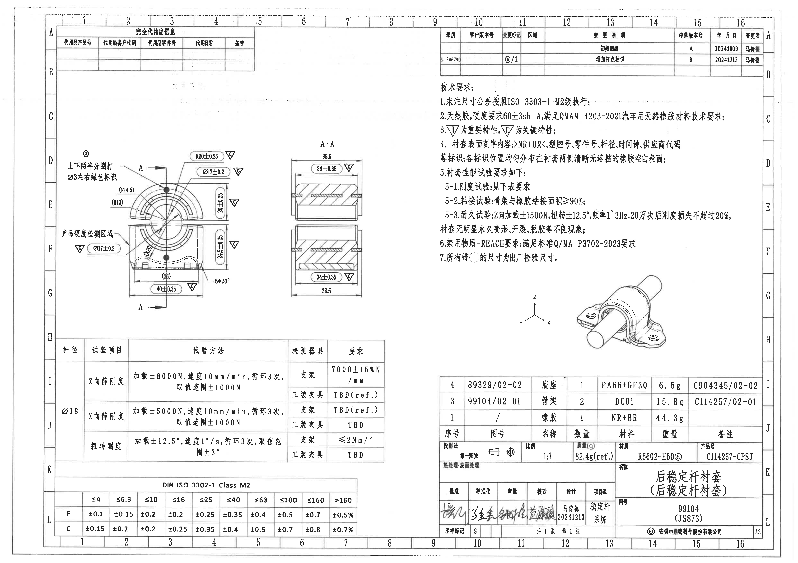
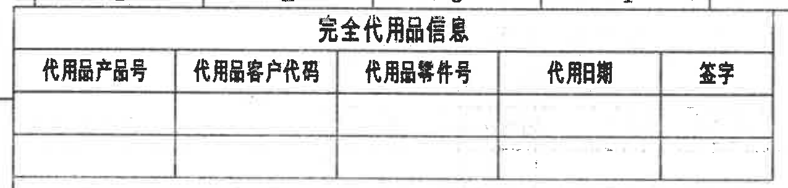
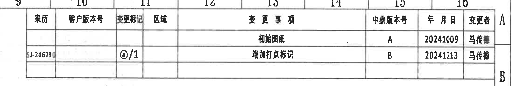
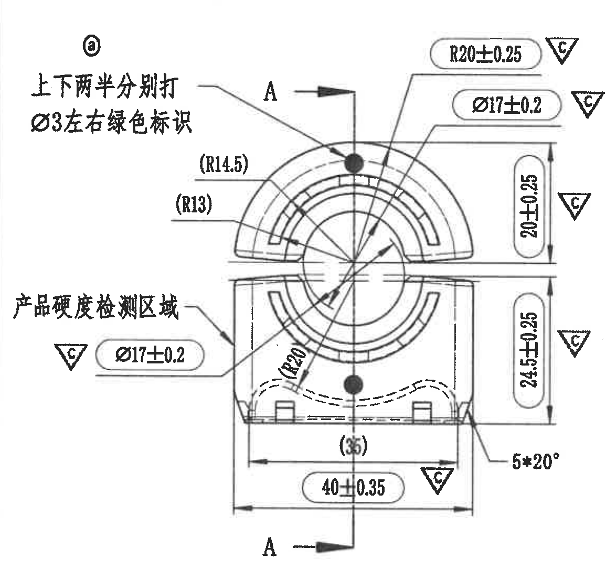
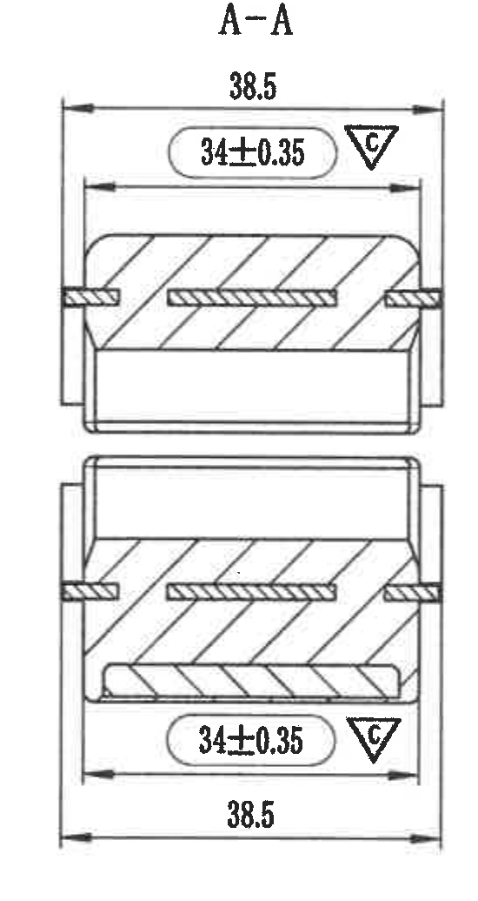
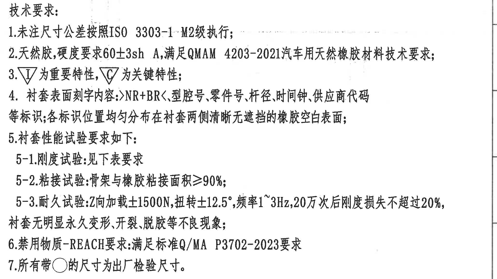
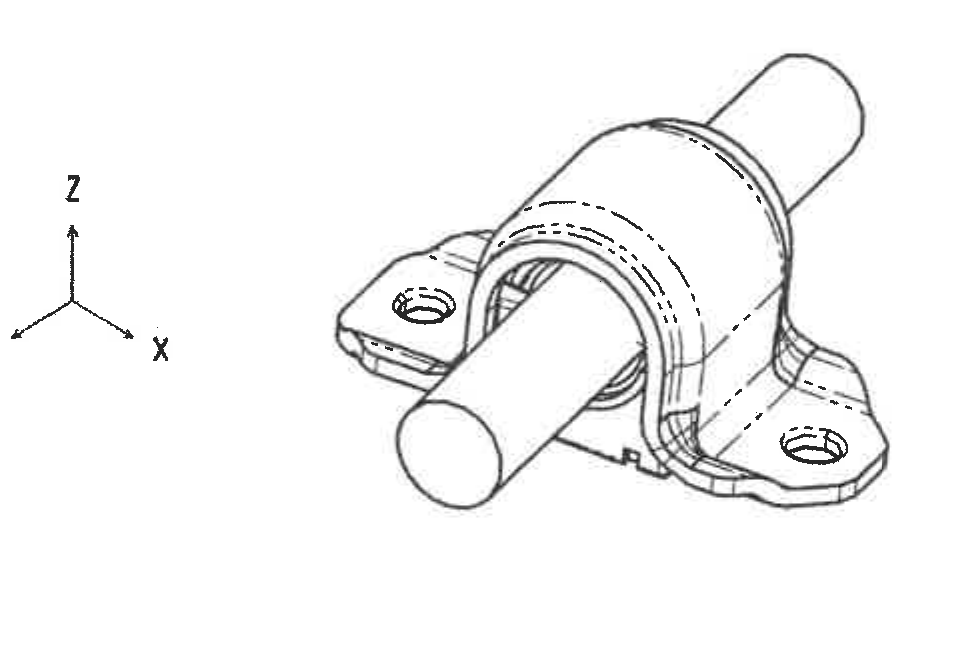
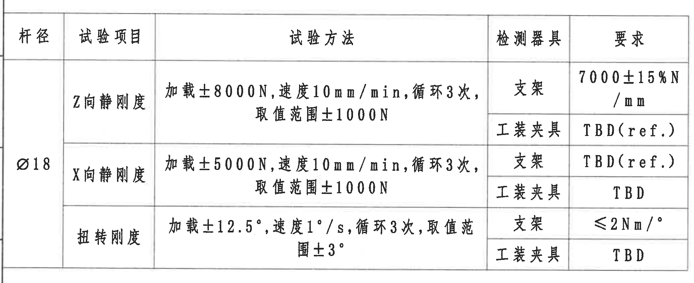
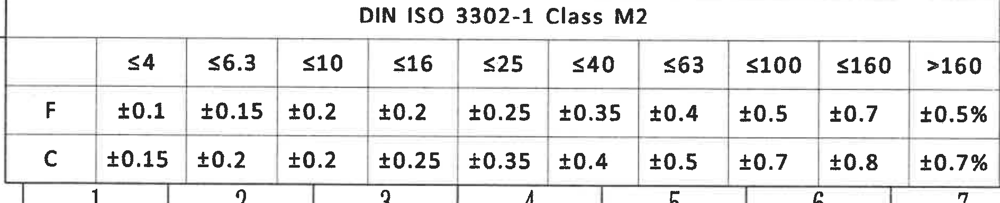
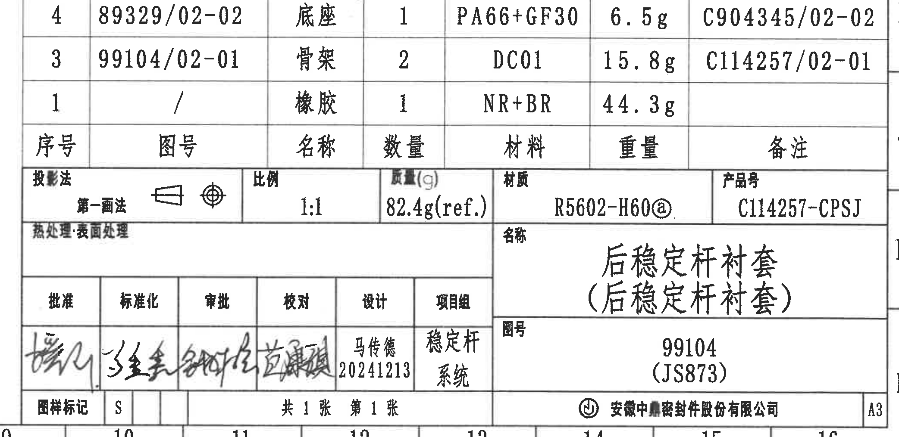

# 20C114257.pdf 内容识别

## 整页 PNG

## 完全代用品信息

| 代用品产品号 | 代用品客户代码 | 代用品零件号 | 代用日期 | 签字 |
|---|---|---|---|---|
|  |  |  |  |  |
|  |  |  |  |  |

识别说明：该表为空表，仅保留表头与两行空白记录区域。

## 变更记录

| 来历 | 客户版本号 | 变更标记 | 区域 | 变更事项 | 中鼎版本号 | 年月日 | 变更者 |
|---|---|---|---|---|---|---|---|
|  |  |  |  | 初始图纸 | A | 20241009 | 马传馨 |
| SJ-246290 |  | ⓐ/1 |  | 增加打点标识 | B | 20241213 | 马传巍 |
|  |  |  |  |  |  |  |  |

识别说明：变更标记“ⓐ/1”对应图中主视图左上方的圈 a 标记，变更事项为“增加打点标识”。

## 主加工视图

### 图内文字

- ⓐ
- 上下两半分别打 Ø3 左右绿色标识
- 产品硬度检测区域
- A-A 剖切位置：图中竖向中心线，两端以 A 和箭头标出剖切方向。

### 尺寸、弧度和标注

| 图中标注 | 识别内容 | 含义说明 |
|---|---|---|
| R20±0.25 | 外侧圆弧半径 R20，公差 ±0.25 | 上半圆外侧轮廓的关键半径尺寸，旁带关键特性符号。 |
| Ø17±0.2 | 内孔/配合孔直径 Ø17，公差 ±0.2 | 图中上下两处均标注该直径，表示衬套内圆相关尺寸要求，旁带关键特性符号。 |
| (R14.5) | 参考圆弧半径 R14.5 | 括号尺寸，为参考尺寸。 |
| (R13) | 参考圆弧半径 R13 | 括号尺寸，为参考尺寸。 |
| (R20) | 参考圆弧半径 R20 | 括号尺寸，位于下半部分内侧弧线附近。 |
| 20±0.25 | 上半部分高度 20，公差 ±0.25 | 右侧竖向尺寸，旁带关键特性符号。 |
| 24.5±0.25 | 下半部分高度 24.5，公差 ±0.25 | 右侧竖向尺寸，旁带关键特性符号。 |
| (35) | 参考宽度 35 | 括号尺寸，位于底部内侧宽度方向。 |
| 40±0.35 | 总宽度 40，公差 ±0.35 | 底部水平宽度尺寸，旁带关键特性符号。 |
| 5*20° | 5 处、20°角度要求 | 右下角局部角度/倒角类标注。 |
| △C | 关键特性符号 | 多处随尺寸出现，表示关键特性。 |

## A-A 剖面视图

| 图中标注 | 识别内容 | 含义说明 |
|---|---|---|
| A-A | 剖面名称 | 对应主视图中 A-A 剖切线。 |
| 38.5 | 外侧宽度 38.5 | 上、下剖面均给出该总宽度。 |
| 34±0.35 | 内侧/功能宽度 34，公差 ±0.35 | 上、下剖面均给出，旁带关键特性符号。 |
| 剖面线 | 斜线填充区域 | 表示被剖切到的材料实体。 |
| △C | 关键特性符号 | 对 34±0.35 尺寸标注关键特性。 |

## 技术要求 / NOTES

1. 未注尺寸公差按照 ISO 3303-1 M2 级执行；
2. 天然胶，硬度要求 60±3sh A，满足 QMAM 4203-2021 汽车用天然橡胶材料技术要求；
3. ▽I 为重要特性，▽C 为关键特性；
4. 衬套表面刻字内容：`>NR+BR<`、型腔号、零件号、杆径、时间钟、供应商代码等标识；各标识位置均匀分布在衬套两侧清晰无遮挡的橡胶空白表面；
5. 衬套性能试验要求如下：
5-1. 刚度试验：见下表要求
5-2. 粘接试验：骨架与橡胶粘接面积 ≥90%；
5-3. 耐久试验：Z 向加载 ±1500N，扭转 ±12.5°，频率 1~3Hz，20 万次后刚度损失不超过 20%，衬套无明显永久变形、开裂、脱胶等不良现象；
6. 禁用物质-REACH 要求：满足标准 Q/MA P3702-2023 要求
7. 所有带 ○ 的尺寸为出厂检验尺寸。

## 轴测示意图

识别内容：

- 坐标方向：X、Y、Z。
- 零件形态：后稳定杆衬套安装在圆杆上，两侧有带孔底座/耳板结构。
- 该视图为外形示意，不含独立尺寸数值；尺寸要求以主加工视图和 A-A 剖面视图为准。

## 试验要求表

| 杆径 | 试验项目 | 试验方法 | 检测器具 | 要求 |
|---|---|---|---|---|
| Ø18 | Z 向静刚度 | 加载 ±8000N，速度 10mm/min，循环 3 次，取值范围 ±1000N | 支架 | 7000±15%N/mm |
| Ø18 | Z 向静刚度 | 加载 ±8000N，速度 10mm/min，循环 3 次，取值范围 ±1000N | 工装夹具 | TBD(ref.) |
| Ø18 | X 向静刚度 | 加载 ±5000N，速度 10mm/min，循环 3 次，取值范围 ±1000N | 支架 | TBD(ref.) |
| Ø18 | X 向静刚度 | 加载 ±5000N，速度 10mm/min，循环 3 次，取值范围 ±1000N | 工装夹具 | TBD |
| Ø18 | 扭转刚度 | 加载 ±12.5°，速度 1°/s，循环 3 次，取值范围 ±3° | 支架 | ≤2Nm/° |
| Ø18 | 扭转刚度 | 加载 ±12.5°，速度 1°/s，循环 3 次，取值范围 ±3° | 工装夹具 | TBD |

识别说明：表格与技术要求第 5-1 条对应，用于规定刚度试验的加载、速度、循环次数、取值范围、检测器具和判定要求。

## 未注尺寸公差表

DIN ISO 3302-1 Class M2

|  | ≤4 | ≤6.3 | ≤10 | ≤16 | ≤25 | ≤40 | ≤63 | ≤100 | ≤160 | >160 |
|---|---|---|---|---|---|---|---|---|---|---|
| F | ±0.1 | ±0.15 | ±0.2 | ±0.2 | ±0.25 | ±0.35 | ±0.4 | ±0.5 | ±0.7 | ±0.5% |
| C | ±0.15 | ±0.2 | ±0.2 | ±0.25 | ±0.35 | ±0.4 | ±0.5 | ±0.7 | ±0.8 | ±0.7% |

识别说明：该表用于未注尺寸公差，技术要求第 1 条指定按 ISO/DIN ISO 3302-1 M2 级执行。

## 明细表、图框信息和标题栏

### 明细表

| 序号 | 图号 | 名称 | 数量 | 材料 | 重量 | 备注 |
|---|---|---|---|---|---|---|
| 4 | 89329/02-02 | 底座 | 1 | PA66+GF30 | 6.5g | C904345/02-02 |
| 3 | 99104/02-01 | 骨架 | 2 | DC01 | 15.8g | C114257/02-01 |
| 1 | / | 橡胶 | 1 | NR+BR | 44.3g |  |

### 标题栏与图纸信息

| 项目 | 内容 |
|---|---|
| 投影法 | 第一画法 |
| 比例 | 1:1 |
| 重量(g) | 82.4g(ref.) |
| 材质 | R5602-H60@ |
| 产品号 | C114257-CPSJ |
| 热处理/表面处理 | 表面处理 |
| 名称 | 后稳定杆衬套（后稳定杆衬套） |
| 图号 | 99104（JS873） |
| 项目组 | 稳定杆系统 |
| 设计 | 马传德 20241213 |
| 图样标记 | S |
| 页数 | 共 1 张 第 1 张 |
| 公司 | 安徽中鼎密封件股份有限公司 |
| 图幅 | A3 |

签署栏：

| 批准 | 标准化 | 审批 | 校对 | 设计 | 项目组 |
|---|---|---|---|---|---|
| 手写签名，未识别 | 手写签名，未识别 | 手写签名，未识别 | 手写签名，未识别 | 马传德 20241213 | 稳定杆系统 |

识别说明：标题栏给出本图的零件名称、图号、产品号、材料/重量、比例、图幅、页数和责任栏信息；明细表列出底座、骨架、橡胶三类组成项。

## 裁切完整性检查

| 图片 | 检查结果 |
|---|---|
| 20C114257_02_substitute_info_table.png | 表头和空白行完整。 |
| 20C114257_03_revision_table.png | 表头、两条变更记录和左侧来源列完整。 |
| 20C114257_04_main_processing_view.png | 主视图尺寸线、引线、文字和关键特性符号完整；未混入 A-A 剖视尺寸。 |
| 20C114257_05_section_A-A.png | 剖面视图、上下 34±0.35 和 38.5 标注完整；未混入主视图尺寸。 |
| 20C114257_06_notes.png | 技术要求 1-7 条完整。 |
| 20C114257_07_isometric_view.png | 轴测示意和 X/Y/Z 坐标完整。 |
| 20C114257_08_test_table.png | 表格边框、行列和全部要求完整。 |
| 20C114257_09_tolerance_table.png | DIN ISO 3302-1 Class M2 公差表完整。 |
| 20C114257_10_bom_title_block.png | 明细表、标题栏、签署栏和公司/图幅信息完整。 |
