# 20C114308.pdf 内容识别

源文件：`20C114308.pdf`  
整页渲染图：`outputs/20C114308_assets/images/page_full.png`

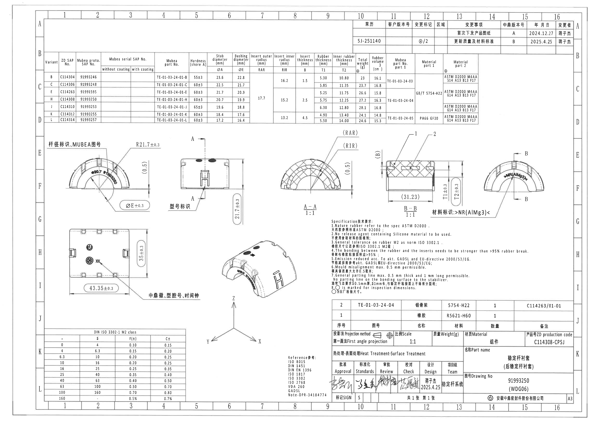

## 上方变更履历表

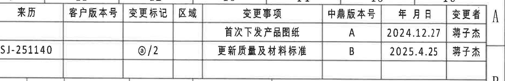

| 来历 | 客户版本号 | 变更标记 | 区域 | 变更事项 | 中鼎版本号 | 年月日 | 变更者 |
|---|---|---|---|---|---|---|---|
|  |  |  |  | 首次下发产品图纸 | A | 2024.12.27 | 蒋子杰 |
| SJ-251140 |  | @/2 |  | 更新质量及材料标准 | B | 2025.4.25 | 蒋子杰 |

含义：该表记录图纸版本变更。当前图纸中鼎版本号为 `B`，变更内容为“更新质量及材料标准”，日期为 `2025.4.25`。

## 上方规格/变型参数表

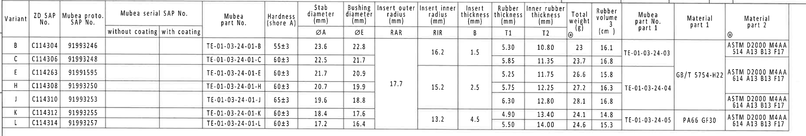

| Variant | ZD SAP No. | Mubea proto. SAP No. | Mubea serial SAP No. without coating | Mubea serial SAP No. with coating | Mubea part No. | Hardness shore A | Stab diameter ØA mm | Bushing diameter ØE mm | Insert outer radius RAR mm | Insert inner radius RIR mm | Insert thickness B mm | Rubber thickness T1 mm | Inner rubber thickness T2 mm | Total weight g | Rubber volume cm3 | Mubea part No. part 1 | Material part 1 | Material part 2 |
|---|---|---|---|---|---|---|---:|---:|---:|---:|---:|---:|---:|---:|---:|---|---|---|
| B | C114304 | 91993246 |  |  | TE-01-03-24-01-B | 55±3 | 23.6 | 22.8 |  | 16.2 | 1.5 | 5.30 | 10.80 | 23 | 16.1 | TE-01-03-24-03 |  | ASTM D2000 M4AA 514 A13 B13 F17 |
| C | C114306 | 91993248 |  |  | TE-01-03-24-01-C | 60±3 | 22.5 | 21.7 | 17.7 |  |  | 5.85 | 11.35 | 23.7 | 16.8 |  | GB/T 5754-H22 | ASTM D2000 M4AA 614 A13 B13 F17 |
| E | C114263 | 91991595 |  |  | TE-01-03-24-01-E | 60±3 | 21.7 | 20.9 |  |  |  | 5.25 | 11.75 | 26.6 | 15.8 | TE-01-03-24-04 |  |  |
| H | C114308 | 91993250 |  |  | TE-01-03-24-01-H | 60±3 | 20.7 | 19.9 | 17.7 | 15.2 | 2.5 | 5.75 | 12.25 | 27.2 | 16.3 | TE-01-03-24-04 |  |  |
| J | C114310 | 91993253 |  |  | TE-01-03-24-01-J | 65±3 | 19.6 | 18.8 |  |  |  | 6.30 | 12.80 | 28.1 | 16.8 |  |  |  |
| K | C114312 | 91993255 |  |  | TE-01-03-24-01-K | 60±3 | 18.4 | 17.6 |  | 13.2 | 4.5 | 4.90 | 13.40 | 24.1 | 14.8 | TE-01-03-24-05 | PA66 GF30 | ASTM D2000 M4AA 614 A13 B13 F17 |
| L | C114314 | 91993257 |  |  | TE-01-03-24-01-L | 60±3 | 17.2 | 16.4 |  |  |  | 5.50 | 14.00 | 24.6 | 15.3 |  |  |  |

含义：本图标题栏图号为 `91993250`，对应表中 `Variant H / ZD SAP No. C114308`。该变型的关键参数为：硬度 `60±3 Shore A`，稳定杆直径 `ØA=20.7 mm`，衬套直径 `ØE=19.9 mm`，外嵌件半径 `RAR=17.7 mm`，内嵌件半径 `RIR=15.2 mm`，嵌件厚度 `B=2.5 mm`，橡胶厚度 `T1=5.75 mm`，内橡胶厚度 `T2=12.25 mm`，总重 `27.2 g`，橡胶体积 `16.3 cm3`。

## 左侧正向弧形加工视图

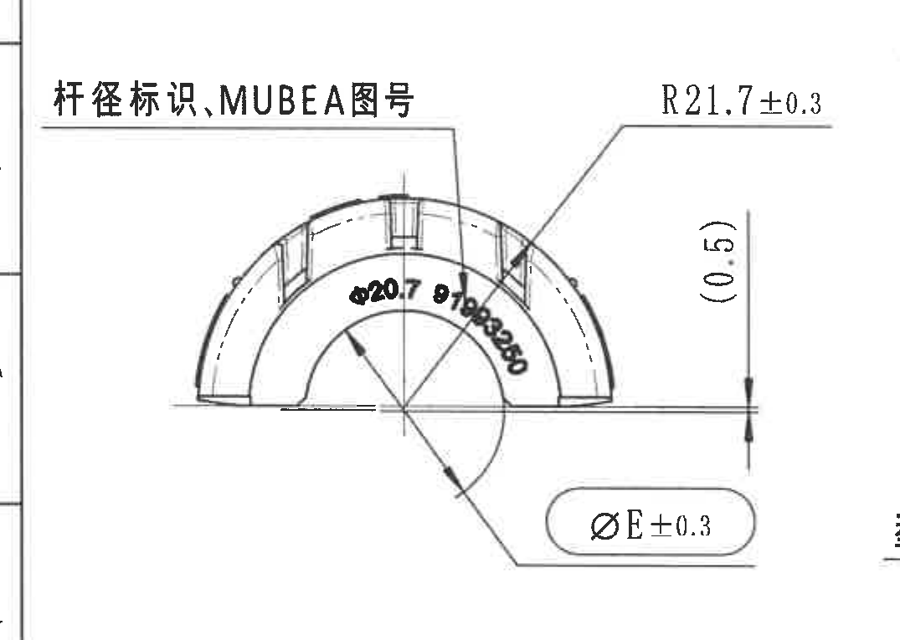

提取信息：

| 标注 | 原图内容 | 说明 |
|---|---|---|
| 杆径标识、MUBEA图号 | 文字指向外弧标识区域 | 该区域用于标记适配杆径及 MUBEA 图号。 |
| R21.7±0.3 | 外弧半径尺寸 | 外轮廓圆弧半径，允许偏差 ±0.3 mm。 |
| ØE±0.3 | 内孔/衬套配合直径 | ØE 为规格表中的 Bushing diameter。对当前 C114308/H，ØE=19.9 mm；视图中给出偏差 ±0.3 mm。 |
| (0.5) | 参考尺寸 | 括号尺寸为参考尺寸，不作为直接加工控制尺寸。 |
| 弧面印字 | 图中可见 `Ø20.7` 等弧形字符 | 对应当前稳定杆直径标识，扫描图局部字符较弱，以规格表 `ØA=20.7` 为准。 |

解读：此视图表达衬套半圆截面的外弧、内孔以及弧面标识位置。`R21.7±0.3` 控制外弧半径，`ØE±0.3` 控制与稳定杆/衬套相关的内径配合尺寸。

## 中左侧带 A-A 剖切线视图

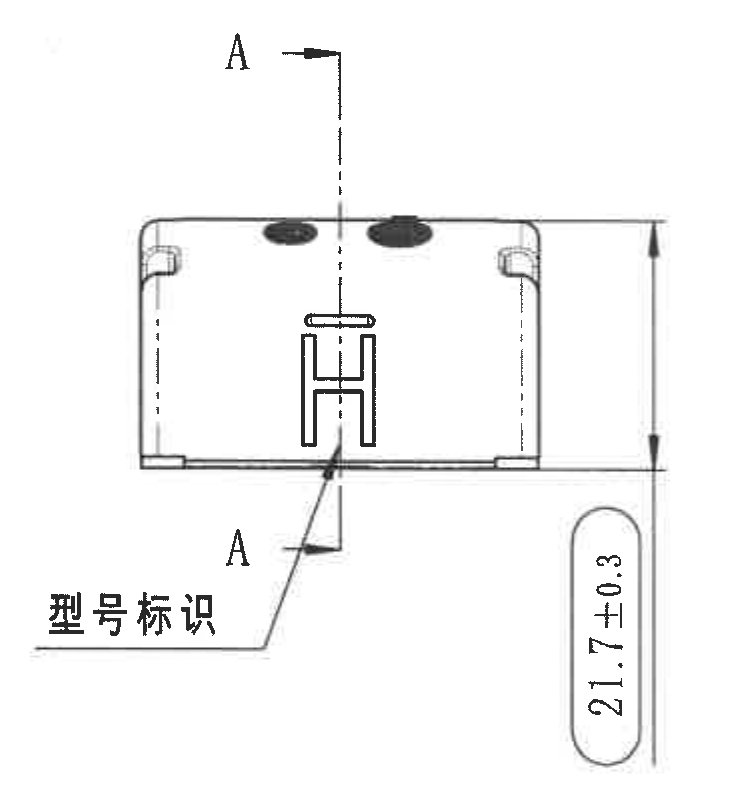

提取信息：

| 标注 | 原图内容 | 说明 |
|---|---|---|
| A-A | 竖向剖切线与上下箭头 A | 指示 A-A 剖面的位置，剖切结果见 A-A 剖视图。 |
| 型号标识 | 指向中下部字母/标识区域 | 指示产品型号标识位置。 |
| 21.7±0.3 | 右侧竖向尺寸 | 控制该方向总高度/外形高度，允许偏差 ±0.3 mm。 |
| 顶部黑色椭圆标记 | 顶面两个黑色标记 | 表示顶面识别或工艺标识位置。 |

解读：该视图主要用于定位 A-A 剖切方向、型号标识位置以及高度尺寸。尺寸 `21.7±0.3` 是该视图中的主要外形控制尺寸。

## 左下侧底面加工视图

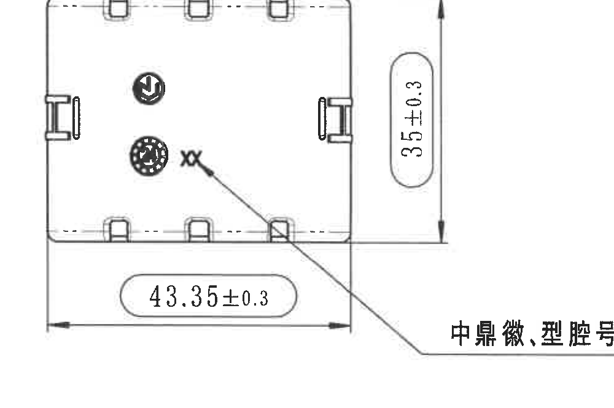

提取信息：

| 标注 | 原图内容 | 说明 |
|---|---|---|
| 43.35±0.3 | 底部水平总长 | 控制底面方向长度，允许偏差 ±0.3 mm。 |
| 35±0.3 | 右侧竖向总宽/高度 | 控制另一方向外形尺寸，允许偏差 ±0.3 mm。 |
| 中鼎徽、型号号、时间钟 | 指向底面标识 | 底面需要包含中鼎徽标、型号号及时间钟等模具/追溯标识。 |
| 边缘卡扣/凹槽 | 上下边、左右边多个局部结构 | 表示衬套外侧定位或装配相关结构。 |

解读：该底面视图给出零件平面外形尺寸和底面标识要求。`43.35±0.3` 与 `35±0.3` 共同定义底面外包络尺寸。

## A-A 剖面视图

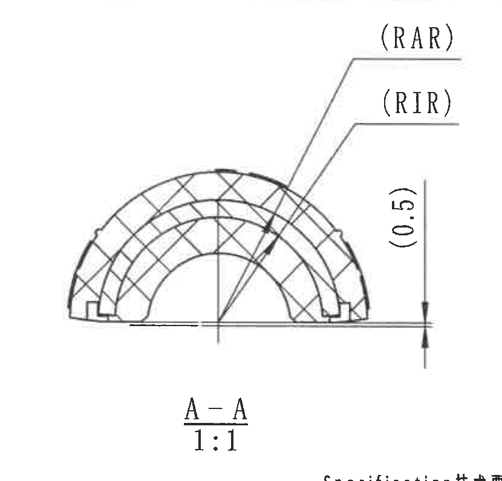

提取信息：

| 标注 | 原图内容 | 说明 |
|---|---|---|
| A-A / 1:1 | 剖面名称与比例 | 该剖面按 1:1 表示。 |
| RAR | 指向外层嵌件/弧形区域 | Insert outer radius，嵌件外半径。当前 C114308/H 对应规格表值 `17.7 mm`。 |
| RIR | 指向内层嵌件/弧形区域 | Insert inner radius，嵌件内半径。当前 C114308/H 对应规格表值 `15.2 mm`。 |
| (0.5) | 右侧竖向参考尺寸 | 括号尺寸为参考尺寸。 |
| 交叉剖面线 | 剖切材料区域 | 表示剖切到的材料/嵌件截面区域。 |

解读：A-A 剖面用于说明半圆衬套内部嵌件的半径关系。`RAR` 与 `RIR` 不在剖面内直接写死数值，而是通过上方规格表按变型取值。

## B-B 剖面视图

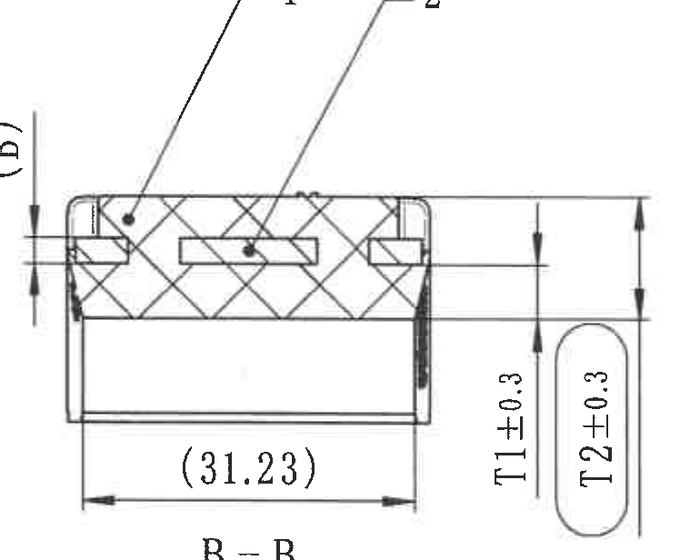

提取信息：

| 标注 | 原图内容 | 说明 |
|---|---|---|
| B-B / 1:1 | 剖面名称与比例 | 该剖面按 1:1 表示。 |
| (31.23) | 底部水平参考尺寸 | 括号尺寸为参考尺寸。 |
| T1±0.3 | 右侧竖向厚度尺寸 | Rubber thickness，当前 C114308/H 对应规格表 `T1=5.75 mm`，视图给出偏差 ±0.3 mm。 |
| T2±0.3 | 右侧竖向厚度尺寸 | Inner rubber thickness，当前 C114308/H 对应规格表 `T2=12.25 mm`，视图给出偏差 ±0.3 mm。 |
| B | 左侧竖向尺寸标识 | Insert thickness，当前 C114308/H 对应规格表 `B=2.5 mm`。 |
| 1 / 2 | 视图上方零件序号指引 | 对应 BOM 中的橡胶与铝骨架。 |

解读：B-B 剖面表达橡胶与嵌件在宽度方向的层厚关系。`T1`、`T2`、`B` 均从规格表按当前变型取值，剖面图给出它们在截面中的位置和公差表达。

## 右侧材料标识视图

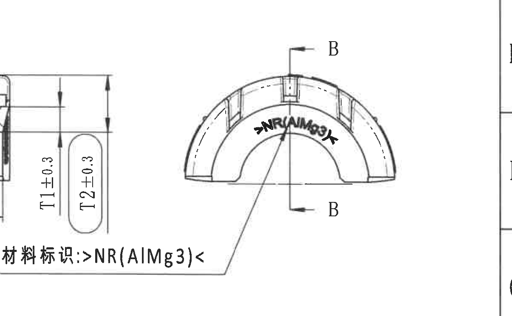

提取信息：

| 标注 | 原图内容 | 说明 |
|---|---|---|
| B-B | 上下剖切箭头 | 指示 B-B 剖面切取方向。 |
| 材料标识: >NR(AlMg3)< | 指向弧面印字 | 零件表面需标识橡胶与铝骨架材料组合。 |
| >NR(AlMg3)< | 弧形印字 | `NR` 表示天然橡胶，`AlMg3` 表示铝镁材料标识。 |

解读：该视图的重点是材料标识在弧形外观面上的位置。靠近该区域的 B-B 厚度尺寸属于 B-B 剖面，不并入本视图的尺寸提取。

## 等轴测视图

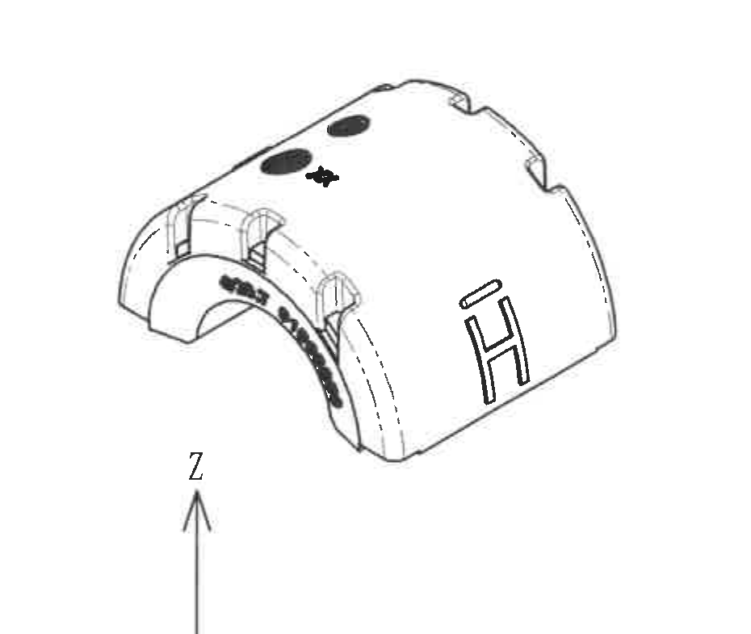

提取信息：

| 标注 | 原图内容 | 说明 |
|---|---|---|
| 立体外形 | 半圆衬套三维形态 | 表示零件整体外观、开口方向、顶部黑色标识和侧面型号标识。 |
| Z 方向箭头 | 下方坐标方向标识的一部分 | 用于说明零件空间方向。 |
| 外弧、侧槽、端部结构 | 等轴测中可见 | 与正视图、底面图、剖面图中的结构互相对应。 |

解读：该视图不提供新增尺寸，主要用于确认零件空间形态、标识所在面和各局部结构的相对位置。

## Specification 技术要求 / NOTES

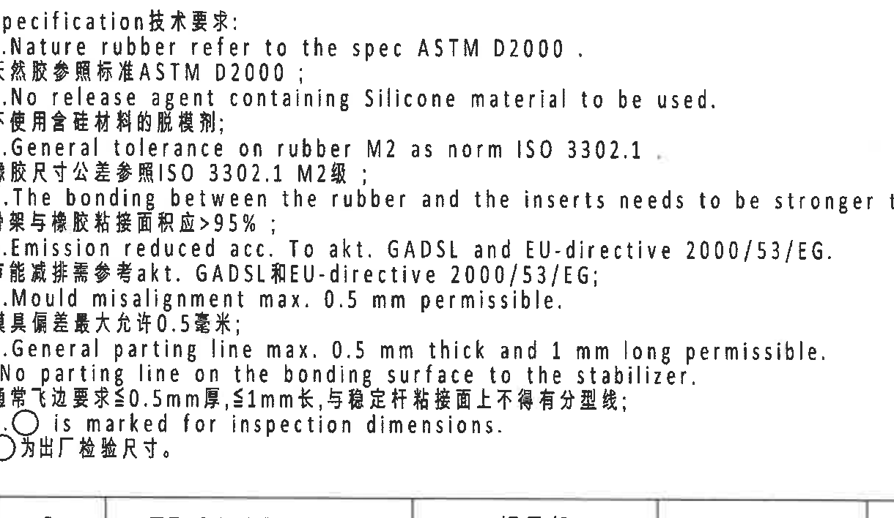

原文提取：

1. Nature rubber refer to the spec ASTM D2000.  
   天然胶参照标准 ASTM D2000;
2. No release agent containing Silicone material to be used.  
   不使用含硅材料的脱模剂;
3. General tolerance on rubber M2 as norm ISO 3302.1  
   橡胶尺寸公差参照 ISO 3302.1 M2 级;
4. The bonding between the rubber and the inserts needs to be stronger than >95% rubber break.  
   骨架与橡胶粘接面积应 >95%;
5. Emission reduced acc. To akt. GADSL and EU-directive 2000/53/EG.  
   节能减排需参考 akt. GADSL 和 EU-directive 2000/53/EG;
6. Mould misalignment max. 0.5 mm permissible.  
   模具偏差最大允许 0.5 毫米;
7. General parting line max. 0.5 mm thick and 1 mm long permissible. No parting line on the bonding surface to the stabilizer.  
   通常飞边要求 ≤0.5 mm 厚，≤1 mm 长，与稳定杆接触面上不得有分型线;
8. ○ is marked for inspection dimensions.  
   ○ 为出厂检验尺寸。

## DIN ISO 3302-1 M2 class 公差表

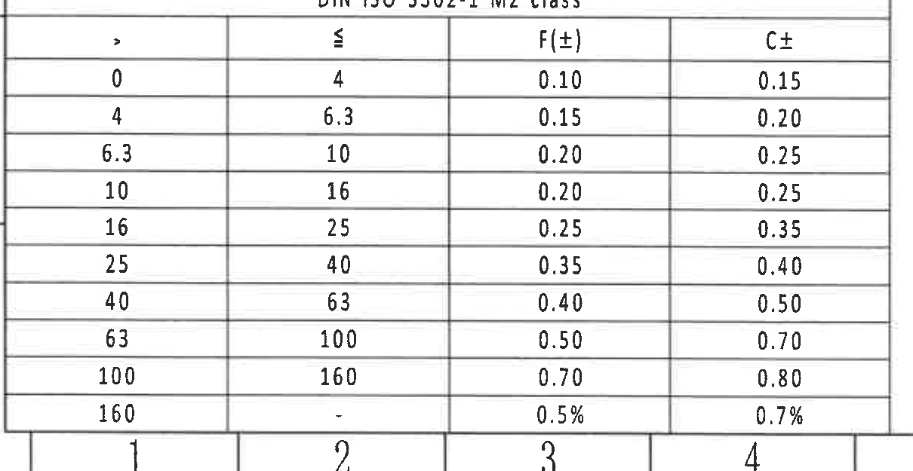

| > | ≤ | F(±) | C± |
|---:|---:|---:|---:|
| 0 | 4 | 0.10 | 0.15 |
| 4 | 6.3 | 0.15 | 0.20 |
| 6.3 | 10 | 0.20 | 0.25 |
| 10 | 16 | 0.20 | 0.25 |
| 16 | 25 | 0.25 | 0.35 |
| 25 | 40 | 0.35 | 0.40 |
| 40 | 63 | 0.40 | 0.50 |
| 63 | 100 | 0.50 | 0.70 |
| 100 | 160 | 0.70 | 0.80 |
| 160 | - | 0.5% | 0.7% |

含义：该表给出橡胶件尺寸的一般公差，适用 NOTES 中指定的 `ISO 3302.1 M2` 等级。

## 参考文件

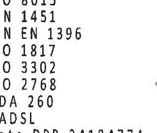

提取内容：

- ISO 8015
- DIN 1451
- DIN EN 1396
- ISO 1817
- ISO 3302
- ISO 2768
- VDA 260
- GADSL
- Note-DPR-34184774

## BOM / 明细表

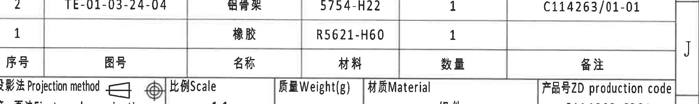

| 序号 | 图号 | 名称 | 材料 | 数量 | 备注 |
|---:|---|---|---|---:|---|
| 2 | TE-01-03-24-04 | 铝骨架 | 5754-H22 | 1 | C114263/01-01 |
| 1 |  | 橡胶 | R5621-H60 | 1 |  |

含义：该明细表定义本组件由 `橡胶` 与 `铝骨架` 两类零件组成，数量各 1。

## 标题栏

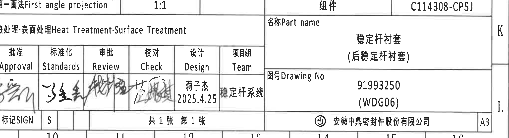

| 项目 | 内容 |
|---|---|
| Projection method | 第一画法 First angle projection |
| Scale | 1:1 |
| Product code | C114308-CPSJ |
| Part name | 稳定杆衬套（后稳定杆衬套） |
| Drawing No | 91993250 (WDG06) |
| Material | 组件 |
| Company | 安徽中鼎密封件股份有限公司 |
| Sheet | 共 1 张 第 1 张 |
| Drawing size | A3 |
| Designer | 蒋子杰 / 2025.4.25 |
| Heat Treatment / Surface Treatment | 空白 |

含义：标题栏确认本图纸对象为稳定杆衬套组件，图号 `91993250 (WDG06)`，产品号 `C114308-CPSJ`，比例 `1:1`，图幅 `A3`。
