# 20C114310.pdf 内容识别与裁切提取

> 来源文件：`20C114310.pdf`  
> 渲染方式：先将 PDF 以 300 DPI 渲染为整页 PNG，再按加工视图、剖面视图、局部/说明区域、表格、NOTES、标题栏分别裁切。  
> 说明：原 PDF 为扫描图，文本按渲染图人工识别；原图模糊处保留原样或标注“原图模糊/疑似”。

## 0. 整页渲染图

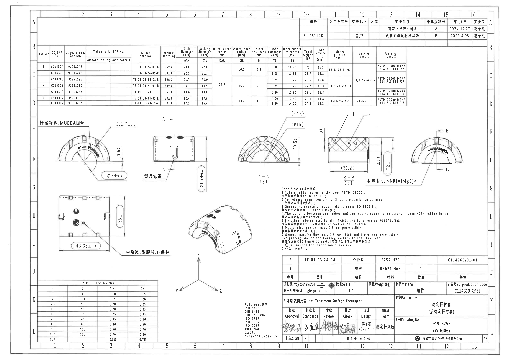

---

## 1. 顶部变更记录表

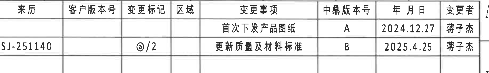

| 来历 | 客户版本号 | 变更标记 | 区域 | 变更事项 | 中鼎版本号 | 年月日 | 变更者 |
|---|---|---|---|---|---|---|---|
|  |  |  |  | 首次下发产品图纸 | A | 2024.12.27 | 薄子杰 |
| SJ-251140 |  | @/2 |  | 更新质量及材料标准 | B | 2025.4.25 | 薄子杰 |

---

## 2. 顶部规格/参数总表

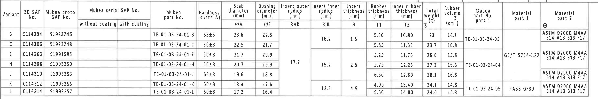

| Variant | ZD SAP No. | Mubea proto. SAP No. | Mubea serial SAP No. without coating | Mubea serial SAP No. with coating | Mubea part No. | Hardness shore A | Stab diameter ØA | Bushing diameter ØE | Insert outer radius RAR | Insert inner radius RIR | Insert thickness B | Rubber thickness T1 | Inner rubber thickness T2 | Total weight g | Rubber volume cm3 | Mubea part No. part 1 | Material part 1 | Material part 2 |
|---|---|---|---|---|---|---:|---:|---:|---:|---:|---:|---:|---:|---:|---:|---|---|---|
| B | C114304 | 91993246 |  |  | TE-01-03-24-01-B | 55±3 | 23.6 | 22.8 |  | 16.2 | 1.5 | 5.30 | 10.80 | 23 | 16.1 | TE-01-03-24-03 |  | ASTM D2000 M4AA 514 A13 B13 F17 |
| C | C114306 | 91993248 |  |  | TE-01-03-24-01-C | 60±3 | 22.5 | 21.7 |  | 16.2 | 1.5 | 5.85 | 11.35 | 23.7 | 16.8 | TE-01-03-24-03 | GB/T 5754-H22 | ASTM D2000 M4AA 614 A13 B13 F17 |
| E | C114263 | 91991595 |  |  | TE-01-03-24-01-E | 60±3 | 21.7 | 20.9 | 17.7 | 15.2 | 2.5 | 5.25 | 11.75 | 26.6 | 15.8 | TE-01-03-24-04 | GB/T 5754-H22 | ASTM D2000 M4AA 614 A13 B13 F17 |
| H | C114308 | 91993250 |  |  | TE-01-03-24-01-H | 60±3 | 20.7 | 19.9 | 17.7 | 15.2 | 2.5 | 5.75 | 12.25 | 27.2 | 16.3 | TE-01-03-24-04 | GB/T 5754-H22 | ASTM D2000 M4AA 614 A13 B13 F17 |
| J | C114310 | 91993253 |  |  | TE-01-03-24-01-J | 65±3 | 19.6 | 18.8 | 17.7 | 15.2 | 2.5 | 6.30 | 12.80 | 28.1 | 16.8 | TE-01-03-24-04 | GB/T 5754-H22 | ASTM D2000 M4AA 614 A13 B13 F17 |
| K | C114312 | 91993255 |  |  | TE-01-03-24-01-K | 60±3 | 18.4 | 17.6 |  | 13.2 | 4.5 | 4.90 | 13.40 | 24.1 | 14.8 | TE-01-03-24-05 | PA66 GF30 | ASTM D2000 M4AA 614 A13 B13 F17 |
| L | C114314 | 91993257 |  |  | TE-01-03-24-01-L | 60±3 | 17.2 | 16.4 |  | 13.2 | 4.5 | 5.50 | 14.00 | 24.6 | 15.3 | TE-01-03-24-05 | PA66 GF30 | ASTM D2000 M4AA 614 A13 B13 F17 |

### 与本图号对应的参数

本图标题栏 Drawing No. 为 `91993253 (WDG06)`，ZD production code 为 `C114310-CPSJ`，对应规格表 Variant `J`：

| 项目 | 数值 |
|---|---|
| ZD SAP No. | C114310 |
| Mubea proto. SAP No. | 91993253 |
| Mubea part No. | TE-01-03-24-01-J |
| 硬度 | 65±3 Shore A |
| ØA | 19.6 |
| ØE | 18.8 |
| RAR | 17.7 |
| RIR | 15.2 |
| B | 2.5 |
| T1 | 6.30 |
| T2 | 12.80 |
| 总重 | 28.1 g |
| 橡胶体积 | 16.8 cm3 |
| Part 1 图号 | TE-01-03-24-04 |
| Part 1 材料 | GB/T 5754-H22 |
| Part 2 材料 | ASTM D2000 M4AA 614 A13 B13 F17 |

---

## 3. 左侧弧形正视图

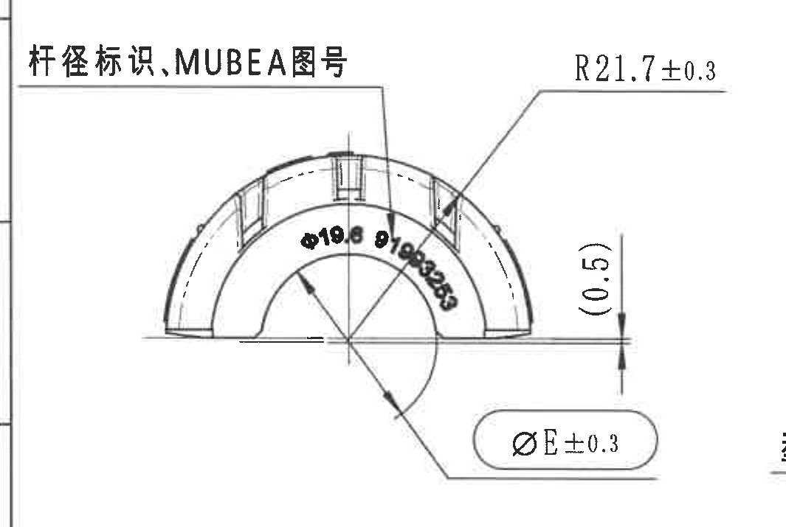

### 原图文字/尺寸

| 图面标注 | 提取内容 | 含义解读 |
|---|---|---|
| 杆径标识,MUBEA图号 | 标识要求 | 弧形件外表面/对应位置需体现杆径标识及 MUBEA 图号信息。 |
| R21.7±0.3 | 半径尺寸 | 标注弧形外轮廓相关半径，公差 ±0.3。 |
| Ø19.6 91993253 | 标识内容 | `Ø19.6` 与规格表 Variant J 的 ØA 相同；`91993253` 与标题栏 Drawing No. 相同。 |
| (0.5) | 参考尺寸 | 括号尺寸，作为参考/非直接检验尺寸理解。 |
| ØE±0.3 | 直径尺寸 | ØE 为参数化尺寸；本图 Variant J 对应 ØE=18.8，因此该处为 Ø18.8±0.3。 |

---

## 4. 侧视图及 A-A 剖切位置

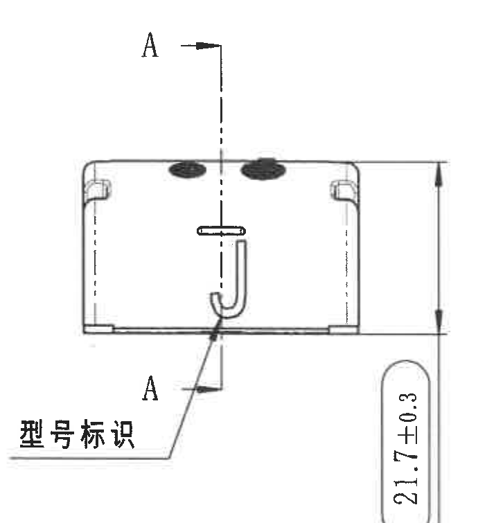

### 原图文字/尺寸

| 图面标注 | 提取内容 | 含义解读 |
|---|---|---|
| A / A | A-A 剖切位置 | 竖向剖切线定义后续 `A-A` 剖面图的剖切方向和位置。 |
| 型号标识 | 标识要求 | 该视图中 J 形标记附近为型号标识区域。 |
| 21.7±0.3 | 高度/端面相关尺寸 | 竖向尺寸，公差 ±0.3；用于控制该视图所示高度或端面轮廓相关尺寸。 |

---

## 5. A-A 剖面视图

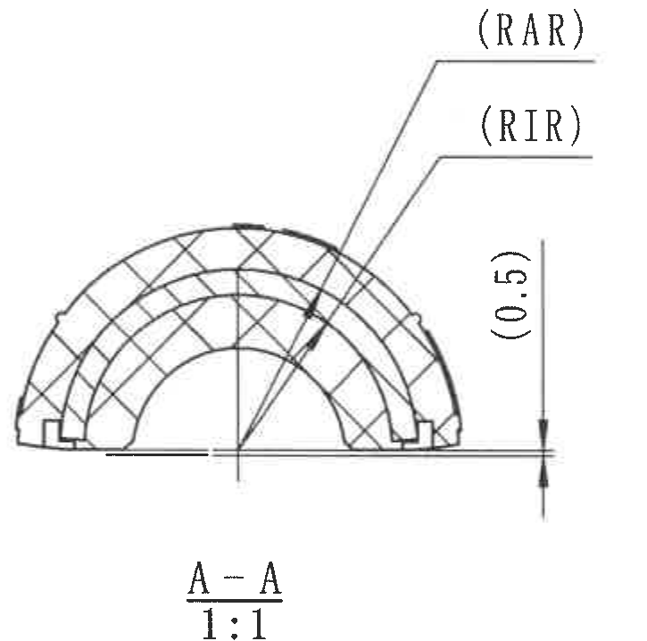

### 原图文字/尺寸

| 图面标注 | 提取内容 | 含义解读 |
|---|---|---|
| A-A | 剖面名称 | 对应侧视图中的 A-A 剖切线。 |
| 1:1 | 比例 | 剖面按 1:1 表示。 |
| (RAR) | Insert outer radius | 插入件外半径参数；本图 Variant J 对应 RAR=17.7。 |
| (RIR) | Insert inner radius | 插入件内半径参数；本图 Variant J 对应 RIR=15.2。 |
| (0.5) | 参考尺寸 | 括号尺寸，作为参考尺寸理解。 |
| 剖面线 | 交叉剖面填充 | 表示剖切到的材料区域。 |

---

## 6. B-B 剖面视图

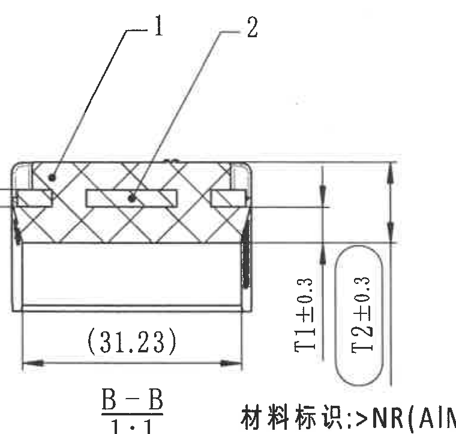

### 原图文字/尺寸

| 图面标注 | 提取内容 | 含义解读 |
|---|---|---|
| B-B | 剖面名称 | 对应右侧弧形视图中的 B-B 剖切位置。 |
| 1:1 | 比例 | 剖面按 1:1 表示。 |
| 1 | 件号 1 | 对应明细表序号 1：橡胶，材料 R5621-H65。 |
| 2 | 件号 2 | 对应明细表序号 2：铝骨架，材料 5754-H22。 |
| (B) | 插入件厚度参数 | 规格表中的 Insert thickness；本图 Variant J 对应 B=2.5。 |
| (31.23) | 参考宽度 | 括号尺寸，作为参考尺寸理解。 |
| T1±0.3 | 橡胶厚度 | 规格表中的 Rubber thickness；本图 Variant J 对应 T1=6.30±0.3。 |
| T2±0.3 | 内橡胶厚度 | 规格表中的 Inner rubber thickness；本图 Variant J 对应 T2=12.80±0.3。 |

---

## 7. 右侧弧形视图及 B-B 剖切位置

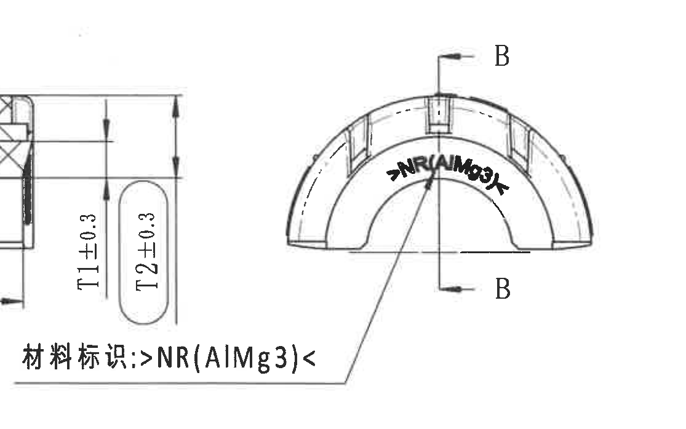

### 原图文字/尺寸

| 图面标注 | 提取内容 | 含义解读 |
|---|---|---|
| B / B | B-B 剖切位置 | 定义 `B-B` 剖面图的剖切方向和位置。 |
| >NR(AIMg3)< | 材料标识 | 图中材料标识内容；旁注写作“材料标识: >NR(AIMg3)<”。 |

### 边界说明

材料标识引出线跨越在 `B-B` 剖面与右侧弧形视图之间；该裁切图左侧可见相邻 `B-B` 剖面的一部分尺寸线。提取时只将“材料标识: >NR(AIMg3)<”归属于本右侧弧形视图，`T1±0.3`、`T2±0.3` 仍归属于上一区域 `B-B` 剖面。

---

## 8. 下方平面/展开视图

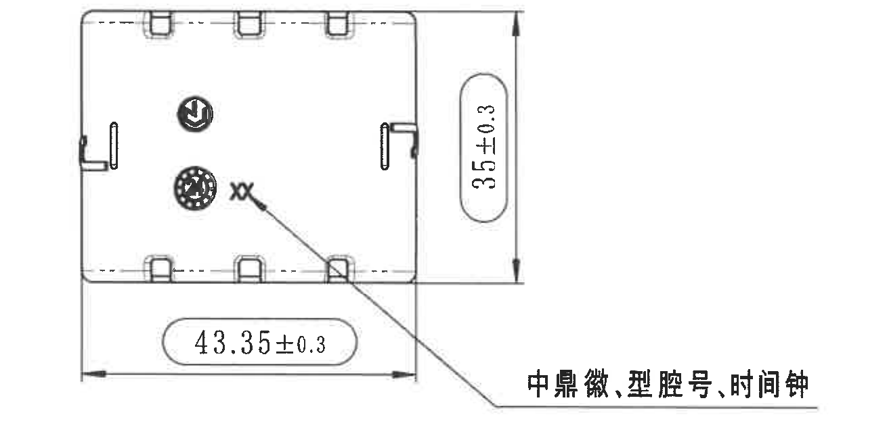

### 原图文字/尺寸

| 图面标注 | 提取内容 | 含义解读 |
|---|---|---|
| 43.35±0.3 | 横向总长/展开宽度 | 水平方向主尺寸，公差 ±0.3。 |
| 35±0.3 | 竖向高度/展开高度 | 竖向主尺寸，公差 ±0.3。 |
| 中鼎徽,型腔号,时间钟 | 标识要求 | 箭头指向视图内的标识区域，要求包含中鼎徽、型腔号、时间钟。 |
| 内部圆形/符号标识 | 标识位置 | 图面显示中鼎徽及模具/时间类标记的布置位置。 |

---

## 9. 等轴测视图

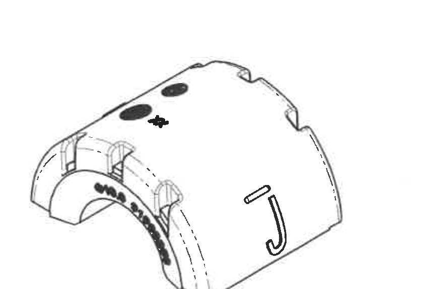

### 原图信息

| 图面内容 | 提取内容 | 含义解读 |
|---|---|---|
| 立体外形 | 弧形套类零件三维外观 | 用于表达零件整体外形、槽/凸台、端部开口和表面标识的大致空间关系。 |
| 表面标记 | 黑色椭圆标记、J 形标记、弧面字符 | 与其他视图中的型号、杆径、MUBEA 图号、材料标识等要求相互对应。 |
| 尺寸 | 无单独尺寸标注 | 此区域仅作为形状表达，不新增尺寸。 |

---

## 10. NOTES / Specification 技术要求

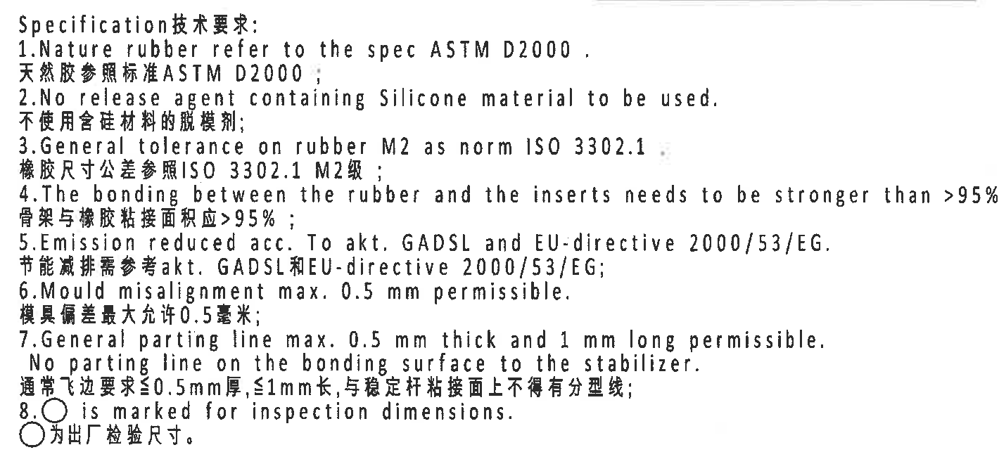

```text
Specification技术要求:
1. Nature rubber refer to the spec ASTM D2000.
天然胶参照标准 ASTM D2000;

2. No release agent containing Silicone material to be used.
不使用含硅材料的脱模剂;

3. General tolerance on rubber M2 as norm ISO 3302.1.
橡胶尺寸公差参照 ISO 3302.1 M2级;

4. The bonding between the rubber and the inserts needs to be stronger than >95% rubber break.
骨架与橡胶粘接面积应>95%;

5. Emission reduced acc. To akt. GADSL and EU-directive 2000/53/EG.
节能减排需参考 akt. GADSL 和 EU-directive 2000/53/EG;

6. Mould misalignment max. 0.5 mm permissible.
模具偏差最大允许 0.5 毫米;

7. General parting line max. 0.5 mm thick and 1 mm long permissible.
   No parting line on the bonding surface to the stabilizer.
通常飞边要求 ≤0.5mm 厚, ≤1mm 长, 与稳定杆粘接面上不得有分型线;

8. ○ is marked for inspection dimensions.
○ 为出厂检验尺寸。
```

---

## 11. DIN ISO 3302-1 M2 class 公差表

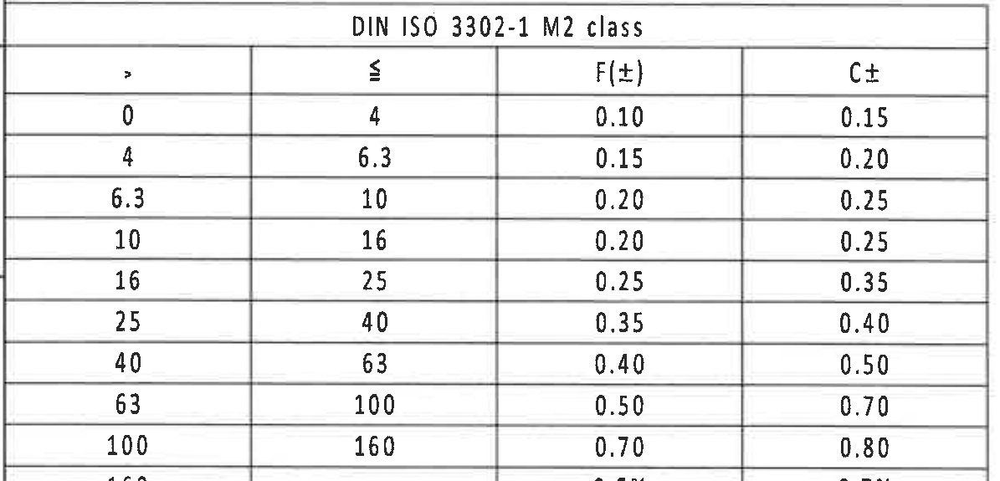

| 尺寸范围 > | 尺寸范围 ≤ | F(±) | C± |
|---:|---:|---:|---:|
| 0 | 4 | 0.10 | 0.15 |
| 4 | 6.3 | 0.15 | 0.20 |
| 6.3 | 10 | 0.20 | 0.25 |
| 10 | 16 | 0.20 | 0.25 |
| 16 | 25 | 0.25 | 0.35 |
| 25 | 40 | 0.35 | 0.40 |
| 40 | 63 | 0.40 | 0.50 |
| 63 | 100 | 0.50 | 0.70 |
| 100 | 160 | 0.70 | 0.80 |
| 160 | - | 0.5% | 0.7% |

---

## 12. 参考标准列表

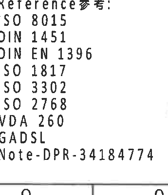

```text
Reference参考:
ISO 8015
DIN 1451
DIN EN 1396
ISO 1817
ISO 3302
ISO 2768
VDA 260
GADSL
Note-DPR-34184774
```

---

## 13. 明细表与标题栏

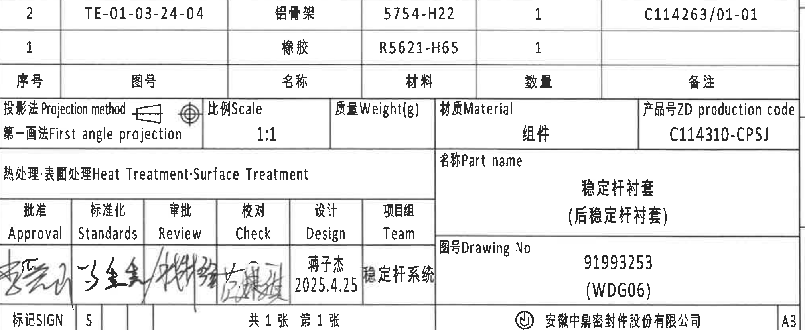

### 明细表

| 序号 | 图号 | 名称 | 材料 | 数量 | 备注 |
|---:|---|---|---|---:|---|
| 2 | TE-01-03-24-04 | 铝骨架 | 5754-H22 | 1 | C114263/01-01 |
| 1 |  | 橡胶 | R5621-H65 | 1 |  |

### 标题栏/图纸信息

| 项目 | 内容 |
|---|---|
| 投影法 Projection method | 第一画法 First angle projection |
| 比例 Scale | 1:1 |
| 质量 Weight(g) | 空白 |
| 材质 Material | 组件 |
| 产品号 ZD production code | C114310-CPSJ |
| 热处理/表面处理 Heat Treatment/Surface Treatment | 空白 |
| 名称 Part name | 稳定杆衬套（后稳定杆衬套） |
| 图号 Drawing No | 91993253 (WDG06) |
| 设计 Design | 薄子杰 / 2025.4.25 |
| 项目组 Team | 稳定杆系统 |
| 页数 | 共 1 张 第 1 张 |
| 公司 | 安徽中鼎密封件股份有限公司 |
| 图幅 | A3 |

### 签核栏

| 栏位 | 中文 | 内容 |
|---|---|---|
| Approval | 批准 | 签名，原图手写模糊 |
| Standards | 标准化 | 签名，原图手写模糊 |
| Review | 审批 | 签名，原图手写模糊 |
| Check | 校对 | 签名，原图手写模糊 |
| Design | 设计 | 薄子杰 / 2025.4.25 |
| Team | 项目组 | 稳定杆系统 |
| SIGN | 标记 | S |

---

## 14. 裁切检查记录

| 图片 | 检查结果 |
|---|---|
| 01_top_revision_block.png | 已收紧到变更记录表，未带入图框坐标。 |
| 02_specification_table.png | 表格主体完整，列标题和各行参数可见。 |
| 03_left_arc_view.png | 已重裁，保留 `R21.7±0.3`、`ØE±0.3` 和标识引出线，未提取相邻视图信息。 |
| 04_side_view_A_reference.png | A-A 剖切线、型号标识、`21.7±0.3` 完整。 |
| 05_section_A_A.png | 已重裁，去除 NOTES 片段，仅保留 A-A 剖面及其标注。 |
| 06_section_B_B.png | 已重裁，去除右侧材料标识文字，仅保留 B-B 剖面尺寸。 |
| 07_right_arc_view_B_reference.png | 材料标识跨区域，裁切中可见邻近 B-B 局部；提取时已严格区分归属。 |
| 08_lower_flat_view.png | 已重裁，完整保留 `中鼎徽,型腔号,时间钟` 引出文字。 |
| 09_isometric_view.png | 已重裁，去除坐标轴片段，仅保留零件等轴测图。 |
| 10_notes.png | 已重裁，左侧编号完整，未带入下方明细表。 |
| 11_tolerance_table.png | 已重裁，标题和表格数据完整，未带入底部图框坐标。 |
| 12_bom_and_title_block.png | 已重裁，保留标题栏/明细栏外框内内容，未带入外框坐标。 |
| 13_reference_list.png | 参考标准列表完整可见。 |
