# 20C114319.pdf 内容识别

识别对象：`20C114319.pdf`  
页面：1 页 A3 扫描图，已先渲染为整页 PNG，再按加工视图、剖面视图、局部视图、表格、技术要求和标题栏裁切。  
说明：原 PDF 无可抽取文本层，以下内容基于整页 PNG 和裁切图进行视觉识读；尺寸和文字按原图所在区域归属记录。

## 整页 PNG

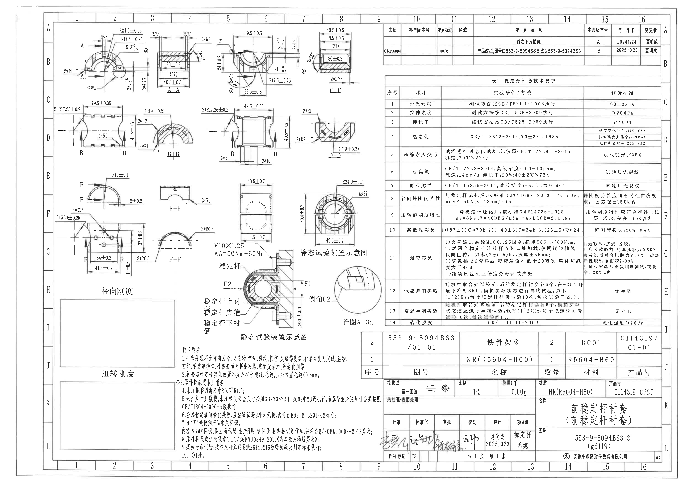

## 左上视图区

### 视图 A 及详图 A 指引

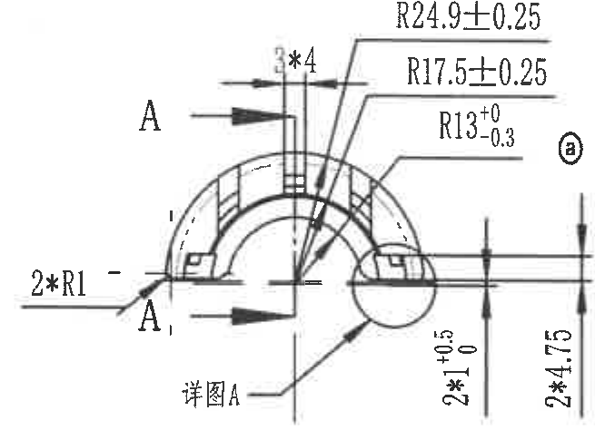

提取内容：

| 类别 | 图面信息 |
|---|---|
| 视图标识 | A，A 向剖切箭头；局部圆圈标注“详图A”；圆圈标记“a” |
| 半径/弧度 | R24.9±0.25；R17.5±0.25；R13 +0/-0.3；2*R1 |
| 尺寸 | 3*4；2*1 +0.5/0；2*4.75 |
| 图形含义 | 该视图表达衬套外圆弧、内圆弧、局部台阶和开口位置；A-A 剖切位置由箭头标出，局部圆圈位置对应详图 A。 |

### 剖面 A-A

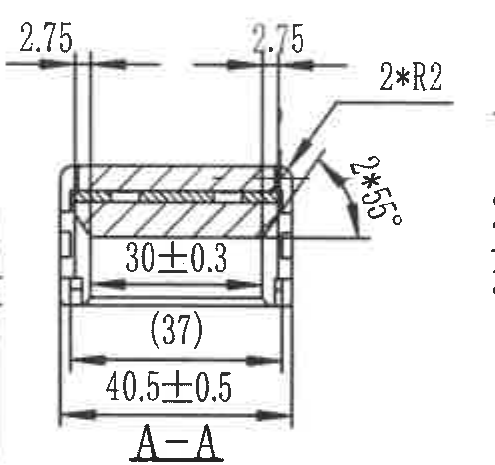

提取内容：

| 类别 | 图面信息 |
|---|---|
| 视图标识 | A-A |
| 宽度/厚度 | 40.5±0.5；30±0.3；参考尺寸 (37)；两侧 2.75 |
| 圆角/倒角 | 2*R2；2*45° |
| 图形含义 | 横向剖面显示金属骨架/橡胶层组合结构，两侧端部厚度为 2.75，内腔宽度 30±0.3，外部总宽 40.5±0.5。 |

### 视图 C

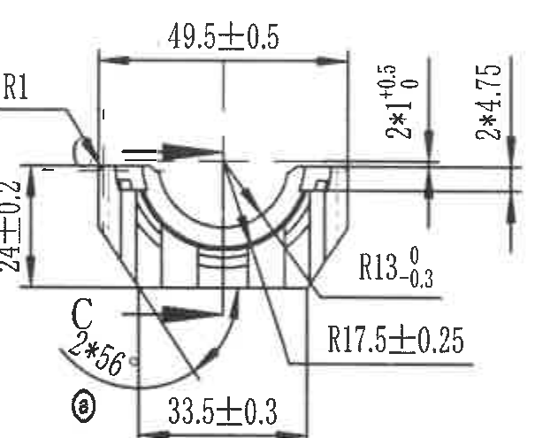

提取内容：

| 类别 | 图面信息 |
|---|---|
| 视图标识 | C，剖切箭头；圆圈标记“a” |
| 尺寸 | 49.5±0.5；33.5±0.3；24±0.2；2*1 +0.5/0；2*4.75 |
| 半径/角度 | R1；R13 +0/-0.3；R17.5±0.25；2*56° |
| 图形含义 | 该视图表达中部 U 形开口、两侧唇边及下部连接区域；49.5±0.5 为横向总宽，33.5±0.3 为下部局部宽度。 |

### 剖面 C-C

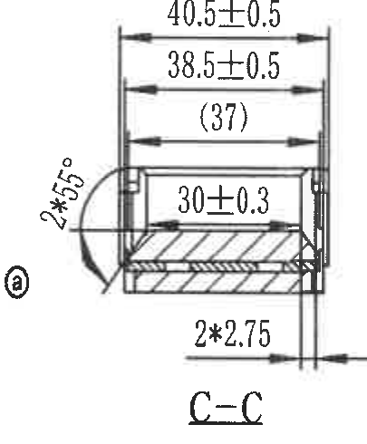

提取内容：

| 类别 | 图面信息 |
|---|---|
| 视图标识 | C-C；圆圈标记“a” |
| 尺寸 | 40.5±0.5；38.5±0.5；参考尺寸 (37)；30±0.3；2*2.75 |
| 角度 | 2*45° |
| 图形含义 | 剖面表达端部横截面宽度及内部层状结构；30±0.3 为内侧有效宽度，40.5±0.5 为外侧总宽。 |

## 左中视图区

### 视图 B

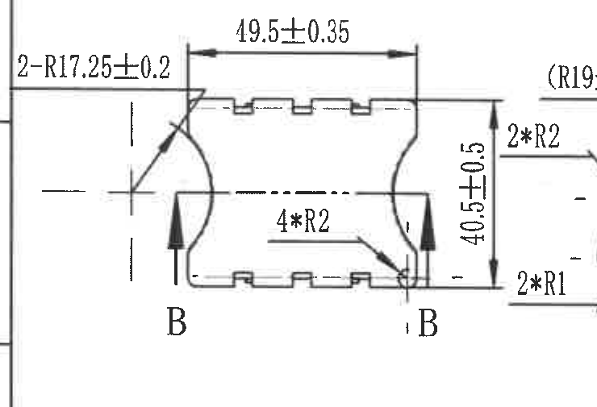

提取内容：

| 类别 | 图面信息 |
|---|---|
| 视图标识 | B，B 向剖切箭头 |
| 尺寸 | 49.5±0.35；40.5±0.5 |
| 半径/圆角 | 2-R17.25±0.2；4*R2；2*R2；2*R1 |
| 图形含义 | 该视图表达零件纵向外形、上下齿形/槽形结构及两端弧面；B+B 剖切位置由两端箭头标出。 |

### 剖面 B+B

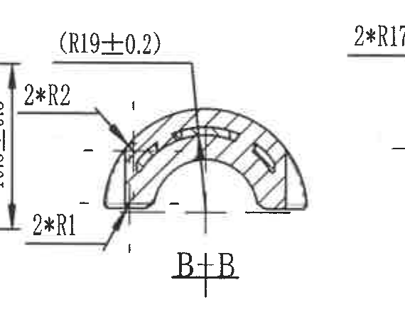

提取内容：

| 类别 | 图面信息 |
|---|---|
| 视图标识 | B+B |
| 半径/圆角 | (R19±0.2)；*R2；2*R1 |
| 图形含义 | 剖面显示半圆形截面、橡胶层和局部槽口；括号尺寸 R19±0.2 为参考半径。 |

### 视图 D

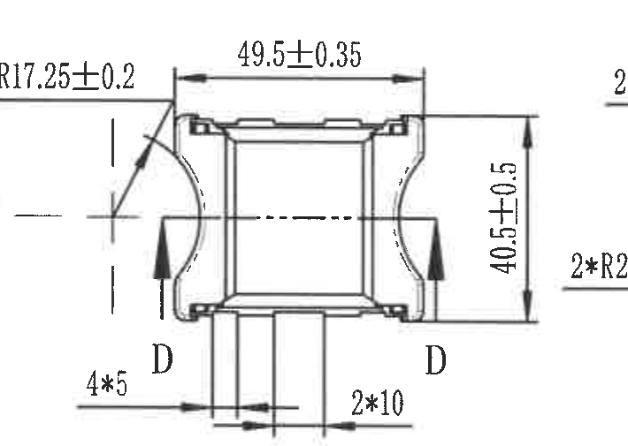

提取内容：

| 类别 | 图面信息 |
|---|---|
| 视图标识 | D，D 向剖切箭头 |
| 尺寸 | 49.5±0.35；40.5±0.5；4*5；2*10 |
| 半径/圆角 | 2*R17.25±0.2；2*R2 |
| 图形含义 | 该视图表达另一方向的正视外形和中部矩形区域；底部 4*5、2*10 表示底部局部结构间距/宽度。 |

### 剖面 D-D

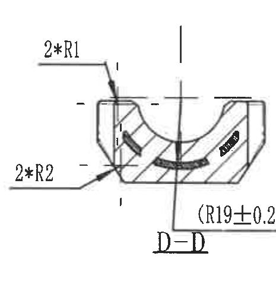

提取内容：

| 类别 | 图面信息 |
|---|---|
| 视图标识 | D-D |
| 半径/圆角 | 2*R1；2*R2；(R19±0.2) |
| 图形含义 | 剖面表达底部槽形、两侧圆角和中部弧形内腔；括号尺寸 R19±0.2 为参考半径。 |

## 左下视图区

### 视图 E

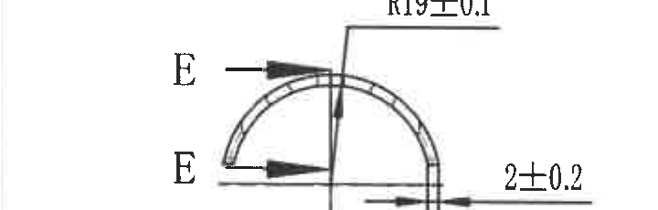

提取内容：

| 类别 | 图面信息 |
|---|---|
| 视图标识 | E，E 向剖切箭头 |
| 尺寸 | 2±0.2 |
| 半径 | R19±0.1 |
| 图形含义 | 半圆截面视图，表达外圆半径和一侧壁厚/间距。 |

### 剖面 E-E

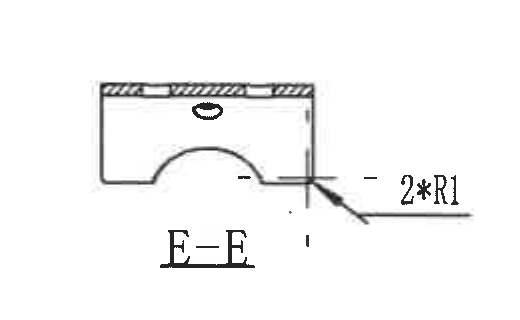

提取内容：

| 类别 | 图面信息 |
|---|---|
| 视图标识 | E-E |
| 圆角 | 2*R1 |
| 图形含义 | 横向剖面显示上部层状结构、下部半圆缺口以及侧边圆角。 |

### 视图 F

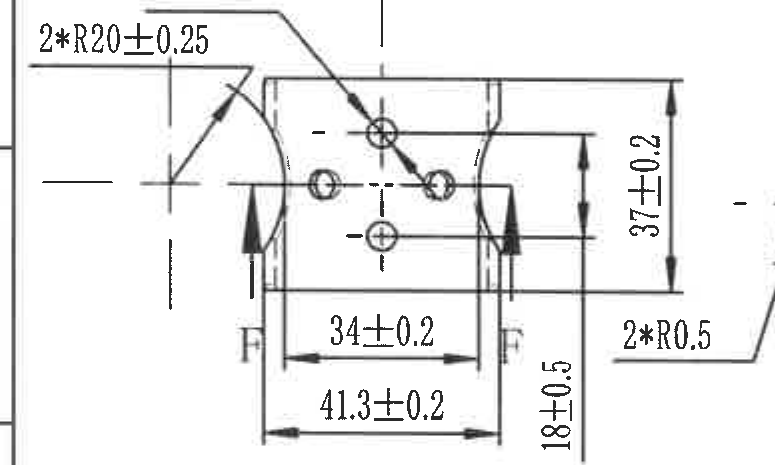

提取内容：

| 类别 | 图面信息 |
|---|---|
| 视图标识 | F，F 向剖切箭头 |
| 尺寸 | 37±0.2；34±0.2；41.3±0.2；18±0.5 |
| 半径/孔 | 2*R20±0.25；2*R0.5；4*Ø5 |
| 图形含义 | 该视图表达带孔区域、底部宽度和侧向高度；4*Ø5 表示 4 个直径 5 的孔。 |

### 剖面 F-F

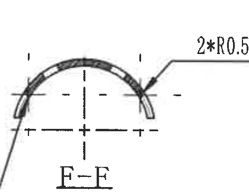

提取内容：

| 类别 | 图面信息 |
|---|---|
| 视图标识 | F-F（图面字样按裁切识读） |
| 圆角 | 2*R0.5 |
| 图形含义 | 剖面表达上部弧形薄壁和两侧端部圆角。 |

## 静态试验装置示意图区

### 静态试验装置正向示意

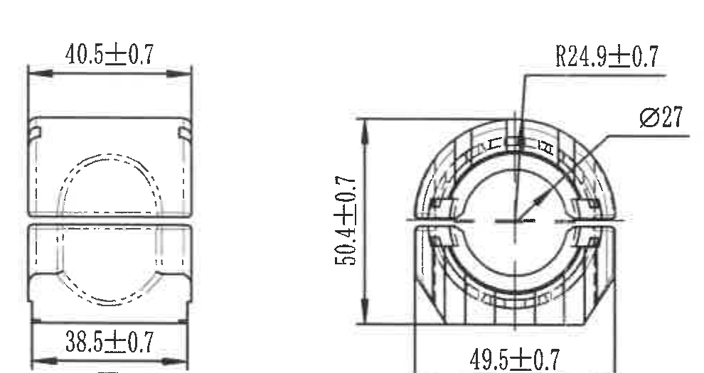

提取内容：

| 类别 | 图面信息 |
|---|---|
| 视图标识 | 静态试验装置示意图 |
| 尺寸 | 40.5±0.7；38.5±0.7；50.4±0.7；49.5±0.7 |
| 半径/孔径 | R24.9±0.7；Ø27 |
| 图形含义 | 该区域为静态试验装夹状态示意，展示衬套在夹具中的外形尺寸、安装宽度和孔径位置。 |

### 静态试验装置剖面示意

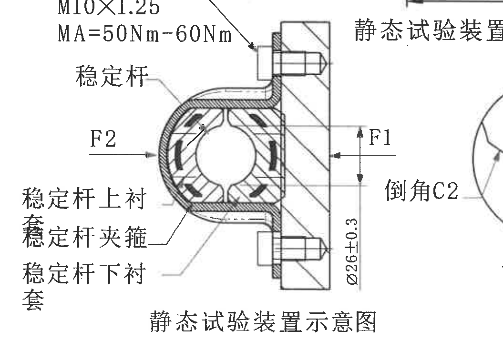

提取内容：

| 类别 | 图面信息 |
|---|---|
| 螺栓/扭矩 | M10×1.25；MA=50Nm-60Nm |
| 力方向 | F1；F2 |
| 尺寸/倒角 | Ø26±0.3；倒角 C2 |
| 部件标注 | 稳定杆；稳定杆上衬套；稳定杆夹箍；稳定杆下衬套 |
| 图形含义 | 该剖面说明稳定杆衬套安装在夹箍和连接件中的受力方向；F1、F2 为静态试验加载方向，M10×1.25 螺栓按 50Nm-60Nm 扭矩固定。 |

### 详图 A 3:1

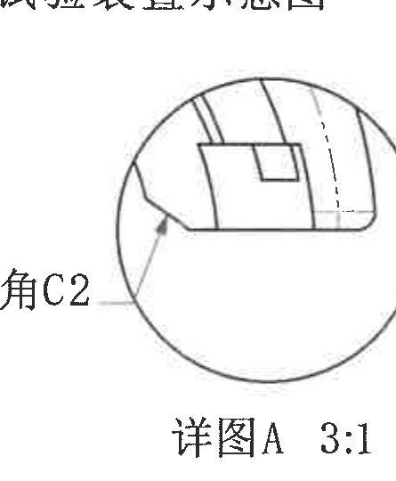

提取内容：

| 类别 | 图面信息 |
|---|---|
| 视图标识 | 详图 A 3:1 |
| 局部要求 | 倒角 C2 |
| 图形含义 | 放大说明局部边角倒角，比例 3:1。 |

## 左下空白刚度表格区

### 径向刚度

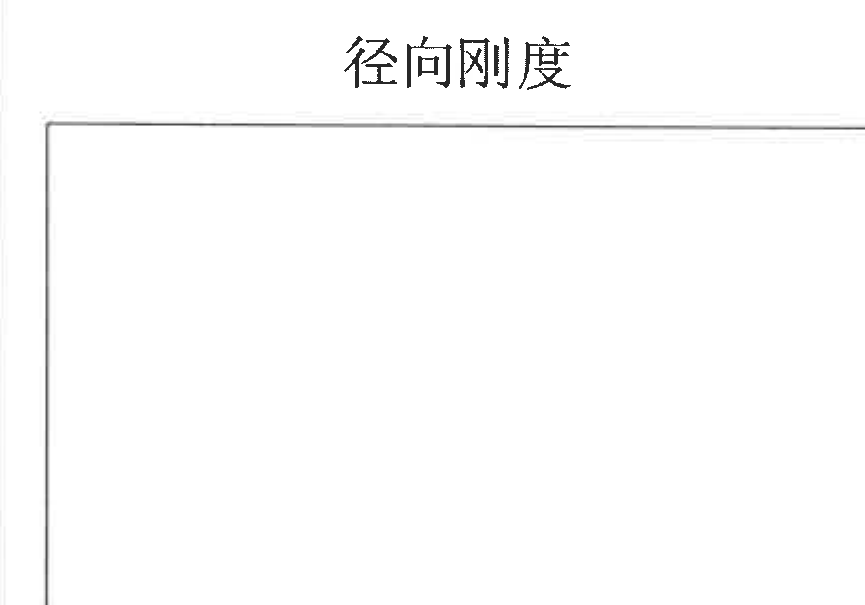

提取内容：

| 类别 | 图面信息 |
|---|---|
| 表题 | 径向刚度 |
| 表格状态 | 图中为矩形空白框，未填写曲线或数据。 |
| 含义 | 用于记录或绘制径向刚度特性。 |

### 扭转刚度

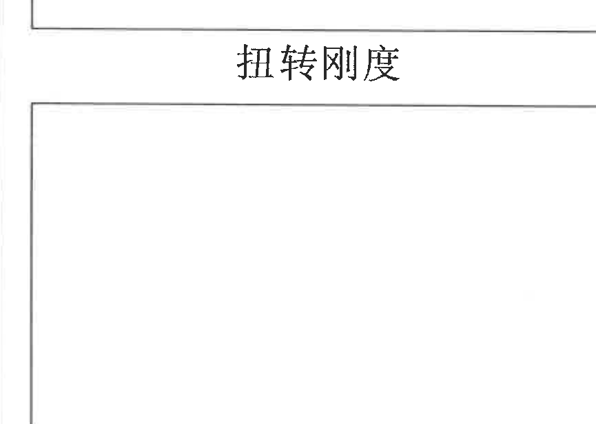

提取内容：

| 类别 | 图面信息 |
|---|---|
| 表题 | 扭转刚度 |
| 表格状态 | 图中为矩形空白框，未填写曲线或数据。 |
| 含义 | 用于记录或绘制扭转刚度特性。 |

## 技术要求

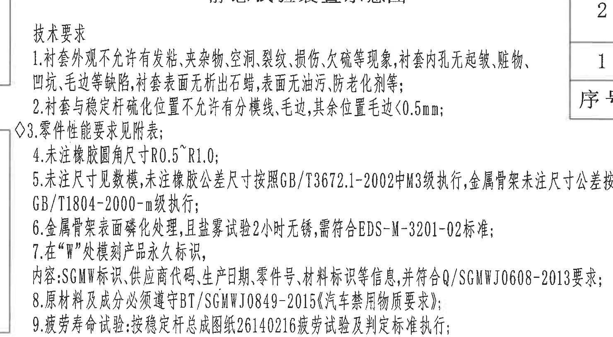

原文识读：

1. 衬套外观不允许有发粘、夹杂物、空洞、裂纹、损伤、欠硫等现象，衬套内孔无起皱、脏物、凹坑、毛边等缺陷，衬套表面无析出石蜡，表面无油污、防老化剂等；
2. 衬套与稳定杆硫化位置不允许有分模线、毛边，其余位置毛边<0.5mm；
3. 零件性能要求见附表；
4. 未注橡胶圆角尺寸 R0.5~R1.0；
5. 未注尺寸见数模，未注橡胶公差尺寸按照 GB/T3672.1-2002 中 M3 级执行，金属骨架未注尺寸按 GB/T1804-2000-m 级执行；
6. 金属骨架表面磷化处理，且盐雾试验 2 小时无锈，需符合 EDS-M-3201-02 标准；
7. 在 “W” 处模刻产品永久标识，内容：SGMW 标识、供应商代码、生产日期、零件号、材料标识等信息，并符合 Q/SGMWJ0608-2013 要求；
8. 原材料及成分必须遵守 BT/SGMWJ0849-2015《汽车禁用物质要求》；
9. 疲劳寿命试验：按稳定杆总成图纸 26140216 疲劳试验及判定标准执行；

## 右上变更表

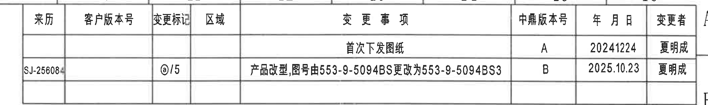

| 来源 | 客户版本号 | 变更标记 | 区域 | 变更事项 | 中鼎版本号 | 年月日 | 变更者 |
|---|---|---|---|---|---|---|---|
|  |  |  |  | 首次下发图纸 | A | 20241224 | 夏明成 |
| SJ-256084 |  | @/5 |  | 产品改型，图号由 553-9-5094BS 更改为 553-9-5094BS3 | B | 2025.10.23 | 夏明成 |

## 表 1 稳定杆衬套技术要求

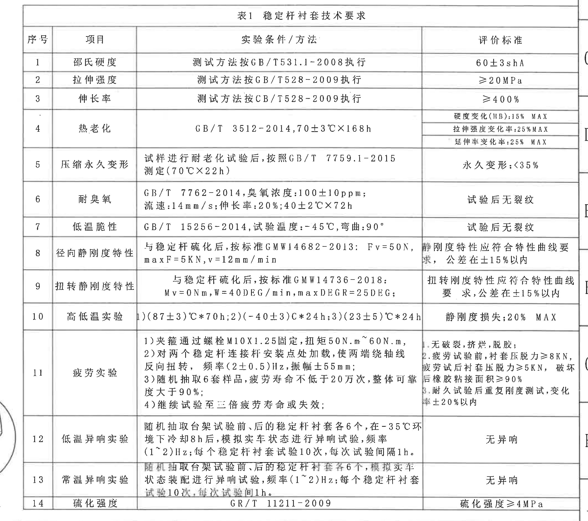

| 序号 | 项目 | 实验条件/方法 | 评价标准 |
|---:|---|---|---|
| 1 | 邵氏硬度 | 测试方法按 GB/T531.1-2008 执行 | 60±3 shA |
| 2 | 拉伸强度 | 测试方法按 GB/T528-2009 执行 | ≥20MPa |
| 3 | 伸长率 | 测试方法按 CB/T528-2009 执行 | ≥400% |
| 4 | 热老化 | GB/T 3512-2014，70±3℃×168h | 硬度变化(HB):15% MAX；拉伸强度变化率:25% MAX；延伸率变化率:25% MAX |
| 5 | 压缩永久变形 | 试样进行耐老化试验后，按照 GB/T 7759.1-2015 测定（70℃×22h） | 永久变形:<35% |
| 6 | 耐臭氧 | GB/T 7762-2014，臭氧浓度:100±10ppm；流速:14mm/s；伸长率:20%；40±2℃×72h | 试验后无裂纹 |
| 7 | 低温脆性 | GB/T 15256-2014，试验温度:-45℃，弯曲:90° | 试验后无裂纹 |
| 8 | 径向静刚度特性 | 与稳定杆硫化后，按标准 GMW14682-2013：Fv=50N，maxF=5KN，v=12mm/min | 静刚度特性应符合特性曲线要求，公差在±15%以内 |
| 9 | 扭转静刚度特性 | 与稳定杆硫化后，按标准 GMW14736-2018：Mv=0Nm，W=40DEG/min，maxDEGR=25DEG； | 扭转刚度特性应符合特性曲线要求，公差在±15%以内 |
| 10 | 高低温实验 | 1)(87±3)℃*70h；2)(-40±3)℃*24h；3)(23±5)℃*24h | 静刚度损失:20% MAX |
| 11 | 疲劳实验 | 1) 夹箍通过螺栓 M10X1.25 固定，扭矩 50N.m~60N.m；2) 对两个稳定杆连接杆安装点处加载，使两端绕轴线反向扭转，频率(2±0.5)Hz，振幅±55mm；3) 随机抽取 6 套样品，疲劳寿命不低于 20 万次，整体可靠度大于 90%；4) 继续试验至三倍疲劳寿命或失效； | 1. 无破裂、挤烂、脱胶；2. 疲劳试验前，衬套压脱力≥8KN，疲劳试验后衬套压脱力≥5KN，破坏后橡胶粘接面积≥90%；3. 耐久试验后重复刚度测试，变化率±20%以内 |
| 12 | 低温异响实验 | 随机抽取台架试验前、后的稳定杆衬套各 6 个，在 -35℃ 环境下冷却 8h 后，模拟实车状态进行异响试验，频率(1~2)Hz；每个稳定杆衬套试验 10 次，每次试验间隔 1h。 | 无异响 |
| 13 | 常温异响实验 | 随机抽取台架试验前、后的稳定杆衬套各 6 个，模拟实车状态装配进行异响试验，频率(1~2)Hz；每个稳定杆衬套试验 10 次，每次试验间隔 1h。 | 无异响 |
| 14 | 硫化强度 | GR/T 11211-2009（按图面识读） | 硫化强度≥4MPa |

## 右下标题栏

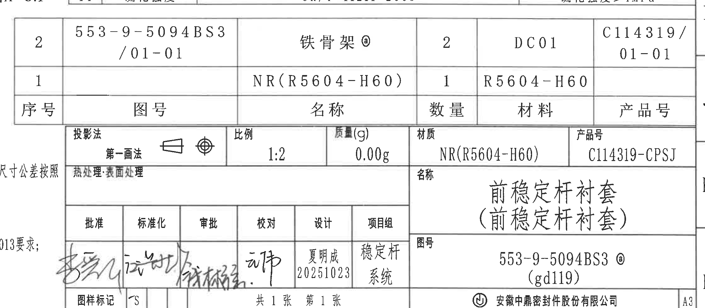

### 明细栏

| 序号 | 图号 | 名称 | 数量 | 材料 | 产品号 |
|---:|---|---|---:|---|---|
| 2 | 553-9-5094BS3 /01-01 | 铁骨架 @ | 2 | DC01 | C114319/01-01 |
| 1 |  | NR(R5604-H60) | 1 | R5604-H60 |  |

### 标题栏字段

| 字段 | 内容 |
|---|---|
| 投影法 | 第一画法 |
| 比例 | 1:2 |
| 质量(g) | 0.00g |
| 材质 | NR(R5604-H60) |
| 产品号 | C114319-CPSJ |
| 名称 | 前稳定杆衬套（前稳定杆衬套） |
| 图号 | 553-9-5094BS3 @ (gd119) |
| 设计 | 夏明成 20251023 |
| 项目组 | 稳定杆系统 |
| 图样页数 | 共 1 张 第 1 张 |
| 公司 | 安徽中鼎密封件股份有限公司 |

