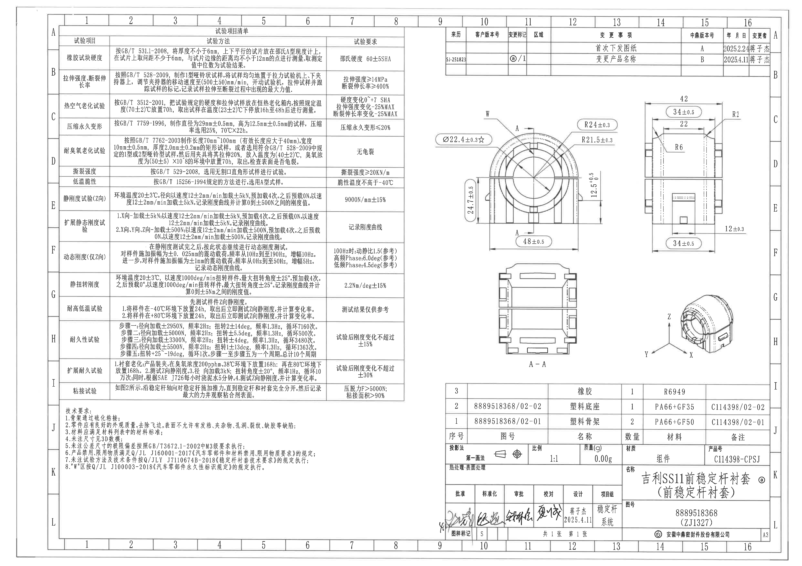
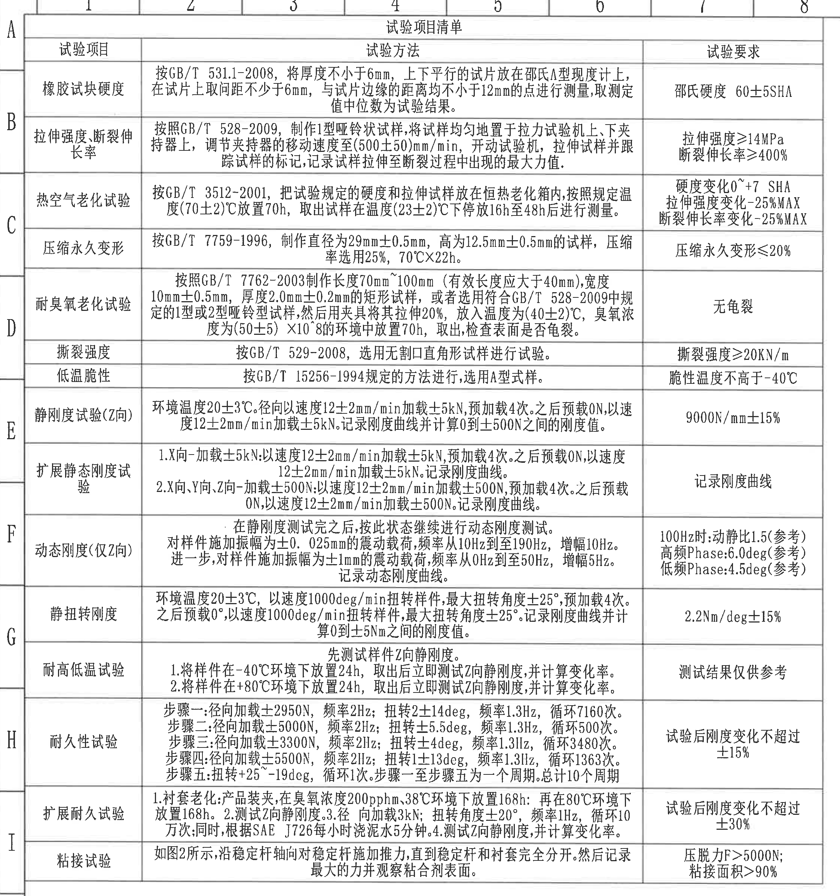
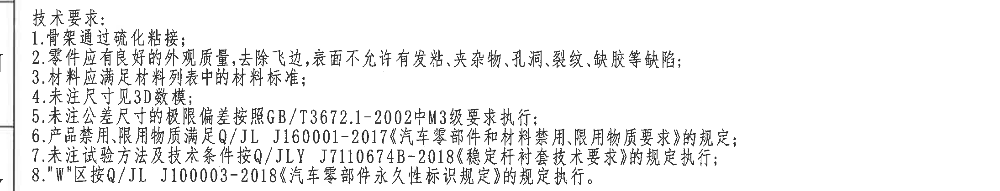
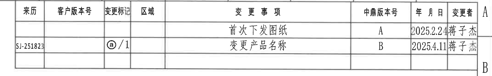
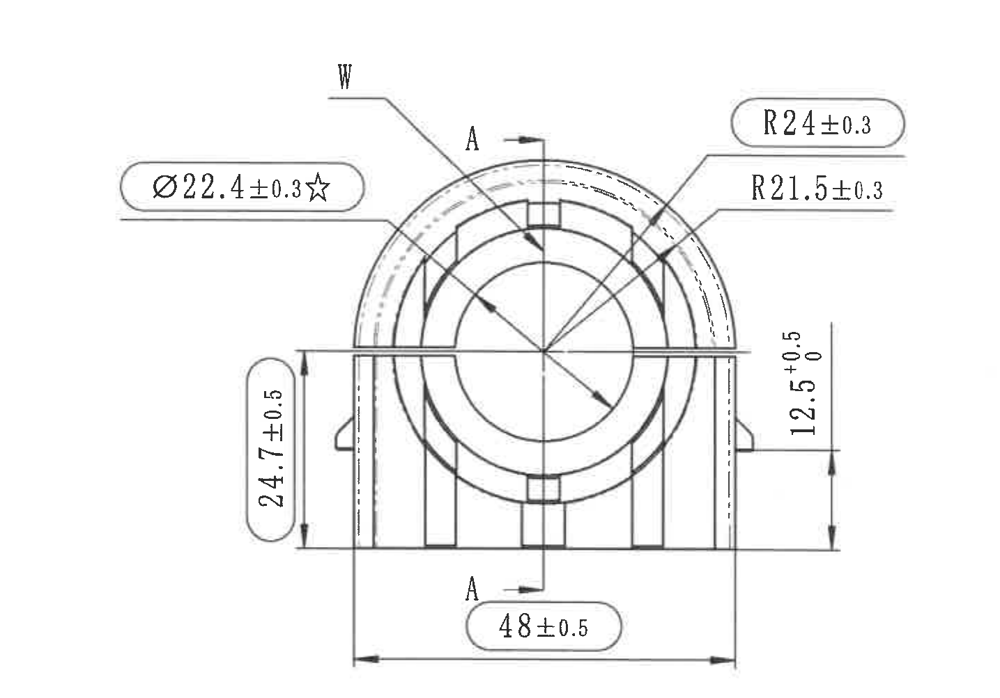
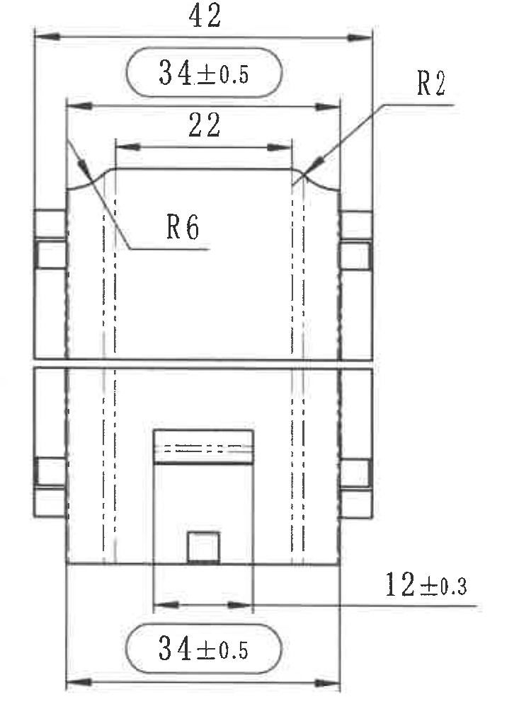
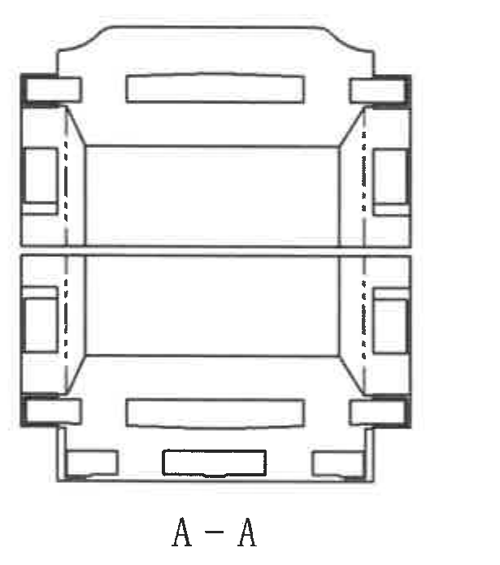
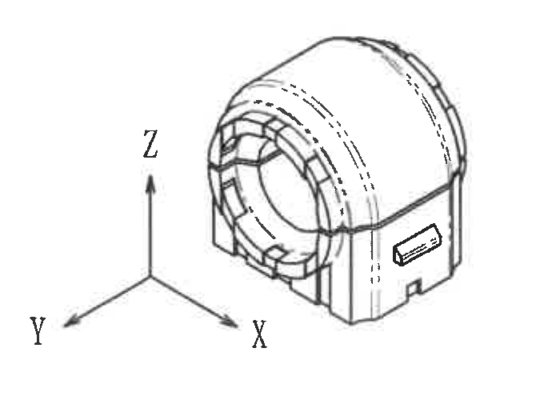
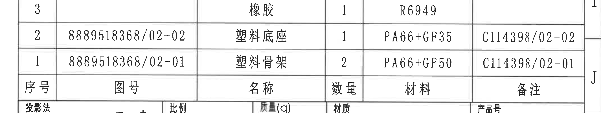
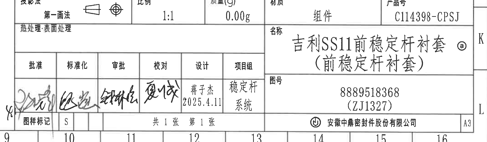

# 20C114398.pdf 内容识别

源文件：`20C114398.pdf`

渲染与裁切说明：PDF 已先渲染为整页 PNG，再按加工视图、剖面视图、局部/轴测视图、表格、NOTES、标题栏分别裁切。以下图片均来自整页渲染图。

## 整页结构

整页为 A3 横向工程图。左侧主体为“试验项目清单”和“技术要求”；右侧上方为变更栏；右侧中部为零件图形视图，包括主视图、右侧视图、A-A 剖面视图和轴测方向示意；右下为明细表和标题栏。

## 试验项目清单

| 试验项目 | 试验方法 | 试验要求 |
|---|---|---|
| 橡胶试块硬度 | 按 GB/T 531.1-2008，将厚度不小于 6mm，上下平行的试片放在邵氏 A 型硬度计上，在试片上取间距不少于 6mm，与试片边缘的距离均不小于 12mm 的点进行测量，取测定值中位数为试验结果。 | 邵氏硬度 60±5SHA |
| 拉伸强度、断裂伸长率 | 按照 GB/T 528-2009，制作 1 型哑铃状试样，将试样均匀地置于拉力试验机上、下夹持器上，调节夹持器的移动速度至 (500±50)mm/min，开动试验机，拉伸试样并跟踪试样的标记，记录试样拉伸至断裂过程中出现的最大力值。 | 拉伸强度 ≥14MPa；断裂伸长率 ≥400% |
| 热空气老化试验 | 按 GB/T 3512-2001，把试验规定的硬度和拉伸试样放在恒热老化箱内，按照规定温度 (70±2)℃ 放置 70h，取出试样在温度 (23±2)℃ 下停放 16h 至 48h 后进行测量。 | 硬度变化 0~+7 SHA；拉伸强度变化 -25%MAX；断裂伸长率变化 -25%MAX |
| 压缩永久变形 | 按 GB/T 7759-1996，制作直径为 29mm±0.5mm，高为 12.5mm±0.5mm 的试样，压缩率选用 25%，70℃X22h。 | 压缩永久变形 ≤20% |
| 耐臭氧老化试验 | 按照 GB/T 7762-2003 制作长度 70mm~100mm（有效长度应大于 40mm），宽度 10mm±0.5mm，厚度 2.0mm±0.2mm 的矩形试样，或者选用符合 GB/T 528-2009 中规定的 1 型或 2 型哑铃型试样，然后用夹具将其拉伸 20%，放入温度为 (40±2)℃，臭氧浓度为 (50±5)×10^-8 的环境中放置 70h，取出，检查表面是否龟裂。 | 无龟裂 |
| 撕裂强度 | 按 GB/T 529-2008，选用无割口直角形试样进行试验。 | 撕裂强度 ≥20KN/m |
| 低温脆性 | 按 GB/T 15256-1994 规定的方法进行，选用 A 型式样。 | 脆性温度不高于 -40℃ |
| 静刚度试验(Z向) | 环境温度 20±3℃。径向以速度 12±2mm/min 加载 ±5kN，预加载 4 次。之后预载 0N，以速度 12±2mm/min 加载 ±5kN。记录刚度曲线并计算 0 到 ±500N 之间的刚度值。 | 9000N/mm±15% |
| 扩展静态刚度试验 | 1. X 向-加载 ±5kN：以速度 12±2mm/min 加载 ±5kN，预加载 4 次。之后预载 0N，以速度 12±2mm/min 加载 ±5kN。记录刚度曲线。 2. X 向、Y 向、Z 向-加载 ±500N：以速度 12±2mm/min 加载 ±500N，预加载 4 次。之后预载 0N，以速度 12±2mm/min 加载 ±500N。记录刚度曲线。 | 记录刚度曲线 |
| 动态刚度(仅Z向) | 在静刚度测试完之后，按此状态继续进行动态刚度测试。对样件施加振幅为 ±0.025mm 的震动载荷，频率从 10Hz 到 190Hz，增幅 10Hz。进一步，对样件施加振幅为 ±1mm 的震动载荷，频率从 0Hz 到 50Hz，增幅 5Hz。记录动态刚度曲线。 | 100Hz 时：动静比 1.5（参考）；高频 Phase：6.0deg（参考）；低频 Phase：4.5deg（参考） |
| 静扭转刚度 | 环境温度 20±3℃，以速度 1000deg/min 扭转样件，最大扭转角度 ±25°，预加载 4 次。之后预载 0°，以速度 1000deg/min 扭转样件，最大扭转角度 ±25°。记录刚度曲线并计算 0 到 ±5Nm 之间的刚度值。 | 2.2Nm/deg±15% |
| 耐高低温试验 | 先测试样件 Z 向静刚度。1. 将样件在 -40℃ 环境下放置 24h，取出后立即测试 Z 向静刚度，并计算变化率。2. 将样件在 +80℃ 环境下放置 24h，取出后立即测试 Z 向静刚度，并计算变化率。 | 测试结果仅供参考 |
| 耐久性试验 | 步骤一：径向加载 ±2950N，频率 2Hz；扭转 2±14deg，频率 1.3Hz，循环 7160 次。 步骤二：径向加载 ±5000N，频率 2Hz；扭转 ±5.5deg，频率 1.3Hz，循环 500 次。 步骤三：径向加载 ±3300N，频率 2Hz；扭转 ±4deg，频率 1.31Hz，循环 3480 次。 步骤四：径向加载 ±5500N，频率 2Hz；扭转 1±13deg，频率 1.3Hz，循环 1363 次。 步骤五：扭转 +25~-19deg，循环 1 次。步骤一至步骤五为一个周期，总计 10 个周期。 | 试验后刚度变化不超过 ±15% |
| 扩展耐久试验 | 1. 衬套老化：产品装夹，在臭氧浓度 200pphm、38℃ 环境下放置 168h；再在 80℃ 环境下放置 168h。2. 测试 Z 向静刚度。3. 径向加载 3kN；扭转角度 ±20°，频率 1Hz，循环 10 万次；同时，根据 SAE J726 每小时浇泥水 5 分钟。4. 测试 Z 向刚度，并计算变化率。 | 试验后刚度变化不超过 ±30% |
| 粘接试验 | 如图 2 所示，沿稳定杆轴向对稳定杆施加推力，直到稳定杆和衬套完全分开。然后记录最大的力并观察粘合剂表面。 | 压脱力 F>5000N；粘接面积 >90% |

## 技术要求 / NOTES

技术要求：

1. 骨架通过硫化粘接；
2. 零件应有良好的外观质量，去除飞边，表面不允许有发粘、夹杂物、孔洞、裂纹、缺胶等缺陷；
3. 材料应满足材料列表中的材料标准；
4. 未注尺寸见 3D 数模；
5. 未注公差尺寸的极限偏差按照 GB/T3672.1-2002 中 M3 级要求执行；
6. 产品禁用、限用物质满足 Q/JL J160001-2017《汽车零部件和材料禁用、限用物质要求》的规定；
7. 未注试验方法及技术条件按 Q/JLY J7110674B-2018《稳定杆衬套技术要求》的规定执行；
8. “W”区按 Q/JL J100003-2018《汽车零部件永久性标识规定》的规定执行。

## 变更栏

| 来历 | 客户版本号 | 变更标记 | 区域 | 变更事项 | 中鼎版本号 | 年月日 | 变更者 |
|---|---|---|---|---|---|---|---|
|  |  |  |  | 首次下发图纸 | A | 2025.2.24 | 蒋子杰 |
| SJ-251823 |  | ⓐ/1 |  | 变更产品名称 | B | 2025.4.11 | 蒋子杰 |

## 主视图

本视图为零件正向加工视图，显示衬套主体圆弧外形、中心孔、底部支承结构和 A-A 剖切位置。

| 标注 | 提取内容 | 含义说明 |
|---|---|---|
| Ø22.4±0.3☆ | 中心孔直径 22.4mm，公差 ±0.3mm，带星号标记 | 表示衬套中心孔/装配孔的直径控制尺寸；星号为图纸中的特殊标识，具体工艺含义需按企业图纸规范或相关技术文件解释。 |
| R24±0.3 | 外侧上部圆弧半径 24mm，公差 ±0.3mm | 控制衬套外圆拱形轮廓的半径。 |
| R21.5±0.3 | 内侧圆弧/台阶圆弧半径 21.5mm，公差 ±0.3mm | 控制与中心孔同区域的内层圆弧轮廓。 |
| 24.7±0.5 | 左侧竖向高度尺寸 24.7mm，公差 ±0.5mm | 从底部基准线到中部分界线/台阶位置的高度控制。 |
| 12.5 +0.5/0 | 右侧竖向尺寸 12.5mm，上偏差 +0.5mm，下偏差 0 | 控制右侧局部高度或台阶位置，采用单向正公差。 |
| 48±0.5 | 底部总体宽度 48mm，公差 ±0.5mm | 控制主视方向下零件底部两侧边界之间的宽度。 |
| A-A | 剖切线和箭头 | 指示下方 A-A 剖面视图的剖切位置和方向。 |
| W | 区域标记 | 与技术要求第 8 条对应，表示 W 区按永久性标识规定执行。 |

## 右侧视图

本视图显示零件侧向轮廓、上下分段、侧向台阶、卡槽/窗口和局部圆角。

| 标注 | 提取内容 | 含义说明 |
|---|---|---|
| 42 | 顶部总尺寸 42mm | 控制侧视图上方最外侧边界间距。 |
| 34±0.5 | 上部宽度 34mm，公差 ±0.5mm | 控制上部主体区域宽度。 |
| 22 | 内部开口/槽口宽度 22mm | 控制上部内侧凹槽或窗口的横向尺寸。 |
| R2 | 小圆角半径 2mm | 指向右上局部过渡圆角。 |
| R6 | 内部过渡圆角半径 6mm | 指向上部内腔的大圆角过渡。 |
| 12±0.3 | 右下局部尺寸 12mm，公差 ±0.3mm | 控制下部局部台阶/窗口相对位置或宽度。 |
| 34±0.5 | 下部宽度 34mm，公差 ±0.5mm | 控制下部主体区域宽度。 |

## A-A 剖面视图

本图为沿主视图 A-A 位置取得的剖面/断面视图。图中未给出独立尺寸数值，主要展示剖切后的内部结构：上、下长条槽，两侧台阶/卡接结构，中部贯通区域，以及底部局部槽口。尺寸含义应与主视图和右侧视图中的对应轮廓共同使用。

## 轴测方向示意图

本图为零件轴测外形和坐标方向示意，未给出独立尺寸。可见坐标方向 X、Y、Z，用于说明零件方向和试验方向；外形显示圆筒状衬套上部、前端孔口、侧面标识区和底部支承结构。

## 明细表

| 序号 | 图号 | 名称 | 数量 | 材料 | 备注 |
|---|---|---|---|---|---|
| 3 |  | 橡胶 | 1 | R6949 |  |
| 2 | 8889518368/02-02 | 塑料底座 | 1 | PA66+GF35 | C114398/02-02 |
| 1 | 8889518368/02-01 | 塑料骨架 | 2 | PA66+GF50 | C114398/02-01 |

## 标题栏

| 字段 | 内容 |
|---|---|
| 投影法 | 第一画法 |
| 比例 | 1:1 |
| 质量(g) | 0.00g |
| 材质 | 组件 |
| 产品号 | C114398-CPSJ |
| 热处理:表面处理 | 空白 |
| 名称 | 吉利SS11前稳定杆衬套（前稳定杆衬套）ⓐ |
| 图号 | 8889518368（ZJ1327） |
| 批准 | 手写签名，扫描件中未能可靠辨识 |
| 标准化 | 手写签名，扫描件中未能可靠辨识 |
| 审批 | 手写签名，扫描件中未能可靠辨识 |
| 校对 | 手写签名，扫描件中未能可靠辨识 |
| 设计 | 蒋子杰，2025.4.11 |
| 项目组 | 稳定杆系统 |
| 图样标记 | S |
| 张数 | 共 1 张，第 1 张 |
| 公司 | 安徽中鼎密封件股份有限公司 |
| 图幅 | A3 |

