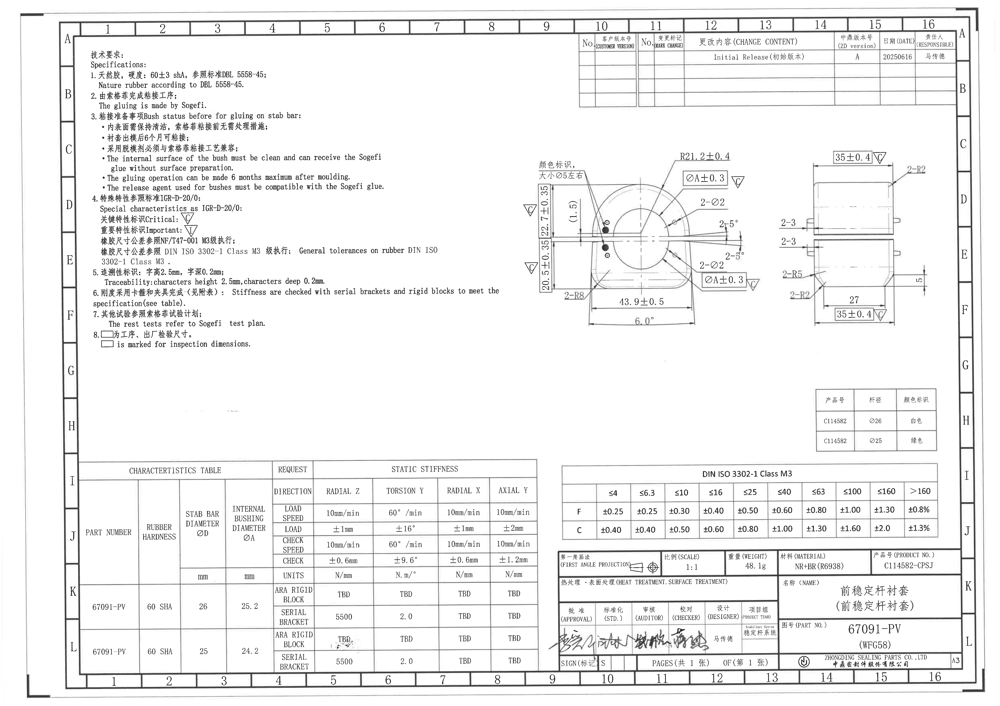
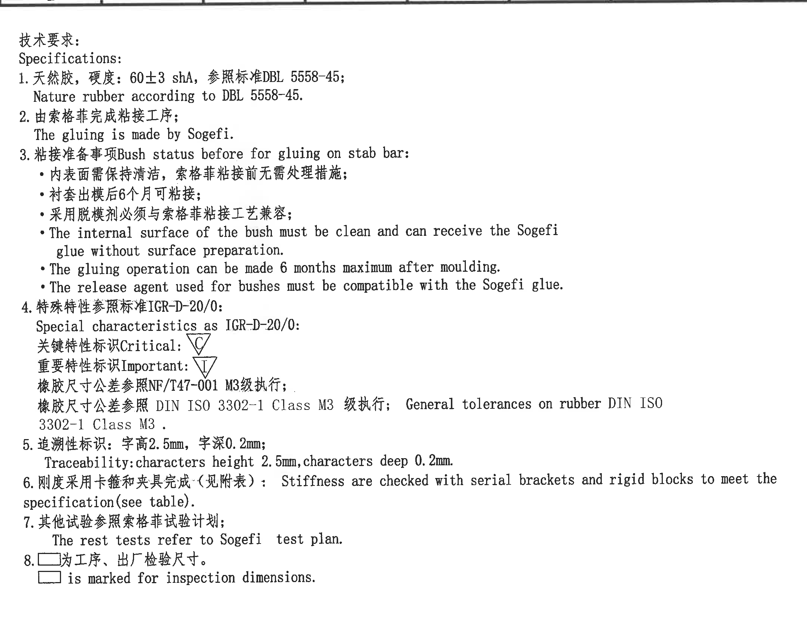
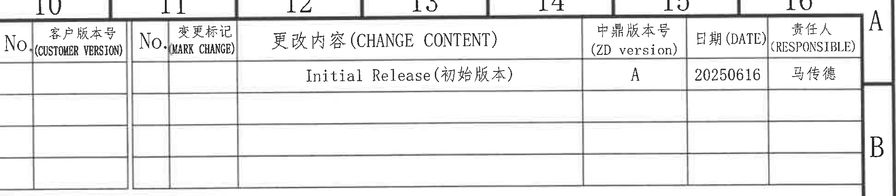
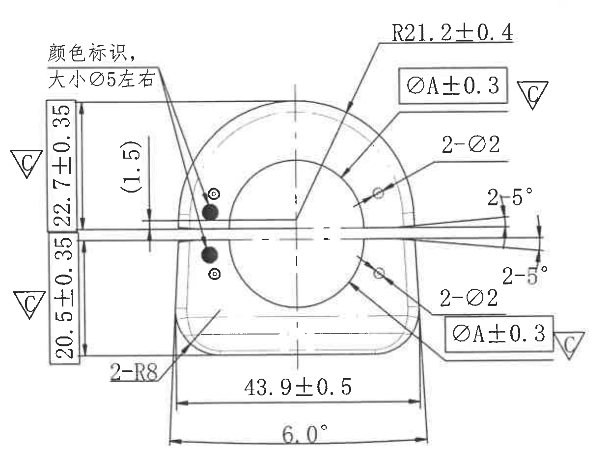
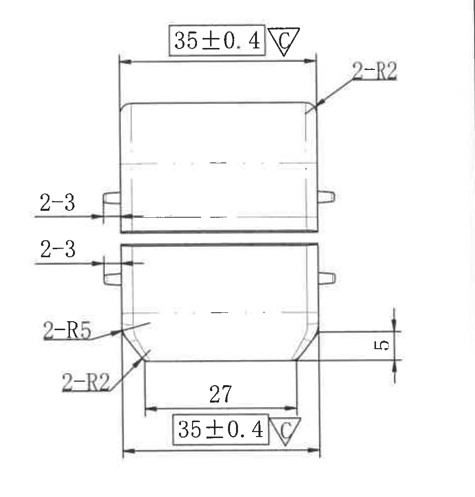
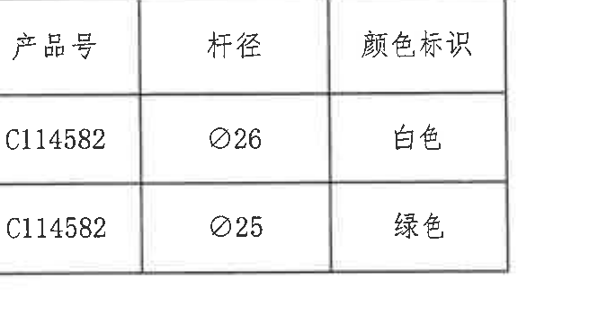
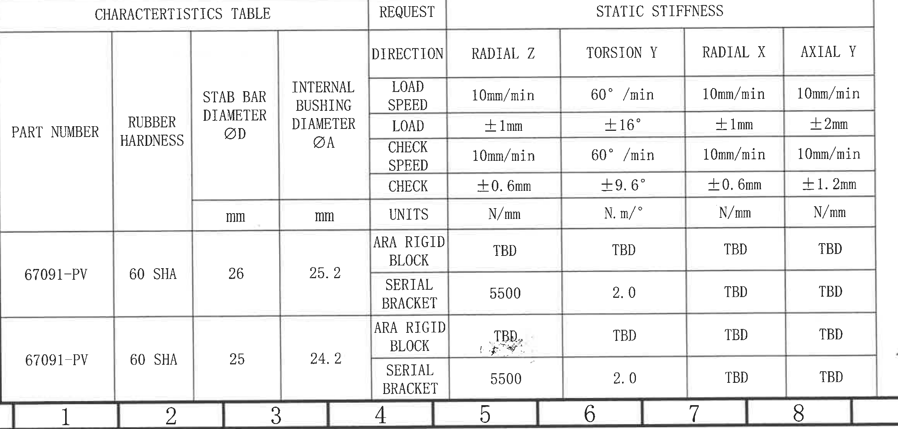
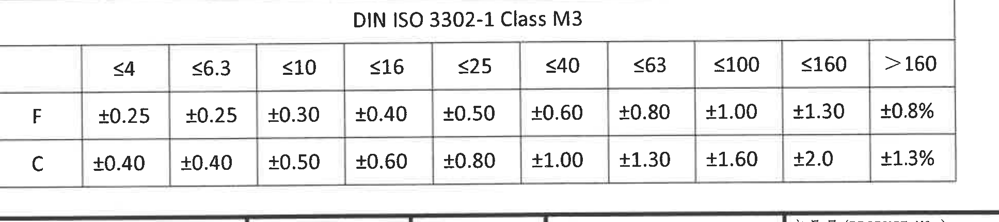
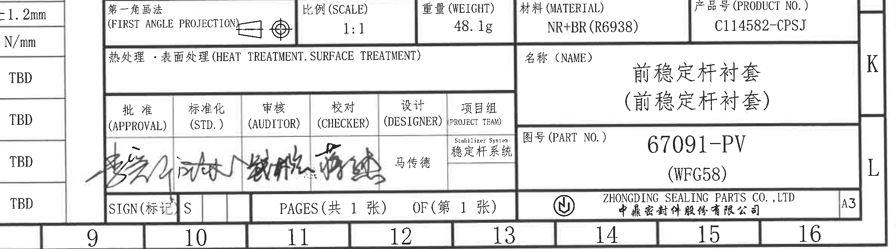

# 20C114582.pdf 内容识别

源文件：`20C114582.pdf`

渲染与裁切说明：PDF 已先渲染为整页 PNG，再按 NOTES、变更栏、加工视图、表格、标题栏分别裁切。以下图片均来自整页渲染图。图中未见独立剖面视图或局部视图。

## 整页结构

整页为 A3 横向工程图。左上为技术要求 / Specifications；右上为变更栏；中右为零件加工视图，包括正向主视图和右侧视图；右中下为颜色标识表；底部左侧为 CHARACTERISTICS TABLE / STATIC STIFFNESS 表；底部中右为 DIN ISO 3302-1 Class M3 公差表；右下为标题栏。

## 技术要求 / Specifications

1. 天然胶，硬度：60±3 shA，参照标准 DBL 5558-45；  
   Nature rubber according to DBL 5558-45.
2. 由索格菲完成粘接工序；  
   The gluing is made by Sogefi.
3. 粘接准备事项 Bush status before for gluing on stab bar:
   - 内表面需保持清洁，索格菲粘接前无需处理措施；
   - 衬套出模后 6 个月可粘接；
   - 采用脱模剂必须与索格菲粘接工艺兼容；
   - The internal surface of the bush must be clean and can receive the Sogefi glue without surface preparation.
   - The gluing operation can be made 6 months maximum after moulding.
   - The release agent used for bushes must be compatible with the Sogefi glue.
4. 特殊特性参照标准 IGR-D-20/0:  
   Special characteristics as IGR-D-20/0:  
   关键特性标识 Critical: 倒三角内 `C`；  
   重要特性标识 Important: 倒三角内 `I`；  
   橡胶尺寸公差参照 NF/T47-001 M3 级执行；  
   橡胶尺寸公差参照 DIN ISO 3302-1 Class M3 级执行；General tolerances on rubber DIN ISO 3302-1 Class M3.
5. 追溯性标识：字高 2.5mm，字深 0.2mm；  
   Traceability: characters height 2.5mm, characters deep 0.2mm.
6. 刚度采用卡箍和夹具完成（见附表）：  
   Stiffness are checked with serial brackets and rigid blocks to meet the specification (see table).
7. 其他试验参照索格菲试验计划；  
   The rest tests refer to Sogefi test plan.
8. 方框标识为工序、出厂检验尺寸。  
   Box mark is marked for inspection dimensions.

## 变更栏

| No. | 客户版本号 (CUSTOMER VERSION) | No. | 变更标记 (MARK CHANGE) | 更改内容 (CHANGE CONTENT) | 中鼎版本号 (ZD VERSION) | 日期 (DATE) | 责任人 (RESPONSIBLE) |
|---|---|---|---|---|---|---|---|
|  |  |  |  | Initial Release（初始版本） | A | 20250616 | 马传德 |

## 主视图 / 正向加工视图

本视图显示衬套正向轮廓、内孔、底部轮廓、横向开口/切缝、颜色标识点及关键尺寸标注。

| 标注 | 提取内容 | 含义说明 |
|---|---|---|
| 颜色标识，大小 Ø5 左右 | 视图左上文字说明，指向零件左侧两处圆点标识 | 表示产品颜色识别点，标识直径约 5mm。 |
| 22.7±0.35，关键特性 `C` | 左侧上段竖向尺寸 22.7mm，公差 ±0.35mm | 控制上半部分从中间基准/分界线到上端对应边界的高度。带 `C`，为关键特性。 |
| 20.5±0.35，关键特性 `C` | 左侧下段竖向尺寸 20.5mm，公差 ±0.35mm | 控制下半部分从中间基准/分界线到下端对应边界的高度。带 `C`，为关键特性。 |
| (1.5) | 括号参考尺寸 1.5mm | 括号表示参考尺寸，用于说明局部距离，不作为主要检验控制尺寸。 |
| R21.2±0.4 | 上部外圆弧半径 21.2mm，公差 ±0.4mm | 控制衬套上部拱形外轮廓的圆弧半径。 |
| ØA±0.3，关键特性 `C` | 内孔直径 A，公差 ±0.3mm；图中上下各有一处同类标注 | 控制内孔/内衬套直径，实际 A 值由特性表按杆径匹配；带 `C`，为关键特性。 |
| 2-Ø2 | 两处 Ø2 孔/圆形局部特征 | 表示该 Ø2 特征数量为 2，分别位于内孔右上和右下附近。 |
| 2-5° | 两处 5° 角度 | 控制横向开口/切缝上下边相对中心线的角度，数量为 2。 |
| 2-R8 | 两处 R8 圆角 | 控制底部左侧对应的两处过渡圆角半径。 |
| 43.9±0.5 | 底部横向宽度 43.9mm，公差 ±0.5mm | 控制主视图底部两侧边界之间的宽度。 |
| 6.0° | 底部倾斜/夹角 6.0° | 控制底部轮廓线相对基准的角度关系。 |

## 右侧视图 / 侧向加工视图

本视图显示零件侧向轮廓，上下两段主体、侧向凸耳、下部台阶/收口及圆角过渡。

| 标注 | 提取内容 | 含义说明 |
|---|---|---|
| 35±0.4，关键特性 `C` | 上部横向总宽 35mm，公差 ±0.4mm | 控制侧视方向上部主体宽度；带 `C`，为关键特性。 |
| 35±0.4，关键特性 `C` | 下部横向总宽 35mm，公差 ±0.4mm | 控制侧视方向下部主体宽度；带 `C`，为关键特性。 |
| 2-R2 | 两处 R2 圆角 | 控制上部右侧以及下部左下附近的 R2 过渡圆角。 |
| 2-3 | 两处 3mm 局部凸出/台阶标注 | 指向左侧上下两个侧向凸耳或台阶，数量为 2。 |
| 2-R5 | 两处 R5 圆角 | 控制下部收口附近较大的过渡圆角。 |
| 27 | 内侧底部宽度 27mm | 控制下部内侧两竖边之间的宽度。 |
| 5 | 右侧竖向局部高度 5mm | 控制下部台阶/收口的竖向高度。 |

## 颜色标识表

| 产品号 | 杆径 | 颜色标识 |
|---|---|---|
| C114582 | Ø26 | 白色 |
| C114582 | Ø25 | 绿色 |

该表与主视图中的“颜色标识，大小 Ø5 左右”对应，用杆径区分颜色标识：杆径 Ø26 对应白色，杆径 Ø25 对应绿色。

## CHARACTERISTICS TABLE / STATIC STIFFNESS

| PART NUMBER | RUBBER HARDNESS | STAB BAR DIAMETER ØD (mm) | INTERNAL BUSHING DIAMETER ØA (mm) | REQUEST | RADIAL Z | TORSION Y | RADIAL X | AXIAL Y |
|---|---|---:|---:|---|---|---|---|---|
| 67091-PV | 60 SHA | 26 | 25.2 | ARA RIGID BLOCK | TBD | TBD | TBD | TBD |
| 67091-PV | 60 SHA | 26 | 25.2 | SERIAL BRACKET | 5500 | 2.0 | TBD | TBD |
| 67091-PV | 60 SHA | 25 | 24.2 | ARA RIGID BLOCK | TBD | TBD | TBD | TBD |
| 67091-PV | 60 SHA | 25 | 24.2 | SERIAL BRACKET | 5500 | 2.0 | TBD | TBD |

表头测试条件：

| 项目 | RADIAL Z | TORSION Y | RADIAL X | AXIAL Y |
|---|---|---|---|---|
| LOAD SPEED | 10mm/min | 60°/min | 10mm/min | 10mm/min |
| LOAD | ±1mm | ±16° | ±1mm | ±2mm |
| CHECK SPEED | 10mm/min | 60°/min | 10mm/min | 10mm/min |
| CHECK | ±0.6mm | ±9.6° | ±0.6mm | ±1.2mm |
| UNITS | N/mm | N.m/° | N/mm | N/mm |

含义说明：该表按杆径 ØD 区分内衬套直径 ØA，并给出静刚度检测方向、加载条件、检测条件和目标值。主视图中的 `ØA±0.3` 应与本表的 INTERNAL BUSHING DIAMETER ØA 配合使用：杆径 Ø26 时 ØA 为 25.2mm；杆径 Ø25 时 ØA 为 24.2mm。

## DIN ISO 3302-1 Class M3 公差表

|  | ≤4 | ≤6.3 | ≤10 | ≤16 | ≤25 | ≤40 | ≤63 | ≤100 | ≤160 | >160 |
|---|---:|---:|---:|---:|---:|---:|---:|---:|---:|---:|
| F | ±0.25 | ±0.25 | ±0.30 | ±0.40 | ±0.50 | ±0.60 | ±0.80 | ±1.00 | ±1.30 | ±0.8% |
| C | ±0.40 | ±0.40 | ±0.50 | ±0.60 | ±0.80 | ±1.00 | ±1.30 | ±1.60 | ±2.0 | ±1.3% |

该表对应技术要求第 4 条“橡胶尺寸公差参照 DIN ISO 3302-1 Class M3 级执行”，用于未单独标注公差的橡胶尺寸。

## 标题栏

| 字段 | 内容 |
|---|---|
| 投影法 | 第一角画法 (FIRST ANGLE PROJECTION) |
| 比例 (SCALE) | 1:1 |
| 重量 (WEIGHT) | 48.1g |
| 材料 (MATERIAL) | NR+BR (R6938) |
| 产品号 (PRODUCT NO.) | C114582-CPSJ |
| 热处理・表面处理 (HEAT TREATMENT, SURFACE TREATMENT) | 空白 |
| 名称 (NAME) | 前稳定杆衬套（前稳定杆衬套） |
| 图号 (PART NO.) | 67091-PV (WFG58) |
| 批准 (APPROVAL) | 手写签名，扫描件中未能可靠辨识 |
| 标准化 (STD.) | 手写签名，扫描件中未能可靠辨识 |
| 审核 (AUDITOR) | 手写签名，扫描件中未能可靠辨识 |
| 校对 (CHECKER) | 手写签名，扫描件中未能可靠辨识 |
| 设计 (DESIGNER) | 马传德 |
| 项目组 (PROJECT TEAM) | Stabilizer System / 稳定杆系统 |
| SIGN (标记) | S |
| 页数 | PAGES（共 1 张）OF（第 1 张） |
| 公司 | ZHONGDING SEALING PARTS CO., LTD / 中鼎密封件股份有限公司 |
| 图幅 | A3 |
