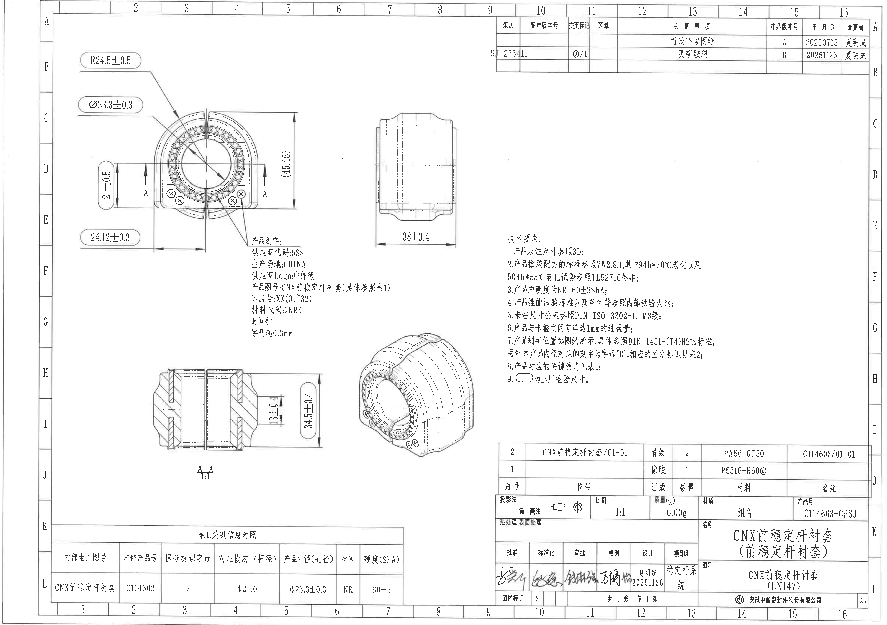
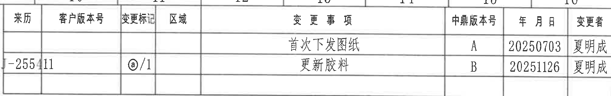
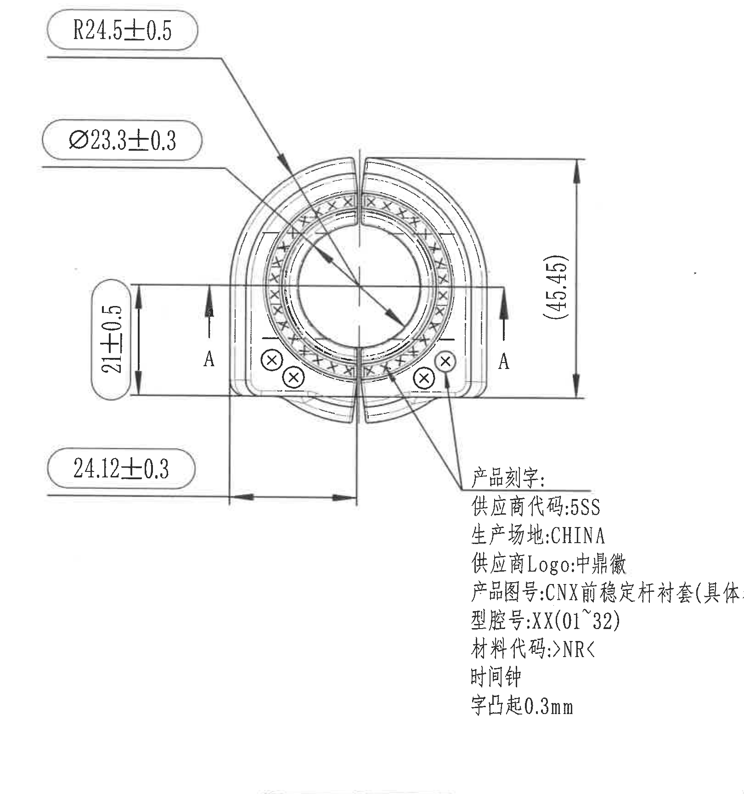
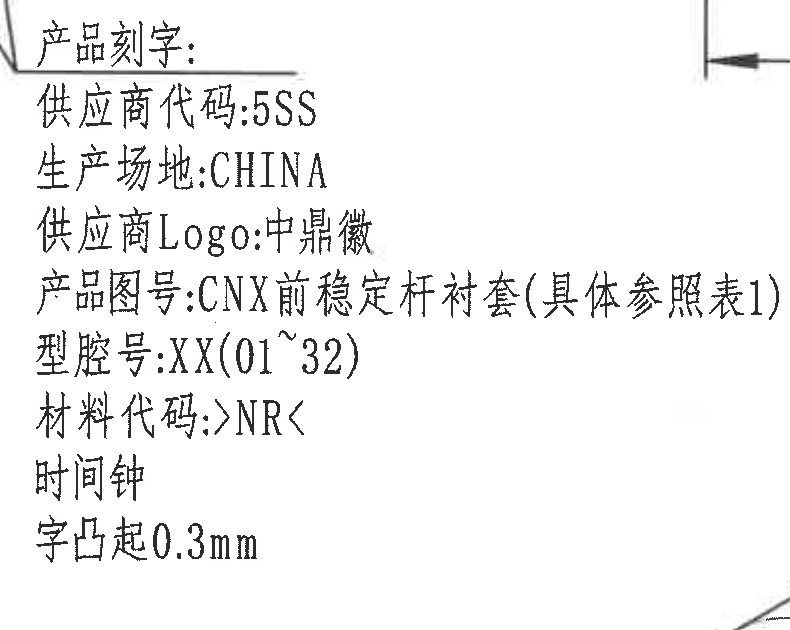
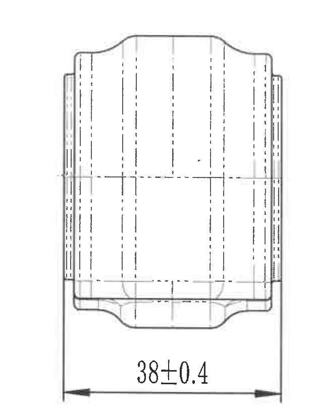
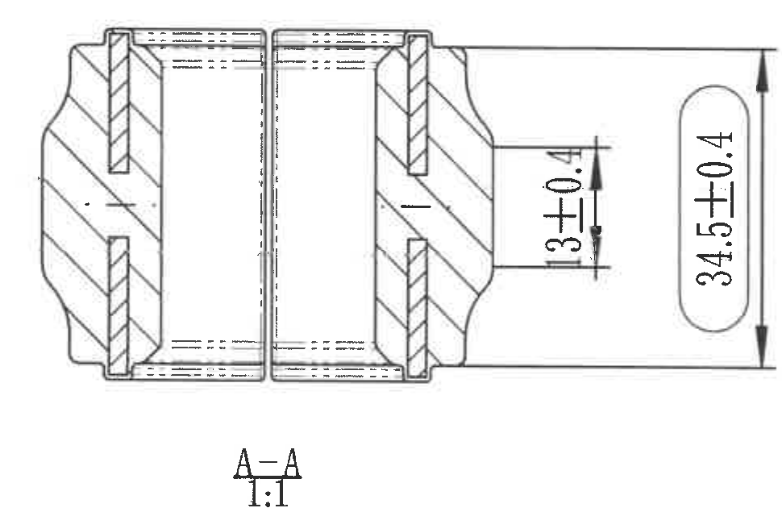
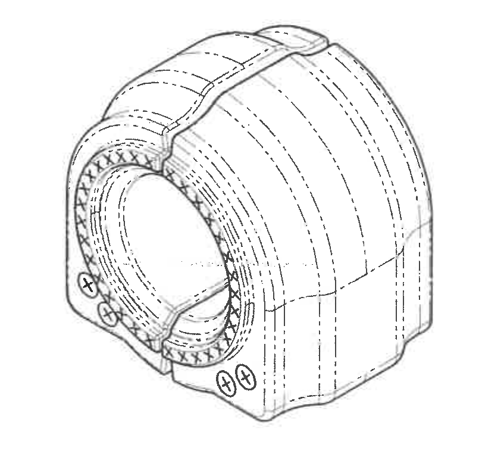
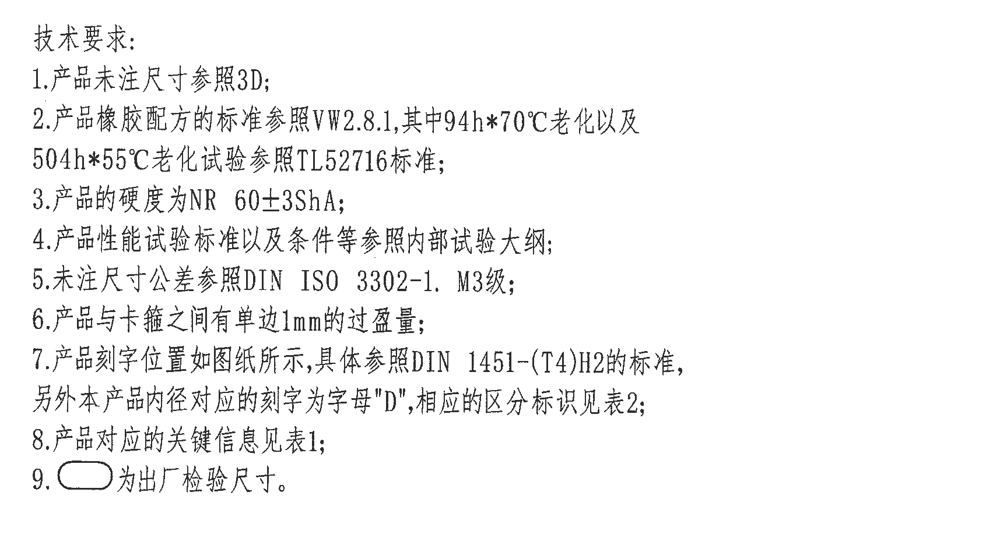
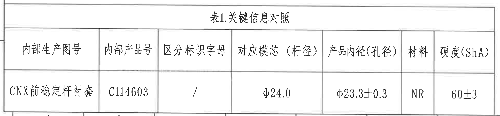
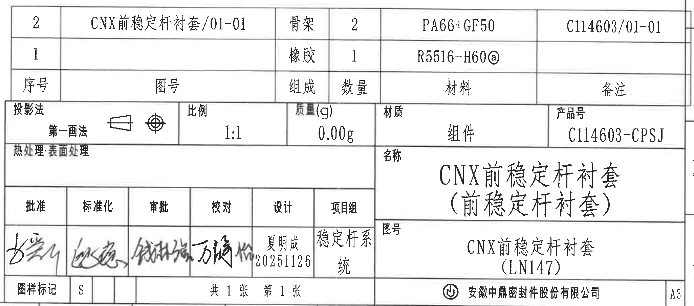

# 20C114603.pdf 内容识别

## 整页渲染图



## 右上变更表



| 来历 | 客户版本号 | 变更标记 | 区域 | 变更事项 | 中鼎版本号 | 年月日 | 变更者 |
|---|---|---|---|---|---|---|---|
|  |  |  |  | 首次下发图纸 | A | 20250703 | 夏明成 |
| SJ-255411 |  | @/1 |  | 更新胶料 | B | 20251126 | 夏明成 |

## 主视图





| 原图标注 | 提取内容 | 含义说明 |
|---|---|---|
| R24.5+/-0.5 | 半径 24.5，公差 +/-0.5 | 圆弧外形半径尺寸，带圆角框，按技术要求 9 属出厂检验尺寸。 |
| Ø23.3+/-0.3 | 孔径 23.3，公差 +/-0.3 | 衬套内孔直径尺寸，带圆角框，按技术要求 9 属出厂检验尺寸。 |
| 21+/-0.5 | 局部高度/端部安装区域高度 21，公差 +/-0.5 | 主视图左侧竖向尺寸，对应下部耳部到上基准线的高度。 |
| (45.45) | 参考高度 45.45 | 括号尺寸，表示参考尺寸，不作为直接制造控制尺寸。 |
| 24.12+/-0.3 | 左侧至中心线/基准线的横向尺寸 24.12，公差 +/-0.3 | 主视图下方横向定位尺寸，带圆角框，按技术要求 9 属出厂检验尺寸。 |
| A-A | 剖切位置 | 主视图两侧箭头标识 A-A 剖面位置，剖视图见下方 A-A。 |

产品刻字内容：

```text
产品刻字:
供应商代码:5SS
生产场地:CHINA
供应商Logo:中鼎徽
产品图号:CNX前稳定杆衬套(具体参照表1)
型腔号:XX(01~32)
材料代码:>NR<
时间钟
字凸起0.3mm
```

## 侧视图



| 原图标注 | 提取内容 | 含义说明 |
|---|---|---|
| 38+/-0.4 | 总宽度 38，公差 +/-0.4 | 侧视方向的零件总宽度尺寸。 |

## A-A 剖面视图



| 原图标注 | 提取内容 | 含义说明 |
|---|---|---|
| A-A 1:1 | A-A 剖面，比例 1:1 | 由主视图 A-A 剖切位置得到的剖面图。 |
| 34.5+/-0.4 | 剖面外形高度 34.5，公差 +/-0.4 | 剖面右侧竖向总高度尺寸。 |
| 13+/-0.4 | 局部台阶/壁厚相关高度 13，公差 +/-0.4 | 剖面右侧局部竖向尺寸，控制内部/端部结构局部高度。 |

## 轴测视图



| 原图标注 | 提取内容 | 含义说明 |
|---|---|---|
| 无新增尺寸 | 展示零件三维外形 | 用于表达衬套外形、开口、内孔、端部凸耳和嵌件/骨架位置关系。尺寸归属以主视图、侧视图和 A-A 剖面标注为准。 |

## 技术要求



```text
技术要求:
1.产品未注尺寸参照3D;
2.产品橡胶配方的标准参照VW2.8.1,其中94h*70℃老化以及
  504h*55℃老化试验参照TL52716标准;
3.产品的硬度为NR 60+/-3ShA;
4.产品性能试验标准以及条件等参照内部试验大纲;
5.未注尺寸公差参照DIN ISO 3302-1. M3级;
6.产品与卡箍之间有单边1mm的过盈量;
7.产品刻字位置如图纸所示,具体参照DIN 1451-(T4)H2的标准,
  另外本产品内径对应的刻字为字母"D",相应的区分标识见表2;
8.产品对应的关键信息见表1;
9.圆角框内为出厂检验尺寸。
```

## 表1 关键信息对照



| 内部生产图号 | 内部产品号 | 区分标识字母 | 对应模芯（杆径） | 产品内径（孔径） | 材料 | 硬度(ShA) |
|---|---|---|---|---|---|---|
| CNX前稳定杆衬套 | C114603 | / | φ24.0 | φ23.3+/-0.3 | NR | 60+/-3 |

## 右下明细表与标题栏



明细表：

| 序号 | 图号 | 组成 | 数量 | 材料 | 备注 |
|---|---|---|---|---|---|
| 2 | CNX前稳定杆衬套/01-01 | 骨架 | 2 | PA66+GF50 | C114603/01-01 |
| 1 |  | 橡胶 | 1 | R5516-H60@ |  |

标题栏：

| 项目 | 内容 |
|---|---|
| 投影法 | 第一画法 |
| 比例 | 1:1 |
| 质量(g) | 0.00g |
| 材质 | 组件 |
| 产品号 | C114603-CPSJ |
| 名称 | CNX前稳定杆衬套（前稳定杆衬套） |
| 图号 | CNX前稳定杆衬套（LN147） |
| 设计 | 夏明成 20251126 |
| 项目组 | 稳定杆系统 |
| 图样标记 | S |
| 张数 | 共1张 第1张 |
| 公司 | 安徽中鼎密封件股份有限公司 |
| 图幅 | A3 |

