# 20C114649.pdf 内容识别

## 整页渲染

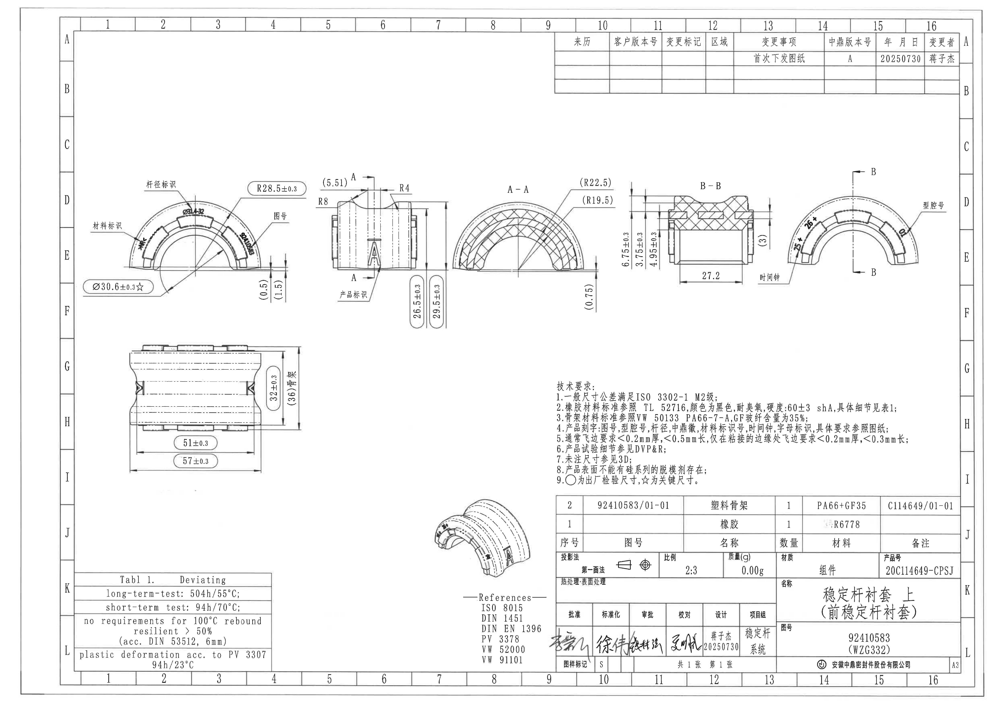

## 顶部变更栏

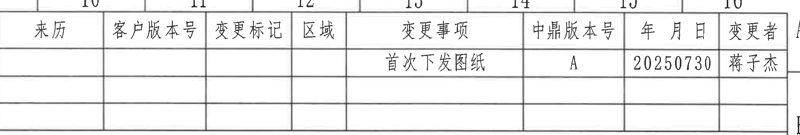

| 来历 | 客户版本号 | 变更标记 | 区域 | 变更事项 | 中鼎版本号 | 年月日 | 变更者 |
|---|---|---|---|---|---|---|---|
|  |  |  |  | 首次下发图纸 | A | 20250730 | 蒋子杰 |

## 左上圆弧正视图

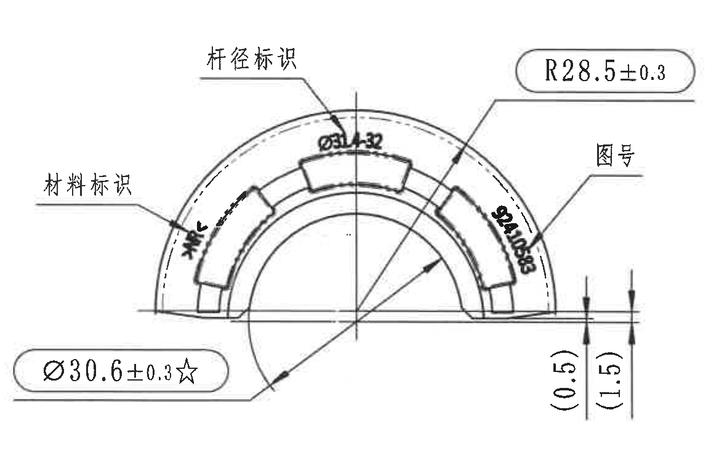

提取内容：

| 项目 | 原图内容 |
|---|---|
| 引出标识 | 杆径标识 |
| 引出标识 | 材料标识 |
| 引出标识 | 图号 |
| 圆弧半径 | R28.5±0.3 |
| 直径尺寸 | Ø30.6±0.3☆ |
| 杆径处标注 | Ø31.32 |
| 台阶/边缘高度 | (0.5) |
| 台阶/边缘高度 | (1.5) |
| 图号文字 | 92410583 |
| 材料标识处文字 | 图中字符较模糊，无法可靠识别 |

含义解读：

- 该视图表达零件半圆弧外形、内外弧关系和标识位置。
- R28.5±0.3 为外侧圆弧半径控制尺寸。
- Ø30.6±0.3☆ 为带星号的关键检验尺寸；星号含义见技术要求第 9 条。
- Ø31.32 对应“杆径标识”所在位置的直径/杆径标注。
- (0.5)、(1.5) 为右侧底边附近局部高度或台阶参考尺寸，括号尺寸按参考尺寸理解。

## 上中端面视图

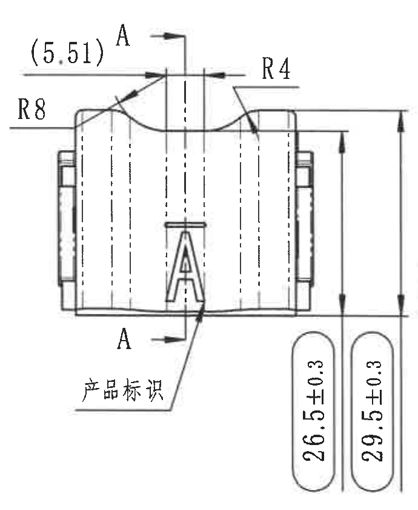

提取内容：

| 项目 | 原图内容 |
|---|---|
| 剖切标记 | A-A |
| 局部参考尺寸 | (5.51) |
| 圆角/半径 | R8 |
| 圆角/半径 | R4 |
| 高度尺寸 | 26.5±0.3 |
| 高度尺寸 | 29.5±0.3 |
| 引出标识 | 产品标识 |

含义解读：

- 该视图表达零件宽度方向端面外形、顶部凹弧和产品标识位置。
- A-A 为剖切位置，用于对应后续 A-A 剖面视图。
- R8、R4 控制顶部两处圆角/过渡圆弧。
- 26.5±0.3 与 29.5±0.3 为端面方向两级高度控制尺寸。
- (5.51) 为括号参考尺寸。

## A-A 剖面视图

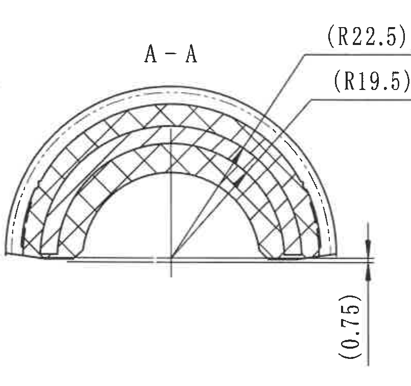

提取内容：

| 项目 | 原图内容 |
|---|---|
| 剖面名称 | A-A |
| 外侧参考半径 | (R22.5) |
| 内侧参考半径 | (R19.5) |
| 底部局部尺寸 | (0.75) |

含义解读：

- 该剖面展示半圆弧截面的层状/嵌件结构，剖面线表示被切开的实体材料。
- (R22.5)、(R19.5) 为剖面内外弧参考半径。
- (0.75) 为底边局部参考厚度/间隙尺寸。

## B-B 剖面视图

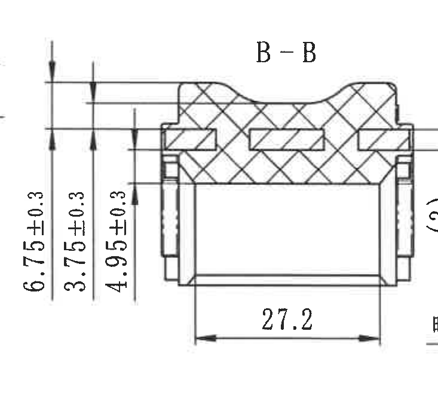

提取内容：

| 项目 | 原图内容 |
|---|---|
| 剖面名称 | B-B |
| 宽度尺寸 | 27.2 |
| 左侧高度尺寸 | 6.75±0.3 |
| 左侧高度尺寸 | 3.75±0.3 |
| 左侧高度尺寸 | 4.95±0.3 |
| 右侧参考尺寸 | (3) |

含义解读：

- 该剖面展示 B-B 位置的内部截面、上部凹槽和左右侧嵌件/凸台结构。
- 27.2 为剖面下部横向宽度。
- 6.75±0.3、3.75±0.3、4.95±0.3 控制剖面不同台阶高度。
- (3) 为右侧括号参考尺寸。

## 右侧圆弧视图

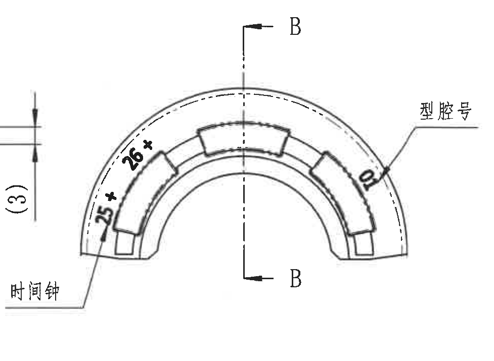

提取内容：

| 项目 | 原图内容 |
|---|---|
| 剖切标记 | B-B |
| 左侧标注 | 25+ |
| 左侧标注 | 26+ |
| 右侧标注 | 01 |
| 引出标识 | 型腔号 |
| 引出标识 | 时间钟 |

含义解读：

- 该视图表达另一侧圆弧外观及模具相关标识。
- B-B 剖切标记指向对应的 B-B 剖面。
- “型腔号”和“时间钟”为产品刻字/模具追溯标识位置。
- 25+、26+、01 为该视图上的局部标识内容。

## 左下侧视图

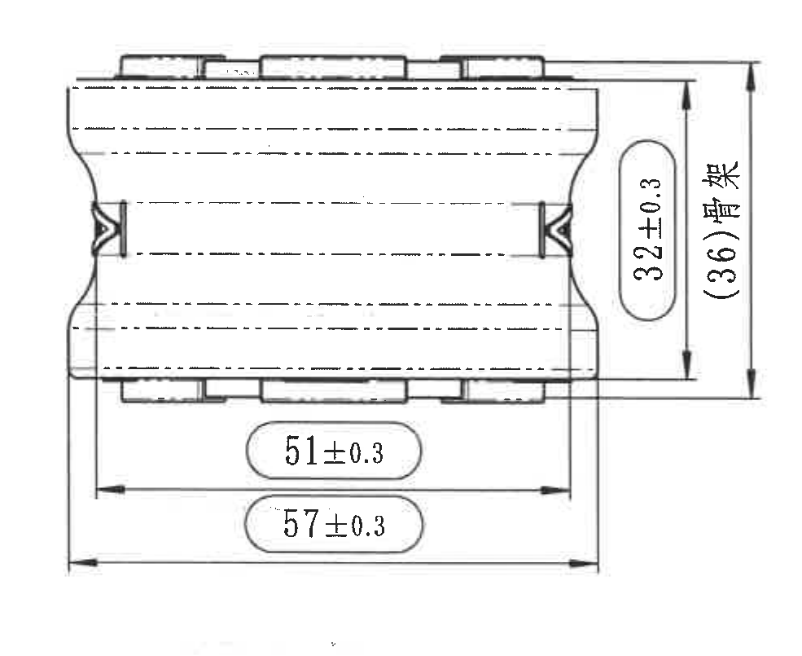

提取内容：

| 项目 | 原图内容 |
|---|---|
| 长度尺寸 | 51±0.3 |
| 长度尺寸 | 57±0.3 |
| 高度尺寸 | 32±0.3 |
| 总高/骨架尺寸 | (36)骨架 |

含义解读：

- 该视图表达零件沿长度方向的侧面轮廓、两端凹陷结构和上下凸台位置。
- 51±0.3 与 57±0.3 为两级长度控制尺寸。
- 32±0.3 为主体高度控制尺寸。
- (36)骨架 为骨架相关参考高度尺寸。

## 轴测视图

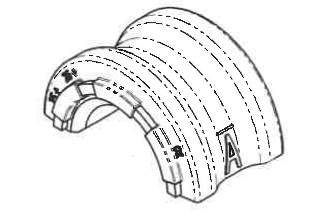

提取内容：

| 项目 | 原图内容 |
|---|---|
| 外观 | 半圆弧形组件 |
| 可见标识 | A |
| 可见标识 | 图号/材料/杆径等刻字位置在轴测图上示意 |

含义解读：

- 该视图用于展示零件三维外观、半圆弧弯曲形态和刻字在实物上的相对位置。
- 该视图未给出新的尺寸控制值，主要作为外观和标识位置参考。

## 技术要求

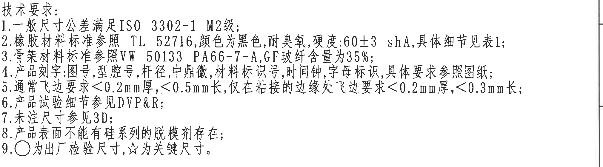

原文提取：

1. 一般尺寸公差满足 ISO 3302-1 M2级；
2. 橡胶材料标准参照 TL 52716，颜色为黑色，耐臭氧，硬度:60±3 shA，具体细节见表1；
3. 骨架材料标准参照 VW 50133 PA66-7-A，GF玻纤含量为35%；
4. 产品刻字:图号，型腔号，杆径，中鼎徽，材料标识号，时间钟，字母标识，具体要求参照图纸；
5. 通常飞边要求<0.2mm厚，<0.5mm长，仅在粘接的边缘处飞边要求<0.2mm厚，<0.3mm长；
6. 产品试验细节参见 DVP&R；
7. 未注尺寸参见3D；
8. 产品表面不能有硅系列的脱模剂存在；
9. ○为出厂检验尺寸，☆为关键尺寸。

## Deviation 表

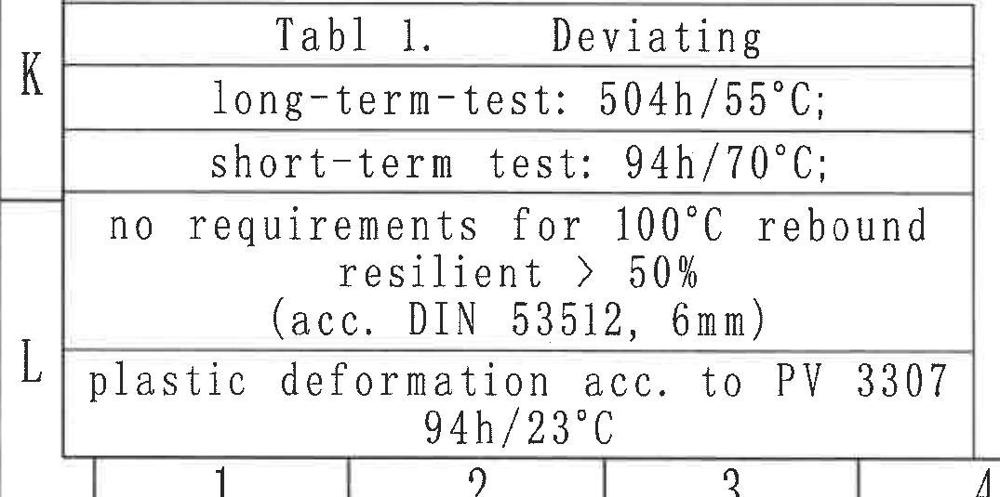

原文提取：

| Tabl 1. | Deviating |
|---|---|
| long-term-test | 504h/55°C; |
| short-term test | 94h/70°C; |
| 100°C rebound | no requirements for 100°C rebound resilient > 50% (acc. DIN 53512, 6mm) |
| plastic deformation | plastic deformation acc. to PV 3307 94h/23°C |

## References

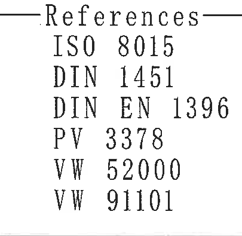

原文提取：

- ISO 8015
- DIN 1451
- DIN EN 1396
- PV 3378
- VW 52000
- VW 91101

## 明细表与标题栏

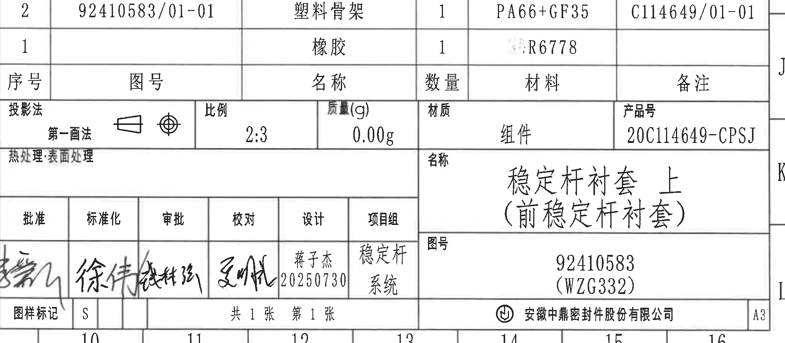

### 明细表

| 序号 | 图号 | 名称 | 数量 | 材料 | 备注 |
|---|---|---|---|---|---|
| 2 | 92410583/01-01 | 塑料骨架 | 1 | PA66+GF35 | C114649/01-01 |
| 1 |  | 橡胶 | 1 | R6778（前方字符受印章/底纹干扰，无法可靠识别） |  |

### 标题栏

| 项目 | 原图内容 |
|---|---|
| 投影法 | 第一画法 |
| 比例 | 2:3 |
| 质量(g) | 0.00g |
| 材质 | 组件 |
| 产品号 | 20C114649-CPSJ |
| 热处理 | 表面处理 |
| 名称 | 稳定杆衬套 上（前稳定杆衬套） |
| 图号 | 92410583 (WZG332) |
| 公司 | 安徽中鼎密封件股份有限公司 |
| 图幅 | A3 |
| 批准 | 签名，无法可靠识别 |
| 标准化 | 徐伟 |
| 审批 | 签名，无法可靠识别 |
| 校对 | 签名，无法可靠识别 |
| 设计 | 蒋子杰 20250730 |
| 项目组 | 稳定杆系统 |
| 图样标记 | S |
| 页码 | 共 1 张 第 1 张 |

## 裁切核查记录

| 图片 | 核查结果 |
|---|---|
| 01_view_front_arc.png | 已包含完整圆弧视图、引出线、尺寸线和文字；未纳入相邻端面视图。 |
| 02_view_end_center.png | 已包含完整端面视图、A-A 剖切标记、R8/R4 和高度尺寸。 |
| 03_section_A_A.png | 已包含完整 A-A 剖面、半径引出线和底部参考尺寸；右侧未混入 B-B 视图。 |
| 04_section_B_B.png | 已包含完整 B-B 剖面及自身尺寸；未纳入右侧圆弧视图标注。 |
| 05_view_right_arc.png | 已包含完整右侧圆弧视图、B-B 剖切标记、型腔号和时间钟标注。 |
| 06_view_side_lower.png | 已包含完整侧视图及 51±0.3、57±0.3、32±0.3、(36)骨架尺寸。 |
| 07_isometric_view.png | 已包含完整轴测图；References 已分离。 |
| 08_revision_table.png | 已包含顶部变更栏完整表格。 |
| 09_notes.png | 已包含技术要求 1-9 条完整文字。 |
| 10_deviating_table.png | 已包含 Deviation 表完整边框和文本。 |
| 11_references.png | 已包含 References 完整文本。 |
| 12_bom_title_block.png | 已包含明细表、标题栏、签名栏和公司栏完整结构。 |
