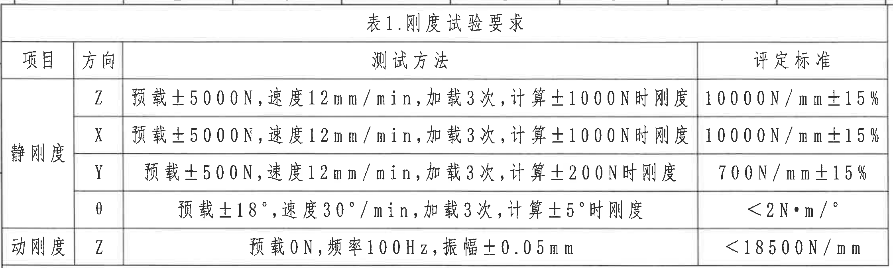
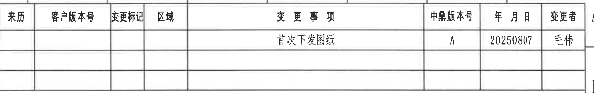
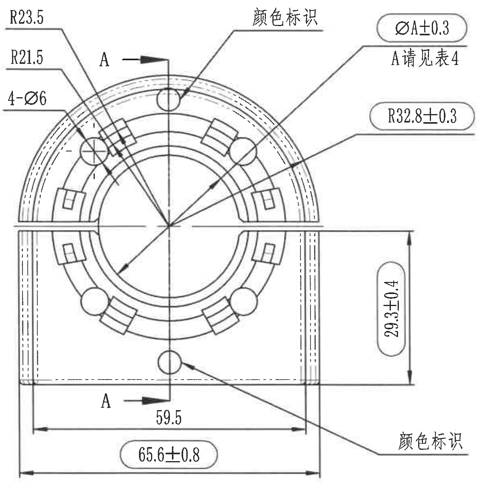
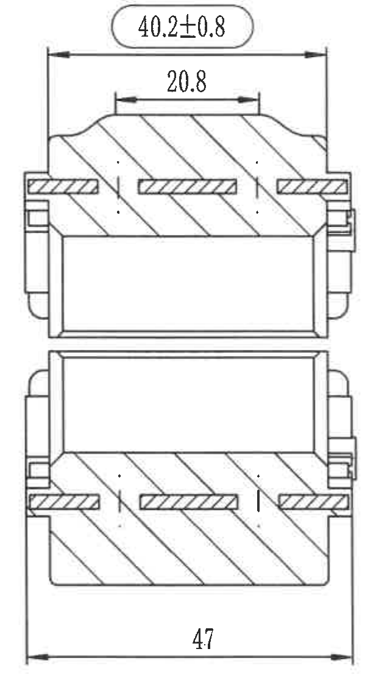
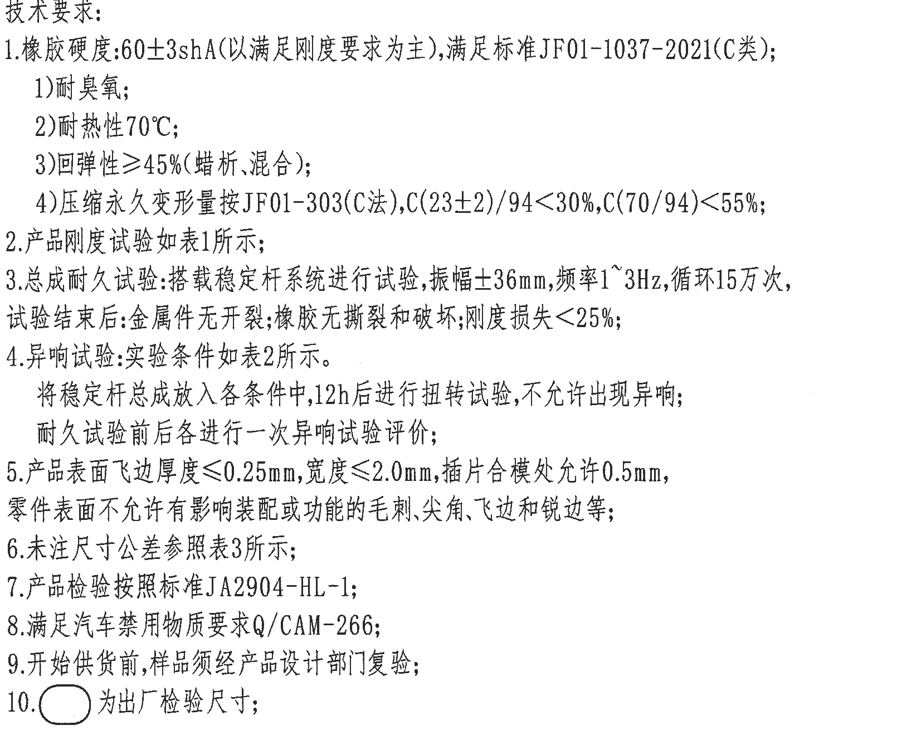
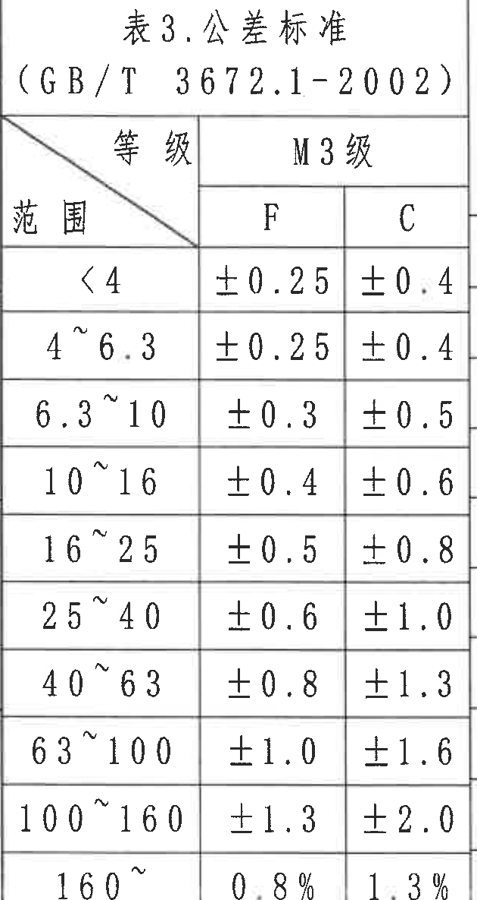
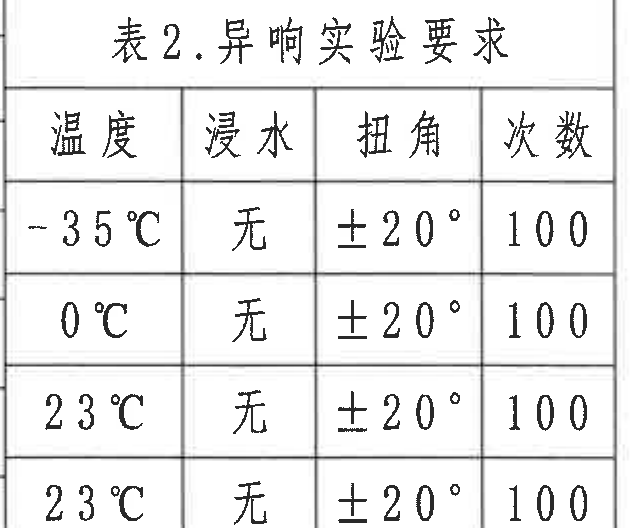
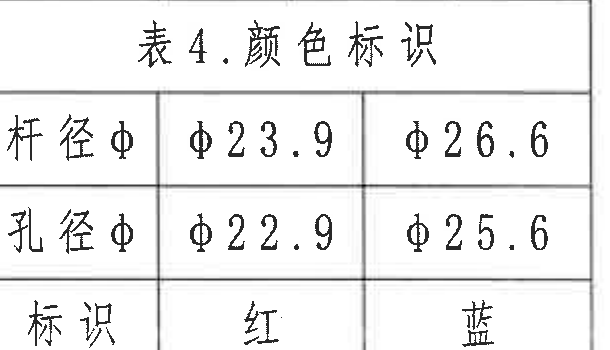
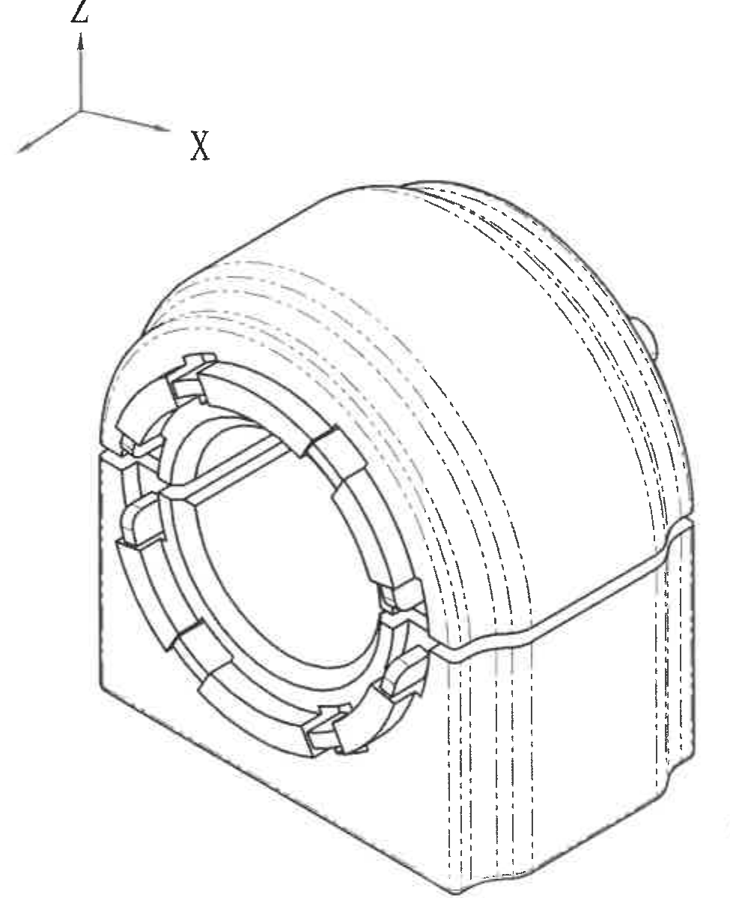
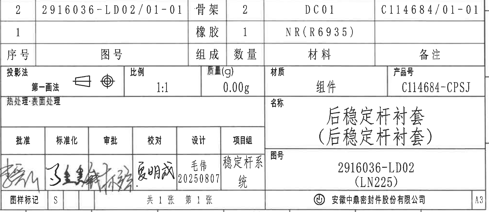

# 20C114684 图纸内容识别

源文件：`20C114684.pdf`

说明：以下内容按原图区域结构提取。整页渲染图仅用于裁切定位，未嵌入本文档，亦未放入 `images` 子目录。

## 表 1. 刚度试验要求

| 项目 | 方向 | 测试方法 | 评定标准 |
|---|---|---|---|
| 静刚度 | Z | 预载±5000N，速度12mm/min，加载3次，计算±1000N时刚度 | 10000N/mm±15% |
| 静刚度 | X | 预载±5000N，速度12mm/min，加载3次，计算±1000N时刚度 | 10000N/mm±15% |
| 静刚度 | Y | 预载±500N，速度12mm/min，加载3次，计算±200N时刚度 | 700N/mm±15% |
| 静刚度 | θ | 预载±18°，速度30°/min，加载3次，计算±5°时刚度 | <2N·m/° |
| 动刚度 | Z | 预载0N，频率100Hz，振幅±0.05mm | <18500N/mm |

含义说明：该表定义零件总成在 Z、X、Y、θ 方向的静刚度加载条件、计算区间和合格范围，并规定 Z 向动刚度的频率、振幅和上限要求。

## 变更表

| 来历 | 客户版本号 | 变更标记 | 区域 | 变更事项 | 中鼎版本号 | 年月日 | 变更者 |
|---|---|---|---|---|---|---|---|
|  |  |  |  | 首次下发图纸 | A | 20250807 | 毛伟 |

含义说明：当前图纸为首次下发版本，中鼎版本号为 A，日期为 20250807，变更者为毛伟。

## 主加工视图

提取内容：

| 标注 | 数值/文字 | 含义说明 |
|---|---|---|
| R23.5 | R23.5 | 外侧圆弧半径尺寸。 |
| R21.5 | R21.5 | 相邻内侧圆弧半径尺寸。 |
| 4-Ø6 | 4-Ø6 | 4 个直径 6 的孔/圆形特征。 |
| ØA±0.3 | ØA±0.3，A 详见表4 | 直径 A 的公差要求，A 值按表 4 的颜色标识配置确定。 |
| R32.8±0.3 | R32.8±0.3 | 半径 32.8，公差 ±0.3。 |
| 29.3±0.4 | 29.3±0.4 | 右侧竖向高度/距离尺寸，公差 ±0.4。 |
| 59.5 | 59.5 | 下部局部水平宽度/定位距离。 |
| 65.6±0.8 | 65.6±0.8 | 下部总宽度尺寸，公差 ±0.8。 |
| 颜色标识 | 两处颜色标识 | 指示对应部位需要做颜色识别标记。 |
| A-A | 剖切方向 A-A | 指向剖面视图的剖切位置和观察方向。 |

含义说明：该视图为零件端面/主视加工视图，集中表达孔、圆弧、宽度、高度、颜色标识及 A-A 剖切位置。当前区域内的尺寸仅归属于该主视图。

## A-A 剖面视图

提取内容：

| 标注 | 数值 | 含义说明 |
|---|---|---|
| 顶部总宽 | 40.2±0.8 | 剖面上部外形宽度，公差 ±0.8。 |
| 上部内距 | 20.8 | 剖面上部内部台阶/槽相关距离。 |
| 底部总宽 | 47 | 剖面下部总宽尺寸。 |

含义说明：该剖面展示 A-A 方向切开后的橡胶与嵌件/骨架层次关系，剖面线表示被剖切实体区域，尺寸用于控制截面宽度和局部结构间距。

## 技术要求

1. 橡胶硬度：60±3shA（以满足刚度要求为主），满足标准 JF01-1037-2021（C类）；
   1) 耐臭氧；
   2) 耐热性 70℃；
   3) 回弹性≥45%（蜡析、混合）；
   4) 压缩永久变形量按 JF01-303（C法），C(23±2)/94<30%，C(70/94)<55%；
2. 产品刚度试验如表1所示；
3. 总成耐久试验：搭载稳定杆系统进行试验，振幅±36mm，频率1~3Hz，循环15万次，试验结束后：金属件无开裂；橡胶无撕裂和破坏；刚度损失<25%；
4. 异响试验：实验条件如表2所示。将稳定杆总成放入各条件中，12h后进行扭转试验，不允许出现异响；耐久试验前后各进行一次异响试验评价；
5. 产品表面飞边厚度≤0.25mm，宽度≤2.0mm，插片合模处允许0.5mm，零件表面不允许有影响装配或功能的毛刺、尖角、飞边和锐边等；
6. 未注尺寸公差参照表3所示；
7. 产品检验按照标准 JA2904-HL-1；
8. 满足汽车禁用物质要求 Q/CAM-266；
9. 开始供货前，样品须经产品设计部门复验；
10. 图示圆角框标注为出厂检验尺寸。

含义说明：技术要求定义材料性能、试验验证、外观质量、未注公差、检验标准和出厂检验尺寸标识方式。

## 表 3. 公差标准

标准：GB/T 3672.1-2002  
等级：M3级

| 范围 | F | C |
|---|---:|---:|
| <4 | ±0.25 | ±0.4 |
| 4~6.3 | ±0.25 | ±0.4 |
| 6.3~10 | ±0.3 | ±0.5 |
| 10~16 | ±0.4 | ±0.6 |
| 16~25 | ±0.5 | ±0.8 |
| 25~40 | ±0.6 | ±1.0 |
| 40~63 | ±0.8 | ±1.3 |
| 63~100 | ±1.0 | ±1.6 |
| 100~160 | ±1.3 | ±2.0 |
| 160~ | 0.8% | 1.3% |

含义说明：未单独标注公差的尺寸按该表执行，分 F、C 两列公差等级。

## 表 2. 异响实验要求

| 温度 | 浸水 | 扭角 | 次数 |
|---|---|---:|---:|
| -35℃ | 无 | ±20° | 100 |
| 0℃ | 无 | ±20° | 100 |
| 23℃ | 无 | ±20° | 100 |
| 23℃ | 无 | ±20° | 100 |

含义说明：该表规定异响试验的温度、浸水条件、扭转角度和循环次数。图中四行均为无浸水、±20°、100 次，温度条件按表列执行。

## 表 4. 颜色标识

| 项目 | 红 | 蓝 |
|---|---:|---:|
| 杆径φ | φ23.9 | φ26.6 |
| 孔径φ | φ22.9 | φ25.6 |
| 标识 | 红 | 蓝 |

含义说明：主视图中的 `ØA±0.3` 按本表确定。红色标识对应杆径 φ23.9、孔径 φ22.9；蓝色标识对应杆径 φ26.6、孔径 φ25.6。

## 轴测视图

提取内容：

| 标注/图形 | 含义说明 |
|---|---|
| X、Y、Z 坐标指示 | 表示零件在三维方向上的方位。 |
| 轴测零件外形 | 展示衬套总成的立体结构、外圆弧包覆形态、端面孔/槽结构和内部环形区域。 |
| 虚线/细线 | 表示背侧或内部不可见轮廓及结构延伸。 |

含义说明：轴测图用于辅助理解零件三维结构，不包含独立尺寸标注；尺寸归属仍以主视图和剖面视图为准。

## 标题栏与明细栏

明细栏：

| 序号 | 图号 | 组成 | 数量 | 材料 | 备注 |
|---:|---|---|---:|---|---|
| 2 | 2916036-LD02/01-01 | 骨架 | 2 | DC01 | C114684/01-01 |
| 1 |  | 橡胶 | 1 | NR(R6935) |  |

标题栏：

| 项目 | 内容 |
|---|---|
| 投影法 | 第一画法 |
| 比例 | 1:1 |
| 质量(g) | 0.00g |
| 材质 | 组件 |
| 产品号 | C114684-CPSJ |
| 名称 | 后稳定杆衬套（后稳定杆衬套） |
| 图号 | 2916036-LD02（LN225） |
| 设计 | 毛伟，20250807 |
| 项目组 | 稳定杆系统 |
| 图样标记 | S |
| 页数 | 共1张 第1张 |
| 公司 | 安徽中鼎密封件股份有限公司 |
| 图幅 | A3 |

含义说明：标题栏给出零件名称、图号、产品号、材料/总成属性、比例、质量、设计签署和图幅；明细栏列出骨架与橡胶两项组成及其数量、材料和备注。
