# 20C114709.pdf 内容识别

源文件：`20C114709.pdf`

渲染方式：先将 PDF 单页渲染为整页 PNG，再按图面区域裁切。整页渲染图如下：

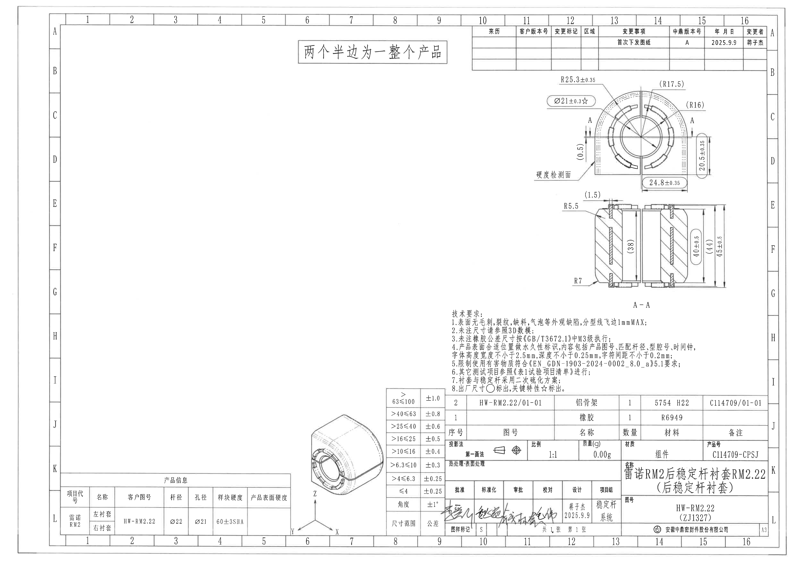

## 上方独立说明框

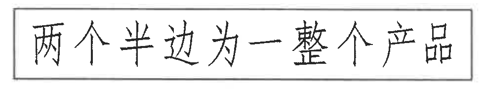

原文：

> 两个半边为一整个产品

含义说明：该产品由左右两个半边衬套组合为一个完整产品。

## 俯视 / 端面加工视图

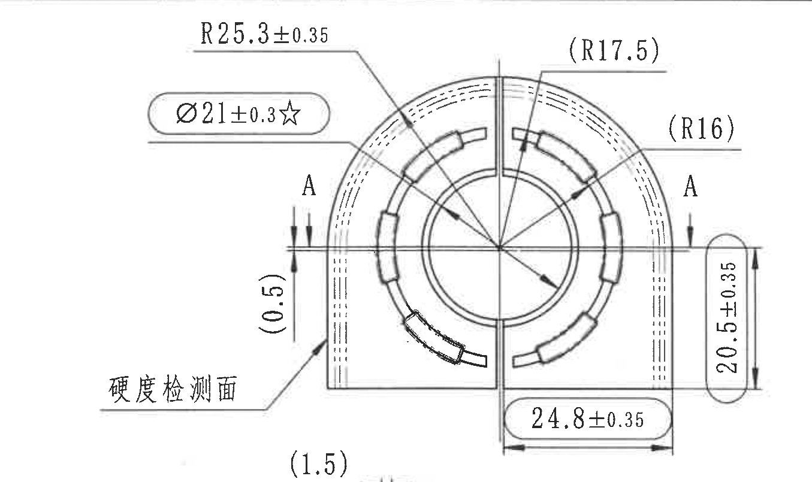

识别内容：

| 项目 | 图面标注 | 解读 |
|---|---:|---|
| 内孔关键尺寸 | Ø21±0.3 ☆ | 内孔直径为 21 mm，公差 ±0.3 mm；星号表示关键特性。 |
| 外圆半径 | R25.3±0.35 | 外轮廓圆弧半径为 25.3 mm，公差 ±0.35 mm。 |
| 参考半径 | (R17.5) | 括号尺寸，为参考尺寸。 |
| 参考半径 | (R16) | 括号尺寸，为参考尺寸。 |
| 右侧高度 / 厚度尺寸 | 20.5±0.35 | 图中右侧竖向尺寸为 20.5 mm，公差 ±0.35 mm。 |
| 底部宽度尺寸 | 24.8±0.35 | 图中底部横向尺寸为 24.8 mm，公差 ±0.35 mm。 |
| 局部间隙 / 偏移 | (0.5) | 括号尺寸，为参考尺寸。 |
| 局部间隙 / 偏移 | (1.5) | 括号尺寸，为参考尺寸。 |
| 剖切位置 | A - A | 横向剖切线通过产品中心，左右箭头标记剖面方向。 |
| 检测面 | 硬度检测面 | 箭头指向左下外侧面，表示硬度检测位置。 |

图形解读：该视图表达衬套端面结构，包括中心孔、环形槽、分瓣结构、外包络圆弧以及剖切方向。图中有左右两半结构，中间竖向分型线将产品分成两个半边。

## A-A 剖面视图

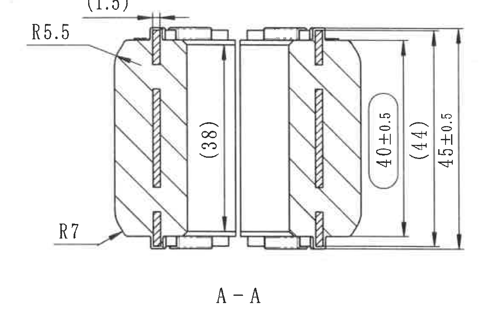

识别内容：

| 项目 | 图面标注 | 解读 |
|---|---:|---|
| 上部局部尺寸 | (1.5) | 括号尺寸，为参考尺寸。 |
| 左上圆角 | R5.5 | 左上外侧圆角半径为 5.5 mm。 |
| 左下圆角 | R7 | 左下外侧圆角半径为 7 mm。 |
| 内部参考高度 | (38) | 括号尺寸，为参考尺寸。 |
| 功能高度 | 40±0.5 | 内侧竖向尺寸为 40 mm，公差 ±0.5 mm。 |
| 参考高度 | (44) | 括号尺寸，为参考尺寸。 |
| 总高度 | 45±0.5 | 外侧总竖向尺寸为 45 mm，公差 ±0.5 mm。 |
| 剖面代号 | A - A | 对应俯视 / 端面视图中的 A-A 剖切位置。 |

图形解读：该剖面显示左右半边衬套的截面结构，斜线填充区域表示剖切到的实体材料；中部为空腔 / 孔位，两侧有嵌件或骨架位置。剖面尺寸主要控制产品高度、内部功能高度以及外侧圆角。

## 等轴测参考视图

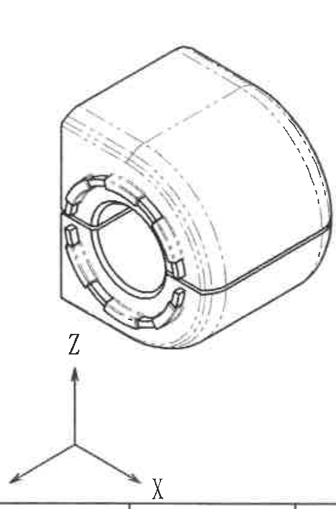

识别内容：

| 项目 | 图面标注 | 解读 |
|---|---|---|
| 坐标方向 | X、Y、Z | 表示三维模型方向。 |
| 外形 | 等轴测图 | 展示产品整体为半圆包络外形，端部有中心孔、环形槽和分瓣凸台。 |

图形解读：该视图用于辅助理解三维外形和分瓣方向，不含独立尺寸标注。尺寸要求以俯视 / 端面视图和 A-A 剖面视图为准。

## 技术要求 / NOTES

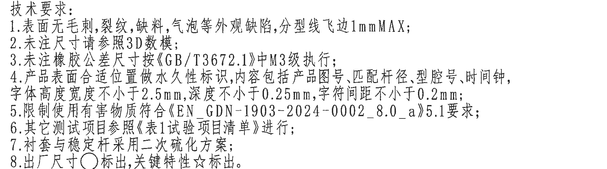

原文转写：

1. 表面无毛刺，裂纹，缺料，气泡等外观缺陷，分型线飞边1mmMAX；
2. 未注尺寸请参照3D数模；
3. 未注橡胶公差尺寸按《GB/T3672.1》中M3级执行；
4. 产品表面合适位置做永久性标识，内容包括产品图号、匹配杆径、型腔号、时间钟，字体高度宽度不小于2.5mm，深度不小于0.25mm，字符间距不小于0.2mm；
5. 限制使用有害物质符合《EN_GDN-1903-2024-0002_8.0_a》5.1要求；
6. 其它测试项目参照《表1试验项目清单》进行；
7. 衬套与稳定杆采用二次硫化方案；
8. 出厂尺寸 ○ 标出，关键特性 ☆ 标出。

含义说明：技术要求规定了外观缺陷、未注尺寸依据、橡胶未注公差等级、永久性标识内容与字符尺寸、限用物质要求、测试项目依据、衬套与稳定杆的二次硫化方案，以及图纸中出厂尺寸和关键特性的符号约定。

## 变更记录表

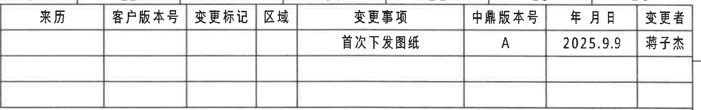

| 来历 | 客户版本号 | 变更标记 | 区域 | 变更事项 | 中鼎版本号 | 年月日 | 变更者 |
|---|---|---|---|---|---|---|---|
|  |  |  |  | 首次下发图纸 | A | 2025.9.9 | 蒋子杰 |
|  |  |  |  |  |  |  |  |
|  |  |  |  |  |  |  |  |

## 产品信息表

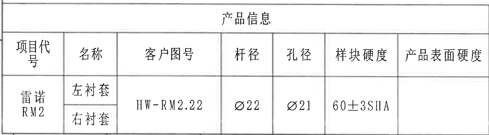

| 项目代号 | 名称 | 客户图号 | 杆径 | 孔径 | 样块硬度 | 产品表面硬度 |
|---|---|---|---:|---:|---|---|
| 雷诺 RM2 | 左衬套 | HW-RM2.22 | Ø22 | Ø21 | 60±3SHA |  |
| 雷诺 RM2 | 右衬套 | HW-RM2.22 | Ø22 | Ø21 | 60±3SHA |  |

含义说明：该表给出产品项目代号、左右衬套名称、客户图号、适配杆径、孔径和橡胶样块硬度要求。

## 未注尺寸公差表

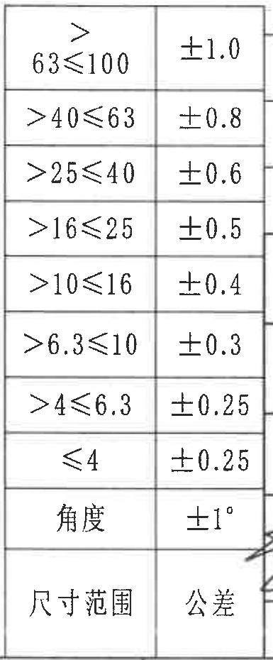

| 尺寸范围 | 公差 |
|---:|---:|
| >63≤100 | ±1.0 |
| >40≤63 | ±0.8 |
| >25≤40 | ±0.6 |
| >16≤25 | ±0.5 |
| >10≤16 | ±0.4 |
| >6.3≤10 | ±0.3 |
| >4≤6.3 | ±0.25 |
| ≤4 | ±0.25 |
| 角度 | ±1° |

含义说明：该表用于没有单独标注公差的线性尺寸和角度尺寸。

## 明细表 / BOM

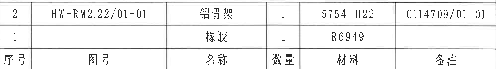

| 序号 | 图号 | 名称 | 数量 | 材料 | 备注 |
|---:|---|---|---:|---|---|
| 2 | HW-RM2.22/01-01 | 铝骨架 | 1 | 5754 H22 | C114709/01-01 |
| 1 |  | 橡胶 | 1 | R6949 |  |

含义说明：产品为组件，包含铝骨架和橡胶两项材料 / 零件。

## 标题栏

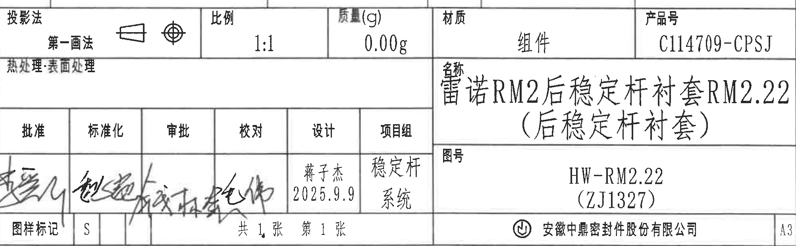

| 字段 | 内容 |
|---|---|
| 投影法 | 第一画法 |
| 比例 | 1:1 |
| 质量(g) | 0.00g |
| 材质 | 组件 |
| 产品号 | C114709-CPSJ |
| 名称 | 雷诺RM2后稳定杆衬套RM2.22（后稳定杆衬套） |
| 图号 | HW-RM2.22（ZJ1327） |
| 热处理:表面处理 | 空白 |
| 设计 | 蒋子杰 2025.9.9 |
| 项目组 | 稳定杆系统 |
| 图样标记 | S |
| 页码 | 共 1 张 第 1 张 |
| 公司 | 安徽中鼎密封件股份有限公司 |
| 图幅 | A3 |

签字栏：

| 批准 | 标准化 | 审批 | 校对 | 设计 | 项目组 |
|---|---|---|---|---|---|
| 手写签名，无法可靠辨识 | 手写签名，无法可靠辨识 | 手写签名，无法可靠辨识 | 手写签名，无法可靠辨识 | 蒋子杰 / 2025.9.9 | 稳定杆系统 |

