# 20C114820.pdf 内容识别

## 整页图

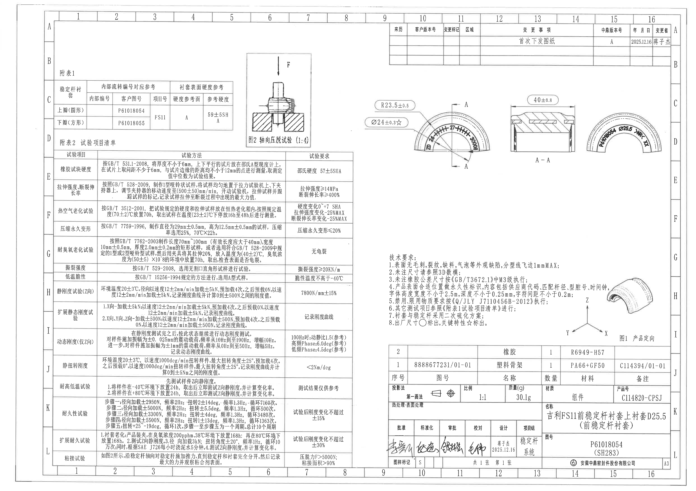

识别对象：单页 A3 图纸，图号 P61018054（SH283），产品号 C114820-CPSJ。

## 变更栏

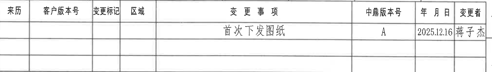

| 来历 | 客户版本号 | 变更标记 | 区域 | 变更事项 | 中鼎版本号 | 年月日 | 变更者 |
|---|---|---|---|---|---|---|---|
|  |  |  |  | 首次下发图纸 | A | 2025.12.16 | 蒋子杰 |

## 附表1

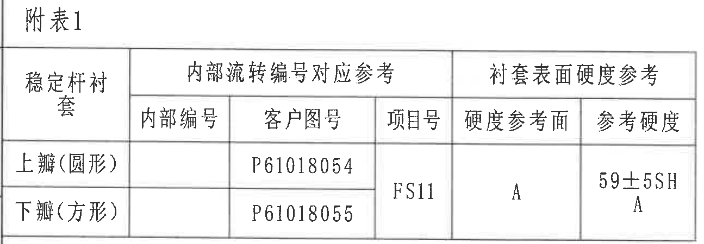

| 稳定杆衬套 | 内部编号 | 客户图号 | 项目号 | 硬度参考面 | 参考硬度 |
|---|---|---|---|---|---|
| 上瓣（圆形） |  | P61018054 | FS11 | A | 59±5SHA |
| 下瓣（方形） |  | P61018055 | FS11 | A | 59±5SHA |

说明：该表给出上、下瓣对应的客户图号和衬套表面硬度参考。硬度参考面为 A，参考硬度为 59±5 Shore A。

## 图2 轴向压脱试验

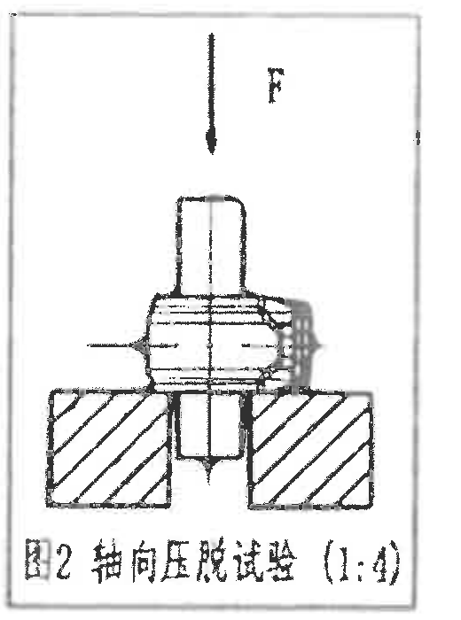

提取内容：

| 项目 | 内容 |
|---|---|
| 图名 | 图2 轴向压脱试验 |
| 比例 | 1:4 |
| 载荷方向 | F，沿图示竖直向下施加 |
| 试验含义 | 沿稳定杆轴向施加推力，直到稳定杆和衬套完全分开，用于评估压脱力和粘接面积。 |

## 附表2 试验项目清单

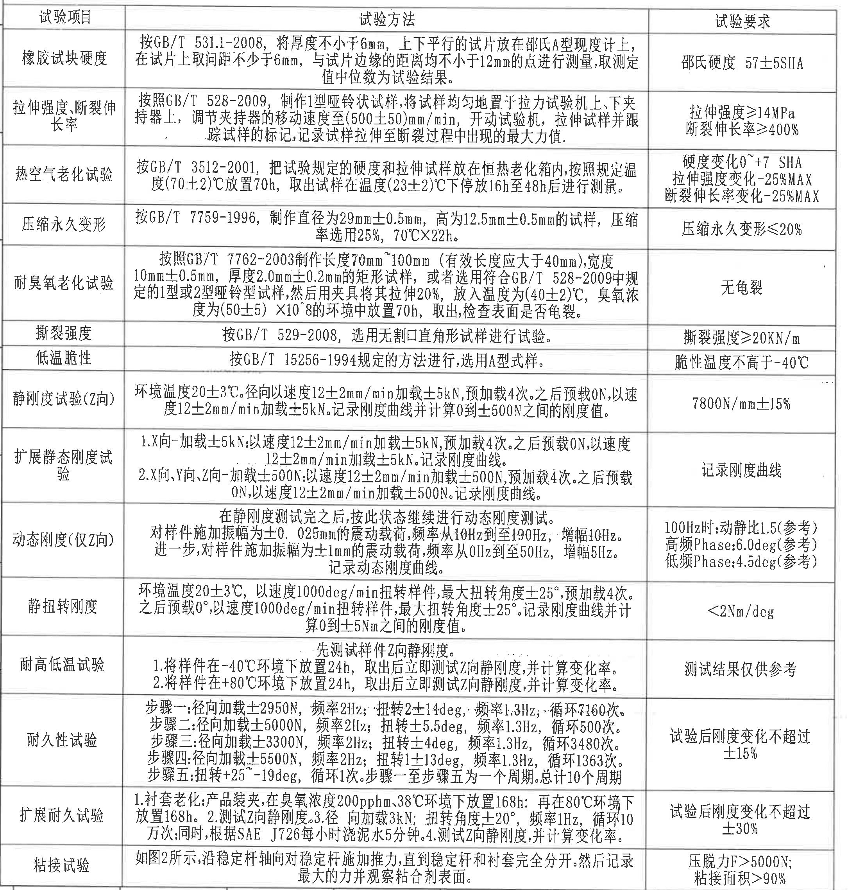

| 试验项目 | 试验方法 | 试验要求 |
|---|---|---|
| 橡胶试块硬度 | 按 GB/T 531.1-2008，将厚度不小于 6mm、上下平行的试片放在邵氏 A 型硬度计上，在试片上取间距不小于 6mm、与试片边缘距离均不小于 12mm 的点进行测量，取测定值中位数为试验结果。 | 邵氏硬度 57±5SHA |
| 拉伸强度、断裂伸长率 | 按照 GB/T 528-2009，制作 1 型哑铃状试样，将试样均匀地置于拉力试验机上、下夹持器上，调节夹持器的移动速度至 (500±50)mm/min，开动试验机，拉伸试样并跟踪试样的标记，记录试样拉伸至断裂过程中出现的最大力值。 | 拉伸强度≥14MPa；断裂伸长率≥400% |
| 热空气老化试验 | 按 GB/T 3512-2001，把试验规定的硬度和拉伸试样放在恒热老化箱内，按照规定温度 (70±2)℃ 放置 70h，取出试样在温度 (23±2)℃ 下停放 16h 至 48h 后进行测量。 | 硬度变化 0~+7 SHA；拉伸强度变化 -25%MAX；断裂伸长率变化 -25%MAX |
| 压缩永久变形 | 按 GB/T 7759-1996，制作直径为 29mm±0.5mm、高为 12.5mm±0.5mm 的试样，压缩率选用 25%，70℃×22h。 | 压缩永久变形≤20% |
| 耐臭氧老化试验 | 按照 GB/T 7762-2003 制作长度 70mm~100mm（有效长度应大于 40mm）、宽度 10mm±0.5mm、厚度 2.0mm±0.2mm 的矩形试样，或者选用符合 GB/T 528-2009 中规定的 1 型或 2 型哑铃型试样；然后用夹具将其拉伸 20%，放入温度为 (40±2)℃、臭氧浓度为 (50±5)×10^-8 的环境中放置 70h，取出，检查表面是否龟裂。 | 无龟裂 |
| 撕裂强度 | 按 GB/T 529-2008，选用无割口直角形试样进行试验。 | 撕裂强度≥20KN/m |
| 低温脆性 | 按 GB/T 15256-1994 规定的方法进行，选用 A 型试样。 | 脆性温度不高于 -40℃ |
| 静刚度试验（Z向） | 环境温度 20±3℃。径向以速度 12±2mm/min 加载±5kN，预加载 4 次。之后预载 0N，以速度 12±2mm/min 加载±5kN。记录刚度曲线并计算 0 到 ±500N 之间的刚度值。 | 7800N/mm±15% |
| 扩展静态刚度试验 | 1. X 向加载±5kN：以速度 12±2mm/min 加载±5kN，预加载 4 次。之后预载 0N，以速度 12±2mm/min 加载±5kN。记录刚度曲线。2. X 向、Y 向、Z 向加载±500N：以速度 12±2mm/min 加载±500N，预加载 4 次。之后预载 0N，以速度 12±2mm/min 加载±500N。记录刚度曲线。 | 记录刚度曲线 |
| 动态刚度（仅Z向） | 在静刚度测试完之后，按此状态继续进行动态刚度测试。对样件施加振幅为±0.025mm 的震动载荷，频率从 10Hz 到 190Hz，增幅 10Hz。进一步，对样件施加振幅为±1mm 的震动载荷，频率从 0Hz 到 50Hz，增幅 5Hz。记录动态刚度曲线。 | 100Hz 时：动静比 1.5（参考）；高频 Phase: 6.0deg（参考）；低频 Phase: 4.5deg（参考） |
| 静扭转刚度 | 环境温度 20±3℃，以速度 1000deg/min 扭转样件，最大扭转角度±25°，预加载 4 次。之后预载 0°，以速度 1000deg/min 扭转样件，最大扭转角度±25°。记录刚度曲线并计算 0 到 ±5Nm 之间的刚度值。 | <2Nm/deg |
| 耐高低温试验 | 先测试样件 Z 向静刚度。1. 将样件在 -40℃ 环境下放置 24h，取出后立即测试 Z 向静刚度，并计算变化率。2. 将样件在 +80℃ 环境下放置 24h，取出后立即测试 Z 向静刚度，并计算变化率。 | 测试结果仅供参考 |
| 耐久性试验 | 步骤一：径向加载±2950N，频率 2Hz；扭转 2±14deg，频率 1.3Hz，循环 7160 次。步骤二：径向加载±5000N，频率 2Hz；扭转±5.5deg，频率 1.3Hz，循环 500 次。步骤三：径向加载±3300N，频率 2Hz；扭转±4deg，频率 1.3Hz，循环 3480 次。步骤四：径向加载±5500N，频率 2Hz；扭转 1±13deg，频率 1.3Hz，循环 1363 次。步骤五：扭转 +25~-19deg，循环 1 次。步骤一至步骤五为一个周期，总计 10 个周期。 | 试验后刚度变化不超过±15% |
| 扩展耐久试验 | 1. 衬套老化：产品装夹，在臭氧浓度 200pphm、38℃ 环境下放置 168h；再在 80℃ 环境下放置 168h。2. 测试 Z 向静刚度。3. 径向加载 3kN；扭转角度±20°，频率 1Hz，循环 10 万次；同时，根据 SAE J726 每小时浇泥水 5 分钟。4. 测试 Z 向静刚度，并计算变化率。 | 试验后刚度变化不超过±30% |
| 粘接试验 | 如图2所示，沿稳定杆轴向对稳定杆施加推力，直到稳定杆和衬套完全分开。然后记录最大的力并观察粘合剂表面。 | 压脱力 F>5000N；粘接面积>90% |

## 主加工视图

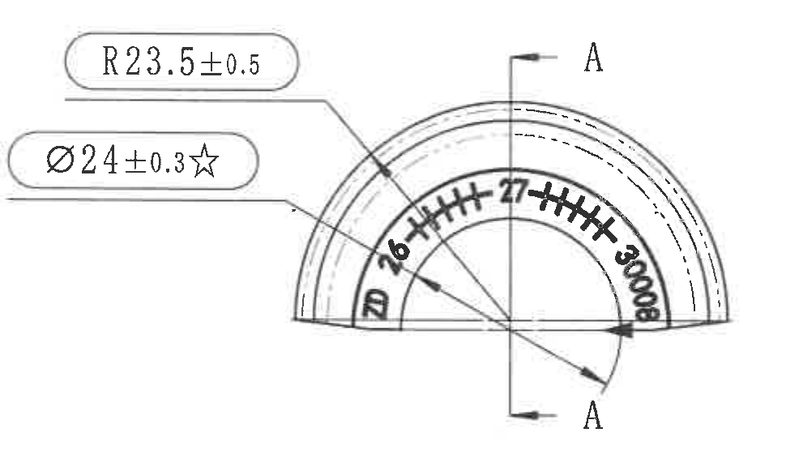

提取内容：

| 标注 | 含义 |
|---|---|
| R23.5±0.5 | 主视图外形圆弧半径，控制衬套圆弧外轮廓。 |
| Ø24±0.3☆ | 圆形尺寸，带 ☆，按技术要求第 8 条属于关键特性。 |
| A-A | 剖切位置，指向右侧 A-A 剖视图。 |
| 图内标识 | 弧面内可见 “ZD 26 27 +S0008”等模具/腔号或追溯类标识。 |

解读：该视图是衬套半圆弧形主体的正向加工视图，主要表达圆弧轮廓、关键直径尺寸及 A-A 剖切位置。只提取本视图内尺寸，右侧 A-A 剖视图中的 40±0.8 不归入本视图。

## A-A 剖视图

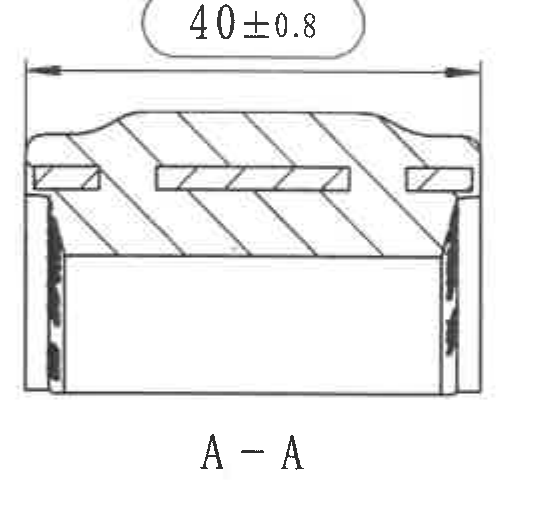

提取内容：

| 标注 | 含义 |
|---|---|
| 40±0.8 | A-A 剖面宽度尺寸，控制该截面横向总宽。 |
| A-A | 与主视图中的 A-A 剖切线对应。 |
| 剖面线 | 表示被剖切实体材料区域。 |

解读：该剖视图用于说明衬套横截面结构和总宽尺寸，图中剖面线显示实体材料截面，内部槽/骨架位置通过截面轮廓表达。

## 标识局部视图

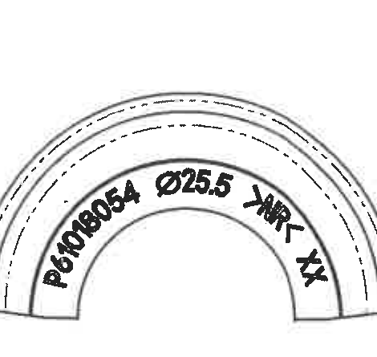

提取内容：

| 标注 | 含义 |
|---|---|
| P61018054 | 图号/零件识别号。 |
| Ø25.5 | 匹配杆径或标识直径信息。 |
| MRT XX | 追溯或工艺标识字符。 |

解读：该局部视图仅表达产品表面永久性标识的布置位置与内容，未在该局部视图中给出独立尺寸线。标识内容与技术要求第 4 条“供应商代码、匹配杆径、型腔号、时间钟”等要求对应。

## 技术要求

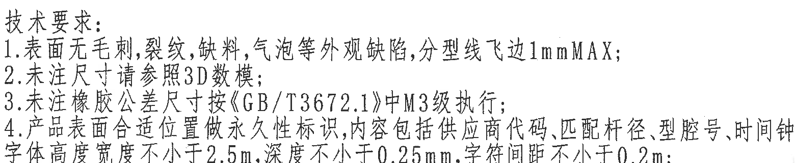

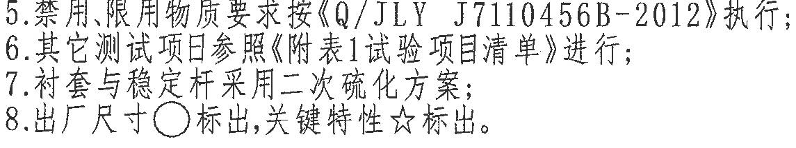

1. 表面无毛刺、裂纹、缺料、气泡等外观缺陷，分型线飞边 1mmMAX；
2. 未注尺寸请参照 3D 数模；
3. 未注橡胶公差尺寸按《GB/T3672.1》中 M3 级执行；
4. 产品表面合适位置做永久性标识，内容包括供应商代码、匹配杆径、型腔号、时间钟，字体高度宽度不小于 2.5mm，深度不小于 0.25mm，字符间距不小于 0.2mm；
5. 禁用、限用物质要求按《Q/JLY J7110456B-2012》执行；
6. 其它测试项目参照《附表1试验项目清单》进行；
7. 衬套与稳定杆采用二次硫化方案；
8. 出厂尺寸 ○ 标出，关键特性 ☆ 标出。

## 图1 产品定向

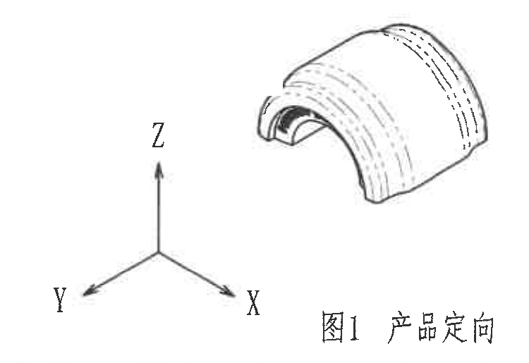

提取内容：

| 项目 | 内容 |
|---|---|
| 图名 | 图1 产品定向 |
| 坐标方向 | X、Y、Z 三轴方向如图示 |
| 作用 | 用于定义后续 Z 向静刚度、动态刚度、扩展静态刚度等试验方向。 |

## 明细表和标题栏

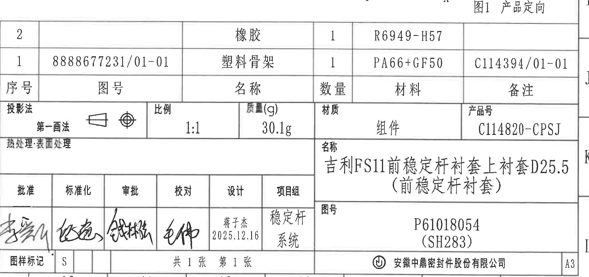

明细表：

| 序号 | 图号 | 名称 | 数量 | 材料 | 备注 |
|---|---|---|---|---|---|
| 2 |  | 橡胶 | 1 | R6949-H57 |  |
| 1 | 8888677231/01-01 | 塑料骨架 | 1 | PA66+GF50 | C114394/01-01 |

标题栏：

| 字段 | 内容 |
|---|---|
| 投影法 | 第一画法 |
| 比例 | 1:1 |
| 质量(g) | 30.1g |
| 材质 | 组件 |
| 产品号 | C114820-CPSJ |
| 名称 | 吉利FS11前稳定杆衬套上衬套D25.5（前稳定杆衬套） |
| 图号 | P61018054（SH283） |
| 图样标记 | S |
| 张数 | 共 1 张，第 1 张 |
| 设计 | 蒋子杰，2025.12.16 |
| 项目组 | 稳定杆系统 |
| 公司 | 安徽中鼎密封件股份有限公司 |
| 图幅 | A3 |

## 裁切检查记录

| 图片 | 检查结果 |
|---|---|
| 01_revision_table.png | 表格外框、列名和变更记录完整。 |
| 02_attached_table_1.png | 附表1表头、两行数据和硬度参考信息完整。 |
| 03_fig2_axial_test.png | 图框、F 载荷方向、试验装置示意和图名完整。 |
| 04_attached_table_2_test_list.png | 表头至底部粘接试验行完整，未混入图2内容。 |
| 05_main_view.png | R23.5±0.5、Ø24±0.3☆、A-A 剖切标记完整，未带入 A-A 剖视图尺寸。 |
| 06_section_A_A.png | 40±0.8 尺寸线和 A-A 标题完整。 |
| 07_marking_local_view.png | 标识内容完整，未带入相邻剖视图。 |
| 08a/08b_technical_requirements.png | 技术要求拆分裁切，避开产品定向图。 |
| 09_fig1_product_orientation.png | 产品定向图、坐标轴和题注完整；相邻 NOTES 残片已剔除。 |
| 10_parts_list_and_title_block.png | 明细表、标题栏、签字栏和公司栏完整。 |
