# 20C90483743.pdf 内容识别

源文件：`20C90483743.pdf`

整页渲染基准图：

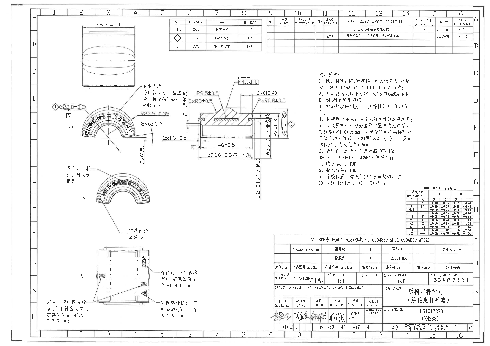

## 上部主视图

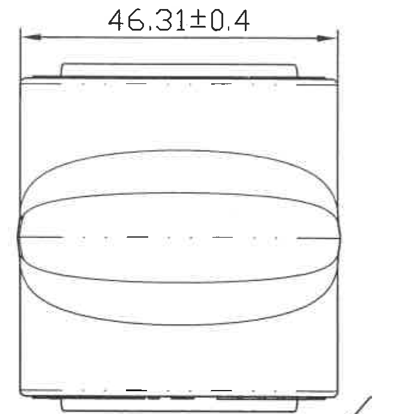

提取内容：

| 项目 | 图中内容 | 含义说明 |
|---|---|---|
| 总宽尺寸 | `46.31±0.4` | 该视图中水平总宽尺寸，控制零件在该方向的外形宽度。 |
| 形体 | 上、下边缘有台阶/凸缘轮廓，中部显示椭圆状外轮廓线 | 表示该衬套在该方向上的外形和包胶表面轮廓。 |

## 左中部标识及圆弧视图

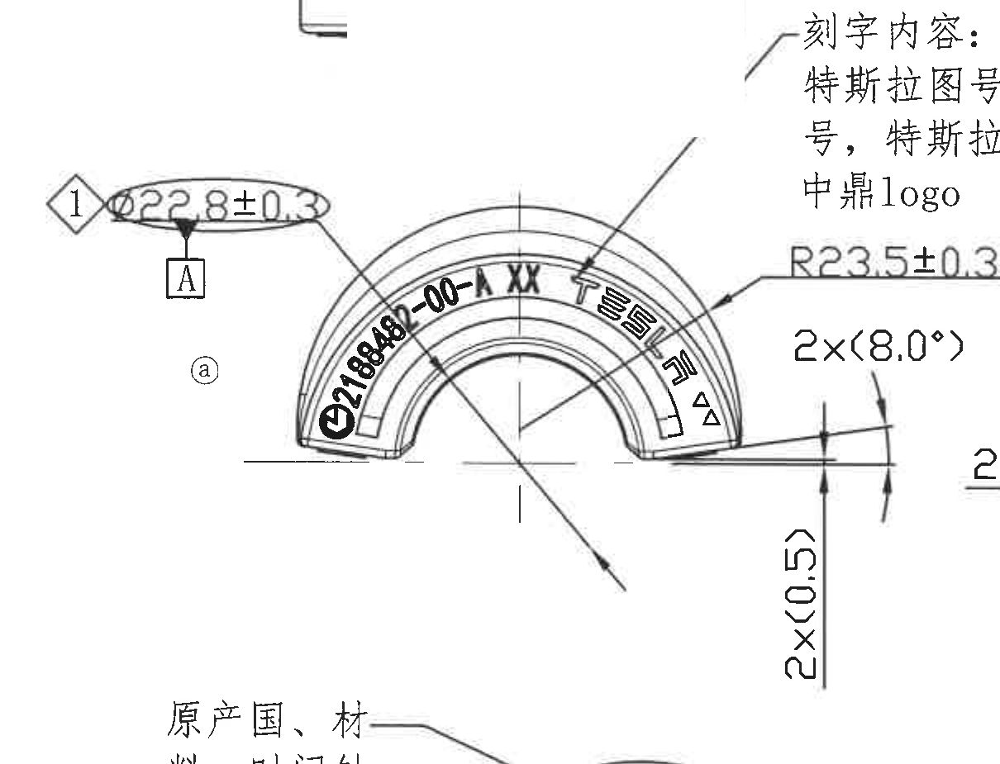

提取内容：

| 项目 | 图中内容 | 含义说明 |
|---|---|---|
| CC 标识 | 菱形 `1` | 对应 CC/SC 表中的 `CC1`，特征为衬套内径，图纸位置 `1-D`。 |
| 内径尺寸 | `Ø22.8±0.3` | 标注在基准符号 A 上方，表示该处孔/内径尺寸及公差。 |
| 基准 | `A` | 该尺寸位置建立或引用基准 A。 |
| 圆弧半径 | `R23.5±0.35` | 外侧圆弧半径尺寸。 |
| 角度 | `2×<8.0°>` | 两处斜边/斜面角度要求。 |
| 小边尺寸 | `2×<0.5>` | 两处小边/局部边界尺寸要求。 |
| 刻字内容 | 特斯拉图号、型腔号、特斯拉 logo、中鼎 logo | 该圆弧表面需要布置的刻字/标识内容。 |
| 图中文字 | `Ø2188485-00-A XX`，并带有中鼎文字/图形标识和三角标识 | 表示弧形区域上的产品图号、型腔号和商标类信息。 |

## 中部剖面视图

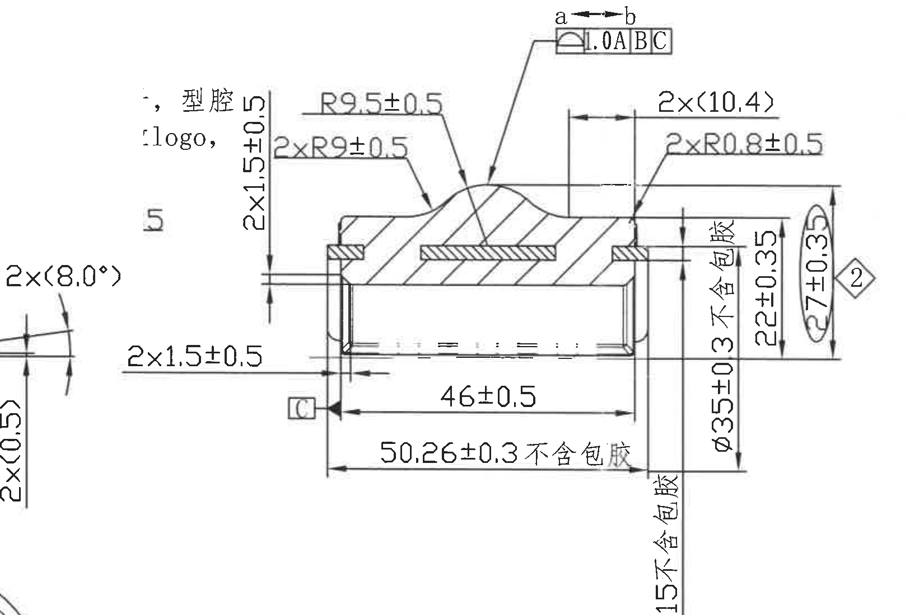

提取内容：

| 项目 | 图中内容 | 含义说明 |
|---|---|---|
| 圆弧半径 | `R9.5±0.5` | 剖面上方局部凸起圆弧半径。 |
| 圆弧半径 | `2×R9±0.5` | 剖面两处过渡圆弧半径。 |
| 局部高度/厚度 | `2×1.5±0.5` | 两处局部台阶/唇边高度或厚度控制。 |
| 轮廓度 | `1.0 A B C` | 以 A、B、C 为基准的轮廓度要求；图中另标有 `a ↔ b` 方向。 |
| 局部宽度 | `2×<10.4>` | 两处局部宽度尺寸。 |
| 小圆角 | `2×R0.8±0.5` | 两处小圆角半径要求。 |
| 内部长度 | `46±0.5` | 剖面内腔方向长度尺寸。 |
| 外部长度 | `50.26±0.3 不含包胶` | 不含包胶状态下的外部长度尺寸。 |
| 右侧高度 | `22±0.35` | 右侧竖向高度尺寸。 |
| 右侧直径/高度 | `Ø27±0.33` | 右端外径/高度控制尺寸。 |
| 不含包胶尺寸 | `Ø35+0.3 不含包胶` | 不含包胶状态下的外径/轮廓尺寸。 |
| 不含包胶尺寸 | `3 不含包胶`、`15 不含包胶` | 剖面右侧局部不含包胶尺寸。 |
| 基准 | `C` | 剖面左下方基准符号，作为相关几何要求引用基准。 |

## 左下部原产国/中鼎内径标识视图

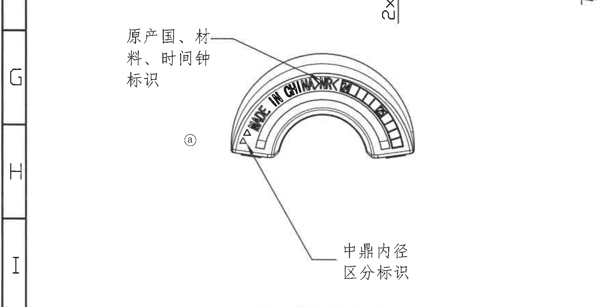

提取内容：

| 项目 | 图中内容 | 含义说明 |
|---|---|---|
| 标识说明 | `原产国、材料、时间钟标识` | 指向弧形标识区，要求在该区域体现原产国、材料和时间钟信息。 |
| 弧形文字 | `MADE IN CHINA...` | 弧形区域中的原产国标识文字。 |
| 分区标识 | 条块状分区和三角标识 | 用于区分或识别相关生产/规格信息。 |
| 标识说明 | `中鼎内径区分标识` | 指向内径区分相关标识位置。 |

## 底部杆径和循环标识视图

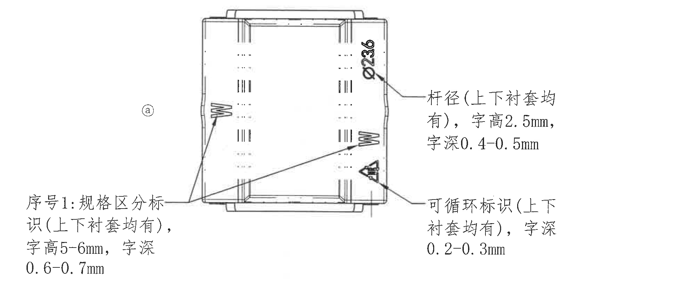

提取内容：

| 项目 | 图中内容 | 含义说明 |
|---|---|---|
| 杆径 | `Ø23.6` | 上下衬套均有的杆径标识尺寸。 |
| 杆径标识要求 | `杆径（上下衬套均有），字高2.5mm，字深0.4-0.5mm` | 杆径字符的高度和刻字深度要求。 |
| 规格区分标识 | `序号1: 规格区分标识（上下衬套均有），字高5-6mm，字深0.6-0.7mm` | 规格区分字符/标识的高度与深度要求。 |
| 循环标识 | `可循环标识（上下衬套均有），字深0.2-0.3mm` | 可循环标识刻字深度要求。 |

## CC/SC 特征表

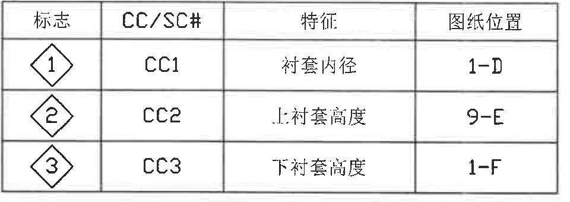

| 标志 | CC/SC# | 特征 | 图纸位置 |
|---|---|---|---|
| 菱形 1 | CC1 | 衬套内径 | 1-D |
| 菱形 2 | CC2 | 上衬套高度 | 9-E |
| 菱形 3 | CC3 | 下衬套高度 | 1-F |

## 更改记录表

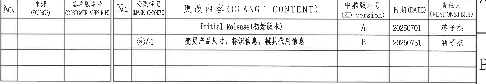

| No. | 来源 (SURC) | 客户版本号 (CUSTMR VERSION) | No. | 变更标记 (MARK CHANGE) | 更改内容 (CHANGE CONTENT) | 中鼎版本号 (ZD version) | 日期 (DATE) | 责任人 (RESPONSIBLE) |
|---|---|---|---|---|---|---|---|---|
|  |  |  |  |  | Initial Release（初始版本） | A | 20250701 | 蒋子杰 |
|  |  |  |  | `ⓐ/4` | 变更产品尺寸，标识信息，模具代用信息 | B | 20250731 | 蒋子杰 |

## 技术要求 / NOTES

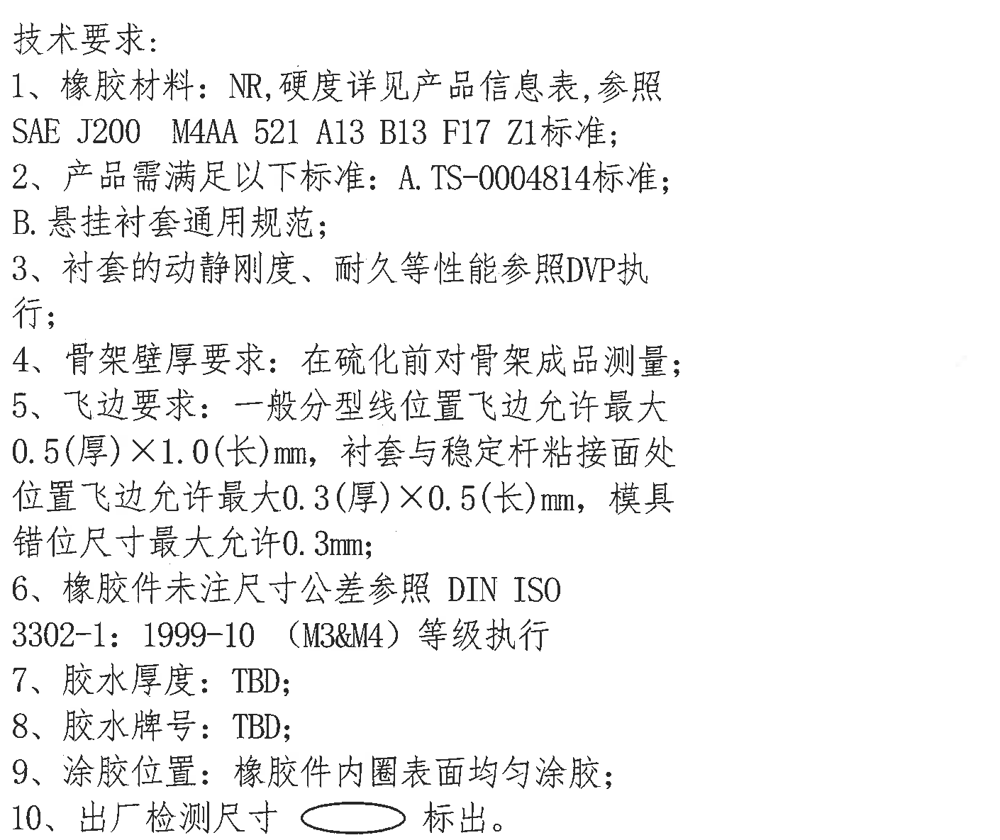

技术要求：

1. 橡胶材料：NR，硬度详见产品信息表，参照 SAE J200 M4AA 521 A13 B13 F17 Z1 标准；
2. 产品需满足以下标准：A. TS-0004814 标准；B. 悬挂衬套通用规范；
3. 衬套的动静刚度、耐久等性能参照 DVP 执行；
4. 骨架壁厚要求：在硫化前对骨架成品测量；
5. 飞边要求：一般分型线位置飞边允许最大 0.5（厚）×1.0（长）mm，衬套与稳定杆粘接面处位置飞边允许最大 0.3（厚）×0.5（长）mm，模具错位尺寸最大允许 0.3mm；
6. 橡胶件未注尺寸公差参照 DIN ISO 3302-1: 1999-10（M3&M4）等级执行；
7. 胶水厚度：TBD；
8. 胶水牌号：TBD；
9. 涂胶位置：橡胶件内圈表面均匀涂胶；
10. 出厂检测尺寸按椭圆符号标出。

## 未注公差表

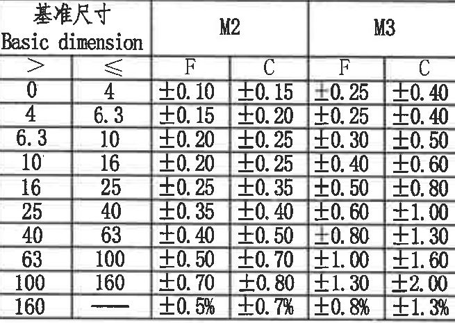

DIN ISO 3302-1:1999-10

| Basic dimension > | Basic dimension ≤ | M2 F | M2 C | M3 F | M3 C |
|---:|---:|---:|---:|---:|---:|
| 0 | 4 | ±0.10 | ±0.15 | ±0.25 | ±0.40 |
| 4 | 6.3 | ±0.15 | ±0.20 | ±0.25 | ±0.40 |
| 6.3 | 10 | ±0.20 | ±0.25 | ±0.30 | ±0.50 |
| 10 | 16 | ±0.20 | ±0.25 | ±0.40 | ±0.60 |
| 16 | 25 | ±0.25 | ±0.35 | ±0.50 | ±0.80 |
| 25 | 40 | ±0.35 | ±0.40 | ±0.60 | ±1.00 |
| 40 | 63 | ±0.40 | ±0.50 | ±0.80 | ±1.30 |
| 63 | 100 | ±0.50 | ±0.70 | ±1.00 | ±1.60 |
| 100 | 160 | ±0.70 | ±0.80 | ±1.30 | ±2.00 |
| 160 | - | ±0.5% | ±0.7% | ±0.8% | ±1.3% |

## BOM 表

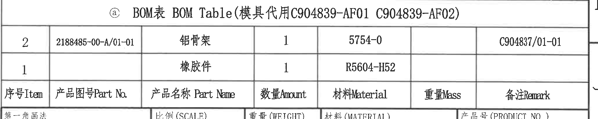

`ⓐ BOM表 BOM Table（模具代用 C904839-AF01 C904839-AF02）`

| 序号 Item | 产品图号 Part No. | 产品名称 Part Name | 数量 Amount | 材料 Material | 重量 Mass | 备注 Remark |
|---:|---|---|---:|---|---|---|
| 2 | 2188485-00-A/01-01 | 铝骨架 | 1 | 5754-0 |  | C904837/01-01 |
| 1 |  | 橡胶件 | 1 | R5604-H52 |  |  |

## 标题栏

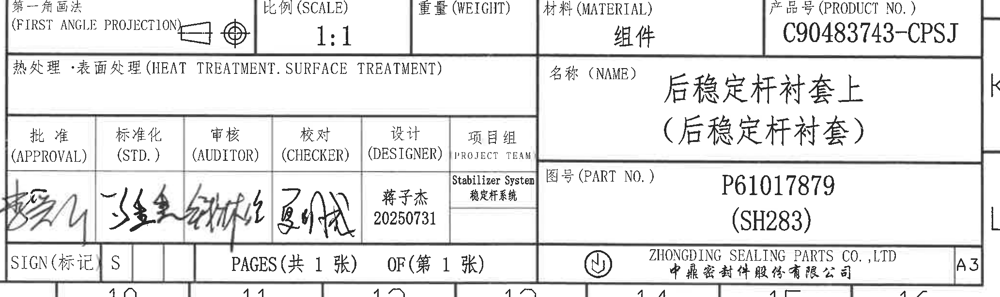

| 栏位 | 内容 |
|---|---|
| 第一角画法 | FIRST ANGLE PROJECTION，图中带第一角投影视图符号 |
| 比例 (SCALE) | 1:1 |
| 重量 (WEIGHT) | 空白 |
| 材料 (MATERIAL) | 组件 |
| 产品号 (PRODUCT NO.) | C90483743-CPSJ |
| 热处理/表面处理 | 空白 |
| 名称 (NAME) | 后稳定杆衬套上（后稳定杆衬套） |
| 图号 (PART NO.) | P61017879（SH283） |
| 批准 (APPROVAL) | 手写签名 |
| 标准化 (STD.) | 手写签名 |
| 审核 (AUDITOR) | 手写签名 |
| 校对 (CHECKER) | 手写签名 |
| 设计 (DESIGNER) | 蒋子杰，20250731 |
| 项目组 (PROJECT TEAM) | Stabilizer System / 稳定杆系统 |
| 标记 | SIGN（标记）S |
| 页数 | PAGES（共 1 张）OF（第 1 张） |
| 公司 | ZHONGDING SEALING PARTS CO., LTD / 中鼎密封件股份有限公司 |
| 图幅 | A3 |
