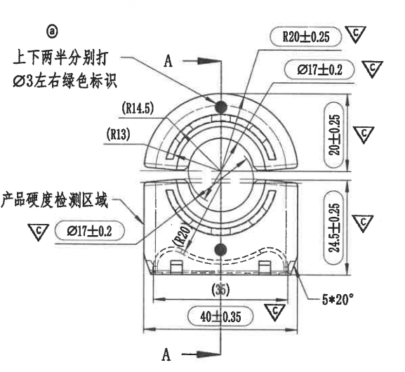
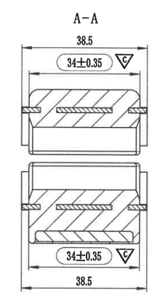

# 20C114257-Y 图纸内容识别

源文件：`20C114257-Y.png`

说明：目录下未见同名 PDF，当前以已有 `20C114257-Y.png` 作为整页 PNG 源图进行裁切与识别。本文不嵌入整页 PNG，仅嵌入加工视图裁切图。

## 页面结构

原图主要由左右两个有图形的视图组成：

- 左侧：主加工视图，包含零件正向轮廓、A-A 剖切位置、尺寸、半径、角度、中文工艺/检测说明。
- 右侧：A-A 剖面视图，包含上下两处剖切形态、剖面线及宽度尺寸。
- 独立表格：未见。
- 独立 NOTES 区：未见。图中中文说明为主视图引出说明，归入主视图。
- 标题栏：未见。

## 左侧主加工视图

### 原图文字与尺寸提取

- 中文说明：`上下两半分别打 Ø3左右绿色标识`
- 中文说明：`产品硬度检测区域`
- 剖切标识：`A`，上下各一处剖切箭头，形成右侧 `A-A` 剖面视图。
- 半径：`R20±0.25`
- 直径：`Ø17±0.2`，图中出现两处标注。
- 参考半径：`(R14.5)`
- 参考半径：`(R13)`
- 参考半径：`(R20)`
- 垂直尺寸：`20±0.25`
- 垂直尺寸：`24.5±0.25`
- 参考水平尺寸：`(35)`
- 水平尺寸：`40±0.35`
- 角度/数量标注：`5*20°`
- 图中多处出现倒三角内 `C` 的工艺/检验符号，分别跟随 `R20±0.25`、`Ø17±0.2`、`20±0.25`、`24.5±0.25`、`40±0.35` 等标注出现；原图未给出该符号定义。

### 含义说明与解读

- 该视图表达零件上下两半的正向轮廓及同心圆弧结构，是本页主要加工视图。
- `A` 箭头给出剖切方向和剖切位置，右侧 `A-A` 视图应从此位置生成。
- `R20±0.25` 标注上部圆弧相关半径，加工允许偏差为 ±0.25。
- 两处 `Ø17±0.2` 标注对应圆形/圆弧相关直径要求，加工允许偏差为 ±0.2。
- 括号尺寸 `(R14.5)`、`(R13)`、`(R20)`、`(35)` 为参考尺寸或辅助尺寸，原图以括号标出。
- `20±0.25` 表达上半区域相关高度/距离尺寸。
- `24.5±0.25` 表达下半区域相关高度/距离尺寸。
- `40±0.35` 表达底部总宽度或主要外形宽度，加工允许偏差为 ±0.35。
- `5*20°` 表示共有 5 处角度为 20° 的相关斜面/倒角类特征，具体位置按图中引线所指位置确定。
- `产品硬度检测区域` 的引线指向左下侧区域，该区域为硬度检测位置。
- `上下两半分别打 Ø3左右绿色标识` 的引线指向上半部黑点附近，表示上下两半需要分别设置约 `Ø3` 的绿色标识；具体“左右”含义按原图文字保留。

## 右侧 A-A 剖面视图

### 原图文字与尺寸提取

- 剖面标题：`A-A`
- 上部总宽尺寸：`38.5`
- 上部内部/相关宽度尺寸：`34±0.35`
- 下部内部/相关宽度尺寸：`34±0.35`
- 下部总宽尺寸：`38.5`
- 图中两处 `34±0.35` 标注旁均出现倒三角内 `C` 的工艺/检验符号；原图未给出该符号定义。

### 含义说明与解读

- 该视图为沿左侧主视图 `A-A` 剖切位置得到的剖面图。
- 剖面图分为上下两段，对应主视图的上下两半结构。
- 斜线填充区域表示被剖切到的实体材料。
- `38.5` 表示剖面外侧总宽或边界宽度，图中上、下各标注一次。
- `34±0.35` 表示剖面内部台阶/槽口/装配相关宽度，加工允许偏差为 ±0.35，图中上、下各标注一次。

## 表格、NOTES、标题栏

- 表格：当前整页 PNG 中未见独立表格。
- NOTES：当前整页 PNG 中未见独立 NOTES 区。中文说明均通过引线关联到左侧主加工视图，已在主视图区域提取。
- 标题栏：当前整页 PNG 中未见标题栏。

## 裁切检查记录

- `20C114257-Y_main_view.png`：包含完整主视图、中文说明、剖切箭头、尺寸线和尺寸文字；未发现边缘文字被裁断。
- `20C114257-Y_section_A-A.png`：包含完整 `A-A` 剖面标题、上下剖面、尺寸线和尺寸文字；未发现边缘文字被裁断。
