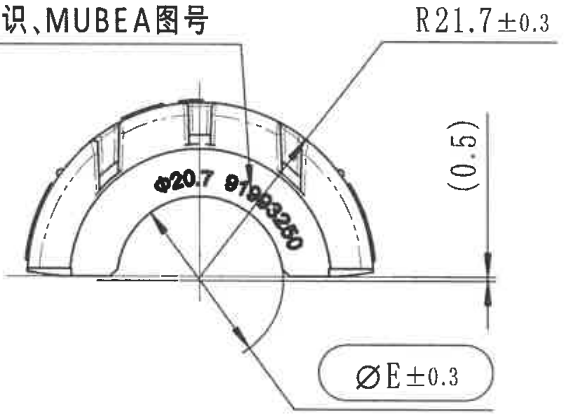
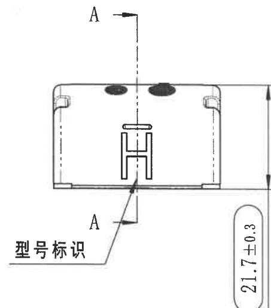
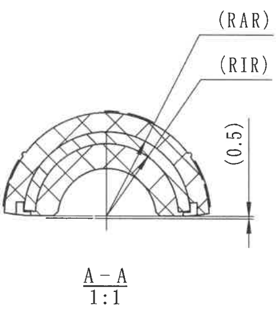
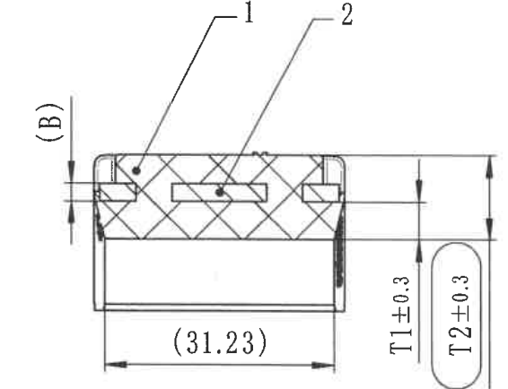

# 20C114308-Y 图纸内容识别

## 原图与裁切说明

| 项目 | 内容 |
| --- | --- |
| 源文件 | `20C114308-Y.png` |
| PDF 渲染说明 | 当前目录未发现同名 PDF；本次以已有 `20C114308-Y.png` 作为整页 PNG 来源进行分区裁切。 |
| 源 PNG 尺寸 | `2345 x 560` |
| 输出规则 | 整页 PNG 未嵌入本文，也未放入 `outputs/20C114308-Y_assets/images/`。 |
| 裁切检查 | 每张保留的裁切图均含图形；纯文字区域不生成图片。源图左侧、右侧、下侧存在原始边界截断，只还原当前 PNG 中可见内容。 |

## 左侧端面/弧形加工视图

### 可见尺寸、弧度、文字

| 原图位置 | 提取内容 | 含义说明 |
| --- | --- | --- |
| 左上引出标注 | `识、MUBEA图号` | 左端文字被源 PNG 边界截断；可见引出线指向外弧上部区域，表示该处与标识/MUBEA 图号相关。 |
| 右上引出标注 | `R21.7±0.3` | 指向外侧圆弧轮廓，表示外弧半径为 `21.7`，允许偏差 `±0.3`。 |
| 内弧直径标注 | `Φ20.7` | 位于内侧弧形区域，表示内侧弧/孔径相关直径为 `20.7`。 |
| 内弧角度标注 | `81°30′±30′` | 沿内弧布置的角度标注，表示弧形角度约为 `81°30′`，角度公差 `±30′`。 |
| 右侧竖向括号尺寸 | `(0.5)` | 括号尺寸，表示参考尺寸 `0.5`。 |
| 下方圆角框尺寸 | `ΦE±0.3` | 直径代号 `E`，公差 `±0.3`；当前 PNG 中未给出 `E` 的具体数值。 |

### 图形解读

该视图为零件端部弧形轮廓视图。可见外侧大圆弧、内侧开口弧、底部左右台阶/缺口，以及上部局部竖向槽形结构。该视图主要控制外弧半径、内弧直径、弧形角度、参考高度和代号直径 `E`。

## 中部主视图/剖切位置视图

### 可见尺寸、文字

| 原图位置 | 提取内容 | 含义说明 |
| --- | --- | --- |
| 上下剖切标注 | `A`、`A` | A-A 剖切线及方向标识，对应后续 `A-A 1:1` 剖面视图。 |
| 左下引出标注 | `型号标识` | 引出线指向中部下方 H 形/槽形标识区域，表示该处为型号标识位置。 |
| 右侧竖向尺寸 | `21.7±0.3` | 控制该视图竖向高度/总高相关尺寸，公差为 `±0.3`；下端靠近源 PNG 下边界。 |

### 图形解读

该视图为零件正向外形及标识位置视图。外轮廓为带圆角的矩形截面，左右端部可见折边/卡扣状细节；上部有两个深色长圆特征；中部为型号标识区域。A-A 剖切线穿过零件中心，用于说明后续 A-A 剖面的截面形状。

## A-A 剖面视图

### 可见尺寸、文字

| 原图位置 | 提取内容 | 含义说明 |
| --- | --- | --- |
| 剖面标题 | `A-A`、`1:1` | A-A 剖面视图，比例 `1:1`。 |
| 上方引出标注 | `(RAR)` | 引出线指向外侧弧形剖切区域，用于标识外侧弧面/半径相关区域。 |
| 中上引出标注 | `(RIR)` | 引出线指向内侧弧形剖切区域，用于标识内侧弧面/半径相关区域。 |
| 右侧竖向括号尺寸 | `(0.5)` | 括号尺寸，表示参考尺寸 `0.5`。 |

### 图形解读

A-A 剖面显示零件为半圆拱形截面，剖切材料区域以交叉剖面线表示。内侧存在半圆形开口，底部两端可见台阶/槽口结构。`(RAR)` 和 `(RIR)` 分别区分外侧、内侧弧形区域。

## B-B 剖面视图

### 可见尺寸、文字

| 原图位置 | 提取内容 | 含义说明 |
| --- | --- | --- |
| 左侧剖切方向 | `(B)` | B-B 剖切方向/位置提示。 |
| 上方引出编号 | `1` | 指向左上剖面填充区域内的局部结构或材料区域。 |
| 上方引出编号 | `2` | 指向中部矩形嵌入/槽形区域。 |
| 下方水平括号尺寸 | `(31.23)` | 括号尺寸，表示参考长度 `31.23`。 |
| 右侧竖向尺寸 | `T1±0.3` | 代号尺寸 `T1`，公差 `±0.3`。 |
| 最右侧竖向尺寸框 | `T2±0.3` | 代号尺寸 `T2`，公差 `±0.3`。 |
| 剖面标题 | `B-B`、`1:1` | 标题位于该视图下方；为避免裁切图带入右侧材料标识文字，标题不作为图片裁切，只在此处文本还原。 |

### 图形解读

B-B 剖面显示零件横向截面。上部为剖切材料区，采用交叉剖面线；左右两端可见小矩形槽/卡位，中部有横向矩形嵌入或槽形结构。下部为较大的矩形空腔或非剖切区域。`T1` 与 `T2` 为该剖面方向上的代号高度/厚度尺寸，当前 PNG 中未给出具体代号数值。

## Specification 技术要求 / NOTES

| 原图位置 | 提取内容 | 含义说明 |
| --- | --- | --- |
| 下方中部 | `Specification技术要求:` | 技术要求/NOTES 区域标题。当前 PNG 只露出标题行，具体条款未出现在可见范围内。该区域仅为文字，因此未生成裁切图片。 |

## 材料标识

| 原图位置 | 提取内容 | 含义说明 |
| --- | --- | --- |
| 右下区域 | `材料标识:>NR(` | 材料标识字段。右侧内容被源 PNG 右边界截断，无法从当前图像恢复完整材料代号。该区域仅为文字，因此未生成裁切图片。 |

## 表格与标题栏

| 区域 | 提取结果 |
| --- | --- |
| 表格 | 当前 PNG 可见范围内未发现独立表格区域。 |
| 标题栏 | 当前 PNG 可见范围内未发现完整标题栏；右侧和下方可能存在被源图裁掉的标题栏/字段内容。 |

