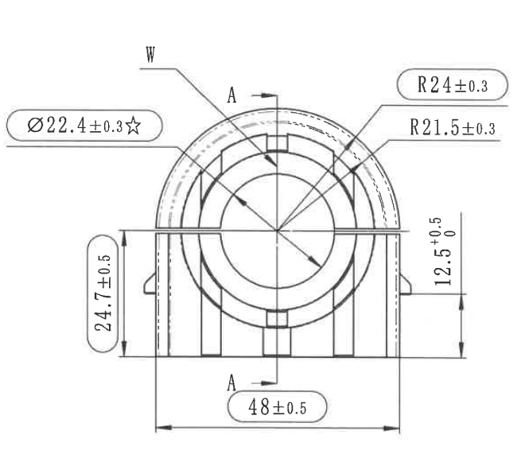
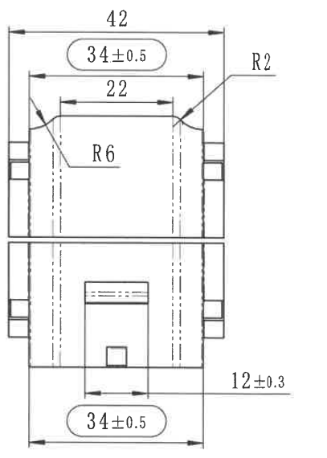

# 20C114398-Y 图纸内容识别

## 原图与裁切说明

| 项目 | 内容 |
| --- | --- |
| 源文件 | `20C114398-Y.png` |
| PDF 渲染说明 | 当前目录及子目录未发现 `20C114398-Y.pdf`；本次以目录下已有同名 `20C114398-Y.png` 作为整页 PNG 来源进行分区裁切。 |
| 源 PNG 尺寸 | `1196 x 604` |
| 裁切输出目录 | `outputs/20C114398-Y_assets/images/` |
| 裁切检查 | 已检查每张裁切图，尺寸线、箭头、文字标注均完整保留；未将左、右视图中的尺寸信息混入对方区域。 |

## 左侧主加工视图

### 可见尺寸、弧度、文字

| 原图位置 | 提取内容 | 含义说明 |
| --- | --- | --- |
| 左上圆角框标注 | `Ø22.4±0.3☆` | 直径尺寸，控制图中圆形/圆弧中心相关特征的直径为 `22.4`，允许偏差 `±0.3`；星号为原图附加符号，通常表示重点或特殊控制特征，具体含义需结合企业图纸规范确认。 |
| 左上引出标记 | `W` | 引线指向上部圆弧外侧区域，表示该处存在原图定义的 `W` 标识/基准/特征代号。当前图面未给出更多文字解释。 |
| 中上、下方剖切标记 | `A`、`A` | 表示 A-A 剖切位置和方向；剖切线穿过零件中心竖向位置，对应右侧剖面/方向视图。 |
| 右上圆角框标注 | `R24±0.3` | 指向外侧圆弧轮廓，表示外圆弧半径为 `24`，允许偏差 `±0.3`。 |
| 右上引出标注 | `R21.5±0.3` | 指向内侧圆弧轮廓，表示内侧圆弧半径为 `21.5`，允许偏差 `±0.3`。 |
| 左侧竖向尺寸 | `24.7±0.5` | 控制左侧从底部基准线到中部水平中心/台阶线附近的高度尺寸，名义值 `24.7`，允许偏差 `±0.5`。 |
| 右侧竖向尺寸 | `12.5 +0.5 / 0` | 控制右侧从中部水平线到底部基准线之间的高度/台阶尺寸，名义值 `12.5`，上偏差 `+0.5`，下偏差 `0`。 |
| 下方圆角框标注 | `48±0.5` | 控制底部左右外侧边界之间的总宽度，名义值 `48`，允许偏差 `±0.5`。 |

### 图形解读

该区域为零件左侧主加工视图。图形主体为上部半圆弧与下部矩形支撑结构组合，中心有同心圆/圆弧轮廓，左右下方有竖向支撑边和局部凸台。该视图主要表达圆弧半径、中心相关直径、底部总宽、高度台阶以及 A-A 剖切位置。

## 右侧 A-A 剖面/方向视图

### 可见尺寸、弧度、文字

| 原图位置 | 提取内容 | 含义说明 |
| --- | --- | --- |
| 顶部外侧水平尺寸 | `42` | 控制右侧视图顶部外侧总宽，名义值 `42`；原图未显示公差。 |
| 顶部圆角框标注 | `34±0.5` | 控制上部内侧/局部宽度，名义值 `34`，允许偏差 `±0.5`。 |
| 上部内侧水平尺寸 | `22` | 控制上部内侧两条竖向边界之间的宽度，名义值 `22`；原图未显示公差。 |
| 右上引出标注 | `R2` | 指向上部右侧转角，表示该处圆角半径为 `2`。 |
| 中上引出标注 | `R6` | 指向上部内侧圆弧/过渡区域，表示该处圆弧半径为 `6`。 |
| 右下水平尺寸 | `12±0.3` | 控制下部中间局部槽/凸台相关的水平尺寸，名义值 `12`，允许偏差 `±0.3`。 |
| 底部圆角框标注 | `34±0.5` | 控制底部左右边界之间的宽度，名义值 `34`，允许偏差 `±0.5`。 |

### 图形解读

该区域为右侧 A-A 剖面/方向相关视图。上半部分显示外侧宽度、内侧宽度和顶部圆角过渡，左右边缘可见分层台阶结构；中间水平分界线将上、下结构分开。下半部分显示中心局部槽/凸台和底部宽度，虚线表示隐藏轮廓或内部边界。该视图主要表达宽度尺寸、上部转角半径、内侧圆角半径以及下部局部结构尺寸。

## 表格

| 区域 | 提取结果 |
| --- | --- |
| 表格 | 当前源图可见范围内未发现独立表格区域。 |

## NOTES / 备注

| 区域 | 提取结果 |
| --- | --- |
| NOTES / 备注 | 当前源图可见范围内未发现 NOTES、技术要求或备注文字区域。 |

## 标题栏

| 区域 | 提取结果 |
| --- | --- |
| 标题栏 | 当前源图可见范围内未发现标题栏。 |
