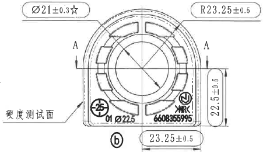
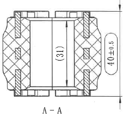
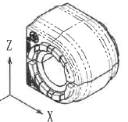
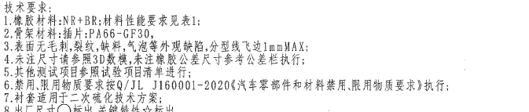

# 20C114536 内容识别

源文件：`upload/20C114536.png`

说明：原始文件已是整页 PNG，未另行生成或嵌入整页图。以下仅嵌入按图面区域裁切后的图片。

## 1. 主加工视图

### 尺寸、标注提取

| 图中标注 | 类型 | 含义解读 |
|---|---|---|
| `Ø21±0.3☆` | 直径尺寸；关键特性标识 | 中心圆/孔相关直径为 21，公差 ±0.3；`☆` 表示关键特性。 |
| `R23.25±0.5` | 圆弧半径尺寸 | 外轮廓圆弧半径为 23.25，公差 ±0.5。 |
| `22.5±0.5` | 竖向尺寸 | 右侧竖向高度/边界尺寸为 22.5，公差 ±0.5。 |
| `23.25±0.5` | 横向尺寸 | 底部右侧横向尺寸为 23.25，公差 ±0.5。 |
| `A`、`A` | 剖切位置标识 | 指示 A-A 剖视图的剖切位置。 |
| `硬度测试面` | 工艺/检测标注 | 箭头指向的左侧平面为硬度测试面。 |
| `b` | 视图/局部标识 | 圆圈内小写 `b`，用于识别该处或该视图相关标记。 |
| `01 Ø225` | 零件标记/模具或编号类文字 | 位于底部内侧，属于零件上成型或标识文字。 |
| `6608355995` | 零件标记/编号 | 位于右下内侧，属于零件上成型或标识文字。 |
| `NR` | 材料/标识文字 | 位于右下区域，结合技术要求可理解为橡胶材料相关标识。 |

## 2. A-A 剖视图

### 尺寸、标注提取

| 图中标注 | 类型 | 含义解读 |
|---|---|---|
| `40±0.5` | 总体竖向尺寸 | 剖视图右侧总高度/外廓尺寸为 40，公差 ±0.5。 |
| `(31)` | 参考尺寸 | 中部竖向尺寸 31，括号表示参考尺寸。 |
| `A-A` | 剖视图名称 | 对应主加工视图中的 A-A 剖切位置。 |
| 剖面线 | 剖切表达 | 交叉剖面线表示被剖切的材料区域，用于说明内部结构。 |

## 3. 轴测/局部外观视图

### 信息提取

| 图中标注 | 类型 | 含义解读 |
|---|---|---|
| `X`、`Y`、`Z` | 坐标方向标识 | 用于表达零件三维方向。 |
| 轴测外观图 | 外观/结构辅助视图 | 显示零件整体外形、外侧圆弧轮廓、端面孔/槽结构及侧向厚度关系；该视图未标出独立尺寸。 |

## 4. 技术要求 / NOTES

技术要求：

1. 橡胶材料: NR+BR; 材料性能要求见表1;
2. 骨架材料: 插片: PA66-GF30;
3. 表面无毛刺,裂纹,缺料,气泡等外观缺陷,分型线飞边1mmMAX;
4. 未注尺寸请参照3D数据,未注橡胶公差尺寸参考公差栏执行;
5. 其他测试项目参照试验项目清单进行;
6. 禁用,限用物质要求按Q/JL J160001-2020(汽车零部件和材料禁用,限用物质要求)执行;
7. 衬套适用于二次硫化技术方案;
8. 出厂尺寸○标出,关键特性☆标出。

### NOTES 解读

| 条目 | 含义解读 |
|---|---|
| 1 | 橡胶材料为 NR+BR，材料性能需按表 1 要求执行。 |
| 2 | 骨架材料为插片，材料牌号为 PA66-GF30。 |
| 3 | 外观不得有毛刺、裂纹、缺料、气泡等缺陷；分型线飞边最大 1 mm。 |
| 4 | 未标注尺寸以 3D 数据为准；未注橡胶公差按公差栏执行。 |
| 5 | 其他测试项目按试验项目清单执行。 |
| 6 | 禁用、限用物质按 Q/JL J160001-2020 执行。 |
| 7 | 该衬套适用于二次硫化技术方案。 |
| 8 | `○` 用于标出出厂尺寸，`☆` 用于标出关键特性。 |

## 5. 表格与标题栏

原图中未显示独立表格区域，也未显示独立标题栏区域；因此未生成表格或标题栏裁切图片。
