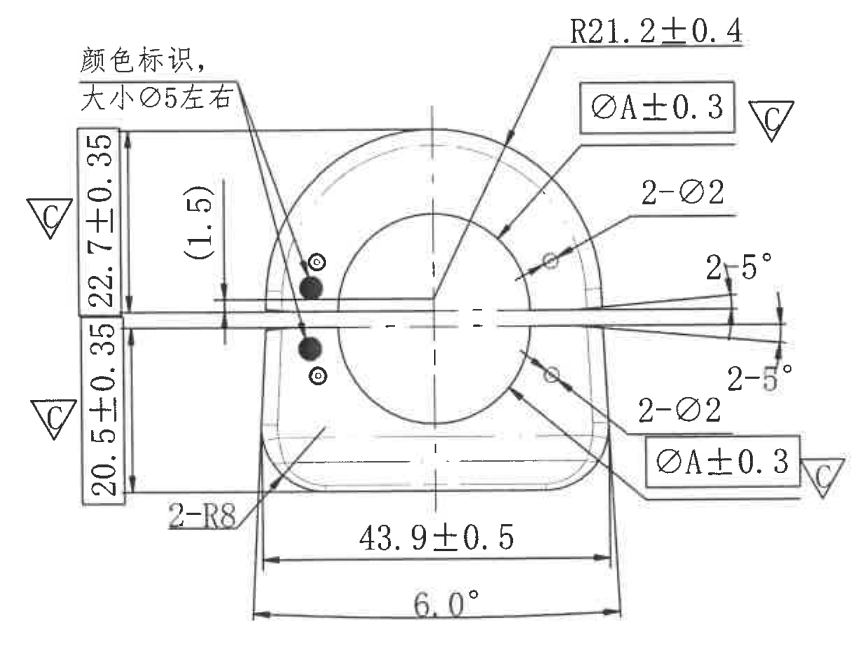

# 20C114582-Y 图纸内容识别

## 原图与裁切说明

| 项目 | 内容 |
| --- | --- |
| 源文件 | `20C114582-Y.png` |
| PDF 渲染说明 | 当前目录及子目录未发现 `20C114582-Y.pdf`；本次以目录下已有同名 `20C114582-Y.png` 作为整页 PNG 来源进行分区裁切。 |
| 源 PNG 尺寸 | `907 x 731` |
| 裁切输出目录 | `outputs/20C114582-Y_assets/images/` |
| 裁切检查 | 已检查裁切图，主加工视图的尺寸线、箭头、引线、文字标注和基准符号均完整保留；该图只有一个加工视图，未发现可单独裁切的剖面视图、局部视图、表格、NOTES 或标题栏。 |

## 主加工视图

### 可见尺寸、弧度、文字

| 原图位置 | 提取内容 | 含义说明 |
| --- | --- | --- |
| 左上中文标注 | `颜色标识,`、`大小Ø5左右` | 两条文字通过引线指向左侧两个黑色圆点位置，表示此处为颜色标识，标识大小约为直径 `Ø5`。 |
| 左侧上方基准符号 | `C` | 三角框基准标识，指向图形左侧上部相关边界/平面，表示该处与基准 `C` 有关。 |
| 左侧下方基准符号 | `C` | 三角框基准标识，指向图形左侧下部相关边界/平面，表示该处与基准 `C` 有关。 |
| 左侧上段竖向尺寸 | `22.7±0.35` | 控制左侧上部竖向距离，名义值 `22.7`，允许偏差 `±0.35`。 |
| 左侧下段竖向尺寸 | `20.5±0.35` | 控制左侧下部竖向距离，名义值 `20.5`，允许偏差 `±0.35`。 |
| 左侧中部括号尺寸 | `(1.5)` | 参考尺寸或辅助尺寸，图中用括号标识；用于说明中部水平窄槽/间隙附近的尺寸关系，通常不作为直接加工验收尺寸。 |
| 左侧下圆角标注 | `2-R8` | 表示两处圆角半径为 `R8`，位于下部外形过渡圆角区域。 |
| 顶部引出圆弧标注 | `R21.2+0.4` | 指向上部外圆弧轮廓，表示该圆弧半径名义值为 `21.2`，上偏差为 `+0.4`；图中未见下偏差值。 |
| 右上矩形框标注 | `ØA±0.3` | 指向圆形/圆弧特征，表示直径尺寸为 `A`，允许偏差 `±0.3`；`A` 的具体名义值未在本图可见区域给出。 |
| 右上基准符号 | `C` | 与右上 `ØA±0.3` 标注相邻，表示该直径/相关特征与基准 `C` 有关联。 |
| 右上孔标注 | `2-Ø2` | 指向右上小孔，表示共有两处直径 `Ø2` 的孔/圆形特征；该处为其中一处指示。 |
| 右侧上角度标注 | `2-5°` | 指向右侧上方斜边/开口边，表示两处 `5°` 角度特征；该处为上侧角度。 |
| 右侧下角度标注 | `2-5°` | 指向右侧下方斜边/开口边，表示两处 `5°` 角度特征；该处为下侧角度。 |
| 右下孔标注 | `2-Ø2` | 指向右下小孔，表示共有两处直径 `Ø2` 的孔/圆形特征；该处为另一处指示。 |
| 右下矩形框标注 | `ØA±0.3` | 指向下侧圆形/圆弧特征，含义同右上矩形框标注，即直径 `A` 的允许偏差为 `±0.3`。 |
| 右下基准符号 | `C` | 与右下 `ØA±0.3` 标注相邻，表示该直径/相关特征与基准 `C` 有关联。 |
| 底部水平尺寸 | `43.9±0.5` | 控制下部主体两侧边界之间的宽度，名义值 `43.9`，允许偏差 `±0.5`。 |
| 底部角度标注 | `6.0°` | 标注在底部两侧斜边延长线之间，表示底部外侧轮廓的夹角/斜度关系为 `6.0°`。 |

### 图形解读

该区域为单一主加工视图。零件主体为上部圆弧外形与下部近似矩形底座组合，中间有大圆形特征，左右贯穿一条水平窄槽/开口。左侧标注颜色识别点及上下竖向尺寸，右侧标注两处 `Ø2` 小孔、两处 `5°` 斜角以及与基准 `C` 相关的 `ØA±0.3` 尺寸要求。下部主要表达两处 `R8` 圆角、主体宽度 `43.9±0.5` 和底部 `6.0°` 斜度关系。

## 表格

| 区域 | 提取结果 |
| --- | --- |
| 表格 | 当前源图可见范围内未发现独立表格区域。 |

## NOTES / 备注

| 区域 | 提取结果 |
| --- | --- |
| NOTES / 备注 | 当前源图可见范围内未发现独立 NOTES、技术要求或备注文字区域；左上“颜色标识, 大小Ø5左右”为主视图引线标注，已归入主加工视图。 |

## 标题栏

| 区域 | 提取结果 |
| --- | --- |
| 标题栏 | 当前源图可见范围内未发现标题栏。 |
