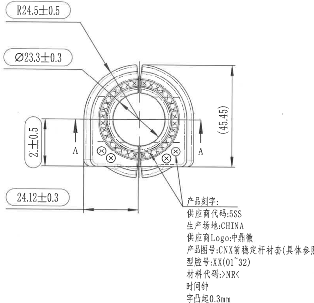
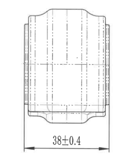
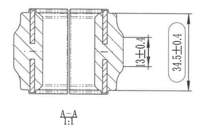

# 20C114603-Y 图纸内容识别

## 原图与裁切说明

| 项目 | 内容 |
| --- | --- |
| 源文件 | `20C114603-Y.png` |
| PDF 渲染说明 | 当前目录及子目录未发现 `20C114603-Y.pdf`；本次以目录下已有同名 `20C114603-Y.png` 作为整页 PNG 来源进行分区裁切。 |
| 源 PNG 尺寸 | `880 x 944` |
| 裁切输出目录 | `outputs/20C114603-Y_assets/images/` |
| 裁切检查 | 已检查裁切图，主加工视图、右上侧向视图、A-A 剖面视图的尺寸线、箭头、引线、文字标注均完整保留；未将整页 PNG 放入 Markdown 或图片目录。 |

## 主加工视图

### 可见尺寸、弧度、文字

| 原图位置 | 提取内容 | 含义说明 |
| --- | --- | --- |
| 左上圆角框标注 | `R24.5±0.5` | 引线指向主视图外侧圆弧轮廓，表示该外圆弧半径名义值为 `24.5`，允许偏差 `±0.5`。 |
| 左上第二处圆角框标注 | `Ø23.3±0.3` | 引线指向中心圆形/孔径区域，表示该圆形特征直径名义值为 `23.3`，允许偏差 `±0.3`。 |
| 左侧竖向尺寸 | `21±0.5` | 控制左侧下平台至中部水平基准线附近的竖向距离，名义值 `21`，允许偏差 `±0.5`。 |
| 左下圆角框标注 | `24.12±0.3` | 底部水平尺寸，控制左侧竖向边线到中心竖向基准线之间的水平距离，名义值 `24.12`，允许偏差 `±0.3`。 |
| 右侧竖向括号尺寸 | `(45.45)` | 参考尺寸，表示主视图整体上、下边界之间的竖向距离；括号标注通常表示参考尺寸。 |
| 中部剖切标识 | `A`、`A` | 两侧箭头和字母 `A` 表示 A-A 剖切位置及观察方向，对应下方 A-A 剖面视图。 |
| 下部四处小圆标记 | 圆内 `×` 符号 | 位于下部左右两侧的四处圆形标记，图中未给出直径尺寸，作为该视图中的可见局部特征记录。 |
| 下部引线中文说明 | `产品刻字:` | 引线从主视图下部特征引出，说明该区域需要进行产品刻字。 |
| 产品刻字第 1 行 | `供应商代码:5SS` | 刻字内容之一，表示供应商代码为 `5SS`。 |
| 产品刻字第 2 行 | `生产场地:CHINA` | 刻字内容之一，表示生产场地为 `CHINA`。 |
| 产品刻字第 3 行 | `供应商Logo:中鼎徽` | 刻字内容之一，要求供应商 Logo 为中鼎徽。 |
| 产品刻字第 4 行 | `产品图号:CNX前稳定杆衬套(具体参照表1)` | 刻字内容之一，表示产品图号文字及参照表信息。 |
| 产品刻字第 5 行 | `型号:X(01~32)` | 刻字内容之一，表示型号范围/编号格式为 `X(01~32)`。 |
| 产品刻字第 6 行 | `材料代码:NR<` | 刻字内容之一，表示材料代码为 `NR<`。 |
| 产品刻字第 7 行 | `时间钟` | 刻字内容之一，表示刻字区域包含时间钟标识。 |
| 产品刻字第 8 行 | `字凸起0.3mm` | 表示刻字为凸字，凸起高度为 `0.3mm`。 |

### 图形解读

该区域为正向主加工视图。零件主体为环形中心孔结构，外侧为带开口槽的圆弧轮廓，下部左右各有安装/定位类小圆标记。主视图表达外圆弧半径 `R24.5±0.5`、中心圆形特征直径 `Ø23.3±0.3`、左侧竖向尺寸 `21±0.5`、左下水平尺寸 `24.12±0.3` 和整体参考高度 `(45.45)`。两侧 `A` 标识定义了下方 A-A 剖面视图的位置；下部引线说明该视图对应的产品刻字内容和凸字要求。

## 右上侧向视图

### 可见尺寸、弧度、文字

| 原图位置 | 提取内容 | 含义说明 |
| --- | --- | --- |
| 底部水平尺寸 | `38±0.4` | 控制侧向视图底部左右边界之间的总宽度，名义值 `38`，允许偏差 `±0.4`。 |
| 视图内部线型 | 虚线、中心线、轮廓线 | 表达侧向投影中的内部孔/槽、中心位置和外部轮廓关系；该视图未见额外弧度或角度数值标注。 |

### 图形解读

该区域为右上侧向加工视图，用于表达零件从侧面观察时的宽度和内部结构投影。主要尺寸为底部宽度 `38±0.4`；视图内的虚线和中心线用于说明内部结构位置，但没有单独给出其它数值尺寸。

## A-A 剖面视图

### 可见尺寸、弧度、文字

| 原图位置 | 提取内容 | 含义说明 |
| --- | --- | --- |
| 右侧局部竖向尺寸 | `13+0.4` | 控制剖面右侧局部台阶/开口结构的竖向尺寸，名义值 `13`，上偏差为 `+0.4`；图中未见下偏差值。 |
| 最右侧竖向圆角框标注 | `34.5±0.4` | 控制 A-A 剖面整体高度，名义值 `34.5`，允许偏差 `±0.4`。 |
| 下方视图名称 | `A-A` | 表示该图为主加工视图中 A-A 剖切位置对应的剖面视图。 |
| 下方比例 | `1:1` | 表示该剖面视图按 `1:1` 比例绘制。 |
| 剖面线 | 斜向剖面填充线 | 表示被剖切到的实体材料区域，用于区分实体截面和空腔/孔槽区域。 |

### 图形解读

该区域为 A-A 剖面视图，展示零件沿主视图 A-A 位置剖开后的内部结构。剖面中部为贯通的圆筒/孔状结构，两侧有实体材料剖面线和台阶结构。该视图主要表达右侧局部高度 `13+0.4` 以及整体剖面高度 `34.5±0.4`。

## 表格

| 区域 | 提取结果 |
| --- | --- |
| 表格 | 当前源图可见范围内未发现独立表格区域。主视图产品刻字中出现“具体参照表1”，但本图未显示表格本体。 |

## NOTES / 备注

| 区域 | 提取结果 |
| --- | --- |
| NOTES / 备注 | 当前源图可见范围内未发现独立 NOTES 或技术要求区域；中文产品刻字说明通过引线归属于主加工视图，已在主加工视图中提取。 |

## 标题栏

| 区域 | 提取结果 |
| --- | --- |
| 标题栏 | 当前源图可见范围内未发现标题栏。 |
