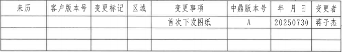
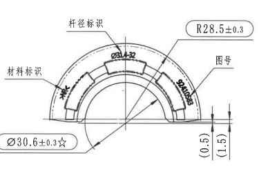
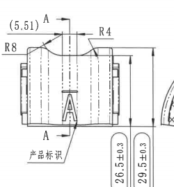
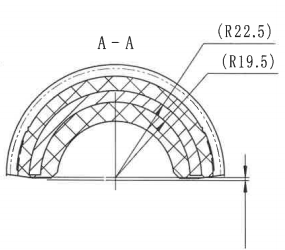
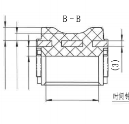
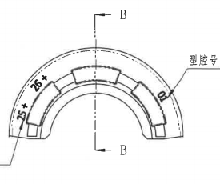
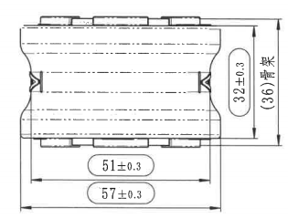
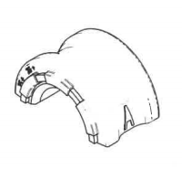
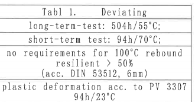
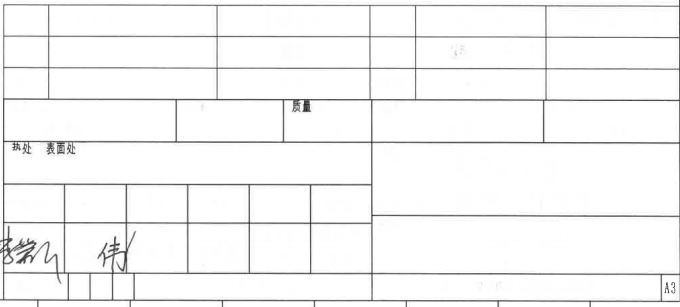

# 20C114649-Y 图纸内容识别

## 原图与裁切说明

| 项目 | 内容 |
| --- | --- |
| 源文件 | `20C114649-Y.png` |
| PDF 渲染说明 | 当前目录未发现同名 `20C114649-Y.pdf`；本次以目录下已有 `20C114649-Y.png` 作为整页 PNG 来源进行分区裁切。 |
| 源 PNG 尺寸 | `1579 x 1143` |
| 裁切输出目录 | `outputs/20C114649-Y_assets/images/` |
| 裁切检查 | 已检查保留的裁切图。每张视图裁切均含图形，尺寸线、箭头、引线和可见文字未被边缘截断；未将整页 PNG 嵌入本文，也未放入 `images` 子目录。 |

## 右上变更履历表

| 表头/位置 | 提取内容 | 说明 |
| --- | --- | --- |
| 表头第 1 列 | `来历` | 变更记录来源字段。 |
| 表头第 2 列 | `客户版本号` | 客户版本编号字段。 |
| 表头第 3 列 | `变更标记` | 变更标识字段。 |
| 表头第 4 列 | `区域` | 变更区域字段。 |
| 表头第 5 列 | `变更事项` | 变更事项描述字段。 |
| 表头第 6 列 | `中鼎版本号` | 中鼎版本编号字段。 |
| 表头第 7 列 | `年 月 日` | 变更日期字段。 |
| 表头第 8 列 | `变更者` | 变更执行者字段。 |
| 记录行 | `首次下发图纸` | 变更事项为首次下发图纸。 |
| 记录行 | `A` | 中鼎版本号为 `A`。 |
| 记录行 | `20250730` | 日期为 `2025-07-30`。 |
| 记录行 | `蒋子杰` | 变更者为蒋子杰。 |

## 左上弧形端面加工视图

| 原图位置 | 提取内容 | 含义说明 |
| --- | --- | --- |
| 左上引出标注 | `杆径标识` | 引线指向上部弧形外表面标识区域，表示该处需要布置杆径标识。 |
| 左侧引出标注 | `材料标识` | 引线指向左侧弧形标识区域，表示该处为材料标识位置。 |
| 右侧引出标注 | `图号` | 引线指向右侧弧形标识区域，表示该处为图号标识位置。 |
| 上部圆角框半径 | `R28.5±0.3` | 控制外侧主圆弧半径，名义半径 `28.5`，允许偏差 `±0.3`。 |
| 上部弧面标识 | `Ø31.32` | 位于上方弧面附近的直径类标识，表示该处关联直径尺寸或杆径标识内容。 |
| 右侧弧面标识 | `20C114649` | 图号标识内容，沿右侧弧面布置。 |
| 左侧弧面标识 | `>NR<` | 材料标识内容，沿左侧弧面布置。 |
| 左下圆角框尺寸 | `Ø30.6±0.3☆` | 控制内孔/内弧相关直径尺寸，名义值 `30.6`，允许偏差 `±0.3`，后附星号标记。 |
| 右侧竖向括号尺寸 | `(0.5)` | 参考尺寸，表示右侧局部台阶/边缘高度差。 |
| 右侧竖向括号尺寸 | `(1.5)` | 参考尺寸，表示右侧另一处局部台阶/边缘高度差。 |

该视图表达零件端面半圆弧轮廓、内弧开口、外弧标识带和左右端部小台阶结构。主要控制外弧半径 `R28.5±0.3`、内弧直径 `Ø30.6±0.3☆`，并标出杆径、材料和图号标识的布置位置。

## 中上侧向加工视图

| 原图位置 | 提取内容 | 含义说明 |
| --- | --- | --- |
| 左上参考尺寸 | `(5.51)` | 括号尺寸，表示该处为参考尺寸。 |
| 左上剖切标记 | `A` | A-A 剖切方向/位置标记，对应右侧 A-A 剖面视图。 |
| 左上半径标注 | `R8` | 控制左上过渡圆角半径。 |
| 右上半径标注 | `R4` | 控制右上过渡圆角半径。 |
| 下部剖切标记 | `A` | 与上方 `A` 共同定义 A-A 剖切位置。 |
| 下部引出标注 | `产品标识` | 引线指向中下部 `A` 形区域，表示该处为产品标识位置。 |
| 右侧竖向尺寸 | `26.5±0.3` | 控制侧向视图一处竖向高度，名义值 `26.5`，允许偏差 `±0.3`。 |
| 右侧竖向尺寸 | `29.5±0.3` | 控制侧向视图另一处竖向总高度，名义值 `29.5`，允许偏差 `±0.3`。 |

该视图表达零件从侧向观察时的宽度方向轮廓、两侧端部结构、顶部凹弧和产品标识位置。视图内用 `A` 标出 A-A 剖切位置，半径 `R8` 与 `R4` 控制顶部过渡圆角。

## A-A 剖面视图

| 原图位置 | 提取内容 | 含义说明 |
| --- | --- | --- |
| 视图标题 | `A-A` | 表示该区域为 A-A 剖面视图。 |
| 右上参考半径 | `(R22.5)` | 括号半径，指向外侧弧面，作为外侧弧面参考半径。 |
| 右上参考半径 | `(R19.5)` | 括号半径，指向内侧弧面，作为内侧弧面参考半径。 |
| 剖面线 | 交叉剖面填充线 | 表示被剖切到的实体材料区域。 |

A-A 剖面显示零件沿中上侧向视图 A-A 位置剖开后的半圆拱形截面。外层和内层弧面分别由 `(R22.5)`、`(R19.5)` 标注为参考半径，剖面填充线用于区分实体材料与中间开口区域。

## B-B 剖面视图

| 原图位置 | 提取内容 | 含义说明 |
| --- | --- | --- |
| 视图标题 | `B-B` | 表示该区域为 B-B 剖面视图。 |
| 左侧竖向尺寸线 | 未见完整数值 | 图中可见多组竖向尺寸线和箭头，但该裁切区域内未给出对应数值。 |
| 右侧竖向括号尺寸 | `(3)` | 括号尺寸，表示该处为参考高度/厚度尺寸。 |
| 下方水平尺寸线 | 未见完整数值 | 图中可见底部水平尺寸线，用于控制下部开口或槽宽，但未标出数值。 |
| 下方引出文字 | `时间钟` | 引线指向局部结构，表示该位置为时间钟标识区域。 |
| 剖面线 | 交叉剖面填充线 | 表示 B-B 剖切到的实体材料区域。 |

B-B 剖面表达横向截面结构：上部为剖切实体材料，中间有矩形槽/嵌入特征，下部为开口腔体或非剖切区域。该视图主要给出参考尺寸 `(3)`、多组未标数值的尺寸控制线，以及时间钟标识位置。

## 右上弧形端面/剖切位置视图

| 原图位置 | 提取内容 | 含义说明 |
| --- | --- | --- |
| 上下剖切标记 | `B`、`B` | 表示 B-B 剖切位置和观察方向，对应左侧 B-B 剖面视图。 |
| 左侧弧面标识 | `25*` | 沿左侧外弧布置的标识内容。 |
| 左上弧面标识 | `26*` | 沿左上外弧布置的标识内容。 |
| 右侧弧面标识 | `01` | 沿右侧外弧布置的编号/型腔相关标识。 |
| 右侧引出标注 | `型腔号` | 引线指向右侧弧面标识区域，表示该处为型腔号标识位置。 |

该视图表达另一侧端面弧形轮廓、内外弧关系、上部标识块和 B-B 剖切位置。图中明确标出型腔号位置，并以 `25*`、`26*`、`01` 表示可见的弧面标识内容。

## 左下长度方向加工视图

| 原图位置 | 提取内容 | 含义说明 |
| --- | --- | --- |
| 右侧圆角框竖向尺寸 | `32±0.3` | 控制长度方向视图中的主体高度，名义值 `32`，允许偏差 `±0.3`。 |
| 最右侧竖向参考尺寸 | `(36)` | 括号尺寸，表示外侧总高度/参考高度为 `36`。 |
| 下方圆角框水平尺寸 | `51±0.3` | 控制中间局部长度或两处内侧界线之间距离，名义值 `51`，允许偏差 `±0.3`。 |
| 最下方圆角框水平尺寸 | `57±0.3` | 控制整体长度方向尺寸，名义值 `57`，允许偏差 `±0.3`。 |
| 内部线型 | 中心线、虚线、实线 | 表达内部孔槽/轮廓投影、中心位置及外形边界。 |

该视图表达零件沿长度方向的外形、上下凸台、端部缺口/卡槽和内部投影线。主要尺寸为长度 `57±0.3`、局部长度 `51±0.3`、主体高度 `32±0.3` 和参考高度 `(36)`。

## 底部等轴测图

| 原图位置 | 提取内容 | 含义说明 |
| --- | --- | --- |
| 等轴测外形 | 半圆弧套状零件三维示意 | 展示零件整体弯曲外形、开口、端部凸台和侧面标识区域。 |
| 尺寸/文字 | 未见尺寸数值 | 该等轴测图用于形状辅助表达，裁切范围内未给出单独尺寸、半径或文字标注。 |

## 左下试验条件表

| 原图行 | 提取内容 |
| --- | --- |
| 表题 | `Tabl 1.    Deviating` |
| 第 1 行 | `long-term-test: 504h/55°C;` |
| 第 2 行 | `short-term test: 94h/70°C;` |
| 第 3-5 行 | `no requirements for 100°C rebound resilient > 50% (acc. DIN 53512, 6mm)` |
| 第 6-7 行 | `plastic deformation acc. to PV 3307 94h/23°C` |

该表为偏差/试验条件说明，列出长期试验、短期试验、100°C 回弹要求说明以及按 PV 3307 的塑性变形条件。

## 右下标题栏

| 区域 | 提取内容 | 说明 |
| --- | --- | --- |
| 中部字段 | `质量` | 标题栏中可见质量字段。 |
| 左下字段 | `热处` | 热处理字段，当前图中仅见字段文字，未见填写内容。 |
| 左下字段 | `表面处` | 表面处理字段，当前图中仅见字段文字，未见填写内容。 |
| 下方签字区 | 手写签名/签字笔迹 | 标题栏下方可见手写签名笔迹。 |
| 右下角 | `A3` | 图幅规格为 A3。 |
| 其他单元格 | 空白或扫描较淡内容 | 当前可见标题栏多数单元格为空白，局部存在很淡的扫描痕迹，无法可靠还原为明确文字。 |

## NOTES / 备注

| 区域 | 提取结果 |
| --- | --- |
| NOTES / 备注 | 当前源图可见范围内未发现独立 `NOTES` 或技术要求文字区。 |
