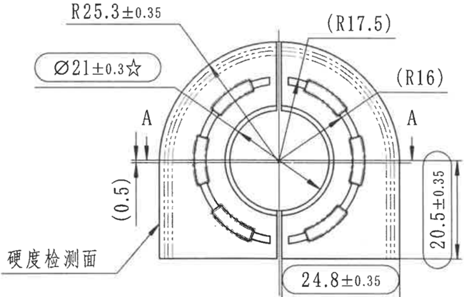
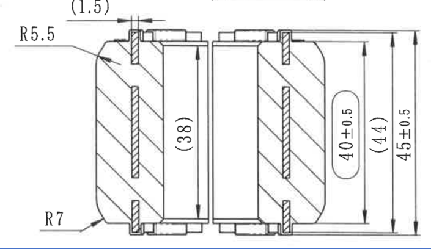

# 20C114709-Y 图纸内容识别

## 原图与裁切说明

| 项目 | 内容 |
| --- | --- |
| 源文件 | `20C114709-Y.png` |
| PDF 渲染说明 | 当前目录未发现同名 `20C114709-Y.pdf`；本次以目录下已有 `20C114709-Y.png` 作为整页 PNG 来源进行分区裁切。 |
| 源 PNG 尺寸 | `854 x 888` |
| 裁切输出目录 | `outputs/20C114709-Y_assets/images/` |
| 裁切检查 | 已检查保留的裁切图。每张裁切均包含图形，尺寸线、箭头、引线和可见文字未被边缘截断；上方视图与下方剖面视图的提取内容按各自归属记录，未将整页 PNG 嵌入本文档，也未放入 `images` 子目录。 |

## 上方端面加工视图

| 原图位置 | 提取内容 | 含义说明 |
| --- | --- | --- |
| 左上圆角框尺寸 | `Ø21±0.3☆` | 控制中心孔或相关圆形特征的直径，名义值 `21`，允许偏差 `±0.3`，后附星号标记。 |
| 上方引出半径 | `R25.3±0.35` | 引线指向外侧圆弧轮廓，表示外圆弧半径名义值 `25.3`，允许偏差 `±0.35`。 |
| 上中参考半径 | `(R17.5)` | 括号半径，表示该处为参考半径；引线指向内侧环形/弧形结构区域。 |
| 右上参考半径 | `(R16)` | 括号半径，表示该处为参考半径；引线指向右侧内弧或槽形特征。 |
| 左右剖切标记 | `A`、`A` | 表示 A-A 剖切位置和观察方向，对应下方剖面视图。 |
| 左侧竖向参考尺寸 | `(0.5)` | 括号尺寸，表示左侧局部台阶或边缘高度差为参考尺寸。 |
| 左下引出文字 | `硬度检测面` | 引线指向左下外侧面区域，表示该面为硬度检测面。 |
| 右侧圆角框竖向尺寸 | `20.5±0.35` | 控制右侧局部高度或开口高度，名义值 `20.5`，允许偏差 `±0.35`。 |
| 下方圆角框水平尺寸 | `24.8±0.35` | 控制下方两侧边界之间的水平距离，名义值 `24.8`，允许偏差 `±0.35`。 |
| 视图内部结构 | 中心圆、同心圆弧、分段环形槽、中心线和虚线轮廓 | 表示端面方向的圆孔、内外弧、分段槽以及隐藏/参考轮廓关系。 |

该视图表达零件从端面观察时的半圆外形、中心圆孔、同心环形结构和分段槽。主要尺寸集中在外弧半径 `R25.3±0.35`、中心/圆形特征直径 `Ø21±0.3☆`、参考半径 `(R17.5)` 与 `(R16)`，并通过 `A` 标出下方剖面视图的剖切位置。

## 下方 A-A 剖面视图

| 原图位置 | 提取内容 | 含义说明 |
| --- | --- | --- |
| 左上参考尺寸 | `(1.5)` | 括号尺寸，位于剖面顶部局部台阶附近，表示该处为参考宽度/间距尺寸。 |
| 左上半径标注 | `R5.5` | 引线指向左上过渡圆角，控制该处圆角半径为 `5.5`。 |
| 左下半径标注 | `R7` | 引线指向左下外侧过渡圆角，控制该处圆角半径为 `7`。 |
| 中左竖向参考尺寸 | `(38)` | 括号尺寸，表示中左内部竖向高度为参考尺寸。 |
| 右侧圆角框竖向尺寸 | `40±0.5` | 控制右侧内部高度或局部竖向尺寸，名义值 `40`，允许偏差 `±0.5`。 |
| 右侧竖向参考尺寸 | `(44)` | 括号尺寸，表示右侧较大竖向高度为参考尺寸。 |
| 最右竖向尺寸 | `45±0.5` | 控制最外侧总高度或外轮廓竖向尺寸，名义值 `45`，允许偏差 `±0.5`。 |
| 剖面填充 | 斜剖面线 | 表示剖切到的实体材料区域。 |
| 内部结构 | 两侧剖切实体、中间开口/孔腔、上下局部台阶和窄槽 | 表示零件沿 A-A 位置剖开后的截面结构，显示两侧实体壁厚、内部空腔及局部凸台/槽形特征。 |

该视图表达上方端面视图中 `A` 标记位置的剖面结构。剖面内可见左右两侧实体材料、中央贯通开口以及上下局部台阶结构；主要尺寸为 `45±0.5` 总高度、`40±0.5` 局部高度，以及参考尺寸 `(44)`、`(38)`、`(1.5)`。

## 表格、NOTES 与标题栏

| 区域 | 提取结果 |
| --- | --- |
| 表格 | 当前源图可见范围内未发现独立表格区域。 |
| NOTES / 备注 | 当前源图可见范围内未发现独立 `NOTES` 或技术要求文字区域。 |
| 标题栏 | 当前源图可见范围内未发现标题栏区域。 |
