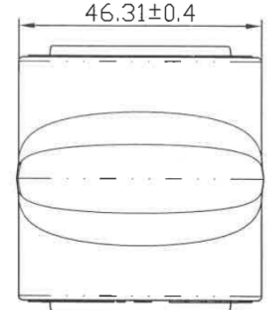
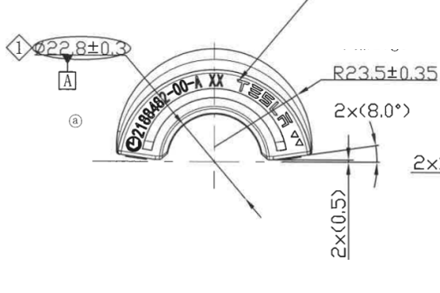
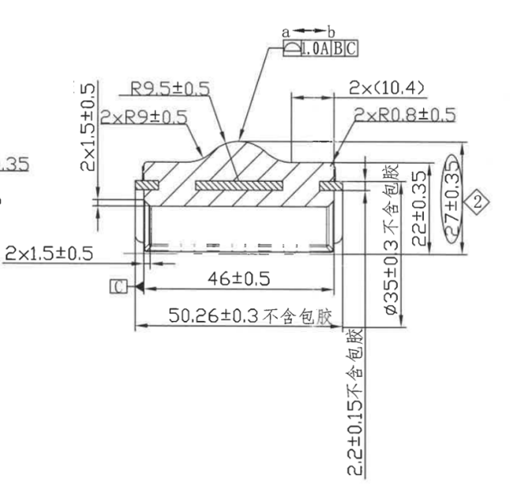

# 20C90483743-Y 图纸内容识别

## 原图与裁切说明

| 项目 | 内容 |
| --- | --- |
| 源文件 | `20C90483743-Y.png` |
| PDF 渲染说明 | 当前目录未发现同名 `20C90483743-Y.pdf`；本次以目录下已有 `20C90483743-Y.png` 作为整页 PNG 来源进行分区裁切。 |
| 源 PNG 尺寸 | `1244 x 861` |
| 裁切输出目录 | `outputs/20C90483743-Y_assets/images/` |
| 裁切检查 | 已检查保留的裁切图。裁切图均含图形，当前视图的尺寸线、箭头、引线和可见文字已尽量完整保留；未将整页 PNG 嵌入本文，也未放入 `images` 子目录。 |

## 上方外形/俯视加工视图

| 原图位置 | 提取内容 | 含义说明 |
| --- | --- | --- |
| 上方水平尺寸 | `46.31±0.4` | 控制上方视图左右外侧基准线之间的宽度/展开方向尺寸，名义值 `46.31`，允许偏差 `±0.4`。 |
| 中部外形 | 长圆形凸起轮廓 | 表达零件外表面中部凸起/包胶外形在该方向的投影视图。 |
| 中心线 | 水平中心线 | 表示该视图在高度方向的对称或中心参考。 |
| 上下局部台阶 | 上、下边缘均可见局部凸台/台阶线 | 表示零件端部或包覆区域的边缘结构。 |

该视图主要表达零件从上方观察时的外形宽度和中部凸起轮廓。图中唯一明确尺寸为 `46.31±0.4`，用于约束该方向的总体宽度。

## 左下弧形端面加工视图

| 原图位置 | 提取内容 | 含义说明 |
| --- | --- | --- |
| 左上序号标记 | `1` | 菱形序号标记，指向左上椭圆框尺寸区域。 |
| 左上椭圆框尺寸 | `Ø22.8±0.3` | 控制被指示位置的直径尺寸，名义直径 `22.8`，允许偏差 `±0.3`。 |
| 左上基准标识 | `A` | 基准 A 标识，定义该处或相关表面作为后续几何公差引用基准。 |
| 左侧圆圈标记 | `a` | 图面局部标记，用于对应右侧剖面图上方 `a-b` 的范围/位置说明。 |
| 外弧半径 | `R23.5±0.35` | 控制弧形端面外轮廓半径，名义半径 `23.5`，允许偏差 `±0.35`。 |
| 右侧角度参考 | `2×(8.0°)` | 两处参考角度，括号表示参考尺寸；用于说明右侧端部斜面/角度关系。 |
| 右侧竖向参考尺寸 | `2×(0.5)` | 两处参考高度/台阶差，括号表示参考尺寸。 |
| 弧面标识文字 | `Ø2188482-00-X XX` | 沿左侧弧面布置的可见字符；字符按图面可辨识内容还原，局部扫描较淡。 |
| 弧面标识文字 | `TESA` | 沿右侧弧面布置的产品/品牌类标识。 |
| 弧面图形标识 | 小三角/方向标记 | 位于右侧弧面标识末端附近，用于标识方向、型腔或工艺相关信息。 |
| 视图边缘说明 | 右边缘可见相邻视图尺寸残片 | 该残片不属于本弧形端面视图，未在本节作为提取内容使用。 |

该视图表达弧形端面的外弧、内弧、端部小台阶和弧面标识布置。关键控制项为外弧半径 `R23.5±0.35`、被引出的直径 `Ø22.8±0.3`、两处参考角度 `2×(8.0°)` 和两处参考台阶 `2×(0.5)`。

## 右侧剖面/侧向加工视图

| 原图位置 | 提取内容 | 含义说明 |
| --- | --- | --- |
| 左侧竖向尺寸 | `2×1.5±0.5` | 两处高度/厚度尺寸，名义值 `1.5`，允许偏差 `±0.5`。 |
| 左上圆角尺寸 | `2×R9±0.5` | 两处圆角半径，名义半径 `9`，允许偏差 `±0.5`。 |
| 上部圆角尺寸 | `R9.5±0.5` | 上部凸起过渡圆角半径，名义半径 `9.5`，允许偏差 `±0.5`。 |
| 上方范围标记 | `a`、`b` | 标识上方被几何公差控制或测量的局部范围。 |
| 几何公差框 | `1.0 A|B|C` | 表示该处几何公差值为 `1.0`，并引用基准 `A`、`B`、`C`；公差符号按图面为轮廓类符号。 |
| 上方水平参考尺寸 | `2×(10.4)` | 两处参考长度，括号表示参考尺寸，用于说明上部局部结构间距。 |
| 右上圆角尺寸 | `2×R0.8±0.5` | 两处小圆角半径，名义半径 `0.8`，允许偏差 `±0.5`。 |
| 左下水平尺寸 | `2×1.5±0.5` | 两处局部宽度/台阶尺寸，名义值 `1.5`，允许偏差 `±0.5`。 |
| 左下基准标识 | `C` | 基准 C 标识，作为几何公差框引用的基准之一。 |
| 下方水平尺寸 | `46±0.5` | 控制剖面图中内侧两端之间的长度，名义值 `46`，允许偏差 `±0.5`。 |
| 最下方水平尺寸 | `50.26±0.3 不含包胶` | 控制不含包胶状态下的总长度/基体长度，名义值 `50.26`，允许偏差 `±0.3`。 |
| 右侧竖向文字 | `3 不含包胶` | 指示右侧局部尺寸或结构要求按不含包胶状态理解。 |
| 右侧竖向尺寸 | `22±0.35` | 控制右侧局部高度/厚度，名义值 `22`，允许偏差 `±0.35`。 |
| 右侧外部竖向尺寸 | `Ø27±0.35` | 控制右侧外圆/外径尺寸，名义直径 `27`，允许偏差 `±0.35`。 |
| 右侧序号标记 | `2` | 菱形序号标记，指向 `Ø27±0.35` 相关尺寸或要求。 |
| 右下竖向尺寸 | `Ø35±0.3 不含包胶` | 控制不含包胶状态下的直径尺寸，名义直径 `35`，允许偏差 `±0.3`。 |
| 底部竖向尺寸 | `2.2±0.15 不含包胶` | 控制底部局部厚度/包胶以外尺寸，名义值 `2.2`，允许偏差 `±0.15`。 |
| 剖面填充 | 斜线剖面线 | 表示该视图为剖切表达，被剖切到的实体材料区域用剖面线填充。 |
| 内部轮廓 | 内部矩形腔/嵌件投影线 | 表达剖面中的内腔、嵌件或非包胶基体结构。 |

该视图是右侧主要剖面/侧向加工视图，集中表达包胶与不含包胶状态下的长度、直径、厚度、圆角和几何公差关系。`不含包胶` 标注说明对应尺寸应以去除包胶后的基体或指定状态为准；几何公差框引用 `A|B|C`，与左下视图中的基准 A 和本视图中的基准 C 共同建立检测基准体系。

## 表格

| 区域 | 提取结果 |
| --- | --- |
| 表格 | 当前源图可见范围内未发现独立表格区域。 |

## NOTES / 备注

| 区域 | 提取结果 |
| --- | --- |
| NOTES / 备注 | 当前源图可见范围内未发现独立 `NOTES` 或技术要求文字区。 |

## 标题栏

| 区域 | 提取结果 |
| --- | --- |
| 标题栏 | 当前源图可见范围内未发现标题栏区域。 |
