# 20C310838 内容识别

整页渲染图：`outputs/20C310838_assets/images/page_1.png`  
页面尺寸：4678 x 3309 px；PDF 1 页；原图为 A2 工程图。

## object_1 - 修订履历表

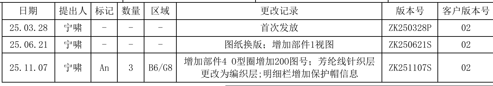

原图位置/视图名称：页 1，右上角修订履历表，bbox `[3130, 105, 4550, 355]`。

| 日期 | 提出人 | 标记 | 数量 | 区域 | 更改记录 | 版本号 | 客户版本号 |
|---|---|---|---|---|---|---|---|
| 25.03.28 | 宁啸 | - | - | - | 首次发放 | ZK250328P | 02 |
| 25.06.21 | 宁啸 | - | - | - | 图纸换版；增加部件1视图 | ZK250621S | 02 |
| 25.11.07 | 宁啸 | An | 3 | B6/G8 | 增加部件4 O型圈增加20O图号；芳纶线针织层更改为编织层；明细栏增加保护帽信息 | ZK251107S | 02 |

| 提取项 | 原图数值或文本 | 含义说明 |
|---|---|---|
| 表格性质 | 更改记录/版本履历 | 记录图纸发放和换版历史。 |
| 当前版本 | ZK251107S | 最后一行修订对应当前版本号。 |
| 客户版本号 | 02 | 三次记录客户版本均为 02。 |

边界归属说明：裁切包含完整外框、表头和 3 行记录；未提取下方点坐标表内容。

## object_2 - POINT COORDINATE CHART 点坐标表

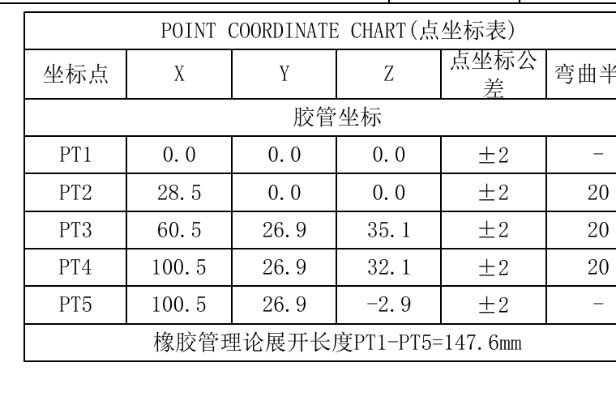

原图位置/视图名称：页 1，右上角点坐标表，bbox `[3750, 340, 4510, 840]`。

| 坐标点 | X | Y | Z | 点坐标公差 | 弯曲半径 |
|---|---:|---:|---:|---|---|
| PT1 | 0.0 | 0.0 | 0.0 | ±2 | - |
| PT2 | 28.5 | 0.0 | 0.0 | ±2 | 20 |
| PT3 | 60.5 | 26.9 | 35.1 | ±2 | 20 |
| PT4 | 100.5 | 26.9 | 32.1 | ±2 | 20 |
| PT5 | 100.5 | 26.9 | -2.9 | ±2 | - |

| 提取项 | 原图数值或文本 | 含义说明 |
|---|---|---|
| 表题 | POINT COORDINATE CHART(点坐标表) | 胶管中心线点坐标定义。 |
| 坐标类别 | 胶管坐标 | 表内 PT1-PT5 属于胶管坐标。 |
| 展开长度 | 橡胶管理论展开长度PT1-PT5=147.6mm | 从 PT1 到 PT5 的理论展开长度。 |

边界归属说明：裁切从点坐标表外框开始，未包含上方修订履历；表格下边界包含展开长度说明。

## object_3 - 胶管总成主视图

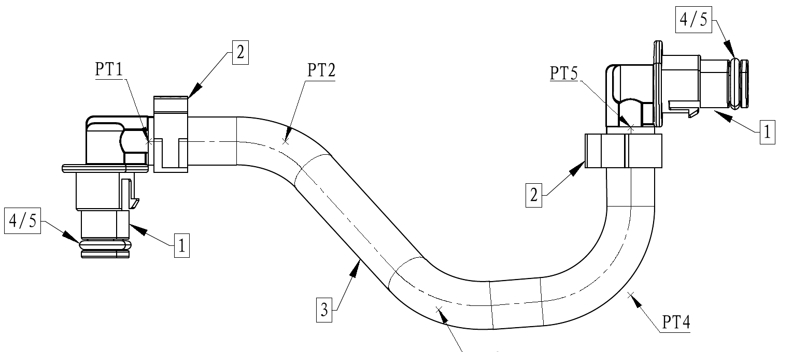

原图位置/视图名称：页 1，上部左中胶管总成主视图，bbox `[470, 305, 2000, 985]`。

| 提取项 | 原图数值或文本 | 含义说明 |
|---|---|---|
| 点位 | PT1 | 左端接口/管路起点坐标点。 |
| 点位 | PT2 | 第一段弯曲前后连接点。 |
| 点位 | PT3 | 中部下弯最低区域坐标点。 |
| 点位 | PT4 | 右侧回弯外侧坐标点。 |
| 点位 | PT5 | 右端接口处坐标点。 |
| 部件序号 | 1 | 指向左右两端接头，明细表为“接头 40C310838/04-01”。 |
| 部件序号 | 2 | 指向两端卡箍，明细表为“单耳无极卡箍 40C310838/04-02”。 |
| 部件序号 | 3 | 指向胶管本体，明细表为“胶管 25C310838”。 |
| 部件序号 | 4/5 | 指向 O型圈/保护帽区域，对应明细表序号 4、5。 |

边界归属说明：主视图裁切只提取总成外形、PT 点和部件序号；未把下方装配角度视图中的角度尺寸归入本视图。

## object_4 - 胶管尺寸详图

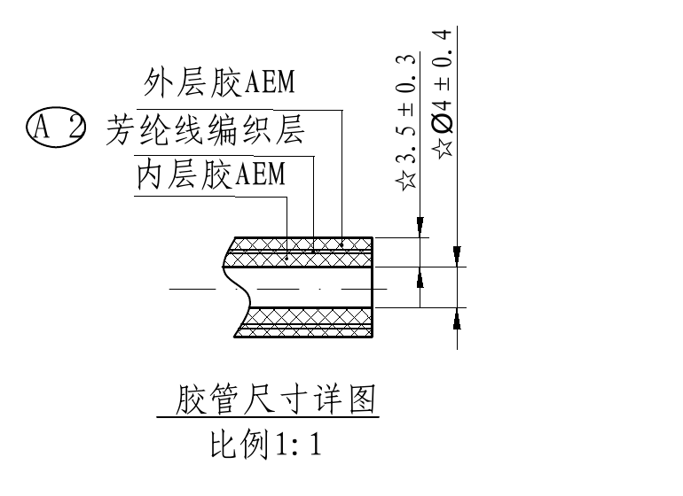

原图位置/视图名称：页 1，中上部胶管尺寸详图，bbox `[2070, 455, 2840, 1015]`。

| 提取项 | 原图数值或文本 | 含义说明 |
|---|---|---|
| 标题 | 胶管尺寸详图，比例1:1 | 胶管截面结构尺寸局部图。 |
| 材料层 | 外层胶AEM | 外层胶材料为 AEM。 |
| 材料层 | 芳纶线编织层 | 中间增强层为芳纶线编织层。 |
| 材料层 | 内层胶AEM | 内层胶材料为 AEM。 |
| 关键尺寸 | ☆Ø4±0.4 | 胶管外径关键尺寸，直径 4，公差 ±0.4。 |
| 关键尺寸 | ☆3.5±0.3 | 胶管截面厚度/相关关键尺寸，数值 3.5，公差 ±0.3。 |
| 标识 | A 2 | 引出材料层/部件标识，指向芳纶线编织层相关位置。 |

边界归属说明：裁切包含左侧圈号和全部材料引线；未包含主视图和 I 处放大视图尺寸。

## object_5 - I处放大视图

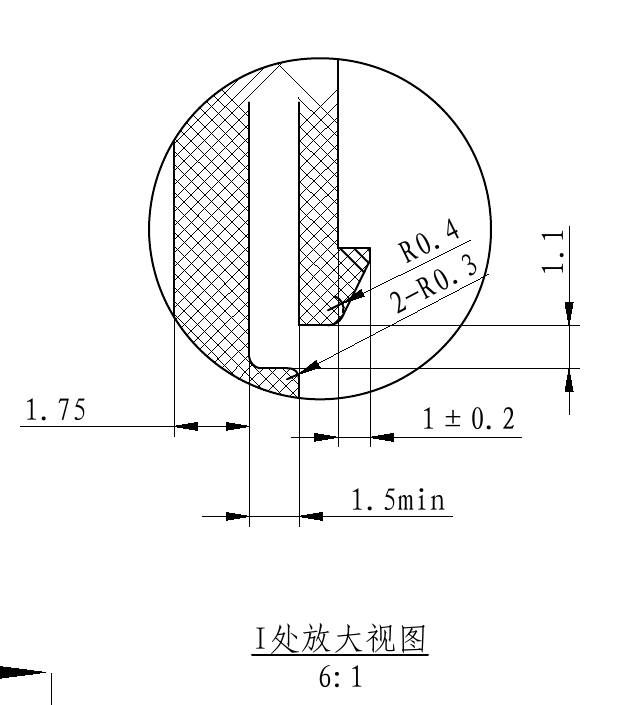

原图位置/视图名称：页 1，中上部 I 处放大视图，bbox `[2960, 420, 3580, 1125]`。

| 提取项 | 原图数值或文本 | 含义说明 |
|---|---|---|
| 标题 | I处放大视图，6:1 | 对保护帽局部 I 区域进行 6:1 放大。 |
| 线性尺寸 | 1.75 | 左侧壁厚/台阶相关线性尺寸。 |
| 线性尺寸 | 1±0.2 | 局部宽度尺寸，公差 ±0.2。 |
| 最小尺寸 | 1.5min | 局部最小宽度不得小于 1.5。 |
| 线性尺寸 | 1.1 | 右侧垂向局部高度/间距尺寸。 |
| 半径 | R0.4 | 单处圆角半径 0.4。 |
| 半径 | 2-R0.3 | 两处圆角半径 0.3。 |

边界归属说明：裁切只提取放大圆内和其直接尺寸线；左下角有邻近 A-A 方向箭头端点残留，不作为本视图内容提取。

## object_6 - A-A 剖面/保护帽局部尺寸

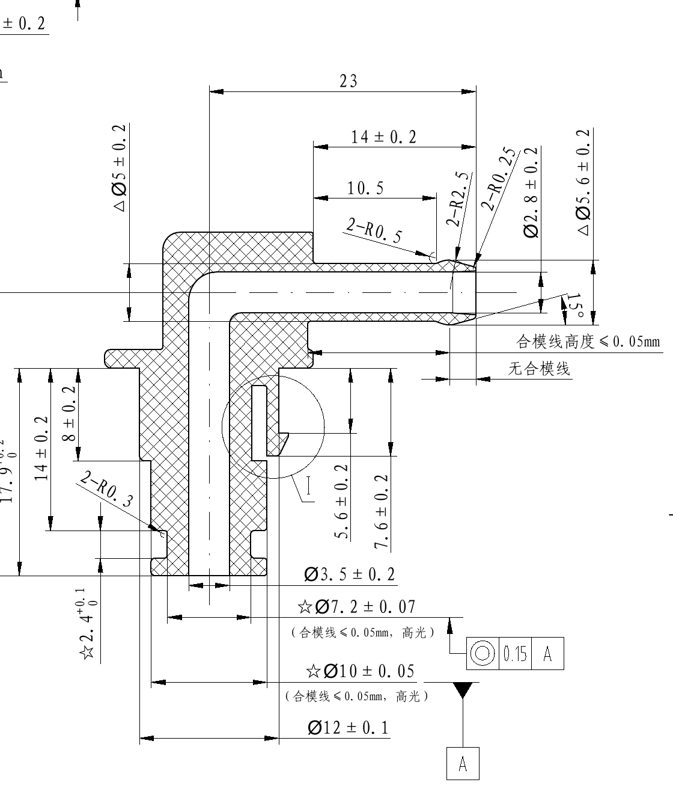

原图位置/视图名称：页 1，右中 A-A 剖面及保护帽尺寸，bbox `[3400, 800, 4520, 2140]`。

| 提取项 | 原图数值或文本 | 含义说明 |
|---|---|---|
| 剖面名 | A-A，3:1 | 保护帽/接头区域剖面视图，比例 3:1。 |
| 总长 | 23 | 上方整体长度尺寸。 |
| 线性尺寸 | 14±0.2 | 上部台阶长度，公差 ±0.2。 |
| 线性尺寸 | 10.5 | 内部台阶长度/定位尺寸。 |
| 半径 | 2-R0.5 | 两处 R0.5 圆角。 |
| 半径 | 2-R2.5 | 两处 R2.5 圆角。 |
| 半径 | 2-R0.25 | 两处 R0.25 圆角。 |
| 半径 | 2-R0.3 | 两处 R0.3 圆角。 |
| 直径尺寸 | Ø2.8±0.2 | 内部孔/通道直径，公差 ±0.2。 |
| 三角特性尺寸 | △Ø5±0.2 | 重要特性直径尺寸，公差 ±0.2。 |
| 三角特性尺寸 | △Ø5.6±0.2 | 重要特性直径尺寸，公差 ±0.2。 |
| 角度 | 15° | 端部斜面角度。 |
| 工艺说明 | 合模线高度≤0.05mm | 合模线高度限制。 |
| 工艺说明 | 无合模线 | 指定区域不得有合模线。 |
| 线性尺寸 | 24.4 | 左侧垂向总体高度。 |
| 线性尺寸 | 17.9 +0.2/0 | 左侧垂向尺寸，上偏差 +0.2，下偏差 0。 |
| 线性尺寸 | 14±0.2 | 左侧垂向台阶尺寸，公差 ±0.2。 |
| 线性尺寸 | 8±0.2 | 左侧垂向局部尺寸，公差 ±0.2。 |
| 线性尺寸 | ☆2.4 +0.1/0 | 关键特性台阶尺寸，上偏差 +0.1，下偏差 0。 |
| 线性尺寸 | 5.6±0.2 | 右下内部高度尺寸，公差 ±0.2。 |
| 线性尺寸 | 7.6±0.2 | 右下内部高度尺寸，公差 ±0.2。 |
| 直径尺寸 | Ø3.5±0.2 | 下方孔/柱相关直径，公差 ±0.2。 |
| 关键尺寸 | ☆Ø7.2±0.07 | 关键特性直径，公差 ±0.07；旁注合模线<0.05mm，高光。 |
| 几何公差 | ◎ 0.15 A | 以基准 A 为参照的几何公差框，数值 0.15。 |
| 基准 | A | 下方三角基准符号定义基准 A。 |
| 关键尺寸 | ☆Ø10±0.05 | 关键特性直径，公差 ±0.05；旁注合模线<0.05mm，高光。 |
| 直径尺寸 | Ø12±0.1 | 下方外径/总直径尺寸，公差 ±0.1。 |

边界归属说明：裁切覆盖 A-A 剖面主体及其关联尺寸。左上和上边缘有相邻视图标注尾部残留，不提取为本对象内容；所有列入表格的尺寸均有完整尺寸线、箭头或引线连接到本剖面。

## object_7 - PT1端接头、卡箍装配角度

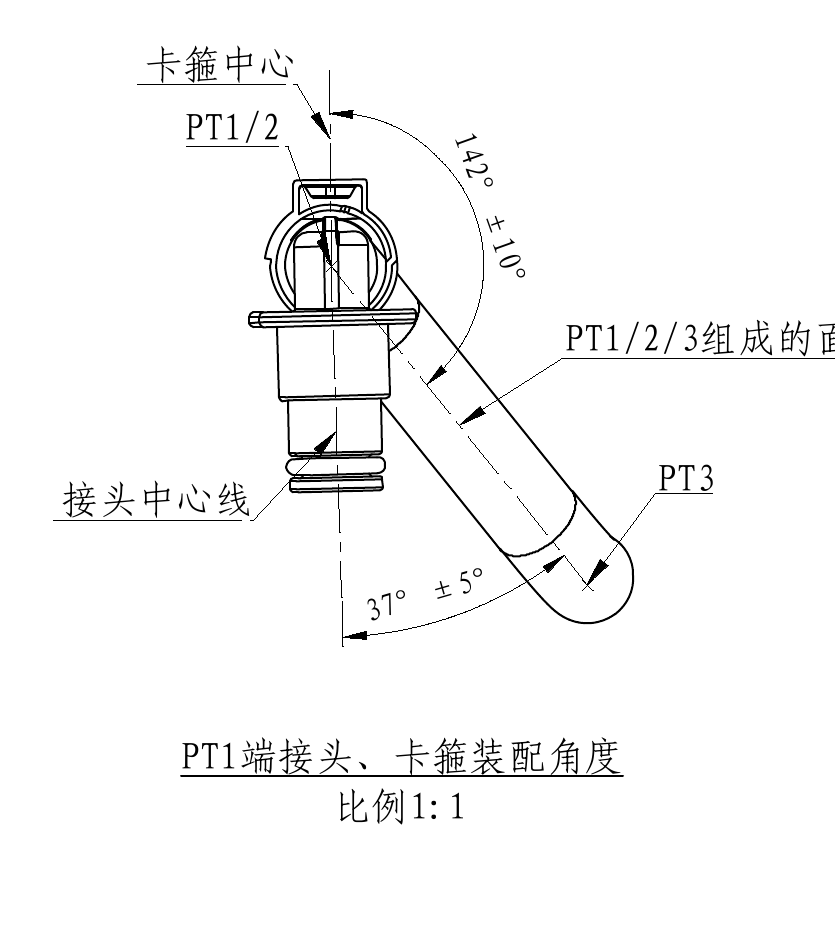

原图位置/视图名称：页 1，左中 PT1 端装配角度视图，bbox `[355, 1010, 1190, 1950]`。

| 提取项 | 原图数值或文本 | 含义说明 |
|---|---|---|
| 标题 | PT1端接头、卡箍装配角度，比例1:1 | PT1 端接头与卡箍相对角度定义。 |
| 点/面 | PT1/2 | PT1 与 PT2 相关端部/卡箍方向。 |
| 点/面 | PT1/2/3组成的面 | 由 PT1、PT2、PT3 组成的参考平面。 |
| 点位 | PT3 | 胶管段末端点位，用于平面/角度参照。 |
| 中心线 | 卡箍中心 | 卡箍中心线方向。 |
| 中心线 | 接头中心线 | 接头中心线方向。 |
| 角度 | 142°±10° | 卡箍中心与 PT1/2/3 组成面之间的角度，公差 ±10°。 |
| 角度 | 37°±5° | 接头中心线与 PT3/管段方向相关角度，公差 ±5°。 |

边界归属说明：裁切收紧到 PT1 装配角度图，未提取右侧 PT5 端视图内容。

## object_8 - PT5端接头、卡箍装配角度

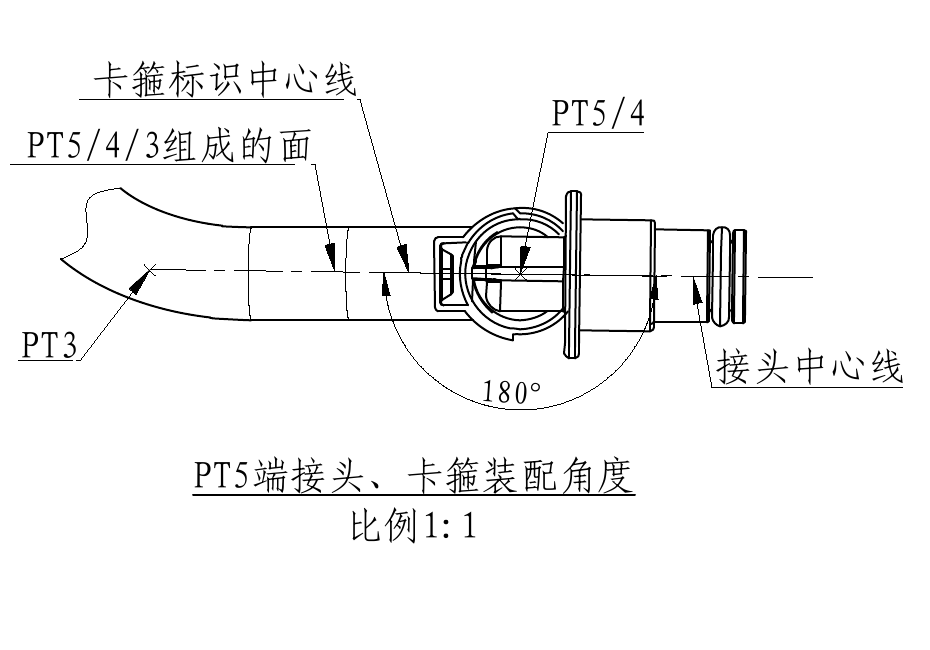

原图位置/视图名称：页 1，中部 PT5 端装配角度视图，bbox `[1240, 1330, 2170, 1980]`。

| 提取项 | 原图数值或文本 | 含义说明 |
|---|---|---|
| 标题 | PT5端接头、卡箍装配角度，比例1:1 | PT5 端接头与卡箍相对角度定义。 |
| 点/面 | PT5/4/3组成的面 | 由 PT5、PT4、PT3 组成的参考平面。 |
| 点/面 | PT5/4 | PT5 与 PT4 相关端部方向。 |
| 点位 | PT3 | 胶管端部参照点。 |
| 中心线 | 卡箍标识中心线 | 卡箍标识对准中心线。 |
| 中心线 | 接头中心线 | 接头轴线。 |
| 角度 | 180° | PT5 端接头/卡箍相对装配角度。 |

边界归属说明：裁切包含完整 180° 弧向尺寸和全部引线；未包含左侧 PT1 端角度图。

## object_9 - O型圈尺寸详图

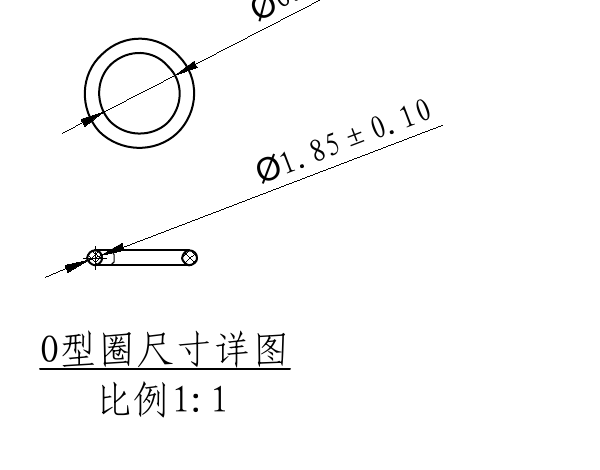

原图位置/视图名称：页 1，中部 O 型圈尺寸详图，bbox `[2220, 1410, 2820, 1880]`。

| 提取项 | 原图数值或文本 | 含义说明 |
|---|---|---|
| 标题 | O型圈尺寸详图，比例1:1 | O 型圈截面和外径尺寸。 |
| 直径尺寸 | Ø6.9±0.16 | O 型圈外径/相关直径，公差 ±0.16。 |
| 直径尺寸 | Ø1.85±0.10 | O 型圈线径/截面直径，公差 ±0.10。 |

边界归属说明：裁切只包含 O 型圈详图及两条直径引线，不提取周边装配角度或保护帽剖面尺寸。

## object_10 - 部件1 接头密封区域尺寸

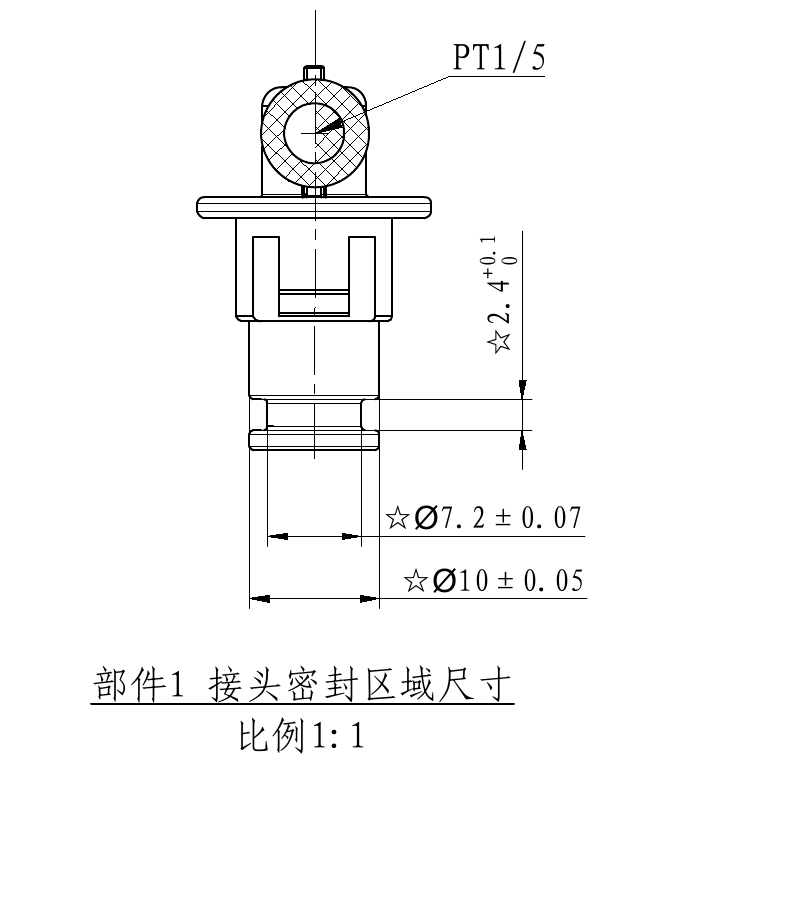

原图位置/视图名称：页 1，下中部部件 1 接头密封区域尺寸，bbox `[2110, 2100, 2910, 3000]`。

| 提取项 | 原图数值或文本 | 含义说明 |
|---|---|---|
| 标题 | 部件1 接头密封区域尺寸，比例1:1 | 接头密封区域局部视图。 |
| 点位 | PT1/5 | 指示该密封区域适用于 PT1/PT5 端。 |
| 关键尺寸 | ☆2.4 +0.1/0 | 关键特性高度尺寸，上偏差 +0.1，下偏差 0。 |
| 关键尺寸 | ☆Ø7.2±0.07 | 关键特性直径尺寸，公差 ±0.07。 |
| 关键尺寸 | ☆Ø10±0.05 | 关键特性直径尺寸，公差 ±0.05。 |

边界归属说明：裁切包含部件 1 视图和全部密封区域尺寸；未提取左侧技术要求或右侧明细表内容。

## object_11 - 技术要求 / NOTES

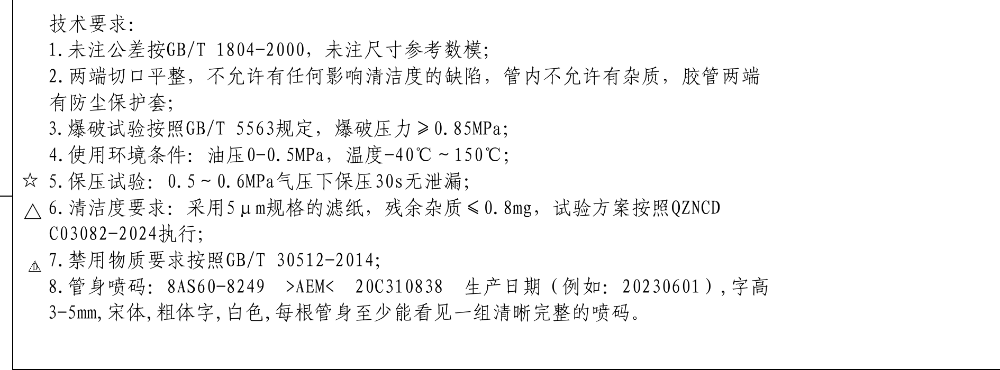

原图位置/视图名称：页 1，左下技术要求，bbox `[215, 2500, 2105, 3200]`。

| 提取项 | 原图数值或文本 | 含义说明 |
|---|---|---|
| 1 | 未注公差按GB/T 1804-2000，未注尺寸参考数模； | 未标注公差按标准执行，未标注尺寸参照数模。 |
| 2 | 两端切口平整，不允许有任何影响清洁度的缺陷，管内不允许有杂质，胶管两端有防尘保护套； | 端口、清洁度和防尘保护要求。 |
| 3 | 爆破试验按照GB/T 5563规定，爆破压力≥0.85MPa； | 爆破压力验收要求。 |
| 4 | 使用环境条件：油压0-0.5MPa，温度-40℃～150℃； | 工作压力和温度范围。 |
| ☆5 | 保压试验：0.5～0.6MPa气压下保压30s无泄漏； | 关键特性相关保压要求。 |
| △6 | 清洁度要求：采用5μm规格的滤纸，残余杂质≤0.8mg，试验方案按照QZNCD C03082-2024执行； | 重要特性相关清洁度要求。 |
| D7 | 禁用物质要求按照GB/T 30512-2014； | 安全/法规相关禁用物质要求。 |
| 8 | 管身喷码：8AS60-8249 >AEM< 20C310838 生产日期（例如：20230601），字高3-5mm，宋体，粗体字，白色，每根管身至少能看见一组清晰完整的喷码。 | 管身标识内容、字体、颜色和可见性要求。 |

边界归属说明：裁切覆盖技术要求全部 1-8 条；未提取底部特性等级表。

## object_12 - 明细表 / BOM

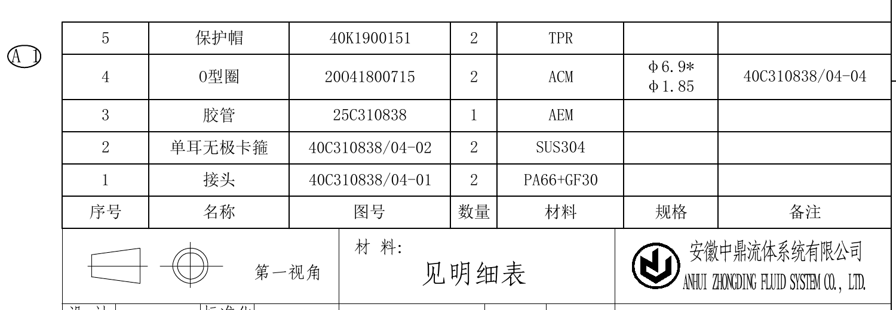

原图位置/视图名称：页 1，右下明细表，bbox `[3060, 2330, 4560, 2850]`。

| 序号 | 名称 | 图号 | 数量 | 材料 | 规格 | 备注 |
|---:|---|---|---:|---|---|---|
| 5 | 保护帽 | 40K1900151 | 2 | TPR |  |  |
| 4 | O型圈 | 20O41800715 | 2 | ACM | φ6.9* / φ1.85 | 40C310838/04-04 |
| 3 | 胶管 | 25C310838 | 1 | AEM |  |  |
| 2 | 单耳无极卡箍 | 40C310838/04-02 | 2 | SUS304 |  |  |
| 1 | 接头 | 40C310838/04-01 | 2 | PA66+GF30 |  |  |

| 提取项 | 原图数值或文本 | 含义说明 |
|---|---|---|
| 变更标识 | A1 | 明细表左侧变更/修订标识。 |
| 材料 | 见明细表 | 标题栏材料栏引用明细表。 |
| 投影视角 | 第一视角 | 图纸采用第一视角投影法。 |
| 表题 | 见明细表 | 表格为零件/材料明细。 |
| 公司 | 安徽中鼎流体系统有限公司 / ANHUI ZHONGDING FLUID SYSTEM CO., LTD. | 图纸所有方/制图单位。 |

边界归属说明：裁切包含完整 BOM 行列、表头和相邻“见明细表/第一视角/材料/公司”栏；下方标题栏另在 object_13 提取。

## object_13 - 标题栏

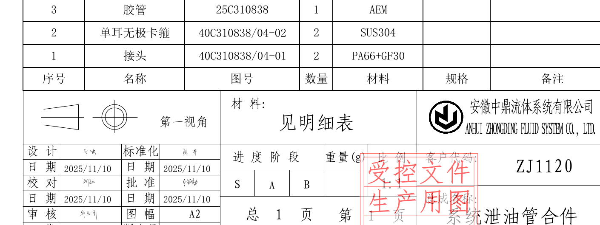

原图位置/视图名称：页 1，右下标题栏，bbox `[3110, 2500, 4520, 3030]`。

| 提取项 | 原图数值或文本 | 含义说明 |
|---|---|---|
| 材料 | 见明细表 | 材料信息引用明细表。 |
| 投影视角 | 第一视角 | 工程图投影方式。 |
| 公司 | 安徽中鼎流体系统有限公司 / ANHUI ZHONGDING FLUID SYSTEM CO., LTD. | 出图单位。 |
| 设计 | 宁啸，日期 2025/11/10 | 设计人员和日期。 |
| 标准化 | 陈平，日期 2025/11/10 | 标准化人员和日期。 |
| 校对 | 刘进，日期 2025/11/10 | 校对人员和日期。 |
| 批准 | 代峥婷，日期 2025/11/10 | 批准人员和日期。 |
| 审核 | 郭云刚，日期 2025/11/10 | 审核人员和日期。 |
| 图幅 | A2 | 图纸幅面。 |
| 版本号 | ZK251107S | 当前图纸版本。 |
| 日期 | 2025-11-10 | 标题栏日期。 |
| 进度阶段 | S / A / B | 阶段栏选项显示。 |
| 比例 | 1:1 | 总图比例。 |
| 客户代码 | ZJ1120 | 客户代码。 |
| 总成名称 | 系统泄油管合件 | 总成名称。 |
| 车型 | 8AS60 | 车型。 |
| 客户图号 | 8AS60-8249 | 客户图号。 |
| 中鼎流体总成图号 | 20C310838 | 总成图号。 |
| 印章 | 受控文件 生产用图 2025-11-10 | 红色受控文件章。 |

边界归属说明：裁切覆盖标题栏主体信息；上方明细表表头不作为标题栏字段重复提取。

## object_14 - 特性等级表

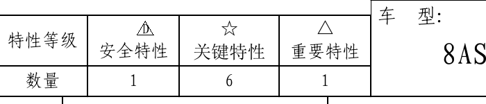

原图位置/视图名称：页 1，底部特性等级表，bbox `[2630, 3060, 3330, 3210]`。

| 特性等级 | D 安全特性 | ☆ 关键特性 | △ 重要特性 |
|---|---:|---:|---:|
| 数量 | 1 | 6 | 1 |

| 提取项 | 原图数值或文本 | 含义说明 |
|---|---|---|
| 安全特性数量 | D = 1 | 图中 D 类安全特性 1 项。 |
| 关键特性数量 | ☆ = 6 | 图中星号关键特性 6 项。 |
| 重要特性数量 | △ = 1 | 图中三角重要特性 1 项。 |

边界归属说明：裁切包含特性等级表完整行列；右侧有标题栏“车型”边缘，不提取为本表内容。

## 裁切检查记录

| 对象 | 检查结果 | 处理记录 |
|---|---|---|
| object_1 | 完整 | 表头、三行记录、外框完整；无边缘文字截断。 |
| object_2 | 完整 | 重裁后去除上方修订履历残留；坐标表外框和展开长度完整。 |
| object_3 | 完整 | 重裁后去除下方装配视图片段；PT1-PT5 和部件序号完整。 |
| object_4 | 完整 | 重裁后左侧圈号/材料层引线完整。 |
| object_5 | 基本完整 | 重裁后标题“6:1”完整，右侧邻近尺寸去除；左下角残留相邻箭头端点，已排除提取。 |
| object_6 | 完整 | 剖面主体和尺寸线完整；左上/上边少量相邻标注尾部不提取。 |
| object_7 | 完整 | 重裁后 PT1 标题、比例、142°±10°、37°±5° 和参考面文字完整；未混入 PT5 视图。 |
| object_8 | 完整 | 180° 弧向尺寸、中心线和标题比例完整。 |
| object_9 | 完整 | O 型圈两条直径引线和标题比例完整。 |
| object_10 | 完整 | 重裁后标题首字、比例和三项关键尺寸完整。 |
| object_11 | 完整 | 重裁后星号、三角、D 符号及 1-8 条文字完整。 |
| object_12 | 完整 | 明细表表头、5 行物料、规格和备注完整。 |
| object_13 | 完整 | 标题栏主体字段完整；上方明细表字段不重复提取。 |
| object_14 | 完整 | 特性等级表完整；右侧标题栏边缘未提取。 |
