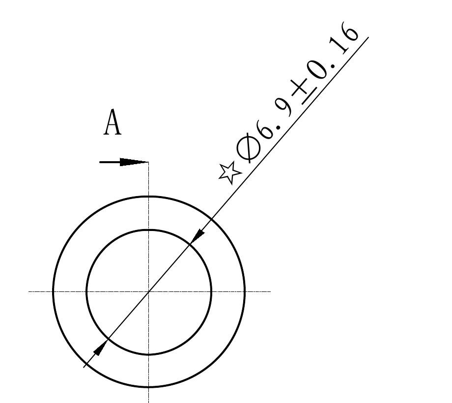
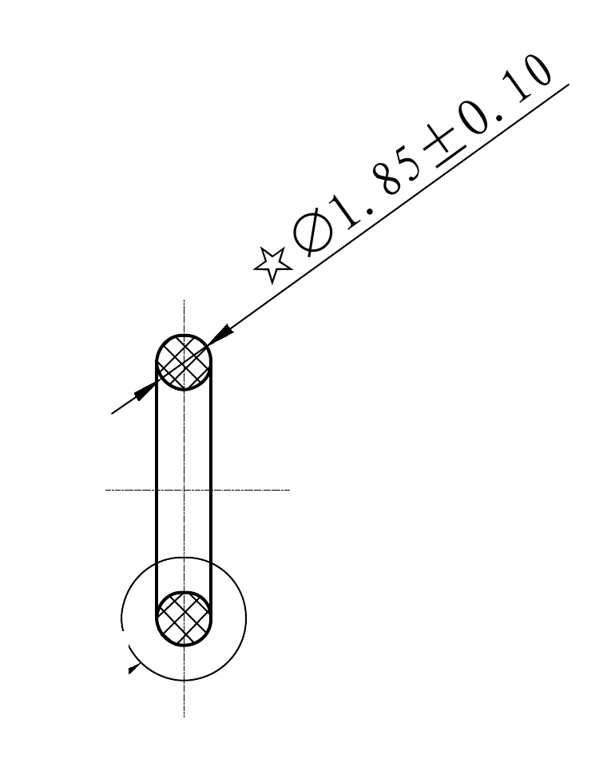
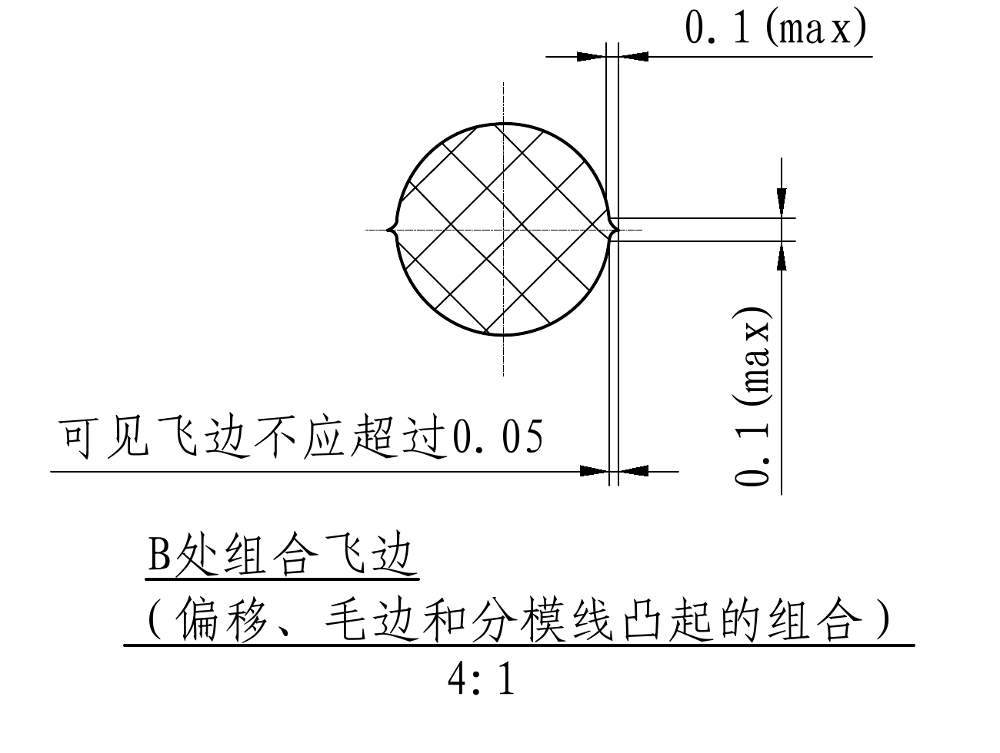
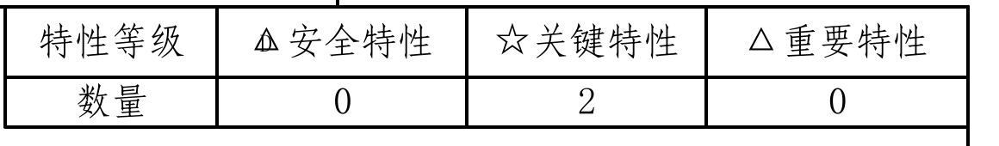
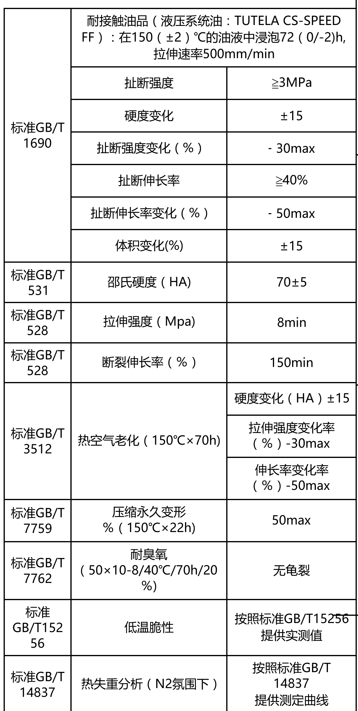
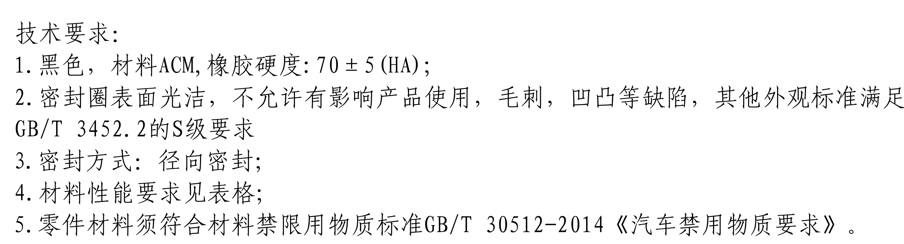
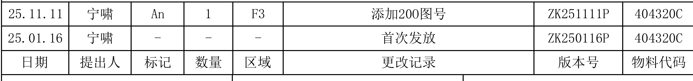
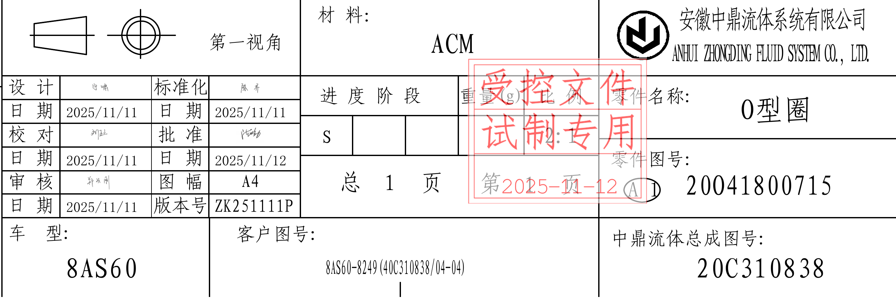

# 20O41800715 内容识别

整页渲染图：`outputs/20O41800715_assets/images/page_1.png`

## object_1：主视图

原图位置/视图名称：第 1 页左上加工主视图，显示 O 型圈正面同心圆轮廓及 A-A 剖切位置。

| 提取项 | 原图数值或文本 | 含义说明 |
|---|---|---|
| 图号 | 20O41800715 | 图面左上方零件图号，与标题栏一致。 |
| 视图轮廓 | 双同心圆 | O 型圈正视投影，内外圆显示环形截面投影。 |
| 剖切标识 | A、A | A-A 剖切位置，剖切箭头位于主视图上下方向，剖面归属于 object_2。 |
| 关键尺寸 | ☆∅6.9±0.16 | 带星号关键特性尺寸，表示主视图外径/相关直径尺寸为 6.9，公差 ±0.16。 |
| 直径符号 | ∅ | 该尺寸为直径尺寸。 |
| 中心线 | 水平、垂直中心线 | 表示圆形零件中心轴线。 |

边界归属说明：本裁切保留主视图的同心圆、A-A 剖切箭头和完整 `☆∅6.9±0.16` 尺寸线及文字；右侧 A-A 剖面视图片段和右下 B 处局部标注不归入本对象，裁切中已排除/遮挡。

## object_2：A-A 剖面视图

原图位置/视图名称：第 1 页左上至中部偏右，主视图 A-A 的剖面/截面视图。

| 提取项 | 原图数值或文本 | 含义说明 |
|---|---|---|
| 剖面来源 | A-A | 对应 object_1 主视图中的 A-A 剖切位置。 |
| 剖面形态 | 上下圆截面剖面线 | 圆形截面以交叉剖面线表示材料被剖切。 |
| 关键尺寸 | ☆∅1.85±0.10 | 带星号关键特性尺寸，表示剖面截面直径/线径为 1.85，公差 ±0.10。 |
| 直径符号 | ∅ | 该尺寸为直径尺寸。 |
| 中心线 | 竖向中心线、横向中心线 | 表示剖面中心位置及轴向对称关系。 |
| 下端局部圆轮廓 | B 处索引引出区域附近 | 下端圆形局部用于引出 B 处组合飞边的放大视图，具体飞边要求归属于 object_3。 |

边界归属说明：本裁切保留 A-A 剖面本体、剖面线和完整 `☆∅1.85±0.10` 尺寸线及文字；左侧主视图尺寸残片、右侧材料性能表和 B 处局部视图文字不归入本对象，已通过重裁和遮挡排除。

## object_3：B 处组合飞边局部视图

原图位置/视图名称：第 1 页左中下局部放大视图，标题为 B 处组合飞边。

| 提取项 | 原图数值或文本 | 含义说明 |
|---|---|---|
| 局部视图名称 | B处组合飞边 | B 位置的飞边/偏移/分模线凸起组合局部放大说明。 |
| 局部说明 | （偏移、毛边和分模线凸起的组合） | 说明 B 处组合飞边由偏移、毛边和分模线凸起共同构成。 |
| 比例 | 4:1 | 局部视图放大比例为 4:1。 |
| 可见飞边限制 | 可见飞边不应超过0.05 | 对可见飞边高度/宽度的最大允许值要求。 |
| 最大尺寸 | 0.1(max) | 对组合飞边相关方向的最大允许尺寸，括号内 `max` 表示上限值，不是参考尺寸。 |
| 最大尺寸 | 0.1(max) | 另一方向组合飞边最大允许尺寸，同样为最大上限值。 |
| 剖面圆 | 带交叉剖面线圆形截面 | 表示在 B 处放大观察的密封圈截面。 |

边界归属说明：本裁切包含完整 B 处局部剖面、两处 `0.1(max)` 尺寸线、`可见飞边不应超过0.05` 文本、局部标题和 4:1 比例；上方 A-A 剖面直径尺寸不归入本对象，裁切中已排除/遮挡。

## object_4：特性等级表

原图位置/视图名称：第 1 页右上角特性等级表。

| 特性等级 | △ 安全特性 | ☆ 关键特性 | △ 重要特性 |
|---|---:|---:|---:|
| 数量 | 0 | 2 | 0 |

| 提取项 | 原图数值或文本 | 含义说明 |
|---|---|---|
| 安全特性数量 | 0 | 图中没有安全特性数量。 |
| 关键特性数量 | 2 | 图中有 2 处星号关键尺寸：`☆∅6.9±0.16` 和 `☆∅1.85±0.10`。 |
| 重要特性数量 | 0 | 图中没有重要特性数量。 |

边界归属说明：本裁切仅包含右上角特性等级表格，不包含下方材料性能表。

## object_5：材料性能表

原图位置/视图名称：第 1 页右侧材料性能要求表。

| 标准 | 项目/条件 | 性能/要求 |
|---|---|---|
| 标准GB/T 1690 | 耐接触油品（液压系统油：TUTELA CS-SPEED FF）：在150（±2）℃的油液中浸泡72（0/-2)h，拉伸速率500mm/min | 扯断强度：≥3MPa |
| 标准GB/T 1690 | 同上 | 硬度变化：±15 |
| 标准GB/T 1690 | 同上 | 扯断强度变化（%）：-30max |
| 标准GB/T 1690 | 同上 | 扯断伸长率：≥40% |
| 标准GB/T 1690 | 同上 | 扯断伸长率变化（%）：-50max |
| 标准GB/T 1690 | 同上 | 体积变化(%)：±15 |
| 标准GB/T 531 | 邵氏硬度（HA） | 70±5 |
| 标准GB/T 528 | 拉伸强度（Mpa） | 8min |
| 标准GB/T 528 | 断裂伸长率（%） | 150min |
| 标准GB/T 3512 | 热空气老化（150℃×70h） | 硬度变化（HA）±15 |
| 标准GB/T 3512 | 热空气老化（150℃×70h） | 拉伸强度变化率（%）-30max |
| 标准GB/T 3512 | 热空气老化（150℃×70h） | 伸长率变化率（%）-50max |
| 标准GB/T 7759 | 压缩永久变形 %（150℃×22h） | 50max |
| 标准GB/T 7762 | 耐臭氧（50×10-8/40℃/70h/20%） | 无龟裂 |
| 标准 GB/T15256 | 低温脆性 | 按照标准GB/T15256提供实测值 |
| 标准GB/T 14837 | 热失重分析（N2氛围下） | 按照标准GB/T14837提供测定曲线 |

| 提取项 | 原图数值或文本 | 含义说明 |
|---|---|---|
| 油液温度参考/公差 | 150（±2）℃ | 括号内为试验温度允许偏差。 |
| 浸泡时间公差 | 72（0/-2)h | 括号内为浸泡时间偏差范围，上偏差 0、下偏差 -2 小时。 |
| 拉伸速率 | 500mm/min | 油浸后拉伸试验速率。 |
| max 后缀 | -30max、-50max、50max | 表示对应性能变化或压缩永久变形的最大限值。 |
| min 后缀 | 8min、150min | 表示对应性能的最小限值。 |

边界归属说明：本裁切仅提取右侧材料性能表字段；右侧极细竖线为图框/邻近分区边界痕迹，不作为表格内容提取。

## object_6：技术要求

原图位置/视图名称：第 1 页下半部技术要求文本区。

| 提取项 | 原图数值或文本 | 含义说明 |
|---|---|---|
| 标题 | 技术要求： | 技术要求文本区标题。 |
| 1 | 黑色，材料ACM,橡胶硬度:70±5(HA); | 规定颜色、材料和橡胶硬度。 |
| 2 | 密封圈表面光洁，不允许有影响产品使用，毛刺，凹凸等缺陷，其他外观标准满足GB/T 3452.2的S级要求 | 外观质量及适用外观标准。 |
| 3 | 密封方式：径向密封； | 密封方式为径向密封。 |
| 4 | 材料性能要求见表格； | 材料性能需按 object_5 材料性能表执行。 |
| 5 | 零件材料须符合材料禁限用物质标准GB/T 30512-2014《汽车禁用物质要求》。 | 材料禁限用物质合规要求。 |

边界归属说明：本裁切包含完整技术要求标题和 1-5 条正文；右上邻近材料表残线不属于技术要求内容，已遮挡且未提取。

## object_7：修订履历表

原图位置/视图名称：第 1 页底部标题栏上方修订履历表。

| 日期 | 提出人 | 标记 | 数量 | 区域 | 更改记录 | 版本号 | 物料代码 |
|---|---|---|---:|---|---|---|---|
| 25.11.11 | 宁啸 | An | 1 | F3 | 添加20O图号 | ZK251111P | 404320C |
| 25.01.16 | 宁啸 | - | - | - | 首次发放 | ZK250116P | 404320C |

| 提取项 | 原图数值或文本 | 含义说明 |
|---|---|---|
| 最新修订 | 25.11.11 / 添加20O图号 / ZK251111P | 当前版本记录，区域 F3，数量 1。 |
| 首次发放 | 25.01.16 / 首次发放 / ZK250116P | 初始发布记录。 |
| 物料代码 | 404320C | 两条记录均对应同一物料代码。 |

边界归属说明：本裁切完整包含修订履历两行记录和表头，不包含下方标题栏字段。

## object_8：标题栏

原图位置/视图名称：第 1 页底部标题栏。

| 提取项 | 原图数值或文本 | 含义说明 |
|---|---|---|
| 投影视角 | 第一视角 | 图纸采用第一视角投影。 |
| 材料 | ACM | 零件材料。 |
| 公司中文名 | 安徽中鼎流体系统有限公司 | 出图单位中文名称。 |
| 公司英文名 | ANHUI ZHONGDING FLUID SYSTEM CO., LTD. | 出图单位英文名称。 |
| 设计日期 | 2025/11/11 | 设计栏日期。 |
| 标准化日期 | 2025/11/11 | 标准化栏日期。 |
| 校对日期 | 2025/11/11 | 校对栏日期。 |
| 批准日期 | 2025/11/12 | 批准栏日期。 |
| 审核日期 | 2025/11/11 | 审核栏日期。 |
| 图幅 | A4 | 图纸幅面。 |
| 版本号 | ZK251111P | 当前图纸版本号。 |
| 进度阶段 | S | 进度阶段标识。 |
| 比例 | 2:1 | 图纸比例。 |
| 零件名称 | O型圈 | 零件名称。 |
| 零件图号 | A 1 20O41800715 | 标题栏零件图号信息，含 A、1 标识和图号。 |
| 页码 | 总1页 第1页 | 图纸共 1 页，当前第 1 页。 |
| 日期 | 2025-11-12 | 标题栏中页码附近日期。 |
| 车型 | 8AS60 | 适用车型。 |
| 客户图号 | 8AS60-8249(40C310838/04-04) | 客户图号。 |
| 中鼎流体总成图号 | 20C310838 | 总成图号。 |
| 红色印章 | 受控文件 试制专用 第2025-11-12 A1 | 标题栏区域叠加的受控文件试制专用印章。 |

边界归属说明：本裁切包含完整标题栏主要字段及红色印章；底部坐标编号不作为标题栏内容提取，裁切中已遮挡/排除。

## 裁切检查记录

| 对象 | 图片路径 | 检查结果 |
|---|---|---|
| object_1 | outputs/20O41800715_assets/images/object_1.png | 完整包含主视图轮廓、A-A 剖切箭头、`☆∅6.9±0.16` 尺寸线和文字；右侧剖面片段及 B 标注已排除。 |
| object_2 | outputs/20O41800715_assets/images/object_2.png | 完整包含 A-A 剖面图形、剖面线、`☆∅1.85±0.10` 尺寸线和文字；未提取右侧表格内容。 |
| object_3 | outputs/20O41800715_assets/images/object_3.png | 完整包含 B 处局部图、`0.1(max)` 两方向尺寸、`可见飞边不应超过0.05`、局部标题和比例；上方其他视图尺寸已排除。 |
| object_4 | outputs/20O41800715_assets/images/object_4.png | 完整包含特性等级表表头、数量行和外框。 |
| object_5 | outputs/20O41800715_assets/images/object_5.png | 完整包含材料性能表行列、表头条件和右列要求；右侧极细边线为邻近图框痕迹，未作为内容提取。 |
| object_6 | outputs/20O41800715_assets/images/object_6.png | 完整包含技术要求标题和 1-5 条正文；右上邻近材料表残线已遮挡。 |
| object_7 | outputs/20O41800715_assets/images/object_7.png | 完整包含修订履历表两条记录、表头和边框。 |
| object_8 | outputs/20O41800715_assets/images/object_8.png | 完整包含标题栏字段、公司名、图号、车型、客户图号、总成图号及红色印章；底部坐标编号已排除。 |
