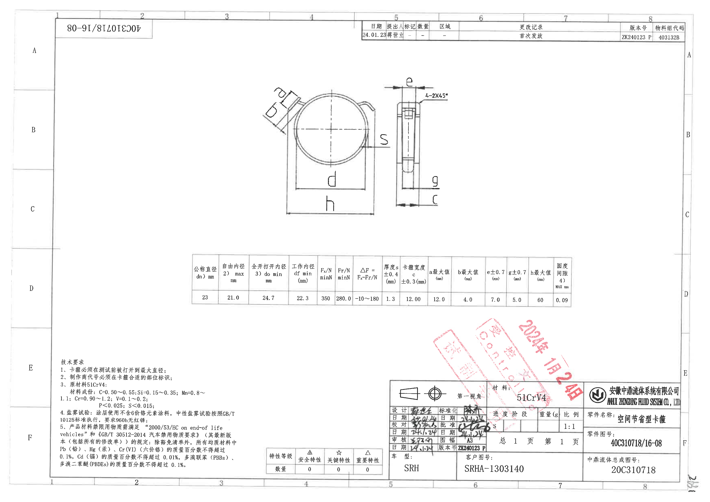
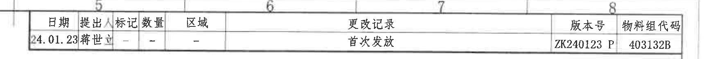
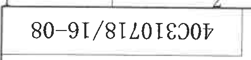
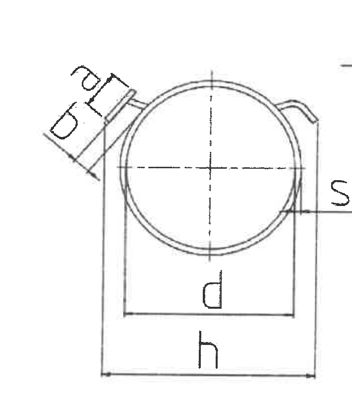
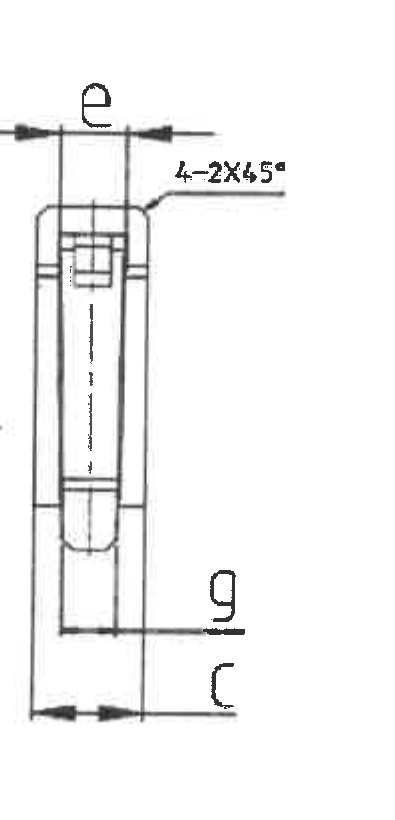
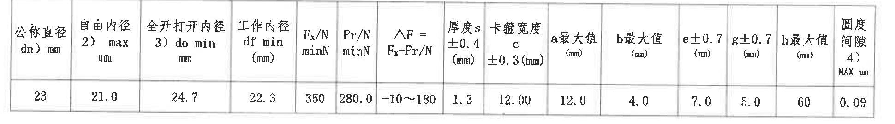
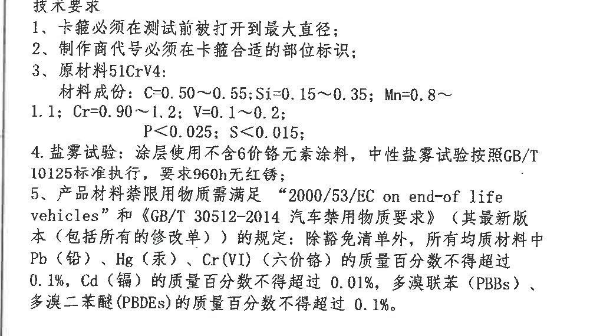
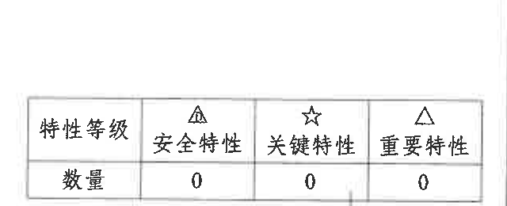
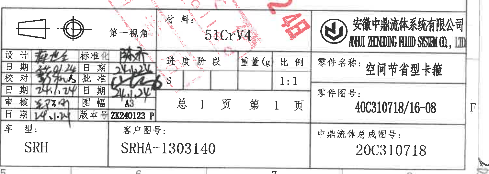

# 40C310718 16-08 ZK240123P 内容识别

源文件：`input/40C310718 16-08 ZK240123P.pdf`

整页渲染图：`outputs/40C310718 16-08 ZK240123P_assets/images/page_1.png`

## object_1 - 顶部更改记录表

原图位置/视图名称：第 1 页顶部第 5-8 区，更改记录表，bbox `[1715, 75, 3440, 220]`。

| 日期 | 提出人 | 标记 | 数量 | 区域 | 更改记录 | 版本号 | 物料组代码 |
| --- | --- | --- | --- | --- | --- | --- | --- |
| 24.01.23 | 蒋世立（扫描较模糊） | - | - | - | 首次发放 | ZK240123 P | 403132B |

| 提取项 | 原图数值或文本 | 含义说明 |
| --- | --- | --- |
| 日期 | 24.01.23 | 本次发放/更改记录日期。 |
| 提出人 | 蒋世立（扫描较模糊） | 更改记录提出人，姓名受扫描清晰度影响。 |
| 标记 | - | 未填写更改标记。 |
| 数量 | - | 未填写数量。 |
| 区域 | - | 未指定更改区域。 |
| 更改记录 | 首次发放 | 表示该版本为首次发放。 |
| 版本号 | ZK240123 P | 图纸/版本标识。 |
| 物料组代码 | 403132B | 物料组代码。 |

边界归属说明：该对象仅包含顶部更改记录表及其外框；上下方图框分区数字作为表格所在图框背景可见，未归入更改记录字段。

## object_2 - 左上倒置图号块

原图位置/视图名称：第 1 页左上角倒置图号块，bbox `[270, 78, 770, 198]`。

| 提取项 | 原图数值或文本 | 含义说明 |
| --- | --- | --- |
| 倒置标识文本 | 40C310718/16-08 | 与标题栏零件图号一致，用于图纸边框快速识别。 |

边界归属说明：裁切仅含左上角倒置矩形框和倒置图号，未包含主视图、参数表或顶部更改记录表。

## object_3 - 正视图/主加工视图

原图位置/视图名称：第 1 页中上部左侧正视图，bbox `[1210, 300, 1920, 1120]`。

| 提取项 | 原图数值或文本 | 含义说明 |
| --- | --- | --- |
| d | 见参数表：公称直径 dn = 23 mm；工作内径 df min = 22.3 mm；自由内径 max = 21.0 mm；全开打开内径 do min = 24.7 mm | 正视图圆孔/卡箍开口相关直径代号；具体数值由下方参数表给出。 |
| h | 见参数表：h 最大值 = 60 mm | 正视图底部总高度/外形高度尺寸代号。 |
| b | 见参数表：b 最大值 = 4.0 mm | 左上斜向耳部/夹持端局部宽度尺寸代号。 |
| a | 见参数表：a 最大值 = 12.0 mm | 左上斜向耳部/夹持端局部宽度或间距尺寸代号。 |
| S | 见参数表：厚度 s = 1.3 mm，公差 +0.4 mm | 正视图右侧引出标注，表示材料厚度 s；标注贴近正视图与侧视图之间，但引出线指向正视图圆弧边。 |
| 中心线 | 十字中心线 | 表示圆孔/卡箍内径中心基准位置，不是尺寸数值。 |
| 弧形轮廓 | 圆弧轮廓，无单独弧度数值 | 图中显示卡箍弧形主体；弧度/圆度要求由参数表“圆度间隙 0.09 MAX mm”控制，图中未给出独立半径 R 或弧长数值。 |

边界归属说明：该裁切包含正视图本体、左上斜向耳部的 a/b 标注、正视图下方 d/h 标注和右侧 S 引出标注。右侧极近边界处的侧视图未作为本对象提取；S 因引出线指向正视图圆弧边，归属正视图。

## object_4 - 侧视图/厚度加工视图

原图位置/视图名称：第 1 页中上部右侧侧视图，bbox `[1925, 300, 2320, 1120]`。

| 提取项 | 原图数值或文本 | 含义说明 |
| --- | --- | --- |
| e | 见参数表：e ±0.7 = 7.0 mm | 侧视图顶部横向尺寸，表示顶部开口/宽度相关尺寸，公差为 ±0.7 mm。 |
| 4-2X45° | 4-2X45° | 侧视图右上倒角标注；表示 4 处倒角，每处为 2 mm × 45°。 |
| g | 见参数表：g ±0.7 = 5.0 mm | 侧视图下部局部横向尺寸，公差为 ±0.7 mm。 |
| c | 见参数表：卡箍宽度 c = 12.00 mm，公差 ±0.3 mm | 侧视图底部总宽度/卡箍宽度尺寸代号。 |
| 中心线 | 竖向中心线 | 表示侧视投影中心位置，不是尺寸数值。 |

边界归属说明：该裁切只提取侧视图及其 e、4-2X45°、g、c 标注。左侧 S 标注属于正视图，未在本节提取；裁切左边界仅保留 e 尺寸线箭头所需空间。

## object_5 - 参数尺寸表

原图位置/视图名称：第 1 页中下部参数尺寸表，bbox `[925, 1260, 2865, 1530]`。

| 公称直径 dn) mm | 自由内径 2) max mm | 全开打开内径 3) do min mm | 工作内径 df min (mm) | Fx/N minN | Fr/N minN | △F = Fx-Fr/N | 厚度 s +0.4 (mm) | 卡箍宽度 c ±0.3(mm) | a 最大值 (mm) | b 最大值 (mm) | e±0.7 (mm) | g±0.7 (mm) | h 最大值 (mm) | 圆度间隙 4) MAX mm |
| --- | --- | --- | --- | --- | --- | --- | --- | --- | --- | --- | --- | --- | --- | --- |
| 23 | 21.0 | 24.7 | 22.3 | 350 | 280.0 | -10~180 | 1.3 | 12.00 | 12.0 | 4.0 | 7.0 | 5.0 | 60 | 0.09 |

| 提取项 | 原图数值或文本 | 含义说明 |
| --- | --- | --- |
| 公称直径 dn | 23 mm | 卡箍规格公称直径。 |
| 自由内径 2) max | 21.0 mm | 自由状态内径最大值，脚注 2) 原图未在当前页单独展开。 |
| 全开打开内径 3) do min | 24.7 mm | 打开状态最小内径，脚注 3) 原图未在当前页单独展开。 |
| 工作内径 df min | 22.3 mm | 工作状态最小内径。 |
| Fx/N minN | 350 | 力值 Fx 的最小要求。 |
| Fr/N minN | 280.0 | 力值 Fr 的最小要求。 |
| △F = Fx-Fr/N | -10~180 | Fx 与 Fr 的差值范围。 |
| 厚度 s +0.4 | 1.3 mm | 材料厚度名义值 1.3 mm，上偏差 +0.4 mm；对应正视图 S 标注。 |
| 卡箍宽度 c ±0.3 | 12.00 mm | 卡箍宽度，公差 ±0.3 mm；对应侧视图 c。 |
| a 最大值 | 12.0 mm | 正视图斜向耳部 a 尺寸最大值。 |
| b 最大值 | 4.0 mm | 正视图斜向耳部 b 尺寸最大值。 |
| e±0.7 | 7.0 mm | 侧视图顶部 e 尺寸，公差 ±0.7 mm。 |
| g±0.7 | 5.0 mm | 侧视图下部 g 尺寸，公差 ±0.7 mm。 |
| h 最大值 | 60 mm | 正视图总高度/外形高度最大值。 |
| 圆度间隙 4) MAX | 0.09 mm | 圆度/间隙最大允许值，脚注 4) 原图未在当前页单独展开。 |

边界归属说明：该裁切完整包含参数表外框、表头和唯一数据行；未将下方红色印章归入表格内容。表中 a、b、d/dn/df/do、s、c、e、g、h 与上方正视图和侧视图标注对应。

## object_6 - NOTES/技术要求

原图位置/视图名称：第 1 页左下部技术要求，bbox `[245, 1780, 1285, 2350]`。

| 提取项 | 原图数值或文本 | 含义说明 |
| --- | --- | --- |
| 标题 | 技术要求 | 该区域为制造和材料技术要求。 |
| 1 | 卡箍必须在测试前被打开到最大直径； | 测试前状态要求。 |
| 2 | 制作商代号必须在卡箍合适的部位标识； | 标识要求。 |
| 3 | 原材料 51CrV4；材料成份：C=0.50~0.55; Si=0.15~0.35; Mn=0.8~1.1; Cr=0.90~1.2; V=0.1~0.2; P<0.025; S<0.015; | 原材料牌号和化学成分要求。 |
| 4 | 盐雾试验：涂层使用不含 6 价铬元素涂料，中性盐雾试验按照 GB/T 10125 标准执行，要求 960h 无红锈； | 表面涂层和耐腐蚀试验要求。 |
| 5 | 产品材料禁限用物质需满足 “2000/53/EC on end-of life vehicles” 和《GB/T 30512-2014 汽车禁用物质要求》（其最新版 本（包括所有的修改单））的规定：除豁免清单外，所有均质材料中 Pb（铅）、Hg（汞）、Cr(VI)（六价铬）的质量百分数不得超过 0.1%，Cd（镉）的质量百分数不得超过 0.01%，多溴联苯（PBBs）、多溴二苯醚（PBDEs）的质量百分数不得超过 0.1%。 | 禁限用物质和法规符合性要求。 |

边界归属说明：裁切仅包含技术要求文字。右侧特性等级表已单独裁为 object_7，未归入本 NOTES 对象。

## object_7 - 特性等级表

原图位置/视图名称：第 1 页底部偏左特性等级表，bbox `[1280, 2090, 1920, 2350]`。

| 特性等级 | △ 安全特性 | ☆ 关键特性 | △ 重要特性 |
| --- | --- | --- | --- |
| 数量 | 0 | 0 | 0 |

| 提取项 | 原图数值或文本 | 含义说明 |
| --- | --- | --- |
| 安全特性数量 | 0 | 图纸未设置安全特性数量。 |
| 关键特性数量 | 0 | 图纸未设置关键特性数量。 |
| 重要特性数量 | 0 | 图纸未设置重要特性数量。 |

边界归属说明：该裁切完整包含特性等级小表，不含技术要求正文和右侧标题栏签署区。

## object_8 - 标题栏/签署栏

原图位置/视图名称：第 1 页右下角标题栏，bbox `[1920, 1855, 3430, 2395]`。

| 字段 | 原图数值或文本 |
| --- | --- |
| 视图符号 | 第一视角 |
| 材料 | 51CrV4 |
| 公司 | 安徽中鼎流体系统有限公司 / ANHUI ZHONGDING FLUID SYSTEM CO., LTD |
| 设计 | 手写签名，扫描不清 |
| 设计日期 | 24.01.24 |
| 校对 | 手写签名，扫描不清 |
| 校对日期 | 24.1.24 |
| 审核 | 手写签名，扫描不清 |
| 审核日期 | 24.1.24 |
| 标准化 | 手写签名，扫描不清 |
| 标准化日期 | 24.1.24 |
| 批准 | 手写签名，扫描不清 |
| 批准日期 | 24.1.24 |
| 进度阶段 | S |
| 重量(g) | 空白 |
| 比例 | 1:1 |
| 总页数 | 总 1 页 |
| 当前页 | 第 1 页 |
| 图幅 | A3 |
| 版本号 | ZK240123 P |
| 车型 | SRH |
| 客户图号 | SRHA-1303140 |
| 零件名称 | 空间节省型卡箍 |
| 零件图号 | 40C310718/16-08 |
| 中鼎流体总成图号 | 20C310718 |

| 提取项 | 原图数值或文本 | 含义说明 |
| --- | --- | --- |
| 第一视角 | 第一视角 | 投影方法标识。 |
| 材料 | 51CrV4 | 零件材料，与 NOTES 原材料一致。 |
| 比例 | 1:1 | 图样比例。 |
| 零件名称 | 空间节省型卡箍 | 产品/零件名称。 |
| 零件图号 | 40C310718/16-08 | 主图号，与左上倒置图号一致。 |
| 版本号 | ZK240123 P | 标题栏版本号，与顶部更改记录表一致。 |
| 图幅 | A3 | 图纸幅面。 |
| 客户图号 | SRHA-1303140 | 客户侧图号。 |
| 中鼎流体总成图号 | 20C310718 | 总成图号。 |

边界归属说明：该裁切包含右下标题栏、签署栏、材料栏、页码栏和零件信息栏。红色印章覆盖标题栏局部但不改变表格归属；手写签名因扫描和重叠线条不清，按“不清”记录，不主观补全。

## 裁切检查记录

| 对象 | 检查结果 |
| --- | --- |
| page_1 | 整页 PNG 渲染完成，尺寸 3505×2480，完整包含原 PDF 单页内容。 |
| object_1 | 已重裁；完整包含顶部更改记录表外框、表头和数据行；日期未截断。 |
| object_2 | 完整包含左上倒置图号块，无其他对象混入。 |
| object_3 | 完整包含正视图 d、h、a、b、S 标注及对应尺寸线/引出线；S 归属正视图；未提取侧视图内容。 |
| object_4 | 完整包含侧视图 e、4-2X45°、g、c 标注及尺寸线；左侧正视图 S 标注未归入本对象。 |
| object_5 | 完整包含参数表外框、全部表头和唯一数据行；无表格文字截断。 |
| object_6 | 已重裁；完整包含技术要求文字，未带入特性等级表。 |
| object_7 | 已重裁；完整包含特性等级表外框、表头和数量行。 |
| object_8 | 完整包含标题栏/签署栏主要外框和文字；右侧图框边界完整，手写签名因原图扫描质量不清。 |
