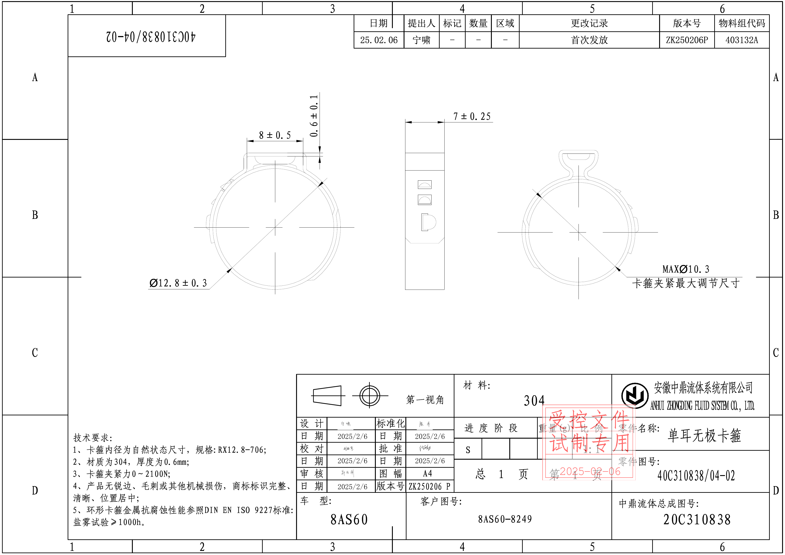
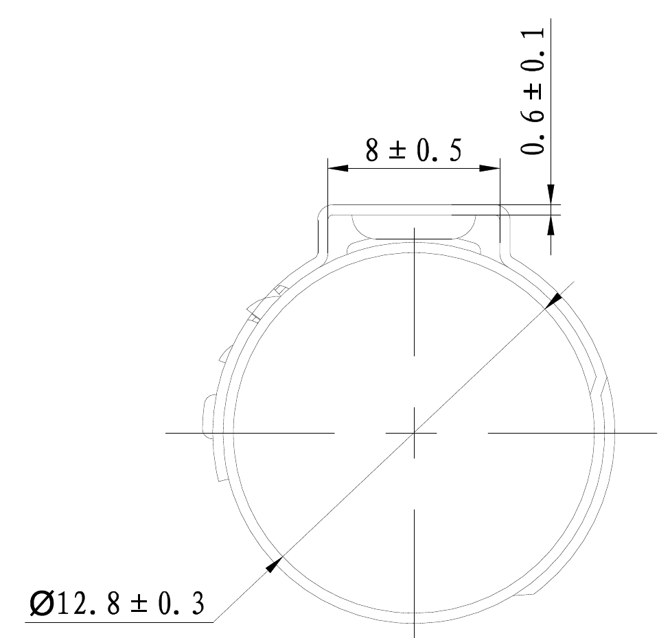
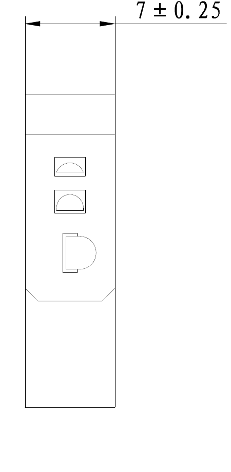
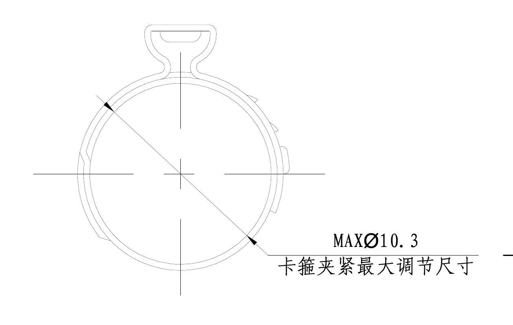
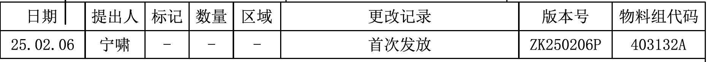
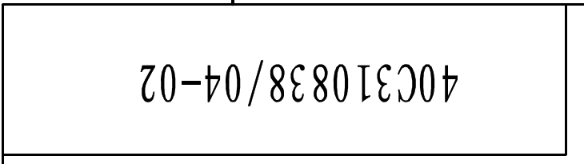
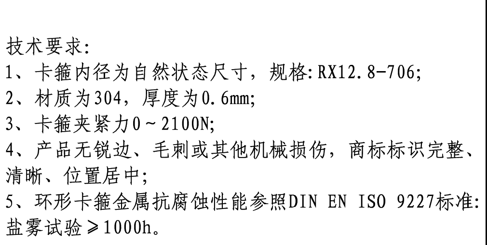
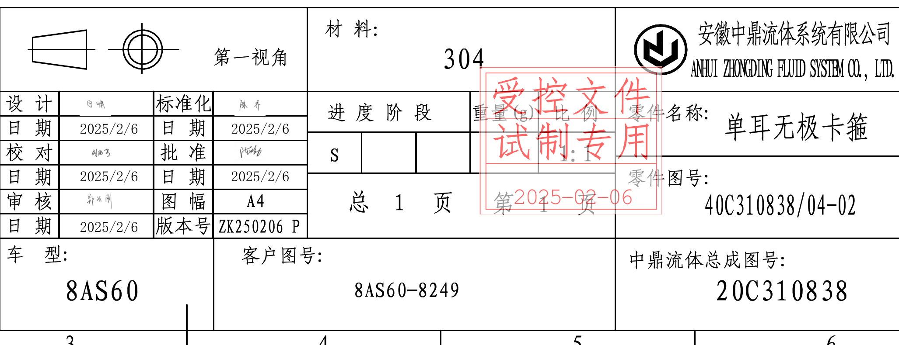

# 40C310838 04-02 内容识别

源文件：`input/40C310838 04-02.pdf`  
整页渲染图：`outputs/40C310838 04-02_assets/images/page_1.png`  
页面：1；整页 PNG 尺寸：3505 x 2480 px；对象 bbox 采用 `[x0, y0, x1, y1]` 像素坐标。

## 页面 1 整页结构

| 提取项 | 原图数值或文本 | 含义说明 |
|---|---|---|
| 加工视图 | 左侧圆形主视图、中间侧向视图、右侧最大调节尺寸视图 | 三个加工视图均位于图面中上部。 |
| 剖面视图 | 未见单独剖面视图 | 原图中没有标注剖切线、剖面名称或剖面阴影。 |
| 局部视图 | 未见单独局部视图 | 原图中没有局部放大框、局部视图编号或局部视图名称。 |
| 表格/文本区 | 顶部更改记录表、左上倒置图号框、左下技术要求、右下标题栏 | 分别裁切为 object_4、object_5、object_6、object_7。 |

边界归属说明：页面按图框内可见结构分区；尺寸标注根据完整尺寸线、箭头、文字位置和引出线落点归入对应视图。

## object_1：左侧圆形主视图

原图位置/视图名称：页面 1，图面左中部，左侧圆形主视图，bbox `[625, 385, 1585, 1315]`。

| 提取项 | 原图数值或文本 | 含义说明 |
|---|---|---|
| 顶部耳部宽度尺寸 | `8 ± 0.5` | 顶部耳部/凸台横向宽度尺寸，公差为 ±0.5。 |
| 顶部局部厚度尺寸 | `0.6 ± 0.1` | 顶部耳部附近竖向局部厚度/高度差尺寸，公差为 ±0.1。 |
| 圆形主体直径 | `Ø12.8 ± 0.3` | 圆形卡箍主体直径尺寸，带直径符号，公差为 ±0.3。 |
| 中心线 | 十字中心线、斜向中心/直径线 | 用于表达圆形主体中心和直径方向，不是加工尺寸值。 |
| 弧度/半径/角度 | 未见 R、弧长或角度数值 | 该视图只给出直径、宽度和局部厚度尺寸。 |
| 参考尺寸/关键尺寸/T 编号/基准字母 | 未见括号参考尺寸、星号关键尺寸、T 编号或基准字母 | 本裁切区域内未出现这些标注。 |

边界归属说明：`Ø12.8 ± 0.3` 的斜向尺寸线和箭头均落在左侧圆形主视图上；`8 ± 0.5`、`0.6 ± 0.1` 的尺寸线位于同一顶部耳部轮廓上，均归属本视图。裁切未包含中间侧向视图或右侧视图的尺寸内容。

## object_2：中间侧向视图

原图位置/视图名称：页面 1，图面中部，侧向/宽度视图，bbox `[1760, 500, 2210, 1420]`。

| 提取项 | 原图数值或文本 | 含义说明 |
|---|---|---|
| 侧向宽度尺寸 | `7 ± 0.25` | 侧向视图顶部横向尺寸，表示该侧向宽度/厚度方向尺寸，公差为 ±0.25。 |
| 内部窗口/扣合轮廓 | 三处内部开口轮廓 | 显示侧向结构形状；本视图未给出这些开口的独立尺寸数值。 |
| 弧度/半径/角度 | 未见 R、弧长或角度数值 | 该侧向视图只标注 `7 ± 0.25`。 |
| 参考尺寸/关键尺寸/T 编号/基准字母 | 未见括号参考尺寸、星号关键尺寸、T 编号或基准字母 | 本裁切区域内未出现这些标注。 |

边界归属说明：`7 ± 0.25` 的尺寸线和箭头完全位于中间侧向轮廓顶部，归属本视图；左右相邻圆形视图未进入裁切区域。

## object_3：右侧最大调节尺寸视图

原图位置/视图名称：页面 1，图面右中部，右侧最大调节尺寸视图，bbox `[2140, 610, 3400, 1410]`。

| 提取项 | 原图数值或文本 | 含义说明 |
|---|---|---|
| 最大调节直径 | `MAXØ10.3` | 卡箍夹紧后的最大调节尺寸，带最大值标识 `MAX` 和直径符号 `Ø`。 |
| 中文说明 | `卡箍夹紧最大调节尺寸` | 对 `MAXØ10.3` 的文字解释，说明该尺寸为夹紧状态的最大调节尺寸。 |
| 中心线 | 十字中心线、斜向尺寸线 | 表达圆形主体中心和最大调节直径方向。 |
| 弧度/半径/角度 | 未见 R、弧长或角度数值 | 该视图只给出最大直径调节尺寸。 |
| 参考尺寸/关键尺寸/T 编号/基准字母 | 未见括号参考尺寸、星号关键尺寸、T 编号或基准字母 | 本裁切区域内未出现这些标注。 |

边界归属说明：`MAXØ10.3` 的斜向尺寸线箭头落在右侧圆形视图外轮廓上，文字说明随同一引出线布置，归属本视图。裁切右缘包含少量图框线，不含其他加工视图内容。

## object_4：顶部更改记录表

原图位置/视图名称：页面 1，图面顶部右侧，更改记录表，bbox `[1580, 60, 3440, 225]`。

| 日期 | 提出人 | 标记 | 数量 | 区域 | 更改记录 | 版本号 | 物料组代码 |
|---|---|---|---|---|---|---|---|
| 25.02.06 | 宁啸 | - | - | - | 首次发放 | ZK250206P | 403132A |

| 提取项 | 原图数值或文本 | 含义说明 |
|---|---|---|
| 更改记录 | `首次发放` | 表示本版为首次发布。 |
| 版本号 | `ZK250206P` | 本次发布版本号。 |
| 物料组代码 | `403132A` | 物料组代码字段。 |

边界归属说明：本裁切只包含顶部更改记录表完整行列和表头，未包含下方加工视图。

## object_5：左上倒置图号框

原图位置/视图名称：页面 1，图面顶部左侧，倒置图号框，bbox `[300, 60, 1030, 265]`。

| 提取项 | 原图数值或文本 | 含义说明 |
|---|---|---|
| 倒置图号 | `40C310838/04-02` | 顶部左侧倒置显示的零件图号，与标题栏零件图号一致。 |

边界归属说明：裁切框沿该倒置图号矩形边框外侧取得，未带入顶部更改记录表或加工视图。

## object_6：左下技术要求 / NOTES

原图位置/视图名称：页面 1，图面左下部，技术要求/NOTES，bbox `[315, 1860, 1325, 2370]`。

| 序号 | 原图文本 |
|---|---|
| 标题 | 技术要求: |
| 1 | 卡箍内径为自然状态尺寸，规格: RX12.8-706; |
| 2 | 材质为304，厚度为0.6mm; |
| 3 | 卡箍夹紧力0~2100N; |
| 4 | 产品无锐边、毛刺或其他机械损伤，商标标识完整、清晰、位置居中; |
| 5 | 环形卡箍金属抗腐蚀性能参照DIN EN ISO 9227标准: 盐雾试验≥1000h。 |

| 提取项 | 原图数值或文本 | 含义说明 |
|---|---|---|
| 自然状态内径规格 | `RX12.8-706` | 技术要求中给出的卡箍规格。 |
| 材料 | `304` | 材质要求。 |
| 厚度 | `0.6mm` | 材料厚度要求。 |
| 夹紧力 | `0~2100N` | 卡箍夹紧力范围。 |
| 腐蚀性能标准 | `DIN EN ISO 9227` | 金属抗腐蚀性能参照标准。 |
| 盐雾试验 | `≥1000h` | 盐雾试验时间要求，不小于 1000 小时。 |

边界归属说明：本裁切只包含左下 NOTES 文本块；右侧标题栏和上方加工视图未进入裁切区域。

## object_7：右下标题栏、签审栏、材料栏

原图位置/视图名称：页面 1，图面右下部，标题栏/签审栏/材料栏，bbox `[1325, 1655, 3380, 2445]`。

### 标题栏主体表格

| 字段 | 原图数值或文本 |
|---|---|
| 投影视图 | 第一视角 |
| 材料 | 304 |
| 公司中文名 | 安徽中鼎流体系统有限公司 |
| 公司英文名 | ANHUI ZHONGDING FLUID SYSTEM CO., LTD. |
| 进度阶段 | S |
| 重量(g) | 空白 |
| 比例 | 空白 |
| 零件名称 | 单耳无极卡箍 |
| 零件图号 | 40C310838/04-02 |
| 总页数 | 总 1 页 |
| 车型 | 8AS60 |
| 客户图号 | 8AS60-8249 |
| 中鼎流体总成图号 | 20C310838 |

### 签审栏

| 左栏字段 | 左栏原图文本 | 右栏字段 | 右栏原图文本 |
|---|---|---|---|
| 设计 | 手写签名，可见为宁啸 | 标准化 | 手写签名，图面不清晰 |
| 日期 | 2025/2/6 | 日期 | 2025/2/6 |
| 校对 | 手写签名，图面不清晰 | 批准 | 手写签名，图面不清晰 |
| 日期 | 2025/2/6 | 日期 | 2025/2/6 |
| 审核 | 手写签名，图面不清晰 | 图幅 | A4 |
| 日期 | 2025/2/6 | 版本号 | ZK250206P |

### 红色受控章

| 提取项 | 原图数值或文本 | 含义说明 |
|---|---|---|
| 受控章文字 1 | 受控文件 | 表示该图纸为受控文件。 |
| 受控章文字 2 | 试制专用 | 表示用途为试制专用。 |
| 受控章日期 | 2025-02-06 | 红章内可见日期。 |

边界归属说明：本裁切沿标题栏左侧外框到右侧外框取得，包含标题栏、签审栏、材料栏、红色受控章和底部图框坐标数字；未带入左下 NOTES 文本。红章覆盖部分 `重量(g)`、`比例` 和签审区域，按可见内容转写，未将模糊手写签名扩展为确定姓名。

## 裁切检查记录

| 对象 | 图片路径 | 检查结论 |
|---|---|---|
| page_1 | `outputs/40C310838 04-02_assets/images/page_1.png` | 整页 PNG 完整，包含外图框、坐标格、全部视图、表格、NOTES 和标题栏。 |
| object_1 | `outputs/40C310838 04-02_assets/images/object_1.png` | 完整包含左侧圆形主视图、`8 ± 0.5`、`0.6 ± 0.1`、`Ø12.8 ± 0.3` 的文字、尺寸线和箭头；未混入其他视图。 |
| object_2 | `outputs/40C310838 04-02_assets/images/object_2.png` | 完整包含中间侧向视图和 `7 ± 0.25` 的文字、尺寸线和箭头；未混入其他视图。 |
| object_3 | `outputs/40C310838 04-02_assets/images/object_3.png` | 首版裁切右侧中文说明被截断，已重裁；当前版本完整包含 `MAXØ10.3`、中文说明、尺寸线和箭头，右缘仅含少量图框线。 |
| object_4 | `outputs/40C310838 04-02_assets/images/object_4.png` | 完整包含顶部更改记录表表头和一行记录；未带入下方加工视图。 |
| object_5 | `outputs/40C310838 04-02_assets/images/object_5.png` | 完整包含倒置图号框和图号文本；未带入相邻表格。 |
| object_6 | `outputs/40C310838 04-02_assets/images/object_6.png` | 完整包含技术要求标题和 1-5 条文本；未带入标题栏内容。 |
| object_7 | `outputs/40C310838 04-02_assets/images/object_7.png` | 初版裁切左缘带入 NOTES 边界残片，已重裁；当前版本完整包含标题栏主要表格、签审栏、材料栏、红章和底部图框线，未带入 NOTES 文本。 |
