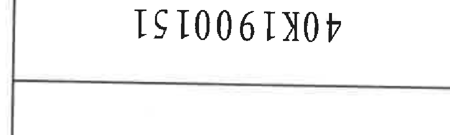
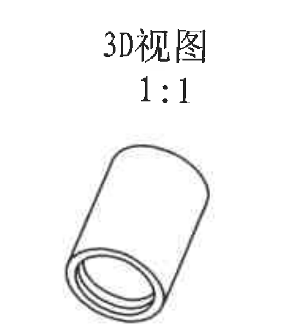
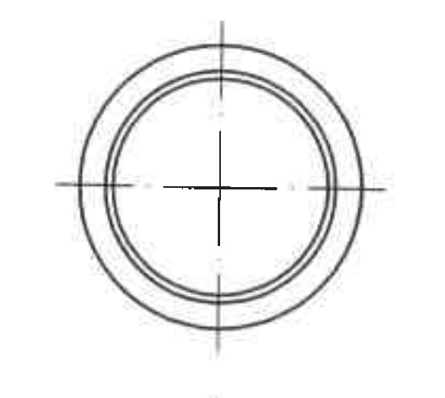
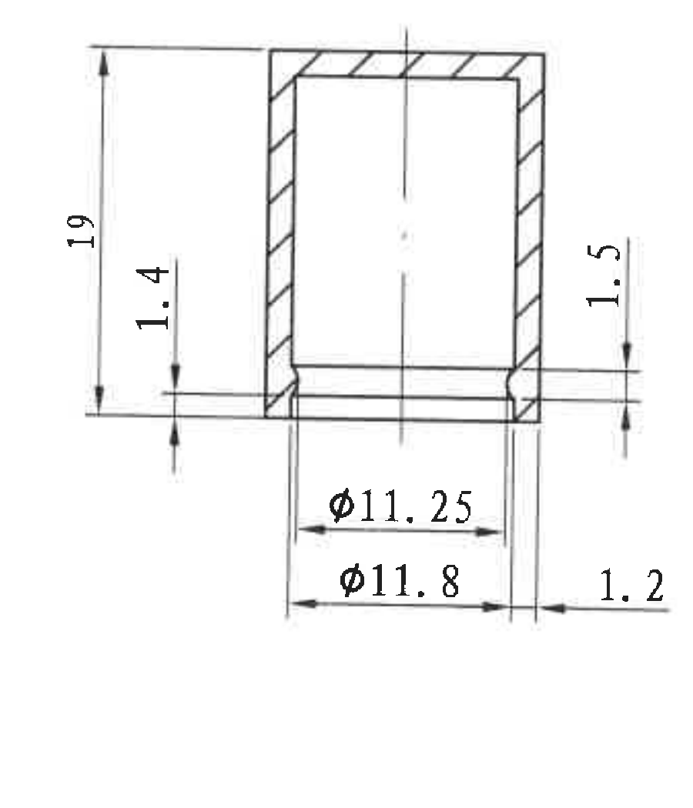
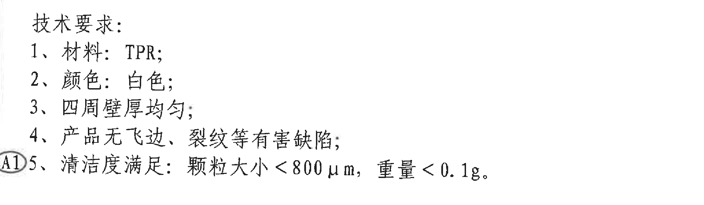
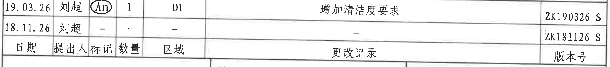
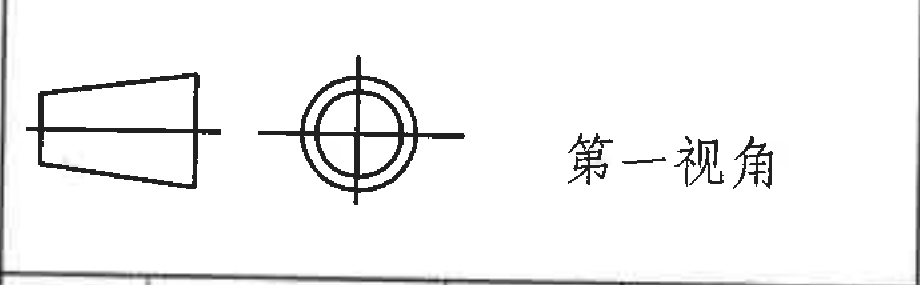
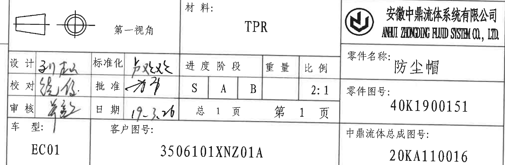

# 40K1900151 内容识别与裁切提取

整页渲染图：`outputs/40K1900151_assets/images/page_1.png`  
页面：1；整页 PNG 尺寸：3306 x 4673 px；原 PDF 为 A4 单页扫描图。

## object_8：顶部倒置零件图号框

原图位置/视图名称：第 1 页上方偏左，独立矩形图号框，文字为倒置方向。

| 提取项 | 原图数值或文本 | 含义说明 |
|---|---|---|
| 图号 | 40K1900151 | 与标题栏“零件图号”一致；此处为顶部重复标识。 |
| 方向 | 倒置显示 | 原扫描图中该框文字方向与主标题栏相反。 |

边界归属说明：裁切范围只保留该矩形图号框及其内部文字，排除了上方图框坐标数字和周边空白区。

## object_3：3D 视图

原图位置/视图名称：第 1 页右上区域，标注“3D视图 1:1”。

| 提取项 | 原图数值或文本 | 含义说明 |
|---|---|---|
| 视图名称 | 3D视图 | 零件轴测外观视图。 |
| 比例 | 1:1 | 该 3D 视图按 1:1 标注。 |
| 外观特征 | 圆筒状薄壁帽，开口端可见内外圆环 | 该视图只表达外观与开口环形结构；未单独标注尺寸、角度、弧度或公差。 |
| 参考尺寸 | 无括号参考尺寸 | 此对象内未出现括号尺寸。 |
| 关键尺寸/T 编号/基准 | 无星号尺寸、无 T 编号、无基准字母标注 | 该对象内没有相关标注。 |

边界归属说明：裁切只包含“3D视图 1:1”和完整轴测图，未带入右侧图框坐标栏或中部加工视图尺寸。

## object_1：端面视图

原图位置/视图名称：第 1 页中部上方，主剖面视图正上方的端面圆视图。

| 提取项 | 原图数值或文本 | 含义说明 |
|---|---|---|
| 几何特征 | 同心圆环、中心线十字 | 表示防尘帽端面/开口方向的圆环结构及中心轴线。 |
| 尺寸文字 | 无独立尺寸文字 | 此端面视图未直接标注数值；相关直径由下方主剖面视图中的 `Φ11.25` 和 `Φ11.8` 表达。 |
| 角度/弧度/弧向尺寸 | 无 | 图中有圆弧轮廓，但没有 R、角度或弧长类标注。 |
| 参考尺寸 | 无括号参考尺寸 | 该对象内未出现括号尺寸。 |
| 关键尺寸/T 编号/基准 | 无星号尺寸、无 T 编号、无基准字母标注 | 该对象内没有相关标注。 |

边界归属说明：裁切范围保留端面完整圆环和中心线；已排除下方主剖面视图顶部边线，端面视图内不提取主剖面尺寸。

## object_2：主剖面加工视图

原图位置/视图名称：第 1 页中部，带剖面线的主要加工/剖面视图。

| 提取项 | 原图数值或文本 | 含义说明 |
|---|---|---|
| 总高度 | 19 | 左侧竖向尺寸，从上端面到下方口部基准线的整体高度。 |
| 局部台阶高度 | 1.4 | 左侧口部附近的局部竖向尺寸，表示下端台阶/唇边相关高度。 |
| 局部台阶高度 | 1.5 | 右侧口部附近的局部竖向尺寸，表示另一侧口部台阶/唇边相关高度。 |
| 直径尺寸 | Φ11.25 | 下方较小直径标注，表示开口内侧/内圆相关直径。 |
| 直径尺寸 | Φ11.8 | 下方较大直径标注，表示开口外侧/外圆相关直径。 |
| 横向局部尺寸 | 1.2 | 下端右侧横向台阶/边缘宽度尺寸。 |
| 剖面线 | 斜线剖面 | 表示零件壁厚区域被剖切显示。 |
| 中心线 | 竖向中心线 | 表示圆筒轴线，和端面视图中心一致。 |
| 公差 | 未标注 | 该视图中尺寸后未出现正负偏差或公差框。 |
| 参考尺寸 | 无括号参考尺寸 | 该对象内未出现括号尺寸；不存在可忽略的参考尺寸。 |
| 角度/弧度/弧向尺寸 | 无 | 该对象内未出现角度、R、弧长或弧向标注。 |
| 关键尺寸/T 编号/基准 | 无星号尺寸、无 T 编号、无基准字母标注 | 该对象内没有相关标注。 |

边界归属说明：裁切包含主剖面外形、剖面线、中心线、全部尺寸线、箭头和尺寸文字。上方端面视图未混入本对象；底部 `Φ11.25`、`Φ11.8`、右侧 `1.2` 的尺寸线与箭头完整保留，均归属于主剖面视图。

## object_4：技术要求 / NOTES

原图位置/视图名称：第 1 页左下区域，标题为“技术要求”。

| 提取项 | 原图数值或文本 | 含义说明 |
|---|---|---|
| 标题 | 技术要求: | 技术要求列表标题。 |
| 1 | 材料：TPR; | 零件材料要求为 TPR。 |
| 2 | 颜色：白色; | 零件颜色要求为白色。 |
| 3 | 四周壁厚均匀; | 防尘帽周向壁厚需均匀。 |
| 4 | 产品无飞边、裂纹等有害缺陷; | 外观/质量要求，不允许飞边、裂纹等有害缺陷。 |
| A1 标记 | A1 | 第 5 条旁的圈注变更标记，和变更记录中的清洁度要求对应。 |
| 5 | 清洁度满足：颗粒大小＜800 μm，重量＜0.1g。 | 清洁度要求：颗粒尺寸小于 800 μm，重量小于 0.1 g。 |

边界归属说明：裁切完整包含标题、1 至 5 条技术要求、左侧 A1 圈注和第 5 条末尾 `0.1g`；未带入变更记录表或标题栏内容。

## object_5：更改记录表

原图位置/视图名称：第 1 页下方，标题栏上方的更改记录表。

原表行列还原：

| 日期 | 提出人 | 标记 | 数量 | 区域 | 更改记录 | 版本号 |
|---|---|---|---|---|---|---|
| 19.03.26 | 刘超 | A1（圈注，扫描中形似 An） | 1 | D1 | 增加清洁度要求 | ZK190326 S |
| 18.11.26 | 刘超 | - | - | - | - | ZK181126 S |

| 提取项 | 原图数值或文本 | 含义说明 |
|---|---|---|
| 表头 | 日期、提出人、标记、数量、区域、更改记录、版本号 | 更改记录表的列名。 |
| 第一条更改 | 19.03.26 / 刘超 / A1 / 1 / D1 / 增加清洁度要求 / ZK190326 S | 对应技术要求第 5 条的 A1 圈注，说明 2019-03-26 增加清洁度要求。 |
| 第二条记录 | 18.11.26 / 刘超 / - / - / - / - / ZK181126 S | 原始或前一版本记录，未列具体更改内容。 |

边界归属说明：裁切只包含更改记录表的两条记录、表头、版本号列和表格边框；底部标题栏“材料”等内容已排除。

## object_6：第一视角投影符号表格

原图位置/视图名称：第 1 页底部标题栏左上块，第一视角投影符号。

原表区域还原：

| 投影符号 | 标注文字 |
|---|---|
| 圆台侧视符号 + 同心圆端视符号 | 第一视角 |

| 提取项 | 原图数值或文本 | 含义说明 |
|---|---|---|
| 投影法 | 第一视角 | 图纸采用第一角投影法。 |
| 符号 | 圆台侧视符号、同心圆端视符号 | 第一视角投影法图示。 |

边界归属说明：裁切只保留第一视角表格块的符号和文字；未包含下方签核栏手写文字。

## object_7：标题栏

原图位置/视图名称：第 1 页底部标题栏区域。

标题栏字段还原：

| 区域 | 字段 | 原图文本 |
|---|---|---|
| 投影法 | 第一视角 | 第一视角 |
| 材料区 | 材料 | TPR |
| 公司区 | 公司中文名 | 安徽中鼎流体系统有限公司 |
| 公司区 | 公司英文名 | ANHUI ZHONGDING FLUID SYSTEM CO., LTD. |
| 签核区 | 设计 | 手写签名，无法可靠辨认 |
| 签核区 | 校对 | 手写签名，无法可靠辨认 |
| 签核区 | 审核 | 手写签名，无法可靠辨认 |
| 签核区 | 标准化 | 手写签名，无法可靠辨认 |
| 签核区 | 批准 | 手写签名，无法可靠辨认 |
| 签核区 | 日期 | 19.3.20（手写） |
| 阶段/重量/比例区 | 进度阶段 | S / A / B |
| 阶段/重量/比例区 | 重量 | 空白 |
| 阶段/重量/比例区 | 比例 | 2:1 |
| 页码区 | 总页数 | 总 1 页 |
| 页码区 | 当前页 | 第 1 页 |
| 零件信息区 | 零件名称 | 防尘帽 |
| 零件信息区 | 零件图号 | 40K1900151 |
| 零件信息区 | 中鼎流体总成图号 | 20KA110016 |
| 车型/客户区 | 车型 | EC01 |
| 车型/客户区 | 客户图号 | 3506101XNZ01A |

| 提取项 | 原图数值或文本 | 含义说明 |
|---|---|---|
| 零件名称 | 防尘帽 | 本图零件名称。 |
| 零件图号 | 40K1900151 | 本图零件编号，与顶部倒置图号框一致。 |
| 材料 | TPR | 与技术要求第 1 条一致。 |
| 比例 | 2:1 | 标题栏总图比例；不同于 3D 视图单独标注的 1:1。 |
| 客户图号 | 3506101XNZ01A | 客户侧图号。 |
| 总成图号 | 20KA110016 | 中鼎流体总成图号。 |

边界归属说明：裁切覆盖底部标题栏及其内部字段。该对象包含标题栏内的第一视角块；object_6 对同一块做了单独裁切以便独立还原投影符号。裁切已排除右侧外部图框坐标字母和底部图框坐标数字。

## 裁切检查记录

| 对象 | 图片路径 | 检查结果 |
|---|---|---|
| object_8 | outputs/40K1900151_assets/images/object_8.png | 完整包含顶部倒置图号框和文字；未带入上方坐标数字。 |
| object_3 | outputs/40K1900151_assets/images/object_3.png | 完整包含“3D视图 1:1”和轴测图；未带入右侧图框线或坐标栏。 |
| object_1 | outputs/40K1900151_assets/images/object_1.png | 完整包含端面圆环和中心线；未带入下方主剖面片段。 |
| object_2 | outputs/40K1900151_assets/images/object_2.png | 完整包含主剖面外形、剖线、中心线、全部尺寸线、箭头和文字；未发现边缘文字裁断。 |
| object_4 | outputs/40K1900151_assets/images/object_4.png | 完整包含技术要求标题、1-5 条、A1 标记和第 5 条末尾；未带入表格内容。 |
| object_5 | outputs/40K1900151_assets/images/object_5.png | 完整包含更改记录表表头、两条记录和右侧版本号；底部标题栏内容已排除。 |
| object_6 | outputs/40K1900151_assets/images/object_6.png | 完整包含第一视角投影符号和文字；未带入下方签核表格。 |
| object_7 | outputs/40K1900151_assets/images/object_7.png | 完整包含标题栏字段、公司名、图号、客户图号、总成图号和页码；右侧外部坐标字母与底部坐标数字已排除。 |

