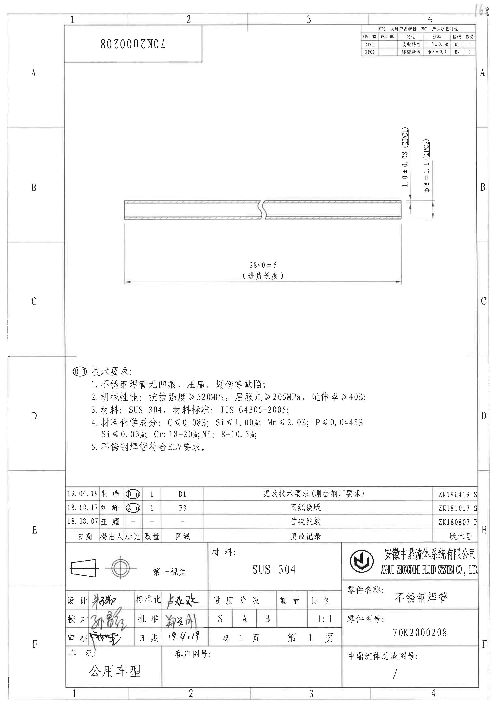
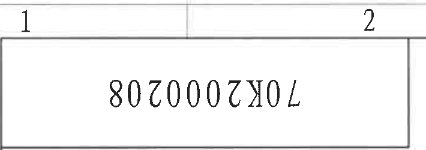
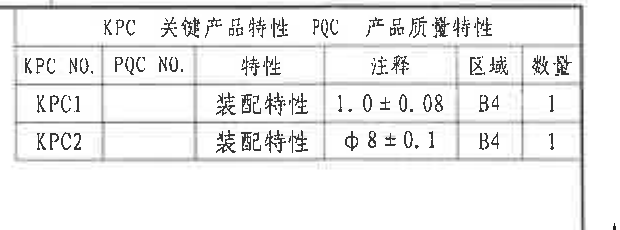
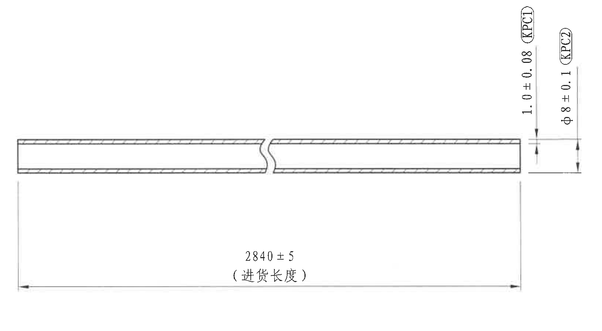
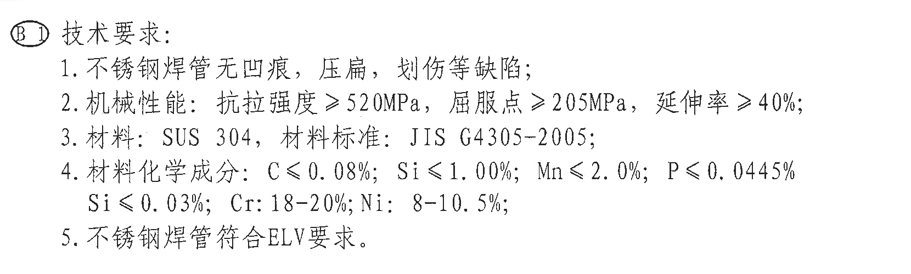
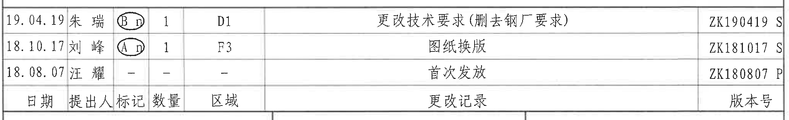
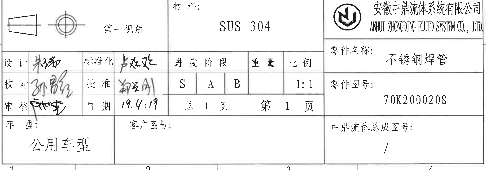

# 70K2000208 内容识别结果

整页渲染图：

 
页面尺寸：2480 x 3505 px；页码：1。

## object_6：顶部图号栏

原图位置/视图名称：页 1，上方 1-2 栅格附近，bbox `[315, 60, 1025, 310]`。  
对象类型：title_block。

| 提取项 | 原图数值或文本 | 含义说明 |
|---|---|---|
| 顶部图号 | 70K2000208 | 顶部矩形框内倒置显示的零件图号/文件号。 |

边界归属说明：该裁切只包含顶部独立矩形图号栏和相邻图框坐标线；不属于主加工视图、KPC 表、NOTES 或底部标题栏。

## object_2：KPC/PQC 关键产品特性表

原图位置/视图名称：页 1，右上角 B4 区域，bbox `[1765, 115, 2385, 345]`。  
对象类型：table。

| KPC NO. | PQC NO. | 特性 | 注释 | 区域 | 数量 |
|---|---|---|---|---|---|
| KPC1 |  | 装配特性 | 1.0 ± 0.08 | B4 | 1 |
| KPC2 |  | 装配特性 | Φ8 ± 0.1 | B4 | 1 |

| 提取项 | 原图数值或文本 | 含义说明 |
|---|---|---|
| 表题 | KPC 关键产品特性 / PQC 产品质量特性 | 关键产品特性和产品质量特性汇总表。 |
| KPC1 注释 | 1.0 ± 0.08 | 与主视图右侧壁厚尺寸一致；位于 B4 区域，数量 1。 |
| KPC2 注释 | Φ8 ± 0.1 | 与主视图右侧直径尺寸一致；位于 B4 区域，数量 1。 |

边界归属说明：表格位于主视图上方右侧的独立表格框内；KPC1/KPC2 的尺寸值同时在主加工视图右侧出现，表格本身不包含尺寸线，只记录关键特性索引。裁切包含完整表头、两条记录和外框，未混入主视图。

## object_1：主加工视图（不锈钢焊管）

原图位置/视图名称：页 1，中部 B-C 区域主加工视图，bbox `[565, 610, 2200, 1510]`。  
对象类型：view。

| 提取项 | 原图数值或文本 | 含义说明 |
|---|---|---|
| 零件形态 | 长直管，中部断裂线表示省略长度 | 不锈钢焊管的主视图/加工示意，断裂线表示长管中间段被省略显示。 |
| 总长度/进货长度 | 2840 ± 5（进货长度） | 两端竖向投影线之间的水平总长尺寸；“进货长度”为括号内说明文字，表示该长度用于来料/进货状态控制。 |
| 壁厚关键尺寸 | 1.0 ± 0.08（KPC1） | 右端竖向尺寸线标注，控制管壁厚度；KPC1 表示关键产品特性编号，与右上 KPC 表一致。 |
| 直径关键尺寸 | Φ8 ± 0.1（KPC2） | 右端竖向尺寸线标注，Φ 表示直径；控制管外径/管径尺寸，KPC2 与右上 KPC 表一致。 |
| 公差 | ±5、±0.08、±0.1 | 分别对应进货长度、壁厚和直径尺寸的允许偏差。 |
| 括号内容 | （进货长度）、（KPC1）、（KPC2） | “进货长度”为尺寸用途说明；KPC1/KPC2 是关键产品特性编号说明，均为当前视图尺寸标注的一部分。 |
| 弧度/半径/弧向尺寸 | 未见 | 当前主加工视图未标注 R、弧长或弧向尺寸。 |
| 角度 | 未见 | 当前主加工视图未标注角度尺寸。 |
| 基准字母 | 未见 | 当前视图没有基准符号；图框 A-F 字母仅为图纸区域索引，不是基准。 |
| T 编号 | 未见 | 当前视图未出现 T 编号。 |

边界归属说明：裁切完整包含管件图形、右侧 KPC1/KPC2 尺寸线和文字、下方 2840 ± 5 尺寸线和箭头。右上 KPC 表未纳入本裁切；下方 NOTES 未纳入本裁切。右侧两个竖向尺寸按箭头、延长线和标注位置归属主加工视图，不归入 KPC 表。

## object_3：技术要求 / NOTES

原图位置/视图名称：页 1，下中部 D 区域，bbox `[340, 1770, 2000, 2270]`。  
对象类型：notes。

| 提取项 | 原图数值或文本 | 含义说明 |
|---|---|---|
| 标题 | 技术要求 | 图纸 NOTES 区域标题。 |
| 变更标记 | B 1 | 标题左侧圈注，表示该技术要求区域关联 B 版/第 1 项变更标记。 |
| 1 | 不锈钢焊管无凹痕，压扁，划伤等缺陷； | 外观质量要求。 |
| 2 | 机械性能：抗拉强度 ≥ 520MPa，屈服点 ≥ 205MPa，延伸率 ≥ 40%； | 力学性能要求。 |
| 3 | 材料：SUS 304，材料标准：JIS G4305-2005； | 材料牌号和材料标准。 |
| 4 | 材料化学成分：C ≤ 0.08%；Si ≤ 1.00%；Mn ≤ 2.0%；P ≤ 0.0445%；Si ≤ 0.03%；Cr: 18-20%；Ni: 8-10.5%； | 化学成分限值。原图第 4 条第二行开头仍写 Si ≤ 0.03%，按原图还原。 |
| 5 | 不锈钢焊管符合 ELV 要求。 | 环保/法规符合性要求。 |

边界归属说明：该裁切只包含技术要求文字块，未包含主视图尺寸线和底部修订履历表。标题左侧圈注 B 1 属于 NOTES 标题区域。

## object_4：修订履历表

原图位置/视图名称：页 1，底部标题栏上方 E 区域，bbox `[315, 2380, 2370, 2695]`。  
对象类型：table。

| 日期 | 提出人 | 标记 | 数量 | 区域 | 更改记录 | 版本号 |
|---|---|---|---|---|---|---|
| 19.04.19 | 朱瑞 | B n | 1 | D1 | 更改技术要求（删除钢厂要求） | ZK190419 S |
| 18.10.17 | 刘峰 | A n | 1 | F3 | 图纸换版 | ZK181017 S |
| 18.08.07 | 汪耀 | - | - | - | 首次发放 | ZK180807 P |

| 提取项 | 原图数值或文本 | 含义说明 |
|---|---|---|
| 表头 | 日期、提出人、标记、数量、区域、更改记录、版本号 | 修订履历列名。 |
| B 版记录 | 19.04.19 / 朱瑞 / B n / 1 / D1 / 更改技术要求（删除钢厂要求） / ZK190419 S | 最新可见修订记录，区域 D1；右侧版本号列末尾字母可见为 S。 |
| A 版记录 | 18.10.17 / 刘峰 / A n / 1 / F3 / 图纸换版 / ZK181017 S | 图纸换版记录，区域 F3；右侧版本号列末尾字母可见为 S。 |
| 首发记录 | 18.08.07 / 汪耀 / - / - / - / 首次发放 / ZK180807 P | 初次发放记录；右侧版本号列末尾字母可见为 P。 |

边界归属说明：该裁切覆盖修订履历表的完整可见行列和表头；右侧版本号栏到图框内边界为止，原扫描中版本号末尾字母位于边缘但仍可见。下方标题栏内容没有纳入本对象。

## object_5：底部标题栏

原图位置/视图名称：页 1，底部 E-F 区域，bbox `[315, 2695, 2370, 3415]`。  
对象类型：title_block。

| 提取项 | 原图数值或文本 | 含义说明 |
|---|---|---|
| 投影法 | 第一视角 | 标题栏左上投影视图符号及文字。 |
| 材料 | SUS 304 | 零件材料。 |
| 公司中文名 | 安徽中鼎流体系统有限公司 | 出图单位/公司名称。 |
| 公司英文名 | ANHUI ZHONGDING FLUID SYSTEM CO., LTD. | 出图单位英文名称。 |
| 零件名称 | 不锈钢焊管 | 零件名称。 |
| 零件图号 | 70K2000208 | 零件图号。 |
| 中鼎流体总成图号 | / | 总成图号为空，以斜杠表示无/不适用。 |
| 车型 | 公用车型 | 适用车型。 |
| 客户图号 | 空白 | 原图该栏未填写。 |
| 进度阶段 | S / A / B | 阶段栏分为 S、A、B 三格。 |
| 比例 | 1:1 | 绘图比例。 |
| 页码 | 总 1 页，第 1 页 | 图纸页数信息。 |
| 设计 | 手写签名，扫描件难以可靠辨识 | 原图有手写签名。 |
| 校对 | 手写签名，扫描件难以可靠辨识 | 原图有手写签名。 |
| 审核 | 手写签名，扫描件难以可靠辨识 | 原图有手写签名。 |
| 标准化 | 手写签名，扫描件难以可靠辨识 | 原图有手写签名。 |
| 批准 | 手写签名，扫描件难以可靠辨识 | 原图有手写签名。 |
| 日期 | 19.4.19 | 标题栏日期。 |
| 重量 | 空白 | 原图该栏未填写。 |

边界归属说明：该裁切从修订履历表下边界开始，包含底部标题栏所有可见字段。上边缘仅保留标题栏顶边框，不提取修订履历内容到本对象。

## 剖面视图、局部视图、弧度尺寸检查

| 类别 | 检查结果 | 说明 |
|---|---|---|
| 独立剖面视图 | 未见 | 图中没有 A-A、B-B 等剖面名称或独立剖面视图框。 |
| 局部视图/放大视图 | 未见 | 图中没有局部放大边界或 DETAIL 标识。 |
| 弧度/半径/弧向尺寸 | 未见 | 未发现 R、SR、弧长或弧向尺寸标注。 |
| 角度尺寸 | 未见 | 未发现角度标注。 |
| 基准字母 | 未见 | 未发现基准框或基准三角符号；边框 A-F、1-4 是图纸分区。 |
| T 编号 | 未见 | 未发现 T 编号。 |

## 裁切检查记录

| 对象 | 图片路径 | 检查结果 | 边界与完整性说明 |
|---|---|---|---|
| object_6 | outputs/70K2000208_assets/images/object_6.png | 通过 | 完整包含顶部矩形图号栏和倒置图号文字；不提取相邻 KPC 表或主视图内容。 |
| object_2 | outputs/70K2000208_assets/images/object_2.png | 通过 | 重裁后完整包含 KPC 表头、KPC1/KPC2 两行、外框和列线；未混入主视图尺寸线。 |
| object_1 | outputs/70K2000208_assets/images/object_1.png | 通过 | 完整包含管件、断裂线、2840 ± 5 水平尺寸线、右侧 1.0 ± 0.08 和 Φ8 ± 0.1 竖向尺寸线及文字；未混入 KPC 表和 NOTES。 |
| object_3 | outputs/70K2000208_assets/images/object_3.png | 通过 | 完整包含“技术要求”标题、圈注 B 1 和 1-5 条文字；未混入主视图尺寸或修订表。 |
| object_4 | outputs/70K2000208_assets/images/object_4.png | 通过 | 重裁后完整包含修订履历表的可见表头和三条记录；版本号栏右侧字符受原扫描边缘影响但可见。 |
| object_5 | outputs/70K2000208_assets/images/object_5.png | 通过 | 完整包含底部标题栏字段；顶部只含标题栏边界线，不将修订履历记录归入本对象。 |
