# T29-PHEV 20C610876 内容识别

源文件：`input/T29-PHEV 20C610876.pdf`

整页渲染图：`T29-PHEV 20C610876_assets/images/page_1.png`

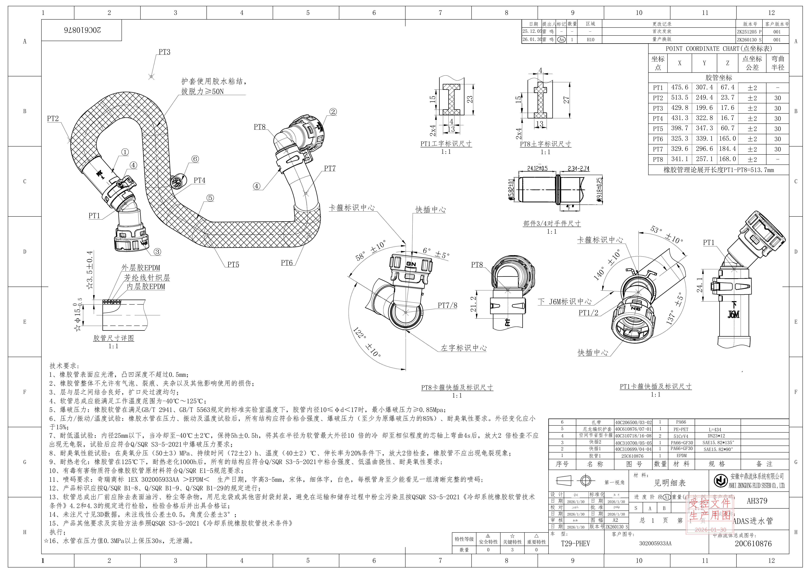

## object_1 - 主装配视图

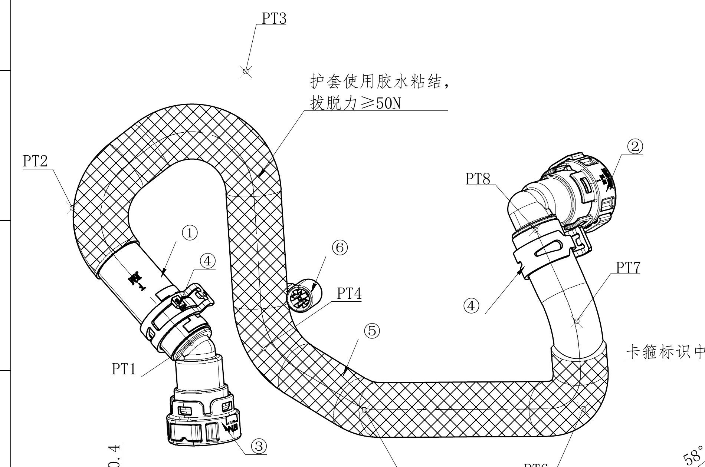

原图位置/视图名称：第 1 页左上至中部，主装配视图，约网格 A-C/1-6。bbox `[210, 250, 2110, 1510]`。

| 提取项 | 原图数值或文本 | 含义说明 |
|---|---|---|
| 产品总成图号 | 20C610876 | 图纸左上角总成编号，与标题栏中鼎流体总成图号一致。 |
| 点位标识 | PT1、PT2、PT3、PT4、PT5、PT6、PT7、PT8 | 胶管空间点位编号；各点的坐标和弯曲半径见点坐标表 object_9。 |
| 零件序号标注 | ①、②、③、④、⑤、⑥ | 对应明细表中的序号 1-6，标注装配件组成位置。 |
| 护套粘结说明 | 护套使用胶水粘结，拔脱力≥50N | 指向护套区域，要求护套胶水粘结并达到不小于 50N 的拔脱力。 |
| PT1 位置 | PT1 | 左下快插/胶管连接位置点。 |
| PT2 位置 | PT2 | 左侧弯管上端点位。 |
| PT3 位置 | PT3 | 上方弯曲最高附近点位。 |
| PT4 位置 | PT4 | 中部弯管外侧点位。 |
| PT5 位置 | PT5 | 下方横向胶管中段点位。 |
| PT6 位置 | PT6 | 下方横向胶管右端弯曲附近点位。 |
| PT7 位置 | PT7 | 右侧竖向弯管点位。 |
| PT8 位置 | PT8 | 右上快插/卡箍连接附近点位。 |
| ① | 胶管1 | 主体橡胶胶管，材料和图号见明细表 object_11。 |
| ② | 快插1 | 右上快插类零件，对应明细表序号 2 或装配方向处快插标注。 |
| ③ | 快插2 | 左下快插类零件，对应明细表序号 3。 |
| ④ | 空间节省型卡箍 | 卡箍件，两处出现，明细表数量为 2。 |
| ⑤ | 尼龙编织护套 | 胶管外侧编织护套，明细表规格 L=434。 |
| ⑥ | 扎带 | 束缚/固定护套或管路的扎带。 |

边界归属说明：该裁切对象只提取主装配视图中的 PT 点、零件序号和护套粘结说明。下缘邻近 object_2 胶管尺寸详图，裁切边界为保留 PT5/PT6 引线而接近下方区域；`☆3.5±0.4`、`☆φ15`、三层材料文字等属于 object_2，不归入主装配视图。

## object_2 - 胶管尺寸详图

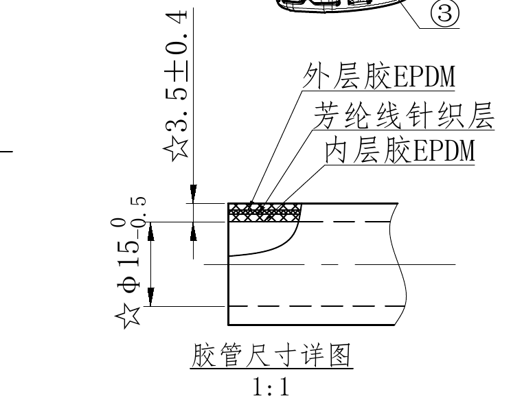

原图位置/视图名称：第 1 页左中下部，胶管尺寸详图，比例 1:1，约网格 D-E/1-3。bbox `[260, 1435, 1020, 2025]`。

| 提取项 | 原图数值或文本 | 含义说明 |
|---|---|---|
| 视图标题 | 胶管尺寸详图 | 局部剖切形式展示胶管壁厚、内径和层结构。 |
| 比例 | 1:1 | 该局部详图按 1:1 绘制。 |
| 关键尺寸 | ☆3.5±0.4 | 星号关键尺寸；表示胶管壁厚或局部层厚尺寸为 3.5，公差 ±0.4。 |
| 关键内径 | ☆φ15 +0/-0.5 | 星号关键尺寸；表示胶管内径直径 15，上偏差 0，下偏差 -0.5。 |
| 材料层 | 外层胶EPDM | 外层橡胶材料为 EPDM。 |
| 材料层 | 芳纶线针织层 | 中间增强层为芳纶线针织层。 |
| 材料层 | 内层胶EPDM | 内层橡胶材料为 EPDM。 |

边界归属说明：本对象只提取胶管尺寸详图内的尺寸、三层材料引线和标题。裁切上方可见主视图零件 ③ 的边缘片段，该片段属于 object_1，不在本对象提取范围。

## object_3 - PT1 工字标识尺寸

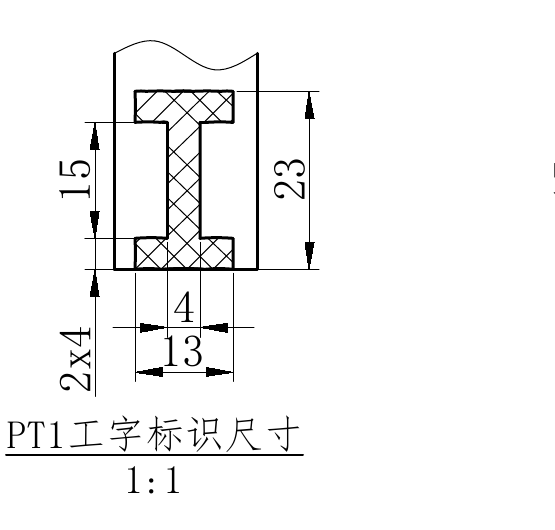

原图位置/视图名称：第 1 页上中部，PT1 工字标识尺寸，比例 1:1，约网格 B-C/6-7。bbox `[2420, 395, 2975, 925]`。

| 提取项 | 原图数值或文本 | 含义说明 |
|---|---|---|
| 视图标题 | PT1工字标识尺寸 | PT1 位置的工字形标识截面/局部尺寸。 |
| 比例 | 1:1 | 该标识局部图按 1:1 绘制。 |
| 总高度 | 23 | 右侧竖向尺寸，表示 PT1 工字标识整体高度。 |
| 中部高度 | 15 | 左侧竖向尺寸，表示标识中部或开口高度。 |
| 上/下局部数量尺寸 | 2x4 | 数量前缀尺寸，表示两处尺寸为 4 的局部特征。 |
| 中央宽度 | 4 | 中间窄部横向尺寸。 |
| 底部宽度 | 13 | 底部横向总宽度。 |

边界归属说明：裁切完整包含 PT1 工字标识的尺寸线、箭头和标题。该对象左侧和下方未提取其他视图内容。

## object_4 - PT8 土字标识尺寸

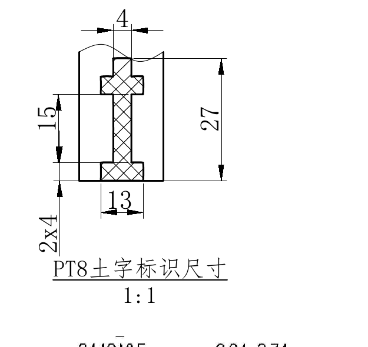

原图位置/视图名称：第 1 页上中部，PT8 土字标识尺寸，比例 1:1，约网格 B-C/7-8。bbox `[2910, 375, 3535, 965]`。

| 提取项 | 原图数值或文本 | 含义说明 |
|---|---|---|
| 视图标题 | PT8土字标识尺寸 | PT8 位置的土字形标识截面/局部尺寸。 |
| 比例 | 1:1 | 该标识局部图按 1:1 绘制。 |
| 总高度 | 27 | 右侧竖向尺寸，表示 PT8 土字标识整体高度。 |
| 中部高度 | 15 | 左侧竖向尺寸，表示标识中部或开口高度。 |
| 上/下局部数量尺寸 | 2x4 | 数量前缀尺寸，表示两处尺寸为 4 的局部特征。 |
| 上部宽度 | 4 | 顶部横向尺寸。 |
| 底部宽度 | 13 | 底部横向尺寸。 |

边界归属说明：重裁后完整包含左侧 `15`、`2x4`、右侧 `27`、顶部 `4`、底部 `13` 及标题。下缘有下方 object_5 的少量文字边缘，不提取为本对象内容。

## object_5 - 部件3/4对手件尺寸

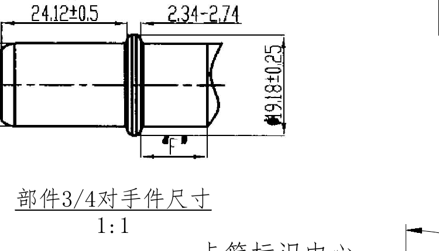

原图位置/视图名称：第 1 页中上部，部件3/4对手件尺寸，比例 1:1，约网格 C-D/7-9。bbox `[2990, 950, 3740, 1380]`。

| 提取项 | 原图数值或文本 | 含义说明 |
|---|---|---|
| 视图标题 | 部件3/4对手件尺寸 | 表示序号 3/4 对应对手件接口尺寸。 |
| 比例 | 1:1 | 该对手件局部图按 1:1 绘制。 |
| 左段长度 | 24.12±0.5 | 左侧圆柱段轴向长度，公差 ±0.5。 |
| 右侧间距 | 2.34-2.74 | 右侧环后到端部区域的轴向尺寸范围。 |
| 直径尺寸 | φ19.18±0.25 | 右侧竖向直径尺寸，公差 ±0.25。 |
| 局部标识 | F | 下方局部距离/配合标识，标在环后区域。 |

边界归属说明：本对象只提取标题上方的对手件接口尺寸。裁切下缘可见相邻 PT1/PT8 标识视图的边缘文字，不归入本对象。

## object_6 - PT8 卡箍快插及标识尺寸

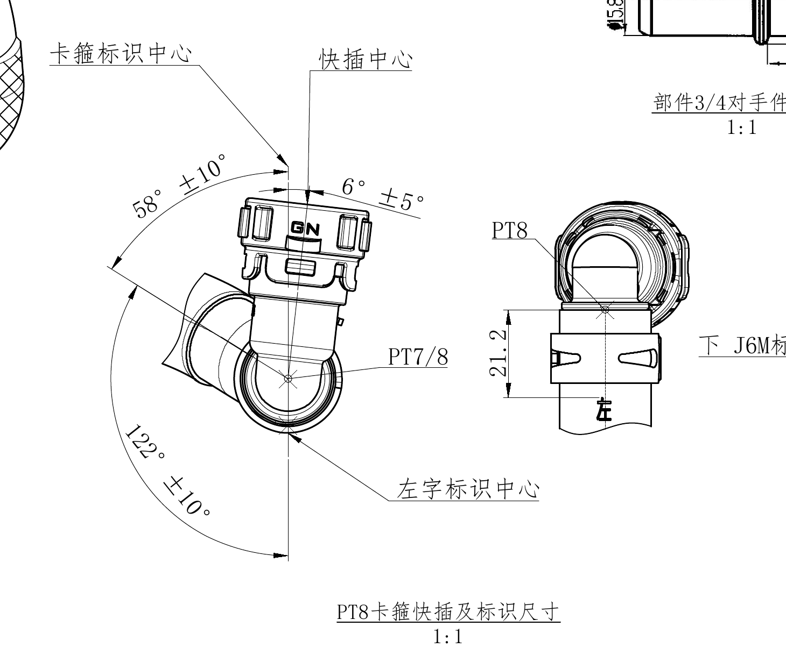

原图位置/视图名称：第 1 页中部偏右，PT8 卡箍快插及标识尺寸，比例 1:1，约网格 D-F/5-8。bbox `[1805, 1100, 3265, 2305]`。

| 提取项 | 原图数值或文本 | 含义说明 |
|---|---|---|
| 视图标题 | PT8卡箍快插及标识尺寸 | PT8 端卡箍、快插和标识方向的局部加工视图。 |
| 比例 | 1:1 | 该局部加工视图按 1:1 绘制。 |
| 角度 | 58°±10° | 左上弧向角度，基准为卡箍/快插中心方向，公差 ±10°。 |
| 角度 | 6°±5° | 顶部小角度尺寸，公差 ±5°。 |
| 角度 | 122°±10° | 左下弧向角度，公差 ±10°。 |
| 线性尺寸 | 21.2 | 右侧正视小图中的竖向线性尺寸。 |
| 点位标识 | PT7/8 | 标注 PT7/PT8 相关中心或连接位置。 |
| 点位标识 | PT8 | 右侧正视小图中 PT8 点位标识。 |
| 基准/中心 | 卡箍标识中心 | 用于角度定位的卡箍标识中心。 |
| 基准/中心 | 快插中心 | 快插中心线/中心点位置。 |
| 基准/中心 | 左字标识中心 | 左字标识的中心位置。 |

边界归属说明：该裁切完整包含 PT8 局部视图的 `58°±10°`、`6°±5°`、`122°±10°`、`21.2` 和中心标注。右边缘可见 `下 J6M标识中心` 的局部片段，该文字完整归属 object_7 的 PT1 视图，不在 object_6 提取。

## object_7 - PT1 卡箍快插及标识尺寸

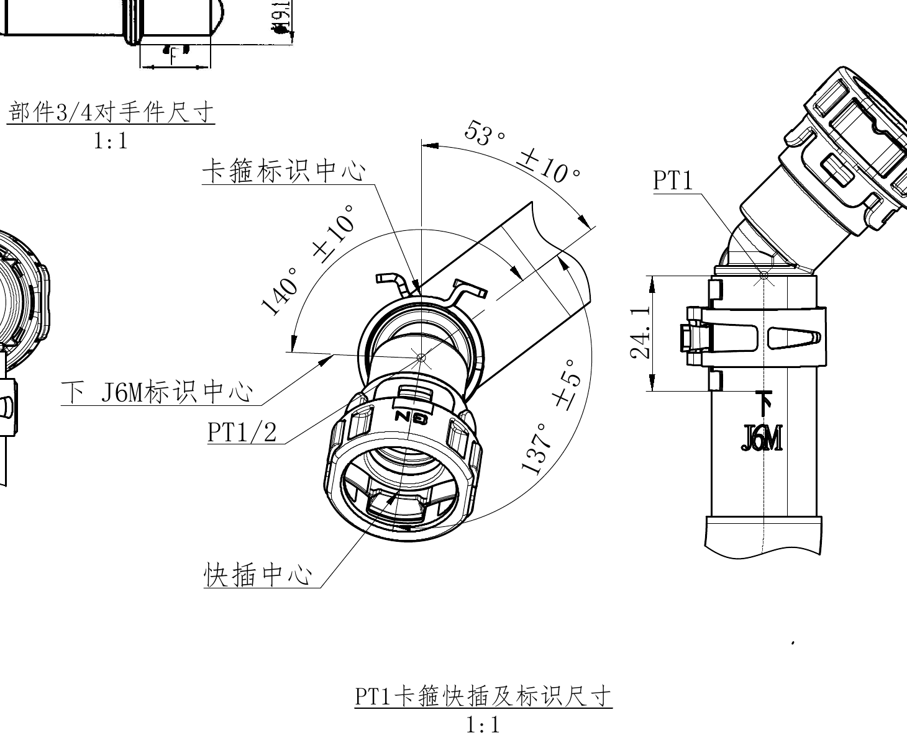

原图位置/视图名称：第 1 页中部偏右，PT1 卡箍快插及标识尺寸，比例 1:1，约网格 D-F/8-11。bbox `[3005, 1110, 4465, 2320]`。

| 提取项 | 原图数值或文本 | 含义说明 |
|---|---|---|
| 视图标题 | PT1卡箍快插及标识尺寸 | PT1 端卡箍、快插和标识方向的局部加工视图。 |
| 比例 | 1:1 | 该局部加工视图按 1:1 绘制。 |
| 角度 | 53°±10° | 上方弧向角度，公差 ±10°。 |
| 角度 | 140°±10° | 左侧弧向角度，公差 ±10°。 |
| 角度 | 137°±5° | 右下弧向角度，公差 ±5°。 |
| 线性尺寸 | 24.1 | 右侧侧视图中的竖向线性尺寸。 |
| 点位标识 | PT1 | 右侧侧视图 PT1 点位。 |
| 点位标识 | PT1/2 | 主局部视图中 PT1/PT2 相关中心位置。 |
| 基准/中心 | 卡箍标识中心 | 指向卡箍标识中心，用于角度定位。 |
| 基准/中心 | 下 J6M标识中心 | 指向下方 J6M 标识中心。 |
| 基准/中心 | 快插中心 | 指向快插中心位置。 |
| 标识文字 | J6M | 右侧侧视图管身标识文字。 |

边界归属说明：重裁后左侧 `下 J6M标识中心`、底部 `快插中心`、所有角度弧线和 `24.1` 尺寸均完整。左上角带入 object_5 的一小段对手件视图片段，不提取为 PT1 视图内容。

## object_8 - 修订履历表

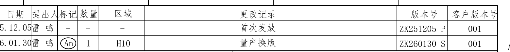

原图位置/视图名称：第 1 页右上角，修订履历表，约网格 A/8-12。bbox `[3030, 95, 4590, 255]`。

| 日期 | 提出人 | 标记 | 数量 | 区域 | 更改记录 | 版本号 | 客户版本号 |
|---|---|---|---|---|---|---|---|
| 25.12.05 | 雷 鸣 | - | - | - | 首次发放 | ZK251205 P | 001 |
| 26.01.30 | 雷 鸣 | An | 1 | H10 | 量产换版 | ZK260130 S | 001 |

| 提取项 | 原图数值或文本 | 含义说明 |
|---|---|---|
| 表格类型 | 修订履历表 | 记录图纸版本变更历史。 |
| 最新修订 | 26.01.30 / 量产换版 / ZK260130 S | 最新一行修订记录，对应标题栏版本号 ZK260130 S。 |
| 标记 | An | 第二行修订标记，原图中有圈注。 |
| 区域 | H10 | 第二行变更区域。 |

边界归属说明：裁切完整包含表头、两行修订记录和外框。右边缘邻近图框字母 A，不归入修订表字段。

## object_9 - POINT COORDINATE CHART 点坐标表

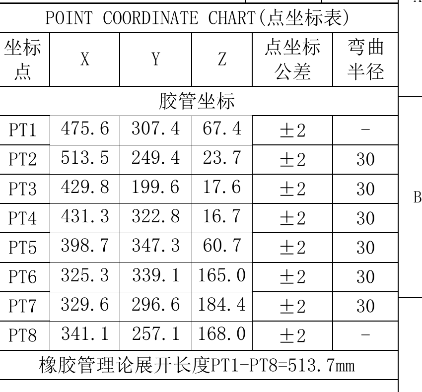

原图位置/视图名称：第 1 页右上部，POINT COORDINATE CHART(点坐标表)，约网格 A-C/10-12。bbox `[3750, 245, 4600, 1035]`。

| 坐标点 | X | Y | Z | 点坐标公差 | 弯曲半径 |
|---|---:|---:|---:|---|---|
| PT1 | 475.6 | 307.4 | 67.4 | ±2 | - |
| PT2 | 513.5 | 249.4 | 23.7 | ±2 | 30 |
| PT3 | 429.8 | 199.6 | 17.6 | ±2 | 30 |
| PT4 | 431.3 | 322.8 | 16.7 | ±2 | 30 |
| PT5 | 398.7 | 347.3 | 60.7 | ±2 | 30 |
| PT6 | 325.3 | 339.1 | 165.0 | ±2 | 30 |
| PT7 | 329.6 | 296.6 | 184.4 | ±2 | 30 |
| PT8 | 341.1 | 257.1 | 168.0 | ±2 | - |

| 提取项 | 原图数值或文本 | 含义说明 |
|---|---|---|
| 表题 | POINT COORDINATE CHART(点坐标表) | 定义 PT1-PT8 的胶管空间坐标、坐标公差和弯曲半径。 |
| 坐标类别 | 胶管坐标 | 表内 X/Y/Z 坐标用于胶管路径点。 |
| 坐标公差 | ±2 | 每个 PT 点坐标公差均为 ±2。 |
| PT1 弯曲半径 | - | PT1 未给弯曲半径。 |
| PT2-PT7 弯曲半径 | 30 | PT2 至 PT7 弯曲半径均为 30。 |
| PT8 弯曲半径 | - | PT8 未给弯曲半径。 |
| 理论展开长度 | 橡胶管理论展开长度PT1-PT8=513.7mm | PT1 到 PT8 的橡胶管理论展开长度为 513.7 mm。 |

边界归属说明：裁切完整包含点坐标表标题、表头、8 行点坐标和底部理论展开长度。右侧图框字母不作为表格字段提取。

## object_10 - 技术要求 NOTES

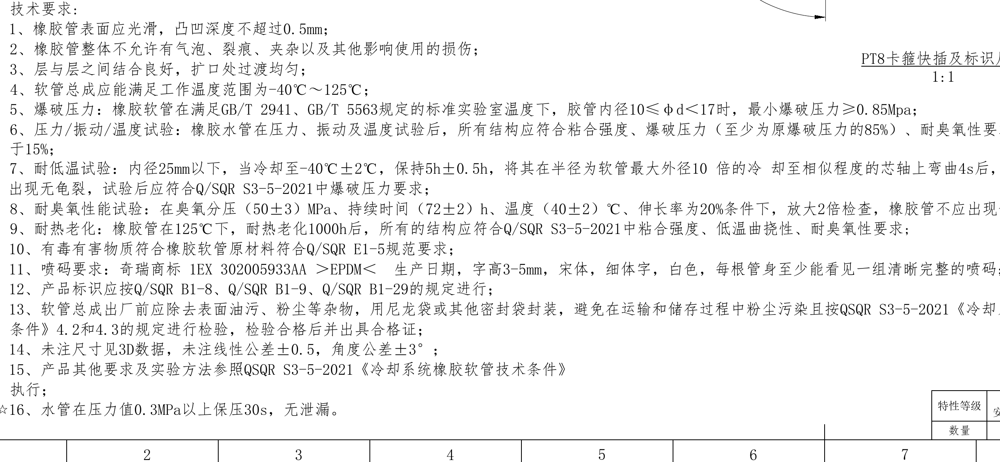

原图位置/视图名称：第 1 页左下部，技术要求，约网格 F-H/1-7。bbox `[260, 2090, 2780, 3255]`。

| 提取项 | 原图数值或文本 | 含义说明 |
|---|---|---|
| 标题 | 技术要求: | 图纸技术要求说明区。 |
| 1 | 橡胶管表面应光滑，凸凹深度不超过0.5mm； | 表面质量要求。 |
| 2 | 橡胶管整体不允许有气泡、裂痕、夹杂以及其他影响使用的损伤； | 外观和缺陷限制。 |
| 3 | 层与层之间结合良好，扩口处过渡均匀； | 层间粘结和扩口过渡要求。 |
| 4 | 软管总成应能满足工作温度范围为-40℃～125℃； | 工作温度范围要求。 |
| 5 | 爆破压力：橡胶软管在满足GB/T 2941、GB/T 5563规定的标准实验室温度下，胶管内径10≤φd＜17时，最小爆破压力≥0.85Mpa； | 爆破压力及试验条件要求。 |
| 6 | 压力/振动/温度试验：橡胶水管在压力、振动及温度试验后，所有结构应符合粘合强度、爆破压力（至少为原爆破压力的85%）、耐臭氧性要求。外径变化应小于15%； | 压力、振动、温度试验后的性能保持要求。 |
| 7 | 耐低温试验：内径25mm以下，当冷却至-40℃±2℃，保持5h±0.5h，将其在半径为软管最大外径10倍的冷却至相似程度的芯轴上弯曲4s后，放大2倍检查不应出现无龟裂，试验后应符合Q/SQR S3-5-2021中爆破压力要求； | 低温弯曲和龟裂检查要求。 |
| 8 | 耐臭氧性能试验：在臭氧分压（50±3）MPa、持续时间（72±2）h、温度（40±2）℃、伸长率为20%条件下，放大2倍检查，橡胶管不应出现龟裂现象； | 耐臭氧试验条件和验收要求。 |
| 9 | 耐热老化：橡胶管在125℃下，耐热老化1000h后，所有的结构应符合Q/SQR S3-5-2021中粘合强度、低温曲挠性、耐臭氧性要求; | 热老化后性能要求。 |
| 10 | 有毒有害物质符合橡胶软管原材料符合Q/SQR E1-5规范要求； | 有害物质合规要求。 |
| 11 | 喷码要求：奇瑞商标 1EX 302005933AA ＞EPDM＜ 生产日期，字高3-5mm，宋体，细体字，白色，每根管身至少能看见一组清晰完整的喷码; | 喷码内容、字体、颜色和可见性要求。 |
| 12 | 产品标识应按Q/SQR B1-8、Q/SQR B1-9、Q/SQR B1-29的规定进行； | 产品标识依据标准。 |
| 13 | 软管总成出厂前应除去表面油污、粉尘等杂物，用尼龙袋或其他密封袋封装，避免在运输和储存过程中粉尘污染且按QSQR S3-5-2021《冷却系统橡胶软管技术条件》4.2和4.3的规定进行检验，检验合格后并出具合格证； | 出厂清洁、包装、检验和合格证要求。 |
| 14 | 未注尺寸见3D数据，未注线性公差±0.5，角度公差±3°； | 未注尺寸和默认公差要求。 |
| 15 | 产品其他要求及实验方法参照QSQR S3-5-2021《冷却系统橡胶软管技术条件》执行； | 其他要求和试验方法依据。 |
| 16 | ☆ 水管在压力值0.3MPa以上保压30s，无泄漏。 | 星号关键要求；保压无泄漏要求。 |

边界归属说明：本对象只提取左侧技术要求 1-16 条。右上方可见 PT8 视图标题边缘、右下可见特性等级表边缘，均不归入 NOTES 内容。

## object_11 - 明细表 / BOM

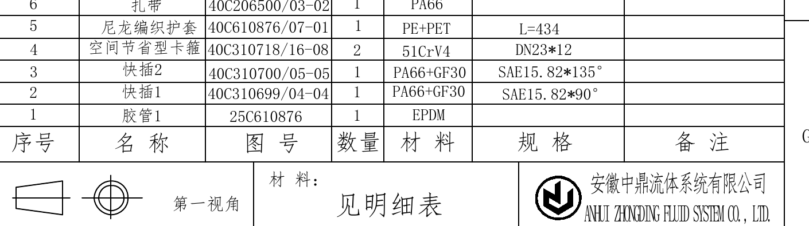

原图位置/视图名称：第 1 页右下中部，明细表/BOM，约网格 G/8-12。bbox `[3185, 2430, 4595, 2825]`。

| 序号 | 名称 | 图号 | 数量 | 材料 | 规格 | 备注 |
|---:|---|---|---:|---|---|---|
| 6 | 扎带 | 40C206500/03-02 | 1 | PA66 |  |  |
| 5 | 尼龙编织护套 | 40C610876/07-01 | 1 | PE+PET | L=434 |  |
| 4 | 空间节省型卡箍 | 40C310718/16-08 | 2 | 51CrV4 | DN23*12 |  |
| 3 | 快插2 | 40C310700/05-05 | 1 | PA66+GF30 | SAE15.82*135° |  |
| 2 | 快插1 | 40C310699/04-04 | 1 | PA66+GF30 | SAE15.82*90° |  |
| 1 | 胶管1 | 25C610876 | 1 | EPDM |  |  |

| 提取项 | 原图数值或文本 | 含义说明 |
|---|---|---|
| 表格类型 | 明细表 | 装配件物料清单，对应主装配视图中 ①-⑥ 序号。 |
| 材料 | 见明细表 | 标题栏材料栏引用本明细表。 |
| 视角 | 第一视角 | 投影视角标识。 |
| 公司 | 安徽中鼎流体系统有限公司 / ANHUI ZHONGDING FLUID SYSTEM CO., LTD. | 图纸出图单位。 |

边界归属说明：裁切完整包含 BOM 表头、6 行物料、下方“见明细表”和公司标识区域。左侧少量相邻技术要求文字不属于 BOM，不提取到该表。

## object_12 - 标题栏 / 特性等级

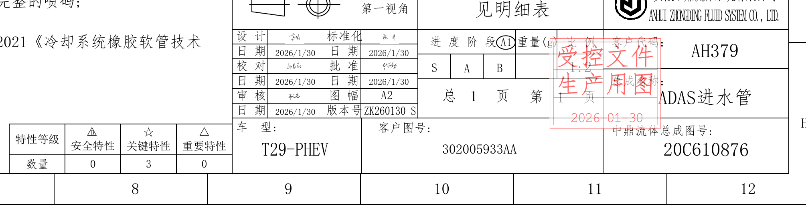

原图位置/视图名称：第 1 页右下角，标题栏、签审栏、特性等级表，约网格 H/7-12。bbox `[2585, 2765, 4595, 3300]`。

| 提取项 | 原图数值或文本 | 含义说明 |
|---|---|---|
| 公司 | 安徽中鼎流体系统有限公司 / ANHUI ZHONGDING FLUID SYSTEM CO., LTD. | 出图单位。 |
| 材料 | 见明细表 | 材料信息参见 object_11 明细表。 |
| 第一视角 | 第一视角 | 投影法标识。 |
| 设计日期 | 2026/1/30 | 设计栏日期。 |
| 标准化日期 | 2026/1/30 | 标准化栏日期。 |
| 校对日期 | 2026/1/30 | 校对栏日期。 |
| 批准日期 | 2026/1/30 | 批准栏日期。 |
| 审核日期 | 2026/1/30 | 审核栏日期。 |
| 图幅 | A2 | 图纸幅面。 |
| 版本号 | ZK260130 S | 当前图纸版本。 |
| 进度阶段 | A1 | 标题栏进度阶段。 |
| 比例 | 1:2 | 总图比例。 |
| 客户代码 | AH379 | 客户代码。 |
| 总页数 | 总 1 页 第 1 页 | 图纸页码信息。 |
| 总成名称 | ADAS进水管 | 产品总成名称。 |
| 车型 | T29-PHEV | 车型编号。 |
| 客户图号 | 302005933AA | 客户图号。 |
| 中鼎流体总成图号 | 20C610876 | 供应商总成图号。 |
| 受控章 | 受控文件 生产用图 2026-01-30 | 红色受控文件章。 |

特性等级表：

| 特性等级 | △D 安全特性 | ☆ 关键特性 | △ 重要特性 |
|---|---:|---:|---:|
| 数量 | 0 | 3 | 0 |

边界归属说明：标题栏、签审栏、页码、受控章、特性等级表均完整。左侧邻近 NOTES 的残余文字不归入标题栏对象。

## 裁切检查记录

| object_id | 检查结果 | 完整性和归属说明 |
|---|---|---|
| object_1 | 通过 | 主装配视图 PT 点、零件序号、护套粘结说明完整；下缘邻近 object_2，未提取胶管详图尺寸。 |
| object_2 | 通过 | `☆3.5±0.4`、`☆φ15 +0/-0.5`、三层材料引线和标题完整；上方零件 ③ 片段不归属本对象。 |
| object_3 | 通过 | PT1 工字标识所有尺寸线、箭头、文字和标题完整。 |
| object_4 | 通过，已重裁 | 初裁左侧尺寸被截，已向左扩展重裁；`15`、`2x4`、`27`、`4`、`13` 完整。 |
| object_5 | 通过 | 对手件尺寸线、箭头、`24.12±0.5`、`2.34-2.74`、`φ19.18±0.25` 和标题完整；下缘邻近其他视图不提取。 |
| object_6 | 通过，已重裁 | 初裁顶部中心标注贴边，已扩大重裁；PT8 角度和 `21.2` 尺寸完整。右缘相邻 `下 J6M标识中心` 不归属本对象。 |
| object_7 | 通过，已重裁 | 初裁左侧文字被截，已扩大重裁；`下 J6M标识中心`、角度弧线、`24.1` 和标题完整。左上相邻对手件片段不提取。 |
| object_8 | 通过 | 修订履历表表头、两行记录和外框完整。 |
| object_9 | 通过 | 点坐标表表题、表头、PT1-PT8 全部行和理论展开长度完整。 |
| object_10 | 通过 | 技术要求 1-16 条完整；右侧邻近视图/特性表边缘不归属 NOTES。 |
| object_11 | 通过 | BOM 表头、序号 1-6 行、下方材料/第一视角/公司标识完整。 |
| object_12 | 通过 | 标题栏、签审栏、受控章、车型/图号、特性等级表完整；左侧 NOTES 残余文字不归属标题栏。 |
