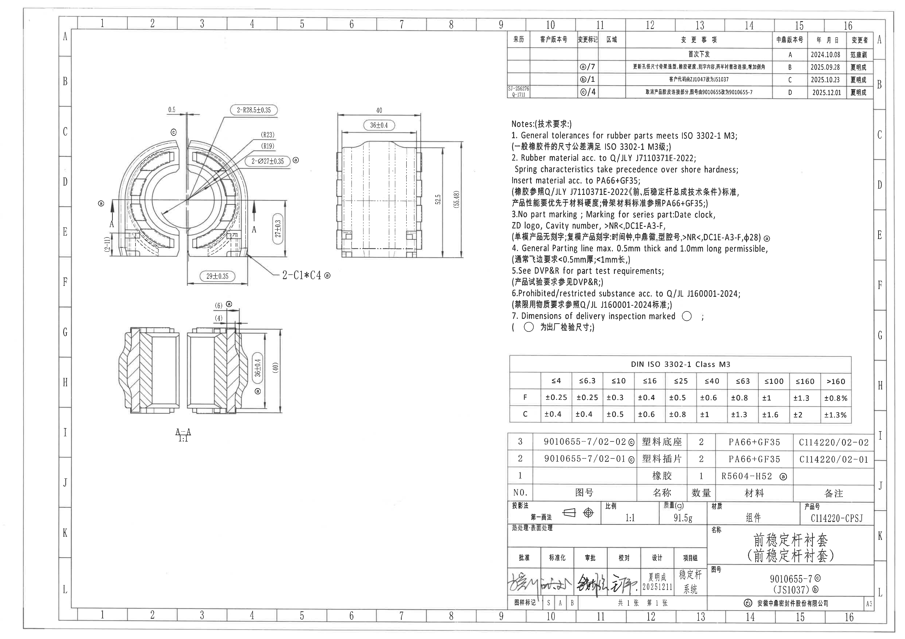
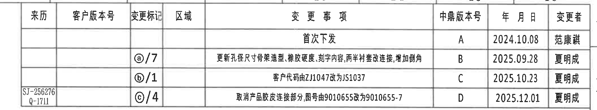
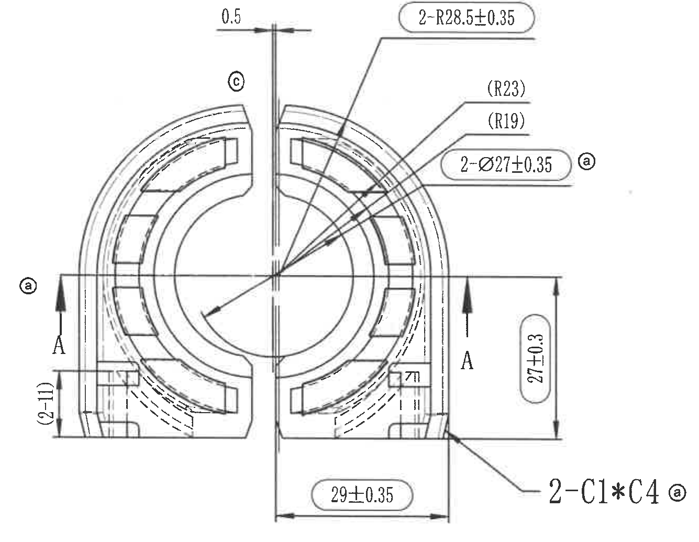
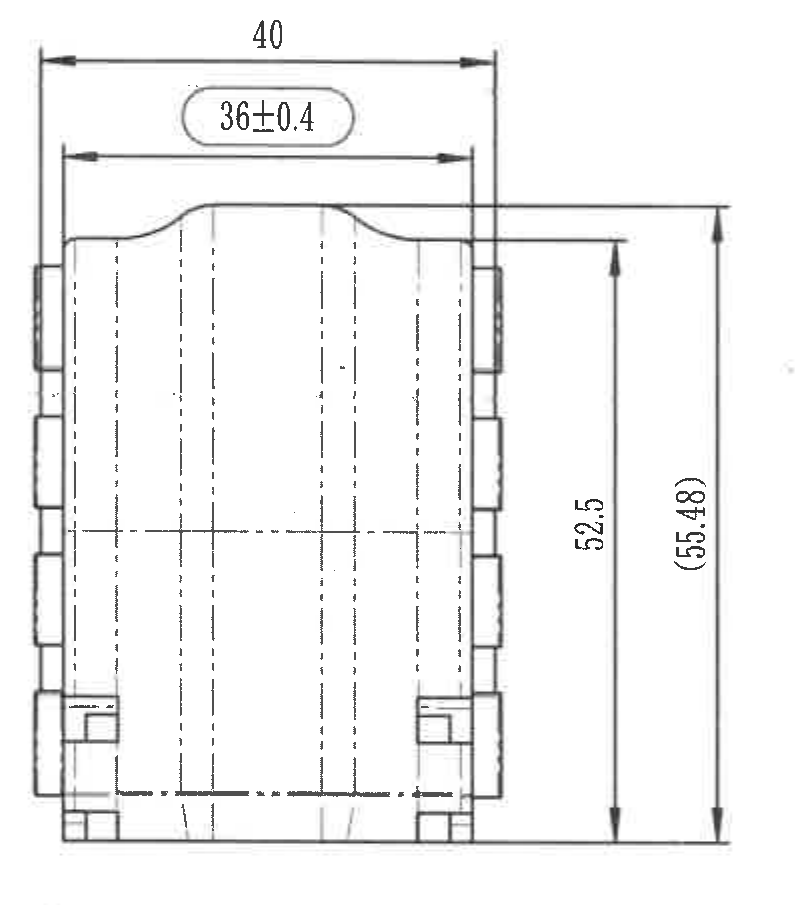
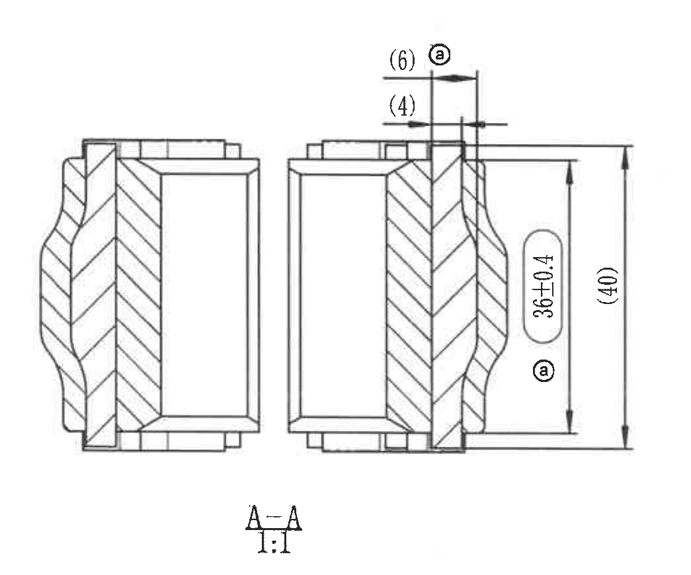
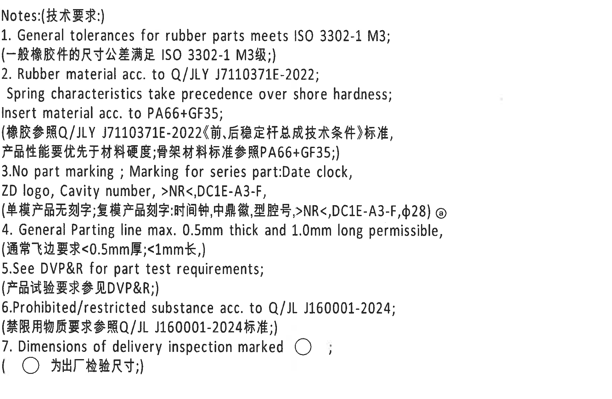
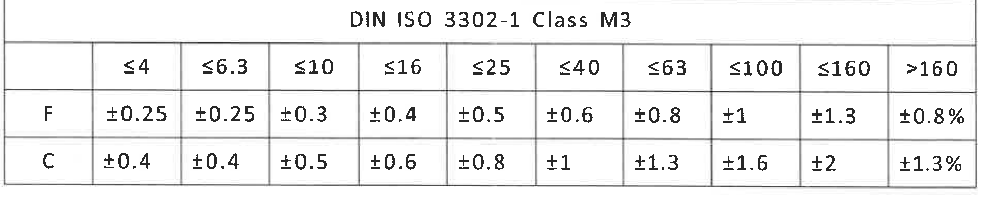
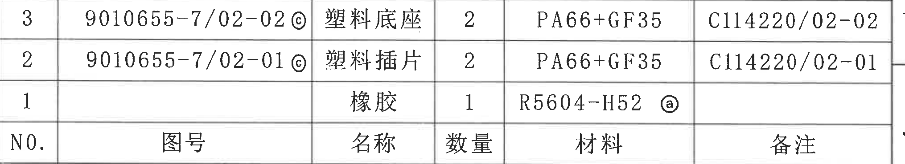
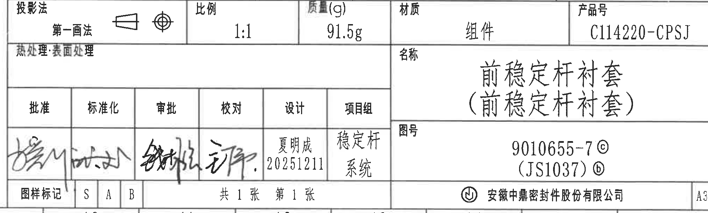

# 20C114220 PDF 内容识别与裁切提取

bbox 坐标采用整页 PNG 像素坐标 `[x0, y0, x1, y1]`。整页 PNG：`outputs/20C114220_assets/images/page_1.png`，尺寸 `4959 x 3505`。

## object_4 修订履历表 / table

- 原图位置/视图名称：第 1 页右上部修订履历表，bbox `[2705,160,4810,550]`。
- 边界归属说明：裁切包含完整修订履历表外框、表头、所有修订行和右侧变更者列；左下 `SJ-256276 / Q-1711` 属于 D 行来历列；下方 Notes 不归入本对象。

原表还原：

| 来历 | 客户版本号 | 变更标记 | 区域 | 变更事项 | 中鼎版本号 | 年 月 日 | 变更者 |
|---|---|---|---|---|---|---|---|
|  |  |  |  | 首次下发 | A | 2024.10.08 | 范康祺 |
|  |  | ⓐ/7 |  | 更新孔径尺寸骨架造型、橡胶硬度、刻字内容,两半衬套改连接,增加倒角 | B | 2025.09.28 | 夏明成 |
|  |  | ⓑ/1 |  | 客户代码由ZJ1047改为JS1037 | C | 2025.10.23 | 夏明成 |
| SJ-256276 Q-1711 |  | ⓒ/4 |  | 取消产品胶皮连接部分,图号由9010655改为9010655-7 | D | 2025.12.01 | 夏明成 |

| 提取项 | 原图数值或文本 | 含义说明 |
|---|---|---|
| 表头 | 来历、客户版本号、变更标记、区域、变更事项、中鼎版本号、年 月 日、变更者 | 修订履历字段按原表顺序还原。 |
| A 版记录 | 首次下发；A；2024.10.08；范康祺 | 首次发行记录。 |
| B 版记录 | ⓐ/7；更新孔径尺寸骨架造型、橡胶硬度、刻字内容,两半衬套改连接,增加倒角；B；2025.09.28；夏明成 | 与圈注 a 和 7 处变更相关。 |
| C 版记录 | ⓑ/1；客户代码由ZJ1047改为JS1037；C；2025.10.23；夏明成 | 与圈注 b 和 1 处变更相关。 |
| D 版记录 | SJ-256276 / Q-1711；ⓒ/4；取消产品胶皮连接部分,图号由9010655改为9010655-7；D；2025.12.01；夏明成 | 与圈注 c 和 4 处变更相关，含来历编号。 |

## object_1 主视图 / view

- 原图位置/视图名称：第 1 页左中部主视图/正面加工视图，bbox `[500,570,1835,1605]`。
- 边界归属说明：裁切只覆盖主视图及其直接尺寸线、引线和 A-A 剖切箭头。右下 `2-C1*C4` 的引线和文字完整归入主视图；下方 A-A 剖面中的 `(6)`、`(4)`、`36±0.4`、`(40)` 不归入本对象。

| 提取项 | 原图数值或文本 | 含义说明 |
|---|---|---|
| 顶部窄缝/间隙尺寸 | `0.5` | 中心竖向窄缝顶部的横向尺寸，尺寸线和双箭头完整位于主视图上方。 |
| 圆弧/半径尺寸 | `2-R28.5±0.35` | 2 处半径 R28.5，公差 ±0.35；带数量前缀 `2-`，引线指向外侧圆弧区域。 |
| 参考半径 | `(R23)` | 括号内参考半径，位于右上引出线，表示该半径为参考尺寸。 |
| 参考半径 | `(R19)` | 括号内参考半径，位于 `(R23)` 下方，表示该半径为参考尺寸。 |
| 直径尺寸 | `2-Ø27±0.35` | 2 处直径 27，公差 ±0.35；含直径符号 `Ø` 和数量前缀 `2-`，旁有圈注 `ⓐ`。 |
| 左下参考尺寸 | `(2-11)` | 主视图左下竖向括号尺寸，含数量前缀 `2`，按参考尺寸处理。 |
| 右侧高度/局部尺寸 | `27±0.3` | 主视图右侧竖向尺寸，公差 ±0.3，尺寸线与箭头完整保留。 |
| 底部宽度尺寸 | `29±0.35` | 主视图底部横向尺寸，公差 ±0.35，尺寸线与两端界线完整保留。 |
| 星号倒角尺寸 | `2-C1*C4` | 2 处倒角/倒边标注，保留星号 `*`；引线指向右下角，旁有圈注 `ⓐ`。 |
| 剖切标识 | `A`、`A-A` | 主视图左右箭头标识剖切方向 A，对应下方 A-A 剖面。 |
| 变更标记 | `ⓐ`、`ⓒ` | 圈注小写字母为修订/变更标记，不作为尺寸值。 |
| 角度/弧长/T 编号 | 未见角度尺寸、独立弧长尺寸或 T 编号 | 本视图可见圆弧半径标注，但未见以角度或弧长形式给出的尺寸，也未见 T 编号。 |

## object_2 右侧视图 / view

- 原图位置/视图名称：第 1 页中上部右侧视图/侧向加工视图，bbox `[1810,570,2605,1475]`。
- 边界归属说明：裁切包含侧视外形、中心线、顶部宽度尺寸和右侧高度尺寸；右侧 Notes 文本未进入裁切区域；左侧主视图尺寸不归入本对象。

| 提取项 | 原图数值或文本 | 含义说明 |
|---|---|---|
| 顶部外宽 | `40` | 侧视图顶部外侧总宽度，尺寸线覆盖两侧外边界。 |
| 顶部内宽 | `36±0.4` | 侧视图顶部内侧宽度，公差 ±0.4，位于 `40` 下方。 |
| 右侧高度 | `52.5` | 侧视图右侧竖向功能高度/局部高度尺寸。 |
| 参考总高 | `(55.48)` | 括号内参考总高，位于最右侧竖向尺寸线上。 |
| 角度/半径/倒角/T 编号 | 未见角度尺寸、半径尺寸、倒角标注或 T 编号 | 本视图只给出宽度和高度尺寸。 |

## object_3 A-A 剖面视图 / section

- 原图位置/视图名称：第 1 页左下部 A-A 剖面视图，标注比例 `1:1`，bbox `[590,1585,1635,2455]`。
- 边界归属说明：裁切包含剖面线、上下边界、顶部 `(6)`/`(4)` 尺寸线、右侧 `36±0.4`/`(40)` 尺寸线和底部 `A-A 1:1`。主视图的 `29±0.35` 和 `2-C1*C4` 不归入本对象。

| 提取项 | 原图数值或文本 | 含义说明 |
|---|---|---|
| 顶部参考宽度 | `(6)` | A-A 剖面顶部括号尺寸，带圈注 `ⓐ`，作为参考尺寸。 |
| 顶部参考宽度 | `(4)` | A-A 剖面顶部括号尺寸，作为参考尺寸。 |
| 剖面高度/局部高度 | `36±0.4` | A-A 剖面右侧竖向尺寸，公差 ±0.4，旁有圈注 `ⓐ`。 |
| 参考总高 | `(40)` | A-A 剖面最右侧括号总高参考尺寸。 |
| 视图名称/比例 | `A-A`；`1:1` | 剖面名称和比例按原图底部标注。 |
| 角度/半径/直径/T 编号 | 未见角度尺寸、半径尺寸、直径尺寸或 T 编号 | 本剖面只给出顶部参考宽度和右侧高度尺寸。 |

## object_5 Notes 技术要求 / notes

- 原图位置/视图名称：第 1 页右中部 Notes/技术要求，bbox `[2800,630,4745,1900]`。
- 边界归属说明：裁切仅包含 Notes 文本；左侧右视图和下方 DIN ISO 公差表不归入本对象。

原文还原：

1. General tolerances for rubber parts meets ISO 3302-1 M3;  
(一般橡胶件的尺寸公差满足 ISO 3302-1 M3级;)

2. Rubber material acc. to Q/JLY J7110371E-2022;  
Spring characteristics take precedence over shore hardness;  
Insert material acc. to PA66+GF35;  
(橡胶参照Q/JLY J7110371E-2022《前、后稳定杆总成技术条件》标准,  
产品性能要优先于材料硬度;骨架材料标准参照PA66+GF35;)

3.No part marking ; Marking for series part:Date clock,  
ZD logo, Cavity number, >NR<,DC1E-A3-F,  
(单模产品无刻字;复模产品刻字:时间钟,中鼎微,型腔号,>NR<,DC1E-A3-F,Φ28) ⓐ

4. General Parting line max. 0.5mm thick and 1.0mm long permissible,  
(通常飞边要求<0.5mm厚;<1mm长,)

5.See DVP&R for part test requirements;  
(产品试验要求参见DVP&R;)

6.Prohibited/restricted substance acc. to Q/JL J160001-2024;  
(禁限用物质要求参照Q/JL J160001-2024标准;)

7. Dimensions of delivery inspection marked ○ ;  
(○ 为出厂检验尺寸;)

| 提取项 | 原图数值或文本 | 含义说明 |
|---|---|---|
| 一般公差 | `ISO 3302-1 M3` | 橡胶件尺寸公差满足 ISO 3302-1 M3；与下方 DIN ISO 公差表对应。 |
| 橡胶材料标准 | `Q/JLY J7110371E-2022` | 橡胶材料参照标准。 |
| 性能优先级 | `Spring characteristics take precedence over shore hardness` | 产品弹性/弹簧特性优先于邵氏硬度。 |
| 骨架/插片材料 | `PA66+GF35` | Insert material acc. to PA66+GF35。 |
| 刻字要求 | `No part marking`; `Date clock, ZD logo, Cavity number, >NR<,DC1E-A3-F`; `Φ28` | 单模产品无刻字；复模产品刻字内容包括时间钟、中鼎微、型腔号、材料/代码和 Φ28。 |
| 分型线/飞边 | `0.5mm thick`; `1.0mm long`; `<0.5mm厚`; `<1mm长` | 通常飞边厚度和长度限制。 |
| 试验要求 | `DVP&R` | 产品试验要求参见 DVP&R。 |
| 禁限用物质 | `Q/JL J160001-2024` | 禁限用物质要求参照该标准。 |
| 出厂检验尺寸标记 | `○` | Notes 第 7 条说明带圆圈标记的尺寸为出厂检验尺寸。 |

## object_6 DIN ISO 3302-1 Class M3 公差表 / table

- 原图位置/视图名称：第 1 页右下中部 DIN ISO 3302-1 Class M3 公差表，bbox `[2785,1960,4710,2350]`。
- 边界归属说明：裁切包含完整表头、外框、F/C 两行和全部尺寸范围列；上方 Notes 和下方 BOM 不归入本对象。

原表还原：

| DIN ISO 3302-1 Class M3 | ≤4 | ≤6.3 | ≤10 | ≤16 | ≤25 | ≤40 | ≤63 | ≤100 | ≤160 | >160 |
|---|---|---|---|---|---|---|---|---|---|---|
| F | ±0.25 | ±0.25 | ±0.3 | ±0.4 | ±0.5 | ±0.6 | ±0.8 | ±1 | ±1.3 | ±0.8% |
| C | ±0.4 | ±0.4 | ±0.5 | ±0.6 | ±0.8 | ±1 | ±1.3 | ±1.6 | ±2 | ±1.3% |

| 提取项 | 原图数值或文本 | 含义说明 |
|---|---|---|
| 表题 | `DIN ISO 3302-1 Class M3` | 与 Notes 第 1 条一般公差要求对应。 |
| 尺寸范围列 | `≤4`、`≤6.3`、`≤10`、`≤16`、`≤25`、`≤40`、`≤63`、`≤100`、`≤160`、`>160` | 原表横向尺寸范围。 |
| F 行 | `±0.25`、`±0.25`、`±0.3`、`±0.4`、`±0.5`、`±0.6`、`±0.8`、`±1`、`±1.3`、`±0.8%` | F 类尺寸公差行。 |
| C 行 | `±0.4`、`±0.4`、`±0.5`、`±0.6`、`±0.8`、`±1`、`±1.3`、`±1.6`、`±2`、`±1.3%` | C 类尺寸公差行。 |

## object_7 明细表/BOM / table

- 原图位置/视图名称：第 1 页右下部、标题栏上方 BOM/明细表，bbox `[2790,2380,4820,2750]`。
- 边界归属说明：裁切到 BOM 表底线截止；下方标题栏中的投影法、比例、质量、材质、产品号等字段不归入本对象；右侧备注列完整保留。

原表还原：

| NO. | 图号 | 名称 | 数量 | 材料 | 备注 |
|---|---|---|---|---|---|
| 3 | 9010655-7/02-02 ⓒ | 塑料底座 | 2 | PA66+GF35 | C114220/02-02 |
| 2 | 9010655-7/02-01 ⓒ | 塑料插片 | 2 | PA66+GF35 | C114220/02-01 |
| 1 |  | 橡胶 | 1 | R5604-H52 ⓐ |  |

| 提取项 | 原图数值或文本 | 含义说明 |
|---|---|---|
| 表头 | `NO.`、`图号`、`名称`、`数量`、`材料`、`备注` | 明细表字段按原图列顺序还原。 |
| 第 3 行 | `9010655-7/02-02 ⓒ`；`塑料底座`；`2`；`PA66+GF35`；`C114220/02-02` | 塑料底座零件，数量 2，材料 PA66+GF35。 |
| 第 2 行 | `9010655-7/02-01 ⓒ`；`塑料插片`；`2`；`PA66+GF35`；`C114220/02-01` | 塑料插片零件，数量 2，材料 PA66+GF35。 |
| 第 1 行 | `橡胶`；`1`；`R5604-H52 ⓐ` | 橡胶件，数量 1，材料 R5604-H52；图号与备注为空白。 |

## object_8 标题栏 / title_block

- 原图位置/视图名称：第 1 页右下角标题栏，bbox `[2760,2750,4780,3360]`。
- 边界归属说明：裁切包含标题栏自身外框、投影/比例/质量/材质/产品号、名称、签审、图号、图样标记、页数、公司和幅面；上方 BOM 行不归入本对象，仅共享表格边界线。

标题栏字段还原：

| 字段 | 原图文本 |
|---|---|
| 投影法 | 第一画法；投影符号见原图 |
| 比例 | 1:1 |
| 质量(g) | 91.5g |
| 材质 | 组件 |
| 产品号 | C114220-CPSJ |
| 热处理:表面处理 | 空白 |
| 名称 | 前稳定杆衬套（前稳定杆衬套） |
| 批准 | 手写签名 |
| 标准化 | 手写签名 |
| 审批 | 手写签名 |
| 校对 | 手写签名 |
| 设计 | 夏明成 20251211 |
| 项目组 | 稳定杆系统 |
| 图号 | 9010655-7 ⓒ；(JS1037) ⓑ |
| 图样标记 | S A B |
| 页数 | 共 1 张　第 1 张 |
| 公司 | 安徽中鼎密封件股份有限公司 |
| 幅面 | A3 |

| 提取项 | 原图数值或文本 | 含义说明 |
|---|---|---|
| 产品号 | `C114220-CPSJ` | 标题栏产品号。 |
| 名称 | `前稳定杆衬套（前稳定杆衬套）` | 标题栏名称字段，括号内文字按原图保留。 |
| 图号 | `9010655-7 ⓒ`；`(JS1037) ⓑ` | 标题栏图号与客户代码/变更标记。 |
| 材质 | `组件` | 标题栏材质栏。 |
| 质量 | `91.5g` | 标题栏质量栏。 |
| 比例 | `1:1` | 标题栏比例栏。 |
| 设计 | `夏明成 20251211` | 设计签署与日期。 |
| 项目组 | `稳定杆系统` | 项目组字段。 |
| 公司 | `安徽中鼎密封件股份有限公司` | 标题栏底部公司名称。 |
| 幅面 | `A3` | 图纸幅面。 |

## 裁切检查记录

| 图片 | 对象 | bbox | 检查结果 | 边界归属结论 |
|---|---|---|---|---|
| `page_1.png` | 整页渲染图 | `[0,0,4959,3505]` | 完整包含整页图框和全部图纸内容。 | 作为所有裁切对象的坐标基准。 |
| `object_1.png` | 主视图 | `[500,570,1835,1605]` | 完整包含 `0.5`、`2-R28.5±0.35`、`(R23)`、`(R19)`、`2-Ø27±0.35`、`(2-11)`、`27±0.3`、`29±0.35`、`2-C1*C4` 的文字、尺寸线、箭头和引线。 | 未混入 A-A 剖面尺寸；右侧 `2-C1*C4` 归属主视图。 |
| `object_2.png` | 右侧视图 | `[1810,570,2605,1475]` | 完整包含 `40`、`36±0.4`、`52.5`、`(55.48)` 的文字、尺寸线和箭头。 | 未混入 Notes；括号参考总高 `(55.48)` 归属右侧视图。 |
| `object_3.png` | A-A 剖面 | `[590,1585,1635,2455]` | 完整包含 `(6)`、`(4)`、`36±0.4`、`(40)`、`A-A`、`1:1` 的文字、尺寸线和箭头。 | 未混入主视图底部尺寸；顶部参考尺寸归属 A-A 剖面。 |
| `object_4.png` | 修订履历表 | `[2705,160,4810,550]` | 完整包含表头、四行记录、左下 `SJ-256276 / Q-1711` 和右侧变更者列。 | 未混入 Notes；所有表格字段归属修订履历。 |
| `object_5.png` | Notes | `[2800,630,4745,1900]` | 完整包含 Notes 1-7 条中英文文本和圆圈标记说明。 | 未混入右视图或 DIN ISO 公差表。 |
| `object_6.png` | DIN ISO 公差表 | `[2785,1960,4710,2350]` | 完整包含标题、尺寸范围列、F 行和 C 行。 | 未混入 Notes 或 BOM。 |
| `object_7.png` | BOM/明细表 | `[2790,2380,4820,2750]` | 完整包含 NO./图号/名称/数量/材料/备注表头和 1-3 行记录。 | 未混入标题栏；下方共享边界线只作为表格边界。 |
| `object_8.png` | 标题栏 | `[2760,2750,4780,3360]` | 完整包含投影法、比例、质量、材质、产品号、名称、签审、图号、图样标记、页数、公司和 A3。 | 未混入 BOM 数据行；上边仅共享标题栏边线。 |
