# 20C114231 PDF 内容识别结果

整页 PNG: `outputs/20C114231_assets/images/page_1.png`

本文件按原图区域顺序记录裁切对象；每个对象只提取其裁切区域内的内容，边界归属按完整尺寸线、箭头、引出线和标注文字判断。

## object_1 - 技术要求 / Specifications / NOTES

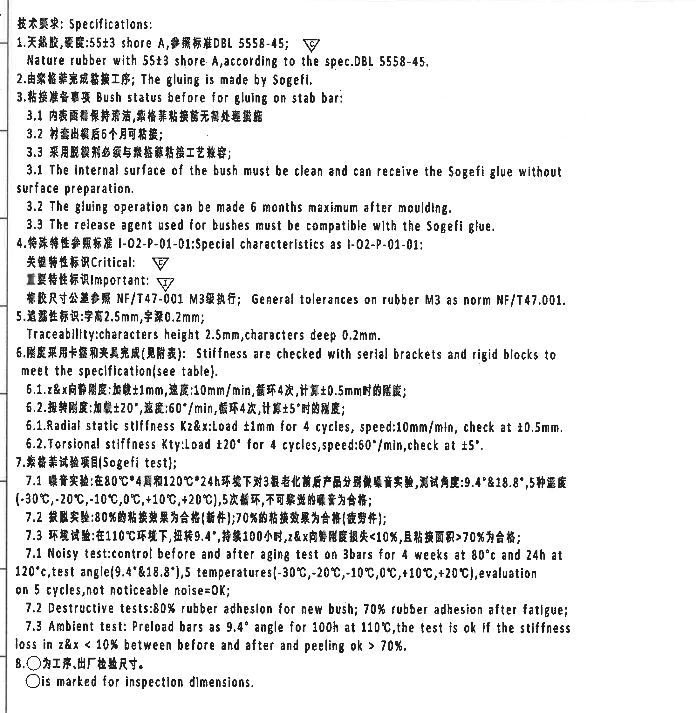

- 原图位置/视图名称: page 1, bbox `[340, 170, 2190, 2240]`, 技术要求 / Specifications / NOTES
- 边界归属说明: 位于图纸左上至左中区域，独立 NOTES/Specifications 文本区。右侧边界收回至主视图之前，未纳入视图尺寸；文中 C/I 三角符号说明关键/重要特性标识，○ 表示工序/出厂检验尺寸。

| 提取项 | 原图数值或文本 | 含义说明 |
|---|---|---|
| 技术要求标题 | 技术要求: Specifications: | 左侧 NOTES 区域标题。 |
| 1 材料硬度 | 天然胶, 硬度:55±3 shore A; DBL 5558-45 | 天然橡胶硬度和参照标准；C 三角为关键特性标识。 |
| 2 粘接工序 | The gluing is made by Sogefi. | 粘接由 Sogefi 完成。 |
| 3 粘接准备 | Bush status before for gluing on stab bar | 说明粘接前内衬面清洁、出模后 6 个月内可粘接、脱模剂兼容。 |
| 4 特殊特性 | I-02-P-01-01; Critical C; Important I | C 为关键特性，I 为重要特性。 |
| 通用公差引用 | NF/T47-001 M3 | 橡胶尺寸公差按 NF/T47-001 M3 级执行，具体数值见公差表。 |
| 5 追溯标识 | characters height 2.5mm, characters deep 0.2mm | 追溯字符高度和深度要求。 |
| 6 刚度检测 | serial brackets and rigid blocks; see table | 刚度使用卡箍和刚性块检查，数值见刚度要求表。 |
| 6.1 径向静刚度 | Load ±1mm; speed 10mm/min; 4 cycles; check at ±0.5mm | Kz&x 测试条件。 |
| 6.2 扭转刚度 | Load ±20°; speed 60°/min; 4 cycles; check at ±5° | Kty 测试条件。 |
| 7.1 噪音试验 | 80°C*4 周; 120°C*24h; 9.4°&18.8°; -30°C 至 +20°C; 5 cycles | 老化前后 3 根杆噪音试验，not noticeable noise=OK。 |
| 7.2 破坏试验 | 80% rubber adhesion; 70% rubber adhesion after fatigue | 新件/疲劳件粘接比例合格判定。 |
| 7.3 环境试验 | 110°C; 9.4°; 100h; z&x <10%; peeling ok >70% | 环境试验合格判定。 |
| 8 检验尺寸符号 | ○ is marked for inspection dimensions. | 圆圈表示工序、出厂检验尺寸。 |

## object_2 - 修订履历表 / Modification table

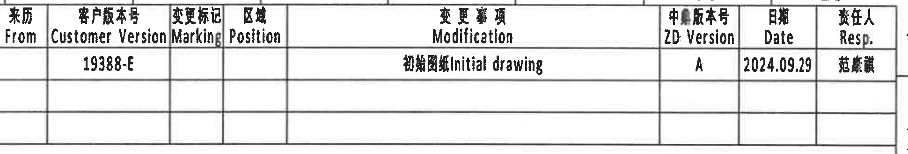

- 原图位置/视图名称: page 1, bbox `[2850, 155, 1940, 330]`, 修订履历表 / Modification table
- 边界归属说明: 位于页面上方 10-16 分区附近，为修订履历表。只提取该表行列内容，不与左侧技术要求或右侧图框坐标合并。

### 原表还原

| From | Customer Version | Marking | Position | Modification | ZD Version | Date | Resp. |
|---|---|---|---|---|---|---|---|
|  | 19388-E |  |  | 初始图纸 / Initial drawing | A | 2024.09.29 | 范康慧 |
|  |  |  |  |  |  |  |  |
|  |  |  |  |  |  |  |  |

### 提取表格

| 提取项 | 原图数值或文本 | 含义说明 |
|---|---|---|
| Customer Version | 19388-E | 客户版本号/版本记录。 |
| Modification | 初始图纸 / Initial drawing | 本次记录为初始图纸。 |
| ZD Version | A | 中鼎版本号。 |
| Date | 2024.09.29 | 修订日期。 |
| Resp. | 范康慧 | 责任人。 |

## object_3 - 主加工视图：上下半衬套正视/剖开布局

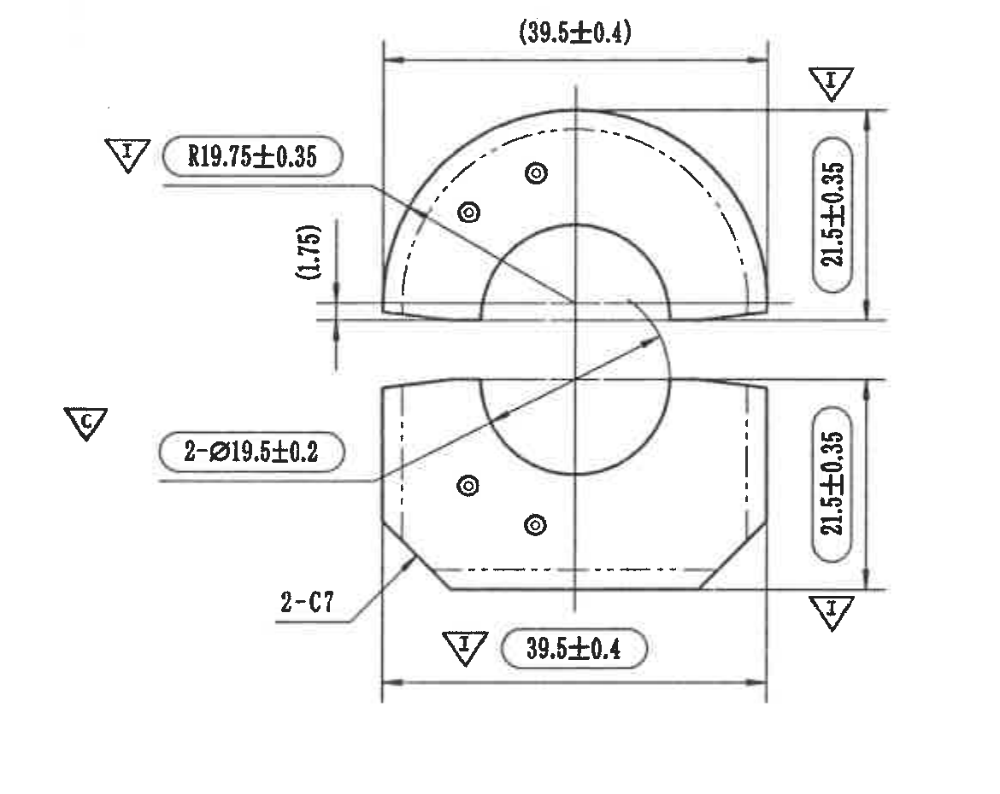

- 原图位置/视图名称: page 1, bbox `[2540, 650, 1170, 930]`, 主加工视图：上下半衬套正视/剖开布局
- 边界归属说明: 位于页面中右部 C-E 区域，是主要加工尺寸视图。裁切包含完整外形、中心线、箭头、引出线、C/I 特性标识和所有标注；右侧两个 21.5±0.35 归属本主视图，不归入右侧侧视图。

| 提取项 | 原图数值或文本 | 含义说明 |
|---|---|---|
| 参考宽度 | (39.5±0.4) | 上半件外侧总宽度；括号表示参考尺寸，位于主视图上方。 |
| 圆弧半径 | R19.75±0.35 | 上半件圆弧外轮廓半径；I 重要特性。 |
| 参考间隙/台阶 | (1.75) | 左侧竖向局部参考尺寸；括号表示参考，不因参考而省略。 |
| 上半件高度 | 21.5±0.35 | 上半件右侧竖向尺寸；I 重要特性。 |
| 内径/孔径 | 2-Ø19.5±0.2 | 两处直径 19.5 特征；C 关键特性，引出线归属主视图。 |
| 下半件高度 | 21.5±0.35 | 下半件右侧竖向尺寸；I 重要特性。 |
| 倒角/倒棱 | 2-C7 | 两处 C7 倒角/倒棱，指向下半件斜边。 |
| 下半件宽度 | 39.5±0.4 | 下半件外侧总宽度；I 重要特性。 |

## object_4 - 右上侧视图

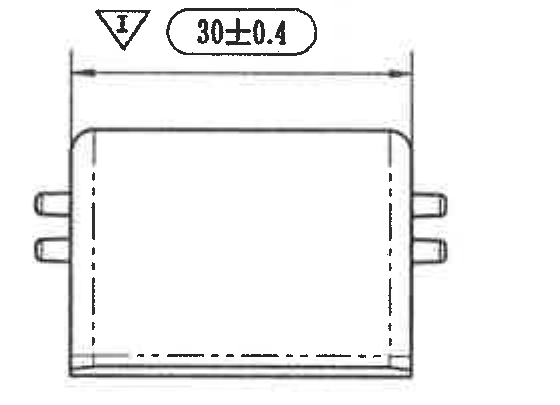

- 原图位置/视图名称: page 1, bbox `[3950, 650, 560, 405]`, 右上侧视图
- 边界归属说明: 位于主视图右侧上方。只包含上方侧视图和其 30±0.4 尺寸；下方侧视图片段已排除，尺寸线和文字完整。

| 提取项 | 原图数值或文本 | 含义说明 |
|---|---|---|
| 总宽度 | 30±0.4 | 右上侧视图水平外包宽度；I 重要特性。 |
| 隐藏线 | 虚线 | 表示内部/背侧隐藏边界。 |

## object_5 - 右下侧视图

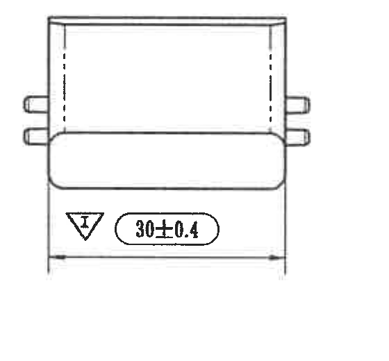

- 原图位置/视图名称: page 1, bbox `[3950, 1070, 560, 520]`, 右下侧视图
- 边界归属说明: 位于主视图右侧下方。该视图的 30±0.4 与右上侧视图的 30±0.4 分别归属各自侧视图，未互相合并。

| 提取项 | 原图数值或文本 | 含义说明 |
|---|---|---|
| 总宽度 | 30±0.4 | 右下侧视图水平外包宽度；I 重要特性。 |
| 圆角外形 | 下部圆角轮廓 | 显示下部外轮廓大圆角过渡。 |

## object_6 - 下方侧视图 / 长边侧视图

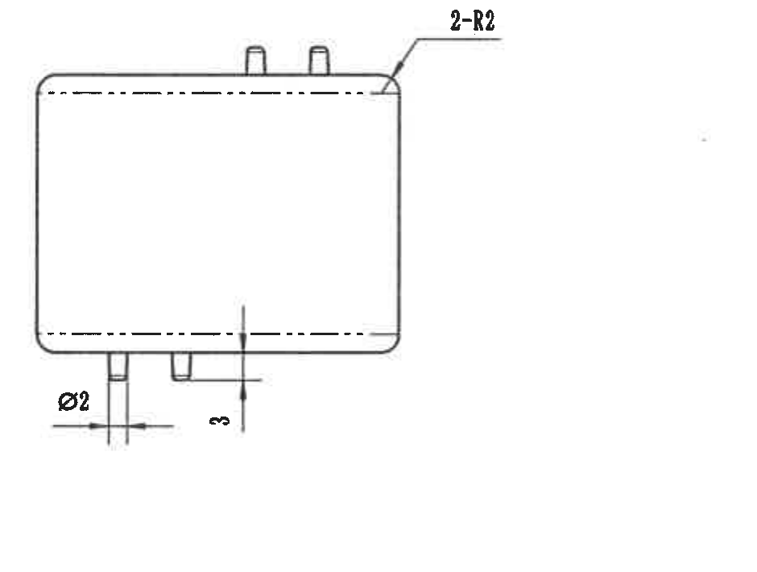

- 原图位置/视图名称: page 1, bbox `[2940, 1570, 940, 710]`, 下方侧视图 / 长边侧视图
- 边界归属说明: 位于页面中右下 F-H 区域，独立于右侧模具上下侧局部图。裁切保留 Ø2、3、2-R2 的完整文字、引出线和箭头，右侧留白用于保留 2-R2 引出线。

| 提取项 | 原图数值或文本 | 含义说明 |
|---|---|---|
| 圆角 | 2-R2 | 两处 R2 圆角，位于右上外角。 |
| 直径 | Ø2 | 左下小特征直径 2。 |
| 高度/突出量 | 3 | 底部小特征竖向尺寸 3。 |
| 隐藏线 | 虚线 | 表示内部或背侧隐藏边界。 |

## object_7 - 局部视图：Mould lower side

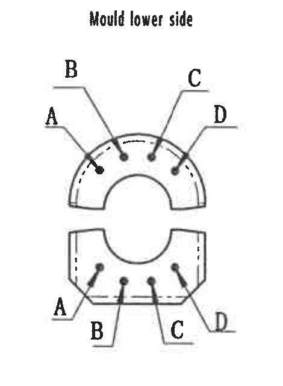

- 原图位置/视图名称: page 1, bbox `[3845, 1640, 470, 640]`, 局部视图：Mould lower side
- 边界归属说明: 位于页面右中 G-H 区域左侧的局部标识图。裁切仅包含 Mould lower side 标题和本图 A/B/C/D 引出标识，不包含右侧 Mould upper side 图。

| 提取项 | 原图数值或文本 | 含义说明 |
|---|---|---|
| 标题 | Mould lower side | 模具下侧局部标识图。 |
| 位置标识 | A, B, C, D | 上半件和下半件各有 A/B/C/D 引出标识，指向小圆点/标记位置。 |

## object_8 - 局部视图：Mould upper side

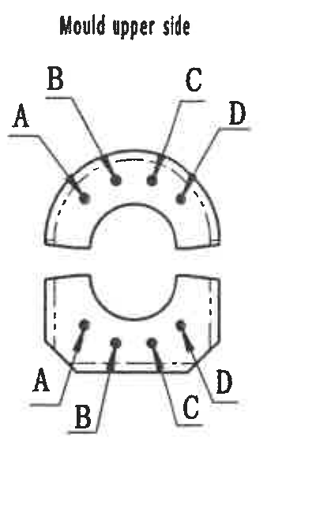

- 原图位置/视图名称: page 1, bbox `[4340, 1640, 400, 640]`, 局部视图：Mould upper side
- 边界归属说明: 位于页面右中 G-H 区域右侧的局部标识图。裁切右边界收紧，未包含图框坐标栏；只提取本图 A/B/C/D 位置标识。

| 提取项 | 原图数值或文本 | 含义说明 |
|---|---|---|
| 标题 | Mould upper side | 模具上侧局部标识图。 |
| 位置标识 | A, B, C, D | 上半件和下半件各有 A/B/C/D 引出标识，指向小圆点/标记位置。 |

## object_9 - 等轴测示意图与坐标方向

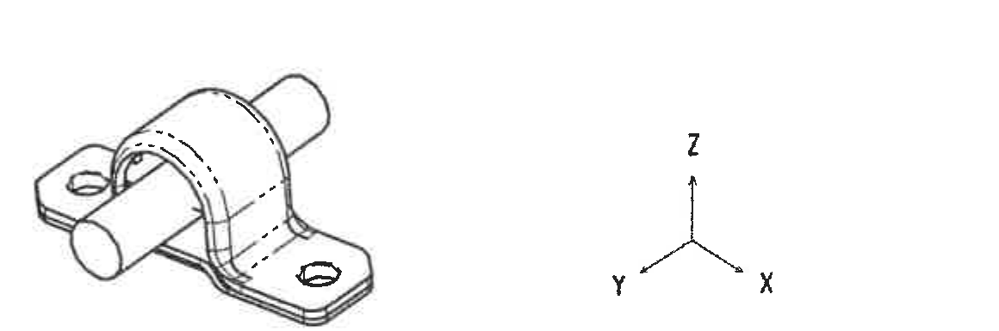

- 原图位置/视图名称: page 1, bbox `[1000, 2355, 1160, 385]`, 等轴测示意图与坐标方向
- 边界归属说明: 位于左下 I-J 区域。裁切只包含等轴测示意和坐标方向，不提取下方刚度表内容。

| 提取项 | 原图数值或文本 | 含义说明 |
|---|---|---|
| 等轴测图 | Rear stab bar bush 外观 | 显示圆柱稳定杆、上下半衬套、支架耳板和安装孔。 |
| 坐标方向 | X / Y / Z | 三轴方向示意；该图无数值尺寸。 |

## object_10 - 刚度要求表 / Stiffness requirement

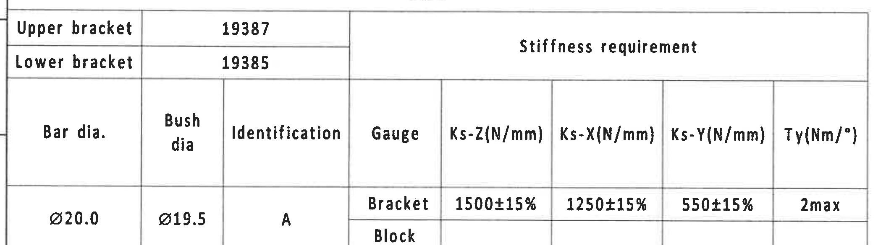

- 原图位置/视图名称: page 1, bbox `[340, 2735, 2110, 585]`, 刚度要求表 / Stiffness requirement
- 边界归属说明: 位于页面下方左侧 K-L 区域，是刚度要求表。Ø20.0、Ø19.5、A 的单元格跨 Bracket/Block 两行；Bracket 行包含刚度和扭转刚度数值，Block 行可见为空。

### 原表还原

| Upper bracket | 19387 | Stiffness requirement |
|---|---:|---|
| Lower bracket | 19385 | Stiffness requirement |

| Bar dia. | Bush dia | Identification | Gauge | Ks-Z(N/mm) | Ks-X(N/mm) | Ks-Y(N/mm) | Ty(Nm/°) |
|---|---|---|---|---|---|---|---|
| Ø20.0 | Ø19.5 | A | Bracket | 1500±15% | 1250±15% | 550±15% | 2max |
| Ø20.0 | Ø19.5 | A | Block |  |  |  |  |

### 提取表格

| 提取项 | 原图数值或文本 | 含义说明 |
|---|---|---|
| Upper bracket | 19387 | 上支架件号。 |
| Lower bracket | 19385 | 下支架件号。 |
| Bar dia. | Ø20.0 | 稳定杆直径。 |
| Bush dia | Ø19.5 | 衬套直径/内径。 |
| Identification | A | 识别标记。 |
| Gauge Bracket | 1500±15%, 1250±15%, 550±15%, 2max | Bracket 量具下的刚度要求。 |
| Gauge Block | 空白 | Block 行可见为空，前三列与上一行合并显示。 |

## object_11 - 通用公差表 / NF/T 47-001 CLASS M3

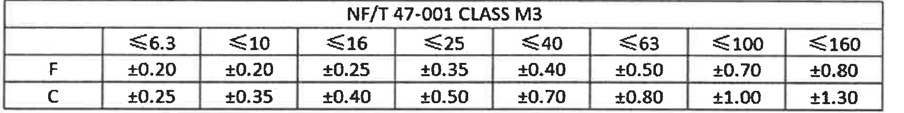

- 原图位置/视图名称: page 1, bbox `[2740, 2500, 1840, 230]`, 通用公差表 / NF/T 47-001 CLASS M3
- 边界归属说明: 位于标题栏上方右侧，是橡胶尺寸通用公差表。NOTES 中说明橡胶尺寸公差按 NF/T47-001 M3 级执行，本表给出 F/C 两类公差值。

### 原表还原

| NF/T 47-001 CLASS M3 | ≤6.3 | ≤10 | ≤16 | ≤25 | ≤40 | ≤63 | ≤100 | ≤160 |
|---|---|---|---|---|---|---|---|---|
| F | ±0.20 | ±0.20 | ±0.25 | ±0.35 | ±0.40 | ±0.50 | ±0.70 | ±0.80 |
| C | ±0.25 | ±0.35 | ±0.40 | ±0.50 | ±0.70 | ±0.80 | ±1.00 | ±1.30 |

### 提取表格

| 提取项 | 原图数值或文本 | 含义说明 |
|---|---|---|
| 标题 | NF/T 47-001 CLASS M3 | 橡胶 M3 级通用公差表。 |
| F 行 | ±0.20, ±0.20, ±0.25, ±0.35, ±0.40, ±0.50, ±0.70, ±0.80 | F 类尺寸段公差。 |
| C 行 | ±0.25, ±0.35, ±0.40, ±0.50, ±0.70, ±0.80, ±1.00, ±1.30 | C 类尺寸段公差。 |

## object_12 - 标题栏 / Title block

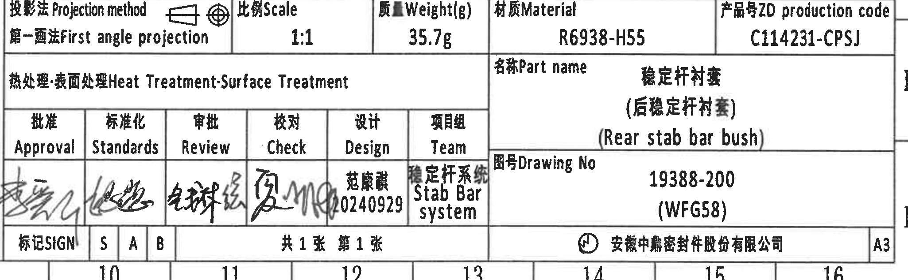

- 原图位置/视图名称: page 1, bbox `[2740, 2750, 2050, 635]`, 标题栏 / Title block
- 边界归属说明: 位于页面右下角 K-L 区域，为标题栏和签审栏。只提取标题栏字段，不将上方通用公差表并入本对象。

| 提取项 | 原图数值或文本 | 含义说明 |
|---|---|---|
| Projection method | 第一画法 / First angle projection | 投影方法。 |
| Scale | 1:1 | 图纸比例。 |
| Weight(g) | 35.7g | 重量。 |
| Material | R6938-H55 | 材料牌号。 |
| ZD production code | C114231-CPSJ | 产品号。 |
| Part name | 稳定杆衬套（后稳定杆衬套） / Rear stab bar bush | 零件名称。 |
| Drawing No | 19388-200 (WFG58) | 图号。 |
| Design | 范康慧 20240929 | 设计签审信息。 |
| Team | 稳定杆系统 / Stab Bar system | 项目组。 |
| Company | 安徽中鼎密封件股份有限公司 | 公司名称。 |
| Format | A3 | 图幅。 |

## 裁切检查记录

| 裁切对象 | 检查结论 | 说明 |
|---|---|---|
| object_1 | 完整 | 说明文字 1-8 项完整；右边界已重裁，未混入主视图尺寸。 |
| object_2 | 完整 | 修订表表头和首行记录完整；空白行保留。 |
| object_3 | 完整 | 主视图所有尺寸线、箭头、文字、C/I 标识完整；左侧 C 标识经重裁后完整。 |
| object_4 | 完整 | 右上侧视图 30±0.4 完整；已重裁去除下方侧视图片段。 |
| object_5 | 完整 | 右下侧视图 30±0.4 完整；未混入右上视图。 |
| object_6 | 完整 | Ø2、3、2-R2 的文字、尺寸线和引出线完整；未混入局部标识图。 |
| object_7 | 完整 | Mould lower side 标题和 A/B/C/D 引出标识完整；已重裁去除右侧局部图片段。 |
| object_8 | 完整 | Mould upper side 标题和 A/B/C/D 引出标识完整；已重裁去除图框坐标栏。 |
| object_9 | 完整 | 等轴测图和 X/Y/Z 坐标完整；已重裁去除刚度表标题片段。 |
| object_10 | 完整 | 刚度要求表行列、合并单元格含义和数值完整；底部图框编号未纳入内容提取。 |
| object_11 | 完整 | NF/T47-001 CLASS M3 表格完整，未混入标题栏。 |
| object_12 | 完整 | 标题栏字段、签审栏和公司/图幅信息完整；未混入上方公差表。 |
