# 20C11423141 PDF 内容识别

整页渲染图：`outputs/20C11423141_assets/images/page_1.png`

页面尺寸：4959 x 3505 px。以下对象按原图结构自左上到右下排列。

## object_1 - NOTES / 技术要求

裁切图片：

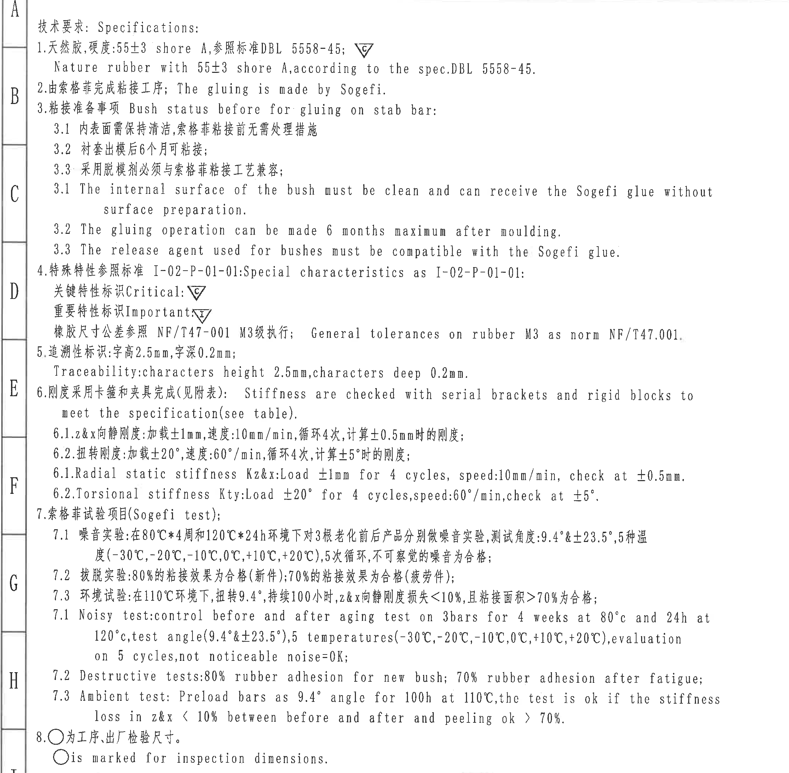

原图位置/视图名称：第 1 页左侧技术要求 NOTES 区域，bbox `[300, 170, 2530, 2355]`。

| 提取项 | 原图数值或文本 | 含义说明 |
|---|---|---|
| 标题 | 技术要求: Specifications: | 左侧说明区标题。 |
| 1 | 天然胶,硬度:55±3 shore A,参照标准 DBL 5558-45; / Nature rubber with 55±3 shore A, according to the spec.DBL 5558-45. | 材料为天然胶，硬度 55±3 Shore A，按 DBL 5558-45。旁有 Critical 三角 C 标识。 |
| 2 | 由索格菲完成粘接工序; The gluing is made by Sogefi. | 粘接工序由 Sogefi 完成。 |
| 3 | 粘接准备事项 Bush status before for gluing on stab bar: | 稳定杆粘接前衬套状态要求。 |
| 3.1 中文 | 内表面需保持清洁,索格菲粘接前无需处理措施 | 衬套内表面清洁，Sogefi 粘接前不需要额外表面处理。 |
| 3.2 中文 | 衬套出模后6个月可粘接; | 出模后最多 6 个月内可进行粘接。 |
| 3.3 中文 | 采用脱模剂必须与索格菲粘接工艺兼容; | 脱模剂需与 Sogefi 粘接工艺兼容。 |
| 3.1 English | The internal surface of the bush must be clean and can receive the Sogefi glue without surface preparation. | 英文重复说明内表面清洁和无需表面处理。 |
| 3.2 English | The gluing operation can be made 6 months maximum after moulding. | 英文重复说明出模后 6 个月内粘接。 |
| 3.3 English | The release agent used for bushes must be compatible with the Sogefi glue. | 英文重复说明脱模剂兼容性。 |
| 4 | 特殊特性参照标准 I-02-P-01-01: Special characteristics as I-02-P-01-01: | 特殊特性标识规则来源。 |
| Critical 标识 | 关键特性标识 Critical: 三角 C | 三角 C 表示关键特性。 |
| Important 标识 | 重要特性标识 Important: 三角 I | 三角 I 表示重要特性。 |
| 橡胶尺寸公差 | 橡胶尺寸公差参照 NF/T47-001 M3级执行; General tolerances on rubber M3 as norm NF/T47.001. | 未单独标注公差的橡胶尺寸按 NF/T 47-001 M3。 |
| 5 | 追溯性标识: 字高2.5mm,字深0.2mm; / Traceability: characters height 2.5mm, characters deep 0.2mm. | 追溯字符高度 2.5 mm，深度 0.2 mm。 |
| 6 | 刚度采用卡箍和夹具完成(见附表); Stiffness are checked with serial brackets and rigid blocks to meet the specification(see table). | 刚度检验使用量产卡箍和刚性块，要求见刚度表 object_9。 |
| 6.1 中文 | z&x向静刚度:加载±1mm,速度:10mm/min,循环4次,计算±0.5mm时的刚度; | 径向 z/x 静刚度测试条件。 |
| 6.2 中文 | 扭转刚度:加载±20°,速度:60°/min,循环4次,计算±5°时的刚度; | 扭转刚度测试条件。 |
| 6.1 English | Radial static stiffness Kz&x: Load ±1mm for 4 cycles, speed:10mm/min, check at ±0.5mm. | 英文重复说明径向静刚度。 |
| 6.2 English | Torsional stiffness Kty: Load ±20° for 4 cycles, speed:60°/min, check at ±5°. | 英文重复说明扭转刚度。 |
| 7 | 索格菲试验项目(Sogefi test); | Sogefi 试验项目标题。 |
| 7.1 中文 | 噪音实验: 在80℃*4周和120℃*24h环境下对3根老化前后产品分别做噪音实验,测试角度:9.4°&±23.5°,5种温度(-30℃,-20℃,-10℃,0℃,+10℃,+20℃),5次循环,不可察觉的噪音为合格; | 噪音试验条件和合格标准。原图写“5种温度”，括号内列出 6 个温度点，按原图记录。 |
| 7.2 中文 | 拔脱实验:80%的粘接效果为合格(新件);70%的粘接效果为合格(疲劳件); | 新件 80% 橡胶粘接、疲劳后 70% 橡胶粘接为合格。 |
| 7.3 中文 | 环境试验:在110℃环境下,扭转9.4°,持续100小时,z&x向静刚度损失<10%,且粘接面积>70%为合格; | 环境试验合格条件。 |
| 7.1 English | Noise test: control before and after aging test on 3bars for 4 weeks at 80℃ and 24h at 120℃, test angle(9.4°&±23.5°), 5 temperatures(-30℃,-20℃,-10℃,0℃,+10℃,+20℃), evaluation on 5 cycles, not noticeable noise=OK; | 英文重复说明噪音试验。 |
| 7.2 English | Destructive tests:80% rubber adhesion for new bush; 70% rubber adhesion after fatigue; | 英文重复说明破坏/拔脱试验。 |
| 7.3 English | Ambient test: Preload bars as 9.4° angle for 100h at 110℃, the test is ok if the stiffness loss in z&x < 10% between before and after and peeling ok > 70%. | 英文重复说明环境试验。 |
| 8 | ○为工序、出厂检验尺寸。 / ○ is marked for inspection dimensions. | 圆圈标记表示工序及出厂检验尺寸。 |

边界归属说明：该裁切仅提取左侧 NOTES 文字内容。右侧主视图尺寸标注和下方“标识内容”示意图均不归入本对象；左侧图框坐标字母 A-H/I 仅作为图框边界出现，不作为技术要求内容提取。

## object_2 - 修订履历表

裁切图片：

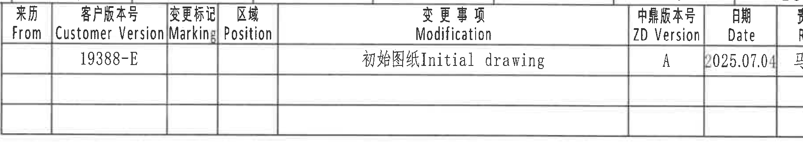

原图位置/视图名称：第 1 页右上修订履历表，bbox `[2840, 160, 4655, 490]`。

原表还原：

| 来历 From | 客户版本号 Customer Version | 变更标记 Marking | 区域 Position | 变更事项 Modification | 中鼎版本号 ZD Version | 日期 Date | 责任人 Resp. |
|---|---|---|---|---|---|---|---|
|  | 19388-E |  |  | 初始图纸 Initial drawing | A | 2025.07.04 | 马传德 |
|  |  |  |  |  |  |  |  |
|  |  |  |  |  |  |  |  |

| 提取项 | 原图数值或文本 | 含义说明 |
|---|---|---|
| 客户版本号 | 19388-E | 客户版本。 |
| 变更事项 | 初始图纸 Initial drawing | 初始发行记录。 |
| 中鼎版本号 | A | 中鼎内部版本。 |
| 日期 | 2025.07.04 | 修订/初始图日期。 |
| 责任人 | 马传德 | 责任人字段。 |

边界归属说明：裁切范围只含右上修订表网格和表内文字；右侧图框坐标栏已收掉，不提取为表格内容。

## object_3 - 主视图 / 正面加工视图

裁切图片：

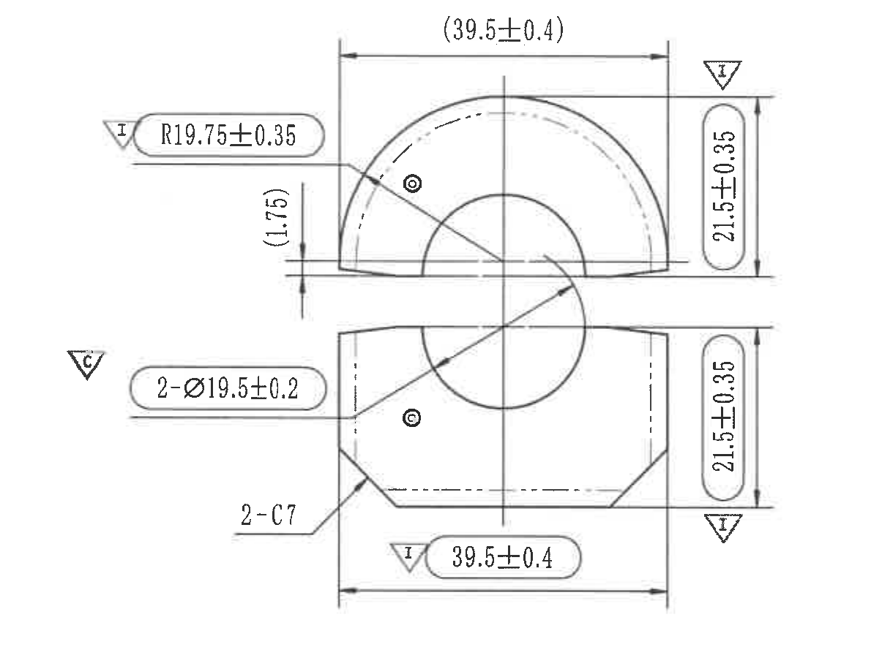

原图位置/视图名称：第 1 页中上主视图，bbox `[2530, 650, 3750, 1550]`。

| 提取项 | 原图数值或文本 | 含义说明 |
|---|---|---|
| 半圆外圆半径 | R19.75±0.35，旁有三角 I | 上半衬套外圆弧半径，公差 ±0.35；三角 I 表示重要特性。 |
| 上半宽度参考尺寸 | (39.5±0.4) | 括号内参考尺寸，表示上半件横向总宽参考，不作为直接检验主尺寸处理，但必须按图保留。 |
| 上半局部高度参考尺寸 | (1.75) | 括号内参考尺寸，位于上半件左侧台阶/开口附近，表示局部高度差参考。 |
| 上半高度 | 21.5±0.35，旁有三角 I | 上半件竖向高度尺寸，公差 ±0.35；三角 I 表示重要特性。 |
| 内孔/衬套孔直径 | 2-Ø19.5±0.2，旁有三角 C | 数量前缀 2 表示两处直径 19.5，公差 ±0.2；三角 C 表示关键特性。 |
| 下半高度 | 21.5±0.35，旁有三角 I | 下半件竖向高度尺寸，公差 ±0.35；三角 I 表示重要特性。 |
| 倒角 | 2-C7 | 两处 C7 倒角，位于下半件两侧斜角位置。 |
| 下半宽度 | 39.5±0.4，旁有三角 I | 下半件横向总宽，公差 ±0.4；三角 I 表示重要特性。 |
| 星号关键尺寸 | 未见带星号尺寸 | 本视图使用三角 C/I 进行关键/重要特性标识，未见星号。 |
| T 编号 | 未见 T 编号 | 本视图未标出 T 编号。 |
| 总高度 | 未见上下组合总高度直接标注 | 图中分别标注上半和下半 21.5±0.35，未给出跨两半件的总高度尺寸。 |

边界归属说明：本对象只提取主视图正面两半件及其相连尺寸线。左侧三角 C/I 因紧贴对应尺寸标注而保留；右侧侧视图、下方侧视图和模具侧局部图不属于本对象。

## object_4 - 右侧双侧视图

裁切图片：

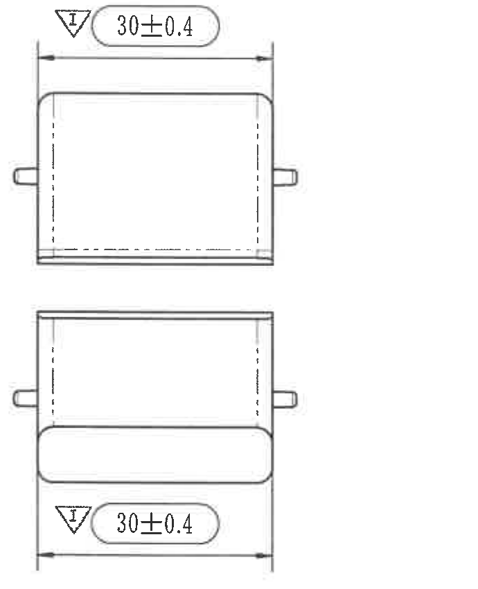

原图位置/视图名称：第 1 页右上侧向双视图，bbox `[3970, 650, 4660, 1500]`。

| 提取项 | 原图数值或文本 | 含义说明 |
|---|---|---|
| 上侧视图宽度 | 30±0.4，旁有三角 I | 上侧视图横向宽度/深度尺寸，公差 ±0.4；三角 I 表示重要特性。 |
| 下侧视图宽度 | 30±0.4，旁有三角 I | 下侧视图横向宽度/深度尺寸，公差 ±0.4；三角 I 表示重要特性。 |
| 星号关键尺寸 | 未见带星号尺寸 | 本视图未见星号标注。 |
| T 编号 | 未见 T 编号 | 本视图未标出 T 编号。 |

边界归属说明：两个 30±0.4 尺寸线均与右侧双侧视图相连，只归属于本对象；不归入中间主视图 object_3。

## object_5 - 下方侧视图 / 圆角与销柱尺寸视图

裁切图片：

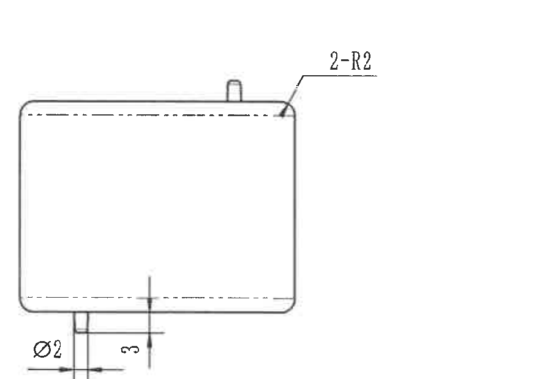

原图位置/视图名称：第 1 页中下侧视图，bbox `[2960, 1500, 3850, 2120]`。

| 提取项 | 原图数值或文本 | 含义说明 |
|---|---|---|
| 圆角 | 2-R2 | 两处 R2 圆角， leader 指向右上圆角区域。未单独标注公差，按 NOTES 中 NF/T47-001 M3 通用公差理解。 |
| 小圆柱/孔径 | Ø2 | 直径 2 的小圆柱/孔特征，位于下方突出部附近。 |
| 局部高度 | 3 | 竖向尺寸 3，标注在下方突出部附近。 |
| 星号关键尺寸 | 未见带星号尺寸 | 本视图未见星号标注。 |
| T 编号 | 未见 T 编号 | 本视图未标出 T 编号。 |

边界归属说明：该裁切只包含下方侧视轮廓、圆角 leader 和 Ø2/3 尺寸线；右侧模具侧局部视图不属于本对象。

## object_6 - 局部视图 / Mould lower side

裁切图片：

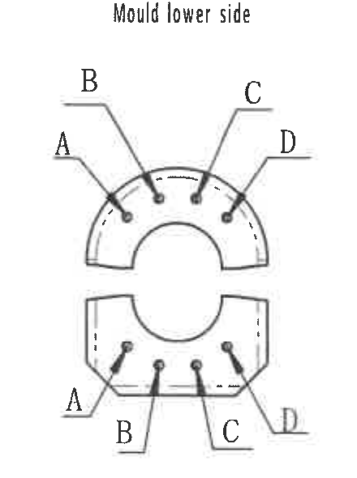

原图位置/视图名称：第 1 页右中局部视图“Mould lower side”，bbox `[3860, 1660, 4300, 2250]`。

| 提取项 | 原图数值或文本 | 含义说明 |
|---|---|---|
| 视图标题 | Mould lower side | 模具下侧对应的打点/孔位标识图。 |
| 上半标识 | A、B、C、D | 上半件四个引线位置标识，指向对应小圆点/位置。 |
| 下半标识 | A、B、C、D | 下半件四个引线位置标识，指向对应小圆点/位置。 |
| 数值尺寸 | 未见数值尺寸 | 本局部图只给出 A/B/C/D 位置标签，没有尺寸数值、公差或角度。 |
| T 编号 | 未见 T 编号 | 本局部图未标出 T 编号。 |

边界归属说明：该裁切只提取“Mould lower side”局部图中的 A/B/C/D 位置标签；相邻“Mould upper side”不归入本对象。

## object_7 - 局部视图 / Mould upper side

裁切图片：

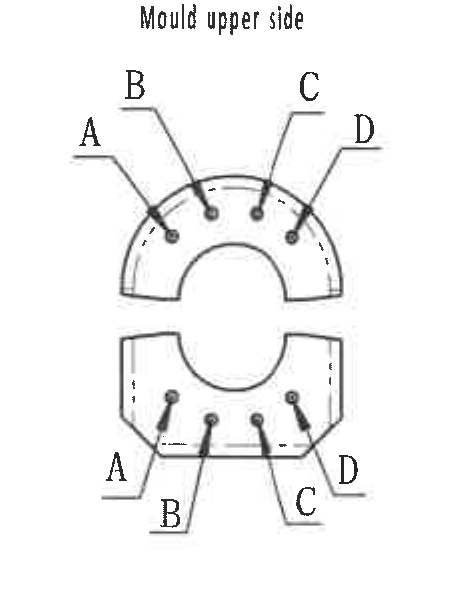

原图位置/视图名称：第 1 页右中局部视图“Mould upper side”，bbox `[4280, 1660, 4735, 2250]`。

| 提取项 | 原图数值或文本 | 含义说明 |
|---|---|---|
| 视图标题 | Mould upper side | 模具上侧对应的打点/孔位标识图。 |
| 上半标识 | A、B、C、D | 上半件四个引线位置标识，指向对应小圆点/位置。 |
| 下半标识 | A、B、C、D | 下半件四个引线位置标识，指向对应小圆点/位置。 |
| 数值尺寸 | 未见数值尺寸 | 本局部图只给出 A/B/C/D 位置标签，没有尺寸数值、公差或角度。 |
| T 编号 | 未见 T 编号 | 本局部图未标出 T 编号。 |

边界归属说明：该裁切只提取“Mould upper side”局部图中的 A/B/C/D 位置标签；右侧图框坐标栏已排除，左侧“Mould lower side”不归入本对象。

## object_8 - 标识内容局部示意

裁切图片：

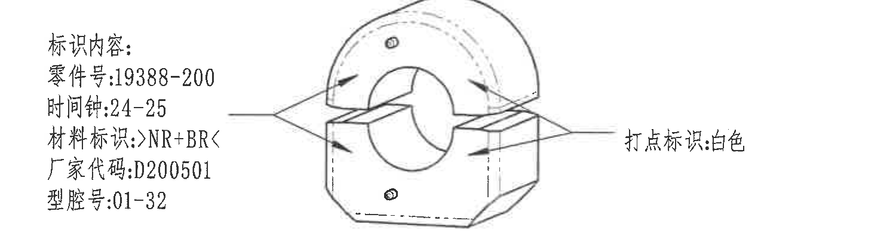

原图位置/视图名称：第 1 页左下标识内容示意，bbox `[900, 2370, 2400, 2790]`。

| 提取项 | 原图数值或文本 | 含义说明 |
|---|---|---|
| 标题 | 标识内容: | 标识内容清单。 |
| 零件号 | 19388-200 | 标记在零件上的零件号。 |
| 时间钟 | 24-25 | 时间钟标识范围/代码。 |
| 材料标识 | >NR+BR< | 材料标识内容。 |
| 厂家代码 | D200501 | 厂家代码。 |
| 型腔号 | 01-32 | 型腔号范围。 |
| 打点标识 | 白色 | 右侧箭头说明打点标识颜色为白色。 |

边界归属说明：该对象为标识内容示意及其箭头说明；下方刚度要求表不属于本对象。

## object_9 - 刚度要求表 / Stiffness requirement

裁切图片：

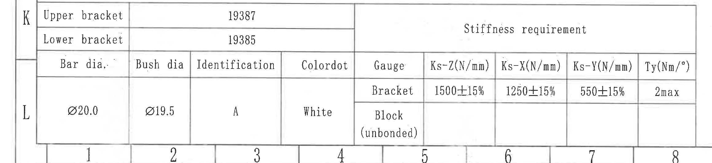

原图位置/视图名称：第 1 页左下刚度要求表，bbox `[250, 2860, 2570, 3395]`。

原表还原：

|  |  |  |  |  | Stiffness requirement |  |  |  |
|---|---|---|---|---|---|---|---|---|
| Upper bracket | 19387 |  |  |  |  |  |  |  |
| Lower bracket | 19385 |  |  |  |  |  |  |  |
| Bar dia, | Bush dia | Identification | Colordot | Gauge | Ks-Z(N/mm) | Ks-X(N/mm) | Ks-Y(N/mm) | Ty(Nm/°) |
| Ø20.0 | Ø19.5 | A | White | Bracket | 1500±15% | 1250±15% | 550±15% | 2max |
| Ø20.0 | Ø19.5 | A | White | Block (unbonded) |  |  |  |  |

| 提取项 | 原图数值或文本 | 含义说明 |
|---|---|---|
| Upper bracket | 19387 | 上卡箍编号。 |
| Lower bracket | 19385 | 下卡箍编号。 |
| Bar dia, | Ø20.0 | 稳定杆直径。 |
| Bush dia | Ø19.5 | 衬套直径。 |
| Identification | A | 标识代码。 |
| Colordot | White | 色点为白色。 |
| Gauge | Bracket / Block (unbonded) | 用卡箍和未粘接块进行刚度检测。 |
| Ks-Z(N/mm) | 1500±15% | Z 向刚度要求。 |
| Ks-X(N/mm) | 1250±15% | X 向刚度要求。 |
| Ks-Y(N/mm) | 550±15% | Y 向刚度要求。 |
| Ty(Nm/°) | 2max | 扭转刚度/扭矩角度要求最大 2。 |

边界归属说明：裁切完整包含刚度要求表的表头、编号行和两行 Gauge；左侧图框坐标字母 K/L 只是表格所在区位，不作为数据字段。

## object_10 - 一般公差表 / NF/T 47-001 CLASS M3

裁切图片：

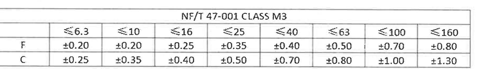

原图位置/视图名称：第 1 页右下方一般公差表，bbox `[2770, 2470, 4650, 2735]`。

原表还原：

| NF/T 47-001 CLASS M3 | ≤6.3 | ≤10 | ≤16 | ≤25 | ≤40 | ≤63 | ≤100 | ≤160 |
|---|---|---|---|---|---|---|---|---|
| F | ±0.20 | ±0.20 | ±0.25 | ±0.35 | ±0.40 | ±0.50 | ±0.70 | ±0.80 |
| C | ±0.25 | ±0.35 | ±0.40 | ±0.50 | ±0.70 | ±0.80 | ±1.00 | ±1.30 |

| 提取项 | 原图数值或文本 | 含义说明 |
|---|---|---|
| 公差标准 | NF/T 47-001 CLASS M3 | NOTES 中引用的橡胶尺寸通用公差表。 |
| F 行 | ≤6.3: ±0.20; ≤10: ±0.20; ≤16: ±0.25; ≤25: ±0.35; ≤40: ±0.40; ≤63: ±0.50; ≤100: ±0.70; ≤160: ±0.80 | F 级/行的尺寸范围公差。 |
| C 行 | ≤6.3: ±0.25; ≤10: ±0.35; ≤16: ±0.40; ≤25: ±0.50; ≤40: ±0.70; ≤63: ±0.80; ≤100: ±1.00; ≤160: ±1.30 | C 级/行的尺寸范围公差。 |

边界归属说明：该对象只包含 NF/T 47-001 CLASS M3 公差矩阵；下方标题栏字段不归入本对象。

## object_11 - 标题栏

裁切图片：

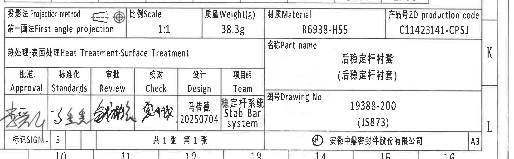

原图位置/视图名称：第 1 页右下标题栏，bbox `[2740, 2715, 4900, 3385]`。

| 提取项 | 原图数值或文本 | 含义说明 |
|---|---|---|
| 投影法 | 第一画法 First angle projection | 第一角投影。 |
| 比例 Scale | 1:1 | 图样比例。 |
| 质量 Weight(g) | 38.3g | 零件质量。 |
| 材质 Material | R6938-H55 | 材料牌号/材料代码。 |
| 产品号 ZD production code | C11423141-CPSJ | 中鼎产品号。 |
| 热处理/表面处理 | 热处理:表面处理 Heat Treatment;Surface Treatment，值为空 | 表头存在，未填写具体处理值。 |
| 名称 Part name | 后稳定杆衬套 / (后稳定杆衬套) | 零件名称。 |
| 图号 Drawing No | 19388-200 / (JS873) | 图号及括号内项目/平台代码。 |
| Approval | 手写签名，难以辨认 | 批准签名栏。 |
| Standards | 手写签名，难以辨认 | 标准化签名栏。 |
| Review | 手写签名，难以辨认 | 审批/审核签名栏。 |
| Check | 手写签名，难以辨认 | 校对签名栏。 |
| Design | 马传德 / 20250704 | 设计人员与日期。 |
| Team | 稳定杆系统 Stab Bar system | 项目组。 |
| SIG | S | 标记栏显示 S。 |
| 页数 | 共1张 第1张 | 本图共 1 张，第 1 张。 |
| 公司 | 安徽中鼎密封件股份有限公司 | 出图公司。 |
| 图幅 | A3 | 图纸幅面。 |

边界归属说明：该裁切为右下标题栏和签署栏；上方一般公差表不归入标题栏数据。右侧 K/L 图框坐标字母仅为边框坐标，不作为标题栏字段。

## 裁切检查记录

| 对象 | 检查结论 | 边界/完整性记录 |
|---|---|---|
| object_1 NOTES | 通过 | 文字行完整，包含第 8 条中文和英文说明；未提取下方标识示意图。 |
| object_2 修订履历表 | 通过 | 表头、有效行和空白行网格完整；右侧图框坐标栏已排除。 |
| object_3 主视图 | 通过 | R19.75±0.35、(39.5±0.4)、(1.75)、2-Ø19.5±0.2、2-C7、21.5±0.35、39.5±0.4 等尺寸线和文字完整；无侧视图片段混入。 |
| object_4 右侧双侧视图 | 通过 | 两个 30±0.4 尺寸线、箭头和三角 I 标识完整；未归入主视图。 |
| object_5 下方侧视图 | 通过 | 2-R2、Ø2、3 三处尺寸及 leader/箭头完整；未带入右侧模具局部图。 |
| object_6 Mould lower side | 通过 | 标题和 A/B/C/D 引线完整；未带入 Mould upper side。 |
| object_7 Mould upper side | 通过 | 标题和 A/B/C/D 引线完整；右侧图框线已排除。 |
| object_8 标识内容局部示意 | 通过 | 标识文字、零件示意和“打点标识:白色”箭头完整；未带入刚度表。 |
| object_9 刚度要求表 | 通过 | 表头、Upper/Lower bracket、Gauge 两行和刚度值完整；只保留表格区域。 |
| object_10 一般公差表 | 通过 | NF/T 47-001 CLASS M3 标题、F/C 行和所有范围列完整；未带入标题栏字段。 |
| object_11 标题栏 | 通过 | 投影法、比例、质量、材料、产品号、名称、图号、签署栏、页数、公司和 A3 完整；不提取上方公差表。 |
