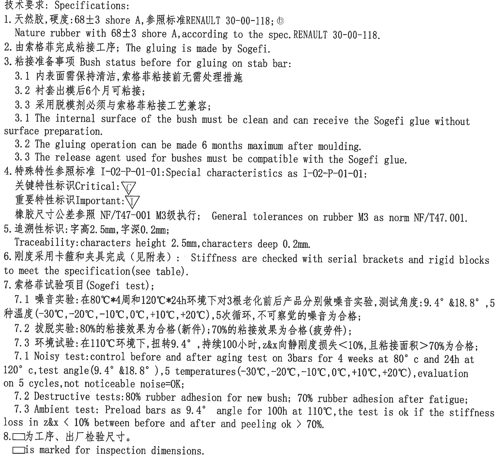
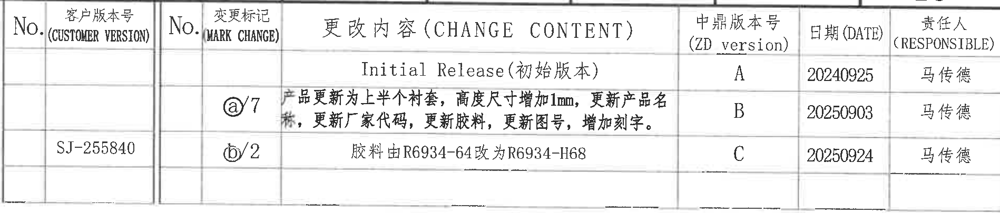
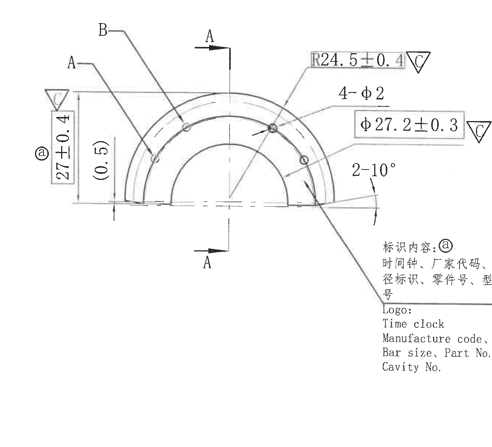
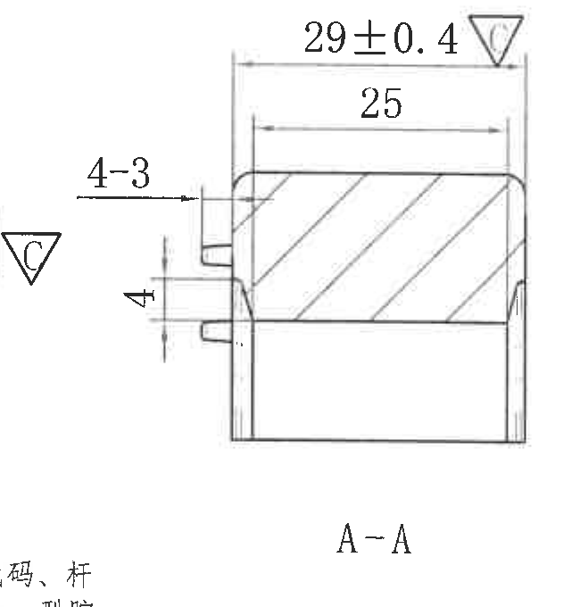
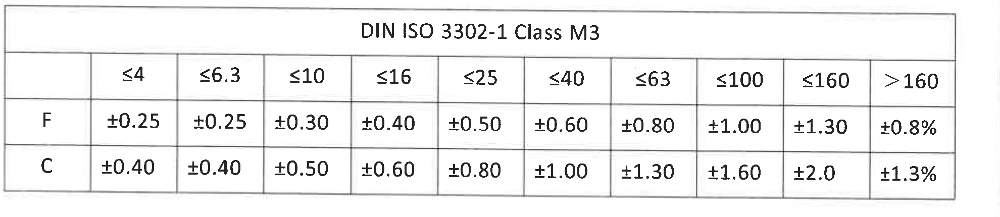
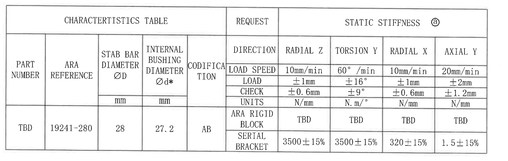
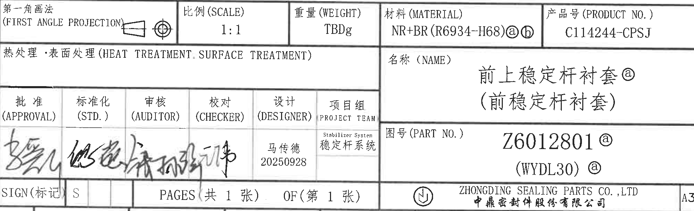
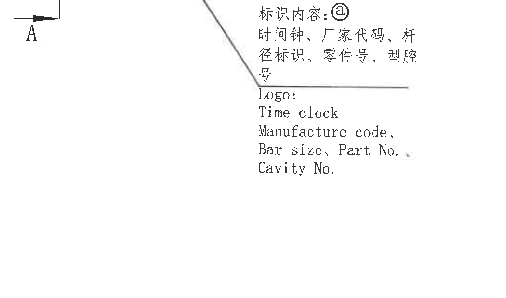

# 20C114244 内容识别与裁切提取

源文件：`input/20C114244.pdf`  
整页渲染图：`outputs/20C114244_assets/images/page_1.png`  
页面尺寸：4959 x 3505 px，bbox `[0, 0, 4959, 3505]`

## object_1 - NOTES / 技术要求

| 项目 | 内容 |
|---|---|
| object_kind | notes |
| 原图位置/视图名称 | 左上至左中 NOTES / Specifications，bbox `[455, 250, 2685, 2310]` |

| 提取项 | 原图数值或文本 | 含义说明 |
|---|---|---|
| 标题 | 技术要求: Specifications: | 图纸技术要求区。 |
| 1 | 天然胶,硬度: 68±3 shore A, 参照标准 RENAULT 30-00-118; ⓑ | 材料为天然胶，硬度 68±3 Shore A，按 RENAULT 30-00-118；ⓑ为变更标识。 |
| 1 英文 | Nature rubber with 68±3 shore A, according to the spec. RENAULT 30-00-118. | 上一条英文说明。 |
| 2 | 由索格菲完成粘接工序; The gluing is made by Sogefi. | 粘接工序由 Sogefi 完成。 |
| 3 | 粘接准备事项 Bush status before for gluing on stab bar: | 衬套粘接到稳定杆前的状态要求。 |
| 3.1 | 内表面需保持清洁, 索格菲粘接前无需处理措施 | 内表面清洁即可，无需额外表面处理。 |
| 3.2 | 衬套出模后6个月可粘接; | 出模后最多 6 个月内可粘接。 |
| 3.3 | 采用脱模剂必须与索格菲粘接工艺兼容; | 脱模剂须兼容 Sogefi 粘接工艺。 |
| 3.1 英文 | The internal surface of the bush must be clean and can receive the Sogefi glue without surface preparation. | 对 3.1 的英文说明。 |
| 3.2 英文 | The gluing operation can be made 6 months maximum after moulding. | 对 3.2 的英文说明。 |
| 3.3 英文 | The release agent used for bushes must be compatible with the Sogefi glue. | 对 3.3 的英文说明。 |
| 4 | 特殊特性参照标准 I-02-P-01-01: Special characteristics as I-02-P-01-01: | 特殊特性标识按 I-02-P-01-01。 |
| Critical 标识 | 关键特性标识 Critical: △C | 图中三角形 C 表示关键特性。 |
| Important 标识 | 重要特性标识 Important: △I | 图中三角形 I 表示重要特性。 |
| 橡胶尺寸公差 | 橡胶尺寸公差参照 NF/T47-001 M3级执行; General tolerances on rubber M3 as norm NF/T47.001. | 橡胶尺寸公差按 NF/T47-001 M3。 |
| 5 | 追溯性标识: 字高2.5mm, 字深0.2mm; Traceability: characters height 2.5mm, characters deep 0.2mm. | 追溯性字符高度 2.5 mm，深度 0.2 mm。 |
| 6 | 刚度采用卡箍和夹具完成（见附表）: Stiffness are checked with serial brackets and rigid blocks to meet the specification (see table). | 静刚度用卡箍和刚性块检查，规格见特性表。 |
| 7 | 索格菲试验项目 (Sogefi test); | Sogefi 试验项目标题。 |
| 7.1 中文 | 噪音实验: 在80℃*4周和120℃*24h环境下对3根老化前后产品分别做噪音实验, 测试角度: 9.4° &18.8°, 5种温度(-30℃,-20℃,-10℃,0℃,+10℃,+20℃), 5次循环, 不可察觉的噪音为合格; | 噪音试验条件、角度、温度循环与合格判据。 |
| 7.2 中文 | 拔脱实验: 80%的粘接效果为合格(新件); 70%的粘接效果为合格(疲劳件); | 拔脱/破坏试验粘接面积合格判据。 |
| 7.3 中文 | 环境试验: 在110℃环境下, 扭转9.4°, 持续100小时, z&x向静刚度损失<10%, 且粘接面积>70%为合格; | 环境试验条件与静刚度、粘接面积判据。 |
| 7.1 英文 | Noisy test: control before and after aging test on 3 bars for 4 weeks at 80°c and 24h at 120°c, test angle (9.4° &18.8°), 5 temperatures (-30℃,-20℃,-10℃,0℃,+10℃,+20℃), evaluation on 5 cycles, not noticeable noise=OK; | 中文 7.1 对应英文说明。 |
| 7.2 英文 | Destructive tests: 80% rubber adhesion for new bush; 70% rubber adhesion after fatigue; | 中文 7.2 对应英文说明。 |
| 7.3 英文 | Ambient test: Preload bars as 9.4° angle for 100h at 110℃, the test is ok if the stiffness loss in z&x < 10% between before and after and peeling ok > 70%. | 中文 7.3 对应英文说明。 |
| 8 | □为工序、出厂检验尺寸。□ is marked for inspection dimensions. | 方框标识为工序、出厂检验尺寸。 |

边界归属说明：该裁切只包含 NOTES 文本区，未带入右侧加工视图、下方特性表或标题栏。所有文本均归属于 NOTES。

## object_2 - 修订履历表

| 项目 | 内容 |
|---|---|
| object_kind | table |
| 原图位置/视图名称 | 右上修订履历表，bbox `[2915, 185, 4813, 590]` |

| No. | 客户版本号 (CUSTOMER VERSION) | No. | 变更标记 (MARK CHANGE) | 更改内容 (CHANGE CONTENT) | 中鼎版本号 (ZD version) | 日期 (DATE) | 责任人 (RESPONSIBLE) |
|---|---|---|---|---|---|---|---|
|  |  |  |  | Initial Release (初始版本) | A | 20240925 | 马传德 |
|  |  |  | ⓐ/7 | 产品更新为上半个衬套，高度尺寸增加1mm，更新产品名称，更新厂家代码，更新胶料，更新图号，增加刻字。 | B | 20250903 | 马传德 |
|  | SJ-255840 |  | ⓑ/2 | 胶料由R6934-64改为R6934-H68 | C | 20250924 | 马传德 |

| 提取项 | 原图数值或文本 | 含义说明 |
|---|---|---|
| A 版 | Initial Release (初始版本), 20240925, 马传德 | 初始发布。 |
| B 版 | ⓐ/7, 20250903 | 更新上半个衬套、高度尺寸增加 1 mm，并更新产品名称、厂家代码、胶料、图号、刻字。 |
| C 版 | ⓑ/2, SJ-255840, 20250924 | 胶料由 R6934-64 改为 R6934-H68。 |

边界归属说明：裁切去除了上方图框坐标编号，只保留修订表外框及表内行列。右侧图框分区字母未作为表格字段提取。

## object_3 - 主加工视图 / 半圆衬套视图

| 项目 | 内容 |
|---|---|
| object_kind | view |
| 原图位置/视图名称 | 右上主加工视图，含半圆衬套、孔位、弧半径、A-A 剖切指示和标识内容引出说明，bbox `[2760, 730, 4080, 1930]` |

| 提取项 | 原图数值或文本 | 含义说明 |
|---|---|---|
| 总高/外侧高度尺寸 | ⓐ 27±0.4，旁有 △C | 主视图左侧竖向尺寸，带变更标识 ⓐ；△C 表示关键特性。 |
| 参考尺寸 | (0.5) | 括号内参考尺寸，位于左侧竖向尺寸内侧，用于说明局部台阶/基准间距参考，不作为主控尺寸。 |
| 弧向/半径尺寸 | R24.5±0.4，旁有 △C | 半圆外侧弧半径尺寸，关键特性。 |
| 孔数量与直径 | 4-φ2 | 4 个直径 φ2 的孔/圆形特征。 |
| 直径尺寸 | φ27.2±0.3，旁有 △C | 主视图中衬套内径/圆弧对应直径，关键特性。 |
| 角度尺寸 | 2-10° | 两处 10° 角度/倒角类角度标注，位于主视图右下端。 |
| 特征字母 | A、B | 引出线分别指向主视图上的局部特征。 |
| 剖切标识 | A-A，两个 A 方向箭头 | 该主视图给出 A-A 剖面位置和方向；剖面尺寸不归入主视图，见 object_4。 |
| 标识内容 | 标识内容: ⓐ 时间钟、厂家代码、杆径标识、零件号、型腔号 | 引出线指向主视图下侧刻字/标识区域，ⓐ为变更标记。 |
| 英文标识内容 | Logo: Time clock / Manufacture code, / Bar size, Part No., / Cavity No. | 对标识内容的英文列示。 |
| T 编号 | 未见 T 编号 | 此主视图中未出现 T 编号。 |
| 公差来源 | 尺寸自带 ±0.4、±0.3；无单独公差的 4-φ2、2-10°按图纸 NOTES 与公差表约束 | 图中明确标注的公差优先；未标公差参考 object_5 和 NOTES。 |

边界归属说明：主视图裁切完整包含半圆视图尺寸线、箭头、标注文字和标识内容引出说明。右侧 A-A 剖面图未包含在本对象中；A-A 的 29±0.4、25、4-3、4 只在 object_4 提取。

## object_4 - A-A 剖面视图

| 项目 | 内容 |
|---|---|
| object_kind | section |
| 原图位置/视图名称 | 右上 A-A 剖面视图，bbox `[4010, 795, 4660, 1475]` |

| 提取项 | 原图数值或文本 | 含义说明 |
|---|---|---|
| 剖面名称 | A-A | 与主视图中的 A-A 剖切箭头对应。 |
| 外宽/剖面总宽 | 29±0.4，旁有 △C | 剖面上方外侧水平总宽，关键特性。 |
| 内宽 | 25 | 剖面上方内侧水平宽度；未单独标注公差，按通用公差表处理。 |
| 数量/局部尺寸 | 4-3 | 左侧凸台/槽类局部尺寸，表示 4 处尺寸 3。 |
| 竖向局部尺寸 | 4 | 左侧局部台阶或凸台高度/间距尺寸。 |
| 剖面填充 | 斜线剖面线 | 表示被剖切的实体材料区域。 |
| T 编号 | 未见 T 编号 | 此剖面中未出现 T 编号。 |
| 公差来源 | 29±0.4 为直接标注；25、4-3、4 未见单独公差 | 未单独标注公差的尺寸按 object_5 的 DIN ISO 3302-1 Class M3 表及 NOTES 总要求解释。 |

边界归属说明：为保留 `4-3` 的完整箭头和尺寸线，左侧保留了邻近主视图的 △C 和少量文字边缘；这些残片不属于 A-A 剖面提取项。A-A 剖面只提取表中列出的 29±0.4、25、4-3、4 和剖面名称。

## object_5 - DIN ISO 3302-1 Class M3 公差表

| 项目 | 内容 |
|---|---|
| object_kind | table |
| 原图位置/视图名称 | 右中 DIN ISO 3302-1 Class M3 公差表，bbox `[2825, 2055, 4805, 2485]` |

| DIN ISO 3302-1 Class M3 | ≤4 | ≤6.3 | ≤10 | ≤16 | ≤25 | ≤40 | ≤63 | ≤100 | ≤160 | >160 |
|---|---|---|---|---|---|---|---|---|---|---|
| F | ±0.25 | ±0.25 | ±0.30 | ±0.40 | ±0.50 | ±0.60 | ±0.80 | ±1.00 | ±1.30 | ±0.8% |
| C | ±0.40 | ±0.40 | ±0.50 | ±0.60 | ±0.80 | ±1.00 | ±1.30 | ±1.60 | ±2.0 | ±1.3% |

| 提取项 | 原图数值或文本 | 含义说明 |
|---|---|---|
| 标准 | DIN ISO 3302-1 Class M3 | 橡胶尺寸通用公差等级 M3。 |
| F 行 | ±0.25 至 ±1.30，>160 为 ±0.8% | F 类尺寸公差。 |
| C 行 | ±0.40 至 ±2.0，>160 为 ±1.3% | C 类尺寸公差。 |

边界归属说明：裁切完整包含公差表表头、两行数据和外框，未混入上方视图或下方标题栏。

## object_6 - CHARACTERISTICS TABLE / 静刚度特性表

| 项目 | 内容 |
|---|---|
| object_kind | table |
| 原图位置/视图名称 | 左下 CHARACTERISTICS TABLE、REQUEST、STATIC STIFFNESS ⓐ，bbox `[480, 2580, 2740, 3300]` |

| CHARACTERISTICS TABLE |  |  |  |  | REQUEST | STATIC STIFFNESS ⓐ |  |  |  |
|---|---|---|---|---|---|---|---|---|---|
| PART NUMBER | ARA REFERENCE | STAB BAR DIAMETER ØD | INTERNAL BUSHING DIAMETER Ød* | CODIFICATION | DIRECTION | RADIAL Z | TORSION Y | RADIAL X | AXIAL Y |
|  |  | mm | mm |  | LOAD SPEED | 10mm/min | 60°/min | 10mm/min | 20mm/min |
|  |  |  |  |  | LOAD | ±1mm | ±16° | ±1mm | ±2mm |
|  |  |  |  |  | CHECK | ±0.6mm | ±9° | ±0.6mm | ±1.2mm |
|  |  |  |  |  | UNITS | N/mm | N.m/° | N/mm | N/mm |
| TBD | 19241-280 | 28 | 27.2 | AB | ARA RIGID BLOCK | TBD | TBD | TBD | TBD |
| TBD | 19241-280 | 28 | 27.2 | AB | SERIAL BRACKET | 3500±15% | 3500±15% | 320±15% | 1.5±15% |

| 提取项 | 原图数值或文本 | 含义说明 |
|---|---|---|
| PART NUMBER | TBD | 零件号/特性表项目待定。 |
| ARA REFERENCE | 19241-280 | ARA 参考号。 |
| STAB BAR DIAMETER ØD | 28 mm | 稳定杆直径。 |
| INTERNAL BUSHING DIAMETER Ød* | 27.2 mm | 衬套内径；`*` 为星号标识，需重点关注。 |
| CODIFICATION | AB | 编码。 |
| RADIAL Z | 10mm/min; LOAD ±1mm; CHECK ±0.6mm; UNITS N/mm; ARA RIGID BLOCK TBD; SERIAL BRACKET 3500±15% | Z 向径向静刚度要求。 |
| TORSION Y | 60°/min; LOAD ±16°; CHECK ±9°; UNITS N.m/°; ARA RIGID BLOCK TBD; SERIAL BRACKET 3500±15% | Y 向扭转静刚度要求。 |
| RADIAL X | 10mm/min; LOAD ±1mm; CHECK ±0.6mm; UNITS N/mm; ARA RIGID BLOCK TBD; SERIAL BRACKET 320±15% | X 向径向静刚度要求。 |
| AXIAL Y | 20mm/min; LOAD ±2mm; CHECK ±1.2mm; UNITS N/mm; ARA RIGID BLOCK TBD; SERIAL BRACKET 1.5±15% | Y 向轴向静刚度要求。 |

边界归属说明：裁切包含完整特性表外框、表头、单位行和两类夹具行；未带入下方标题栏或左侧图框坐标。表内 `Ød*` 的星号保留并在提取项中说明。

## object_7 - 标题栏

| 项目 | 内容 |
|---|---|
| object_kind | title_block |
| 原图位置/视图名称 | 右下标题栏，bbox `[2790, 2775, 4790, 3385]` |

| 标题栏字段 | 原图数值或文本 | 含义说明 |
|---|---|---|
| 投影法 | 第一角画法 (FIRST ANGLE PROJECTION) | 图纸投影视角。 |
| 比例 (SCALE) | 1:1 | 图纸比例。 |
| 重量 (WEIGHT) | TBDg | 重量待定。 |
| 材料 (MATERIAL) | NR+BR(R6934-H68)ⓐⓑ | 材料为 NR+BR，胶料 R6934-H68，带 ⓐⓑ 修订标识。 |
| 产品号 (PRODUCT NO.) | C114244-CPSJ | 产品号。 |
| 热处理·表面处理 | HEAT TREATMENT. SURFACE TREATMENT | 该栏未见具体数值填写。 |
| 名称 (NAME) | 前上稳定杆衬套ⓐ / (前稳定杆衬套) | 零件名称及括号内名称。 |
| 批准 (APPROVAL) | 手写签名 | 批准签字栏。 |
| 标准化 (STD.) | 手写签名 | 标准化签字栏。 |
| 审核 (AUDITOR) | 手写签名 | 审核签字栏。 |
| 校对 (CHECKER) | 手写签名 | 校对签字栏。 |
| 设计 (DESIGNER) | 马传德 / 20250928 | 设计人员和日期。 |
| 项目组 (PROJECT TEAM) | Stabilizer System / 稳定杆系统 | 项目组。 |
| 图号 (PART NO.) | Z6012801ⓐ / (WYDL30)ⓐ | 图号和括号内代号，均带 ⓐ 修订标识。 |
| SIGN(标记) | S | 标记。 |
| PAGES | 共 1 张 / OF 第 1 张 | 页码信息。 |
| 公司 | ZHONGDING SEALING PARTS CO., LTD / 中鼎密封件股份有限公司 | 出图公司。 |
| 图幅 | A3 | 图纸幅面。 |

边界归属说明：标题栏裁切完整包含标题栏字段、公司栏、页码栏和 A3 格。右侧/底部接近图框处有少量外框边缘，为保留 A3 与公司栏完整性而保留；这些外框边缘不作为标题栏字段提取。

## object_8 - 局部标识内容说明

| 项目 | 内容 |
|---|---|
| object_kind | detail |
| 原图位置/视图名称 | 主视图下方标识内容局部说明，bbox `[3250, 1365, 4300, 1985]` |

| 提取项 | 原图数值或文本 | 含义说明 |
|---|---|---|
| 局部标识内容 | 标识内容: ⓐ | 与主视图引出线对应的刻字/标识内容说明。 |
| 中文项目 | 时间钟、厂家代码、杆径标识、零件号、型腔号 | 需在零件上体现的追溯性内容。 |
| 英文项目 | Logo; Time clock; Manufacture code; Bar size, Part No.; Cavity No. | 中文标识内容的英文列示。 |
| 关联标识 | ⓐ | 与修订履历 B 版及标题栏相关字段一致的变更标识。 |

边界归属说明：该对象为主视图引出线末端的局部标识说明，部分引出线与主视图共享；本对象只提取标识文字，不提取主视图尺寸。

## 裁切检查记录

| 对象 | 图片路径 | bbox | 检查结论 |
|---|---|---|---|
| page_1 | outputs/20C114244_assets/images/page_1.png | `[0, 0, 4959, 3505]` | 整页 PNG 渲染完整。 |
| object_1 | outputs/20C114244_assets/images/object_1.png | `[455, 250, 2685, 2310]` | NOTES 文本完整，未截断文字，未混入视图。 |
| object_2 | outputs/20C114244_assets/images/object_2.png | `[2915, 185, 4813, 590]` | 修订表表头和三条记录完整；上方坐标行已排除。 |
| object_3 | outputs/20C114244_assets/images/object_3.png | `[2760, 730, 4080, 1930]` | 主视图尺寸线、箭头、文字完整；A-A 剖面尺寸未纳入提取。 |
| object_4 | outputs/20C114244_assets/images/object_4.png | `[4010, 795, 4660, 1475]` | A-A 剖面主体和尺寸完整；左侧保留少量邻近 △C/文字边缘以避免切断 `4-3` 尺寸线，未作为剖面内容提取。 |
| object_5 | outputs/20C114244_assets/images/object_5.png | `[2825, 2055, 4805, 2485]` | 公差表完整，未带入相邻视图或标题栏。 |
| object_6 | outputs/20C114244_assets/images/object_6.png | `[480, 2580, 2740, 3300]` | 特性表完整，表头、单位、数据行均完整。 |
| object_7 | outputs/20C114244_assets/images/object_7.png | `[2790, 2775, 4790, 3385]` | 标题栏字段完整；右/下边缘少量图框线保留但不提取为标题栏字段。 |
| object_8 | outputs/20C114244_assets/images/object_8.png | `[3250, 1365, 4300, 1985]` | 标识内容文字完整；与主视图共享的引出线只作边界关系说明。 |
