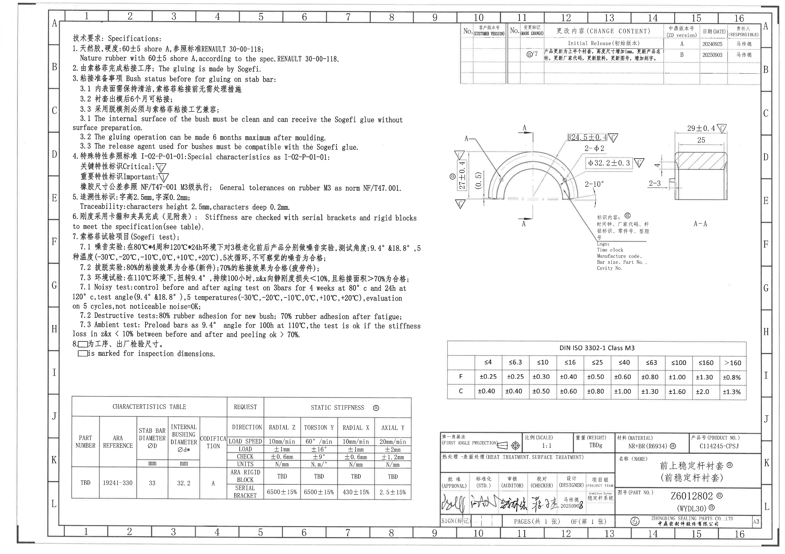
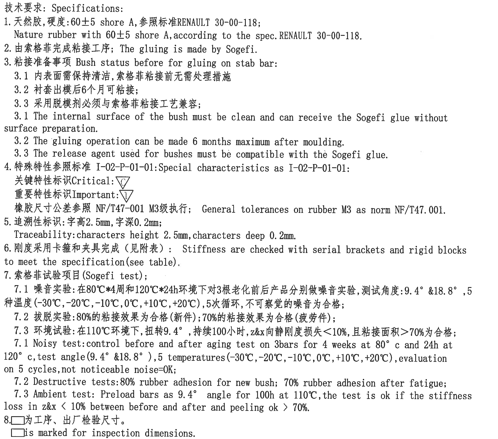
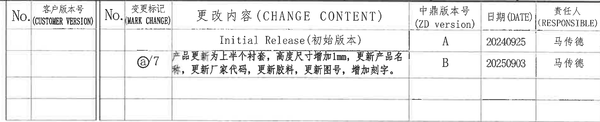
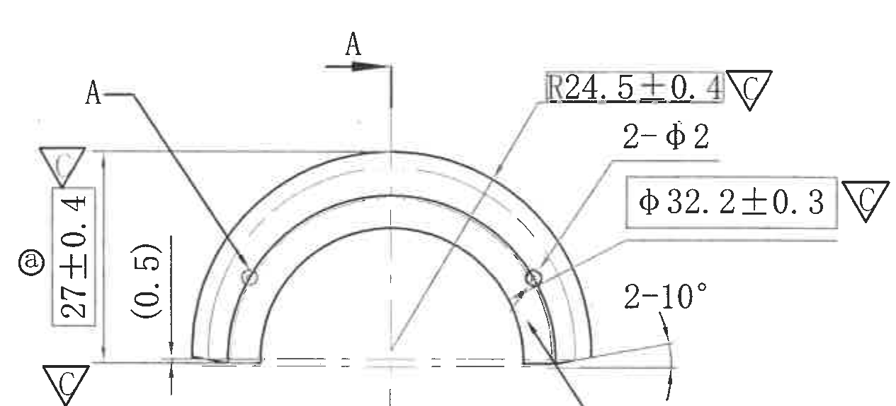
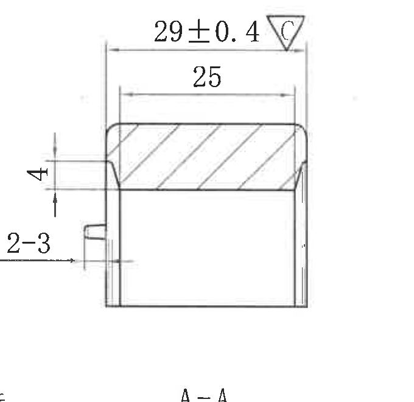
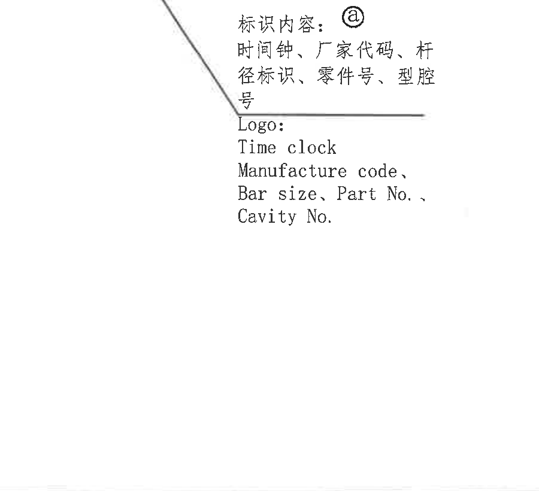
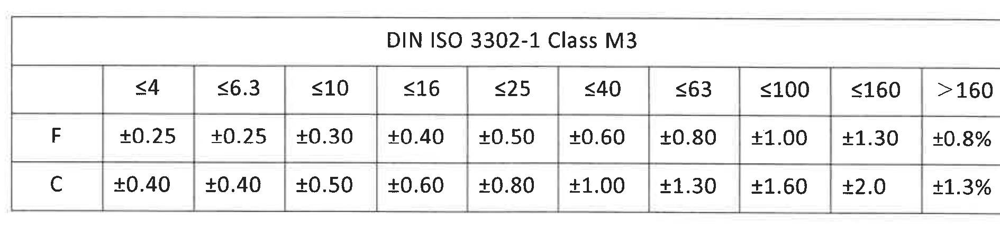
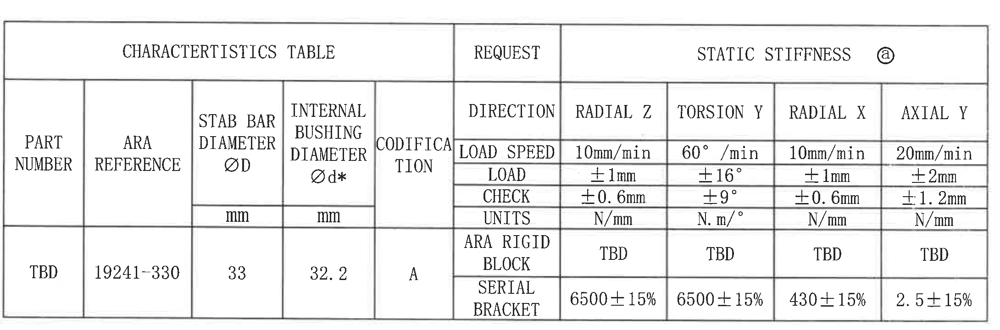
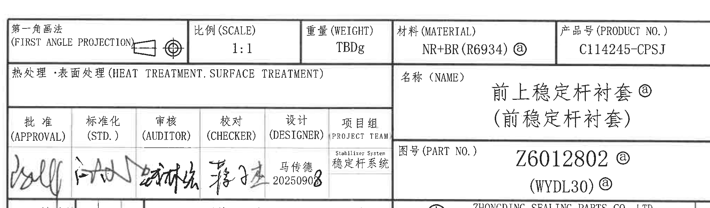
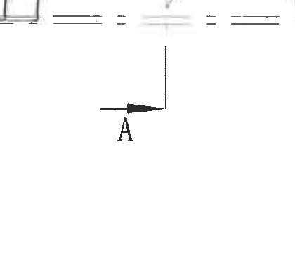

# 20C114245 PDF 内容识别

整页渲染图：`outputs/20C114245_assets/images/page_1.png`  
页面尺寸：4959 x 3505 px

## object_1 - NOTES / 技术要求

原图位置/视图名称：左上技术要求与 NOTES 区域，bbox `[440, 205, 2780, 2265]`。

| 提取项 | 原图数值或文本 | 含义说明 |
|---|---|---|
| 标题 | 技术要求: Specifications: | 本区域为零件材料、粘接、特殊特性、追溯性、刚度检查与试验要求。 |
| 1 | 天然胶，硬度:60±5 shore A, 参照标准RENAULT 30-00-118; Nature rubber with 60±5 shore A, according to the spec.RENAULT 30-00-118. | 材料为天然胶；硬度要求为 60±5 Shore A；执行 RENAULT 30-00-118。 |
| 2 | 由索格菲完成粘接工序; The gluing is made by Sogefi. | 粘接工序由 Sogefi 完成。 |
| 3 | 粘接准备事项 Bush status before for gluing on stab bar: | 粘接前衬套状态要求。 |
| 3.1 | 内表面需保持清洁, 索格菲粘接前无需处理措施 | 衬套内表面清洁即可，Sogefi 粘接前无额外表面处理。 |
| 3.2 | 衬套出模后6个月可粘接; | 衬套出模后最长 6 个月内可粘接。 |
| 3.3 | 采用脱模剂必须与索格菲粘接工艺兼容; | 脱模剂必须与 Sogefi 粘接工艺兼容。 |
| 3.1 英文 | The internal surface of the bush must be clean and can receive the Sogefi glue without surface preparation. | 与中文 3.1 对应。 |
| 3.2 英文 | The gluing operation can be made 6 months maximum after moulding. | 与中文 3.2 对应。 |
| 3.3 英文 | The release agent used for bushes must be compatible with the Sogefi glue. | 与中文 3.3 对应。 |
| 4 | 特殊特性参照标准 I-02-P-01-01: Special characteristics as I-02-P-01-01: | 特殊特性标识依据 I-02-P-01-01。 |
| Critical 标识 | 关键特性标识Critical: △C | 图中带 △C 的尺寸为关键特性。 |
| Important 标识 | 重要特性标识Important: △I | 图中带 △I 的尺寸或要求为重要特性。 |
| 橡胶尺寸公差 | 橡胶尺寸公差参照 NF/T47-001 M3级执行; General tolerances on rubber M3 as norm NF/T47.001. | 未单独给出公差的橡胶尺寸按 NF/T47-001 / DIN ISO 3302-1 Class M3 表执行。 |
| 5 | 追溯性标识: 字高2.5mm, 字深0.2mm; Traceability: characters height 2.5mm, characters deep 0.2mm. | 追溯性刻字/标识字符高度 2.5 mm，字符深度 0.2 mm。 |
| 6 | 刚度采用卡箍和夹具完成（见附表）: Stiffness are checked with serial brackets and rigid blocks to meet the specification(see table). | 刚度按附表，用串联卡箍和刚性块检查。 |
| 7 | 索格菲试验项目(Sogefi test); | Sogefi 试验要求总项。 |
| 7.1 中文 | 噪音实验: 在80°C*4周和120°C*24h环境下对3根老化前后产品分别做噪音实验, 测试角度: 9.4° & 18.8°, 5种温度(-30°C, -20°C, -10°C, 0°C, +10°C, +20°C), 5次循环, 不可察觉的噪音为合格; | 噪音试验条件、角度、温度循环和合格判据。括号内温度按原图逐项保留。 |
| 7.2 中文 | 拔脱实验: 80%的粘接效果为合格(新件); 70%的粘接效果为合格(疲劳件); | 新件粘接面积/效果合格阈值 80%，疲劳件阈值 70%。 |
| 7.3 中文 | 环境试验: 在110°C环境下, 扭转9.4°, 持续100小时, z&x向静刚度损失<10%, 且粘接面积>70%为合格; | 环境试验温度、扭转角、持续时间、刚度损失和粘接面积判据。 |
| 7.1 英文 | Noisy test: control before and after aging test on 3bars for 4 weeks at 80°c and 24h at 120°c, test angle(9.4° &18.8°), 5 temperatures(-30°C, -20°C, -10°C, 0°C, +10°C, +20°C), evaluation on 5 cycles, not noticeable noise=OK; | 与中文噪音试验对应。 |
| 7.2 英文 | Destructive tests: 80% rubber adhesion for new bush; 70% rubber adhesion after fatigue; | 与中文拔脱/破坏试验对应。 |
| 7.3 英文 | Ambient test: Preload bars as 9.4° angle for 100h at 110°C, the test is ok if the stiffness loss in z&x < 10% between before and after and peeling ok > 70%. | 与中文环境试验对应。 |
| 8 | □为工序、出厂检验尺寸。 □ is marked for inspection dimensions. | 图中方框尺寸为工序、出厂检验尺寸。 |

边界归属说明：该裁切对象只提取 NOTES/技术要求文本。右侧主视图和尺寸线未纳入本对象；NOTES 中提到的 △C、△I、□ 为全图标识规则，具体尺寸归属仍按各视图对象提取。

## object_2 - 修订履历表

原图位置/视图名称：右上更改内容表，bbox `[2890, 145, 4800, 535]`。

| No. | 客户版本号 (CUSTOMER VERSION) | No. | 变更标记 (MARK CHANGE) | 更改内容 (CHANGE CONTENT) | 中鼎版本号 (ZD version) | 日期 (DATE) | 责任人 (RESPONSIBLE) |
|---|---|---|---|---|---|---|---|
|  |  |  |  | Initial Release(初始版本) | A | 20240925 | 马传德 |
|  |  |  | ⓐ7 | 产品更新为上半个衬套，高度尺寸增加1mm，更新产品名称，更新厂家代码，更新胶料，更新图号，增加刻字。 | B | 20250903 | 马传德 |

| 提取项 | 原图数值或文本 | 含义说明 |
|---|---|---|
| 表头 | No.; 客户版本号; No.; 变更标记; 更改内容; 中鼎版本号; 日期; 责任人 | 修订履历字段。 |
| A 版 | Initial Release(初始版本); A; 20240925; 马传德 | 初始发布记录。 |
| B 版 | ⓐ7; 产品更新为上半个衬套，高度尺寸增加1mm，更新产品名称，更新厂家代码，更新胶料，更新图号，增加刻字。; B; 20250903; 马传德 | 变更记录；与图中带 ⓐ 的项目、名称、厂家代码、胶料、图号和刻字更新有关。 |

边界归属说明：本对象仅为右上修订履历表，未包含下方加工视图或标题栏内容；表格内空白单元格按原图保留为空。

## object_3 - 主加工视图

原图位置/视图名称：右中半圆形主加工视图，bbox `[2815, 745, 4080, 1320]`。

| 提取项 | 原图数值或文本 | 含义说明 |
|---|---|---|
| 垂直总高度 | 27±0.4，旁有 ⓐ，带 △C，尺寸文字在方框内 | 主视图左侧垂直高度尺寸；±0.4 为公差；△C 表示关键特性；方框表示工序/出厂检验尺寸；ⓐ 为修订/标识关联符号。 |
| 参考尺寸 | (0.5) | 主视图左侧括号内参考尺寸；括号表示参考值，不作为独立制造公差控制尺寸，但必须保留用于解释几何关系。 |
| 弧半径 | R24.5±0.4，带 △C，尺寸文字在方框内 | 主视图弧形外轮廓半径；±0.4 为半径公差；△C 表示关键特性；方框表示检验尺寸。 |
| 孔数量与孔径 | 2-φ2 | 两处直径 2 mm 孔/圆形特征；“2-”为数量前缀，φ 为直径符号。 |
| 直径尺寸 | φ32.2±0.3，带 △C，尺寸文字在方框内 | 主视图对应内衬套直径/圆弧直径尺寸；±0.3 为公差；△C 表示关键特性；方框表示检验尺寸。 |
| 角度 | 2-10° | 两处 10° 角度特征，位于主视图右下端部附近。 |
| 基准/剖切字母 | A | 主视图上方和左侧可见 A 标识，指向 A-A 剖切方向或关联特征；下方 A 剖切箭头另见 object_9。 |
| T 编号 | 未见 | 该主视图裁切范围内未见 T 编号。 |
| 通用公差引用 | DIN ISO 3302-1 Class M3 / NF/T47-001 M3 | 未单独给出公差的橡胶尺寸按 object_6 的通用公差表解释。 |

边界归属说明：本对象只提取半圆形主加工视图内的尺寸和标识。右侧 A-A 剖面尺寸 `29±0.4`、`25`、`4`、`2-3` 不归入本视图；右下标识内容文字另作为 object_5 完整提取。

## object_4 - A-A 剖面视图

原图位置/视图名称：右侧 A-A 剖面视图，bbox `[4090, 760, 4770, 1420]`。

| 提取项 | 原图数值或文本 | 含义说明 |
|---|---|---|
| 剖面名称 | A-A | 与主视图 A 剖切方向对应的剖面。 |
| 总宽/外宽 | 29±0.4，带 △C | A-A 剖面顶部外宽尺寸；±0.4 为公差；△C 表示关键特性。 |
| 内部宽度 | 25 | A-A 剖面内侧宽度尺寸；未标单独公差，按通用公差表解释。 |
| 左侧高度/台阶尺寸 | 4 | 剖面左侧局部高度或台阶厚度尺寸；未标单独公差，按通用公差表解释。 |
| 左侧数量前缀尺寸 | 2-3 | 两处 3 mm 局部尺寸或凸台/槽位尺寸；“2-”为数量前缀。 |
| 剖面填充 | 斜线剖面线 | 表示 A-A 剖切区域的实体材料截面。 |
| T 编号 | 未见 | 该剖面裁切范围内未见 T 编号。 |

边界归属说明：本对象只提取 A-A 剖面内及其左侧相连尺寸线。左侧保留的 `4`、`2-3` 与剖面侧向特征相连，归属 A-A 剖面；主视图的 `R24.5±0.4`、`2-φ2`、`φ32.2±0.3`、`2-10°` 不归入本对象。

## object_5 - 标识内容局部视图

原图位置/视图名称：主视图右下标识内容说明，bbox `[3375, 1335, 4275, 2155]`。

| 提取项 | 原图数值或文本 | 含义说明 |
|---|---|---|
| 标识内容 | 标识内容: ⓐ | 标识内容区域带修订/变更标识 ⓐ。 |
| 中文标识字段 | 时间钟、厂家代码、杆径标识、零件号、型腔号 | 需在零件上体现的追溯性信息。 |
| 英文标识字段 | Logo: Time clock; Manufacture code、Bar size、Part No.、Cavity No. | 与中文标识字段对应，说明标识内容包括 Logo、时间钟、厂家代码、杆径、零件号、型腔号。 |
| 追溯性尺寸引用 | 字高 2.5mm，字深 0.2mm | 具体字符高度和深度见 object_1 第 5 条。 |

边界归属说明：本对象为局部标识说明文字，左上保留的斜向引线用于指示主视图上的刻字位置，不作为主视图尺寸提取；本对象不包含 A-A 剖面尺寸。

## object_6 - DIN ISO 3302-1 Class M3 公差表

原图位置/视图名称：右下上方通用橡胶公差表，bbox `[2805, 2125, 4695, 2555]`。

| DIN ISO 3302-1 Class M3 | ≤4 | ≤6.3 | ≤10 | ≤16 | ≤25 | ≤40 | ≤63 | ≤100 | ≤160 | >160 |
|---|---|---|---|---|---|---|---|---|---|---|
| F | ±0.25 | ±0.25 | ±0.30 | ±0.40 | ±0.50 | ±0.60 | ±0.80 | ±1.00 | ±1.30 | ±0.8% |
| C | ±0.40 | ±0.40 | ±0.50 | ±0.60 | ±0.80 | ±1.00 | ±1.30 | ±1.60 | ±2.0 | ±1.3% |

| 提取项 | 原图数值或文本 | 含义说明 |
|---|---|---|
| 标准 | DIN ISO 3302-1 Class M3 | 橡胶尺寸通用公差表；与 NOTES 中 NF/T47-001 M3 要求对应。 |
| F 行 | ±0.25 至 ±1.30，>160 为 ±0.8% | F 类尺寸公差。 |
| C 行 | ±0.40 至 ±2.0，>160 为 ±1.3% | C 类尺寸公差。 |

边界归属说明：本对象只包含通用公差表，不含上方视图尺寸或右下标题栏字段；用于解释未单独标注公差的尺寸。

## object_7 - CHARACTERTISTICS TABLE / 特性表

原图位置/视图名称：左下特性与静刚度表，bbox `[445, 2460, 2625, 3180]`。

| PART NUMBER | ARA REFERENCE | STAB BAR DIAMETER ØD (mm) | INTERNAL BUSHING DIAMETER Ød* (mm) | CODIFICATION | DIRECTION / REQUEST | RADIAL Z | TORSION Y | RADIAL X | AXIAL Y |
|---|---|---|---|---|---|---|---|---|---|
|  |  |  |  |  | LOAD SPEED | 10mm/min | 60°/min | 10mm/min | 20mm/min |
|  |  |  |  |  | LOAD | ±1mm | ±16° | ±1mm | ±2mm |
|  |  |  |  |  | CHECK | ±0.6mm | ±9° | ±0.6mm | ±1.2mm |
|  |  |  |  |  | UNITS | N/mm | N.m/° | N/mm | N/mm |
| TBD | 19241-330 | 33 | 32.2 | A | ARA RIGID BLOCK | TBD | TBD | TBD | TBD |
| TBD | 19241-330 | 33 | 32.2 | A | SERIAL BRACKET | 6500±15% | 6500±15% | 430±15% | 2.5±15% |

| 提取项 | 原图数值或文本 | 含义说明 |
|---|---|---|
| 表题 | CHARACTERTISTICS TABLE; REQUEST; STATIC STIFFNESS ⓐ | 原图表题按拼写保留；静刚度区域带 ⓐ 标识。 |
| PART NUMBER | TBD | 零件号/件号字段在特性表内为 TBD。 |
| ARA REFERENCE | 19241-330 | ARA 参考号。 |
| STAB BAR DIAMETER ØD | 33 mm | 稳定杆直径，直径符号 ØD。 |
| INTERNAL BUSHING DIAMETER Ød* | 32.2 mm | 内衬套直径，带星号 `*`；与主视图 `φ32.2±0.3` 对应。 |
| CODIFICATION | A | 编码 A。 |
| RADIAL Z | 6500±15%（SERIAL BRACKET）; ARA RIGID BLOCK 为 TBD | Z 向径向静刚度要求。 |
| TORSION Y | 6500±15%（SERIAL BRACKET）; ARA RIGID BLOCK 为 TBD | Y 向扭转静刚度要求。 |
| RADIAL X | 430±15%（SERIAL BRACKET）; ARA RIGID BLOCK 为 TBD | X 向径向静刚度要求。 |
| AXIAL Y | 2.5±15%（SERIAL BRACKET）; ARA RIGID BLOCK 为 TBD | Y 向轴向静刚度要求。 |
| 检查条件 | LOAD SPEED、LOAD、CHECK、UNITS 各列如上表 | 刚度测试加载速度、加载量、检查偏差和单位。 |

边界归属说明：本对象只包含左下特性/静刚度表；不包含左上 NOTES 或右下标题栏。表内 `Ød* 32.2` 是带星号的内衬套直径字段，不替代主视图中的带公差尺寸 `φ32.2±0.3`。

## object_8 - 标题栏

原图位置/视图名称：右下标题栏，bbox `[2760, 2680, 4795, 3280]`。

| 字段 | 原图数值或文本 | 含义说明 |
|---|---|---|
| 投影法 | 第一角画法 (FIRST ANGLE PROJECTION) | 图纸采用第一角画法，旁有投影符号。 |
| 比例 (SCALE) | 1:1 | 图纸比例。 |
| 重量 (WEIGHT) | TBDg | 重量待定。 |
| 材料 (MATERIAL) | NR+BR(R6934) ⓐ | 材料为 NR+BR，胶料/牌号 R6934，带 ⓐ 修订标识。 |
| 产品号 (PRODUCT NO.) | C114245-CPSJ | 产品号。 |
| 热处理/表面处理 | 热处理·表面处理 (HEAT TREATMENT. SURFACE TREATMENT) | 原图该栏未填写具体处理值。 |
| 名称 (NAME) | 前上稳定杆衬套 ⓐ / (前稳定杆衬套) | 零件名称，带 ⓐ 修订标识；括号内为名称说明。 |
| 批准 (APPROVAL) | 签名 | 审批签名栏。 |
| 标准化 (STD.) | 签名 | 标准化签名栏。 |
| 审核 (AUDITOR) | 签名 | 审核签名栏。 |
| 校对 (CHECKER) | 签名 | 校对签名栏。 |
| 设计 (DESIGNER) | 马传德 20250908 | 设计者和日期。 |
| 项目组 (PROJECT TEAM) | Stabilizer System / 稳定杆系统 | 项目组。 |
| 图号 (PART NO.) | Z6012802 ⓐ / (WYDL30) ⓐ | 图号和括号内标识均带 ⓐ 修订标识。 |
| SIGN | SIGN(标记) | 标记栏。 |
| 页码 | PAGES(共 1 张) OF(第 1 张) | 共 1 张，第 1 张。 |
| 公司 | ZHONGDING SEALING PARTS CO., LTD. / 中鼎密封件股份有限公司 | 出图公司。 |
| 图幅 | A3 | 图纸幅面。 |

边界归属说明：本对象为标题栏，底部图框坐标数字未纳入最终裁切；不提取为修订表或特性表内容。

## object_9 - A 剖切箭头局部

原图位置/视图名称：主视图下方 A 剖切方向局部，bbox `[3130, 1230, 3550, 1590]`。

| 提取项 | 原图数值或文本 | 含义说明 |
|---|---|---|
| 剖切标识 | A | 与 object_4 的 A-A 剖面对应。 |
| 箭头 | 水平箭头指向剖切方向 | 表示 A-A 剖切方向。 |
| 中心线 | 竖向中心线与主视图中心线相连 | 用于定位剖切线位置。 |
| T 编号 | 未见 | 该局部视图范围内未见 T 编号。 |

边界归属说明：本对象只提取主视图下方 A 剖切箭头和中心线，不包含右侧标识内容文字或 A-A 剖面尺寸。

## 裁切检查记录

| 对象 | 图片路径 | 检查结果 | 边界处理记录 |
|---|---|---|---|
| page_1 | outputs/20C114245_assets/images/page_1.png | 完整 | PDF 已先渲染为整页 PNG，尺寸 4959 x 3505 px。 |
| object_1 | outputs/20C114245_assets/images/object_1.png | 完整 | NOTES 文本完整；右边界收回到主视图前，未混入主视图尺寸。 |
| object_2 | outputs/20C114245_assets/images/object_2.png | 完整 | 修订履历表表头、两条记录和外框完整；未混入下方视图。 |
| object_3 | outputs/20C114245_assets/images/object_3.png | 完整 | 主视图尺寸线和文字完整；右侧 A-A 剖面未纳入；右下标识说明文字另作 object_5。 |
| object_4 | outputs/20C114245_assets/images/object_4.png | 完整 | A-A 剖面及 `29±0.4`、`25`、`4`、`2-3` 尺寸线完整；左侧仅保留与剖面相连尺寸线。 |
| object_5 | outputs/20C114245_assets/images/object_5.png | 完整 | 标识内容文字完整；左上引线为该局部说明的定位线，不按主视图尺寸提取。 |
| object_6 | outputs/20C114245_assets/images/object_6.png | 完整 | 公差表标题、表头、F/C 两行和底框完整；未混入标题栏。 |
| object_7 | outputs/20C114245_assets/images/object_7.png | 完整 | 特性表全表行列完整；表内星号、直径符号、百分比和单位均保留。 |
| object_8 | outputs/20C114245_assets/images/object_8.png | 完整 | 标题栏完整；下边界上移，未带入底部图框坐标数字。 |
| object_9 | outputs/20C114245_assets/images/object_9.png | 完整 | A 剖切箭头、字母和中心线完整；不含其他视图文字。 |
