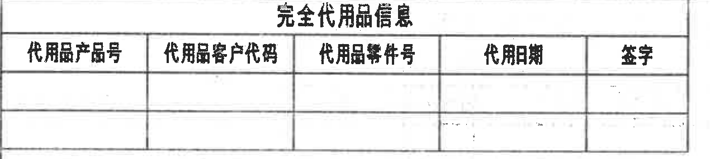
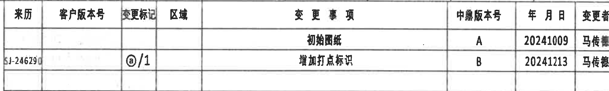
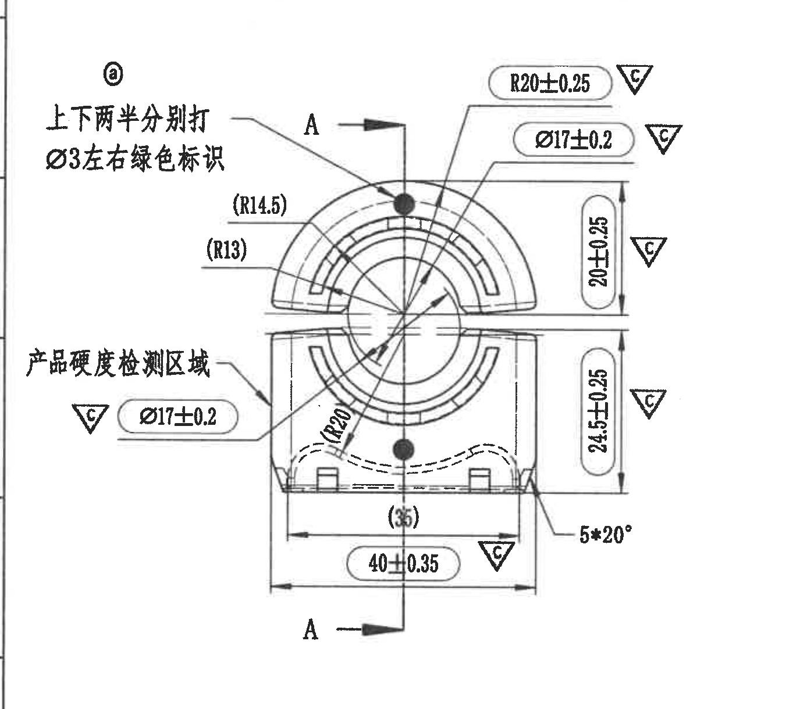
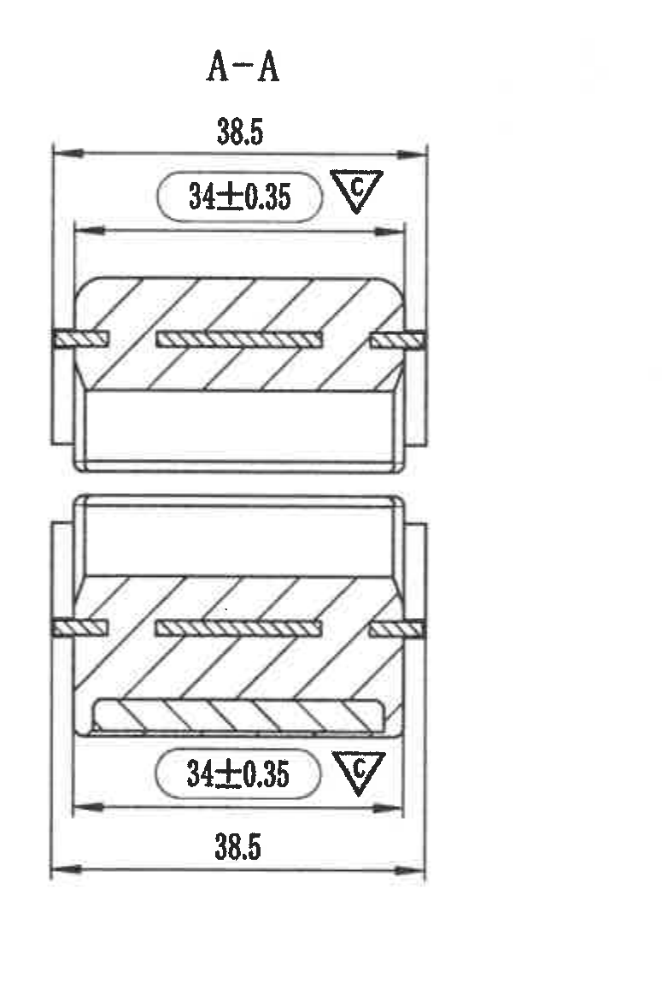
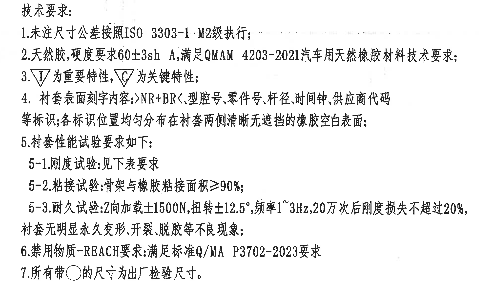
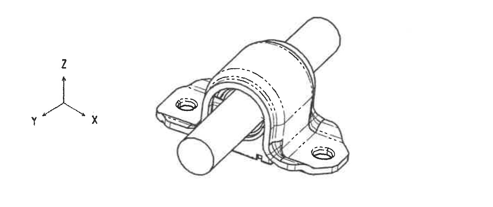
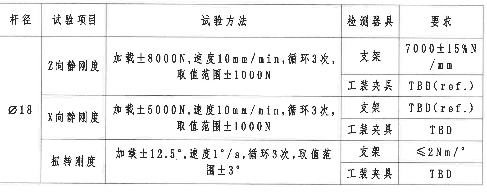
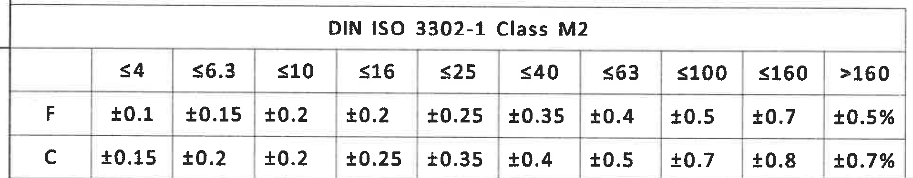
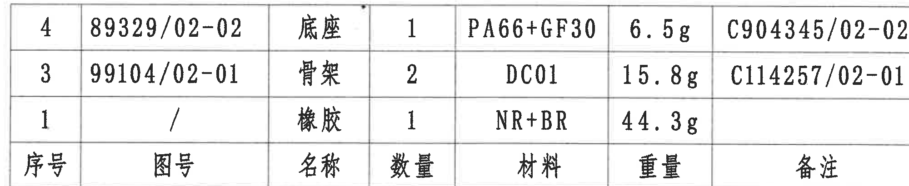
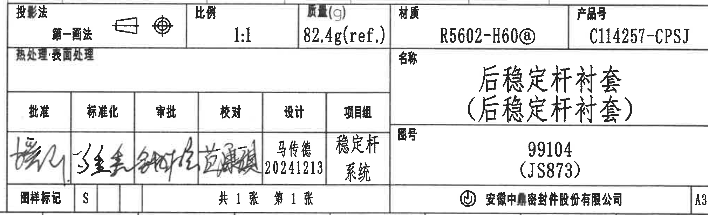

# 20C114257 内容识别与裁切记录

整页渲染图：`outputs/20C114257_assets/images/page_1.png`，页面尺寸 4959 x 3505 px。以下 bbox 均按整页 PNG 的 `[x, y, width, height]` 记录。未见单独命名的局部放大视图；等轴测参考图作为 `detail` 对象单独裁切。

## object_1：完全代用品信息表

- 原图位置/视图名称：页面左上，完全代用品信息表；bbox `[350, 170, 1270, 285]`。

原表还原：

| 代用品产品号 | 代用品客户代码 | 代用品零件号 | 代用日期 | 签字 |
|---|---|---|---|---|
|  |  |  |  |  |
|  |  |  |  |  |

提取表：

| 提取项 | 原图数值或文本 | 含义说明 |
|---|---|---|
| 表题 | 完全代用品信息 | 用于记录完全代用品的产品号、客户代码、零件号、日期和签字。 |
| 表头 | 代用品产品号；代用品客户代码；代用品零件号；代用日期；签字 | 原表字段。 |
| 数据行 | 两行空白 | 原图未填写代用品记录。 |
| 边界归属说明 | 仅裁切表格本体 | 上方图框坐标编号未纳入该对象；空白单元格保留。 |

## object_2：修订履历表

- 原图位置/视图名称：页面右上，变更/修订履历表；bbox `[2725, 170, 1995, 300]`。

原表还原：

| 来源 | 客户版本号 | 变更标记 | 区域 | 变更事项 | 中鼎版本号 | 年月日 | 变更者 |
|---|---|---|---|---|---|---|---|
|  |  |  |  | 初始图纸 | A | 20241009 | 马传德 |
| SJ-246290（末位原图略模糊） |  | @/1 |  | 增加打点标识 | B | 20241213 | 马传德 |
|  |  |  |  |  |  |  |  |

提取表：

| 提取项 | 原图数值或文本 | 含义说明 |
|---|---|---|
| 修订 A | 初始图纸；中鼎版本号 A；20241009；马传德 | 初版图纸记录。 |
| 修订 B | 来源 SJ-246290（末位原图略模糊）；变更标记 @/1；增加打点标识；中鼎版本号 B；20241213；马传德 | 说明新增打点/标识，对应主视图中的 @ 标记和黑点位置。 |
| 空白列 | 客户版本号、区域为空 | 原表对应列未填写。 |
| 边界归属说明 | 仅裁切修订表本体 | 右侧图框坐标字母 A/B 未纳入对象；来源栏低清晰字符按不确定状态记录。 |

## object_3：主加工视图

- 原图位置/视图名称：页面左中，主加工视图/正视加工视图；bbox `[340, 830, 1375, 1220]`。

提取表：

| 提取项 | 原图数值或文本 | 含义说明 |
|---|---|---|
| 修订/标记说明 | @；上下两半分别打 Ø3 左右绿色标识 | 与修订表 B“增加打点标识”对应；表示上下两半零件需分别打 Ø3 左右绿色标识。 |
| 剖切标识 | A-A，两个 A 剖切箭头 | 指示 A-A 剖面的位置和观察方向；剖面内容归 object_4。 |
| 检测区域说明 | 产品硬度检测区域 | 箭头指向下半部左侧区域，表示硬度检测位置。 |
| 半径尺寸 | R20±0.25，关键特性 C | 上半圆外侧/弧形轮廓半径尺寸，带公差 ±0.25，三角 C 表示关键特性。 |
| 直径尺寸 | Ø17±0.2，关键特性 C | 上部圆孔/圆弧相关直径尺寸，带公差 ±0.2，关键特性。 |
| 直径尺寸 | Ø17±0.2，关键特性 C | 下部对应圆孔/圆弧相关直径尺寸，带公差 ±0.2，关键特性。 |
| 参考半径 | (R14.5) | 括号尺寸为参考尺寸，用于说明上部内侧弧线半径关系，不作为直接检验尺寸。 |
| 参考半径 | (R13) | 括号尺寸为参考尺寸，用于说明内侧弧线半径关系，不作为直接检验尺寸。 |
| 半径尺寸 | R20 | 下部斜向标注的弧形轮廓半径，原图未给出公差。 |
| 高度尺寸 | 20±0.25，关键特性 C | 右侧上半部高度/厚度尺寸，带公差 ±0.25。 |
| 高度尺寸 | 24.5±0.25，关键特性 C | 右侧下半部高度尺寸，带公差 ±0.25。 |
| 参考宽度 | (35) | 底部内侧括号尺寸，参考尺寸；用于说明内侧跨距/轮廓关系，不作为直接检验尺寸。 |
| 宽度尺寸 | 40±0.35，关键特性 C | 底部总宽度尺寸，带公差 ±0.35。 |
| 数量/角度 | 5*20° | 表示 5 处/5 个相同 20° 角度特征；原图未给出单独公差。 |
| 基准/T 编号 | 未见独立基准字母框或 T 编号 | A 为剖切视图字母，不是独立 datum feature frame；该视图未见 T 编号。 |
| 边界归属说明 | 仅主视图及其尺寸、说明 | A-A 剖面图的 38.5、34±0.35 等尺寸不归入本对象；主视图右侧高度尺寸、底部宽度尺寸和左侧说明均完整包含。 |

## object_4：A-A 剖面视图

- 原图位置/视图名称：页面中部偏右，A-A 剖面视图；bbox `[1750, 820, 775, 1170]`。

提取表：

| 提取项 | 原图数值或文本 | 含义说明 |
|---|---|---|
| 剖面名称 | A-A | 与主视图 object_3 中 A-A 剖切线对应。 |
| 总宽尺寸 | 38.5（上方） | 上半部剖面外侧总宽，原图未给出公差。 |
| 关键宽度 | 34±0.35，关键特性 C（上方） | 上半部内侧/功能宽度，带公差 ±0.35，关键特性。 |
| 关键宽度 | 34±0.35，关键特性 C（下方） | 下半部对应内侧/功能宽度，带公差 ±0.35，关键特性。 |
| 总宽尺寸 | 38.5（下方） | 下半部剖面外侧总宽，原图未给出公差。 |
| 剖面填充 | 斜线剖面线 | 表示被剖切的实体材料区域。 |
| 基准/T 编号 | 未见独立基准字母框或 T 编号 | A-A 仅为剖面名称；该剖视图未见 T 编号。 |
| 边界归属说明 | 仅 A-A 剖面及其上下宽度尺寸 | 主加工视图的直径、高度和角度尺寸未纳入本对象；上下尺寸线和箭头均完整包含。 |

## object_5：技术要求 / NOTES

- 原图位置/视图名称：页面右上至右中，技术要求；bbox `[2650, 500, 2000, 1160]`。

提取表：

| 提取项 | 原图数值或文本 | 含义说明 |
|---|---|---|
| 标题 | 技术要求 | 图纸通用制造、材料、特性和试验要求。 |
| 1 | 未注尺寸公差按照 ISO 3303-1、M2级执行； | 未单独标注公差的尺寸按该标准等级控制。 |
| 2 | 天然胶，硬度要求 60±3sh A，满足 QMAM 4203-2021 汽车用天然橡胶材料技术要求； | 规定橡胶硬度与材料标准。 |
| 3 | △I 为重要特性，△C 为关键特性； | 图中三角 I/C 的特性等级说明。 |
| 4 | 衬套表面刻字内容：>NR+BR<、型腔号、零件号、杆径、时间钟、供应商代码等标识；各标识位置均匀分布在衬套两侧清晰无遮挡的橡胶空白表面； | 规定表面刻字内容和位置要求。 |
| 5 | 衬套性能试验要求如下： | 引出下方试验表 object_7。 |
| 5-1 | 刚度试验：见下表要求 | 刚度试验参数以 object_7 为准。 |
| 5-2 | 粘接试验：骨架与橡胶粘接面积≥90%； | 粘接面积最低要求。 |
| 5-3 | 耐久试验：Z向加载±1500N，扭转±12.5°，频率1~3Hz，20万次后刚度损失不超过20%，衬套无明显永久变形、开裂、脱胶等不良现象； | 耐久试验载荷、角度、频率、循环次数和失效判定。 |
| 6 | 禁用物质-REACH要求：满足标准 Q/MA P3702-2023 要求 | 禁用物质合规要求。 |
| 7 | 所有带○的尺寸为出厂检验尺寸。 | 圆圈标记尺寸为出厂检验项目。 |
| 边界归属说明 | 仅技术要求文字 | 修订表、等轴测图和右侧图框坐标均未纳入本对象；1-7 条文字完整包含。 |

## object_6：等轴测参考图

- 原图位置/视图名称：页面右中偏下，等轴测参考图；bbox `[3140, 1665, 1410, 595]`。

提取表：

| 提取项 | 原图数值或文本 | 含义说明 |
|---|---|---|
| 坐标方向 | X、Y、Z | 说明等轴测图空间方向。 |
| 图形内容 | 衬套组件三维示意，含中心杆、橡胶衬套、底座/耳板孔位 | 用于说明零件装配外观和方向，不承载尺寸控制。 |
| 尺寸/公差 | 未标注尺寸 | 该视图未见直径、半径、角度、公差、基准或 T 编号。 |
| 边界归属说明 | 仅等轴测参考图 | 未带入右下 BOM、标题栏或 NOTES 文本；图形轮廓完整。 |

## object_7：衬套性能试验表

- 原图位置/视图名称：页面左下，衬套性能试验表；bbox `[350, 2095, 2055, 830]`。

原表还原：

| 杆径 | 试验项目 | 试验方法 | 检测器具 | 要求 |
|---|---|---|---|---|
| Ø18 | Z向静刚度 | 加载±8000N，速度10mm/min，循环3次，取值范围±1000N | 支架 | 7000±15%N/mm |
| Ø18 | Z向静刚度 | 加载±8000N，速度10mm/min，循环3次，取值范围±1000N | 工装夹具 | TBD(ref.) |
| Ø18 | X向静刚度 | 加载±5000N，速度10mm/min，循环3次，取值范围±1000N | 支架 | TBD(ref.) |
| Ø18 | X向静刚度 | 加载±5000N，速度10mm/min，循环3次，取值范围±1000N | 工装夹具 | TBD |
| Ø18 | 扭转刚度 | 加载±12.5°，速度1°/s，循环3次，取值范围±3° | 支架 | ≤2Nm/° |
| Ø18 | 扭转刚度 | 加载±12.5°，速度1°/s，循环3次，取值范围±3° | 工装夹具 | TBD |

提取表：

| 提取项 | 原图数值或文本 | 含义说明 |
|---|---|---|
| 杆径 | Ø18 | 本试验表适用杆径。 |
| Z向静刚度/支架 | 7000±15%N/mm | Z 向刚度使用支架检测时的要求。 |
| Z向静刚度/工装夹具 | TBD(ref.) | 工装夹具检测要求待定，括号 ref. 表示参考。 |
| X向静刚度/支架 | TBD(ref.) | 支架检测要求待定，括号 ref. 表示参考。 |
| X向静刚度/工装夹具 | TBD | 工装夹具检测要求待定。 |
| 扭转刚度/支架 | ≤2Nm/° | 扭转刚度支架检测上限。 |
| 扭转刚度/工装夹具 | TBD | 工装夹具检测要求待定。 |
| 边界归属说明 | 仅试验表本体 | 左侧图框行号未纳入对象；表头、Ø18 合并栏和右侧要求列完整包含。 |

## object_8：DIN ISO 3302-1 Class M2 公差表

- 原图位置/视图名称：页面左下，未注尺寸公差表；bbox `[320, 2960, 1915, 375]`。

原表还原：

|  | ≤4 | ≤6.3 | ≤10 | ≤16 | ≤25 | ≤40 | ≤63 | ≤100 | ≤160 | >160 |
|---|---|---|---|---|---|---|---|---|---|---|
| F | ±0.1 | ±0.15 | ±0.2 | ±0.2 | ±0.25 | ±0.35 | ±0.4 | ±0.5 | ±0.7 | ±0.5% |
| C | ±0.15 | ±0.2 | ±0.2 | ±0.25 | ±0.35 | ±0.4 | ±0.5 | ±0.7 | ±0.8 | ±0.7% |

提取表：

| 提取项 | 原图数值或文本 | 含义说明 |
|---|---|---|
| 标准/等级 | DIN ISO 3302-1 Class M2 | 与 NOTES 第 1 条的未注尺寸公差要求对应。 |
| F 行 | ±0.1 至 ±0.5%，按尺寸区间变化 | F 类公差行。 |
| C 行 | ±0.15 至 ±0.7%，按尺寸区间变化 | C 类公差行。 |
| 边界归属说明 | 仅公差表本体 | 底部图框分区数字未纳入对象；标题、表头、F/C 两行均完整包含。 |

## object_9：BOM / 明细表

- 原图位置/视图名称：页面右下，材料明细表/BOM；bbox `[2710, 2335, 2000, 410]`。

原表还原：

| 序号 | 图号 | 名称 | 数量 | 材料 | 重量 | 备注 |
|---|---|---|---|---|---|---|
| 4 | 89329/02-02 | 底座 | 1 | PA66+GF30 | 6.5g | C904345/02-02 |
| 3 | 99104/02-01 | 骨架 | 2 | DC01 | 15.8g | C114257/02-01 |
| 1 | / | 橡胶 | 1 | NR+BR | 44.3g |  |

提取表：

| 提取项 | 原图数值或文本 | 含义说明 |
|---|---|---|
| 底座 | 序号 4；图号 89329/02-02；数量 1；材料 PA66+GF30；重量 6.5g；备注 C904345/02-02 | 底座零件材料与重量。 |
| 骨架 | 序号 3；图号 99104/02-01；数量 2；材料 DC01；重量 15.8g；备注 C114257/02-01 | 骨架零件材料、数量与关联备注。 |
| 橡胶 | 序号 1；图号 /；数量 1；材料 NR+BR；重量 44.3g；备注空白 | 橡胶件材料与重量。 |
| 边界归属说明 | 仅 BOM 表格本体 | 右侧图框坐标字母未纳入对象；备注列完整保留。 |

## object_10：标题栏 / 图纸信息栏

- 原图位置/视图名称：页面右下，标题栏、签署栏和图纸信息栏；bbox `[2710, 2740, 2020, 615]`。

提取表：

| 提取项 | 原图数值或文本 | 含义说明 |
|---|---|---|
| 投影法 | 第一画法 | 图纸投影方法。 |
| 比例 | 1:1 | 图纸比例。 |
| 质量(g) | 82.4g(ref.) | 总质量参考值，括号 ref. 表示参考。 |
| 材质 | R5602-H60@ | 标题栏材质字段，@ 为原图标记。 |
| 产品号 | C114257-CPSJ | 产品编号。 |
| 热处理/表面处理 | 表面处理 | 原图该栏显示“热处理：表面处理”。 |
| 名称 | 后稳定杆衬套（后稳定杆衬套） | 零件名称，括号内为重复/补充名称。 |
| 图号 | 99104（JS873） | 图纸号/代号。 |
| 批准 | 签名 | 手写签名，原图无法精确转写。 |
| 标准化 | 签名 | 手写签名，原图无法精确转写。 |
| 审批 | 签名 | 手写签名，原图无法精确转写。 |
| 校对 | 签名 | 手写签名，原图无法精确转写。 |
| 设计 | 马传德 20241213 | 设计人员及日期。 |
| 项目组 | 稳定杆 系统 | 项目组信息。 |
| 图样标记 | S | 图样标记。 |
| 页数 | 共1张 第1张 | 图纸页数。 |
| 公司 | 安徽中鼎密封件股份有限公司 | 出图单位。 |
| 图幅 | A3 | 图纸幅面。 |
| 边界归属说明 | 标题栏本体及其内部签署、图号、名称信息 | BOM 明细表单独归 object_9；右侧图框坐标字母未纳入对象。 |

## 裁切检查记录

| 对象 | 检查结论 | 完整性与归属说明 |
|---|---|---|
| object_1 | 通过 | 完整包含表题、表头和两行空白单元格；未带入上方图框坐标编号。 |
| object_2 | 通过 | 完整包含修订表行列和右侧日期/变更者列；来源栏末位受扫描影响略模糊，已标注；右侧图框坐标字母已排除。 |
| object_3 | 通过 | 主视图的尺寸线、箭头、标注文字、左侧说明、A-A 剖切箭头均完整；未带入 A-A 剖面视图。 |
| object_4 | 通过 | A-A 剖面上下两组 38.5 和 34±0.35 尺寸线、箭头、C 标识完整；未带入主视图尺寸。 |
| object_5 | 通过 | 技术要求 1-7 条完整；右侧图框线和等轴测图未纳入。 |
| object_6 | 通过 | 等轴测参考图和 X/Y/Z 坐标方向完整；未带入 NOTES、BOM 或标题栏。 |
| object_7 | 通过 | 试验表表头、Ø18 合并栏、全部试验行和右侧要求列完整；左侧图框行号已排除。 |
| object_8 | 通过 | 公差表标题、全部尺寸区间、F/C 两行完整；底部图框分区数字已排除。 |
| object_9 | 通过 | BOM 三条记录、表头和备注列完整；右侧图框坐标已排除。 |
| object_10 | 通过 | 标题栏、签署栏、名称、图号、产品号、图幅等字段完整；BOM 归 object_9，右侧图框坐标已排除。 |
