# 20C114259 内容识别与裁切提取

整页渲染图：`outputs/20C114259_assets/images/page_1.png`  
页面：1；整页 PNG 尺寸：4959 x 3505 px；bbox：`[0, 0, 4959, 3505]`

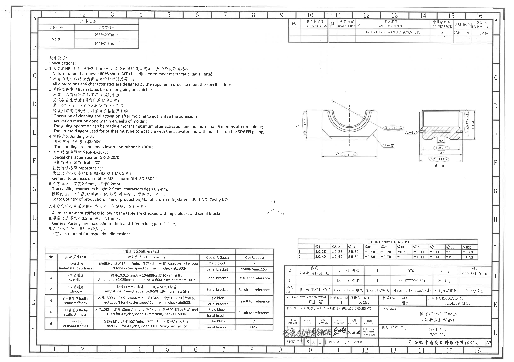

## object_1 产品信息表

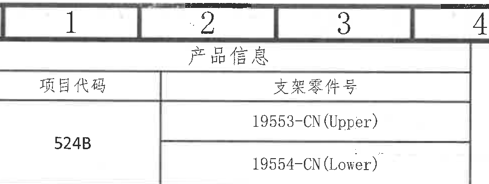

原图位置/视图名称：左上角 A-B / 1-4 区域，产品信息表，bbox `[395, 92, 980, 370]`。

| 项目代码 | 支架零件号 |
|---|---|
| 524B | 19553-CN(Upper) |
| 524B | 19554-CN(Lower) |

| 提取项 | 原图数值或文本 | 含义说明 |
|---|---|---|
| 项目代码 | 524B | 产品/项目代码。 |
| 支架零件号 | 19553-CN(Upper) | 上支架零件号。 |
| 支架零件号 | 19554-CN(Lower) | 下支架零件号。 |

边界归属说明：裁切上方带有图框坐标栏的一部分，业务提取只对应产品信息表本体；坐标数字不作为表格内容。

## object_2 修订履历表

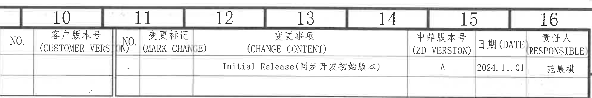

原图位置/视图名称：右上角 A-B / 10-16 区域，修订履历表，bbox `[2785, 88, 1980, 330]`。

| NO. | 客户版本号 (CUSTOMER VERSION) | NO. | 变更标记 (MARK CHANGE) | 变更事项 (CHANGE CONTENT) | 中鼎版本号 (ZD VERSION) | 日期 (DATE) | 责任人 (RESPONSIBLE) |
|---|---|---|---|---|---|---|---|
|  |  | 1 |  | Initial Release(同步开发初始版本) | A | 2024.11.01 | 范康祺 |

| 提取项 | 原图数值或文本 | 含义说明 |
|---|---|---|
| NO. | 1 | 首次修订/发行记录。 |
| 变更事项 | Initial Release(同步开发初始版本) | 初始发行，同步开发初始版本。 |
| 中鼎版本号 | A | 中鼎内部版本号。 |
| 日期 | 2024.11.01 | 修订记录日期。 |
| 责任人 | 范康祺 | 修订责任人。 |
| 客户版本号、变更标记 | 空白 | 原表对应单元格未填写。 |

边界归属说明：上缘贴近图框坐标栏，提取内容仅限修订履历表，不把图框坐标号作为修订表字段。

## object_3 技术要求 / Specifications 1-6

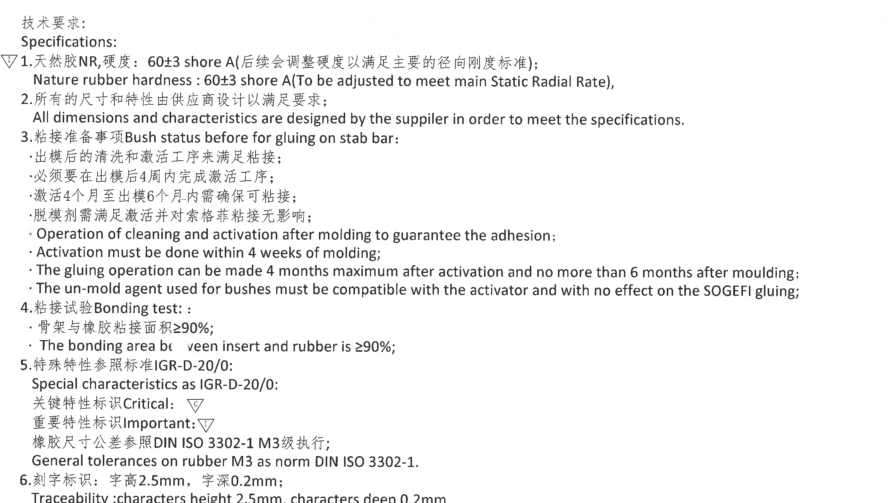

原图位置/视图名称：左中部 B-H / 1-9 区域，技术要求上半部分，bbox `[420, 500, 2380, 1340]`。

| 提取项 | 原图数值或文本 | 含义说明 |
|---|---|---|
| 标题 | 技术要求；Specifications | 技术要求说明区标题。 |
| 1 硬度 | 天然胶NR，硬度：60±3 shore A | 橡胶材料为天然胶 NR，硬度要求 60±3 Shore A。 |
| 1 英文说明 | Nature rubber hardness: 60±3 shore A (To be adjusted to meet main Static Radial Rate) | 硬度可后续调整，以满足主要径向静刚度标准。 |
| 2 供应商设计 | 所有的尺寸和特性由供应商设计以满足要求 | 未逐项给出的尺寸/特性由供应商设计并满足规范。 |
| 2 英文说明 | All dimensions and characteristics are designed by the supplier in order to meet the specifications. | 与中文第2条对应。 |
| 3 粘接准备 | Bush status before for gluing on stab bar | 稳定杆粘接前衬套状态要求。 |
| 3 清洗激活 | 出模后的清洗和激活工序来满足粘接 | 出模后需清洗并激活以保证粘接。 |
| 3 激活期限 | 必须要在出模后4周内完成激活工序 | 出模后 4 周内必须完成激活。 |
| 3 粘接窗口 | 激活4个月至出模6个月内需确保可粘接 | 粘接操作可在激活后最多 4 个月内进行，且不超过出模后 6 个月。 |
| 3 脱模剂 | 脱模剂需满足激活并对索格菲粘接无影响 | 脱模剂需兼容激活剂且不影响 SOGEFI 粘接。 |
| 4 粘接试验 | 骨架与橡胶粘接面积≥90% | Insert/骨架与 Rubber/橡胶之间的粘接面积要求。 |
| 4 英文说明 | The bonding area between insert and rubber is ≥90% | 与中文第4条对应。 |
| 5 特殊特性标准 | IGR-D-20/0 | 特殊特性参照标准。 |
| 5 关键特性标识 | Critical: 倒三角 C | 关键特性符号。 |
| 5 重要特性标识 | Important: 倒三角 I | 重要特性符号，图中多个尺寸旁使用。 |
| 5 橡胶尺寸公差 | DIN ISO 3302-1 M3 | 橡胶尺寸公差执行 DIN ISO 3302-1 M3 级。 |
| 6 刻字标识 | 字高2.5mm，字深0.2mm | 追溯刻字的字符高度和深度。 |
| 6 标识内容 | 中鼎徽、时间钟、厂家代码、材料标识、零件号、型腔号 | Logo/Traceability 的内容要求。 |

边界归属说明：本对象只承接技术要求第 1-6 条。技术要求第 7-9 条在 object_11；坐标方向示意在 object_6，不归入本对象。

## object_11 技术要求 / Specifications 7-9

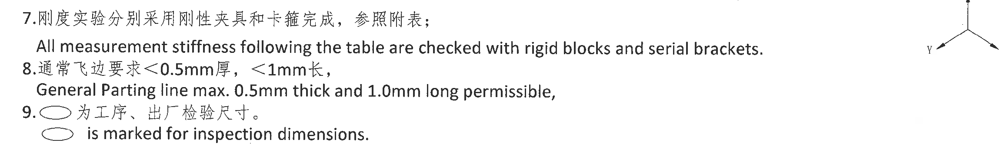

原图位置/视图名称：左中下部 H-I / 1-8 区域，技术要求下半部分，bbox `[420, 1955, 2300, 360]`。

| 提取项 | 原图数值或文本 | 含义说明 |
|---|---|---|
| 7 刚度实验 | 刚度实验分别采用刚性夹具和卡箍完成，参照附表 | 刚度测试按下方刚度表执行，使用 rigid block 和 serial bracket。 |
| 7 英文说明 | All measurement stiffness following the table are checked with rigid blocks and serial brackets. | 与中文第7条对应。 |
| 8 飞边要求 | 通常飞边要求 <0.5mm 厚，<1mm 长 | 一般分型线飞边最大厚度 0.5mm、最大长度 1.0mm。 |
| 8 英文说明 | General Parting line max. 0.5mm thick and 1.0mm long permissible. | 与中文第8条对应。 |
| 9 椭圆标识 | 椭圆 为工序、出厂检验尺寸；is marked for inspection dimensions. | 图中椭圆圈出的尺寸为工序/出厂检验尺寸。 |

边界归属说明：第 7 条英文长句横向接近坐标方向示意，裁切右侧可见坐标示意局部；坐标示意作为 object_6 单独解释，不从本对象提取。

## object_4 主视图 / 正视加工视图

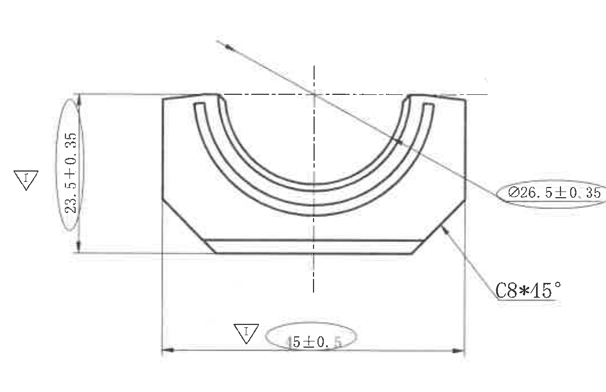

原图位置/视图名称：右中部 D-F / 10-13 区域，主视图，bbox `[2820, 900, 1065, 690]`。

| 提取项 | 原图数值或文本 | 含义说明 |
|---|---|---|
| 重要特性标识 | 倒三角 I | 标识与尺寸 `23.5±0.35`、`45±0.5` 关联，为重要特性。 |
| 总高度 | 23.5±0.35 | 主视图左侧垂直尺寸，整体高度要求。 |
| 弧形直径 | Ø26.5±0.35 | 内弧/半圆槽相关直径尺寸，带直径符号。 |
| 倒角 | C8*15° | 主视图右下斜边倒角/斜切尺寸，尺寸值 8，角度 15°。 |
| 底部总宽 | 45±0.5 | 主视图底部水平总宽，椭圆圈出且带重要特性标识 I。 |
| 中心线 | 竖向、横向中心线 | 表示零件中心和弧槽中心位置关系，不是尺寸值。 |

边界归属说明：`Ø26.5±0.35` 和 `C8*15°` 的引线均指向主视图，归属于本对象。右侧 A-A 剖视图的尺寸未纳入本主视图提取。

## object_5 A-A 剖面视图

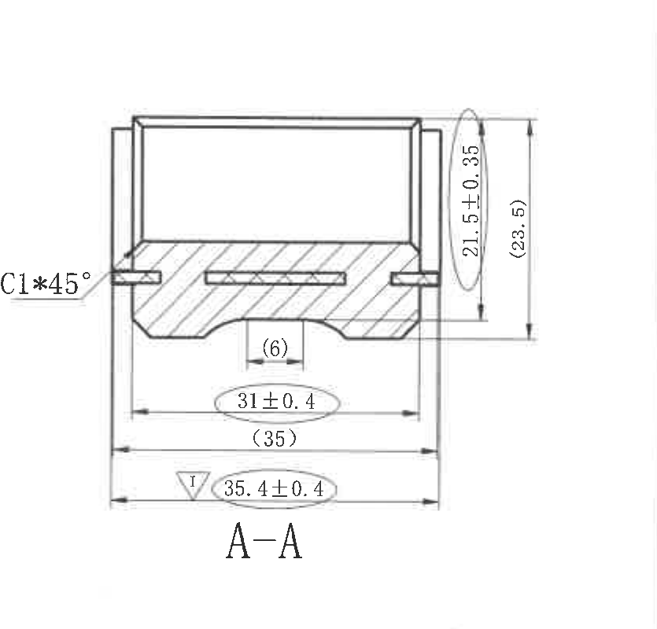

原图位置/视图名称：右中部 E-F / 14-16 区域，A-A 剖面视图，bbox `[3905, 920, 835, 800]`。

| 提取项 | 原图数值或文本 | 含义说明 |
|---|---|---|
| 剖面名称 | A-A | 剖切视图名称。 |
| 倒角 | C1*45° | A-A 剖面左侧端部倒角，尺寸 1、角度 45°。 |
| 高度 | 21.5±0.35 | 右侧内侧垂直高度尺寸，椭圆圈出。 |
| 参考总高度 | (23.5) | 括号内参考尺寸，表示总高度参考值，不作为主要控制尺寸。 |
| 局部参考宽度 | (6) | 中央局部凹槽/开口宽度参考尺寸。 |
| 宽度 | 31±0.4 | 剖面下部宽度尺寸，椭圆圈出。 |
| 参考宽度 | (35) | 括号内参考宽度，表示相邻外宽参考值。 |
| 总宽重要尺寸 | 35.4±0.4 | 最下方总宽尺寸，带重要特性标识 I，椭圆圈出。 |
| 剖面线 | 斜剖面线 | 表示材料实体截面区域。 |

边界归属说明：`C1*45°` 引线指向 A-A 剖视图左端，归本对象。左侧邻近主视图 `Ø26.5±0.35` 标注区域，若边缘可见残线不作为 A-A 尺寸提取。

## object_6 坐标方向示意图

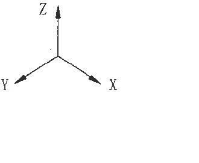

原图位置/视图名称：中下部 H / 9 附近，坐标方向示意图，bbox `[2550, 1930, 330, 270]`。

| 提取项 | 原图数值或文本 | 含义说明 |
|---|---|---|
| Z 轴 | Z 向上 | 垂直向上方向。 |
| Y 轴 | Y 向左下 | 图中左下斜向方向。 |
| X 轴 | X 向右下 | 图中右下斜向方向。 |

边界归属说明：该对象是全图坐标方向说明。它与技术要求第 7 条附近相邻，但不属于 NOTES 文本内容。

## object_7 刚度实验 Stiffness test 表

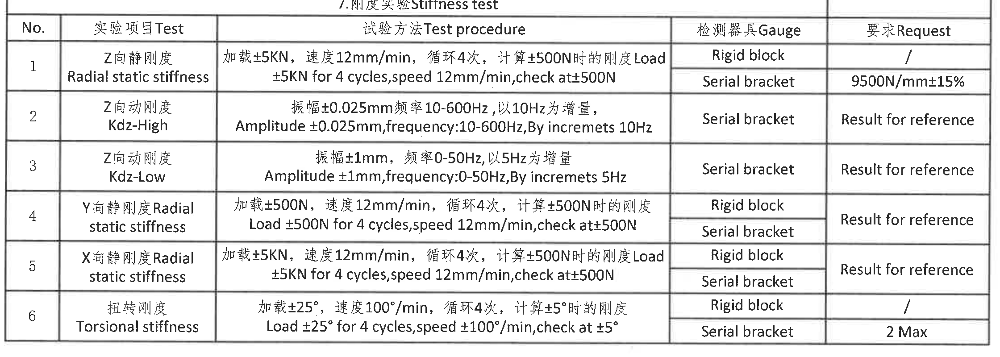

原图位置/视图名称：左下 I-L / 1-9 区域，刚度实验表，bbox `[420, 2425, 2240, 800]`。

| No. | 实验项目 Test | 试验方法 Test procedure | 检测器具 Gauge | 要求 Request |
|---|---|---|---|---|
| 1 | Z向静刚度 / Radial static stiffness | 加载±5KN，速度12mm/min，循环4次，计算±500N时的刚度 / Load ±5KN for 4 cycles, speed 12mm/min, check at ±500N | Rigid block | / |
| 1 | Z向静刚度 / Radial static stiffness | 同上 | Serial bracket | 9500N/mm±15% |
| 2 | Z向动刚度 / Kdz-High | 振幅±0.025mm，频率10-600Hz，以10Hz为增量 / Amplitude ±0.025mm, frequency 10-600Hz, By increments 10Hz | Serial bracket | Result for reference |
| 3 | Z向动刚度 / Kdz-Low | 振幅±1mm，频率0-50Hz，以5Hz为增量 / Amplitude ±1mm, frequency 0-50Hz, By increments 5Hz | Serial bracket | Result for reference |
| 4 | Y向静刚度 / Radial static stiffness | 加载±500N，速度12mm/min，循环4次，计算±500N时的刚度 / Load ±500N for 4 cycles, speed 12mm/min, check at ±500N | Rigid block; Serial bracket | Result for reference |
| 5 | X向静刚度 / Radial static stiffness | 加载±5KN，速度12mm/min，循环4次，计算±500N时的刚度 / Load ±5KN for 4 cycles, speed 12mm/min, check at ±500N | Rigid block; Serial bracket | Result for reference |
| 6 | 扭转刚度 / Torsional stiffness | 加载±25°，速度100°/min，循环4次，计算±5°时的刚度 / Load ±25° for 4 cycles, speed ±100°/min, check at ±5° | Rigid block | / |
| 6 | 扭转刚度 / Torsional stiffness | 同上 | Serial bracket | 2 Max |

| 提取项 | 原图数值或文本 | 含义说明 |
|---|---|---|
| ±5KN | Z/X 向静刚度加载 | Z、X 向静刚度测试载荷。 |
| 12mm/min | 静刚度速度 | Z/Y/X 静刚度测试速度。 |
| ±500N | 静刚度检查点 | 计算刚度时的检查载荷点。 |
| 9500N/mm±15% | Z向静刚度卡箍要求 | Serial bracket 下的 Z 向静刚度要求。 |
| ±0.025mm, 10-600Hz, 10Hz | Kdz-High | 高频动态刚度测试振幅、频率范围和增量。 |
| ±1mm, 0-50Hz, 5Hz | Kdz-Low | 低频动态刚度测试振幅、频率范围和增量。 |
| ±25°, ±100°/min, ±5° | 扭转刚度 | 扭转载荷角度、速度和检查角度。 |
| 2 Max | 扭转刚度卡箍要求 | Serial bracket 下最大值要求。 |

边界归属说明：该表是 NOTES 第 7 条“参照附表”的对应附表，表格行列完整；不含标题栏或 BOM 内容。

## object_8 DIN ISO 3302-1 CLASS M3 公差表

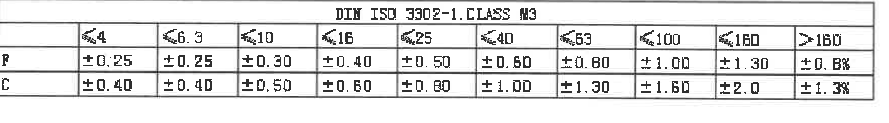

原图位置/视图名称：右下 I / 10-16 区域，橡胶尺寸通用公差表，bbox `[2880, 2315, 1760, 245]`。

| DIN ISO 3302-1 CLASS M3 | ≤4 | ≤6.3 | ≤10 | ≤16 | ≤25 | ≤40 | ≤63 | ≤100 | ≤160 | >160 |
|---|---|---|---|---|---|---|---|---|---|---|
| F | ±0.25 | ±0.25 | ±0.30 | ±0.40 | ±0.50 | ±0.60 | ±0.80 | ±1.00 | ±1.30 | ±0.8% |
| C | ±0.40 | ±0.40 | ±0.50 | ±0.60 | ±0.80 | ±1.00 | ±1.30 | ±1.60 | ±2.0 | ±1.3% |

| 提取项 | 原图数值或文本 | 含义说明 |
|---|---|---|
| 标准 | DIN ISO 3302-1 CLASS M3 | 橡胶件尺寸公差等级。 |
| F 行 | ±0.25 到 ±1.30，>160 为 ±0.8% | F 类尺寸段对应公差。 |
| C 行 | ±0.40 到 ±2.0，>160 为 ±1.3% | C 类尺寸段对应公差。 |

边界归属说明：该表位于 BOM 上方，独立于刚度实验表和标题栏；所有列宽和表头完整。

## object_9 BOM / 零件组成表

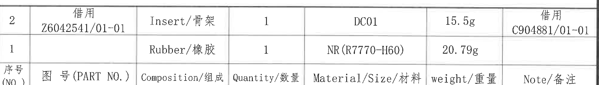

原图位置/视图名称：右下 J / 10-16 区域，BOM/零件组成表，bbox `[2755, 2550, 1995, 285]`。

| 序号 (NO.) | 图号 (PART NO.) | Composition/组成 | Quantity/数量 | Material/Size/材料 | weight/重量 | Note/备注 |
|---|---|---|---|---|---|---|
| 2 | 借用 Z6042541/01-01 | Insert/骨架 | 1 | DC01 | 15.5g | 借用 C904881/01-01 |
| 1 |  | Rubber/橡胶 | 1 | NR(R7770-H60) | 20.79g |  |

| 提取项 | 原图数值或文本 | 含义说明 |
|---|---|---|
| 行2图号 | 借用 Z6042541/01-01 | 借用的 Insert/骨架图号。 |
| 行2材料 | DC01 | Insert/骨架材料。 |
| 行2重量 | 15.5g | Insert/骨架重量。 |
| 行2备注 | 借用 C904881/01-01 | 借用备注。 |
| 行1组成 | Rubber/橡胶 | 橡胶件。 |
| 行1材料 | NR(R7770-H60) | 天然橡胶材料牌号/规格。 |
| 行1重量 | 20.79g | 橡胶件重量。 |

边界归属说明：BOM 紧邻标题栏上方，裁切只提取 BOM 表头和两条物料行；下方标题栏字段不归入本对象。

## object_10 标题栏

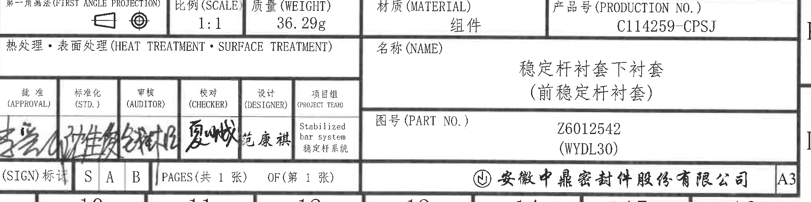

原图位置/视图名称：右下 K-L / 10-16 区域，标题栏，bbox `[2750, 2870, 2025, 505]`。

| 字段 | 原图数值或文本 | 含义说明 |
|---|---|---|
| 投影法 | 第一角画法 (FIRST ANGLE PROJECTION) | 图纸采用第一角投影。 |
| 比例 | 1:1 | 图纸比例。 |
| 质量 | 36.29g | 组件总质量。 |
| 材质 | 组件 | 材料栏标识为组件。 |
| 产品号 | C114259-CPSJ | 产品号/生产号。 |
| 热处理/表面处理 | 空白 | 原栏未填写具体处理要求。 |
| 名称 | 稳定杆衬套下衬套（前稳定杆衬套） | 零件/组件名称。 |
| 图号 | Z6012542 (WYDL30) | 图纸/零件图号。 |
| 批准 | 手写签名，扫描件不可清辨 | 审批签名栏。 |
| 标准化 | 手写签名，扫描件不可清辨 | 标准化签名栏。 |
| 审核 | 手写签名，扫描件不可清辨 | 审核签名栏。 |
| 校对 | 手写签名，扫描件不可清辨 | 校对签名栏。 |
| 设计 | 范康祺 | 设计人员。 |
| 项目组 | Stabilized bar system / 稳定杆系统 | 项目组信息。 |
| SIGN 标识 | S A B | 标识栏内容。 |
| 页数 | PAGES(共 1 张) OF(第 1 张) | 总页数和当前页。 |
| 公司 | 安徽中鼎密封件股份有限公司 | 图纸所属公司。 |
| 图幅 | A3 | 图纸幅面。 |

边界归属说明：标题栏右侧和底部贴近外图框坐标栏，裁切保留标题栏业务字段完整；图框坐标字母/数字不作为标题栏字段。

## 裁切检查记录

| object_id | 对象 | 检查结果 |
|---|---|---|
| page_1 | 整页 PNG | PDF 已先渲染为整页 PNG，尺寸 4959 x 3505 px，页面完整。 |
| object_1 | 产品信息表 | 表格边框和两行支架零件号完整；上方带图框坐标栏，未作为业务内容提取。 |
| object_2 | 修订履历表 | 表头、行线、日期、责任人和版本号完整；上方带图框坐标栏，未作为业务内容提取。 |
| object_3 | 技术要求 1-6 | 第1-6条文字完整；不提取右侧坐标示意。 |
| object_11 | 技术要求 7-9 | 第7-9条文字完整；为保留第7条英文长句，右侧可见坐标示意局部，坐标内容归 object_6。 |
| object_4 | 主视图 | 尺寸线、箭头、`23.5±0.35`、`Ø26.5±0.35`、`C8*15°`、`45±0.5` 完整；未混入 A-A 剖视图尺寸。 |
| object_5 | A-A 剖面视图 | 剖面轮廓、剖面线、`C1*45°`、`21.5±0.35`、`(23.5)`、`(6)`、`31±0.4`、`(35)`、`35.4±0.4` 完整；左侧靠近主视图标注，边缘残线不作为 A-A 内容。 |
| object_6 | 坐标方向示意图 | X/Y/Z 三个方向文字和箭头完整。 |
| object_7 | 刚度实验表 | 表格标题、全部表头、6个测试项目、检测器具和要求列完整。 |
| object_8 | DIN ISO 3302-1 CLASS M3 公差表 | 标题、尺寸段、F/C 两行公差完整。 |
| object_9 | BOM / 零件组成表 | 表头和两条物料行完整；紧邻标题栏但未提取标题栏字段。 |
| object_10 | 标题栏 | 投影法、比例、质量、材质、产品号、名称、图号、签字栏、页数、公司和A3字段完整；边缘图框坐标未作为业务字段提取。 |
