# 20C114261.pdf 内容识别

整页渲染图：`20C114261_assets/images/page_1.png`  
页面尺寸：4959 x 3505 px。bbox 坐标以整页 PNG 左上角为原点，格式为 `[x0, y0, x1, y1]`。

## object_1 | table | 完全代用品信息

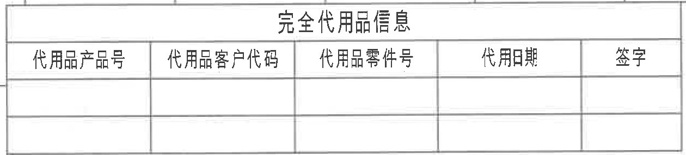

原图位置/视图名称：第 1 页左上表格，bbox `[340, 175, 1600, 460]`，名称“完全代用品信息”。

### 原表还原

| 代用品产品号 | 代用品客户代码 | 代用品零件号 | 代用期 | 签字 |
|---|---|---|---|---|
|  |  |  |  |  |
|  |  |  |  |  |

### 提取表格

| 提取项 | 原图数值或文本 | 含义说明 |
|---|---|---|
| 表题 | 完全代用品信息 | 代用品/替代件信息表。 |
| 表头 | 代用品产品号、代用品客户代码、代用品零件号、代用期、签字 | 原表列名。 |
| 数据行 | 空白 | 原图未填写代用品信息。 |

边界归属说明：裁切只包含左上“完全代用品信息”表格，未纳入上方图框坐标栏、右侧轴测图或下方主视图内容。

## object_2 | table | 修订履历表

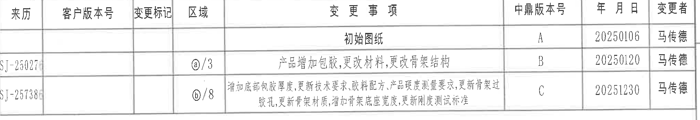

原图位置/视图名称：第 1 页右上修订履历表，bbox `[2760, 175, 4790, 525]`。

### 原表还原

| 来历 | 客户版本号 | 变更标记 | 区域 | 变更事项 | 中鼎版本号 | 年月日 | 变更者 |
|---|---|---|---|---|---|---|---|
|  |  |  |  | 初始图纸 | A | 20250106 | 马传德 |
| SJ-25027 |  |  | ⓐ/3 | 产品增加包胶,更改材料,更改骨架结构 | B | 20250120 | 马传德 |
| SJ-25738 |  |  | ⓑ/8 | 增加底部包胶厚度,更新技术要求,胶料配方,产品硬度测量要求,更新骨架过胶孔,更新骨架材质,增加骨架底座宽度,更新刚度测试标准 | C | 20251230 | 马传德 |

### 提取表格

| 提取项 | 原图数值或文本 | 含义说明 |
|---|---|---|
| 版本 A | 初始图纸；20250106；马传德 | 初始发布记录。 |
| 版本 B | SJ-25027；区域 ⓐ/3；产品增加包胶,更改材料,更改骨架结构；20250120；马传德 | 与图中 ⓐ 区域相关的变更。 |
| 版本 C | SJ-25738；区域 ⓑ/8；增加底部包胶厚度等；20251230；马传德 | 与图中 ⓑ 区域和技术要求相关的变更。 |

边界归属说明：裁切严格包含右上修订履历表，未包含其下方技术要求正文。

## object_3 | view | 轴测图

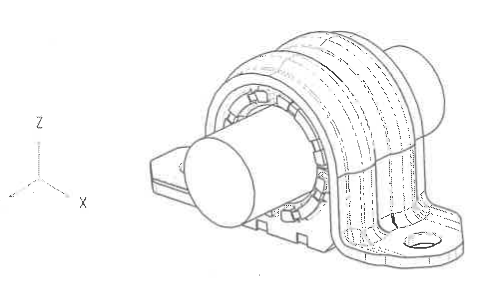

原图位置/视图名称：第 1 页上部中间轴测图，bbox `[1660, 325, 2640, 895]`。

| 提取项 | 原图数值或文本 | 含义说明 |
|---|---|---|
| 视图内容 | 前稳定杆衬套组件轴测外形 | 表示整体三维结构：上、下分体衬套，端面圆孔，侧向支座和底部安装孔。 |
| 坐标标识 | X、Y、Z | 原图左侧给出空间方向参考。 |
| 尺寸/弧度 | 未标注 | 本轴测图没有尺寸线、半径、角度或公差。 |
| T 编号/星号关键尺寸 | 未见 | 该裁切区域没有 T 编号或星号尺寸。 |

边界归属说明：裁切只包含轴测图和 X/Y/Z 坐标符号，未包含左上代用品表、下方主视图或右侧技术要求。

## object_4 | view | 主视图/正向加工视图

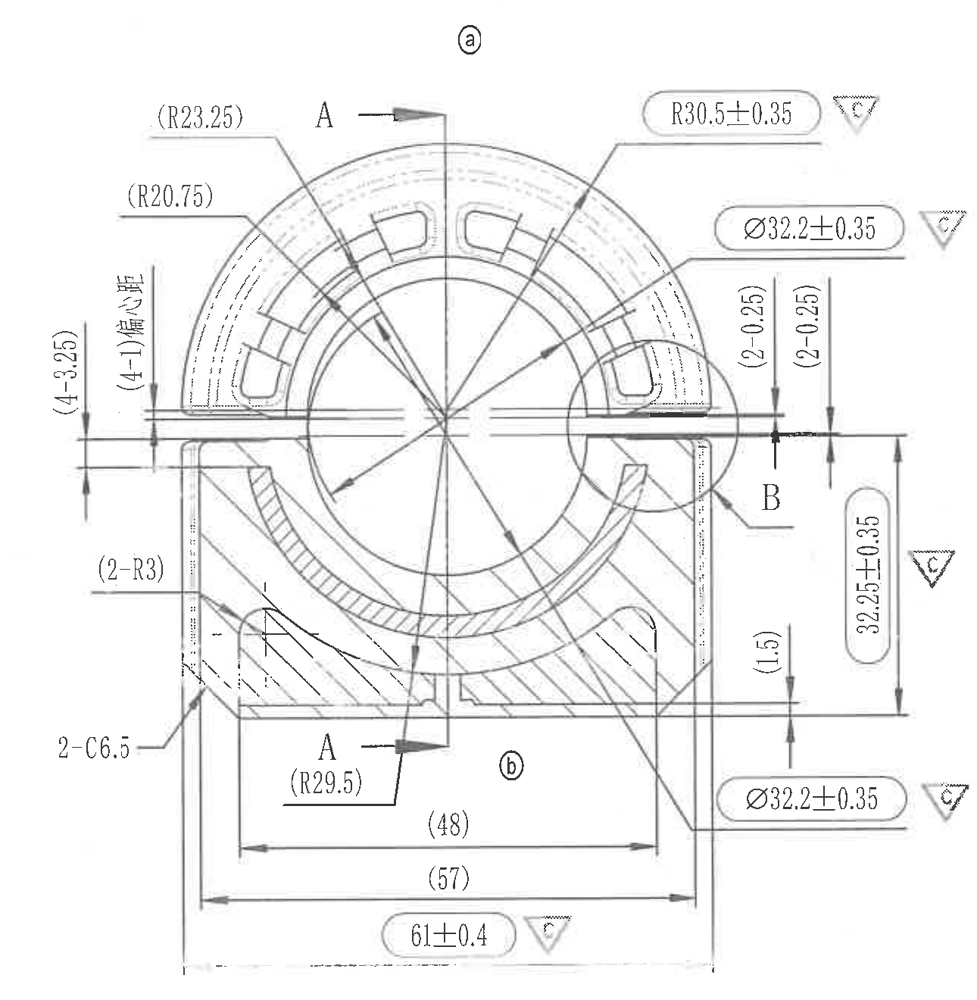

原图位置/视图名称：第 1 页左中主视图，bbox `[420, 955, 1710, 2275]`。

| 提取项 | 原图数值或文本 | 含义说明 |
|---|---|---|
| 区域标识 | ⓐ | 与修订履历中的区域 ⓐ 对应。 |
| 剖切标识 | A-A | 上、下箭头为 A-A 剖切位置，剖视结果见 object_5。 |
| 局部标识 | B | 圆圈 B 指向右侧开口局部，放大详图见 object_6。 |
| 参考半径 | (R23.25) | 括号内参考尺寸，指向外侧上部弧形特征。 |
| 参考半径 | (R20.75) | 括号内参考尺寸，指向内侧弧形特征。 |
| 半径关键尺寸 | R30.5±0.35，▽C | 外圆弧半径尺寸，带 C 关键特性符号。 |
| 直径关键尺寸 | Ø32.2±0.35，▽C | 内圆/孔径相关尺寸，上侧引出标注，带 C 关键特性符号。 |
| 左侧高度/槽距 | (4-3.25) | 括号内参考尺寸，4 处 3.25 尺寸。 |
| 左侧偏心距 | (4-1)偏心距 | 括号内参考尺寸，4 处 1 的偏心距。 |
| 右侧薄壁/间隙 | (2-0.25) | 括号内参考尺寸，右上开口附近 2 处 0.25。 |
| 右侧薄壁/间隙 | (2-0.25) | 括号内参考尺寸，右侧另一处 2 处 0.25。 |
| 垂直关键尺寸 | 32.25±0.35，▽C | 主视图右侧总高度/位置尺寸，带 C 关键特性符号。 |
| 参考台阶尺寸 | (1.5) | 括号内参考尺寸，位于右下侧台阶/底部附近。 |
| 圆角参考尺寸 | (2-R3) | 括号内参考尺寸，2 处 R3 圆角。 |
| 倒角尺寸 | 2-C6.5 | 2 处 C6.5 倒角。 |
| 参考半径 | (R29.5) | 括号内参考尺寸，位于底部内弧/剖切箭头附近。 |
| 参考宽度 | (48) | 括号内参考尺寸，底部内侧宽度。 |
| 参考宽度 | (57) | 括号内参考尺寸，底部外侧宽度。 |
| 总宽关键尺寸 | 61±0.4，▽C | 底部总宽尺寸，带 C 关键特性符号。 |
| 直径关键尺寸 | Ø32.2±0.35，▽C | 下侧引出标注的直径尺寸，带 C 关键特性符号。 |
| T 编号/星号关键尺寸 | 未见 | 主视图中未见 T 编号或星号尺寸；关键特性以 ▽C 表示。 |

边界归属说明：裁切包含主视图完整外形、A-A 剖切箭头、B 局部指示和主视图所属尺寸线。未把 object_5 的 A-A 剖视尺寸或 object_6 的 B 放大尺寸归入主视图；右侧接近边界的 `(2-0.25)`、`32.25±0.35`、`Ø32.2±0.35` 均因箭头和引线指回主视图而归属本对象。

## object_5 | section | A-A 剖视图

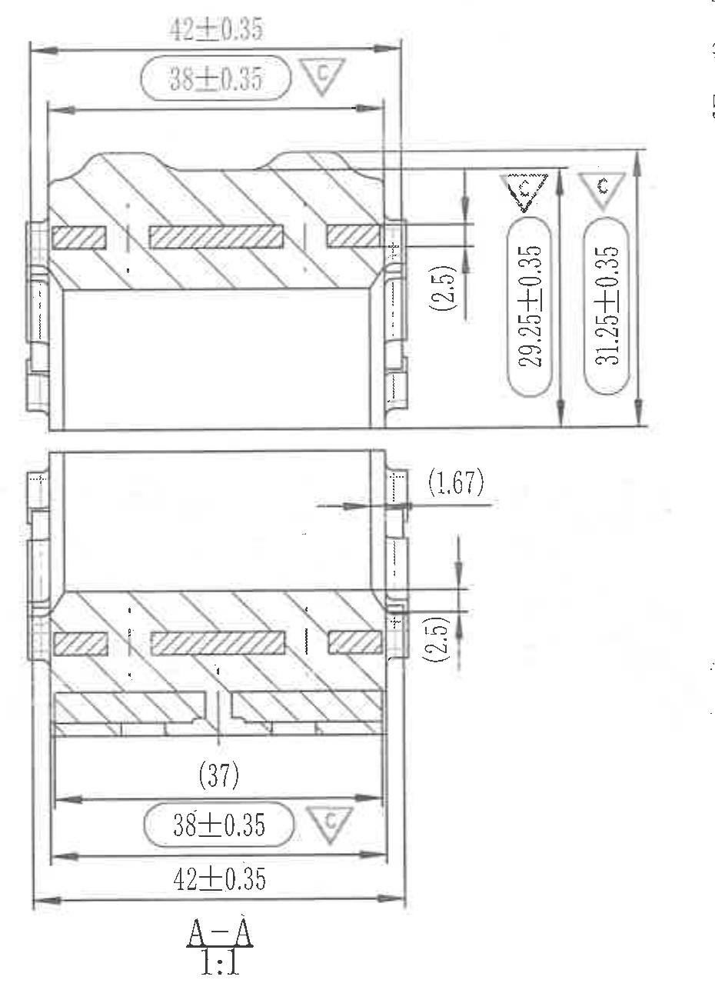

原图位置/视图名称：第 1 页中部 A-A 剖视图，bbox `[1845, 940, 2775, 2240]`，比例 `1:1`。

| 提取项 | 原图数值或文本 | 含义说明 |
|---|---|---|
| 剖视名称 | A-A，1:1 | 由主视图 A-A 剖切箭头生成的剖面视图。 |
| 上部总宽 | 42±0.35 | A-A 上半剖面外侧宽度尺寸。 |
| 上部关键宽度 | 38±0.35，▽C | A-A 上半剖面内侧宽度/关键尺寸，带 C 关键特性符号。 |
| 上部参考厚度 | (2.5) | 括号内参考尺寸，右侧上半部局部厚度/高度。 |
| 上部垂直关键尺寸 | 29.25±0.35，▽C | 右侧上半部垂直尺寸，带 C 关键特性符号。 |
| 上部垂直关键尺寸 | 31.25±0.35，▽C | 右侧上半部外侧垂直尺寸，带 C 关键特性符号。 |
| 侧向参考尺寸 | (1.67) | 括号内参考尺寸，右侧凸出/台阶位置。 |
| 下部参考厚度 | (2.5) | 括号内参考尺寸，右侧下半部局部厚度/高度。 |
| 下部参考宽度 | (37) | 括号内参考尺寸，下半剖面内部宽度。 |
| 下部关键宽度 | 38±0.35，▽C | A-A 下半剖面关键宽度，带 C 关键特性符号。 |
| 下部总宽 | 42±0.35 | A-A 下半剖面外侧总宽。 |
| T 编号/星号关键尺寸 | 未见 | A-A 剖视图中未见 T 编号或星号尺寸。 |

边界归属说明：裁切只包含 A-A 剖视图及其上下宽度、右侧垂直尺寸和标题。右侧留白未归入技术要求；左侧主视图的尺寸未归入本对象。

## object_6 | detail | 局部 B 放大图

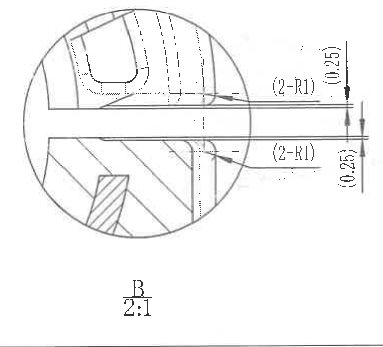

原图位置/视图名称：第 1 页左下局部 B，bbox `[800, 2310, 1560, 3000]`，比例 `2:1`。

| 提取项 | 原图数值或文本 | 含义说明 |
|---|---|---|
| 详图名称 | B，2:1 | 主视图 B 圆圈对应的局部放大图。 |
| 上侧圆角 | (2-R1) | 括号内参考尺寸，上侧局部 2 处 R1 圆角。 |
| 下侧圆角 | (2-R1) | 括号内参考尺寸，下侧局部 2 处 R1 圆角。 |
| 上侧薄壁/间隙 | (0.25) | 括号内参考尺寸，上侧水平开口附近 0.25。 |
| 下侧薄壁/间隙 | (0.25) | 括号内参考尺寸，下侧水平开口附近 0.25。 |
| T 编号/星号关键尺寸 | 未见 | 局部 B 中未见 T 编号或星号尺寸。 |

边界归属说明：初始裁切右下角带入了相邻视图尺寸片段，已重裁并收紧右边界。最终裁切只包含局部 B 的圆形放大区域、两处 `(2-R1)`、两处 `(0.25)` 和 B 2:1 标题，不包含相邻主视图/公差表内容。

## object_7 | detail | 产品硬度测量位置图

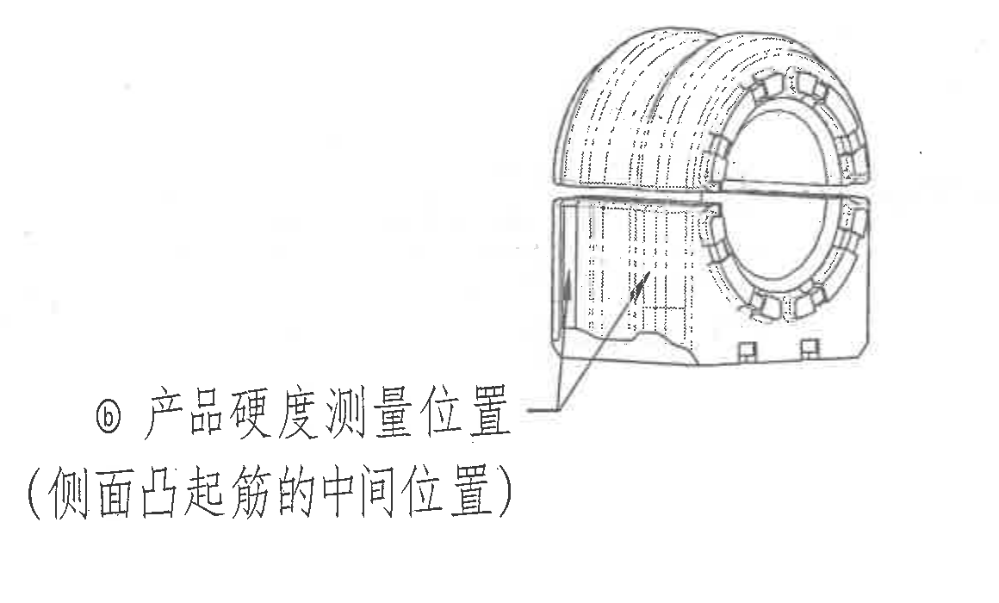

原图位置/视图名称：第 1 页下部中间硬度测量位置图，bbox `[1570, 2260, 2730, 2960]`。

| 提取项 | 原图数值或文本 | 含义说明 |
|---|---|---|
| 标识 | ⓑ | 与修订履历和技术要求中的 ⓑ 变更/要求相关。 |
| 文字说明 | 产品硬度测量位置（侧面凸起筋的中间位置） | 指定硬度测试取点位置。 |
| 引线/箭头 | 指向侧面凸起筋中间位置 | 表示硬度测量点应取在侧面凸起筋的中间。 |
| 尺寸/弧度 | 未标注 | 该位置图没有尺寸线、半径、角度或公差。 |
| T 编号/星号关键尺寸 | 未见 | 该裁切区域无 T 编号或星号尺寸。 |

边界归属说明：裁切包含硬度位置小图、引线和文字说明，未纳入 A-A 剖视图尺寸或右侧技术要求正文。

## object_8 | notes | 技术要求

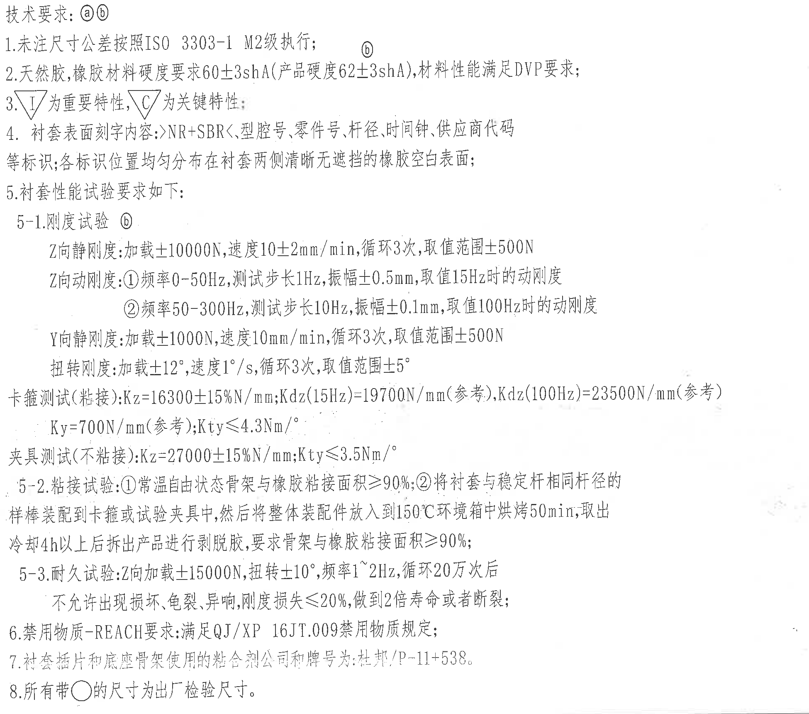

原图位置/视图名称：第 1 页右中技术要求，bbox `[2755, 615, 4705, 2335]`。

| 提取项 | 原图数值或文本 | 含义说明 |
|---|---|---|
| 标题 | 技术要求：ⓐⓑ | 技术要求适用于图中标识 ⓐ、ⓑ 的相关内容。 |
| 1 | 未注尺寸公差按照 ISO 3303-1 M2级执行 | 未单独标注公差的尺寸按该标准等级执行。 |
| 2 | 天然胶,橡胶材料硬度要求60±3shA(产品硬度62±3shA),材料性能满足DVP要求 | 材料硬度和 DVP 性能要求。括号内产品硬度为 62±3shA。 |
| 3 | ▽I 为重要特性, ▽C 为关键特性 | 解释图中三角符号含义。 |
| 4 | 衬套表面刻字内容：>NR+SBR<,型腔号,零件号,杆径,时间钟,供应商代码等标识；各标识位置均匀分布在衬套两侧清晰无遮挡的橡胶空白表面 | 表面标识内容和位置要求。 |
| 5 | 衬套性能试验要求如下 | 下列 5-1 至 5-3 为性能试验要求。 |
| 5-1 Z向静刚度 | 加载±10000N,速度10±2mm/min,循环3次,取值范围±500N | 刚度试验条件。 |
| 5-1 Z向动刚度 ① | 频率0-50Hz,测试步长1Hz,振幅±0.5mm,取值15Hz时的动刚度 | 低频段 Z 向动刚度测试。 |
| 5-1 Z向动刚度 ② | 频率50-300Hz,测试步长10Hz,振幅±0.1mm,取值100Hz时的动刚度 | 高频段 Z 向动刚度测试。 |
| 5-1 Y向静刚度 | 加载±1000N,速度10mm/min,循环3次,取值范围±500N | Y 向静刚度测试。 |
| 5-1 扭转刚度 | 加载±12°,速度1°/s,循环3次,取值范围±5° | 扭转刚度测试条件。 |
| 5-1 卡箍测试(粘接) | Kz=16300±15%N/mm;Kdz(15Hz)=19700N/mm(参考),Kdz(100Hz)=23500N/mm(参考); Ky=700N/mm(参考);Kty≤4.3Nm/° | 粘接状态下刚度指标，括号内“参考”为参考值。 |
| 5-1 夹具测试(不粘接) | Kz=27000±15%N/mm;Kty≤3.5Nm/° | 不粘接状态下刚度指标。 |
| 5-2 粘接试验 | ①常温自由状态骨架与橡胶粘接面积≥90%；②将衬套与稳定杆相同杆径的样棒装配到卡箍或试验夹具中,然后将整体装配件放入到150℃环境箱中烘烤50min,取出冷却4h以上后拆出产品进行剥脱胶,要求骨架与橡胶粘接面积≥90% | 粘接面积和热处理后剥脱胶要求。 |
| 5-3 耐久试验 | Z向加载±15000N,扭转±10°,频率1~2Hz,循环20万次后不允许出现损坏,龟裂,异响,刚度损失≤20%,做到2倍寿命或者断裂 | 耐久载荷、扭转、频率、循环次数和判定条件。 |
| 6 | 禁用物质-REACH要求:满足QJ/XP 16JT.009禁用物质规定 | 禁用物质要求。 |
| 7 | 衬套插片和底座骨架使用的粘合剂公司和牌号为:杜邦/P-11+538 | 粘合剂供应商/牌号要求。 |
| 8 | 所有带○的尺寸为出厂检验尺寸 | 图中带圆圈/圆角框的尺寸应作为出厂检验尺寸。 |

边界归属说明：裁切只包含右侧技术要求正文，未包含上方修订表、下方 BOM 和标题栏。技术要求中的符号解释适用于各视图，但具体尺寸仍按各视图对象归属。

## object_9 | table | DIN ISO 3302-1 Class M2 公差表

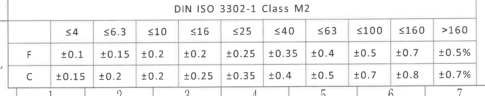

原图位置/视图名称：第 1 页左下公差表，bbox `[330, 3010, 2295, 3400]`。

### 原表还原

| DIN ISO 3302-1 Class M2 | ≤4 | ≤6.3 | ≤10 | ≤16 | ≤25 | ≤40 | ≤63 | ≤100 | ≤160 | >160 |
|---|---:|---:|---:|---:|---:|---:|---:|---:|---:|---:|
| F | ±0.1 | ±0.15 | ±0.2 | ±0.2 | ±0.25 | ±0.35 | ±0.4 | ±0.5 | ±0.7 | ±0.5% |
| C | ±0.15 | ±0.2 | ±0.2 | ±0.25 | ±0.35 | ±0.4 | ±0.5 | ±0.7 | ±0.8 | ±0.7% |

### 提取表格

| 提取项 | 原图数值或文本 | 含义说明 |
|---|---|---|
| 表题 | DIN ISO 3302-1 Class M2 | 橡胶件尺寸公差等级表。 |
| 行 F | ±0.1 至 ±0.7；>160 为 ±0.5% | F 类尺寸范围对应公差。 |
| 行 C | ±0.15 至 ±0.8；>160 为 ±0.7% | C 类尺寸范围对应公差。 |

边界归属说明：裁切完整包含公差表标题、列头、F/C 两行和外框；未纳入上方局部 B 或右侧标题栏。

## object_10 | table | 明细/BOM 表

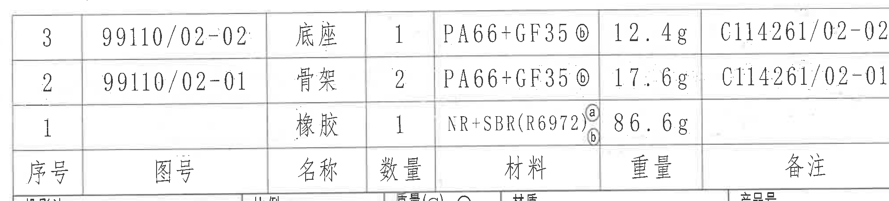

原图位置/视图名称：第 1 页右下明细表，bbox `[2745, 2315, 4755, 2770]`。

### 原表还原

| 序号 | 图号 | 名称 | 数量 | 材料 | 重量 | 备注 |
|---:|---|---|---:|---|---:|---|
| 3 | 99110/02-02 | 底座 | 1 | PA66+GF35 ⓑ | 12.4g | C114261/02-02 |
| 2 | 99110/02-01 | 骨架 | 2 | PA66+GF35 ⓑ | 17.6g | C114261/02-01 |
| 1 |  | 橡胶 | 1 | NR+SBR(R6972) ⓐⓑ | 86.6g |  |

### 提取表格

| 提取项 | 原图数值或文本 | 含义说明 |
|---|---|---|
| 序号 3 | 图号 99110/02-02；底座；数量 1；材料 PA66+GF35 ⓑ；重量 12.4g；备注 C114261/02-02 | 底座零件明细。 |
| 序号 2 | 图号 99110/02-01；骨架；数量 2；材料 PA66+GF35 ⓑ；重量 17.6g；备注 C114261/02-01 | 骨架零件明细。 |
| 序号 1 | 橡胶；数量 1；材料 NR+SBR(R6972) ⓐⓑ；重量 86.6g | 橡胶材料明细，图号和备注为空白。 |

边界归属说明：BOM 右边界已放宽重裁，备注列完整。裁切只包含明细表，不包含下方标题栏字段。

## object_11 | title_block | 标题栏

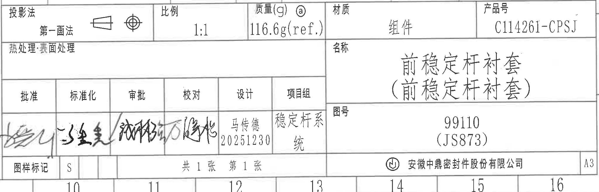

原图位置/视图名称：第 1 页右下标题栏，bbox `[2770, 2740, 4810, 3395]`。

### 标题栏字段还原

| 字段 | 原图文本 |
|---|---|
| 投影法 | 第一画法 |
| 比例 | 1:1 |
| 质量(g) | ⓐ 116.6g(ref.) |
| 材质 | 组件 |
| 产品号 | C114261-CPSJ |
| 热处理:表面处理 | 空白 |
| 名称 | 前稳定杆衬套（前稳定杆衬套） |
| 图号 | 99110 (JS873) |
| 图样标记 | S |
| 张数 | 共 1 张 第 1 张 |
| 公司 | 安徽中鼎密封件股份有限公司 |
| 幅面 | A3 |

### 签署栏还原

| 批准 | 标准化 | 审批 | 校对 | 设计 | 项目组 |
|---|---|---|---|---|---|
| 手写签名 | 手写签名 | 手写签名 | 手写签名 | 马传德 20251230 | 稳定杆系统 |

### 提取表格

| 提取项 | 原图数值或文本 | 含义说明 |
|---|---|---|
| 产品号 | C114261-CPSJ | 图纸产品号。 |
| 名称 | 前稳定杆衬套（前稳定杆衬套） | 零件/组件名称。 |
| 图号 | 99110 (JS873) | 图样号及括号内代号。 |
| 质量 | ⓐ 116.6g(ref.) | 组件参考质量，`ref.` 表示参考。 |
| 材质 | 组件 | 标题栏材料栏为组件。 |
| 设计 | 马传德 20251230 | 设计签署及日期。 |

边界归属说明：标题栏右边界已放宽重裁，产品号、公司名和 A3 幅面完整。裁切不包含上方 BOM 数据行，仅包含标题栏和签署栏内容。

## 裁切检查记录

| object_id | 检查结论 | 处理记录 |
|---|---|---|
| object_1 | 完整包含表格标题、表头和空白数据行。 | 无边缘文字裁断；未混入轴测图。 |
| object_2 | 完整包含修订履历表全部列和 3 行记录。 | 无边缘文字裁断；未混入技术要求。 |
| object_3 | 完整包含轴测图和 X/Y/Z 坐标。 | 无尺寸文字；未混入相邻表格。 |
| object_4 | 完整包含主视图尺寸线、箭头、A-A/B 标识和右侧引出尺寸。 | 右侧靠边尺寸线完整，未把 A-A 剖视图尺寸归入主视图。 |
| object_5 | 完整包含 A-A 剖视图、上下尺寸线和标题 A-A 1:1。 | 初裁底部标题贴边，已向下放宽重裁。 |
| object_6 | 完整包含局部 B 放大图、两处 `(2-R1)`、两处 `(0.25)` 和 B 2:1 标题。 | 初裁混入相邻尺寸残片，已收紧右边界重裁。 |
| object_7 | 完整包含硬度测量位置图、引线和说明文字。 | 未混入剖视图尺寸或技术要求正文。 |
| object_8 | 完整包含技术要求 1 至 8 条。 | 上下边界未裁断文字；未混入 BOM/标题栏。 |
| object_9 | 完整包含 DIN ISO 3302-1 Class M2 表题、列头和 F/C 两行。 | 未混入局部 B 或标题栏。 |
| object_10 | 完整包含 BOM 表头、3 条明细和备注列。 | 初裁右侧备注列贴边，已向右放宽重裁。 |
| object_11 | 完整包含标题栏、签署栏、产品号、图号、公司名和 A3 幅面。 | 初裁产品号右侧贴边，已向右放宽重裁。 |
