# 20C114262 PDF 内容识别结果

整页渲染图：  
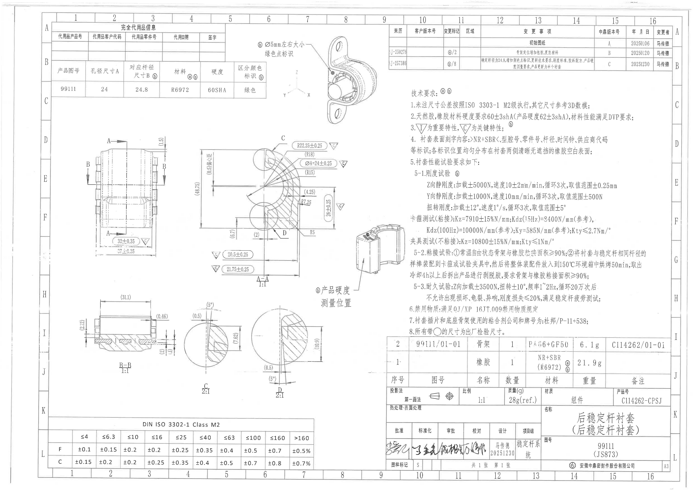

坐标说明：本文中的 bbox 均为基于整页 PNG `outputs/20C114262_assets/images/page_1.png` 的 `[x, y, width, height]` 像素坐标。括号内尺寸按原图识别为参考尺寸；未见星号关键尺寸和 T 编号。可见关键/重要特性以三角框 `C`、三角框 `I` 以及圈号 `ⓐ`、`ⓑ` 表示。

## object_1 - table - 完全代用品信息 / 产品信息表

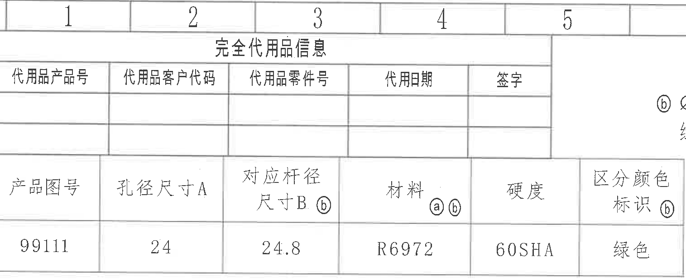

原图位置/视图名称：页 1 左上；bbox `[390, 90, 1515, 620]`；对象类型 `table`。

原表还原：

| 代用品产品号 | 代用品客户代码 | 代用品零件号 | 代用日期 | 签字 |
|---|---|---|---|---|
|  |  |  |  |  |

| 产品图号 | 孔径尺寸A | 对应杆径尺寸B ⓑ | 材料 ⓐⓑ | 硬度 | 区分颜色标识 ⓑ |
|---|---:|---:|---|---|---|
| 99111 | 24 | 24.8 | R6972 | 60SHA | 绿色 |

提取表格：

| 提取项 | 原图数值或文本 | 含义说明 |
|---|---|---|
| 标题 | 完全代用品信息 | 上部替代品信息栏。 |
| 代用品字段 | 代用品产品号、代用品客户代码、代用品零件号、代用日期、签字 | 原表字段存在但当前行为空。 |
| 产品图号 | 99111 | 本产品图号。 |
| 孔径尺寸A | 24 | 孔径尺寸 A。 |
| 对应杆径尺寸B | 24.8 ⓑ | 对应杆径 B，带圈号 `ⓑ` 变更/要求标识。 |
| 材料 | R6972 ⓐⓑ | 材料代号，带 `ⓐ`、`ⓑ` 标识。 |
| 硬度 | 60SHA | 橡胶/产品硬度字段。 |
| 区分颜色标识 | 绿色 ⓑ | 颜色识别要求为绿色，带 `ⓑ` 标识。 |

边界归属说明：右边界贴近 object_2 的绿色点标识说明；为保留表格最后一列完整，裁切边缘可见相邻标注边缘，该边缘不属于本表，不在本对象提取。

## object_2 - view - 等轴测外观图 / 绿色点标识

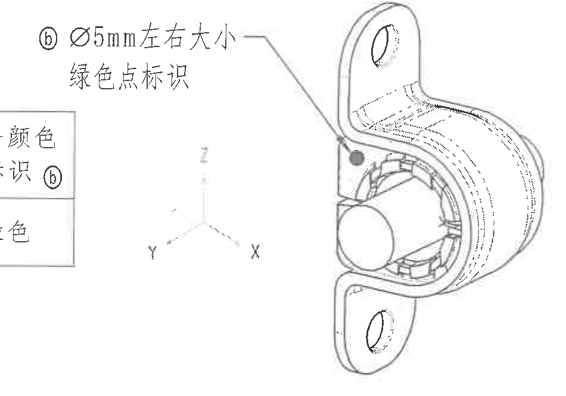

原图位置/视图名称：页 1 上中部等轴测图；bbox `[1775, 255, 950, 665]`；对象类型 `view`。

提取表格：

| 提取项 | 原图数值或文本 | 含义说明 |
|---|---|---|
| 视图 | 等轴测外观图 | 显示衬套、骨架、孔位及安装方向的三维外观。 |
| 坐标轴 | X、Y、Z | 3D 数模/方向参考坐标。 |
| 颜色点标识 | ⓑ Ø5mm左右大小，绿色点标识 | 圈号 `ⓑ` 要求在指示位置做直径约 5 mm 的绿色点。 |
| 绿色点位置 | 引线指向外侧表面黑点位置 | 绿色点位于图示外侧橡胶/壳体表面，作为区分颜色标识。 |

边界归属说明：左侧可见 object_1 表格残边，原因是原图绿色点说明与左上表格贴近；残边不属于等轴测图，不提取。下方未包含 A-A 剖面尺寸。

## object_3 - table - 修订履历表

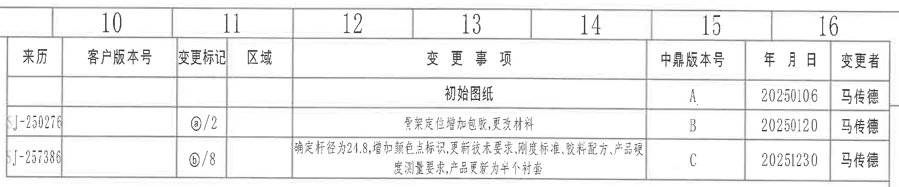

原图位置/视图名称：页 1 右上；bbox `[2760, 90, 2060, 430]`；对象类型 `table`。

原表还原：

| 来历 | 客户版本号 | 变更标记 | 区域 | 变更事项 | 中鼎版本号 | 年月日 | 变更者 |
|---|---|---|---|---|---|---|---|
|  |  |  |  | 初始图纸 | A | 20250106 | 马传德 |
| J-250276 |  | ⓐ/2 |  | 骨架定位增加包胶，更改材料 | B | 20250120 | 马传德 |
| J-257386 |  | ⓑ/8 |  | 确定杆径为24.8，增加颜色点标识，更新技术要求、刚度标准、胶料配方、产品硬度测量要求，产品更新为半个衬套 | C | 20251230 | 马传德 |

提取表格：

| 提取项 | 原图数值或文本 | 含义说明 |
|---|---|---|
| 版本 A | 初始图纸；20250106；马传德 | 初版发布记录。 |
| 版本 B | ⓐ/2；骨架定位增加包胶，更改材料；20250120；马传德 | 与圈号 `ⓐ` 相关的第 2 项变更。 |
| 版本 C | ⓑ/8；确定杆径为24.8，增加颜色点标识，更新技术要求、刚度标准、胶料配方、产品硬度测量要求，产品更新为半个衬套；20251230；马传德 | 与圈号 `ⓑ` 相关的第 8 项变更；当前图右下标题栏版本日期也为 20251230。 |

边界归属说明：裁切包含完整履历表外框、列头和三行记录；顶部页格编号 10-16 为图框坐标，不作为修订内容。

## object_4 - view - 主视图

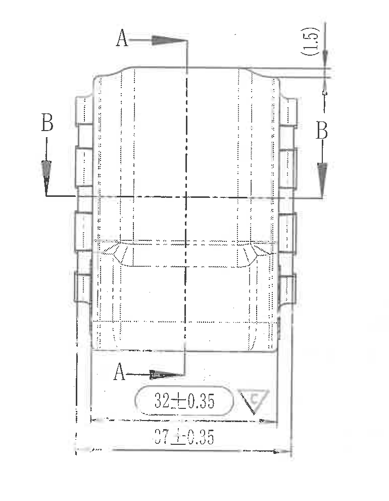

原图位置/视图名称：页 1 左中主视图；bbox `[535, 930, 770, 990]`；对象类型 `view`。

提取表格：

| 提取项 | 原图数值或文本 | 含义说明 |
|---|---|---|
| 剖切标识 | A（上、下两处箭头） | 指示 A-A 剖切位置与方向。 |
| 剖切标识 | B（左、右两处箭头） | 指示 B-B 剖切位置与方向，不能归入 A-A 或 B-B 剖面尺寸。 |
| 尺寸 | 32±0.35 | 主视图底部局部宽度/间距尺寸，旁有三角框 `C` 特性标记。 |
| 尺寸 | 27±0.35 | 主视图底部总宽/外侧间距尺寸。 |
| 参考尺寸 | (1.5) | 顶部台阶/高度参考尺寸，括号表示参考。 |
| 结构线 | 中心线、隐藏线、外形线 | 表示对称中心、内部结构和侧向齿/凸台轮廓。 |

边界归属说明：左右 B 剖切箭头、上下 A 剖切箭头、底部 `32±0.35` 与 `27±0.35` 尺寸线均完整包含。右侧/下方未混入 A-A 剖面或 B-B 剖面尺寸。

## object_5 - section - A-A 剖面图 1:1

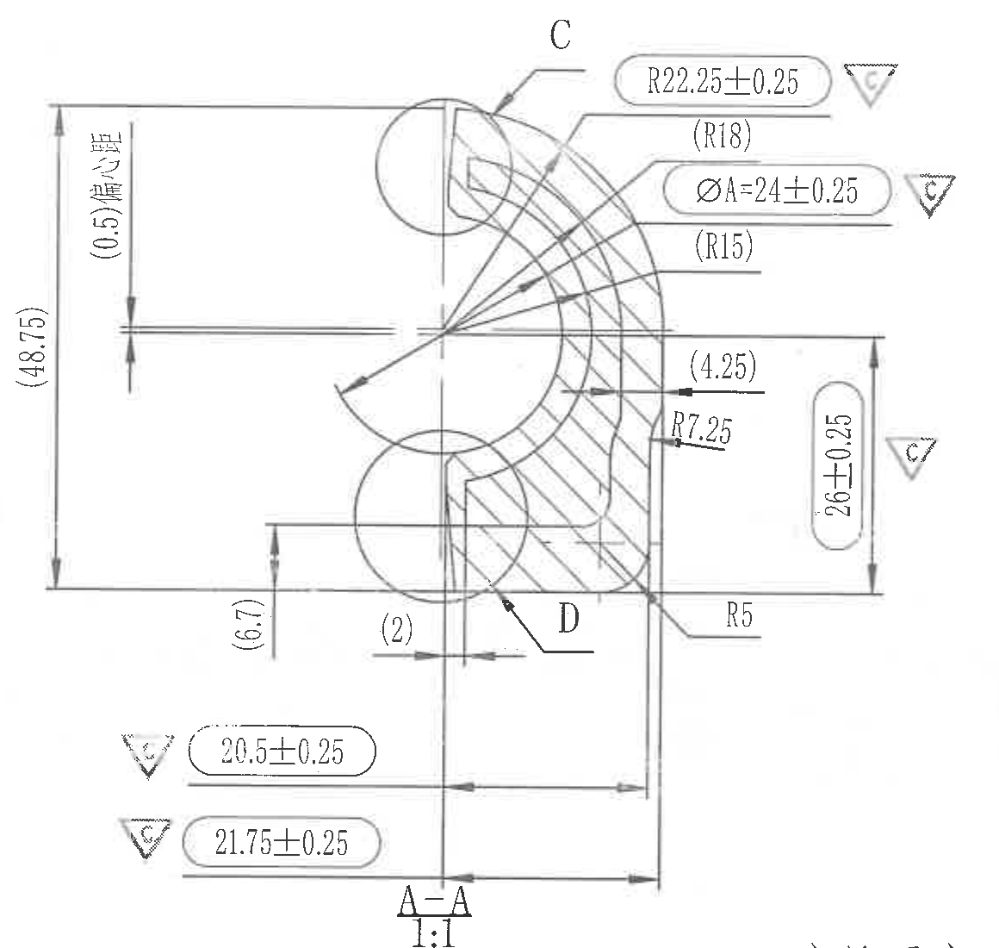

原图位置/视图名称：页 1 中部 A-A 剖面，比例 1:1；bbox `[1370, 945, 1160, 1100]`；对象类型 `section`。

提取表格：

| 提取项 | 原图数值或文本 | 含义说明 |
|---|---|---|
| 视图标识 | A-A，1:1 | 主视图中 A 剖切所得剖面。 |
| 局部索引 | C | 引线指向上端局部，另见 object_7。 |
| 局部索引 | D | 引线指向下端局部，另见 object_8。 |
| 参考总高 | (48.75) | 左侧整体高度参考尺寸。 |
| 参考偏心 | (0.5)偏心距 | 左侧竖向标注，表示偏心距参考值。 |
| 参考尺寸 | (6.7) | 左下局部高度/间距参考尺寸。 |
| 参考尺寸 | (2) | 下部小台阶/偏移参考尺寸。 |
| 半径 | R22.25±0.25，三角框 C | 上侧大圆弧半径，关键特性标记。 |
| 参考半径 | (R18) | 与上侧圆弧相关的参考半径。 |
| 直径 | ØA=24±0.25，三角框 C | 孔径 A 的直径尺寸，关键特性标记。 |
| 参考半径 | (R15) | 内侧圆弧参考半径。 |
| 参考尺寸 | (4.25) | 右中局部水平/壁厚参考尺寸。 |
| 半径 | R7.25 | 内部圆角半径。 |
| 尺寸 | 26±0.25，三角框 C | 右侧竖向尺寸，关键特性标记。 |
| 半径 | R5 | 右下圆角半径。 |
| 尺寸 | 20.5±0.25，三角框 C | 下方较短水平尺寸，关键特性标记。 |
| 尺寸 | 21.75±0.25，三角框 C | 下方较长水平尺寸，关键特性标记。 |

边界归属说明：本裁切去除了右下相邻硬度测量位置图，仅包含 A-A 剖面及其 C/D 局部索引。所有括号参考尺寸、R 圆弧半径、Ø 直径、关键三角框 C 标识均归属 A-A；C、D 局部放大视图的细节尺寸分别在 object_7、object_8 提取，不并入 A-A。

## object_6 - section - B-B 剖面图 1:1

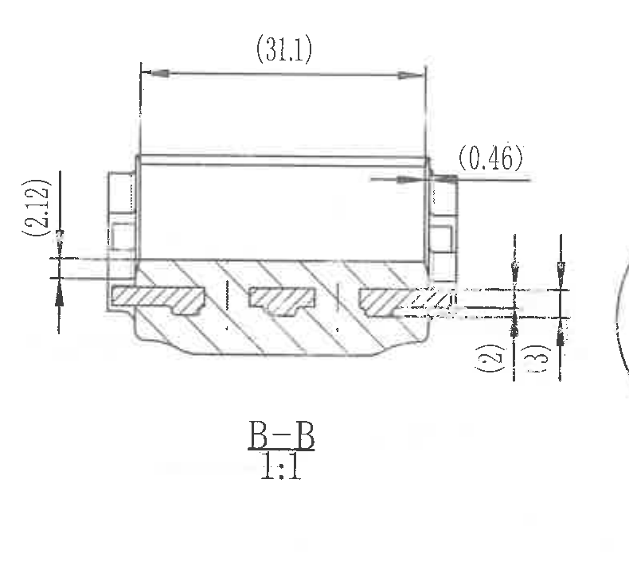

原图位置/视图名称：页 1 左下 B-B 剖面，比例 1:1；bbox `[540, 2060, 790, 720]`；对象类型 `section`。

提取表格：

| 提取项 | 原图数值或文本 | 含义说明 |
|---|---|---|
| 视图标识 | B-B，1:1 | 主视图中 B 剖切所得剖面。 |
| 参考长度 | (31.1) | 顶部整体长度参考尺寸。 |
| 参考尺寸 | (0.46) | 右上局部凸缘/边缘参考尺寸。 |
| 参考尺寸 | (2.12) | 左侧竖向局部参考尺寸。 |
| 参考尺寸 | (2) | 右侧竖向局部参考尺寸。 |
| 尺寸 | 3 | 右侧竖向尺寸，未加括号，按实际标注尺寸读取。 |
| 剖面结构 | 斜线剖面、内部橡胶/骨架结构 | 表示 B-B 剖切后的材料截面与内部槽/凸台。 |

边界归属说明：左侧 `(2.12)`、右侧 `(2)` 和 `3` 的尺寸线及文字均完整包含。右边缘可见极少 object_7 的 C 局部圆边残影，非 B-B 标注，不提取。

## object_7 - detail - C 局部视图 2:1

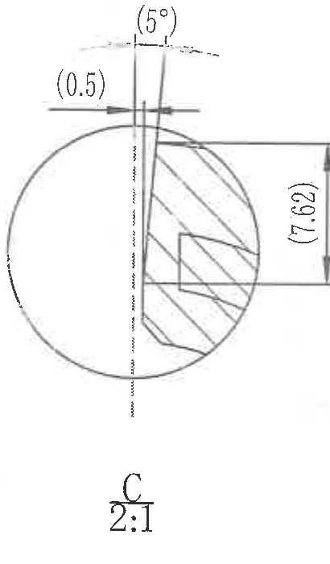

原图位置/视图名称：页 1 下中偏左 C 局部，比例 2:1；bbox `[1305, 2150, 410, 700]`；对象类型 `detail`。

提取表格：

| 提取项 | 原图数值或文本 | 含义说明 |
|---|---|---|
| 视图标识 | C，2:1 | A-A 剖面中 C 指示处的放大局部。 |
| 参考尺寸 | (0.5) | 局部窄缝/边距参考尺寸。 |
| 参考角度 | (5°) | 局部斜面角度参考尺寸。 |
| 参考尺寸 | (7.62) | 右侧局部竖向高度参考尺寸。 |
| 剖面结构 | 局部圆形放大框、斜线剖面 | 展示 C 处局部形状和剖面材料。 |

边界归属说明：该裁切保留 C 局部自身圆形放大框和全部参考尺寸。左侧/上侧 `(0.5)` 与 `(5°)` 属于 C 局部，不归入 B-B；右侧未混入 D 局部。

## object_8 - detail - D 局部视图 2:1

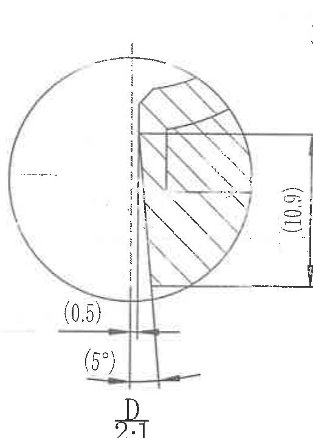

原图位置/视图名称：页 1 下中 D 局部，比例 2:1；bbox `[1780, 2110, 515, 720]`；对象类型 `detail`。

提取表格：

| 提取项 | 原图数值或文本 | 含义说明 |
|---|---|---|
| 视图标识 | D，2:1 | A-A 剖面中 D 指示处的放大局部。 |
| 参考尺寸 | (10.9) | 右侧局部竖向高度参考尺寸。 |
| 参考尺寸 | (0.5) | 下侧窄缝/偏移参考尺寸。 |
| 参考角度 | (5°) | 下侧斜面角度参考尺寸。 |
| 剖面结构 | 局部圆形放大框、斜线剖面 | 展示 D 处局部形状和剖面材料。 |

边界归属说明：右侧 `(10.9)` 尺寸线、下侧 `(0.5)` 与 `(5°)` 标注均完整包含。右上原先邻近硬度说明文字已排除；最右边界未截断 `(10.9)` 标注。

## object_9 - view - 产品硬度测量位置图

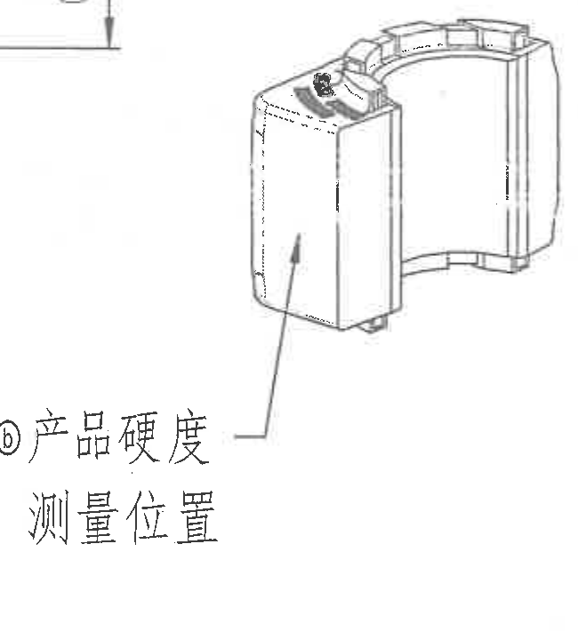

原图位置/视图名称：页 1 中下部小等轴测图；bbox `[2260, 1580, 650, 720]`；对象类型 `view`。

提取表格：

| 提取项 | 原图数值或文本 | 含义说明 |
|---|---|---|
| 视图 | 小等轴测位置图 | 显示产品硬度测量位置。 |
| 位置说明 | ⓑ 产品硬度 / 测量位置 | 圈号 `ⓑ` 对应产品硬度测量位置要求。 |
| 引线 | 箭头指向外侧立面 | 测量点位于箭头所指产品外侧面。 |

边界归属说明：顶部可见少量 A-A 右侧尺寸线尾端，这是相邻对象残线；为保留硬度位置图上缘未继续下移，残线不属于本对象，不提取。右侧 NOTES 正文已排除。

## object_10 - notes - 技术要求

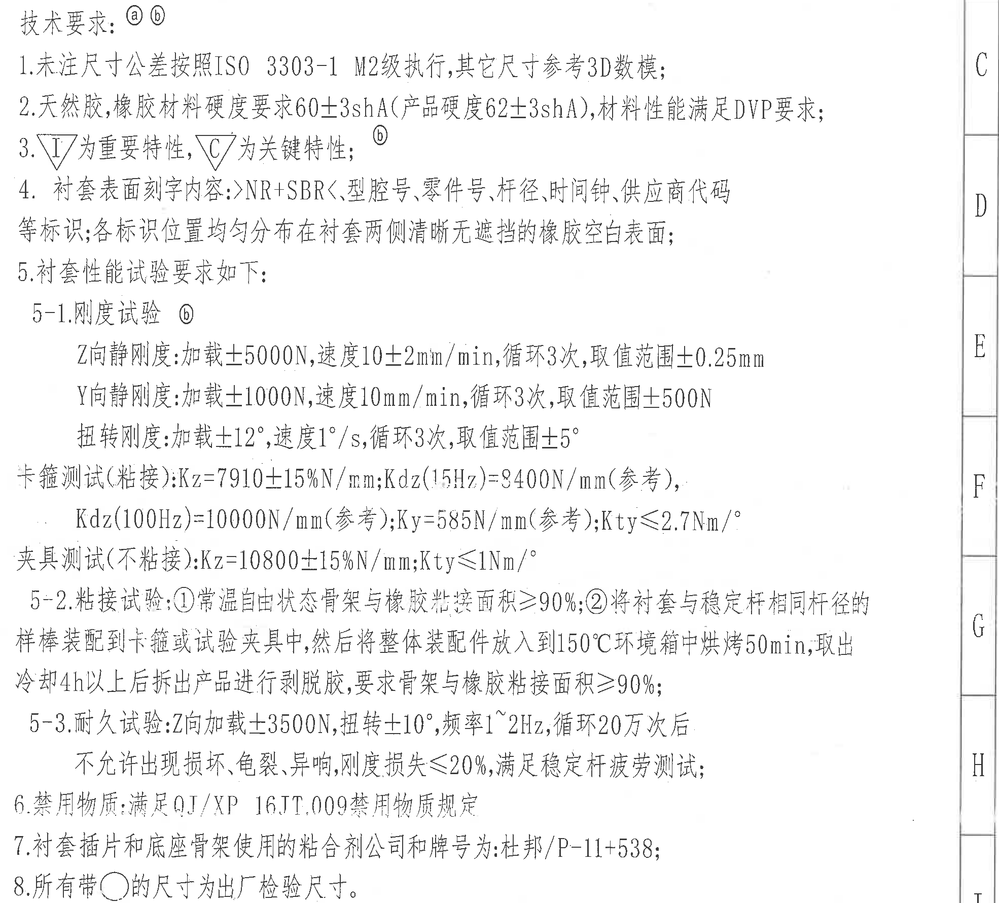

原图位置/视图名称：页 1 右中技术要求；bbox `[2895, 620, 1970, 1780]`；对象类型 `notes`。

提取表格：

| 提取项 | 原图数值或文本 | 含义说明 |
|---|---|---|
| 标题 | 技术要求：ⓐ ⓑ | 技术要求与圈号 `ⓐ`、`ⓑ` 变更/特性标记关联。 |
| 1 | 未注尺寸公差按照ISO 3303-1 M2级执行，其它尺寸参考3D数模； | 未单独标注公差的尺寸按 M2 级执行，其余参考 3D 数模。 |
| 2 | 天然胶，橡胶材料硬度要求60±3shA（产品硬度62±3shA），材料性能满足DVP要求； | 材料硬度与产品硬度要求。 |
| 3 | 三角框 I 为重要特性，三角框 C 为关键特性；ⓑ | 重要/关键特性符号解释。 |
| 4 | 衬套表面刻字内容：>NR+SBR<、型腔号、零件号、杆径、时间钟、供应商代码等标识；各标识位置均匀分布在衬套两侧清晰无遮挡的橡胶空白表面； | 表面刻字和分布要求。 |
| 5 | 衬套性能试验要求如下： | 试验要求总项。 |
| 5-1 刚度试验 | Z向静刚度：加载±5000N，速度10±2mm/min，循环3次，取值范围±0.25mm；Y向静刚度：加载±1000N，速度10mm/min，循环3次，取值范围±500N；扭转刚度：加载±12°，速度1°/s，循环3次，取值范围±5°； | 静刚度与扭转刚度试验载荷、速度、循环次数和取值范围。 |
| 5-1 卡箍/夹具测试 | 卡箍测试（粘接）：Kz=7910±15%N/mm；Kdz(15Hz)=8400N/mm（参考）；Kdz(100Hz)=10000N/mm（参考）；Ky=585N/mm（参考）；Kty≤2.7N.m/°。夹具测试（不粘接）：Kz=10800±15%N/mm；Kty≤1Nm/°。 | 粘接与不粘接测试刚度指标。 |
| 5-2 粘接试验 | ①常温自由状态骨架与橡胶粘接面积≥90%；②将衬套与稳定杆相同杆径的样棒装配到卡箍或试验夹具中，然后将整体装配件放入到150℃环境箱中烘烤50min，取出冷却4h以上后拆出产品进行剥脱胶，要求骨架与橡胶粘接面积≥90%； | 粘接面积与热处理后剥脱胶要求。 |
| 5-3 耐久试验 | Z向加载±3500N，扭转±10°，频率1~2Hz，循环20万次后不允许出现损坏、龟裂、异响，刚度损失≤20%，满足稳定杆疲劳测试； | 耐久测试载荷、频率、循环次数和判定条件。 |
| 6 | 禁用物质：满足QJ/XP 16TT.009禁用物质规定 | 禁用物质标准要求。 |
| 7 | 衬套插片和底座骨架使用的粘合剂公司和牌号为：杜邦/P-11+538； | 粘合剂品牌/牌号。 |
| 8 | 所有带○的尺寸为出厂检验尺寸。 | 圆圈标记尺寸为出厂检验尺寸。 |

边界归属说明：裁切包含完整技术要求正文；左侧硬度位置图不在本对象中提取，右侧图框坐标字母 C-I 为图框边界，不作为 NOTES 内容。

## object_11 - table - DIN ISO 3302-1 Class M2 公差表

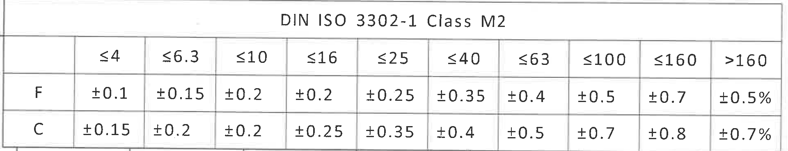

原图位置/视图名称：页 1 左下公差表；bbox `[335, 2980, 1920, 370]`；对象类型 `table`。

原表还原：

| DIN ISO 3302-1 Class M2 | ≤4 | ≤6.3 | ≤10 | ≤16 | ≤25 | ≤40 | ≤63 | ≤100 | ≤160 | >160 |
|---|---:|---:|---:|---:|---:|---:|---:|---:|---:|---:|
| F | ±0.1 | ±0.15 | ±0.2 | ±0.2 | ±0.25 | ±0.35 | ±0.4 | ±0.5 | ±0.7 | ±0.5% |
| C | ±0.15 | ±0.2 | ±0.2 | ±0.25 | ±0.35 | ±0.4 | ±0.5 | ±0.7 | ±0.8 | ±0.7% |

提取表格：

| 提取项 | 原图数值或文本 | 含义说明 |
|---|---|---|
| 标准 | DIN ISO 3302-1 Class M2 | 橡胶制品尺寸公差等级表。 |
| F 行 | ±0.1 到 ±0.5% | F 类尺寸公差随尺寸段变化。 |
| C 行 | ±0.15 到 ±0.7% | C 类尺寸公差随尺寸段变化。 |

边界归属说明：公差表标题、尺寸段表头、F/C 两行均完整包含；未混入右下标题栏。

## object_12 - table - 明细表 / BOM

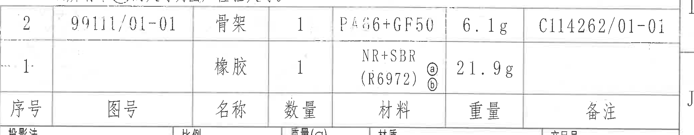

原图位置/视图名称：页 1 右下明细表；bbox `[2760, 2385, 2070, 405]`；对象类型 `table`。

原表还原：

| 序号 | 图号 | 名称 | 数量 | 材料 | 重量 | 备注 |
|---|---|---|---:|---|---|---|
| 2 | 99111/01-01 | 骨架 | 1 | PA66+GF50 | 6.1g | C114262/01-01 |
| 1. |  | 橡胶 | 1 | NR+SBR (R6972) ⓐⓑ | 21.9g |  |

提取表格：

| 提取项 | 原图数值或文本 | 含义说明 |
|---|---|---|
| 明细 2 | 图号 99111/01-01；名称 骨架；数量 1；材料 PA66+GF50；重量 6.1g；备注 C114262/01-01 | 骨架件明细。 |
| 明细 1 | 名称 橡胶；数量 1；材料 NR+SBR (R6972) ⓐⓑ；重量 21.9g | 橡胶件明细，材料与圈号 `ⓐ`、`ⓑ` 关联。 |
| 表头 | 序号、图号、名称、数量、材料、重量、备注 | 原图表头位于两行明细下方，本表按字段对应还原。 |

边界归属说明：裁切完整包含两行明细、表头和备注列。底部可见下一行标题栏字段边缘，不属于明细表，不提取。

## object_13 - title_block - 标题栏

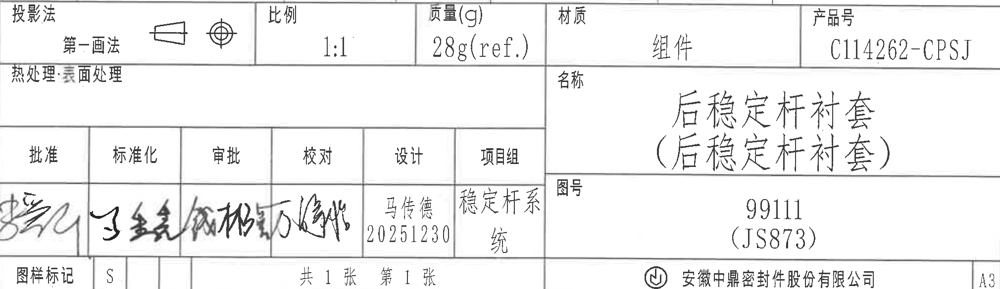

原图位置/视图名称：页 1 右下标题栏；bbox `[2760, 2760, 2020, 585]`；对象类型 `title_block`。

提取表格：

| 提取项 | 原图数值或文本 | 含义说明 |
|---|---|---|
| 投影法 | 第一画法 | 投影视图方法，旁有投影符号。 |
| 比例 | 1:1 | 图样比例。 |
| 质量(g) | 28g(ref.) | 组件质量参考值。 |
| 材质 | 组件 | 标题栏材质字段。 |
| 产品号 | C114262-CPSJ | 产品号。 |
| 热处理/表面处理 | 热处理：表面处理 | 原栏位存在，未见具体填充值。 |
| 名称 | 后稳定杆衬套（后稳定杆衬套） | 图样名称。 |
| 图号 | 99111（JS873） | 图样编号。 |
| 批准/标准化/审批/校对 | 手写签名 | 原图为手写签名，无法可靠转写为标准文字。 |
| 设计 | 马传德 20251230 | 设计栏姓名与日期。 |
| 项目组 | 稳定杆系统 | 项目组字段。 |
| 图样标记 | S. | 图样标记字段。 |
| 页数 | 共1张 第1张 | 图纸页数。 |
| 公司 | 安徽中鼎密封件股份有限公司 | 出图单位。 |
| 幅面 | A3 | 图纸幅面。 |

边界归属说明：标题栏从投影法/比例/质量行起裁切，未重复提取上方明细表。底部保留公司名和 A3 幅面，排除页面底部坐标格。

## 裁切检查记录

| 对象 | 检查结果 | 完整性与归属说明 |
|---|---|---|
| object_1 | 通过，带边界说明 | 产品信息表行列完整；右侧相邻 object_2 标注边缘不提取。 |
| object_2 | 通过，带边界说明 | 等轴测轮廓、绿色点说明和引线完整；左侧表格残边不提取。 |
| object_3 | 通过 | 修订履历表列头和三行记录完整；顶部图框坐标不提取。 |
| object_4 | 通过 | 主视图 A/B 剖切标识、`32±0.35`、`27±0.35`、`(1.5)` 均完整。 |
| object_5 | 通过 | A-A 剖面尺寸线、R/Ø 标注、参考尺寸和 C/D 索引完整；未带入硬度位置图主体。 |
| object_6 | 通过，带边界说明 | B-B 剖面 `(31.1)`、`(0.46)`、`(2.12)`、`(2)`、`3` 均完整；右侧极少 C 圆边残影不提取。 |
| object_7 | 通过 | C 局部 `(0.5)`、`(5°)`、`(7.62)` 和 2:1 标识完整；未混入 D 局部。 |
| object_8 | 通过 | D 局部 `(10.9)`、`(0.5)`、`(5°)` 和 2:1 标识完整；右侧边界未截断标注。 |
| object_9 | 通过，带边界说明 | 硬度测量位置图和说明完整；顶部少量 A-A 尺寸线尾端不提取。 |
| object_10 | 通过 | 技术要求正文完整；右侧图框坐标字母不提取。 |
| object_11 | 通过 | 公差表标题、表头、F/C 两行完整。 |
| object_12 | 通过，带边界说明 | 两行明细、表头、备注列完整；底部标题栏边缘不提取。 |
| object_13 | 通过 | 标题栏主体字段、公司名和 A3 幅面完整；未重复提取明细表。 |

