# 20C114263 内容识别与裁切提取

整页渲染图：

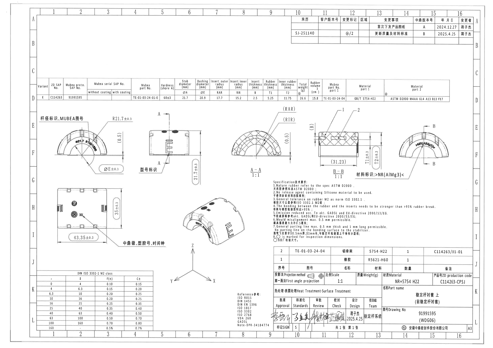

页面信息：1 页，整页 PNG 尺寸 4959 x 3505 px，bbox `[0, 0, 4959, 3505]`。

## object_1 - 顶部右侧修订履历表

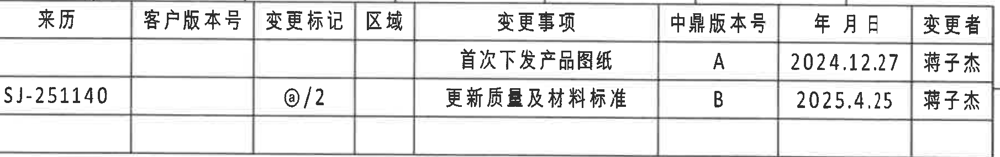

- 原图位置/视图名称：顶部右侧修订履历表，page 1，bbox `[2965, 160, 4775, 445]`。
- object_kind：`table`。

| 来历 | 客户版本号 | 变更标记 | 区域 | 变更事项 | 中鼎版本号 | 年 月 日 | 变更者 |
|---|---|---|---|---|---|---|---|
|  |  |  |  | 首次下发产品图纸 | A | 2024.12.27 | 蒋子杰 |
| SJ-251140 |  | @/2 |  | 更新质量及材料标准 | B | 2025.4.25 | 蒋子杰 |

| 提取项 | 原图数值或文本 | 含义说明 |
|---|---|---|
| 表格整体 | 见上方按原表头还原的 Markdown 表格 | 位于整页图 A1-A16 顶部右侧。裁切按表格外框保留完整行列；不提取周边图框坐标。 |

边界归属说明：按表格外框裁切，变更者列完整；未提取周围图框坐标。

## object_2 - 中上部产品参数表

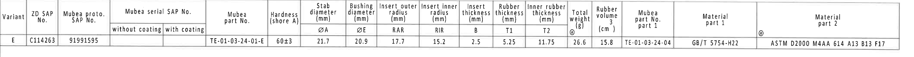

- 原图位置/视图名称：中上部产品参数表，page 1，bbox `[370, 790, 4590, 1060]`。
- object_kind：`table`。

| Variant | ZD SAP No. | Mubea proto. SAP No. | Mubea serial SAP No. without coating | Mubea serial SAP No. with coating | Mubea part No. | Hardness (shore A) | ØA | ØE | RAR | RIR | B | T1 | T2 | Total weight @ | Rubber volume | Mubea part No. part 1 | Material part 1 | Material part 2 |
|---|---|---|---|---|---|---|---|---|---|---|---|---|---|---|---|---|---|---|
| E | C114263 | 91991595 |  |  | TE-01-03-24-01-E | 60±3 | 21.7 | 20.9 | 17.7 | 15.2 | 2.5 | 5.25 | 11.75 | 26.6 | 15.8 | TE-01-03-24-04 | GB/T 5754-H22 | ASTM D2000 M4AA 614 A13 B13 F17 |

| 提取项 | 原图数值或文本 | 含义说明 |
|---|---|---|
| 表格整体 | 见上方按原表头还原的 Markdown 表格 | 位于整页图 C-D 行横向参数区。该表给出各视图中字母尺寸代号的实际数值：ØA、ØE、RAR、RIR、B、T1、T2。裁切完整包含表头和唯一数据行。 |

边界归属说明：表头和唯一数据行完整；没有包含下方加工视图尺寸。

## object_3 - 左上半圆端面视图/杆径与 MUBEA 图号视图

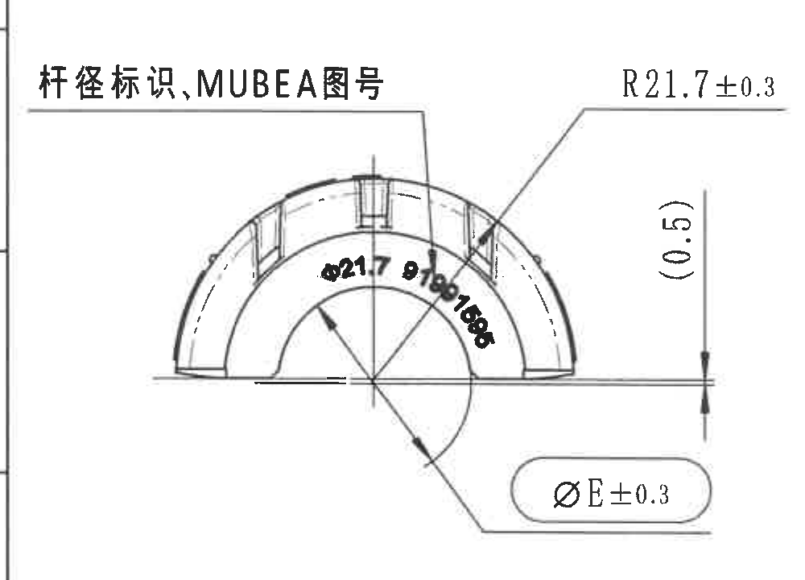

- 原图位置/视图名称：左上半圆端面视图/杆径与 MUBEA 图号视图，page 1，bbox `[360, 1090, 1360, 1810]`。
- object_kind：`view`。

| 提取项 | 原图数值或文本 | 含义说明 |
|---|---|---|
| 杆径标识、MUBEA图号 | 杆径标识、MUBEA图号 | 说明该端面/弧面上需设置杆径标识和 MUBEA 图号。 |
| 半径 | R21.7±0.3 | 外圆弧半径尺寸，带 ±0.3 公差。 |
| 参考尺寸 | (0.5) | 括号内参考尺寸，位于右侧竖向标注，表示相对基准线的参考间隙/高度。 |
| 直径 | ØE±0.3 | 衬套/内径代号 E 的直径尺寸，参数表对应 ØE=20.9 mm，带 ±0.3 公差。 |
| 弧内直径/标识 | Ø21.7 | 弧内可辨直径值，与参数表 ØA=21.7 mm 对应；相邻黑体字符为模压标识，不作为独立尺寸。 |

边界归属说明：裁切包含当前端面视图全部尺寸线、箭头和文字；左侧可见图框线，不属于尺寸内容。

## object_4 - 中左侧视图/型号标识与 A-A 剖切位置

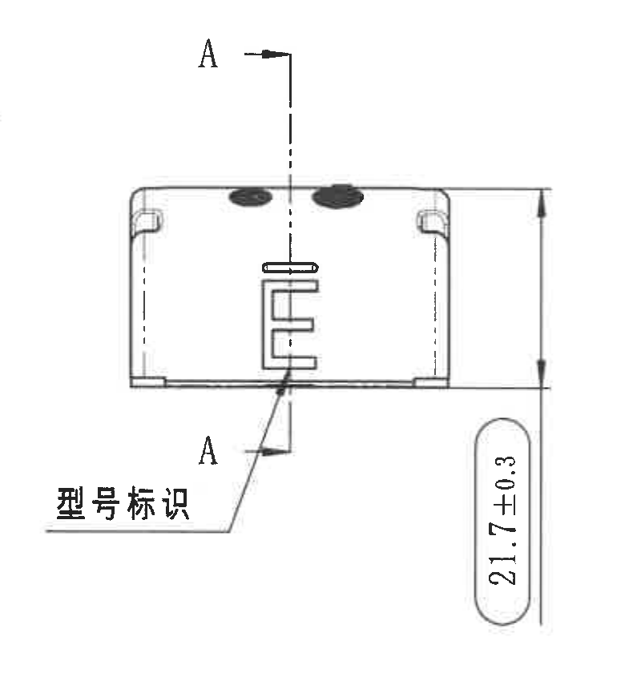

- 原图位置/视图名称：中左侧视图/型号标识与 A-A 剖切位置，page 1，bbox `[1340, 1080, 2140, 1920]`。
- object_kind：`view`。

| 提取项 | 原图数值或文本 | 含义说明 |
|---|---|---|
| 剖切标识 | A、A | 指示 A-A 剖面位置和方向。 |
| 型号标识 | 型号标识 | 指向零件表面型号标识位置。 |
| 总高/外径方向尺寸 | 21.7±0.3 | 侧视图竖向控制尺寸，带 ±0.3 公差。 |

边界归属说明：裁切包含 A-A 剖切符号和 21.7±0.3 尺寸框；未混入 A-A 剖面本体。

## object_5 - A-A 剖面 1:1

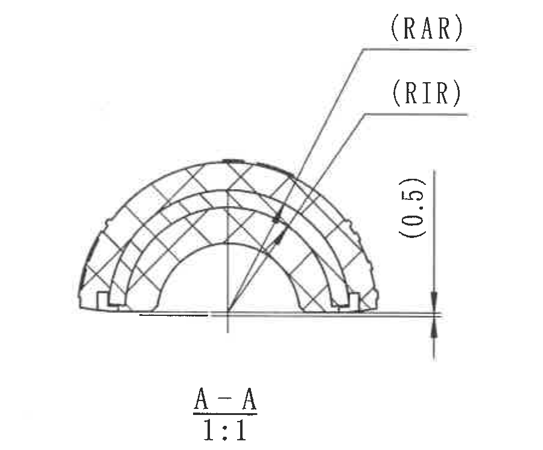

- 原图位置/视图名称：A-A 剖面 1:1，page 1，bbox `[2200, 1050, 3100, 1795]`。
- object_kind：`section`。

| 提取项 | 原图数值或文本 | 含义说明 |
|---|---|---|
| 剖面名称 | A-A 1:1 | A-A 剖面，比例 1:1。 |
| 外半径代号 | (RAR) | 括号参考代号，对应参数表 RAR=17.7 mm。 |
| 内半径代号 | (RIR) | 括号参考代号，对应参数表 RIR=15.2 mm。 |
| 参考尺寸 | (0.5) | 剖面右侧相对基准线的参考间隙/高度。 |

边界归属说明：裁切完整包含 A-A 剖面及 (RAR)、(RIR)、(0.5)；下方 NOTES 未带入。

## object_6 - B-B 剖面 1:1

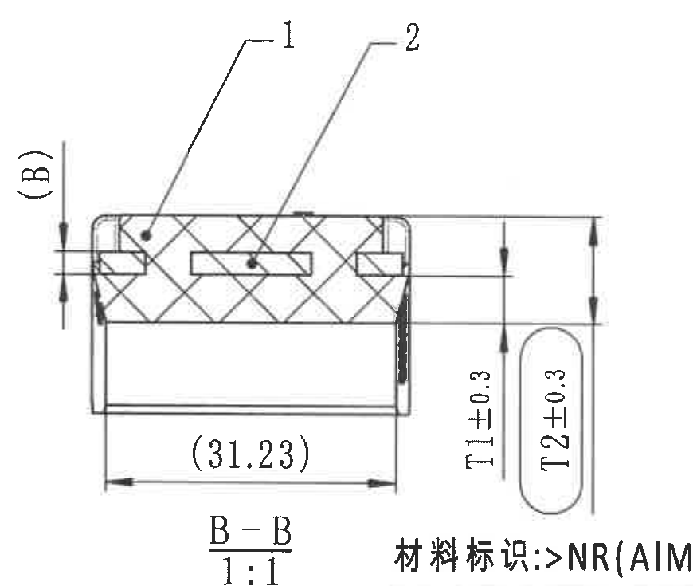

- 原图位置/视图名称：B-B 剖面 1:1，page 1，bbox `[3090, 1060, 3960, 1795]`。
- object_kind：`section`。

| 提取项 | 原图数值或文本 | 含义说明 |
|---|---|---|
| 剖面名称 | B-B 1:1 | B-B 剖面，比例 1:1。 |
| 部件标号 | 1、2 | 指向剖面中的两种材料/零件，对应 BOM 序号。 |
| 厚度代号 | (B) | 括号参考代号，对应参数表 B=2.5 mm。 |
| 参考宽度 | (31.23) | 括号内参考尺寸，表示剖面底部横向宽度。 |
| 橡胶厚度 | T1±0.3 | 厚度 T1，参数表 T1=5.25 mm，带 ±0.3 公差。 |
| 内侧橡胶厚度 | T2±0.3 | 厚度 T2，参数表 T2=11.75 mm，带 ±0.3 公差。 |

边界归属说明：裁切完整包含 (B)、(31.23)、T1±0.3、T2±0.3 与 B-B 标题；底部相邻材料标识文字开头不归属本对象。

## object_7 - 右侧材料标识局部视图/B-B 剖切位置

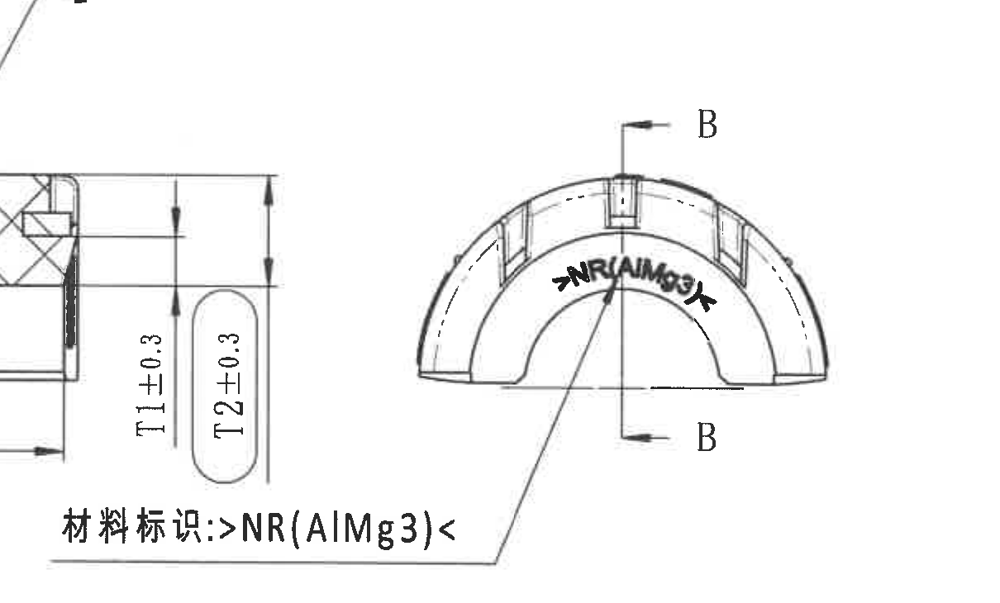

- 原图位置/视图名称：右侧材料标识局部视图/B-B 剖切位置，page 1，bbox `[3510, 1120, 4720, 1850]`。
- object_kind：`detail`。

| 提取项 | 原图数值或文本 | 含义说明 |
|---|---|---|
| 剖切标识 | B、B | 说明 B-B 剖面剖切位置。 |
| 材料标识 | 材料标识: >NR(AlMg3)< | 材料/模压标识要求，标注内容为 >NR(AlMg3)<。 |
| 弧面标识 | >NR(AlMg3)< | 标识沿弧形内侧布置。 |

边界归属说明：裁切完整包含材料标识引线和文字；左侧可见 B-B 的 T1/T2 尺寸残段，归属 object_6。

## object_8 - 左下俯视图/中鼎徽、型腔号、时间钟标识

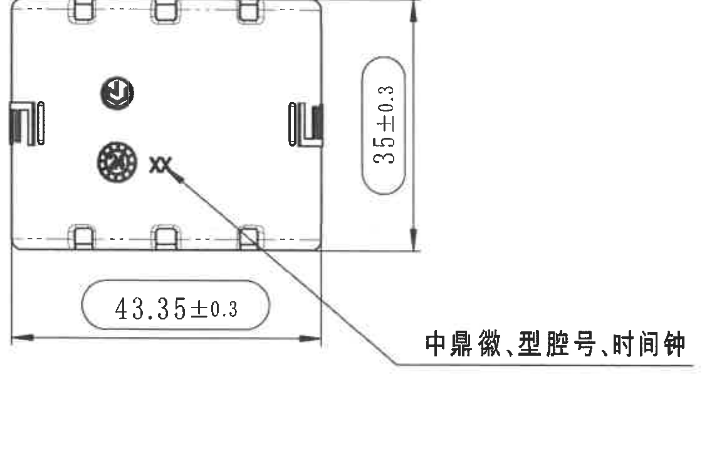

- 原图位置/视图名称：左下俯视图/中鼎徽、型腔号、时间钟标识，page 1，bbox `[560, 1900, 1680, 2660]`。
- object_kind：`view`。

| 提取项 | 原图数值或文本 | 含义说明 |
|---|---|---|
| 水平总长度 | 43.35±0.3 | 俯视图水平总尺寸，带 ±0.3 公差。 |
| 竖向总尺寸 | 35±0.3 | 俯视图竖向总尺寸，带 ±0.3 公差。 |
| 标识说明 | 中鼎徽、型腔号、时间钟 | 引线指向图内标识位置。 |
| 局部字符 | XX | 图内局部标记/型腔相关标识。 |

边界归属说明：裁切完整包含 43.35±0.3、35±0.3 的尺寸线、箭头和标注文字；未带入相邻轴测图。

## object_9 - 中下轴测视图

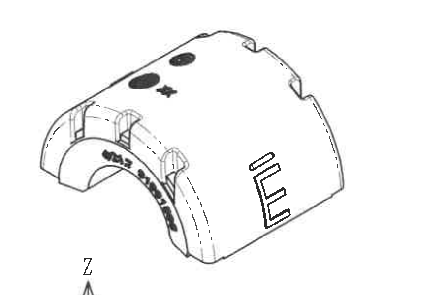

- 原图位置/视图名称：中下轴测视图，page 1，bbox `[1760, 1930, 2670, 2530]`。
- object_kind：`view`。

| 提取项 | 原图数值或文本 | 含义说明 |
|---|---|---|
| 三维外形 | 轴测外观 | 显示零件弧形本体、卡槽、顶部圆点/星号和侧面 E 形标识。 |
| 尺寸 | 无新增尺寸 | 该轴测图不承载新的尺寸或公差。 |

边界归属说明：裁切包含轴测零件外观；底部极小 Z 字母残入归属 object_15。

## object_10 - Specification 技术要求/NOTES

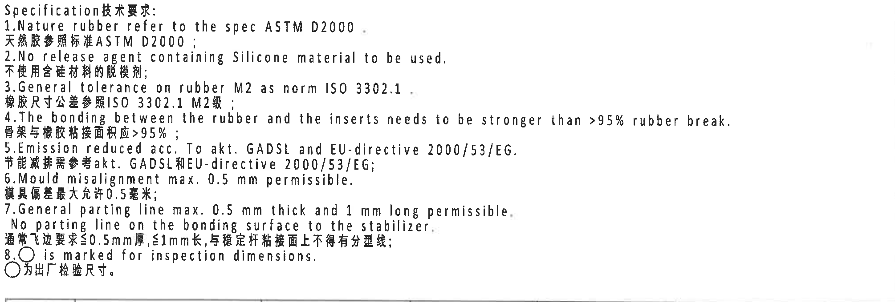

- 原图位置/视图名称：Specification 技术要求/NOTES，page 1，bbox `[2740, 1810, 4750, 2490]`。
- object_kind：`notes`。

| 提取项 | 原图数值或文本 | 含义说明 |
|---|---|---|
| 1 | Nature rubber refer to the spec ASTM D2000. / 天然胶参照标准ASTM D2000 | 天然橡胶材料标准要求。 |
| 2 | No release agent containing Silicone material to be used. / 不使用含硅材料的脱模剂 | 禁止使用含硅脱模剂。 |
| 3 | General tolerance on rubber M2 as norm ISO 3302.1 / 橡胶尺寸公差参照ISO 3302.1 M2级 | 橡胶尺寸通用公差标准。 |
| 4 | The bonding between the rubber and the inserts needs to be stronger than >95% rubber break. / 骨架与橡胶粘接面积应>95% | 粘接强度/破坏模式要求。 |
| 5 | Emission reduced acc. To akt, GADSL and EU-directive 2000/53/EG / 节能减排需参考akt、GADSL和EU-directive 2000/53/EG | 法规/清单符合性要求。 |
| 6 | Mould misalignment max. 0.5 mm permissible. / 模具偏差最大允许0.5毫米 | 模具错位最大允许值。 |
| 7 | General parting line max. 0.5 mm thick and 1 mm long permissible. No parting line on the bonding surface to the stabilizer. / 通常飞边要求≤0.5mm厚、≤1mm长，与稳定杆粘接面上不得有分型线 | 飞边和分型线限制。 |
| 8 | ○ is marked for inspection dimensions. / ○为出厂检验尺寸 | 圆圈符号表示出厂检验尺寸。 |

边界归属说明：裁切完整包含 NOTES 1-8 条；底部仅为相邻表格上边线。

## object_11 - DIN ISO 3302-1 M2 class 公差表

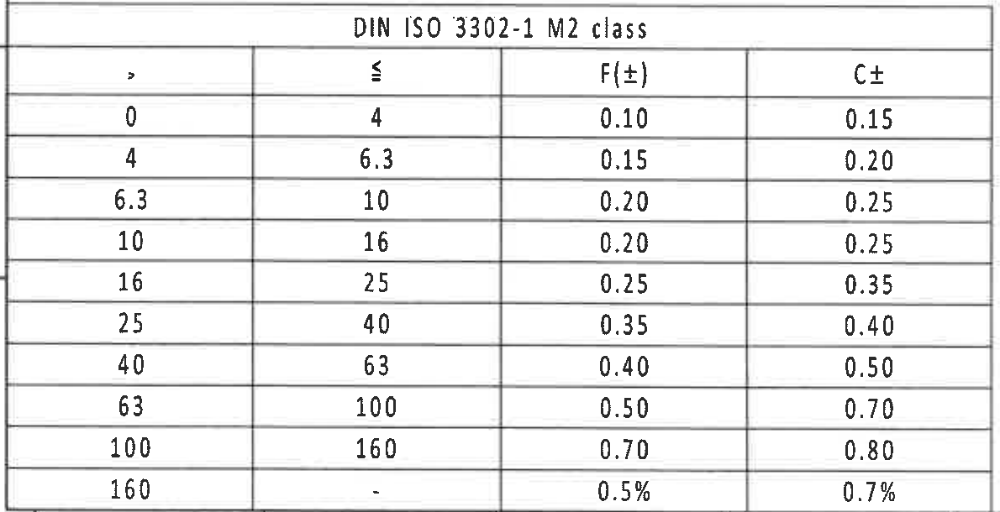

- 原图位置/视图名称：DIN ISO 3302-1 M2 class 公差表，page 1，bbox `[360, 2720, 1550, 3330]`。
- object_kind：`table`。

| > | ≤ | F(±) | C± |
|---|---|---|---|
| 0 | 4 | 0.10 | 0.15 |
| 4 | 6.3 | 0.15 | 0.20 |
| 6.3 | 10 | 0.20 | 0.25 |
| 10 | 16 | 0.20 | 0.25 |
| 16 | 25 | 0.25 | 0.35 |
| 25 | 40 | 0.35 | 0.40 |
| 40 | 63 | 0.40 | 0.50 |
| 63 | 100 | 0.50 | 0.70 |
| 100 | 160 | 0.70 | 0.80 |
| 160 | - | 0.5% | 0.7% |

| 提取项 | 原图数值或文本 | 含义说明 |
|---|---|---|
| 表格整体 | 见上方按原表头还原的 Markdown 表格 | 位于整页图 J-L 左下。该表为 rubber M2 通用公差表，与 NOTES 第 3 条对应。裁切完整包含标题、列头和所有数据行。 |

边界归属说明：裁切完整包含 DIN 表标题、列头和全部行；底部图框坐标已排除。

## object_12 - Reference 参考标准列表

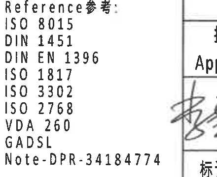

- 原图位置/视图名称：Reference 参考标准列表，page 1，bbox `[2380, 2950, 2820, 3310]`。
- object_kind：`notes`。

| 提取项 | 原图数值或文本 | 含义说明 |
|---|---|---|
| 参考标准 | ISO 8015 | 引用标准。 |
| 参考标准 | DIN 1451 | 引用标准。 |
| 参考标准 | DIN EN 1396 | 引用标准。 |
| 参考标准 | ISO 1817 | 引用标准。 |
| 参考标准 | ISO 3302 | 引用标准。 |
| 参考标准 | ISO 2768 | 引用标准。 |
| 参考标准 | VDA 260 | 引用标准。 |
| 参考标准 | GADSL | 引用清单/法规要求。 |
| 内部注记 | Note-DPR-34184774 | 内部 Note 编号。 |

边界归属说明：裁切完整包含参考标准列表；右侧少量标题栏边线不作为本对象内容。

## object_13 - 右下 BOM/明细表

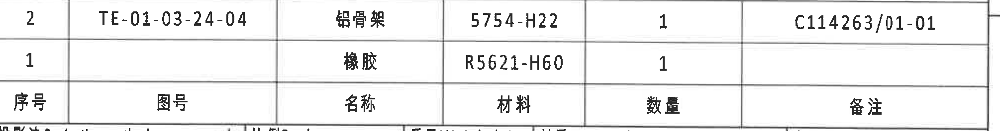

- 原图位置/视图名称：右下 BOM/明细表，page 1，bbox `[2770, 2490, 4780, 2755]`。
- object_kind：`table`。

| 序号 | 图号 | 名称 | 材料 | 数量 | 备注 |
|---|---|---|---|---|---|
| 2 | TE-01-03-24-04 | 铝骨架 | 5754-H22 | 1 | C114263/01-01 |
| 1 |  | 橡胶 | R5621-H60 | 1 |  |

| 提取项 | 原图数值或文本 | 含义说明 |
|---|---|---|
| 表格整体 | 见上方按原表头还原的 Markdown 表格 | 位于整页图 I-J 右下，标题栏上方。部件标号 1、2 与 B-B 剖面中的指示编号对应。裁切保留两条物料记录和表头；下方标题栏行仅有极小残边，不作为 BOM 字段。 |

边界归属说明：裁切包含 BOM 两条物料记录和表头；下方标题栏边缘不作为 BOM 字段。

## object_14 - 右下标题栏

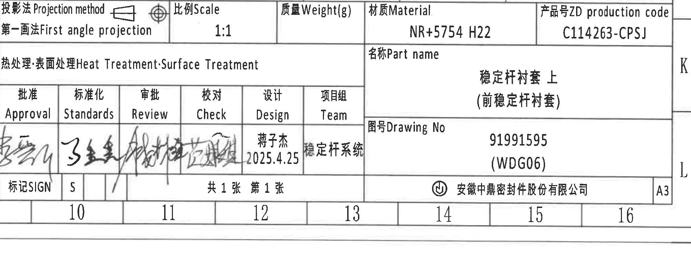

- 原图位置/视图名称：右下标题栏，page 1，bbox `[2760, 2740, 4810, 3505]`。
- object_kind：`title_block`。

| 提取项 | 原图数值或文本 | 含义说明 |
|---|---|---|
| 投影法 | 第一画法 First angle projection | 图纸采用第一角投影法。 |
| 比例 | 1:1 | 视图比例。 |
| 质量 | Weight(g) 空 | 标题栏未填写重量。 |
| 材质 | NR+5754 H22 | 总材料组合。 |
| 产品号 | C114263-CPSJ | ZD production code。 |
| 热处理/表面处理 | 空 | 标题栏未填写热处理或表面处理内容。 |
| 名称 | 稳定杆衬套 上（前稳定杆衬套） | 零件名称。 |
| 图号 | 91991595 (WDG06) | Drawing No。 |
| 签审 | Approval/Standards/Review/Check 为签名；Design=蒋子杰 2025.4.25；Team=稳定杆系统 | 签审与项目组信息。 |
| 页数 | 共1张 第1张 | 单页图纸。 |
| 公司/图幅 | 安徽中鼎密封件股份有限公司；A3 | 出图公司和图幅。 |

边界归属说明：裁切完整包含标题栏字段；下方图框坐标 10-16 和右侧 K/L 为图框坐标，不作为标题栏字段。

## object_15 - 三维坐标轴辅助图

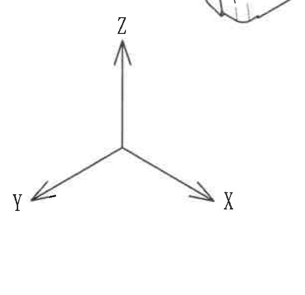

- 原图位置/视图名称：三维坐标轴辅助图，page 1，bbox `[1690, 2420, 2310, 3020]`。
- object_kind：`detail`。

| 提取项 | 原图数值或文本 | 含义说明 |
|---|---|---|
| 坐标轴 | X、Y、Z | 说明轴测方向。 |

边界归属说明：裁切完整包含 X/Y/Z 箭头与字母；顶部轴测图小片段不作为坐标轴内容。

## 裁切检查记录

| 对象 | 检查结果 |
|---|---|
| object_1 | 按表格外框裁切，变更者列完整；未提取周围图框坐标。 图片已检查，当前对象的尺寸线、箭头、文字或表格行列完整。 |
| object_2 | 表头和唯一数据行完整；没有包含下方加工视图尺寸。 图片已检查，当前对象的尺寸线、箭头、文字或表格行列完整。 |
| object_3 | 裁切包含当前端面视图全部尺寸线、箭头和文字；左侧可见图框线，不属于尺寸内容。 图片已检查，当前对象的尺寸线、箭头、文字或表格行列完整。 |
| object_4 | 裁切包含 A-A 剖切符号和 21.7±0.3 尺寸框；未混入 A-A 剖面本体。 图片已检查，当前对象的尺寸线、箭头、文字或表格行列完整。 |
| object_5 | 裁切完整包含 A-A 剖面及 (RAR)、(RIR)、(0.5)；下方 NOTES 未带入。 图片已检查，当前对象的尺寸线、箭头、文字或表格行列完整。 |
| object_6 | 裁切完整包含 (B)、(31.23)、T1±0.3、T2±0.3 与 B-B 标题；底部相邻材料标识文字开头不归属本对象。 图片已检查，当前对象的尺寸线、箭头、文字或表格行列完整。 |
| object_7 | 裁切完整包含材料标识引线和文字；左侧可见 B-B 的 T1/T2 尺寸残段，归属 object_6。 图片已检查，当前对象的尺寸线、箭头、文字或表格行列完整。 |
| object_8 | 裁切完整包含 43.35±0.3、35±0.3 的尺寸线、箭头和标注文字；未带入相邻轴测图。 图片已检查，当前对象的尺寸线、箭头、文字或表格行列完整。 |
| object_9 | 裁切包含轴测零件外观；底部极小 Z 字母残入归属 object_15。 图片已检查，当前对象的尺寸线、箭头、文字或表格行列完整。 |
| object_10 | 裁切完整包含 NOTES 1-8 条；底部仅为相邻表格上边线。 图片已检查，当前对象的尺寸线、箭头、文字或表格行列完整。 |
| object_11 | 裁切完整包含 DIN 表标题、列头和全部行；底部图框坐标已排除。 图片已检查，当前对象的尺寸线、箭头、文字或表格行列完整。 |
| object_12 | 裁切完整包含参考标准列表；右侧少量标题栏边线不作为本对象内容。 图片已检查，当前对象的尺寸线、箭头、文字或表格行列完整。 |
| object_13 | 裁切包含 BOM 两条物料记录和表头；下方标题栏边缘不作为 BOM 字段。 图片已检查，当前对象的尺寸线、箭头、文字或表格行列完整。 |
| object_14 | 裁切完整包含标题栏字段；下方图框坐标 10-16 和右侧 K/L 为图框坐标，不作为标题栏字段。 图片已检查，当前对象的尺寸线、箭头、文字或表格行列完整。 |
| object_15 | 裁切完整包含 X/Y/Z 箭头与字母；顶部轴测图小片段不作为坐标轴内容。 图片已检查，当前对象的尺寸线、箭头、文字或表格行列完整。 |
