# 20C114264.pdf 内容识别

整页渲染图：`20C114264_assets/images/page_1.png`  
源图为 1 页 A3 扫描件，整页 PNG 尺寸 4959 x 3505 px。

## object_1 - 修订履历表

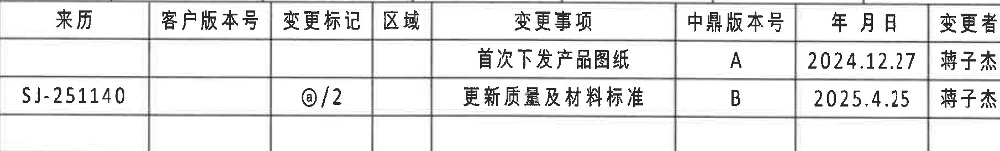

- 原图位置/视图名称：页 1 右上角修订履历表。
- 边界归属说明：裁切框只包含修订履历表外框内文字与表格线，右侧图框分区字母已排除。

原表还原：

| 来历 | 客户版本号 | 变更标记 | 区域 | 变更事项 | 中鼎版本号 | 年月日 | 变更者 |
|---|---|---|---|---|---|---|---|
|  |  |  |  | 首次下发产品图纸 | A | 2024.12.27 | 蒋子杰 |
| SJ-251140 |  | @/2 |  | 更新质量及材料标准 | B | 2025.4.25 | 蒋子杰 |

| 提取项 | 原图数值或文本 | 含义说明 |
|---|---|---|
| 首次下发记录 | 中鼎版本号 A；2024.12.27；蒋子杰 | 初版图纸发放记录。 |
| 质量及材料标准更新 | 来历 SJ-251140；变更标记 @/2；中鼎版本号 B；2025.4.25；蒋子杰 | 第二条修订记录，说明质量及材料标准更新。 |

## object_2 - 产品参数/零件明细表

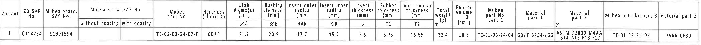

- 原图位置/视图名称：页 1 上部横向参数表。
- 边界归属说明：裁切框覆盖参数表全部列、表头和唯一数据行，未带入下方加工视图。

原表还原：

| Variant | ZD SAP No. | Mubea proto. SAP No. | Mubea serial SAP No. without coating | Mubea serial SAP No. with coating | Mubea part No. | Hardness (shore A) | Stab diameter (mm) ØA | Bushing diameter (mm) ØE | Insert outer radius (mm) RAR | Insert inner radius (mm) RIR | Insert thickness (mm) B | Rubber thickness (mm) T1 | Inner rubber thickness (mm) T2 | Total weight (g) @ | Rubber volume (cm^3) | Mubea part No. part 1 | Material part 1 | Material part 2 @ | Mubea part No. part 3 | Material part 3 |
|---|---|---|---|---|---|---|---:|---:|---:|---:|---:|---:|---:|---:|---:|---|---|---|---|---|
| E | C114264 | 91991594 |  |  | TE-01-03-24-02-E | 60±3 | 21.7 | 20.9 | 17.7 | 15.2 | 2.5 | 5.25 | 16.55 | 32.4 | 18.6 | TE-01-03-24-04 | GB/T 5754-H22 | ASTM D2000 M4AA 614 A13 B13 F17 | TE-01-03-24-06 | PA66 GF30 |

| 提取项 | 原图数值或文本 | 含义说明 |
|---|---|---|
| 变型 | E | 本图零件变型。 |
| ZD SAP No. | C114264 | 中鼎 SAP 编号。 |
| Mubea proto. SAP No. | 91991594 | Mubea 原型/图号关联编号。 |
| Mubea part No. | TE-01-03-24-02-E | 总成或主零件号。 |
| 硬度 | 60±3 Shore A | 橡胶硬度公差。 |
| ØA | 21.7 mm | 稳定杆直径/杆径参数。 |
| ØE | 20.9 mm | 衬套孔径/配合直径参数；前视图中用 ØE 标注。 |
| RAR | 17.7 mm | Insert outer radius，外侧嵌件半径；A-A 剖面用 `(RAR)` 引出。 |
| RIR | 15.2 mm | Insert inner radius，内侧嵌件半径；A-A 剖面用 `(RIR)` 引出。 |
| B | 2.5 mm | Insert thickness，嵌件厚度；B-B 剖面左侧以 `(B)` 参考标注。 |
| T1 | 5.25 mm | Rubber thickness，橡胶厚度；B-B 剖面标注 `T1±0.30`。 |
| T2 | 16.55 mm | Inner rubber thickness，内橡胶厚度；B-B 剖面标注 `T2±0.30`。 |
| 重量 | 32.4 g | 总重量。 |
| 橡胶体积 | 18.6 cm^3 | 橡胶体积。 |
| part 1 | TE-01-03-24-04；GB/T 5754-H22 | 铝骨架零件号与材料。 |
| part 2 材料 | ASTM D2000 M4AA 614 A13 B13 F17 | 橡胶材料规范。 |
| part 3 | TE-01-03-24-06；PA66 GF30 | 塑料底座零件号与材料。 |

## object_3 - 左前加工视图

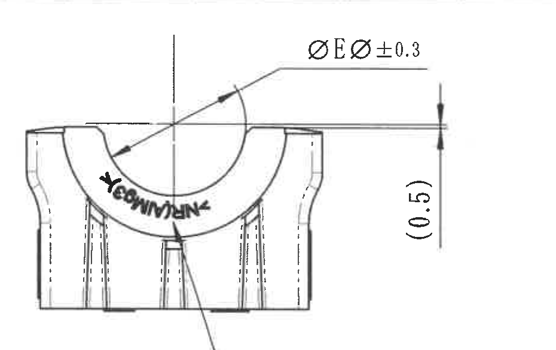

- 原图位置/视图名称：页 1 中部左侧前视加工视图。
- 边界归属说明：裁切框包含前视图本体、孔径引出线、右侧 `(0.5)` 参考尺寸和材料标识引出线起点；材料标识完整文字另见 object_4。未纳入右侧 A 侧视图。

| 提取项 | 原图数值或文本 | 含义说明 |
|---|---|---|
| 孔径/衬套直径标注 | ØEØ ±0.3（按图面可辨识） | 与参数表 `Bushing diameter ØE = 20.9 mm` 对应；图中给出直径符号及 ±0.3 公差。 |
| 参考尺寸 | `(0.5)` | 括号内参考尺寸，位于前视图右侧竖向尺寸线旁，用于说明边缘/高度偏置的参考关系，不作为主要控制尺寸。 |
| 弧面印字 | MUBEA 类弧面标识（扫描件局部模糊） | 位于半圆弧面上，属于外观/品牌或图号类标识，不是尺寸线标注。 |
| 材料标识引出 | 指向下方材料标识文字 | 完整材料标识文字在 object_4 中提取。 |

## object_4 - 材料标识局部

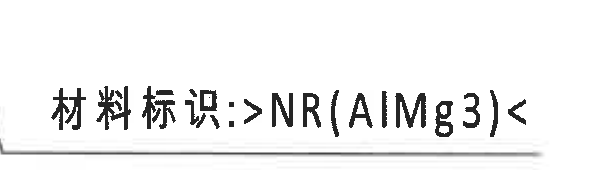

- 原图位置/视图名称：左前加工视图下方材料标识局部。
- 边界归属说明：裁切框只包含材料标识文字及其下划线，不包含右侧 A 侧视图剖切箭头。

| 提取项 | 原图数值或文本 | 含义说明 |
|---|---|---|
| 材料标识 | 材料标识:>NR(AlMg3)< | 指示零件材料组合/标识文字；`NR` 对应天然橡胶，`AlMg3` 为图面材料标记。 |

## object_5 - A 侧视图/剖切位置

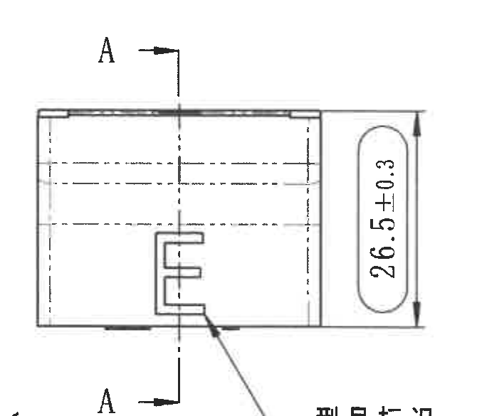

- 原图位置/视图名称：页 1 中部左二，A-A 剖切位置所在侧视图。
- 边界归属说明：裁切框包含 A-A 剖切线、上下 A 基准/剖切字母、侧视图本体和右侧高度尺寸；底部仅露出同一视图的型号标识引出边缘，完整文字另见 object_6。

| 提取项 | 原图数值或文本 | 含义说明 |
|---|---|---|
| 剖切标识 | A / A | 上下箭头和字母 A 指示 A-A 剖面位置，剖面结果见 object_7。 |
| 总高度/外形高度 | 26.5±0.3 | 侧视图竖向尺寸，标注在右侧圆角框内，公差 ±0.3。 |
| 型号标识引出 | 指向下方“型号标识” | 完整文字裁切在 object_6。 |

## object_6 - 型号标识局部

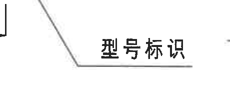

- 原图位置/视图名称：A 侧视图下方型号标识局部。
- 边界归属说明：裁切框包含引出线末端和完整“型号标识”文字；左侧少量剖切线端属于同一 A 侧视图关联，不提取为独立尺寸。

| 提取项 | 原图数值或文本 | 含义说明 |
|---|---|---|
| 型号标识 | 型号标识 | 指示侧面 E 形/型腔样式区域为型号标识位置。 |

## object_7 - A-A 剖面视图

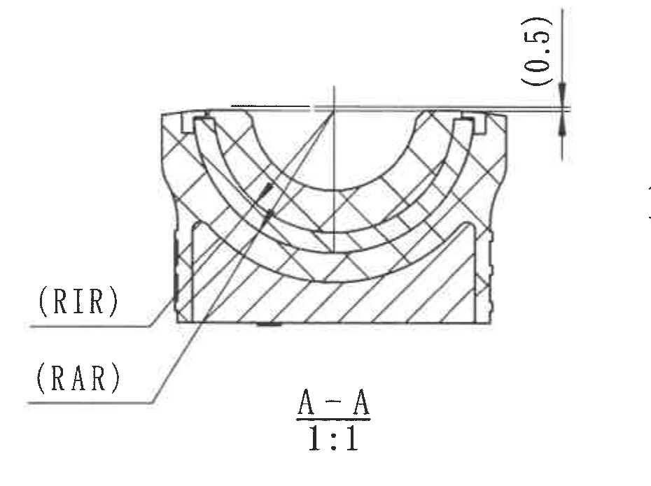

- 原图位置/视图名称：页 1 中部 A-A 剖面，比例 1:1。
- 边界归属说明：裁切框包含 A-A 剖面本体、`(RIR)`、`(RAR)` 两条半径引出标注、顶部 `(0.5)` 参考尺寸及标题；未带入 B-B 剖面左侧尺寸。

| 提取项 | 原图数值或文本 | 含义说明 |
|---|---|---|
| 剖面名称 | A-A 1:1 | 与 object_5 的 A 剖切线对应，比例 1:1。 |
| 内侧半径 | `(RIR)` | 括号内参考/参数代号，指 Insert inner radius；数值见参数表 `RIR = 15.2 mm`。 |
| 外侧半径 | `(RAR)` | 括号内参考/参数代号，指 Insert outer radius；数值见参数表 `RAR = 17.7 mm`。 |
| 参考尺寸 | `(0.5)` | 位于剖面顶部右侧的括号参考尺寸，用于说明顶部边缘关系。 |
| 剖面填充 | 交叉剖面线 | 表示剖切到橡胶/嵌件截面区域。 |

## object_8 - B-B 剖面视图

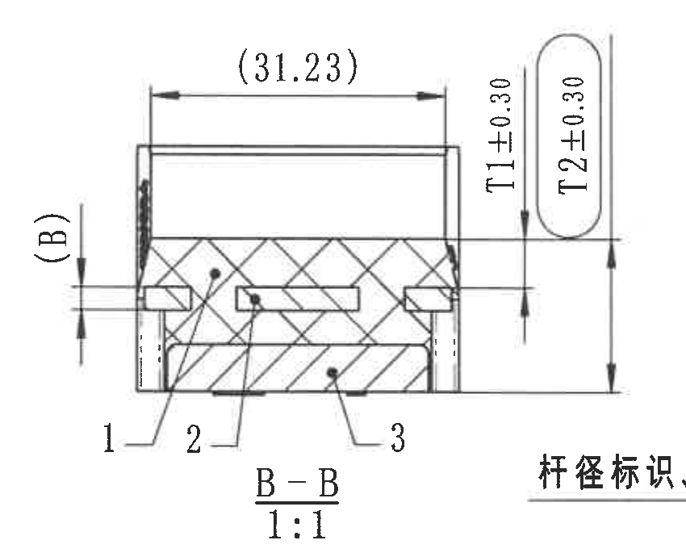

- 原图位置/视图名称：页 1 中部右侧 B-B 剖面，比例 1:1。
- 边界归属说明：裁切框包含 B-B 剖面本体、左侧 `(B)`、上方 `(31.23)`、T1/T2 尺寸、公差、编号 1/2/3 和标题；右下露出的“杆径标识”边缘属于同一标注区域，完整文字在 object_9，不在本对象重复提取。

| 提取项 | 原图数值或文本 | 含义说明 |
|---|---|---|
| 剖面名称 | B-B 1:1 | 与右视图 object_10 的 B 剖切线对应，比例 1:1。 |
| 参考长度 | `(31.23)` | 括号内参考尺寸，位于剖面上方横向尺寸线，说明横向长度参考关系。 |
| 参考厚度 | `(B)` | 括号内参考尺寸/代号，位于左侧竖向尺寸线；对应参数表 `B = 2.5 mm` Insert thickness。 |
| 橡胶厚度 | `T1±0.30` | B-B 右侧竖向尺寸；对应参数表 `T1 = 5.25 mm`，图中给出 ±0.30 公差。 |
| 内橡胶厚度 | `T2±0.30` | B-B 右侧竖向尺寸；对应参数表 `T2 = 16.55 mm`，图中给出 ±0.30 公差。 |
| 编号 1 | 1 | 引出到下部斜线剖面区域；与 BOM 序号 1 橡胶对应。 |
| 编号 2 | 2 | 引出到中部嵌件/骨架区域；与 BOM 序号 2 铝骨架对应。 |
| 编号 3 | 3 | 引出到下部塑料底座区域；与 BOM 序号 3 塑料底座对应。 |

## object_9 - 杆径标识、MUBEA 图号局部

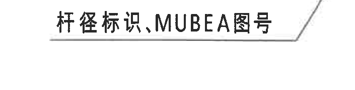

- 原图位置/视图名称：B-B 剖面与右视图之间的长引出标注。
- 边界归属说明：裁切框只包含完整“杆径标识、MUBEA图号”文字和引出线，不包含右视图本体。

| 提取项 | 原图数值或文本 | 含义说明 |
|---|---|---|
| 标注文字 | 杆径标识,MUBEA图号 | 指向右侧弧面印字区域，用于说明杆径标识和 MUBEA 图号标识位置。 |

## object_10 - 右侧加工视图/B-B 剖切位置

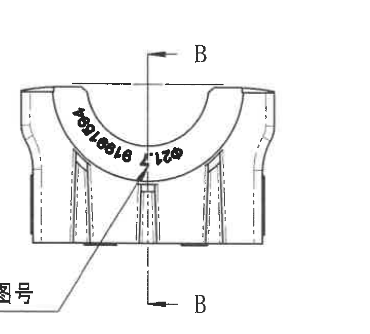

- 原图位置/视图名称：页 1 中部最右侧加工视图。
- 边界归属说明：裁切框排除了右侧图框分区字母，保留右侧视图本体和 B-B 剖切线；左下少量“图号”残边属于 object_9 的长引出文字，不作为本视图尺寸提取。

| 提取项 | 原图数值或文本 | 含义说明 |
|---|---|---|
| 剖切标识 | B / B | 上下箭头和字母 B 指示 B-B 剖面位置，剖面结果见 object_8。 |
| 弧面印字 | B1089、Ø21（按扫描图可辨识） | 位于弧面上的杆径/MUBEA 图号类标识；作为印刷/标识信息提取，不作为尺寸线标注。 |
| 杆径标识引出 | 与 object_9 对应 | 说明该右视图弧面印字由 object_9 的长标注指向。 |

## object_11 - 底视图/标识位置视图

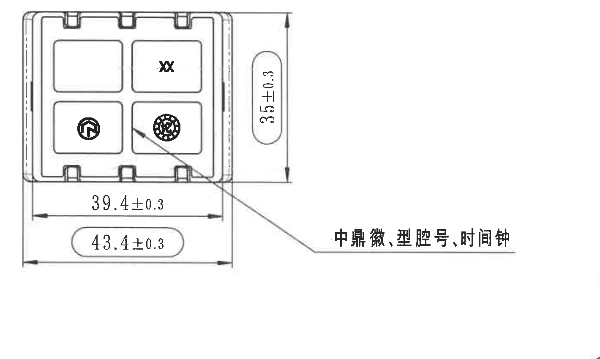

- 原图位置/视图名称：页 1 左下中部底视图。
- 边界归属说明：裁切框包含底视图本体、三条完整尺寸线和右下标识引出文字，未带入其他视图。

| 提取项 | 原图数值或文本 | 含义说明 |
|---|---|---|
| 竖向外形尺寸 | 35±0.3 | 底视图右侧竖向尺寸，公差 ±0.3。 |
| 横向内侧尺寸 | 39.4±0.3 | 底部较短横向尺寸，公差 ±0.3。 |
| 横向外侧尺寸 | 43.4±0.3 | 底部较长横向尺寸，标在圆角框内，公差 ±0.3。 |
| 标识文字 | 中鼎徽, 型腔号, 时间钟 | 指示底面标识内容和位置。 |
| 内部标识 | XX、圆形中鼎徽、时间钟图形 | 底面方格内的外观标识。 |

## object_12 - 等轴测视图

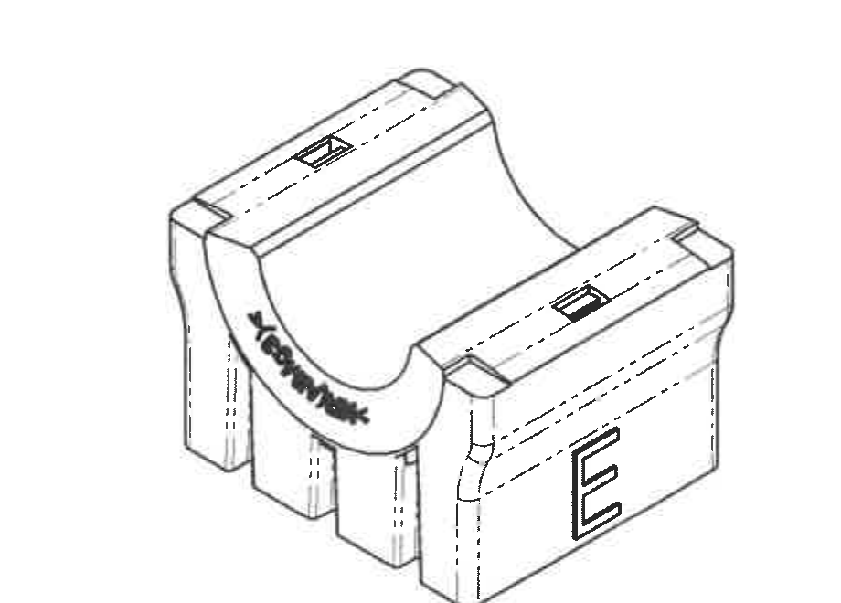

- 原图位置/视图名称：页 1 中下部等轴测视图。
- 边界归属说明：裁切框只包含等轴测零件本体，已排除右侧 NOTES 和下方坐标轴。

| 提取项 | 原图数值或文本 | 含义说明 |
|---|---|---|
| 视图类型 | 等轴测视图 | 展示零件整体立体形态、槽位、弧面和侧面标识。 |
| 弧面标识 | MUBEA 类标识 | 与前/右视图弧面标识位置一致。 |
| 侧面标识 | E | 与参数表 Variant `E` 对应的侧面标识。 |
| 尺寸 | 无新增尺寸线 | 此视图用于形态展示，不包含独立尺寸数值。 |

## object_13 - 坐标轴局部

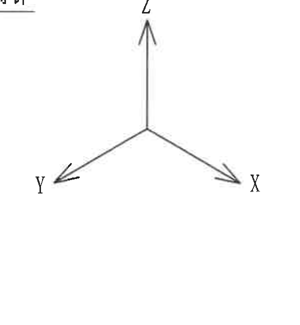

- 原图位置/视图名称：页 1 中下部坐标轴。
- 边界归属说明：裁切框包含 X/Y/Z 三轴和箭头，左上极小残线不属于本对象提取内容。

| 提取项 | 原图数值或文本 | 含义说明 |
|---|---|---|
| 坐标轴 | X、Y、Z | 用于表示图中空间方向。 |
| 尺寸 | 无尺寸数值 | 方向指示，不是加工尺寸。 |

## object_14 - NOTES / Specification 技术要求

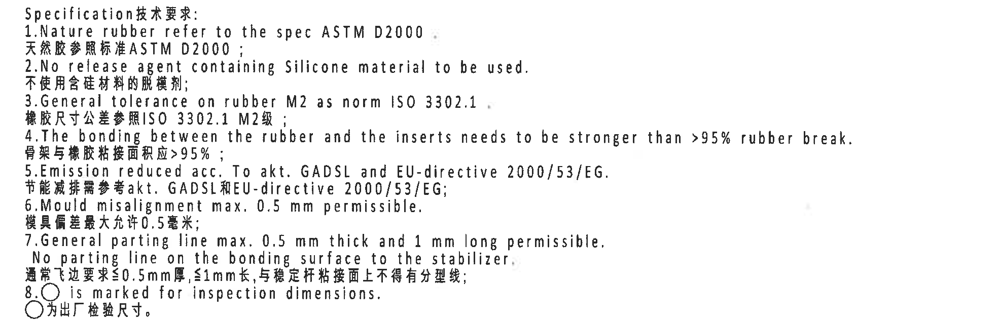

- 原图位置/视图名称：页 1 右中部 NOTES。
- 边界归属说明：裁切框包含 Specification 技术要求 1-8 条完整文字，未带入下方 BOM 表框。

| 提取项 | 原图数值或文本 | 含义说明 |
|---|---|---|
| 标题 | Specification技术要求: | 技术要求栏标题。 |
| 1 | Nature rubber refer to the spec ASTM D2000. / 天然胶参照标准ASTM D2000； | 天然橡胶按 ASTM D2000。 |
| 2 | No release agent containing Silicone material to be used. / 不使用含硅材料的脱模剂； | 脱模剂不得含硅材料。 |
| 3 | General tolerance on rubber M2 as norm ISO 3302.1 / 橡胶尺寸公差参照ISO 3302.1 M2级； | 橡胶一般公差按 ISO 3302.1 M2。 |
| 4 | The bonding between the rubber and the inserts needs to be stronger than >95% rubber break. / 骨架与橡胶粘接面积应>95%； | 橡胶与嵌件粘接强度/破坏要求。 |
| 5 | Emission reduced acc. To akt. GADSL and EU-directive 2000/53/EG. / 节能减排需参考akt. GADSL和EU-directive 2000/53/EG; | 排放/法规要求。 |
| 6 | Mould misalignment max. 0.5 mm permissible. / 模具偏差最大允许0.5毫米； | 模具错位最大允许 0.5 mm。 |
| 7 | General parting line max. 0.5 mm thick and 1 mm long permissible. No parting line on the bonding surface to the stabilizer. / 通常飞边要求≤0.5mm厚,≤1mm长, 与稳定杆粘接面上不得有分型线； | 飞边/分型线控制要求。 |
| 8 | ○ is marked for inspection dimensions. / ○为出厂检验尺寸。 | 圆圈标记表示出厂检验尺寸。 |

## object_15 - DIN ISO 3302-1 M2 class 公差表

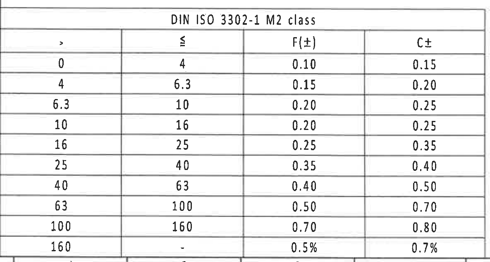

- 原图位置/视图名称：页 1 左下角公差表。
- 边界归属说明：裁切框包含完整表头、全部 10 行数据和表格底线，未带入图框坐标编号。

原表还原：

| DIN ISO 3302-1 M2 class |  | F(±) | C± |
|---:|---:|---:|---:|
| > | ≤ |  |  |
| 0 | 4 | 0.10 | 0.15 |
| 4 | 6.3 | 0.15 | 0.20 |
| 6.3 | 10 | 0.20 | 0.25 |
| 10 | 16 | 0.20 | 0.25 |
| 16 | 25 | 0.25 | 0.35 |
| 25 | 40 | 0.35 | 0.40 |
| 40 | 63 | 0.40 | 0.50 |
| 63 | 100 | 0.50 | 0.70 |
| 100 | 160 | 0.70 | 0.80 |
| 160 | - | 0.5% | 0.7% |

| 提取项 | 原图数值或文本 | 含义说明 |
|---|---|---|
| 公差标准 | DIN ISO 3302-1 M2 class | 橡胶尺寸一般公差等级，对应 NOTES 第 3 条。 |
| F(±) | 0.10 到 0.70，最后一行 0.5% | 按尺寸区间给出的 F 类公差。 |
| C± | 0.15 到 0.80，最后一行 0.7% | 按尺寸区间给出的 C 类公差。 |

## object_16 - Reference 参考标准列表

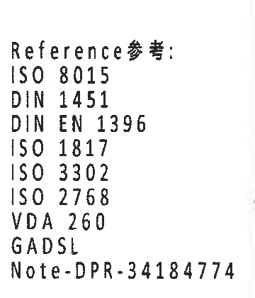

- 原图位置/视图名称：页 1 底部中左 Reference 参考列表。
- 边界归属说明：裁切框只包含参考标准列表文字，已排除右侧标题栏签署区。

| 提取项 | 原图数值或文本 | 含义说明 |
|---|---|---|
| 标题 | Reference参考: | 参考标准列表标题。 |
| 标准 1 | ISO 8015 | 参考标准。 |
| 标准 2 | DIN 1451 | 参考标准。 |
| 标准 3 | DIN EN 1396 | 参考标准。 |
| 标准 4 | ISO 1817 | 参考标准。 |
| 标准 5 | ISO 3302 | 参考标准。 |
| 标准 6 | ISO 2768 | 参考标准。 |
| 标准 7 | VDA 260 | 参考标准。 |
| 标准 8 | GADSL | 参考标准。 |
| 备注标准 | Note-DPR-34184774 | 备注/内部参考文件编号。 |

## object_17 - BOM / 零件清单表

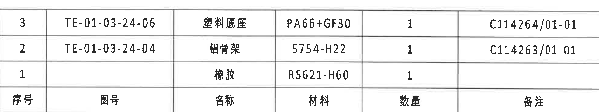

- 原图位置/视图名称：页 1 右下标题栏上方 BOM 表。
- 边界归属说明：裁切框包含 BOM 表完整外框、三条物料行和表头行，未带入 NOTES 或标题栏字段。

原表还原：

| 序号 | 图号 | 名称 | 材料 | 数量 | 备注 |
|---:|---|---|---|---:|---|
| 3 | TE-01-03-24-06 | 塑料底座 | PA66+GF30 | 1 | C114264/01-01 |
| 2 | TE-01-03-24-04 | 铝骨架 | 5754-H22 | 1 | C114263/01-01 |
| 1 |  | 橡胶 | R5621-H60 | 1 |  |

| 提取项 | 原图数值或文本 | 含义说明 |
|---|---|---|
| 序号 3 | TE-01-03-24-06；塑料底座；PA66+GF30；数量 1；C114264/01-01 | 对应 B-B 剖面编号 3。 |
| 序号 2 | TE-01-03-24-04；铝骨架；5754-H22；数量 1；C114263/01-01 | 对应 B-B 剖面编号 2。 |
| 序号 1 | 橡胶；R5621-H60；数量 1 | 对应 B-B 剖面编号 1。 |

## object_18 - 标题栏

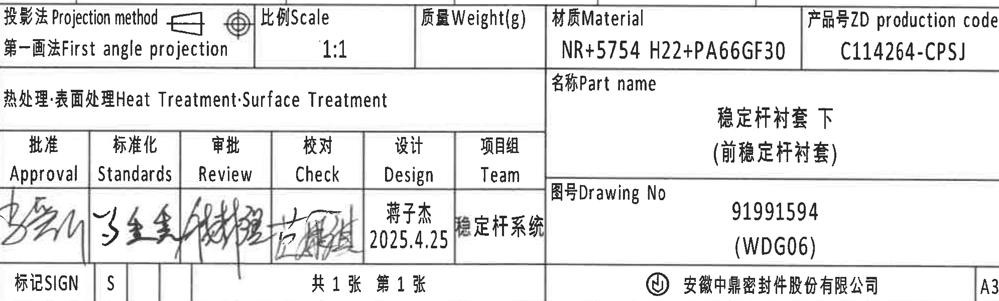

- 原图位置/视图名称：页 1 右下角标题栏。
- 边界归属说明：裁切框从投影法/比例行到公司/A3 行，包含标题栏主体；底部图框坐标编号已排除。

| 提取项 | 原图数值或文本 | 含义说明 |
|---|---|---|
| 投影法 | 投影法 Projection method；第一画法 First angle projection | 图纸投影方式为第一角法。 |
| 比例 | 1:1 | 图纸比例。 |
| 质量 | Weight(g) 空白 | 标题栏质量字段未填。 |
| 材质 | NR+5754 H22+PA66GF30 | 总材料组合。 |
| 产品号 | ZD production code C114264-CPSJ | 产品号/生产代码。 |
| 热处理/表面处理 | Heat Treatment; Surface Treatment | 字段存在，未见具体处理值。 |
| 名称 | 稳定杆衬套 下（前稳定杆衬套） | 零件名称。 |
| 审签栏 | Approval / Standards / Review / Check / Design / Team | 审签和项目组字段。 |
| 设计 | 蒋子杰 2025.4.25 | 设计者和日期。 |
| 项目组 | 稳定杆系统 | 项目组名称。 |
| 图号 | Drawing No 91991594 (WDG06) | 图纸编号。 |
| SIGN | 标记SIGN；S | 标记字段。 |
| 页数 | 共 1 张 第 1 张 | 图纸页数。 |
| 公司 | 安徽中鼎密封件股份有限公司 | 出图单位。 |
| 图幅 | A3 | 图幅规格。 |

## 裁切检查记录

| 对象 | 图片 | 检查结果 |
|---|---|---|
| object_1 | `20C114264_assets/images/object_1.png` | 修订履历表文字和表格线完整；未包含图框分区字母。 |
| object_2 | `20C114264_assets/images/object_2.png` | 参数表全部列和数据行完整；未带入加工视图。 |
| object_3 | `20C114264_assets/images/object_3.png` | 前视图尺寸线、箭头和 `(0.5)` 完整；材料文字另裁于 object_4；未混入 A 侧视图。 |
| object_4 | `20C114264_assets/images/object_4.png` | 材料标识文字完整；未带入 A 剖切箭头。 |
| object_5 | `20C114264_assets/images/object_5.png` | A 侧视图、A 剖切字母和 26.5±0.3 尺寸完整；型号标识另裁于 object_6。 |
| object_6 | `20C114264_assets/images/object_6.png` | 型号标识文字完整；边缘只含同一视图引出线。 |
| object_7 | `20C114264_assets/images/object_7.png` | A-A 剖面、RIR/RAR 引出线、`(0.5)` 和标题完整；未混入 B-B 尺寸。 |
| object_8 | `20C114264_assets/images/object_8.png` | B-B 剖面、`(B)`、`(31.23)`、T1/T2、编号 1/2/3 和标题完整；右下长标注仅露边，完整内容在 object_9。 |
| object_9 | `20C114264_assets/images/object_9.png` | “杆径标识,MUBEA图号”文字完整；未包含右视图本体。 |
| object_10 | `20C114264_assets/images/object_10.png` | 右视图与 B 剖切线完整；右侧图框字母已排除，左下残边归属 object_9。 |
| object_11 | `20C114264_assets/images/object_11.png` | 底视图三条尺寸线和右下引出文字完整；未混入其他视图。 |
| object_12 | `20C114264_assets/images/object_12.png` | 等轴测零件本体完整；未混入 NOTES 或坐标轴。 |
| object_13 | `20C114264_assets/images/object_13.png` | X/Y/Z 三轴和箭头完整；左上极小残线不提取为内容。 |
| object_14 | `20C114264_assets/images/object_14.png` | NOTES 1-8 条中英文文字完整；未带入下方 BOM 表。 |
| object_15 | `20C114264_assets/images/object_15.png` | DIN ISO 3302-1 M2 公差表表头和全部 10 行完整；未带入图框坐标编号。 |
| object_16 | `20C114264_assets/images/object_16.png` | Reference 参考列表全部文字完整；未带入标题栏签署区。 |
| object_17 | `20C114264_assets/images/object_17.png` | BOM 表外框、表头和三行数据完整；未带入 NOTES 或标题栏。 |
| object_18 | `20C114264_assets/images/object_18.png` | 标题栏主要字段完整；底部图框坐标编号已排除。 |
