# 20C114265 图纸内容识别

整页渲染图：`outputs/20C114265_assets/images/page_1.png`  
页面尺寸：4959 x 3505 px，单页 A3 扫描图。

## object_1 修订履历表

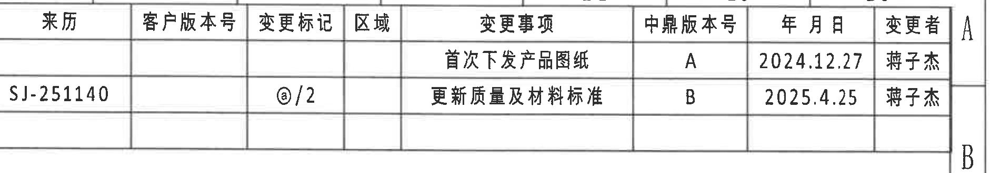

原图位置/视图名称：第 1 页右上角修订履历表，bbox `[2950, 155, 4850, 485]`。

原表还原：

| 来历 | 客户版本号 | 变更标记 | 区域 | 变更事项 | 中鼎版本号 | 年 月 日 | 变更者 |
|---|---|---|---|---|---|---|---|
|  |  |  |  | 首次下发产品图纸 | A | 2024.12.27 | 蒋子杰 |
| SJ-251140 |  | ◎/2 |  | 更新质量及材料标准 | B | 2025.4.25 | 蒋子杰 |

提取表格：

| 提取项 | 原图数值或文本 | 含义说明 |
|---|---|---|
| 修订记录 1 | 首次下发产品图纸；中鼎版本号 A；2024.12.27；蒋子杰 | 图纸首次发行记录。 |
| 修订记录 2 | 来历 SJ-251140；变更标记 ◎/2；更新质量及材料标准；中鼎版本号 B；2025.4.25；蒋子杰 | 质量及材料标准更新记录。 |

边界归属说明：裁切包含完整表头、两条修订记录和外框；右侧少量图框坐标字母 A/B 属于图框，不作为修订表内容提取。

## object_2 产品参数表

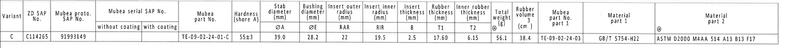

原图位置/视图名称：第 1 页上部参数/材料表，bbox `[365, 785, 4575, 1045]`。

原表还原：

| Variant | ZD SAP No. | Mubea proto. SAP No. | Mubea serial SAP No. without coating | Mubea serial SAP No. with coating | Mubea part No. | Hardness (shore A) | Stab diameter (mm) ØA | Bushing diameter (mm) ØE | Insert outer radius (mm) RAR | Insert inner radius (mm) RIR | Insert thickness (mm) B | Rubber thickness (mm) T1 | Inner rubber thickness (mm) T2 | Total weight (g) | Rubber volume (cm³) | Mubea part No. part 1 | Material part 1 | Material part 2 |
|---|---|---|---|---|---|---|---:|---:|---:|---:|---:|---:|---:|---:|---:|---|---|---|
| C | C114265 | 91993149 |  |  | TE-09-02-24-01-C | 55±3 | 39.0 | 28.2 | 22 | 19.5 | 2.5 | 17.60 | 6.15 | 56.1 | 38.4 | TE-09-02-24-03 | GB/T 5754-H22 | ASTM D2000 M4AA 514 A13 B13 F17 |

提取表格：

| 提取项 | 原图数值或文本 | 含义说明 |
|---|---|---|
| Variant | C | 变型代号。 |
| ZD SAP No. | C114265 | 中鼎 SAP 编号。 |
| Mubea proto. SAP No. | 91993149 | Mubea 原型 SAP/图号。 |
| Mubea part No. | TE-09-02-24-01-C | Mubea 零件编号。 |
| Hardness | 55±3 shore A | 橡胶硬度。 |
| ØA | 39.0 mm | 稳定杆直径参数。 |
| ØE | 28.2 mm | 衬套直径参数，用于视图中的 ØE 标注。 |
| RAR | 22 mm | 嵌件外半径参数，在 A-A 剖面以 (RAR) 引用。 |
| RIR | 19.5 mm | 嵌件内半径参数，在 A-A 剖面以 (RIR) 引用。 |
| B | 2.5 mm | 嵌件厚度参数。 |
| T1 | 17.60 mm | 橡胶厚度参数，在 B-B 剖面以 T1±0.3 引用。 |
| T2 | 6.15 mm | 内橡胶厚度参数，在 B-B 剖面以 T2±0.3 引用。 |
| Total weight | 56.1 g | 总重量。 |
| Rubber volume | 38.4 cm³ | 橡胶体积。 |
| Material part 1 | GB/T 5754-H22 | 铝骨架材料标准。 |
| Material part 2 | ASTM D2000 M4AA 514 A13 B13 F17 | 橡胶材料标准。 |

边界归属说明：裁切只覆盖参数表整行和表头，不包含下方加工视图；表格内的 ØA、ØE、RAR、RIR、B、T1、T2 是后续视图标注的参数来源。

## object_3 左端面加工视图

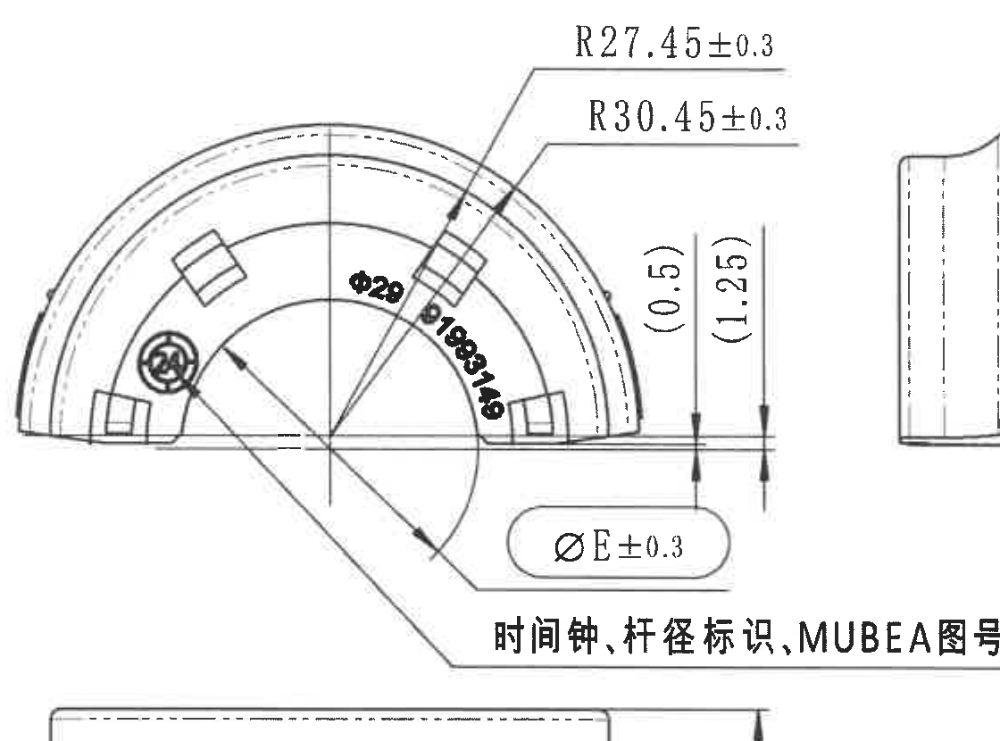

原图位置/视图名称：第 1 页中部左侧端面/标识加工视图，bbox `[455, 1065, 1575, 1895]`。

提取表格：

| 提取项 | 原图数值或文本 | 含义说明 |
|---|---|---|
| 半径尺寸 | R27.45±0.3 | 上方引线指向端面弧形结构的半径控制尺寸。 |
| 半径尺寸 | R30.45±0.3 | 上方第二条引线指向外侧弧形结构的半径控制尺寸。 |
| 直径标识 | Ø28 | 位于端面内侧弧区的直径/杆径标识文字。 |
| 图号标识 | 91993149 | 沿弧布置的 MUBEA 图号标识。 |
| 参考尺寸 | (0.5) | 右侧短竖向参考尺寸，括号表示参考值，不作为单独检验公差尺寸。 |
| 参考尺寸 | (1.25) | 右侧长竖向参考尺寸，括号表示参考值，不作为单独检验公差尺寸。 |
| 直径参数尺寸 | ØE±0.3 | 下方圆角框标注；E 值由参数表给出为 28.2 mm，因此含义为衬套直径 Ø28.2±0.3。 |
| 文字说明 | 时间钟、杆径标识、MUBEA图号 | 引线说明本端面包含时间钟、杆径标识和 MUBEA 图号。 |

边界归属说明：右侧可见侧视图边缘是为保留 ØE±0.3 和说明引线而带入的邻接片段；提取内容只归属左端面视图，不把右侧侧视图尺寸归入本对象。

## object_4 侧视加工视图

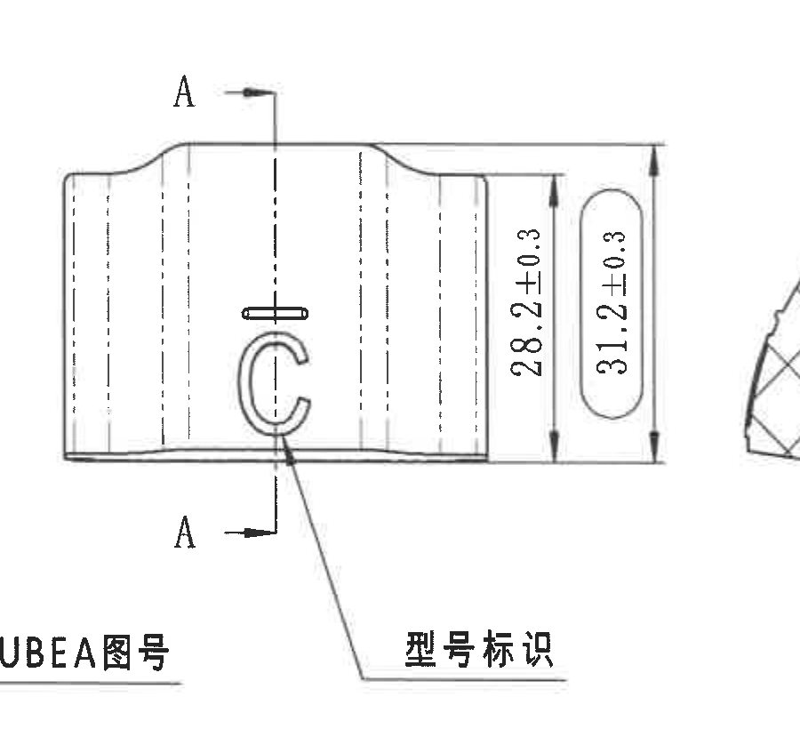

原图位置/视图名称：第 1 页中部左中侧视图，bbox `[1390, 1045, 2290, 1865]`。

提取表格：

| 提取项 | 原图数值或文本 | 含义说明 |
|---|---|---|
| 剖切标记 | A / A | 上下两个 A 与箭头定义 A-A 剖面位置。 |
| 高度尺寸 | 28.2±0.3 | 右侧内侧竖向尺寸，控制衬套主体高度/直径方向尺寸。 |
| 总高度尺寸 | 31.2±0.3 | 右侧外侧圆角框竖向尺寸，控制外包络高度。 |
| 标识说明 | 型号标识 | 引线指向侧面 C 形型号标识。 |

边界归属说明：左下角露出的 “MUBEA图号” 尾部属于 object_3 左端面视图说明；右缘少量剖面线属于 A-A 邻近视图边缘，均不提取为侧视图内容。

## object_5 A-A 剖面视图

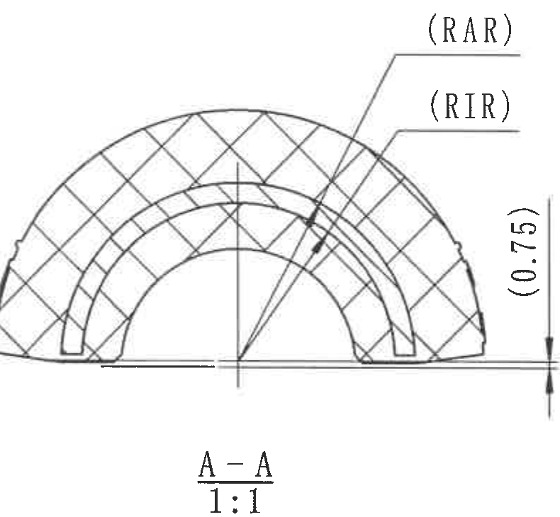

原图位置/视图名称：第 1 页中部 A-A 剖面，bbox `[2240, 1055, 3030, 1785]`。

提取表格：

| 提取项 | 原图数值或文本 | 含义说明 |
|---|---|---|
| 剖面名称 | A-A | 由 object_4 的 A-A 剖切线生成。 |
| 比例 | 1:1 | 剖面按 1:1 表示。 |
| 半径参数 | (RAR) | 括号参数标注，指向嵌件外半径；参数表给出 RAR=22 mm。 |
| 半径参数 | (RIR) | 括号参数标注，指向嵌件内半径；参数表给出 RIR=19.5 mm。 |
| 参考尺寸 | (0.75) | 右侧竖向参考尺寸，括号表示参考值；位于 A-A 剖面右侧基准边附近。 |

边界归属说明：右侧与 B-B 剖面区域相邻，裁切只保留 A-A 中 RAR/RIR 和 (0.75) 的完整引线、箭头和文字；不提取邻接 B-B 的任何 T1/T2 尺寸。

## object_6 B-B 剖面视图

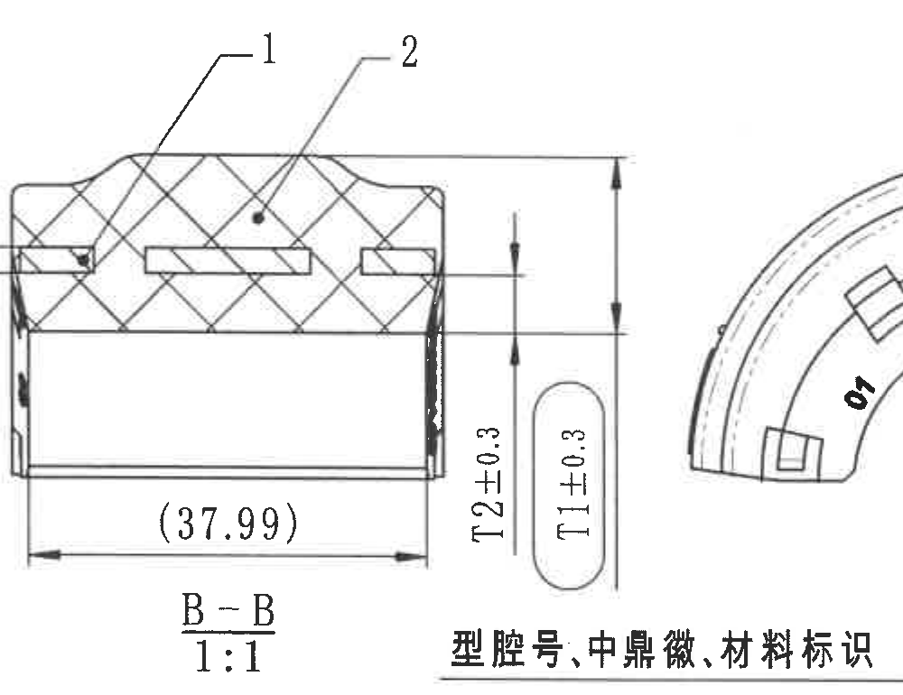

原图位置/视图名称：第 1 页中部右中 B-B 剖面，bbox `[3150, 1050, 4150, 1820]`。

提取表格：

| 提取项 | 原图数值或文本 | 含义说明 |
|---|---|---|
| 剖面名称 | B-B | 由右端面视图的 B-B 剖切线生成。 |
| 比例 | 1:1 | 剖面按 1:1 表示。 |
| 零件序号 | 1 | 引线指向金属骨架/铝骨架，对应 BOM 序号 1。 |
| 零件序号 | 2 | 引线指向橡胶体，对应 BOM 序号 2。 |
| 参考尺寸 | (37.99) | 底部水平参考尺寸，括号表示参考值。 |
| 厚度尺寸 | T2±0.3 | 右侧内侧竖向厚度尺寸；T2 参数表值为 6.15 mm，含义为 6.15±0.3。 |
| 厚度尺寸 | T1±0.3 | 右侧圆角框竖向厚度尺寸；T1 参数表值为 17.60 mm，含义为 17.60±0.3。 |

边界归属说明：右侧露出的端面弧线和下方“型腔号、中鼎微、材料标识”说明属于 object_7/object_15，不作为 B-B 剖面尺寸提取。

## object_7 右端面加工视图

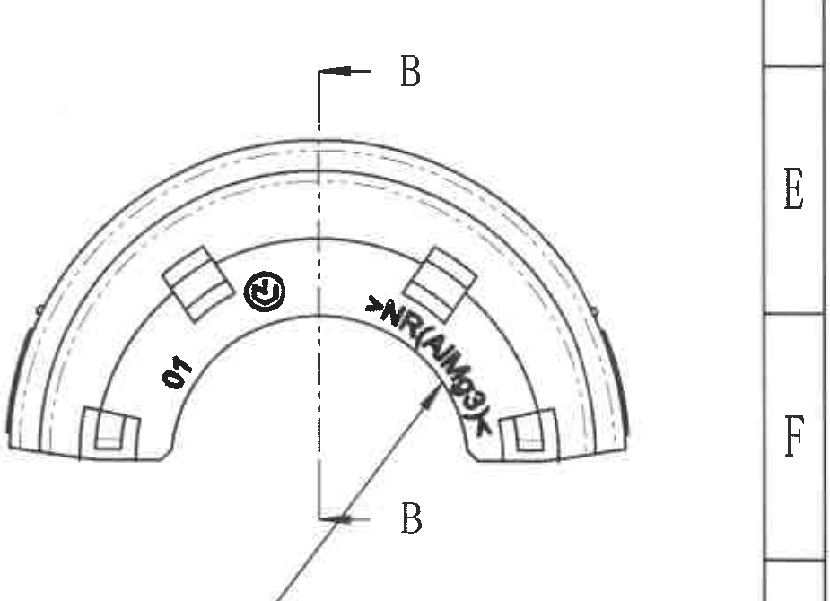

原图位置/视图名称：第 1 页中部右侧端面视图，bbox `[3905, 1070, 4830, 1740]`。

提取表格：

| 提取项 | 原图数值或文本 | 含义说明 |
|---|---|---|
| 剖切标记 | B / B | 上下两个 B 与箭头定义 B-B 剖面位置。 |
| 型腔号 | 01 | 位于端面内侧左下区域的型腔号/腔号标识。 |
| 中鼎微标识 | 圆形中鼎微图形标 | 端面内侧圆形标识。 |
| 材料标识 | 图面可辨为 `>NR/AM69<`，局部扫描不清 | 沿内弧布置的材料标识；按扫描可见字符转录，末端字符存在不确定性。 |

边界归属说明：右侧图框坐标栏 E/F 不属于端面视图；底部跨区中文说明由 object_15 单独裁切和解释，本对象只提取端面内的标识和 B-B 剖切标记。

## object_15 右端面标识局部说明

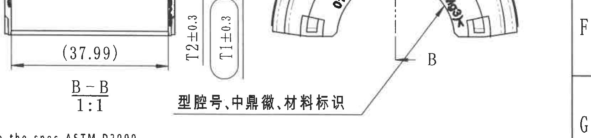

原图位置/视图名称：第 1 页中部右侧“型腔号、中鼎微、材料标识”局部说明，bbox `[3150, 1480, 4810, 1870]`。

提取表格：

| 提取项 | 原图数值或文本 | 含义说明 |
|---|---|---|
| 说明文字 | 型腔号、中鼎微、材料标识 | 引线说明右端面上需要包含型腔号、中鼎微标识和材料标识。 |
| 指向对象 | 右端面内弧标识区 | 引线跨过 B-B 附近区域，最终指向右端面标识。 |
| 型腔号 | 01 | 与 object_7 中端面标识一致。 |
| 材料标识 | 图面可辨为 `>NR/AM69<`，局部扫描不清 | 与 object_7 中弧向材料标识一致。 |

边界归属说明：裁切中左侧可见 B-B 的 (37.99)、T1/T2 和剖面名只是引线跨区造成的邻接内容；这些尺寸归 object_6，不在本局部说明中重复提取。

## object_8 下左展开/俯视加工视图

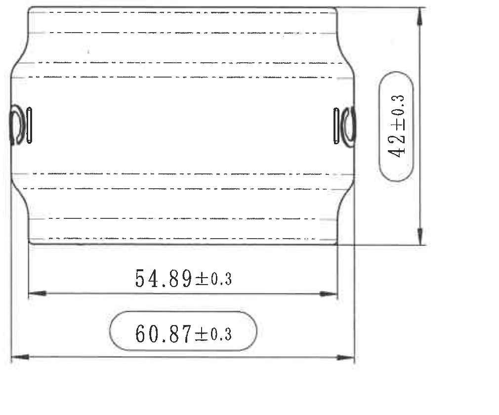

原图位置/视图名称：第 1 页下部左侧展开/俯视图，bbox `[455, 1845, 1465, 2685]`。

提取表格：

| 提取项 | 原图数值或文本 | 含义说明 |
|---|---|---|
| 高度尺寸 | 42±0.3 | 右侧圆角框竖向尺寸，控制展开视图的高度。 |
| 长度尺寸 | 54.89±0.3 | 底部内侧水平长度尺寸。 |
| 总长度尺寸 | 60.87±0.3 | 底部外侧圆角框水平总长度尺寸。 |

边界归属说明：裁切完整包含左右端轮廓、水平尺寸线、竖向尺寸线、箭头和文字；未带入其他视图尺寸。

## object_9 等轴测视图

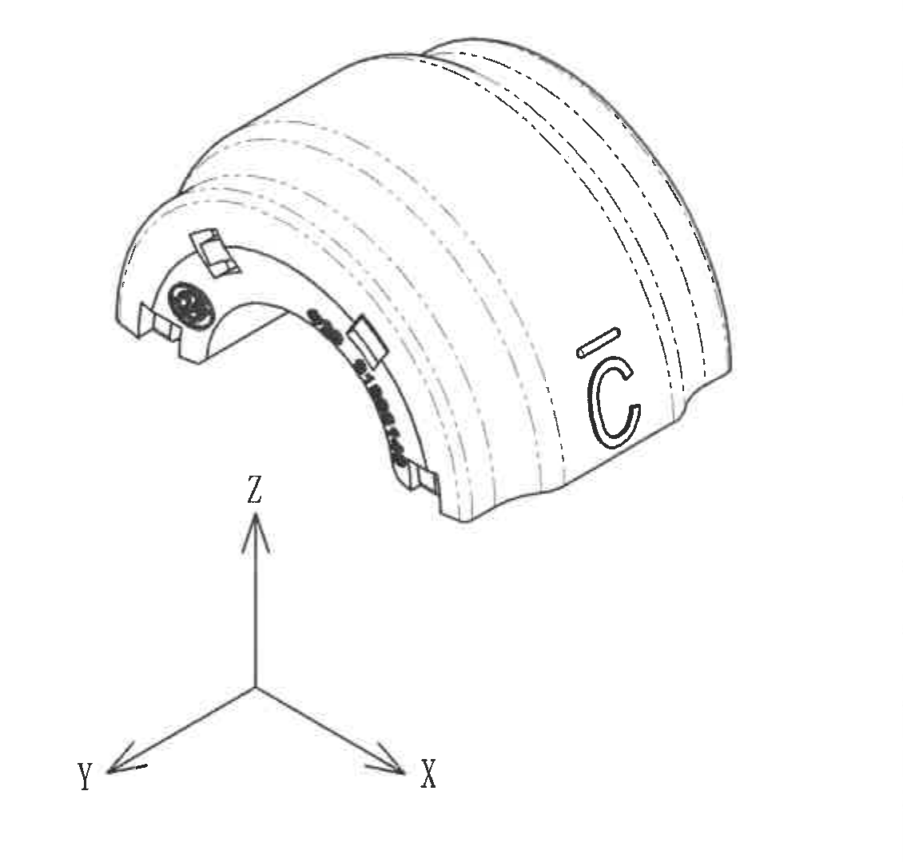

原图位置/视图名称：第 1 页下部中间等轴测视图，bbox `[1620, 1860, 2750, 2940]`。

提取表格：

| 提取项 | 原图数值或文本 | 含义说明 |
|---|---|---|
| 视图类型 | 等轴测零件外观 | 展示半圆衬套总体外形、端面标识和侧面 C 形型号标识。 |
| 坐标轴 | X、Y、Z | 表示等轴测方向。 |
| 端面标识 | 圆形中鼎微标识、弧向材料标识、C 形型号标识 | 与端面和侧视图中的标识位置相互对应。 |

边界归属说明：裁切仅包含等轴测零件和 X/Y/Z 坐标轴；Reference 参考标准列表已单独裁切为 object_12。

## object_10 NOTES / 技术要求

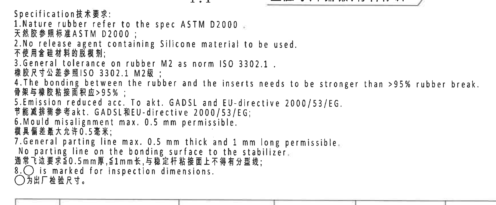

原图位置/视图名称：第 1 页右中下 NOTES/Specification 技术要求，bbox `[2700, 1785, 4440, 2505]`。

提取表格：

| 提取项 | 原图数值或文本 | 含义说明 |
|---|---|---|
| 标题 | Specification技术要求: | 技术要求说明块标题。 |
| 1 | Nature rubber refer to the spec ASTM D2000. / 天然胶参照标准 ASTM D2000； | 橡胶材料标准引用 ASTM D2000。 |
| 2 | No release agent containing Silicone material to be used. / 不使用含硅材料的脱模剂； | 禁用含硅脱模剂。 |
| 3 | General tolerance on rubber M2 as norm ISO 3302.1. / 橡胶尺寸公差参照 ISO 3302.1 M2级； | 橡胶尺寸通用公差按 ISO 3302.1 M2。 |
| 4 | The bonding between the rubber and the inserts needs to be stronger than >95% rubber break. / 骨架与橡胶粘接面积应 >95%； | 橡胶与嵌件粘接强度/破胶比例要求。 |
| 5 | Emission reduced acc. To akt. GADSL and EU-directive 2000/53/EG. / 节能减排需参考 akt. GADSL 和 EU-directive 2000/53/EG； | 排放/环保要求引用 GADSL 和 EU 指令。 |
| 6 | Mould misalignment max. 0.5 mm permissible. / 模具偏差最大允许 0.5 毫米； | 模具错位最大允许值。 |
| 7 | General parting line max. 0.5 mm thick and 1 mm long permissible. No parting line on the bonding surface to the stabilizer. / 通常飞边要求 ≤0.5mm 厚，≤1mm 长，与稳定杆粘接面上不得有分型线； | 飞边和分型线限制，粘接面不得有分型线。 |
| 8 | ○ is marked for inspection dimensions. / ○为出厂检验尺寸。 | 圆圈标识表示出厂检验尺寸。 |

边界归属说明：底部只露出 BOM 表上边线，不提取为 NOTES 内容；上方少量剖面比例/说明尾部属于邻接视图。

## object_13 BOM / 零件明细表

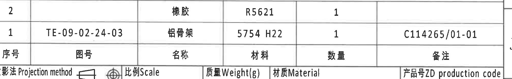

原图位置/视图名称：第 1 页右下标题栏上方零件明细表，bbox `[2790, 2485, 4790, 2795]`。

原表还原：

| 序号 | 图号 | 名称 | 材料 | 数量 | 备注 |
|---|---|---|---|---:|---|
| 2 |  | 橡胶 | R5621 | 1 |  |
| 1 | TE-09-02-24-03 | 铝骨架 | 5754 H22 | 1 | C114265/01-01 |

提取表格：

| 提取项 | 原图数值或文本 | 含义说明 |
|---|---|---|
| BOM 行 2 | 橡胶；材料 R5621；数量 1 | 橡胶件，对应 B-B 剖面序号 2。 |
| BOM 行 1 | 图号 TE-09-02-24-03；铝骨架；材料 5754 H22；数量 1；备注 C114265/01-01 | 铝骨架件，对应 B-B 剖面序号 1。 |

边界归属说明：BOM 与标题栏共用下边界，裁切底部可见下一行“投影法/Projection method”等标题栏文字；提取范围只到 BOM 的序号、图号、名称、材料、数量、备注表格。

## object_11 DIN ISO 3302-1 M2 公差表

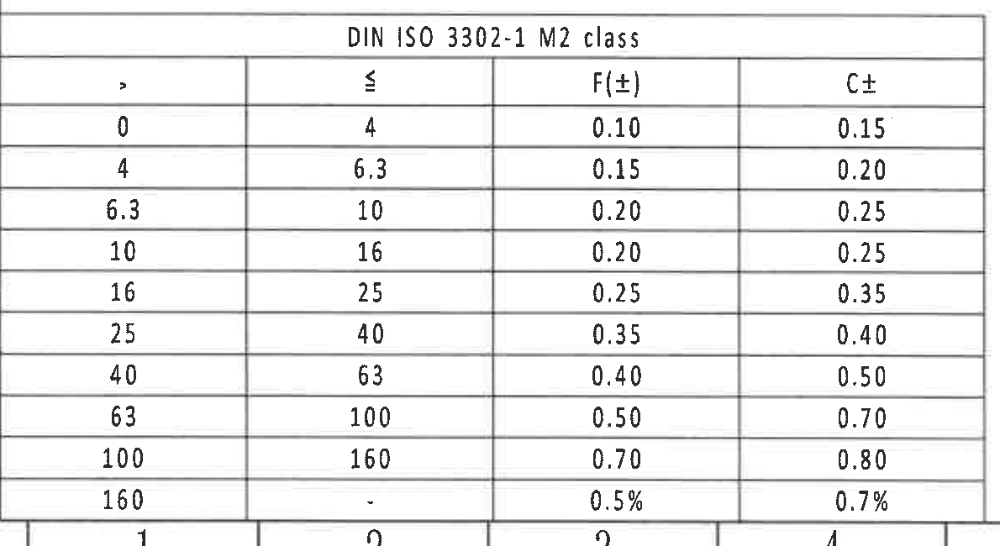

原图位置/视图名称：第 1 页左下 DIN ISO 3302-1 M2 class 表，bbox `[370, 2710, 1560, 3360]`。

原表还原：

| DIN ISO 3302-1 M2 class：&gt; | ≤ | F(±) | C± |
|---:|---:|---:|---:|
| 0 | 4 | 0.10 | 0.15 |
| 4 | 6.3 | 0.15 | 0.20 |
| 6.3 | 10 | 0.20 | 0.25 |
| 10 | 16 | 0.20 | 0.25 |
| 16 | 25 | 0.25 | 0.35 |
| 25 | 40 | 0.35 | 0.40 |
| 40 | 63 | 0.40 | 0.50 |
| 63 | 100 | 0.50 | 0.70 |
| 100 | 160 | 0.70 | 0.80 |
| 160 | - | 0.5% | 0.7% |

提取表格：

| 提取项 | 原图数值或文本 | 含义说明 |
|---|---|---|
| 表名 | DIN ISO 3302-1 M2 class | 橡胶尺寸通用公差等级表，与 NOTES 第 3 条对应。 |
| 列 | &gt;、≤、F(±)、C± | 按尺寸范围给出 F 和 C 两类公差。 |

边界归属说明：底部露出图框坐标数字上沿，属于图框坐标，不是 DIN 公差表内容；表格本体外框、标题、列头和 10 行数值均完整。

## object_12 Reference / 参考标准

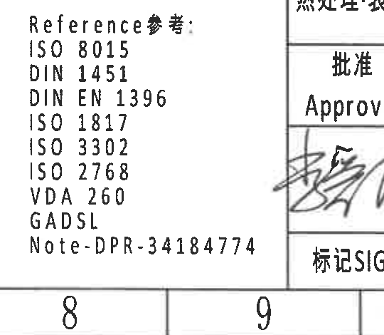

原图位置/视图名称：第 1 页下部中间 Reference 参考列表，bbox `[2350, 2930, 2890, 3400]`。

提取表格：

| 提取项 | 原图数值或文本 | 含义说明 |
|---|---|---|
| 标题 | Reference参考: | 参考标准列表标题。 |
| 参考标准 | ISO 8015 | 引用标准。 |
| 参考标准 | DIN 1451 | 引用标准。 |
| 参考标准 | DIN EN 1396 | 引用标准。 |
| 参考标准 | ISO 1817 | 引用标准。 |
| 参考标准 | ISO 3302 | 引用标准。 |
| 参考标准 | ISO 2768 | 引用标准。 |
| 参考标准 | VDA 260 | 引用标准。 |
| 参考标准 | GADSL | 引用标准。 |
| Note | Note-DPR-34184774 | 备注/内部引用编号。 |

边界归属说明：右侧可见标题栏分隔线和签名区边缘，不属于 Reference 内容；列表文字完整。

## object_14 标题栏

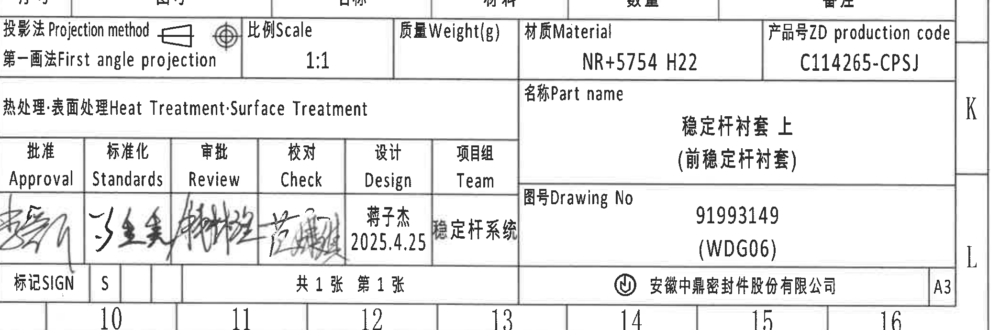

原图位置/视图名称：第 1 页右下标题栏，bbox `[2760, 2705, 4850, 3395]`。

原表还原：

| 字段 | 原图文本 |
|---|---|
| 投影法 Projection method | 第一画法 First angle projection |
| 比例 Scale | 1:1 |
| 质量 Weight(g) |  |
| 材质 Material | NR+5754 H22 |
| 产品号 ZD production code | C114265-CPSJ |
| 热处理·表面处理 Heat Treatment·Surface Treatment |  |
| 名称 Part name | 稳定杆衬套 上（前稳定杆衬套） |
| 批准 Approval | 手写签名 |
| 标准化 Standards | 手写签名 |
| 审批 Review | 手写签名 |
| 校对 Check | 手写签名 |
| 设计 Design | 蒋子杰 / 2025.4.25 |
| 项目组 Team | 稳定杆系统 |
| 图号 Drawing No | 91993149（WDG06） |
| 标记 SIGN | S |
| 张数 | 共 1 张 第 1 张 |
| 公司 | 安徽中鼎密封件股份有限公司 |
| 图幅 | A3 |

提取表格：

| 提取项 | 原图数值或文本 | 含义说明 |
|---|---|---|
| 投影法 | 第一画法 First angle projection | 图纸采用第一角法。 |
| 比例 | 1:1 | 全图/标题栏标注比例。 |
| 材质 | NR+5754 H22 | 总成材料组合。 |
| 产品号 | C114265-CPSJ | ZD production code。 |
| 名称 | 稳定杆衬套 上（前稳定杆衬套） | 零件名称。 |
| 设计 | 蒋子杰，2025.4.25 | 设计栏签署信息。 |
| 图号 | 91993149（WDG06） | Drawing No。 |
| 公司 | 安徽中鼎密封件股份有限公司 | 出图单位。 |

边界归属说明：上沿可见 BOM 表底部边线，属于 object_13；标题栏提取从“投影法/Projection method”开始，到右下 A3 和公司栏结束。

## 裁切检查记录

| 对象 | 检查结论 | 完整性与归属说明 |
|---|---|---|
| object_1 | 通过 | 修订表表头、两行记录和文字完整；右侧图框字母不提取。 |
| object_2 | 通过 | 参数表所有列、表头和数据行完整；无加工视图尺寸混入。 |
| object_3 | 通过 | R27.45±0.3、R30.45±0.3、Ø28、(0.5)、(1.25)、ØE±0.3 及说明引线完整；右侧侧视图边缘不提取。 |
| object_4 | 通过 | A-A 剖切标记、28.2±0.3、31.2±0.3、型号标识引线完整；左下邻接文字不归属本视图。 |
| object_5 | 通过 | A-A、1:1、(RAR)、(RIR)、(0.75) 及箭头完整；不提取 B-B 邻接内容。 |
| object_6 | 通过 | B-B、1:1、序号 1/2、(37.99)、T2±0.3、T1±0.3 完整；右端面标识说明归 object_15。 |
| object_7 | 通过 | 右端面轮廓、B-B 剖切标记、01、中鼎微标识和弧向材料标识完整；图框坐标 E/F 不提取。 |
| object_15 | 通过 | “型腔号、中鼎微、材料标识”说明文字和引线完整；可见 B-B 尺寸归 object_6。 |
| object_8 | 通过 | 42±0.3、54.89±0.3、60.87±0.3 的尺寸线、箭头和文字完整。 |
| object_9 | 通过 | 等轴测零件和 X/Y/Z 坐标轴完整；Reference 列表未混入。 |
| object_10 | 通过 | 技术要求 1-8 条完整；底部 BOM 上边线不提取。 |
| object_13 | 通过 | BOM 表头和两行数据完整；底部标题栏文字归 object_14。 |
| object_11 | 通过 | DIN 表标题、列头和 10 行完整；底部图框坐标不提取。 |
| object_12 | 通过 | Reference 列表完整；右侧标题栏边缘不提取。 |
| object_14 | 通过 | 标题栏字段、签署区、图号、公司、A3 完整；上沿 BOM 边线不提取。 |
