# 20C114266 内容识别与裁切提取

原 PDF: `input/20C114266.pdf`  
整页渲染图: `outputs/20C114266_assets/images/page_1.png`  
页面: 1 页；整页 PNG 尺寸: 4959 × 3505 px。

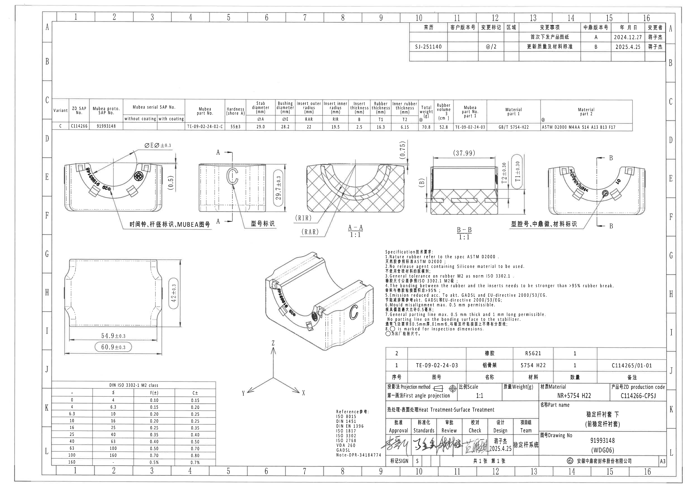

## object_1 - 右上修订履历表 / revision history table

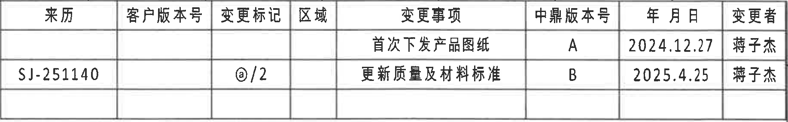

- 原图位置/视图名称: 右上修订履历表 / revision history table；bbox=[2925, 160, 4760, 445]。
- 边界归属说明: 位于页面右上角图框 A-B 区域内。对象仅包含修订履历表本体；上方/右侧图框坐标不属于表格字段。

| 来历 | 客户版本号 | 变更标记 | 区域 | 变更事项 | 中鼎版本号 | 年月日 | 变更者 |
|---|---|---|---|---|---|---|---|
|  |  |  |  | 首次下发产品图纸 | A | 2024.12.27 | 蒋子杰 |
| SJ-251140 |  | @/2 |  | 更新质量及材料标准 | B | 2025.4.25 | 蒋子杰 |

| 提取项 | 原图数值或文本 | 含义说明 |
|---|---|---|
| REV/中鼎版本号 | A、B | A 为首次下发版本；B 为更新质量及材料标准后的版本。 |
| DESCRIPTION/变更事项 | 首次下发产品图纸；更新质量及材料标准 | 记录图纸发布和后续变更内容。 |
| 变更标记 | @/2 | 第二条修订对应的变更标识。 |
| DATE/年月日 | 2024.12.27；2025.4.25 | 两条修订记录日期。 |
| BY/变更者 | 蒋子杰 | 两条记录的变更者相同。 |

## object_2 - 顶部产品参数表 / product parameter table

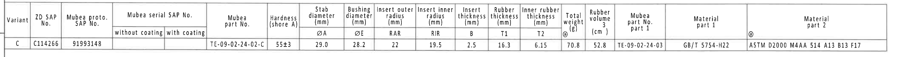

- 原图位置/视图名称: 顶部产品参数表 / product parameter table；bbox=[350, 695, 4610, 965]。
- 边界归属说明: 位于图纸上方 C-D 区域的长参数表，定义视图中的变量尺寸 ØA、ØE、RAR、RIR、B、T1、T2 及材料/质量信息。裁切仅覆盖该表格，不包含下方视图。

| Variant | ZD SAP No. | Mubea proto. SAP No. | Mubea serial SAP No. without coating | Mubea serial SAP No. with coating | Mubea part No. | Hardness (shore A) | Stab diameter ØA (mm) | Bushing diameter ØE (mm) | Insert outer radius RAR (mm) | Insert inner radius RIR (mm) | Insert thickness B (mm) | Rubber thickness T1 (mm) | Inner rubber thickness T2 (mm) | Total weight @ (g) | Rubber volume (cm^3) | Mubea part No. part 1 | Material part 1 | @ Material part 2 |
|---|---|---|---|---|---|---|---|---|---|---|---|---|---|---|---|---|---|---|
| C | C114266 | 91993148 |  |  | TE-09-02-24-02-C | 55±3 | 29.0 | 28.2 | 22 | 19.5 | 2.5 | 16.3 | 6.15 | 70.8 | 52.8 | TE-09-02-24-03 | GB/T 5754-H22 | ASTM D2000 M4AA 514 A13 B13 F17 |

| 提取项 | 原图数值或文本 | 含义说明 |
|---|---|---|
| ØA | 29.0 mm | 稳定杆直径变量。 |
| ØE | 28.2 mm | 衬套内径/孔径变量；主视图 `ØEر0.3` 调用此变量。 |
| RAR | 22 mm | 插入件外圆弧半径；A-A 剖面中引出。 |
| RIR | 19.5 mm | 插入件内圆弧半径；A-A 剖面中引出。 |
| B | 2.5 mm | 插入件厚度；B-B 剖面中引出。 |
| T1 | 16.3 mm | 橡胶厚度；B-B 剖面标注 T1±0.30。 |
| T2 | 6.15 mm | 内橡胶厚度；B-B 剖面标注 T2±0.30。 |
| 55±3 | Hardness (shore A) | 橡胶硬度，邵氏 A。 |
| 70.8 g / 52.8 cm^3 | Total weight / Rubber volume | 总质量和橡胶体积。 |

## object_3 - 左上主视图：时间钟、杆径标识、MUBEA图号区域

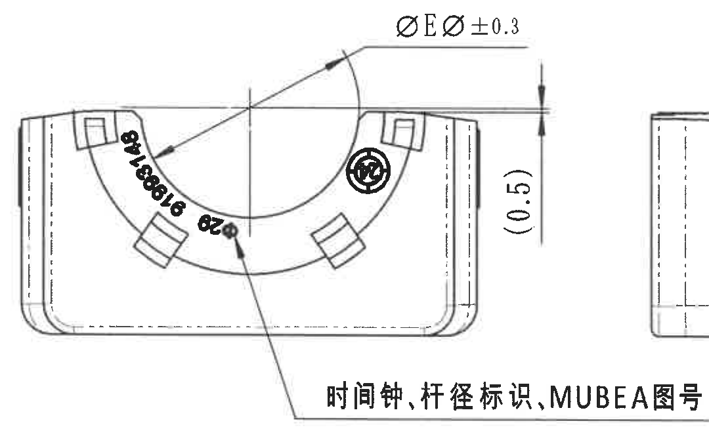

- 原图位置/视图名称: 左上主视图：时间钟、杆径标识、MUBEA图号区域；bbox=[430, 1000, 1510, 1680]。
- 边界归属说明: 位于 D-F、1-4 网格附近的主视图。右侧边缘可见相邻侧视图少量轮廓片段，是为保留本视图长引出标注造成；不对该片段提取尺寸或归属。本对象只提取主视轮廓、ØE 直径、参考尺寸 (0.5)、弧面/圆圈标识和主视引出说明。

| 提取项 | 原图数值或文本 | 含义说明 |
|---|---|---|
| 直径尺寸 | ØEر0.3；ØE=28.2 mm | 主视图顶部直径标注，按参数表对应为 28.2±0.3 mm；带直径符号。 |
| 参考尺寸 | (0.5) | 括号内尺寸为参考尺寸，位于主视图右侧竖向标注处，仅说明局部高度/边距参考，不作为控制尺寸。 |
| 出厂检验标记 | 圆圈标记 | NOTES 第 8 条说明圆圈为出厂检验尺寸标记。 |
| 弧面印字 | 91993148、28 附近标识 | 弧面图号/杆径相关印字，扫描局部模糊，按可见形态识读。 |
| 引出文字 | 时间钟、杆径标识、MUBEA图号 | 指示该面包含时间钟、杆径和 MUBEA 图号标识。 |

## object_4 - 中左侧视图：A-A 剖切位置与型号标识

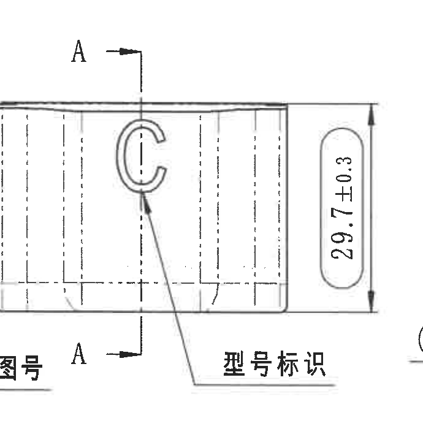

- 原图位置/视图名称: 中左侧视图：A-A 剖切位置与型号标识；bbox=[1430, 1005, 2120, 1705]。
- 边界归属说明: 位于 E-F、5-6 网格附近，与左侧主视图相邻。左下角仅有相邻主视图引出文字末端残留，不提取、不归属。本对象尺寸归属为侧视图的 29.7±0.3 和 A-A 剖切标识。

| 提取项 | 原图数值或文本 | 含义说明 |
|---|---|---|
| 剖切标记 | A、A | 侧视图中上、下箭头标出 A-A 剖切位置。 |
| 总高度/外形高度 | 29.7±0.3 | 右侧竖向尺寸线给出的高度尺寸，公差 ±0.3 mm。 |
| 型号标识 | C 形标识；型号标识 | 引出线指向 C 形型号标识位置。 |

## object_5 - 剖面 A-A 1:1

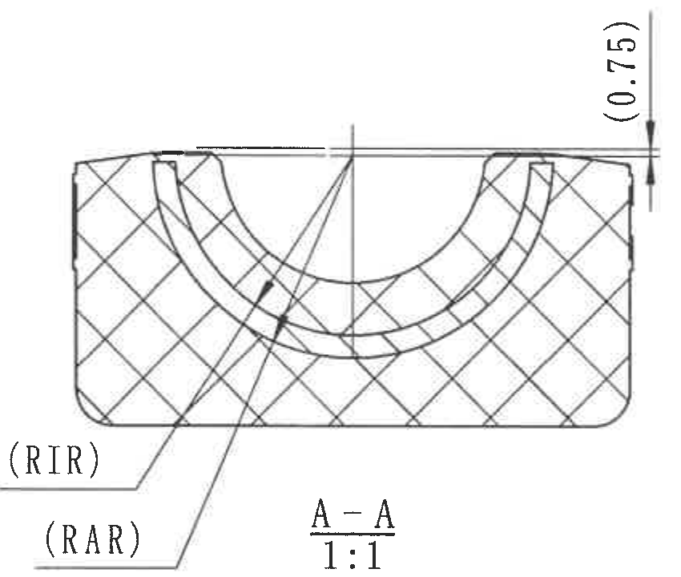

- 原图位置/视图名称: 剖面 A-A 1:1；bbox=[2100, 985, 2950, 1705]。
- 边界归属说明: 位于图纸中上部 E-F、7-9 网格附近，由侧视图 A-A 剖切获得。裁切包含完整剖面、RIR/RAR 引出线和 (0.75) 参考尺寸；不提取相邻 B-B 剖面尺寸。

| 提取项 | 原图数值或文本 | 含义说明 |
|---|---|---|
| 剖面名称/比例 | A-A / 1:1 | 由 object_4 的 A-A 剖切线得到，比例 1:1。 |
| 参考尺寸 | (0.75) | 括号内参考尺寸，位于剖面右上侧竖向标注处，表示上缘局部台阶/边缘参考距离。 |
| 内半径 | RIR=19.5 mm | 引出线指向内圆弧；实际数值由参数表给出。 |
| 外半径 | RAR=22 mm | 引出线指向外圆弧；实际数值由参数表给出。 |
| 剖面材料 | 交叉剖面线 | 表示被剖切的橡胶/材料区域。 |

## object_6 - 剖面 B-B 1:1

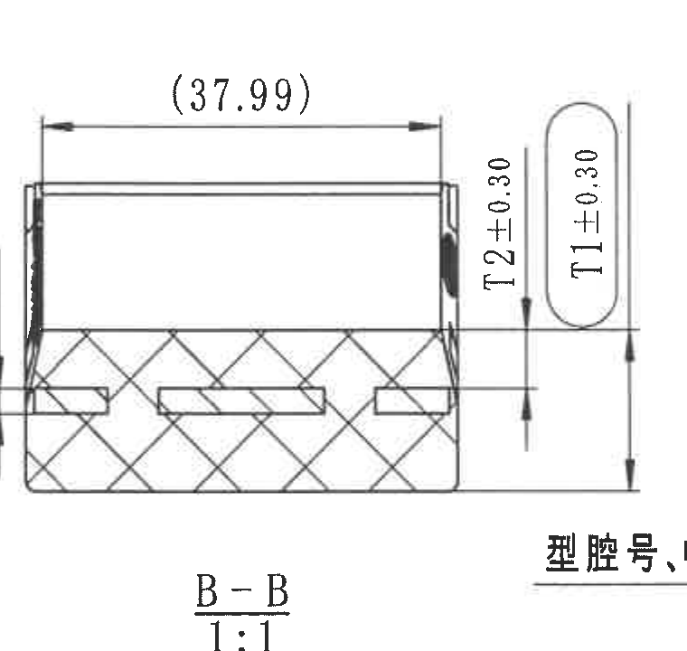

- 原图位置/视图名称: 剖面 B-B 1:1；bbox=[3050, 990, 3810, 1710]。
- 边界归属说明: 位于 E-F、10-12 网格附近，由右侧视图 B-B 剖切获得。裁切包含完整 B-B 剖面及 (37.99)、B、T2±0.30、T1±0.30 尺寸线；右下可见邻近中文说明开头，仅作为相邻标注残留，不归入剖面尺寸。

| 提取项 | 原图数值或文本 | 含义说明 |
|---|---|---|
| 剖面名称/比例 | B-B / 1:1 | 由 object_7 的 B-B 剖切线得到，比例 1:1。 |
| 参考宽度 | (37.99) | 括号内参考尺寸，位于剖面顶部横向尺寸线，不作为控制尺寸。 |
| 插入件厚度 | B；B=2.5 mm | 左侧竖向变量标注，参数表给出实际值 2.5 mm。 |
| 内橡胶厚度 | T2±0.30；T2=6.15 mm | 实际表达为 6.15±0.30 mm。 |
| 橡胶厚度 | T1±0.30；T1=16.3 mm | 实际表达为 16.3±0.30 mm，右侧圆角框内显示。 |
| 剖面材料 | 交叉剖面线、内部矩形 | 表示橡胶剖面及内部嵌件/骨架结构。 |

## object_7 - 右上主视图：型腔号、中鼎徽、材料标识区域

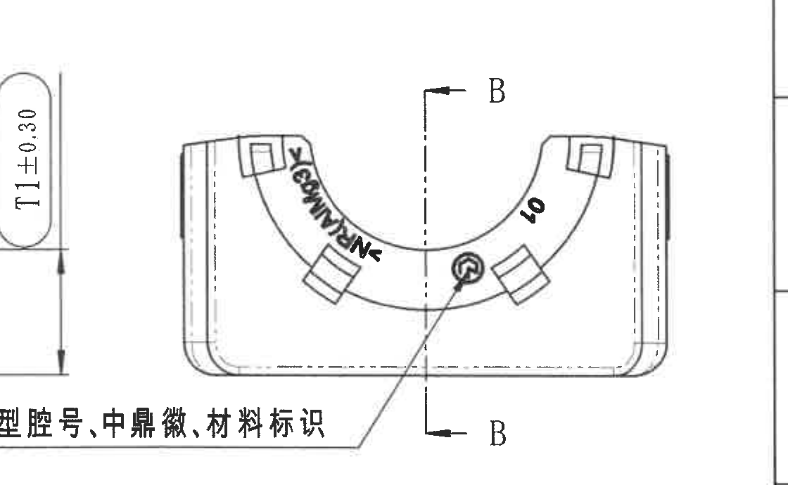

- 原图位置/视图名称: 右上主视图：型腔号、中鼎徽、材料标识区域；bbox=[3660, 1000, 4780, 1690]。
- 边界归属说明: 位于 E-F、13-16 网格附近。左侧边缘包含相邻 B-B 剖面 T1±0.30 尺寸尾部，该尺寸属于 object_6，不在本对象提取；右侧图框坐标也不提取。本对象只归属右上主视图及其 B-B 剖切、型腔/徽标/材料标识。

| 提取项 | 原图数值或文本 | 含义说明 |
|---|---|---|
| 剖切标记 | B、B | 主视图中上、下箭头标出 B-B 剖切位置。 |
| 弧面标识 | 40；M?/ZHONGDING 类标识（局部模糊） | 右侧弧面可见 40，左侧弧面文字因扫描倾斜和模糊仅按可见形态记录。 |
| 中鼎徽 | 圆形徽标 | 引出线指向中心圆形徽标。 |
| 引出文字 | 型腔号、中鼎徽、材料标识 | 指示该面包含型腔号、中鼎徽和材料标识。 |

## object_8 - 左下底视/俯视图：外形长宽尺寸

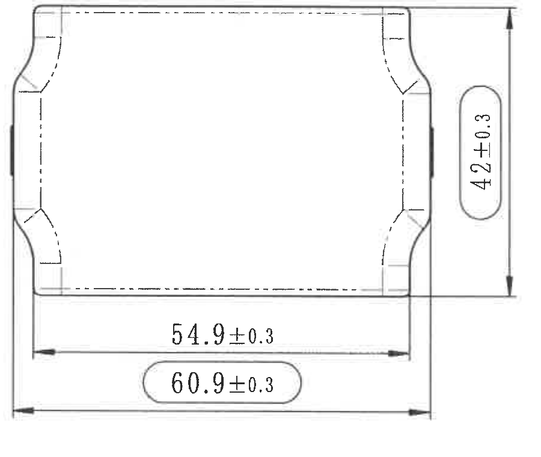

- 原图位置/视图名称: 左下底视/俯视图：外形长宽尺寸；bbox=[440, 1845, 1340, 2605]。
- 边界归属说明: 位于 H-I、1-4 网格附近的底视/俯视外形尺寸图。裁切包含完整外形、右侧竖向尺寸线和底部两条水平尺寸线；未包含上方主视图或下方公差表数据。

| 提取项 | 原图数值或文本 | 含义说明 |
|---|---|---|
| 竖向总尺寸 | 42±0.3 | 右侧竖向尺寸，表示该视图总高度/宽度方向尺寸。 |
| 内部水平尺寸 | 54.9±0.3 | 底部上方水平尺寸，表示内侧/主体长度。 |
| 外部总长检验尺寸 | 60.9±0.3 | 底部圆角框内总长度尺寸；圆圈样式表示出厂检验尺寸。 |
| 虚线 | 内部不可见边界 | 表示内部或背面结构轮廓。 |

## object_9 - 轴测视图与 X/Y/Z 坐标方向

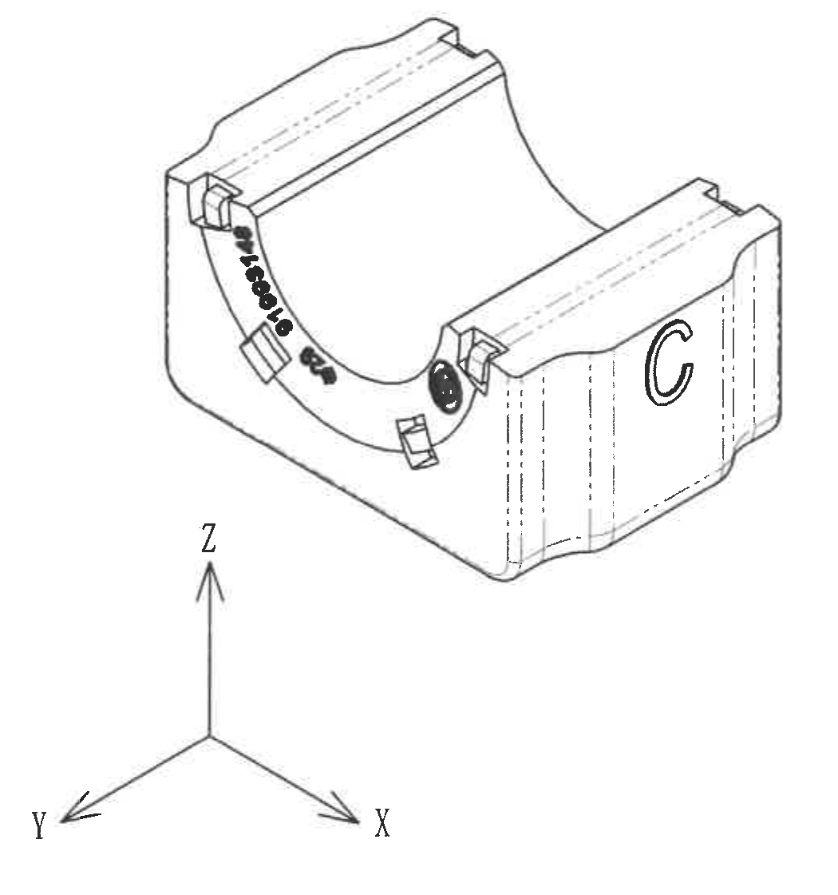

- 原图位置/视图名称: 轴测视图与 X/Y/Z 坐标方向；bbox=[1690, 1780, 2740, 2900]。
- 边界归属说明: 位于 G-J、5-9 网格附近。裁切下边界仅保留坐标系，不包含右下参考标准文本；本对象用于解释三维形态，不提取相邻 NOTES 或参考列表。

| 提取项 | 原图数值或文本 | 含义说明 |
|---|---|---|
| 三维形态 | 轴测零件外形 | 展示内凹圆弧槽、两端台阶、侧面 C 形标识和正面印字/徽标。 |
| 坐标方向 | Z 向上；X 向右下；Y 向左下 | 图纸三维方向参考。 |
| 独立尺寸 | 无 | 该轴测视图未标注独立尺寸数值，尺寸以正投影/剖面视图为准。 |

## object_10 - Specification 技术要求 / NOTES

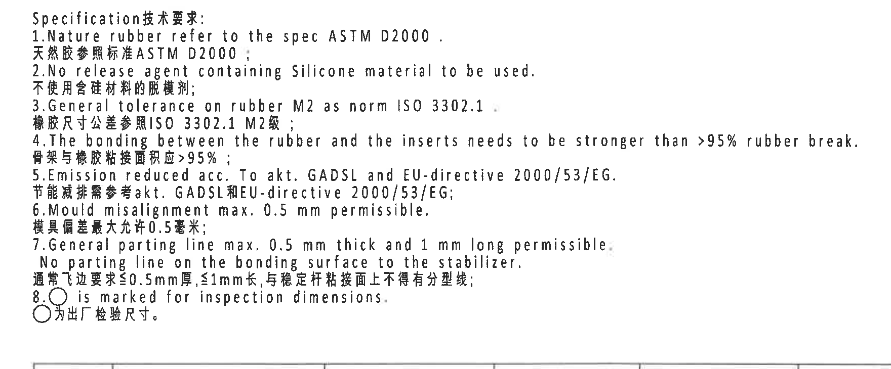

- 原图位置/视图名称: Specification 技术要求 / NOTES；bbox=[2690, 1765, 4450, 2495]。
- 边界归属说明: 位于图纸中右下 G-I、9-13 网格附近，独立说明区域。裁切已向右扩展以包含第 4 条英文尾部；下方标题栏线只作为区域边界，不提取为 NOTES 内容。

| 提取项 | 原图数值或文本 | 含义说明 |
|---|---|---|
| NOTES 1 | Nature rubber refer to the spec ASTM D2000. / 天然胶参照标准 ASTM D2000； | 天然胶材料按 ASTM D2000 规范。 |
| NOTES 2 | No release agent containing Silicone material to be used. / 不使用含硅材料的脱模剂； | 脱模剂禁止含硅材料。 |
| NOTES 3 | General tolerance on rubber M2 as norm ISO 3302.1. / 橡胶尺寸公差参照 ISO 3302.1 M2级； | 橡胶一般尺寸公差等级为 ISO 3302.1 M2。 |
| NOTES 4 | The bonding between the rubber and the inserts needs to be stronger than >95% rubber break. / 骨架与橡胶粘接面积应 >95%； | 粘接强度要求表现为大于 95% 橡胶破坏。 |
| NOTES 5 | Emission reduced acc. To akt. GADSL and EU-directive 2000/53/EG. / 节能减排需参考 akt. GADSL 和 EU-directive 2000/53/EG； | 排放/材料环保要求。 |
| NOTES 6 | Mould misalignment max. 0.5 mm permissible. / 模具偏差最大允许 0.5 毫米； | 错模最大允许值 0.5 mm。 |
| NOTES 7 | General parting line max. 0.5 mm thick and 1 mm long permissible. No parting line on the bonding surface to the stabilizer. / 通常飞边要求 ≤0.5mm 厚, ≤1mm 长，与稳定杆粘接面上不得有分型线； | 飞边/分型线限制。 |
| NOTES 8 | ○ is marked for inspection dimensions. / ○为出厂检验尺寸。 | 圆圈标注的尺寸为出厂检验尺寸。 |

## object_11 - DIN ISO 3302-1 M2 class 公差表

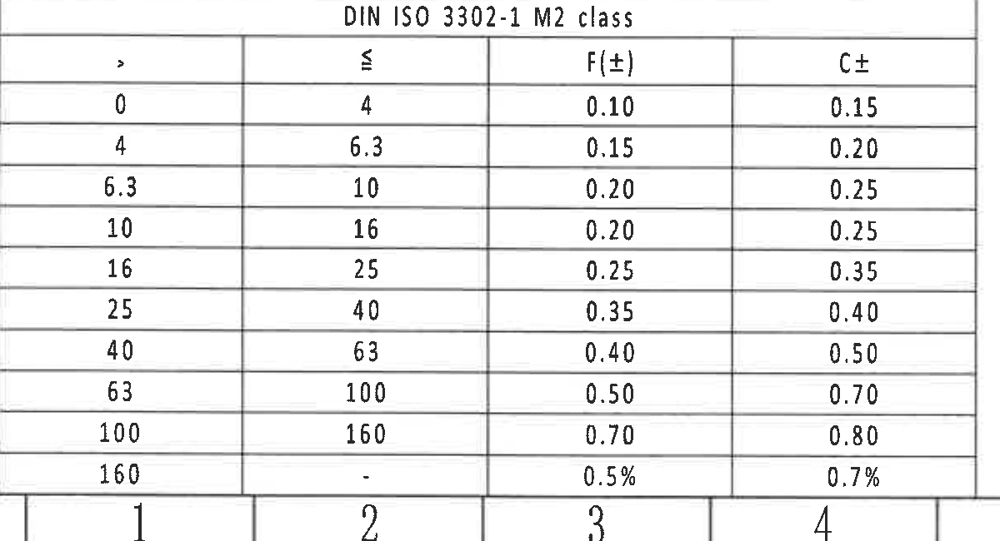

- 原图位置/视图名称: DIN ISO 3302-1 M2 class 公差表；bbox=[370, 2735, 1570, 3385]。
- 边界归属说明: 位于左下 J-L、1-4 网格附近，提供橡胶尺寸一般公差。裁切包含完整表头和数据行；底部图框坐标数字 1-4 属于图框，不作为公差表数据。

| > | ≤ | F(±) | C± |
|---:|---:|---:|---:|
| 0 | 4 | 0.10 | 0.15 |
| 4 | 6.3 | 0.15 | 0.20 |
| 6.3 | 10 | 0.20 | 0.25 |
| 10 | 16 | 0.20 | 0.25 |
| 16 | 25 | 0.25 | 0.35 |
| 25 | 40 | 0.35 | 0.40 |
| 40 | 63 | 0.40 | 0.50 |
| 63 | 100 | 0.50 | 0.70 |
| 100 | 160 | 0.70 | 0.80 |
| 160 | - | 0.5% | 0.7% |

| 提取项 | 原图数值或文本 | 含义说明 |
|---|---|---|
| 表名 | DIN ISO 3302-1 M2 class | 与 NOTES 3 对应，为橡胶件一般公差等级表。 |
| F(±)、C± | 见上表 | 按尺寸区间选择对应公差。 |

## object_12 - Reference 参考标准列表

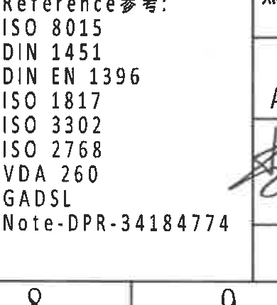

- 原图位置/视图名称: Reference 参考标准列表；bbox=[2400, 2940, 2790, 3370]。
- 边界归属说明: 位于 K-L、8-9 网格附近的参考标准文本。右侧少量签字栏线条属于标题栏相邻区域，不作为本对象内容。

| 提取项 | 原图数值或文本 | 含义说明 |
|---|---|---|
| Reference | ISO 8015 | 图纸参考标准/参考文件。 |
| Reference | DIN 1451 | 图纸参考标准/参考文件。 |
| Reference | DIN EN 1396 | 图纸参考标准/参考文件。 |
| Reference | ISO 1817 | 图纸参考标准/参考文件。 |
| Reference | ISO 3302 | 图纸参考标准/参考文件。 |
| Reference | ISO 2768 | 图纸参考标准/参考文件。 |
| Reference | VDA 260 | 图纸参考标准/参考文件。 |
| Reference | GADSL | 图纸参考标准/参考文件。 |
| Reference | Note-DPR-34184774 | 图纸参考标准/参考文件。 |

## object_13 - 右下标题栏 / title block

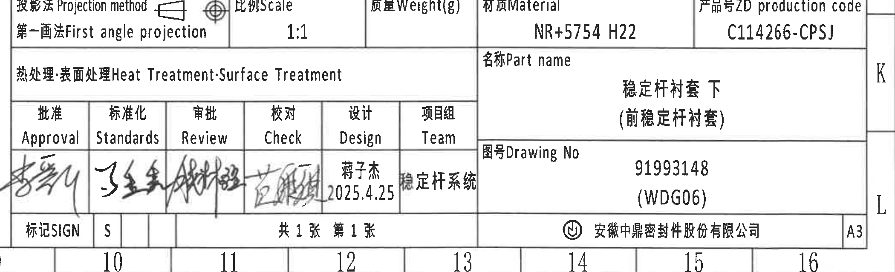

- 原图位置/视图名称: 右下标题栏 / title block；bbox=[2730, 2755, 4830, 3395]。
- 边界归属说明: 位于右下 K-L、10-16 网格附近的标题栏。上方 BOM 明细栏已作为 object_14 单独裁切；底部和右侧图框坐标仅为图框边界，不作为标题栏字段。

| 提取项 | 原图数值或文本 | 含义说明 |
|---|---|---|
| 投影法 Projection method | 第一画法 First angle projection | 采用第一角法投影。 |
| 比例 Scale | 1:1 | 图纸视图比例。 |
| 质量 Weight(g) | 空 | 标题栏未填写具体质量。 |
| 材质 Material | NR+5754 H22 | 零件材料组合。 |
| 产品号 ZD production code | C114266-CPSJ | 中鼎产品号。 |
| 热处理/表面处理 | 空 | 未填写热处理或表面处理要求。 |
| 名称 Part name | 稳定杆衬套下（前稳定杆衬套） | 零件名称。 |
| 图号 Drawing No | 91993148 (WDG06) | 图纸编号。 |
| Approval/Standards/Review/Check | 手写签名 | 审批、标准化、审核、校对签署栏。 |
| Design | 蒋子杰 2025.4.25 | 设计者及日期。 |
| Team | 稳定杆系统 | 项目组。 |
| SIGN | S | 标记栏。 |
| 页数 | 共 1 张 第 1 张 | 总页数和当前页。 |
| 公司 | 安徽中鼎密封件股份有限公司 | 出图单位。 |
| 图幅 | A3 | 图纸幅面。 |

## object_14 - 右下明细栏 / BOM table

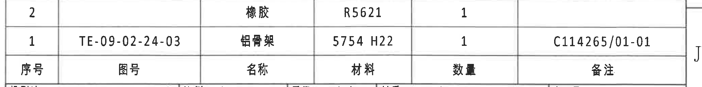

- 原图位置/视图名称: 右下明细栏 / BOM table；bbox=[2740, 2490, 4810, 2750]。
- 边界归属说明: 位于右下标题栏上方 J 行附近，是零件明细表。裁切只包含明细栏本体；下方标题栏另见 object_13。

| 序号 | 图号 | 名称 | 材料 | 数量 | 备注 |
|---|---|---|---|---|---|
| 2 |  | 橡胶 | R5621 | 1 |  |
| 1 | TE-09-02-24-03 | 铝骨架 | 5754 H22 | 1 | C114265/01-01 |

| 提取项 | 原图数值或文本 | 含义说明 |
|---|---|---|
| 明细 2 | 橡胶 / R5621 / 数量 1 | 橡胶件材料和数量。 |
| 明细 1 | TE-09-02-24-03 / 铝骨架 / 5754 H22 / 数量 1 / C114265/01-01 | 铝骨架图号、材料、数量和备注。 |

## 裁切检查记录

| 对象 | 检查结果 | 是否完整包含尺寸线和文字 | 边界归属备注 |
|---|---|---|---|
| object_1 | 修订履历表外框、表头和两条记录完整。 | 是 | 裁切已收紧到表格本体，未提取图框坐标。 |
| object_2 | 顶部参数表所有列和数据行完整。 | 是 | 只包含参数表，不含下方视图。 |
| object_3 | 主视图、ØEر0.3、(0.5) 与长引出文字可见。 | 是 | 右侧有相邻侧视图少量轮廓片段；不提取、不归属。 |
| object_4 | A-A 剖切线、29.7±0.3、型号标识完整。 | 是 | 左下有相邻主视图标注尾部；不提取、不归属。 |
| object_5 | A-A 剖面、(0.75)、RIR/RAR 引出线完整。 | 是 | 未混入 B-B 尺寸。 |
| object_6 | B-B 剖面、(37.99)、B、T2±0.30、T1±0.30 尺寸线完整。 | 是 | 右下相邻中文说明开头不归入剖面尺寸。 |
| object_7 | 右主视图、B-B 剖切线和引出文字完整。 | 是 | 左侧残留的 T1±0.30 属于 object_6，不提取；右侧图框不提取。 |
| object_8 | 42±0.3、54.9±0.3、60.9±0.3 尺寸线和文字完整。 | 是 | 未带入公差表。 |
| object_9 | 轴测图和 X/Y/Z 坐标方向完整。 | 是 | 下方未带入参考标准文本。 |
| object_10 | NOTES 1-8 中英文内容完整；第 4 条右端已重裁补齐。 | 是 | 下方标题栏线仅作边界。 |
| object_11 | DIN ISO 3302-1 M2 公差表表头和全部数据行完整。 | 是 | 底部图框坐标不提取。 |
| object_12 | Reference 列表各行完整。 | 是 | 右侧标题栏线不提取。 |
| object_13 | 标题栏主要字段完整。 | 是 | 上方 BOM 明细栏已另列 object_14；底部图框坐标不提取。 |
| object_14 | BOM 明细栏表头和两条记录完整。 | 是 | 下方标题栏字段另属 object_13。 |
