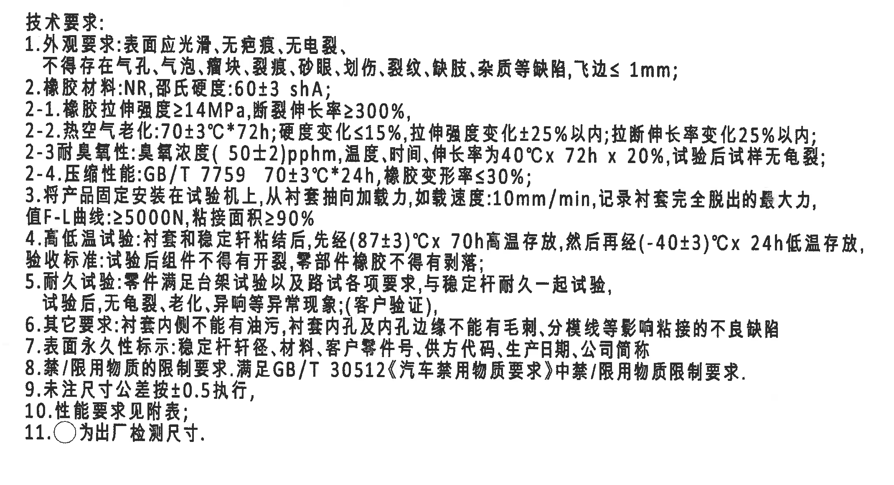
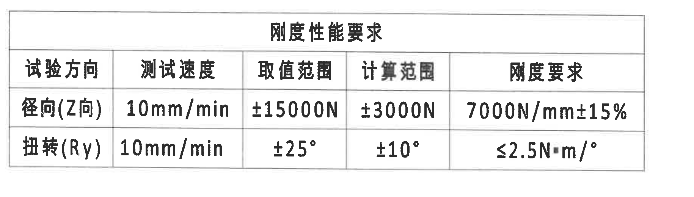
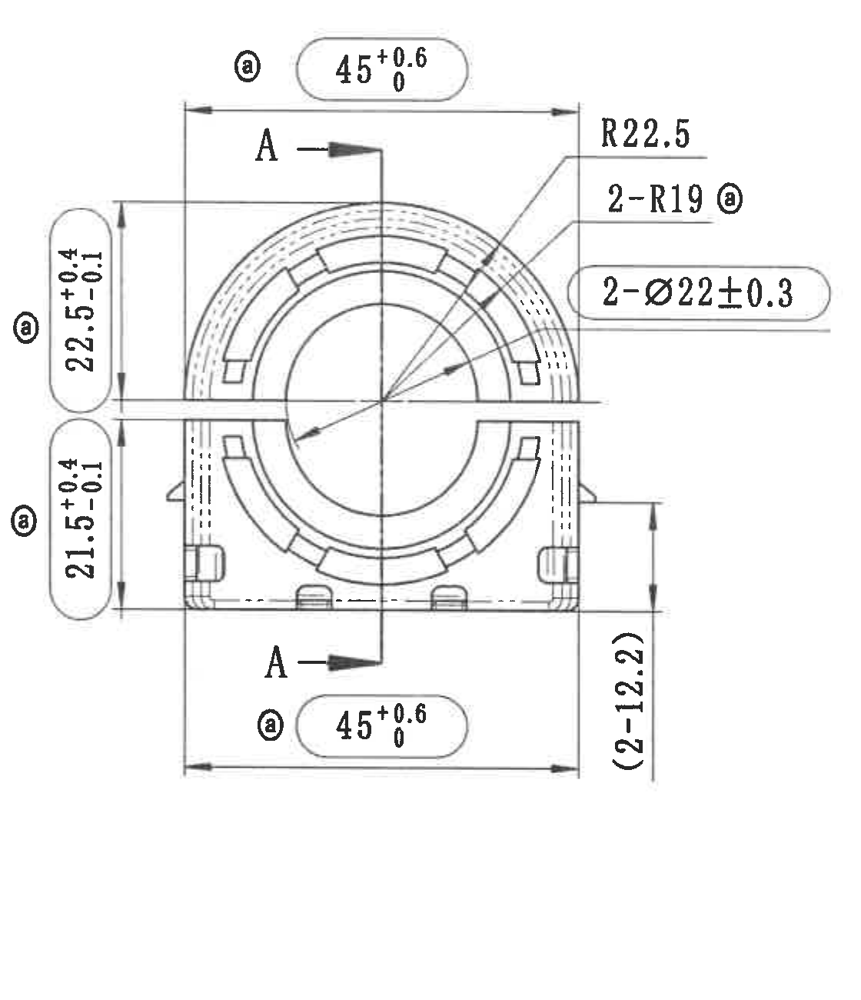
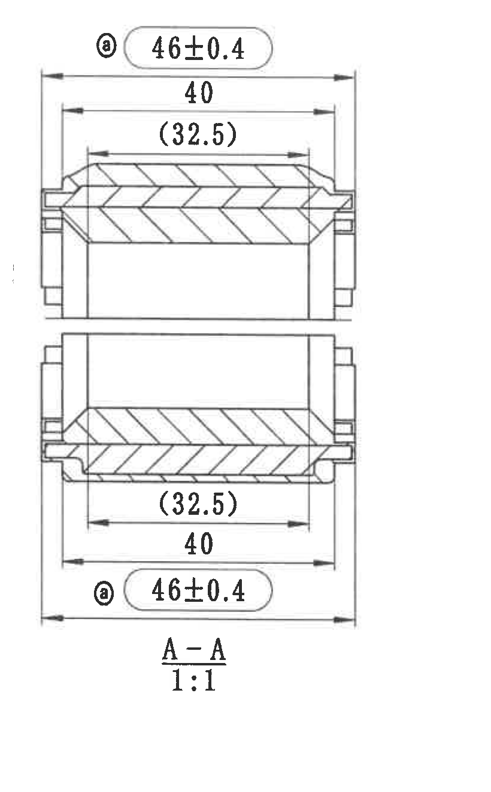
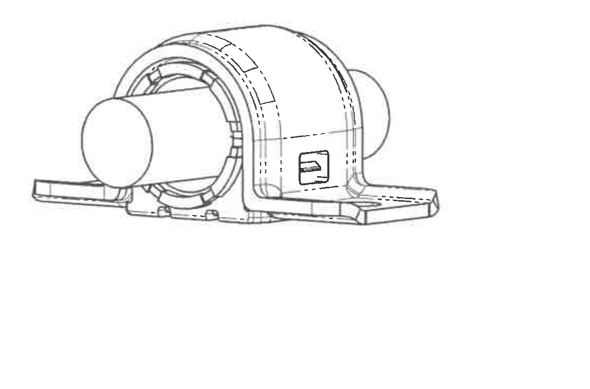
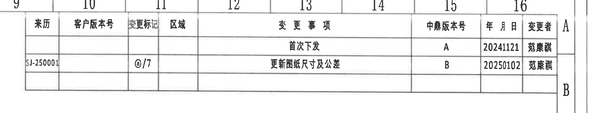
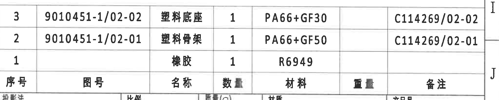
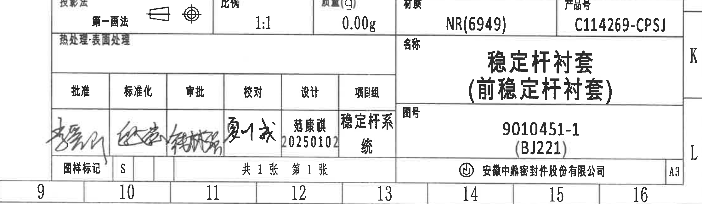

# 20C114269.pdf 内容识别

整页渲染图：`20C114269_assets/images/page_1.png`  
页面：1；整页像素：4959 x 3505；bbox 约定：`[x_min, y_min, x_max, y_max]`。  
图面中未见独立“局部视图”；识别到的视图对象为正视图、A-A 剖面视图、轴测视图。

## object_1 - NOTES / 技术要求

原图位置/对象名称：第 1 页左上，技术要求，bbox `[440, 450, 2580, 1610]`。

| 提取项 | 原图数值或文本 | 含义说明 |
|---|---|---|
| 标题 | 技术要求: | 本区域为全图技术和检验要求。 |
| 1 | 外观要求:表面应光滑,无疤痕,无龟裂,不得存在气孔,气泡,瘤块,裂痕,砂眼,划伤,裂纹,缺胶,杂质等缺陷,飞边≤1mm; | 外观验收条件；飞边上限为 1 mm。 |
| 2 | 橡胶材料:NR,邵氏硬度:60±3 shA; | 橡胶材料为 NR，硬度范围 60±3 Shore A。 |
| 2-1 | 橡胶拉伸强度≥14MPa,断裂伸长率≥300%, | 材料力学性能要求。 |
| 2-2 | 热空气老化:70±3°C*72h;硬度变化≤15%,拉伸强度变化±25%以内,拉断伸长率变化25%以内; | 老化试验条件和允许变化范围。 |
| 2-3 | 耐臭氧性:臭氧浓度(50±2)pphm,温度、时间、伸长率为40°C x 72h x 20%,试验后试样无龟裂; | 臭氧老化条件；试验后不得出现龟裂。 |
| 2-4 | 压缩性能:GB/T 7759 70±3°C*24h,橡胶变形率≤30%; | 压缩永久变形/压缩性能要求。 |
| 3 | 将产品固定安装在试验机上,从衬套轴向加载力,加载速度:10mm/min,记录衬套完全脱出的最大力,值F-L曲线:≥5000N,粘接面积≥90% | 轴向脱出/粘接性能试验；要求最大力不小于 5000 N，粘接面积不小于 90%。 |
| 4 | 高低温试验:衬套和稳定杆粘结后,先经(87±3)°C x 70h高温存放,然后再经(-40±3)°C x 24h低温存放,验收标准:试验后组件不得有开裂,零部件橡胶不得有剥落; | 高低温循环存放后的外观和粘接验收。 |
| 5 | 耐久试验:条件满足台架试验以及路试各项要求,与稳定杆耐久一起试验,试验后,无龟裂,老化,异响等异常现象;(客户验证) | 耐久验证要求，随稳定杆耐久共同验证。 |
| 6 | 其它要求:衬套内侧不能有油污,衬套内孔及内孔边缘不能有毛刺,分模线等影响粘接的不良缺陷 | 内孔及内孔边缘不得有影响粘接的不良缺陷。 |
| 7 | 表面永久性标示:稳定杆杆径,材料,客户零件号,供方代码,生产日期,公司简称 | 永久标识内容要求。 |
| 8 | 禁/限用物质的限制要求,满足GB/T 30512《汽车禁用物质要求》中禁/限用物质限制要求. | 禁限用物质法规/标准要求。 |
| 9 | 未注尺寸公差按±0.5执行, | 未注尺寸公差规则。 |
| 10 | 性能要求见附表; | 指向 object_2 刚度性能要求表。 |
| 11 | ○为出厂检测尺寸. | 图中圆圈标注尺寸为出厂检测尺寸；正视图和剖面图中带圈 a 的尺寸按此理解。 |

边界归属说明：本裁切只提取技术要求文本。右侧正视图中的圈 a 尺寸标识已通过裁切边界排除；技术要求第 11 条中的空心圆符号属于 NOTES 文本，不归入视图尺寸。

## object_2 - 刚度性能要求表

原图位置/对象名称：第 1 页左中，刚度性能要求表，bbox `[560, 1610, 2390, 2130]`。

原表还原：

| 试验方向 | 测试速度 | 取值范围 | 计算范围 | 刚度要求 |
|---|---:|---:|---:|---:|
| 径向(Z向) | 10mm/min | ±15000N | ±3000N | 7000N/mm±15% |
| 扭转(Ry) | 10mm/min | ±25° | ±10° | ≤2.5N·m/° |

| 提取项 | 原图数值或文本 | 含义说明 |
|---|---|---|
| 表名 | 刚度性能要求 | 衬套性能测试附表，对应 NOTES 第 10 条。 |
| 径向(Z向) | 10mm/min；±15000N；±3000N；7000N/mm±15% | 径向试验速度 10 mm/min，取值范围 ±15000 N，计算范围 ±3000 N，刚度要求 7000 N/mm 且允许 ±15%。 |
| 扭转(Ry) | 10mm/min；±25°；±10°；≤2.5N·m/° | 扭转试验速度 10 mm/min，取值范围 ±25°，计算范围 ±10°，扭转刚度不大于 2.5 N·m/°。 |

边界归属说明：裁切完整包含表格外框、标题、列名和两行数据；未带入右侧加工视图或下方轴测图内容。

## object_3 - 正视加工视图

原图位置/视图名称：第 1 页右中，正视加工视图，bbox `[2630, 845, 3750, 2145]`。

| 提取项 | 原图数值或文本 | 含义说明 |
|---|---|---|
| 剖切标识 | A，箭头向右；下方对应 A | 指示 A-A 剖面的位置和剖切方向；对应 object_4。 |
| 上方横向尺寸 | ⓐ 45 +0.6/0 | 上半部横向外形/开口投影尺寸；上偏差 +0.6，下偏差 0；带圈 a，按 NOTES 第 11 条为出厂检测尺寸。 |
| 下方横向尺寸 | ⓐ 45 +0.6/0 | 下半部横向外形/开口投影尺寸；与上方同值同公差；带圈 a，出厂检测尺寸。 |
| 左上高度尺寸 | ⓐ 22.5 +0.4/-0.1 | 从中间分型/分割线到上方外轮廓的高度尺寸；带圈 a，出厂检测尺寸。 |
| 左下高度尺寸 | ⓐ 21.5 +0.4/-0.1 | 从中间分型/分割线到下方外轮廓的高度尺寸；带圈 a，出厂检测尺寸。 |
| 右侧参考高度 | (2-12.2) | 括号内参考尺寸；表示 2 处 12.2 的参考高度/位置尺寸，不作为独立公差控制尺寸，但必须作为视图参考信息保留。 |
| 外侧弧半径 | R22.5 | 外侧圆弧/轮廓半径。 |
| 内部弧半径 | 2-R19 ⓐ | 2 处半径 R19 的圆弧；带圈 a，出厂检测尺寸。 |
| 直径尺寸 | 2-Ø22±0.3 | 2 处直径 22，公差 ±0.3；含直径符号 Ø 和数量前缀 2-。 |
| 星号关键尺寸 | 未见星号关键尺寸标记 | 本视图中可见的重点/检测标识为圈 a，不是星号。 |
| T 编号 | 未见 T 编号 | 本视图内未见 T 编号。 |

边界归属说明：本裁切完整包含正视图尺寸线、箭头、引出线和尺寸文字。右侧 A-A 剖面不在本对象内；正视图右侧留白不提取为剖面内容。括号尺寸 `(2-12.2)` 因尺寸线和文字均贴附正视图右下边，归属正视图。

## object_4 - A-A 剖面视图

原图位置/视图名称：第 1 页右中偏右，A-A 剖面视图，bbox `[3730, 840, 4550, 2160]`。

| 提取项 | 原图数值或文本 | 含义说明 |
|---|---|---|
| 剖面名称与比例 | A-A；1:1 | 与正视图 A 剖切标识对应；剖面比例 1:1。 |
| 上剖面总宽 | ⓐ 46±0.4 | 上剖面最外侧宽度，公差 ±0.4；带圈 a，出厂检测尺寸。 |
| 上剖面内宽 | 40 | 上剖面内侧/台阶宽度尺寸。 |
| 上剖面参考宽 | (32.5) | 括号内参考尺寸；上剖面内部结构宽度参考值，不作为独立公差控制尺寸。 |
| 下剖面参考宽 | (32.5) | 括号内参考尺寸；下剖面内部结构宽度参考值，与上剖面对应。 |
| 下剖面内宽 | 40 | 下剖面内侧/台阶宽度尺寸。 |
| 下剖面总宽 | ⓐ 46±0.4 | 下剖面最外侧宽度，公差 ±0.4；带圈 a，出厂检测尺寸。 |
| 剖面线 | 斜线剖面填充 | 表示被剖切的材料区域。 |
| 星号关键尺寸 | 未见星号关键尺寸标记 | 本剖面中重点/检测标识为圈 a，不是星号。 |
| T 编号 | 未见 T 编号 | 本剖面内未见 T 编号。 |

边界归属说明：本裁切只包含 A-A 剖面图和其尺寸标注，已排除右侧图框坐标栏。`46±0.4`、`40`、`(32.5)` 的尺寸线和箭头均位于剖面图内，不归入正视图。

## object_5 - 轴测视图

原图位置/视图名称：第 1 页下中偏左，轴测视图，bbox `[1190, 2390, 2340, 3150]`。

| 提取项 | 原图数值或文本 | 含义说明 |
|---|---|---|
| 视图类型 | 轴测视图/立体示意 | 展示稳定杆衬套的立体外形、开口、底部安装边、套筒和侧部标识位置。 |
| 尺寸文字 | 未见尺寸标注 | 本视图不承担尺寸提取，尺寸由正视图和 A-A 剖面给出。 |
| 基准/剖面标识 | 未见 | 本视图内未见基准字母、剖切线、T 编号或星号关键尺寸。 |

边界归属说明：裁切完整包含轴测图外形，没有带入上方刚度表、右下标题栏或右侧明细表内容。

## object_6 - 变更履历表

原图位置/对象名称：第 1 页右上，变更履历表，bbox `[2670, 120, 4890, 550]`。

原表还原：

| 来历 | 客户版本号 | 变更标记 | 区域 | 变更事项 | 中鼎版本号 | 年月日 | 变更者 |
|---|---|---|---|---|---|---:|---|
|  |  |  |  | 首次下发 | A | 20241121 | 范康琪 |
| SJ-250001 |  | ⓐ/7 |  | 更新图纸尺寸及公差 | B | 20250102 | 范康琪 |

| 提取项 | 原图数值或文本 | 含义说明 |
|---|---|---|
| 表头 | 来历、客户版本号、变更标记、区域、变更事项、中鼎版本号、年月日、变更者 | 变更履历字段。 |
| 记录 1 | 首次下发；A；20241121；范康琪 | 初版下发记录。 |
| 记录 2 | SJ-250001；ⓐ/7；更新图纸尺寸及公差；B；20250102；范康琪 | 更新图纸尺寸及公差的 B 版记录；变更标记对应圈 a/7。 |

边界归属说明：裁切完整包含履历表外框、表头和两条记录。顶部和右侧少量图框坐标仅为图纸坐标栏，不作为表格字段提取。

## object_7 - 零件明细表

原图位置/对象名称：第 1 页右下上部，零件明细表，bbox `[2780, 2360, 4830, 2775]`。原图表头位于数据行下方；下表列名还原原表表头，数据行顺序保持原图从上到下。

原表还原：

| 序号 | 图号 | 名称 | 数量 | 材料 | 重量 | 备注 |
|---:|---|---|---:|---|---|---|
| 3 | 9010451-1/02-02 | 塑料底座 | 1 | PA66+GF30 |  | C114269/02-02 |
| 2 | 9010451-1/02-01 | 塑料骨架 | 1 | PA66+GF50 |  | C114269/02-01 |
| 1 |  | 橡胶 | 1 | R6949 |  |  |

| 提取项 | 原图数值或文本 | 含义说明 |
|---|---|---|
| 序号 3 | 图号 9010451-1/02-02；名称 塑料底座；数量 1；材料 PA66+GF30；备注 C114269/02-02 | 塑料底座零件明细。 |
| 序号 2 | 图号 9010451-1/02-01；名称 塑料骨架；数量 1；材料 PA66+GF50；备注 C114269/02-01 | 塑料骨架零件明细。 |
| 序号 1 | 名称 橡胶；数量 1；材料 R6949 | 橡胶件明细，图号和备注栏为空白。 |

边界归属说明：裁切完整包含明细表数据行和表头。底部边线与下方标题栏/属性栏相邻，裁切中可见少量下一栏顶部文字残影；该残影不属于明细表字段，未提取为本对象内容。

## object_8 - 标题栏 / 图纸属性栏

原图位置/对象名称：第 1 页右下，标题栏和图纸属性栏，bbox `[2600, 2765, 4830, 3415]`。

原表还原：

| 字段 | 原图数值或文本 |
|---|---|
| 投影法 | 第一画法 |
| 比例 | 1:1 |
| 质量(g) | 0.00g |
| 材质 | NR(6949) |
| 产品号 | C114269-CPSJ |
| 热处理·表面处理 | 空白 |
| 名称 | 稳定杆衬套（前稳定杆衬套） |
| 图号 | 9010451-1 (BJ221) |
| 批准 | 手写签名 |
| 标准化 | 手写签名 |
| 审批 | 手写签名 |
| 校对 | 手写签名 |
| 设计 | 范康琪 20250102 |
| 项目组 | 稳定杆系统 |
| 图样标记 | S |
| 页数 | 共 1 张 第 1 张 |
| 公司 | 安徽中鼎密封件股份有限公司 |
| 图幅 | A3 |

| 提取项 | 原图数值或文本 | 含义说明 |
|---|---|---|
| 产品/图纸名称 | 稳定杆衬套（前稳定杆衬套） | 图纸对象名称。 |
| 图号 | 9010451-1 (BJ221) | 图纸编号和括号内补充编号。 |
| 产品号 | C114269-CPSJ | 产品编号。 |
| 材质 | NR(6949) | 标题栏材料字段，与明细表橡胶材料 R6949 对应。 |
| 比例 | 1:1 | 图纸比例。 |
| 质量 | 0.00g | 标题栏质量字段。 |
| 图幅 | A3 | 图纸幅面。 |

边界归属说明：裁切完整包含标题栏和签核栏；底部与外部图框坐标 9-16 相邻，坐标数字不作为标题栏字段提取。手写签名按签核栏位保留为“手写签名”，不主观识别签名笔迹。

## 裁切检查记录

| 对象 | 图片路径 | 检查结果 |
|---|---|---|
| 整页 | `20C114269_assets/images/page_1.png` | 已由 PDF 渲染为整页 PNG，4959 x 3505，完整页面。 |
| object_1 技术要求 | `20C114269_assets/images/object_1.png` | 技术要求文字完整；未带入正视图尺寸标注。 |
| object_2 刚度性能要求表 | `20C114269_assets/images/object_2.png` | 表格外框、表头、两行数据完整；无相邻视图片段。 |
| object_3 正视加工视图 | `20C114269_assets/images/object_3.png` | 尺寸线、箭头、引出线、圈 a、参考尺寸和 A 剖切标识完整；未混入 A-A 剖面。 |
| object_4 A-A 剖面视图 | `20C114269_assets/images/object_4.png` | 剖面线、上下两组尺寸线和 A-A 1:1 标识完整；右侧图框坐标栏已排除。 |
| object_5 轴测视图 | `20C114269_assets/images/object_5.png` | 立体视图外形完整；无尺寸文字被裁切。 |
| object_6 变更履历表 | `20C114269_assets/images/object_6.png` | 表格外框、表头和两条记录完整；图框坐标不作为表格内容。 |
| object_7 零件明细表 | `20C114269_assets/images/object_7.png` | 明细表数据行和表头完整；底部相邻标题栏残影已排除出提取内容。 |
| object_8 标题栏/图纸属性栏 | `20C114269_assets/images/object_8.png` | 标题栏、属性栏、签核栏、公司名和 A3 图幅完整；底部图框坐标不作为标题栏字段。 |
