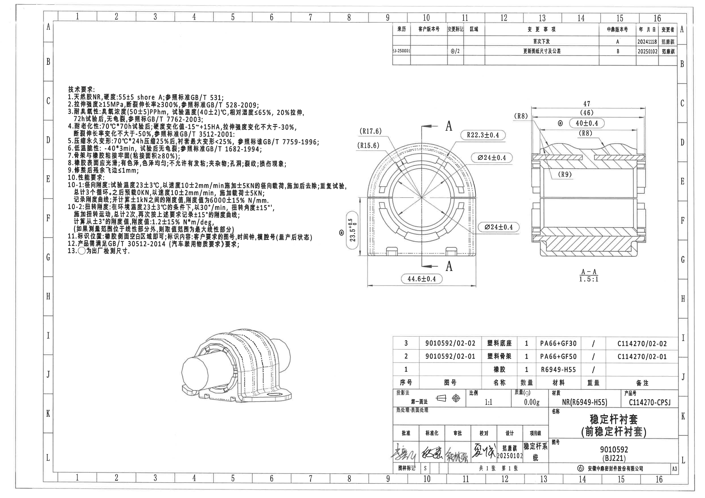
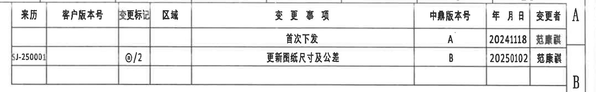
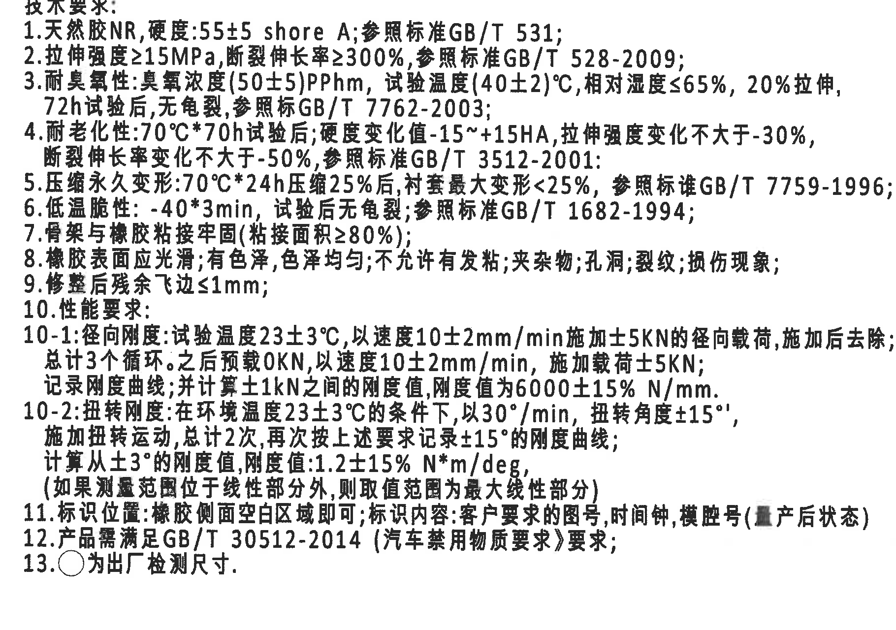
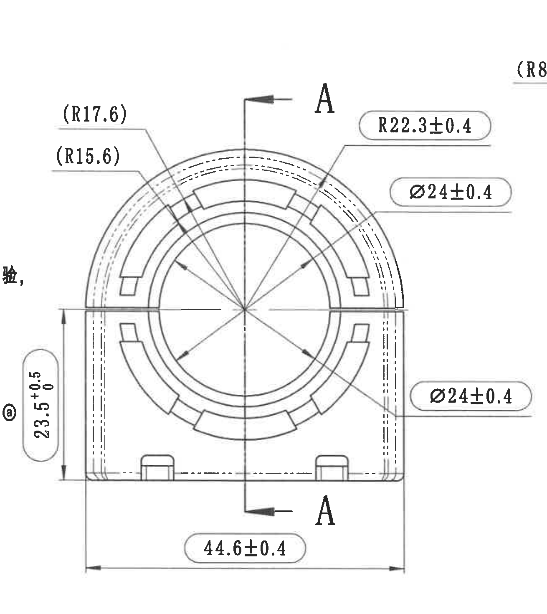
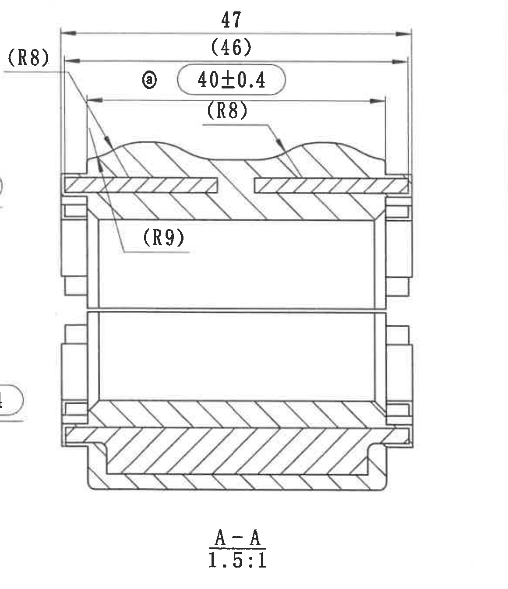
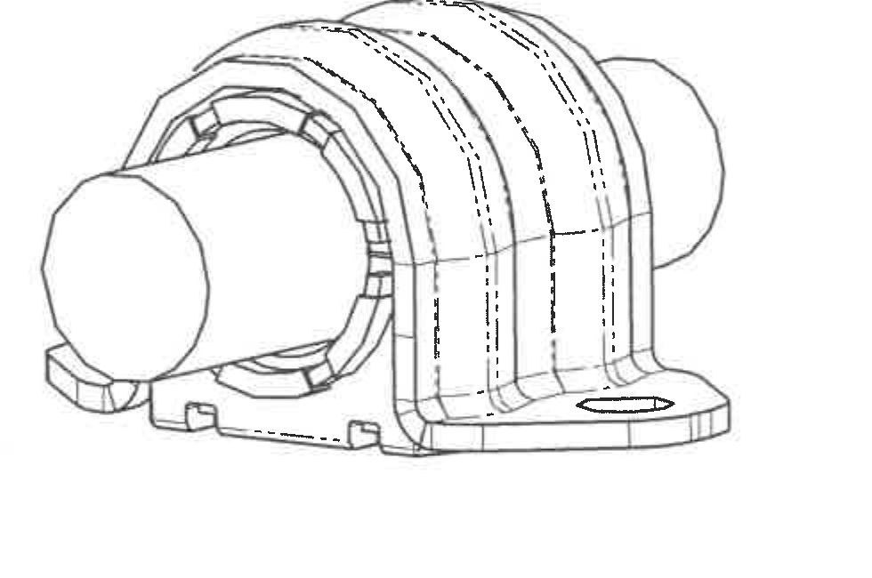
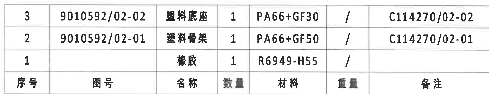
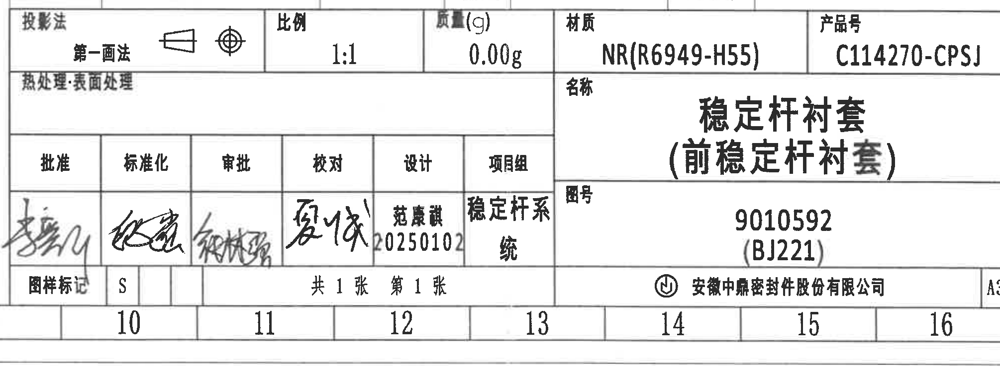

# 20C114270 内容识别

坐标基准: PDF 已先渲染为整页 PNG，整页图像尺寸为 4959 x 3505 px；bbox 均为 `[x1, y1, x2, y2]`，原点为整页 PNG 左上角。

## 整页渲染图

## object_5 - 修订履历表 (table)

- 原图位置/视图名称: 修订履历表；page 1；bbox `[2720, 150, 4870, 485]`
- 原表还原:

| 来历 | 客户版本号 | 变更标记 | 区域 | 变更事项 | 中鼎版本号 | 年月日 | 变更者 |
|---|---|---|---|---|---|---|---|
|  |  |  |  | 首次下发 | A | 20241118 | 范康琪 |
| SJ-250001 |  | ⓐ/2 |  | 更新图纸尺寸及公差 | B | 20250102 | 范康琪 |
|  |  |  |  |  |  |  |  |

| 提取项 | 原图数值或文本 | 含义说明 |
|---|---|---|
| 表头 | 来历、客户版本号、变更标记、区域、变更事项、中鼎版本号、年月日、变更者 | 修订履历字段。 |
| 版本 A | 首次下发；中鼎版本号 A；年月日 20241118；变更者 范康琪 | 首次发布记录。 |
| 版本 B | 来历 SJ-250001；变更标记 ⓐ/2；变更事项 更新图纸尺寸及公差；中鼎版本号 B；年月日 20250102；变更者 范康琪 | 尺寸及公差更新记录。 |
| 空白行 | 表底部预留空行 | 原表保留的空白记录行。 |

边界归属说明: 原图位置: 顶部右侧，约 A-B / 9-16 区。边界归属: 表格左侧 SJ-250001、右侧变更者列和外框均完整；右边可见图框 A/B 坐标边栏，不作为修订表字段。

## object_1 - 技术要求 NOTES (notes)

- 原图位置/视图名称: 技术要求 NOTES；page 1；bbox `[430, 620, 2250, 1900]`
| 提取项 | 原图数值或文本 | 含义说明 |
|---|---|---|
| 技术要求 1 | 天然胶NR，硬度:55±5 shore A; 参照标准GB/T 531; | 材料为天然橡胶 NR，硬度要求为 Shore A 55±5，并引用 GB/T 531。 |
| 技术要求 2 | 拉伸强度≥15MPa，断裂伸长率≥300%，参照标准GB/T 528-2009; | 规定橡胶拉伸强度和断裂伸长率的最低要求。 |
| 技术要求 3 | 耐臭氧性: 臭氧浓度(50±5)PPhm，试验温度(40±2)℃，相对湿度≤65%，20%拉伸，72h试验后，无龟裂，参照标准GB/T 7762-2003; | 臭氧老化试验条件和判定要求。 |
| 技术要求 4 | 耐老化性:70℃*70h试验后; 硬度变化值-15~+15HA，拉伸强度变化不大于-30%，断裂伸长率变化不大于-50%，参照标准GB/T 3512-2001; | 热空气老化后的硬度、强度、伸长率变化限制。 |
| 技术要求 5 | 压缩永久变形:70℃*24h压缩25%后，衬套最大变形<25%，参照标准GB/T 7759-1996; | 压缩永久变形试验条件及最大变形限制。 |
| 技术要求 6 | 低温脆性: -40*3min，试验后无龟裂，参照标准GB/T 1682-1994; | 低温脆性试验条件和无龟裂判定。 |
| 技术要求 7 | 骨架与橡胶粘接牢固(粘接面积≥80%); | 塑料骨架与橡胶之间的粘接面积要求。 |
| 技术要求 8 | 橡胶表面应光滑; 有色泽，色泽均匀; 不允许有发粘; 夹杂物; 孔洞; 裂纹; 损伤现象; | 橡胶外观质量要求。 |
| 技术要求 9 | 修整后残余飞边≤1mm; | 修边后残留飞边高度限制。 |
| 技术要求 10 | 性能要求: | 后续 10-1、10-2 为性能测试要求。 |
| 技术要求 10-1 | 径向刚度: 试验温度23±3℃，以速度10±2mm/min施加±5KN的径向载荷，施加后去除; 总计3个循环。之后预载0KN，以速度10±2mm/min，施加载荷±5KN; 记录刚度曲线，并计算±1KN之间的刚度值，刚度值为6000±15% N/mm. | 径向刚度试验加载方式、速度、循环次数和目标刚度。 |
| 技术要求 10-2 | 扭转刚度: 在环境温度23±3℃的条件下，以30°/min，扭转角度±15°，施加扭转运动，总计2次，再次按上述要求记录±15°的刚度曲线; 计算从±3°的刚度值，刚度值:1.2±15% N*m/deg，(如果测量范围位于线性部分外，则取值范围为最大线性部分) | 扭转刚度试验角速度、角度范围、记录范围和目标刚度。 |
| 技术要求 11 | 标识位置: 橡胶侧面空白区域即可; 标识内容: 客户要求的图号，时间钟，模腔号(量产后状态) | 标识放置区域及标识内容。 |
| 技术要求 12 | 产品需满足GB/T 30512-2014（汽车禁用物质要求）要求; | 禁用物质合规要求。 |
| 技术要求 13 | ○为出厂检测尺寸。 | 图中带圈标识的尺寸为出厂检测尺寸。 |

边界归属说明: 原图位置: 左侧 C-G 区域。边界归属: 裁切只包含技术要求文本 1-13 条，未带入零件视图、尺寸线或表格。

## object_2 - 主视图 (view)

- 原图位置/视图名称: 主视图；page 1；bbox `[2380, 650, 3690, 2120]`
| 提取项 | 原图数值或文本 | 含义说明 |
|---|---|---|
| 剖切/基准字母 | A（上下两处箭头，中心剖切线） | 表示 A-A 剖面位置，与右侧 A-A 剖面视图对应；不是尺寸值。 |
| 参考半径 | (R17.6) | 括号内参考尺寸，指向上部外侧圆弧/轮廓半径；仅作参考，不作为带公差控制尺寸。 |
| 参考半径 | (R15.6) | 括号内参考尺寸，指向上部内侧圆弧/台阶半径；仅作参考。 |
| 半径尺寸 | R22.3±0.4 | 主视图上部圆弧半径，带 ±0.4 公差。 |
| 直径尺寸（上右标注） | Ø24±0.4 | 右上标注引线指向主视图圆形/内孔相关轮廓，直径尺寸带 ±0.4 公差。 |
| 直径尺寸（右下标注） | Ø24±0.4 | 右下重复标注引线指向另一处圆形/内孔相关轮廓，直径尺寸带 ±0.4 公差。 |
| 出厂检测高度尺寸 | ⓐ 23.5 +0.5/0 | 左侧竖向尺寸，从底部基准边到上方横向位置；单向公差 +0.5/0。圈注按技术要求 13 解读为出厂检测尺寸。 |
| 底部总宽尺寸 | 44.6±0.4 | 底部横向总宽/安装座外宽，带 ±0.4 公差。 |
| 弧长/弧向尺寸 | 未见独立弧长或弧向尺寸 | 本视图可见弧相关标注为半径 R，不见弧长类标注。 |
| T 编号 | 未见 | 本主视图中未标出 T 编号。 |

边界归属说明: 原图位置: 中部偏右，约 D-H / 8-12 区。边界归属: 左侧为保留 23.5 +0.5/0 竖向尺寸和圈注而保守扩裁，可见少量 NOTES 残字，不属于主视图提取项；右上角可见相邻 A-A 剖面 (R8) 残片，不归入主视图。主视图自身尺寸线、箭头和文字完整。

## object_3 - A-A 剖面视图 (section)

- 原图位置/视图名称: A-A 剖面视图；page 1；bbox `[3600, 685, 4760, 2030]`
| 提取项 | 原图数值或文本 | 含义说明 |
|---|---|---|
| 剖面名称与比例 | A-A; 1.5:1 | 由主视图 A-A 剖切线生成的剖面视图，绘图比例 1.5:1。 |
| 外侧总长尺寸 | 47 | 剖面顶部横向外侧总长，原图未给单独公差。 |
| 参考长度 | (46) | 括号内参考尺寸，位于 47 下方，表示相邻横向参考长度。 |
| 出厂检测长度尺寸 | ⓐ 40±0.4 | 剖面顶部内侧横向控制尺寸，带 ±0.4 公差；圈注按技术要求 13 解读为出厂检测尺寸。 |
| 参考圆角 | (R8)（左上） | 括号内参考半径，指向剖面左上过渡圆角。 |
| 参考圆角 | (R8)（上中） | 括号内参考半径，指向剖面上部中间凹/凸过渡圆角。 |
| 参考圆角 | (R9) | 括号内参考半径，指向剖面左下过渡圆角。 |
| 剖面线 | 斜线剖面填充 | 表示被剖切到的材料区域。 |
| 角度/弧向尺寸 | 未见角度尺寸或弧长尺寸 | 本剖面仅见直线尺寸和半径参考尺寸。 |
| T 编号 | 未见 | 本剖面中未标出 T 编号。 |

边界归属说明: 原图位置: 右侧中部，约 C-H / 12-16 区。边界归属: 左边缘因剖面左上 (R8) 引线靠近主视图而保守扩裁，可见主视图少量残片；仅提取 A-A 剖面内的 47、(46)、40±0.4、(R8)、(R9) 等标注。未带入右侧图框坐标栏。

## object_4 - 轴测图 (view)

- 原图位置/视图名称: 轴测图；page 1；bbox `[1230, 2320, 2210, 2970]`
| 提取项 | 原图数值或文本 | 含义说明 |
|---|---|---|
| 轴测图 | 无尺寸文字标注 | 用于表达稳定杆衬套三维外形、底座、外圈包覆和安装孔位置。 |
| 隐藏/中心线 | 可见虚线轮廓 | 表达被遮挡的内部或背侧结构关系。 |
| 尺寸/弧度/角度/T 编号 | 未见 | 轴测图区域未标注尺寸、半径、角度、公差或 T 编号。 |

边界归属说明: 原图位置: 下方偏左，约 I-J / 4-7 区。边界归属: 裁切仅包含轴测外观图，不包含尺寸标注、表格或标题栏。

## object_6 - 明细表/材料清单 (table)

- 原图位置/视图名称: 明细表/材料清单；page 1；bbox `[2745, 2348, 4755, 2738]`
- 原表还原:

| 序号 | 图号 | 名称 | 数量 | 材料 | 重量 | 备注 |
|---|---|---|---|---|---|---|
| 3 | 9010592/02-02 | 塑料底座 | 1 | PA66+GF30 | / | C114270/02-02 |
| 2 | 9010592/02-01 | 塑料骨架 | 1 | PA66+GF50 | / | C114270/02-01 |
| 1 |  | 橡胶 | 1 | R6949-H55 | / |  |

| 提取项 | 原图数值或文本 | 含义说明 |
|---|---|---|
| 表头 | 序号、图号、名称、数量、材料、重量、备注 | 明细表字段。 |
| 明细行 3 | 图号 9010592/02-02；名称 塑料底座；数量 1；材料 PA66+GF30；重量 /；备注 C114270/02-02 | 零件/材料清单记录。 |
| 明细行 2 | 图号 9010592/02-01；名称 塑料骨架；数量 1；材料 PA66+GF50；重量 /；备注 C114270/02-01 | 零件/材料清单记录。 |
| 明细行 1 | 图号 空白；名称 橡胶；数量 1；材料 R6949-H55；重量 /；备注 空白 | 零件/材料清单记录。 |

边界归属说明: 原图位置: 下方右侧，标题栏上方，约 I-J / 9-16 区。边界归属: 裁切只包含明细表表头及 3、2、1 三行物料，已排除下方标题栏字段。

## object_7 - 标题栏 (title_block)

- 原图位置/视图名称: 标题栏；page 1；bbox `[2745, 2720, 4755, 3465]`
| 提取项 | 原图数值或文本 | 含义说明 |
|---|---|---|
| 投影法 | 第一画法；原图含第一角法投影符号 | 标题栏左上字段，说明投影法。 |
| 比例 | 1:1 | 图样比例。 |
| 质量(g) | 0.00g | 标题栏标称质量。 |
| 材质 | NR(R6949-H55) | 标题栏材质字段。 |
| 产品号 | C114270-CPSJ | 标题栏产品号。 |
| 热处理·表面处理 | 空白 | 原图该栏未填具体处理文本。 |
| 名称 | 稳定杆衬套（前稳定杆衬套） | 零件名称。 |
| 图号 | 9010592 (BJ221) | 图样编号/附加编号。 |
| 批准 | 手写签名，原图可见，未可靠辨识 | 签核栏。 |
| 标准化 | 手写签名，原图可见，未可靠辨识 | 签核栏。 |
| 审批 | 手写签名，原图可见，未可靠辨识 | 签核栏。 |
| 校对 | 手写签名，原图可见，未可靠辨识 | 签核栏。 |
| 设计 | 范康琪 / 20250102 | 设计人员及日期。 |
| 项目组 | 稳定杆系统 | 项目组名称。 |
| 图样标记 | S | 图样标记字段。 |
| 张数 | 共1张 第1张 | 页数信息。 |
| 公司 | 安徽中鼎密封件股份有限公司 | 图纸签发公司。 |
| 幅面 | A3 | 标题栏右下角图幅标识。 |

签核栏原表结构:

| 批准 | 标准化 | 审批 | 校对 | 设计 | 项目组 |
|---|---|---|---|---|---|
| 手写签名，原图可见，未可靠辨识 | 手写签名，原图可见，未可靠辨识 | 手写签名，原图可见，未可靠辨识 | 手写签名，原图可见，未可靠辨识 | 范康琪 / 20250102 | 稳定杆系统 |

边界归属说明: 原图位置: 右下角标题栏，约 K-L / 9-16 区。边界归属: 裁切从标题栏投影法/比例/质量/材质/产品号行的顶部分隔线开始，未提取上方明细表内容；底部包含图框坐标 10-16 和 A3 幅面标识。

## 裁切检查记录

| 对象 | 图片 | 检查结果 | 是否完整包含尺寸线和文字 | 边界归属处理 |
|---|---|---|---|---|
| object_1 | 技术要求 NOTES | 完整。13 条技术要求文字均在裁切内。 | 是 | 无相邻视图或表格内容。 |
| object_2 | 主视图 | 完整。主视图尺寸线、箭头、A-A 剖切线和文字均保留。 | 是 | 为保留左侧 23.5 +0.5/0 尺寸，左边可见少量 NOTES 残字；右上角相邻 A-A 剖面 (R8) 残片不提取。 |
| object_3 | A-A 剖面视图 | 完整。47、(46)、40±0.4、(R8)、(R9)、A-A/1.5:1 均保留。 | 是 | 左边可见主视图少量残片，仅提取剖面归属标注；右侧图框坐标栏未纳入。 |
| object_4 | 轴测图 | 完整。外观图轮廓完整。 | 无尺寸文字 | 未带入尺寸、表格或标题栏。 |
| object_5 | 修订履历表 | 完整。表头、SJ-250001、两条修订记录和表格线完整。 | 是 | 右侧图框 A/B 坐标栏只作为边缘，不作为表格字段。 |
| object_6 | 明细表/材料清单 | 完整。表头和 3、2、1 三行物料完整。 | 是 | 裁切到明细表底线，已排除下方标题栏。 |
| object_7 | 标题栏 | 完整。投影法、比例、质量、材质、产品号、名称、图号、签核栏、公司和 A3 均可见。 | 是 | 从标题栏起始行裁切，未提取上方明细表内容；底部图框坐标随标题栏保留。 |
