# 20C114284 内容识别结果

说明：PDF 已先渲染为整页 PNG：`outputs/20C114284_assets/images/page_1.png`，整页像素尺寸 4959 x 3505。本文中 bbox 均为 `[x, y, width, height]`，坐标基于整页 PNG 左上角。

## 页面结构

| 页面 | 整页图片 | 宽 | 高 | bbox |
|---|---|---:|---:|---|
| 1 | `outputs/20C114284_assets/images/page_1.png` | 4959 | 3505 | [0, 0, 4959, 3505] |

## object_1 - 修订履历表 / table

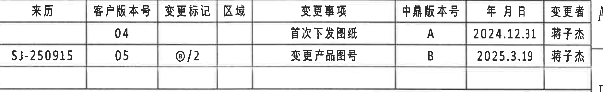

- 原图位置/视图名称：页面上方右侧 B 区附近，bbox `[2940, 145, 1860, 285]`。

| 来历 | 客户版本号 | 变更标记 | 区域 | 变更事项 | 中鼎版本号 | 年月日 | 变更者 |
|---|---|---|---|---|---|---|---|
|  | 04 |  |  | 首次下发图纸 | A | 2024.12.31 | 蒋子杰 |
| SJ-250915 | 05 | @/2 |  | 变更产品图号 | B | 2025.3.19 | 蒋子杰 |

| 提取项 | 原图数值或文本 | 含义说明 |
|---|---|---|
| 客户版本号 | 04、05 | 客户版本历史；05 为当前较新行。 |
| 中鼎版本号 | A、B | 中鼎内部版本号。 |
| 变更标记 | @/2 | 第二条修订记录的变更标记。 |
| 变更事项 | 首次下发图纸；变更产品图号 | 图纸发放与产品图号变更记录。 |
| 年月日 | 2024.12.31；2025.3.19 | 修订记录日期。 |
| 变更者 | 蒋子杰 | 两条记录的变更者。 |

边界归属说明：裁切到修订履历外框，左侧包含第二行 `SJ-250915`，右侧未纳入图框坐标字母 A/B。

## object_2 - 上方变体参数表 / table

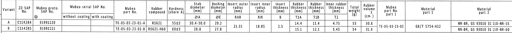

- 原图位置/视图名称：页面上方横向参数表，bbox `[360, 435, 4370, 285]`。

| Variant | ZD SAP No. | Mubea proto. SAP No. | Mubea serial SAP No. without coating | Mubea serial SAP No. with coating | Mubea part No. | Rubber compound | Hardness (shore A) | Stab diameter ØA (mm) | Bushing diameter ØE (mm) | Insert outer radius RAR (mm) | Insert inner radius RIR (mm) | Insert thickness B (mm) | Rubber thickness T1A (mm) | Rubber thickness T1B (mm) | Inner rubber thickness T2 (mm) | Total weight (g) | Rubber volume (cm^3) | Mubea part No. part 1 | Material part 1 | Material part 2 |
|---|---|---|---|---|---|---|---|---|---|---|---|---|---|---|---|---:|---:|---|---|---|
| A | C114284 | 91991220 |  |  | TE-05-03-23-01-A | R5621 | 55±3 | 30.4-30.0 | 29.2 | 21.35 | 18.85 | 2.5 | 14.4 | 11.4 | 4.75 | 53 | 30.8 | TE-05-03-23-02 | GB/T 5754-H22 | NR-BR, GS 93010 31 110-NR-55 |
| B | C114285 | 91991221 |  |  | TE-05-03-23-01-B | R5621-H60 | 60±3 | 28.8 | 27.8 |  |  |  | 15.1 | 12.1 | 5.45 | 54 | 31.9 | TE-05-03-23-02 | GB/T 5754-H22 | NR-BR, GS 93010 31 110-NR-60 |

| 提取项 | 原图数值或文本 | 含义说明 |
|---|---|---|
| Variant | A、B | 两个变体行。 |
| ØA | A: 30.4-30.0；B: 28.8 | 稳定杆杆径，右视图标注 `Stabilizer diameter (see table)` 引用该列。 |
| ØE | A: 29.2；B: 27.8 | 衬套直径，左视图 `ØE±0.3` 引用该列。 |
| RAR | 21.35 | Insert outer radius，A-A 剖面 `(RAR)` 引用该列；表格中跨两行显示，为共用值。 |
| RIR | 18.85 | Insert inner radius，A-A 剖面 `(RIR)` 引用该列；表格中跨两行显示，为共用值。 |
| B | 2.5 | Insert thickness，B-B 剖面顶部 `(B)` 引用该列；表格中跨两行显示，为共用值。 |
| T1A/T1B/T2 | A: 14.4/11.4/4.75；B: 15.1/12.1/5.45 | B-B 剖面 `T1A±0.3`、`T1B±0.3`、`T2±0.3` 对应的表驱动厚度。 |
| Hardness | A: 55±3；B: 60±3 | 橡胶硬度 shore A。 |
| Material | GB/T 5754-H22；NR-BR, GS 93010 31 110-NR-55/NR-60 | 金属件与橡胶材料规范。 |

边界归属说明：裁切只包含参数表本体；下方主视图的 `42.6±0.3` 不属于本表，未作为表格内容提取。

## object_3 - 左侧加工视图 / view

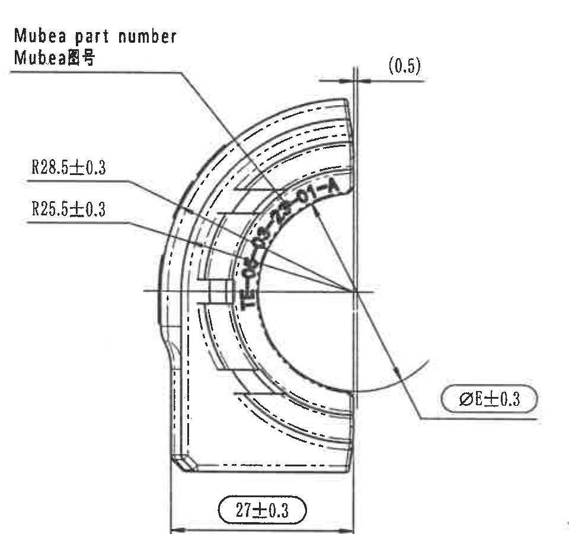

- 原图位置/视图名称：页面中部左侧 D-F 区，bbox `[460, 820, 960, 900]`。

| 提取项 | 原图数值或文本 | 含义说明 |
|---|---|---|
| 引出标注 | Mubea part number / Mubea图号 | 指向弧形件表面 Mubea 图号位置。 |
| 外弧半径 | R28.5±0.3 | 外侧弧形轮廓半径，带 ±0.3 公差。 |
| 内弧半径 | R25.5±0.3 | 内侧弧形轮廓半径，带 ±0.3 公差。 |
| 参考尺寸 | (0.5) | 括号内参考尺寸，位于视图右上窄边处，仅作为参考信息，不能忽略。 |
| 衬套直径符号 | ØE±0.3 | 带直径符号和 ±0.3 公差；具体 ØE 数值见参数表 A=29.2、B=27.8。 |
| 底部宽度 | 27±0.3 | 底部水平尺寸，图中以圆圈标识，为检验尺寸。 |

边界归属说明：`ØE±0.3` 的引线和文字完整包含；裁切右边界未提取中间主视图的 `ZD Logo`、`Variant letter` 内容。

## object_4 - 中间主视图 / view

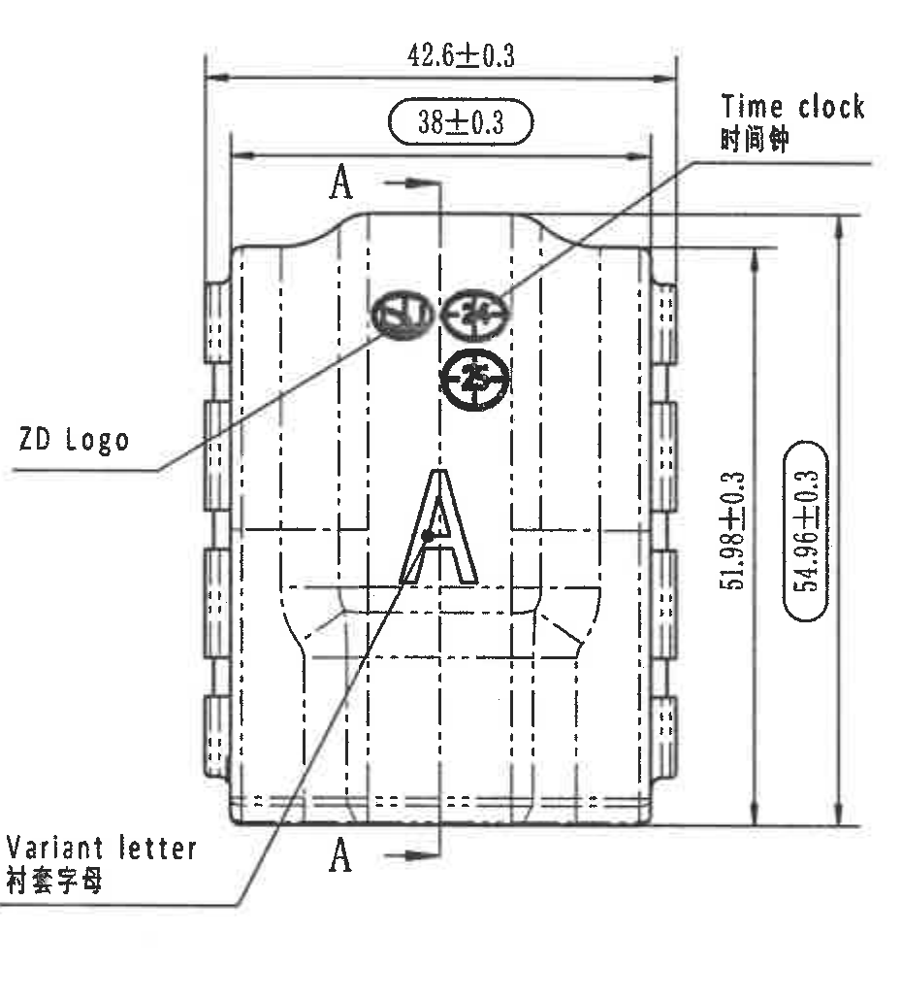

- 原图位置/视图名称：页面中部 D-F 区中心，bbox `[1420, 770, 930, 1030]`。

| 提取项 | 原图数值或文本 | 含义说明 |
|---|---|---|
| 上方外宽 | 42.6±0.3 | 主视图上方外侧总宽度尺寸。 |
| 上方内宽 | 38±0.3 | 主视图上方内侧尺寸，圆圈标识为检验尺寸。 |
| 剖切标识 | A / A-A | 两处 A 与箭头定义 A-A 剖面位置。 |
| 右侧高度 | 51.98±0.3 | 主视图右侧较短竖向高度尺寸。 |
| 右侧总高度 | 54.96±0.3 | 主视图右侧总高度，圆圈标识为检验尺寸。 |
| 引出标注 | Time clock / 时间钟 | 指出时间钟压印位置。 |
| 引出标注 | ZD Logo | 指出 ZD Logo 位置。 |
| 引出标注 | Variant letter / 衬套字母 | 指出变体字母位置。 |

边界归属说明：右侧相邻 A-A 剖面中的 `(0.5)` 已排除，不归入主视图；主视图左侧和左下引线完整保留。

## object_5 - A-A 剖面视图 / section

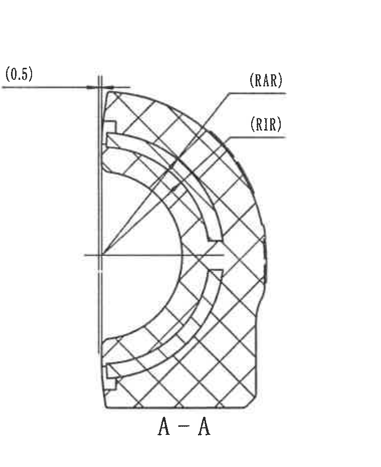

- 原图位置/视图名称：主视图右侧的 A-A 剖面，bbox `[2450, 810, 760, 930]`。

| 提取项 | 原图数值或文本 | 含义说明 |
|---|---|---|
| 剖面名称 | A-A | 对应主视图 A-A 剖切线。 |
| 参考尺寸 | (0.5) | 括号参考尺寸，位于剖面左上边界处。 |
| 外嵌件弧半径 | (RAR) | Insert outer radius 符号尺寸；具体值来自参数表 RAR=21.35。 |
| 内嵌件弧半径 | (RIR) | Insert inner radius 符号尺寸；具体值来自参数表 RIR=18.85。 |
| 剖面填充 | 交叉剖面线 | 表示剖切材料区域。 |

边界归属说明：该裁切只提取 A-A 剖面图及其 `(0.5)`、`(RAR)`、`(RIR)` 标注；不提取主视图或 B-B 剖面尺寸。

## object_6 - B-B 剖面视图 / section

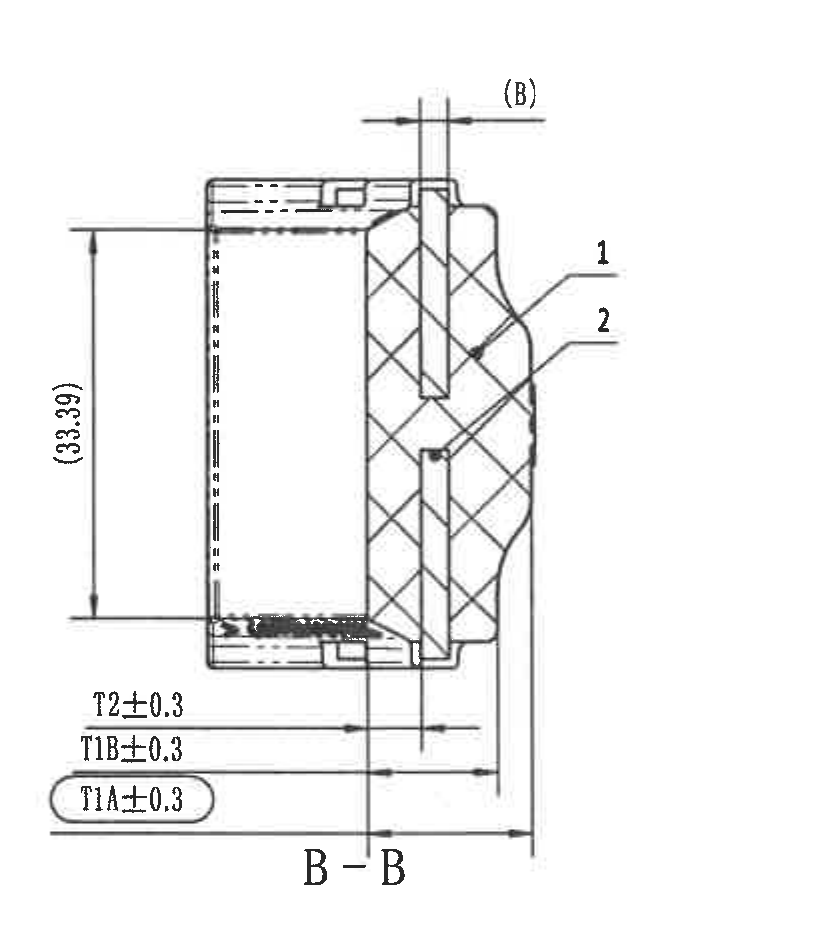

- 原图位置/视图名称：页面中部右侧 B-B 剖面，bbox `[3180, 810, 840, 940]`。

| 提取项 | 原图数值或文本 | 含义说明 |
|---|---|---|
| 剖面名称 | B-B | 对应右侧加工视图中的 B-B 剖切线。 |
| 顶部参考 | (B) | 括号参考/符号尺寸，对应参数表 Insert thickness B=2.5。 |
| 左侧参考高度 | (33.39) | 括号参考尺寸，位于剖面左侧竖向尺寸线上。 |
| 引出序号 | 1 | 指向剖面中的部件 1，对应明细表序号 1 橡胶 Rubber。 |
| 引出序号 | 2 | 指向剖面中的部件 2，对应明细表序号 2 铝骨架 Al inlay。 |
| 厚度 | T2±0.3 | 内橡胶厚度符号尺寸；具体值见参数表 A=4.75、B=5.45。 |
| 厚度 | T1B±0.3 | 橡胶厚度符号尺寸；具体值见参数表 A=11.4、B=12.1。 |
| 厚度 | T1A±0.3 | 橡胶厚度符号尺寸；圆圈标识为检验尺寸；具体值见参数表 A=14.4、B=15.1。 |

边界归属说明：左下厚度尺寸线、箭头和文字完整包含；右侧加工视图中的 B-B 剖切标识归 object_7，不在本剖面对象中重复提取。

## object_7 - 右侧加工视图 / view

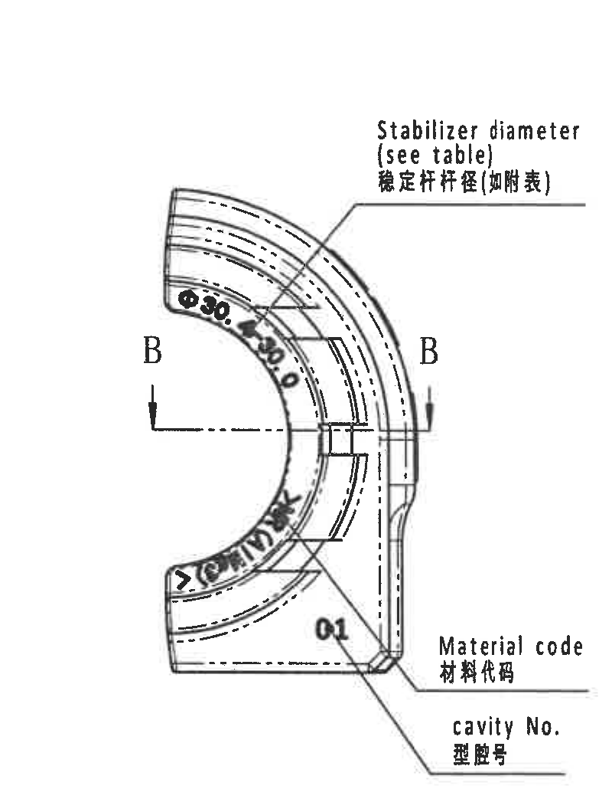

- 原图位置/视图名称：页面中部最右侧 D-G 区，bbox `[3920, 800, 800, 1030]`。

| 提取项 | 原图数值或文本 | 含义说明 |
|---|---|---|
| 稳定杆杆径 | Stabilizer diameter (see table) / 稳定杆杆径(如附表) | 引线指向内弧区域，具体数值引用参数表 ØA：A=30.4-30.0，B=28.8。 |
| 剖切标识 | B / B-B | 定义 B-B 剖面位置，实际剖面尺寸见 object_6。 |
| 材料代码 | Material code / 材料代码 | 指向零件底部材料代码区域，图中可见 `01`。 |
| 型腔号 | cavity No. / 型腔号 | 指向型腔号标记区域。 |
| 外观文字 | Ø30...、GERMANY 等 | 弧形内侧压印文字，作为外观/标识信息。 |

边界归属说明：右侧图框坐标 D/E/F/G 已裁除；本对象包含 B-B 剖切位置，但不包含 B-B 剖面中的 `T1A/T1B/T2` 尺寸。

## object_8 - Specification 技术要求 / notes

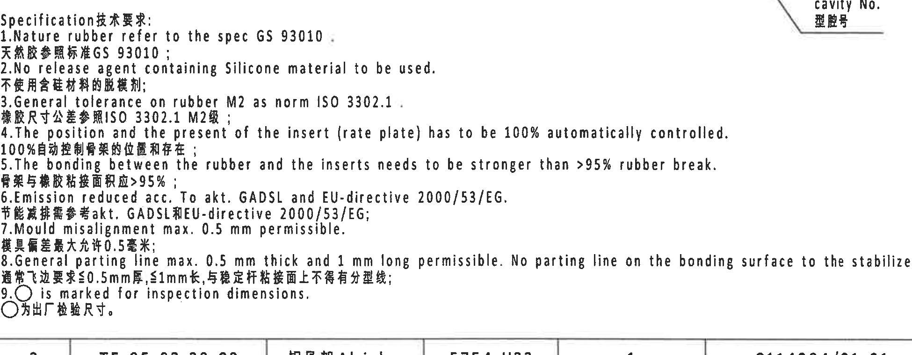

- 原图位置/视图名称：页面中下部右侧 Notes 区域，bbox `[2770, 1740, 1950, 760]`。

| 提取项 | 原图数值或文本 | 含义说明 |
|---|---|---|
| 标题 | Specification技术要求: | 技术要求标题。 |
| 1 | Nature rubber refer to the spec GS 93010. / 天然胶参照标准 GS 93010; | 天然胶材料标准。 |
| 2 | No release agent containing Silicone material to be used. / 不使用含硅材料的脱模剂; | 脱模剂限制。 |
| 3 | General tolerance on rubber M2 as norm ISO 3302.1. / 橡胶尺寸公差参照 ISO 3302.1 M2级; | 橡胶通用公差依据，详见 object_9。 |
| 4 | The position and the present of the insert (rate plate) has to be 100% automatically controlled. / 100%自动控制骨架的位置和存在; | 嵌件/骨架存在和位置需 100% 自动控制。 |
| 5 | The bonding between the rubber and the inserts needs to be stronger than >95% rubber break. / 骨架与橡胶粘接面积应 >95%; | 粘接强度/橡胶破坏率要求。 |
| 6 | Emission reduced acc. To akt. GADSL and EU-directive 2000/53/EG. / 节能减排需参考 akt. GADSL 和 EU-directive 2000/53/EG; | 排放/法规要求。 |
| 7 | Mould misalignment max. 0.5 mm permissible. / 模具偏差最大允许 0.5 毫米; | 模具错位允许值。 |
| 8 | General parting line max. 0.5 mm thick and 1 mm long permissible. No parting line on the bonding surface to the stabilizer. / 通常飞边要求≤0.5mm厚, ≤1mm长, 与稳定杆粘接面上不得有分型线; | 飞边/分型线要求。 |
| 9 | ○ is marked for inspection dimensions. / ○为出厂检验尺寸。 | 圆圈标注的尺寸为检验尺寸。 |

边界归属说明：Notes 文本 1-9 完整包含；右上角靠近右视图 `cavity No.` 引线尾端，不作为 Notes 内容提取。

## object_9 - DIN ISO 3302-1 M2 class 公差表 / table

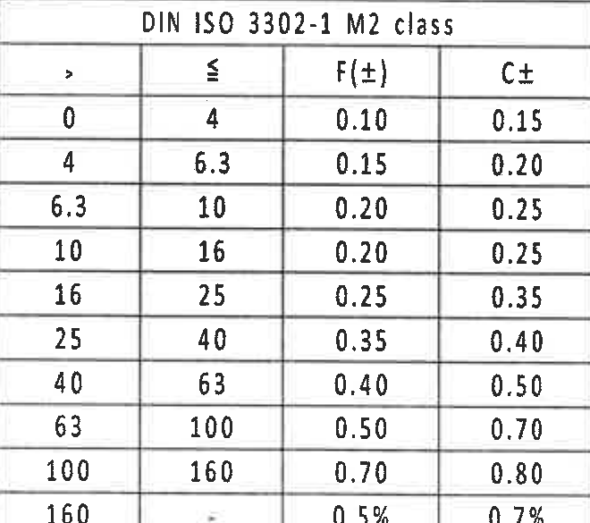

- 原图位置/视图名称：页面左下角公差表，bbox `[370, 2710, 660, 585]`。

| > | ≤ | F(±) | C± |
|---:|---:|---:|---:|
| 0 | 4 | 0.10 | 0.15 |
| 4 | 6.3 | 0.15 | 0.20 |
| 6.3 | 10 | 0.20 | 0.25 |
| 10 | 16 | 0.20 | 0.25 |
| 16 | 25 | 0.25 | 0.35 |
| 25 | 40 | 0.35 | 0.40 |
| 40 | 63 | 0.40 | 0.50 |
| 63 | 100 | 0.50 | 0.70 |
| 100 | 160 | 0.70 | 0.80 |
| 160 | - | 0.5% | 0.7% |

| 提取项 | 原图数值或文本 | 含义说明 |
|---|---|---|
| 表题 | DIN ISO 3302-1 M2 class | Notes 第 3 条引用的橡胶通用公差等级。 |
| F/C 公差 | 见上表 | 按尺寸范围选择 F(±) 和 C±。 |

边界归属说明：裁切到表格外框，底部图框坐标数字未作为表格内容提取。

## object_10 - 立体局部视图 / detail

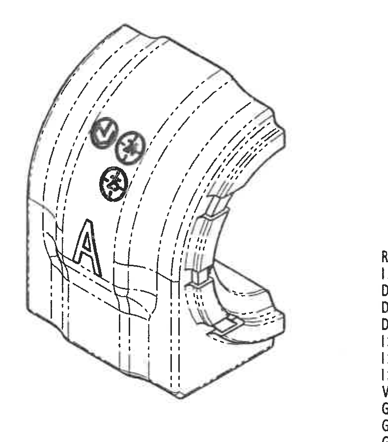

- 原图位置/视图名称：页面下部中间立体外观图，bbox `[1580, 2220, 790, 900]`。

| 提取项 | 原图数值或文本 | 含义说明 |
|---|---|---|
| 外观 | 三维/立体局部视图 | 展示零件整体弧形、底座和侧向结构。 |
| 标识 | ZD Logo、Time clock、Variant letter A | 与主视图中的 ZD Logo、时间钟、变体字母位置对应。 |
| 尺寸 | 无独立尺寸数值 | 本局部视图没有尺寸线、公差、角度或半径标注。 |

边界归属说明：裁切不包含右侧 Reference 清单或下方标题栏；仅提取立体视图自身的标识和外观信息。

## object_11 - Reference 参考标准清单 / notes

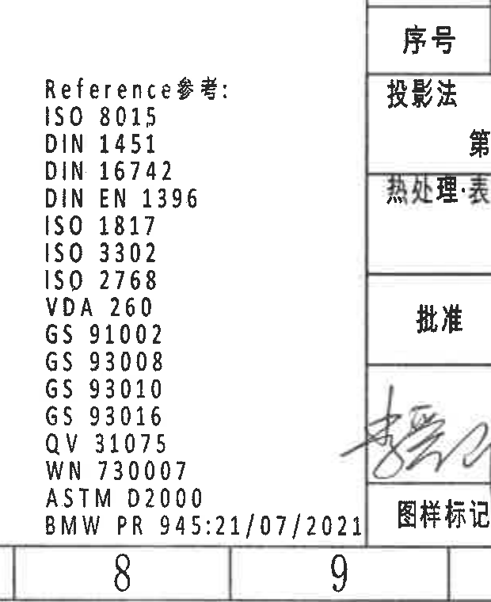

- 原图位置/视图名称：页面下部中右参考清单，bbox `[2300, 2630, 620, 760]`。

| 提取项 | 原图数值或文本 | 含义说明 |
|---|---|---|
| 标题 | Reference参考: | 参考标准清单标题。 |
| 标准 | ISO 8015 | 参考标准。 |
| 标准 | DIN 1451 | 参考标准。 |
| 标准 | DIN 16742 | 参考标准。 |
| 标准 | DIN EN 1396 | 参考标准。 |
| 标准 | ISO 1817 | 参考标准。 |
| 标准 | ISO 3302 | 参考标准。 |
| 标准 | ISO 2768 | 参考标准。 |
| 标准 | VDA 260 | 参考标准。 |
| 标准 | GS 91002 | 参考标准。 |
| 标准 | GS 93008 | 参考标准。 |
| 标准 | GS 93010 | 参考标准。 |
| 标准 | GS 93016 | 参考标准。 |
| 标准 | QV 31075 | 参考标准。 |
| 标准 | WN 730007 | 参考标准。 |
| 标准 | ASTM D2000 | 参考标准。 |
| 标准 | BMW PR 945:21/07/2021 | 参考标准。 |

边界归属说明：左侧标题和所有标准号完整包含；为保留长标准号 `BMW PR 945:21/07/2021` 和底部行，右侧带入标题栏边线和局部字段片段，这些不作为清单内容提取。

## object_12 - 零件明细表、投影法与产品号区域 / table

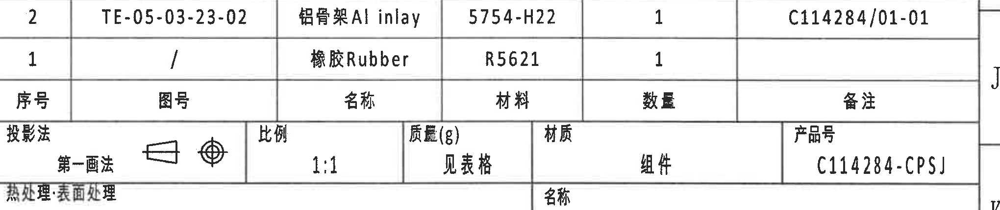

- 原图位置/视图名称：页面右下标题栏上部，bbox `[2775, 2475, 2040, 430]`。

| 序号 | 图号 | 名称 | 材料 | 数量 | 备注 |
|---:|---|---|---|---:|---|
| 2 | TE-05-03-23-02 | 铝骨架 Al inlay | 5754-H22 | 1 | C114284/01-01 |
| 1 | / | 橡胶 Rubber | R5621 | 1 |  |

| 字段 | 原图数值或文本 | 含义说明 |
|---|---|---|
| 投影法 | 第一画法 | 投影方法，图中带第一角法符号。 |
| 比例 | 1:1 | 图纸比例。 |
| 质量(g) | 见表格 | 质量从上方参数表 Total weight 读取。 |
| 材质 | 组件 | 该图纸对象为组件。 |
| 产品号 | C114284-CPSJ | 产品号字段。 |
| 热处理/表面处理 | 空白 | 原图此栏未填写具体值。 |

边界归属说明：BOM 序号 1/2 与 B-B 剖面引出序号对应；本裁切到热处理/表面处理行结束，下方签核和名称/图号标题栏归 object_13。

## object_13 - 标题栏、签核栏与图号区域 / title_block

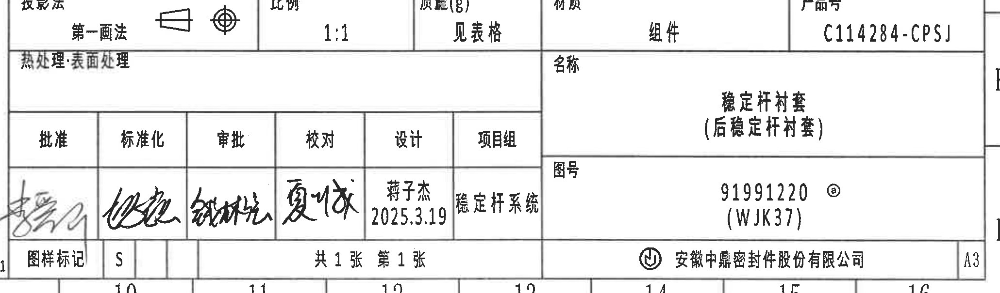

- 原图位置/视图名称：页面右下角标题栏，bbox `[2745, 2745, 2060, 605]`。

| 字段 | 原图数值或文本 | 含义说明 |
|---|---|---|
| 签核栏 | 批准、标准化、审批、校对、设计、项目组 | 签核角色列。 |
| 设计 | 蒋子杰 2025.3.19 | 设计人员和日期。 |
| 项目组 | 稳定杆系统 | 项目组名称。 |
| 图样标记 | S | 图样标记字段。 |
| 页数 | 共 1 张 第 1 张 | 总页数和当前页。 |
| 名称 | 稳定杆衬套（后稳定杆衬套） | 产品名称。 |
| 图号 | 91991220 @ (WJK37) | 图纸/产品图号字段。 |
| 公司 | 安徽中鼎密封件股份有限公司 | 图纸发布公司。 |
| 幅面 | A3 | 图纸幅面。 |

边界归属说明：上方零件明细、投影法、比例和产品号归 object_12；底部图框坐标数字未作为标题栏字段提取。

## 裁切检查记录

| 对象 | 图片路径 | 检查结果 | 边界/归属处理 |
|---|---|---|---|
| object_1 | `outputs/20C114284_assets/images/object_1.png` | 完整包含修订履历表所有表头、两条记录和外框。 | 去除了右侧图框坐标；第二行 `SJ-250915` 完整。 |
| object_2 | `outputs/20C114284_assets/images/object_2.png` | 完整包含上方参数表表头、两行变体和右端材料列。 | 下方主视图尺寸未纳入表格内容。 |
| object_3 | `outputs/20C114284_assets/images/object_3.png` | 完整包含左视图尺寸线、箭头、`R28.5±0.3`、`R25.5±0.3`、`(0.5)`、`ØE±0.3`、`27±0.3`。 | 排除了主视图的 ZD Logo/Variant letter 内容。 |
| object_4 | `outputs/20C114284_assets/images/object_4.png` | 完整包含主视图尺寸线、上/右尺寸文字和引出标注。 | 排除了 A-A 剖面的 `(0.5)`，避免归属混淆。 |
| object_5 | `outputs/20C114284_assets/images/object_5.png` | 完整包含 A-A 剖面、剖面名、`(0.5)`、`(RAR)`、`(RIR)` 引线。 | 不含主视图高度尺寸和 B-B 剖面尺寸。 |
| object_6 | `outputs/20C114284_assets/images/object_6.png` | 完整包含 B-B 剖面、`(B)`、`(33.39)`、`T2/T1B/T1A±0.3` 和序号 1/2。 | 左下 `T1A±0.3` 增加余量后未截断；B-B 剖切位置归 object_7。 |
| object_7 | `outputs/20C114284_assets/images/object_7.png` | 完整包含右视图、B-B 剖切标识和三条文字引线。 | 右侧图框坐标 D/E/F/G 已裁除；剖面尺寸归 object_6。 |
| object_8 | `outputs/20C114284_assets/images/object_8.png` | 完整包含 Specification/技术要求第 1-9 条。 | 右上角相邻视图引线尾端不作为 Notes 内容提取。 |
| object_9 | `outputs/20C114284_assets/images/object_9.png` | 完整包含 DIN ISO 3302-1 M2 class 表题、表头和 10 行公差。 | 底部图框坐标数字已裁除。 |
| object_10 | `outputs/20C114284_assets/images/object_10.png` | 完整包含立体视图外轮廓和标识图案。 | 无尺寸线；未混入 Reference 清单。 |
| object_11 | `outputs/20C114284_assets/images/object_11.png` | 完整包含 Reference 标题和 ISO/WN/ASTM/BMW 标准号列表。 | 为保留长标准号，右侧带入标题栏片段但不提取；底部标准号未截断。 |
| object_12 | `outputs/20C114284_assets/images/object_12.png` | 完整包含 BOM 表、投影法、比例、质量、材质、产品号、热处理/表面处理行。 | 下方签核/标题栏分配到 object_13。 |
| object_13 | `outputs/20C114284_assets/images/object_13.png` | 完整包含签核栏、名称、图号、公司、页数、图样标记和 A3。 | 上方 BOM/投影法分配到 object_12；底部图框坐标未作为字段提取。 |
