# 20C114285 PDF 内容识别

整页渲染图：`outputs/20C114285_assets/images/page_1.png`  
页面尺寸：4959 x 3505 px。以下 bbox 均为整页 PNG 坐标，格式为 `[x, y, width, height]`。

## object_1 修订履历表

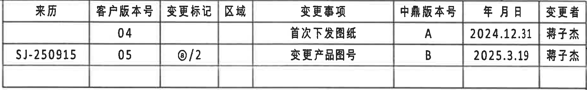

原图位置/视图名称：页面上方右侧修订履历表，bbox `[2920, 145, 1840, 285]`。

原表行列还原：

| 来历 | 客户版本号 | 变更标记 | 区域 | 变更事项 | 中鼎版本号 | 年月日 | 变更者 |
|---|---:|---|---|---|---|---|---|
|  | 04 |  |  | 首次下发图纸 | A | 2024.12.31 | 蒋子杰 |
| SJ-250915 | 05 | @/2 |  | 变更产品图号 | B | 2025.3.19 | 蒋子杰 |

提取表格：

| 提取项 | 原图数值或文本 | 含义说明 |
|---|---|---|
| 客户版本号 | 04, 05 | 两条修订版本记录。 |
| 变更标记 | @/2 | 第二条变更标记，指向图纸标注的变更记号。 |
| 变更事项 | 首次下发图纸；变更产品图号 | 记录图纸发放和产品图号变更。 |
| 中鼎版本号 | A, B | 内部版本号。 |
| 日期 | 2024.12.31；2025.3.19 | 修订日期。 |
| 变更者 | 蒋子杰 | 两条记录均为同一变更者。 |

边界归属说明：该裁切只提取修订履历表内文字和表格线；右侧坐标字母 A/B 是图框坐标，不计入表内容。

## object_2 产品规格参数表

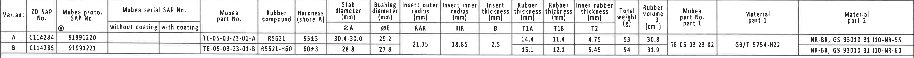

原图位置/视图名称：页面上方横向规格参数表，bbox `[365, 445, 4395, 285]`。

原表行列还原：

| Variant | ZD SAP No. | Mubea proto. SAP No. | Mubea serial SAP No. without coating | Mubea serial SAP No. with coating | Mubea part No. | Rubber compound | Hardness (shore A) | Stab diameter (mm) ØA | Bushing diameter (mm) ØE | Insert outer radius (mm) RAR | Insert inner radius (mm) RIR | Insert thickness (mm) B | Rubber thickness (mm) T1A | Rubber thickness (mm) T1B | Inner rubber thickness (mm) T2 | Total weight (g) | Rubber volume (cm³) | Mubea part No. part 1 | Material part 1 | Material part 2 |
|---|---|---|---|---|---|---|---|---|---|---|---|---|---|---|---|---:|---:|---|---|---|
| A | C114284 | 91991220 |  |  | TE-05-03-23-01-A | R5621 | 55±3 | 30.4-30.0 | 29.2 | 21.35 | 18.85 | 2.5 | 14.4 | 11.4 | 4.75 | 53 | 30.8 | TE-05-03-23-02 | GB/T 5754-H22 | NR-BR, GS 93010 31 110-NR-55 |
| B | C114285 | 91991221 |  |  | TE-05-03-23-01-B | R5621-H60 | 60±3 | 28.8 | 27.8 | 21.35 | 18.85 | 2.5 | 15.1 | 12.1 | 5.45 | 54 | 31.9 | TE-05-03-23-02 | GB/T 5754-H22 | NR-BR, GS 93010 31 110-NR-60 |

提取表格：

| 提取项 | 原图数值或文本 | 含义说明 |
|---|---|---|
| Variant A | C114284 / 91991220 / TE-05-03-23-01-A | A 变型对应的客户号、SAP号和 Mubea 件号。 |
| Variant B | C114285 / 91991221 / TE-05-03-23-01-B | B 变型对应本图纸产品号。 |
| 硬度 | A: 55±3；B: 60±3 | 橡胶 shore A 硬度公差。 |
| ØA | A: 30.4-30.0；B: 28.8 | 稳定杆杆径，右视图“Stabilizer diameter (see table)”引用该列。 |
| ØE | A: 29.2；B: 27.8 | 衬套直径，左视图以 `ØE±0.3` 形式引用。 |
| RAR | 21.35 | Insert outer radius，A-A 剖面以 RAR 标出。 |
| RIR | 18.85 | Insert inner radius，A-A 剖面以 RIR 标出。 |
| B | 2.5 | Insert thickness，B-B 剖面以 `(B)` 参考标出。 |
| T1A/T1B/T2 | A: 14.4/11.4/4.75；B: 15.1/12.1/5.45 | B-B 剖面三条厚度尺寸线引用这些表格值，并在视图中给出 ±0.3 公差。 |
| 总重/橡胶体积 | A: 53 g / 30.8 cm³；B: 54 g / 31.9 cm³ | 产品质量与橡胶体积。 |

边界归属说明：该对象只提取规格参数表行列。表格下方的加工视图尺寸不归入本对象；表格内 RAR、RIR、B、T1A、T1B、T2 是后续剖视图标注的数值来源。

## object_3 左侧加工视图

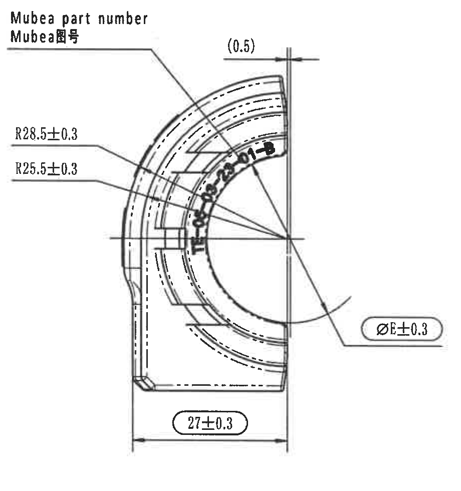

原图位置/视图名称：左侧半环加工视图，bbox `[480, 835, 920, 980]`。

提取表格：

| 提取项 | 原图数值或文本 | 含义说明 |
|---|---|---|
| Mubea part number | Mubea part number / Mubea图号 | 引线指向内弧印字区域，表示 Mubea 图号/零件号位置。 |
| R28.5±0.3 | R28.5±0.3 | 外侧弧形半径尺寸，公差 ±0.3。 |
| R25.5±0.3 | R25.5±0.3 | 内侧相邻弧形半径尺寸，公差 ±0.3。 |
| (0.5) | (0.5) | 括号内参考尺寸，位于上端靠右，表示参考间隙/局部距离；括号说明该值为参考尺寸，不作为独立检验公差尺寸。 |
| ØE±0.3 | ØE±0.3 | 衬套直径尺寸，数值 E 来自规格表：A 为 29.2，B 为 27.8；视图给出 ±0.3 公差。该标注有检查尺寸圈。 |
| 27±0.3 | 27±0.3 | 底部宽度尺寸，公差 ±0.3。该标注有检查尺寸圈。 |
| 弧向/角度 | 未见独立角度标注 | 本裁切中可见弧线半径 R28.5/R25.5，无单独角度数值。 |
| 星号关键尺寸 | 未见星号 | 本裁切未发现带 `*` 的关键尺寸。 |

边界归属说明：右侧边界保留了 `ØE±0.3` 与 `27±0.3` 的完整尺寸线、箭头和文字；未提取相邻主视图中的 `ZD Logo`、`Variant letter` 等标注。

## object_4 主视图

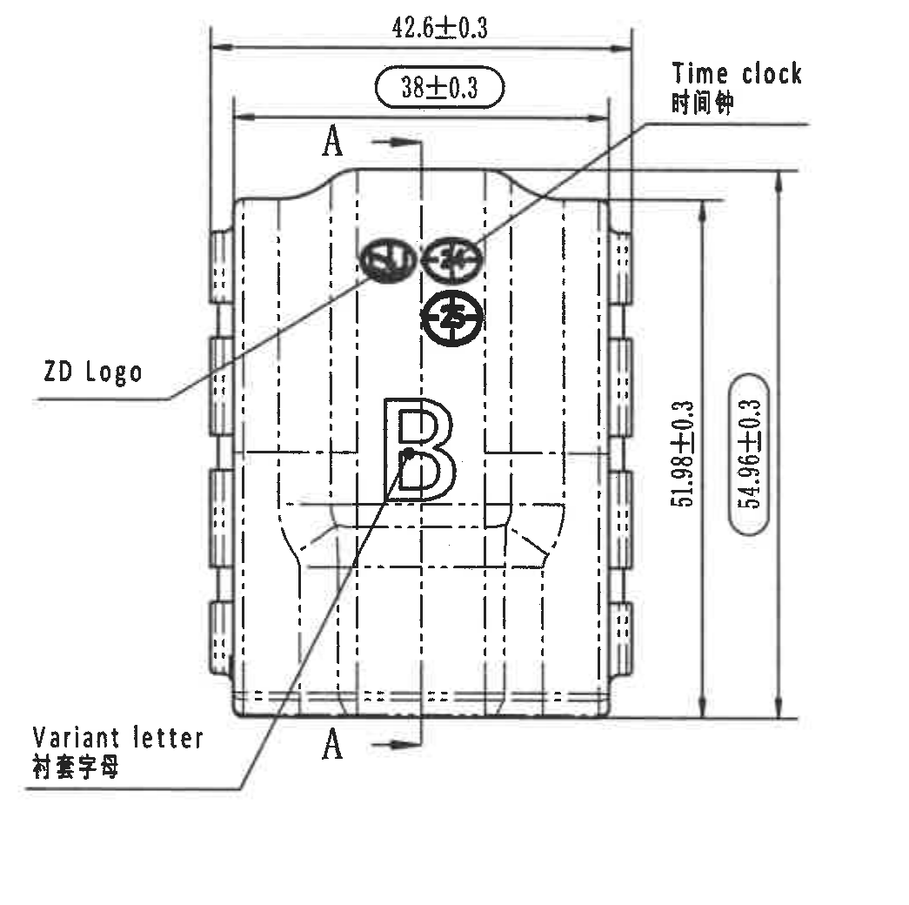

原图位置/视图名称：中部主视图/正视图，bbox `[1385, 795, 1045, 1040]`。

提取表格：

| 提取项 | 原图数值或文本 | 含义说明 |
|---|---|---|
| 42.6±0.3 | 42.6±0.3 | 顶部总宽度尺寸，公差 ±0.3。 |
| 38±0.3 | 38±0.3 | 顶部内侧宽度尺寸，公差 ±0.3；带检查尺寸圈。 |
| 51.98±0.3 | 51.98±0.3 | 右侧内侧高度尺寸，公差 ±0.3。 |
| 54.96±0.3 | 54.96±0.3 | 右侧总高度尺寸，公差 ±0.3；带检查尺寸圈。 |
| A-A 剖切 | A / A | 两处 A 字母和箭头定义 A-A 剖面位置，对应 object_5。 |
| Time clock | Time clock / 时间钟 | 引线指向顶部时间钟标识。 |
| ZD Logo | ZD Logo | 引线指向 ZD Logo 位置。 |
| Variant letter | Variant letter / 衬套字母 | 引线指向大写 `B` 变型字母位置。 |
| 参考尺寸/角度/星号 | 未见括号参考尺寸、角度或星号关键尺寸 | 主视图内未发现独立括号参考尺寸、角度尺寸或 `*` 标识。 |

边界归属说明：左侧边界为保留 `ZD Logo` 与 `Variant letter` 引线而扩大；未包含左侧加工视图的 `ØE±0.3` 或 `27±0.3` 尺寸。右侧高度尺寸线完整保留。

## object_5 A-A 剖面视图

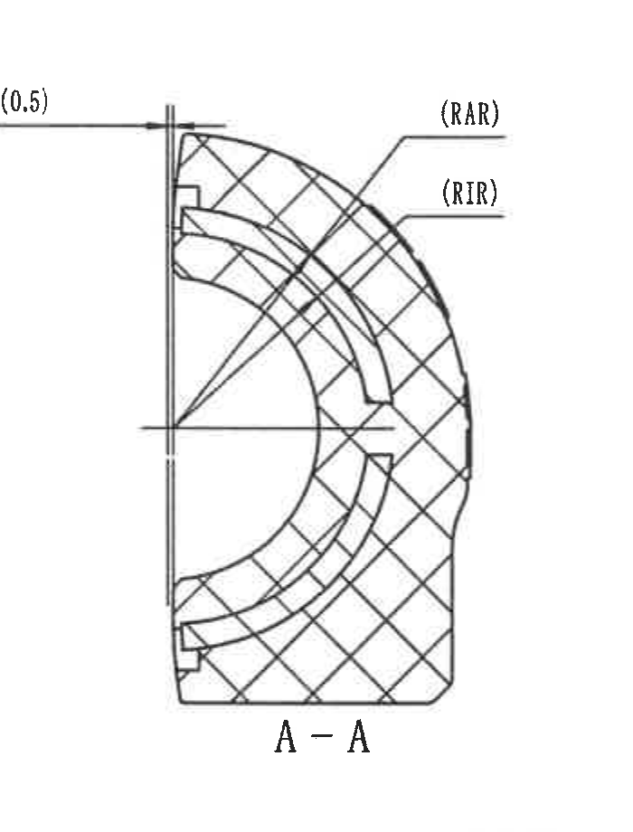

原图位置/视图名称：A-A 剖面视图，bbox `[2455, 845, 700, 920]`。

提取表格：

| 提取项 | 原图数值或文本 | 含义说明 |
|---|---|---|
| 剖面名称 | A-A | 对应主视图 A-A 剖切位置。 |
| (0.5) | (0.5) | 括号内参考尺寸，位于左上，表示剖面上端局部参考间隙/距离。 |
| RAR | (RAR) | Insert outer radius，数值来自规格表：21.35 mm。 |
| RIR | (RIR) | Insert inner radius，数值来自规格表：18.85 mm。 |
| 剖面线 | 交叉剖面填充 | 表示剖切实体材料区域。 |
| 弧向尺寸 | RAR/RIR | 该剖面以代号形式标注弧向半径，数值在 object_2 表中。 |
| 星号关键尺寸/角度 | 未见星号或角度 | 本剖面未发现带 `*` 的关键尺寸或角度尺寸。 |

边界归属说明：左上 `(0.5)` 的尺寸线和文字完整保留；右侧仅包含 RAR/RIR 引线和文字，不提取相邻 B-B 剖面内容。

## object_6 B-B 剖面视图

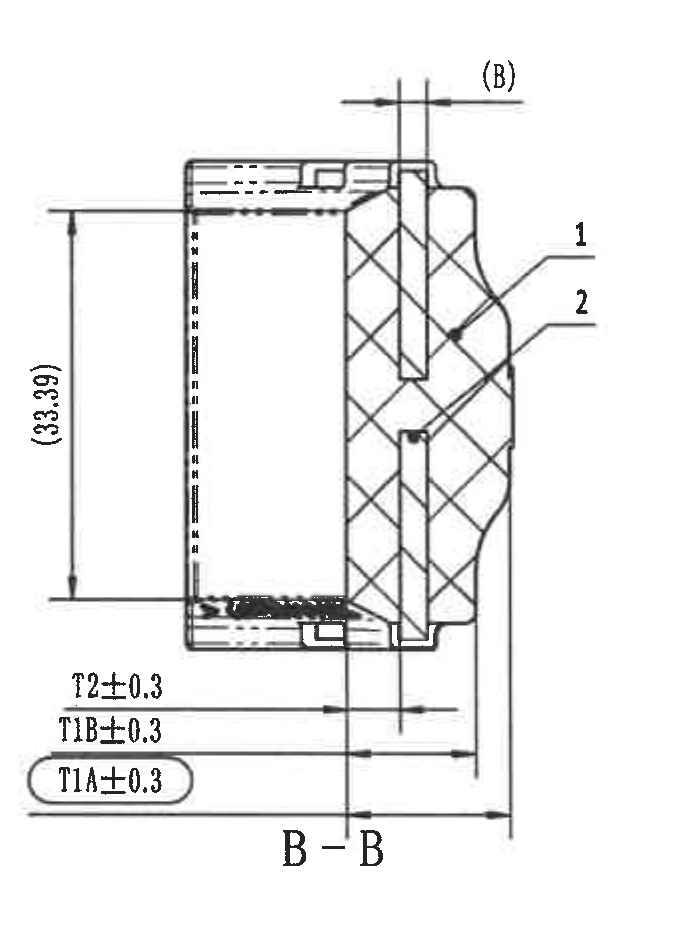

原图位置/视图名称：B-B 剖面视图，bbox `[3195, 830, 690, 945]`。

提取表格：

| 提取项 | 原图数值或文本 | 含义说明 |
|---|---|---|
| 剖面名称 | B-B | 对应右侧视图 B-B 剖切位置。 |
| (B) | (B) | 括号内参考尺寸，指向表格中的 Insert thickness `B=2.5 mm`，为参考标注。 |
| (33.39) | (33.39) | 括号内参考高度尺寸，位于左侧竖向尺寸线，表示剖面内高度参考值。 |
| T2±0.3 | T2±0.3 | 内橡胶厚度尺寸线，数值来自表格：A 为 4.75，B 为 5.45，公差 ±0.3。 |
| T1B±0.3 | T1B±0.3 | 橡胶厚度尺寸线，数值来自表格：A 为 11.4，B 为 12.1，公差 ±0.3。 |
| T1A±0.3 | T1A±0.3 | 橡胶厚度尺寸线，数值来自表格：A 为 14.4，B 为 15.1，公差 ±0.3；带检查尺寸圈。 |
| 1 | 1 | 零件序号引线，指向 BOM 中序号 1 橡胶 Rubber。 |
| 2 | 2 | 零件序号引线，指向 BOM 中序号 2 铝骨架 Al inlay。 |
| 星号关键尺寸/角度 | 未见星号或角度 | 本剖面未发现带 `*` 的关键尺寸或角度尺寸。 |

边界归属说明：底部三条 T 尺寸线、左侧 `(33.39)`、顶部 `(B)` 均完整保留。右侧仅包含本剖面的零件序号 1/2 引线，不归入右侧半环视图。

## object_7 右侧加工视图

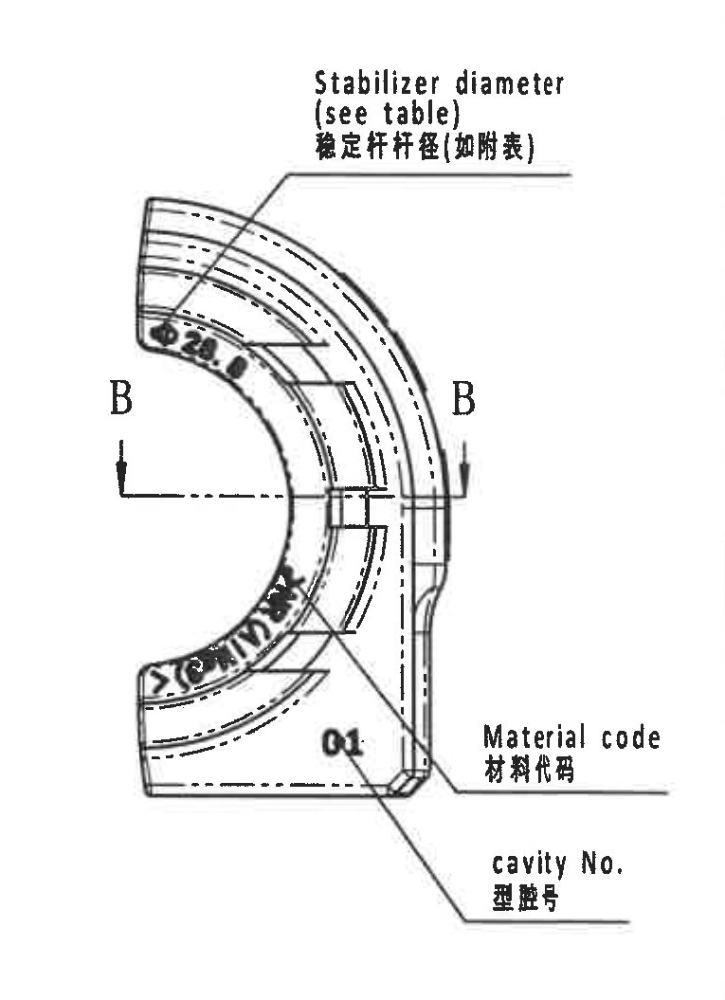

原图位置/视图名称：右侧半环加工视图/含 B-B 剖切位置，bbox `[3985, 840, 765, 1055]`。

提取表格：

| 提取项 | 原图数值或文本 | 含义说明 |
|---|---|---|
| Stabilizer diameter | Stabilizer diameter (see table) / 稳定杆杆径(如附表) | 引线指向内弧区域，实际 ØA 值来自规格表：A 为 30.4-30.0，B 为 28.8。 |
| B-B 剖切位置 | B / B | 两个 B 字母和箭头定义 B-B 剖面位置，对应 object_6。 |
| Material code | Material code / 材料代码 | 引线指向右下材料代码位置。 |
| cavity No. | cavity No. / 型腔号 | 引线指向右下型腔号，视图内可见 `01`。 |
| 弧形印字 | 上部局部可读为 `Ø28.8`；下部字符扫描重叠不可完整辨读 | 弧形印字属于右侧视图局部标识；仅提取可靠可读部分，不猜测模糊字符。 |
| 角度/星号关键尺寸 | 未见角度或星号 | 本视图未见独立角度尺寸或 `*` 标识。 |

边界归属说明：该裁切包含稳定杆杆径、材料代码、型腔号三组引线及 B-B 剖切符号。下方 NOTES 中误带的 `cavity No.` 片段不在本对象之外重复提取。

## object_8 等轴测外形视图

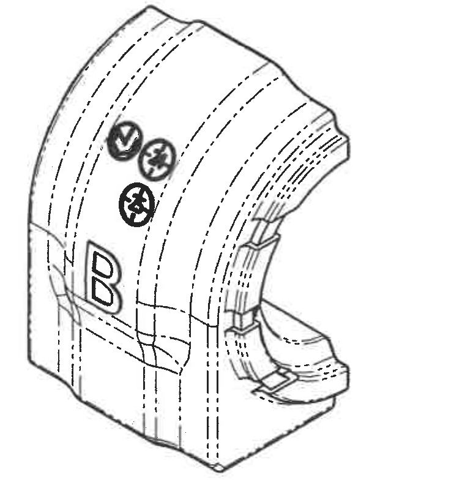

原图位置/视图名称：下方中部等轴测外形视图，bbox `[1585, 2260, 760, 820]`。

提取表格：

| 提取项 | 原图数值或文本 | 含义说明 |
|---|---|---|
| 外形视图 | 等轴测衬套外形 | 展示产品三维外形、沟槽和内弧结构。 |
| 变型字母 | B | 外形上可见大写 `B`，与 Variant B 对应。 |
| 顶部符号 | 三个圆形/钟形标识 | 对应主视图中的时间钟、Logo 等标识位置。 |
| 尺寸标注 | 未见独立尺寸值 | 该视图用于形状说明，不含尺寸线、角度、半径或公差标注。 |

边界归属说明：右侧参考标准清单已单独裁为 object_9，本对象仅提取等轴测图本体，不提取标准清单文字。

## object_9 Reference 参考标准清单

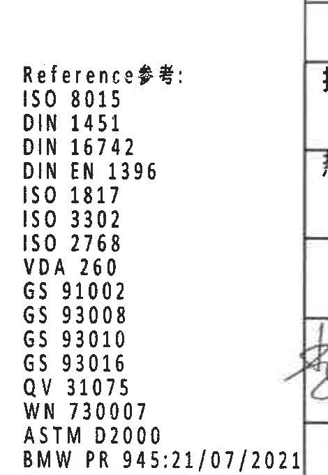

原图位置/视图名称：等轴测视图右侧 Reference 参考清单，bbox `[2320, 2635, 470, 680]`。

提取表格：

| 提取项 | 原图数值或文本 | 含义说明 |
|---|---|---|
| 清单标题 | Reference参考: | 标准参考清单标题。 |
| 参考标准 | ISO 8015 | 参考标准。 |
| 参考标准 | DIN 1451 | 参考标准。 |
| 参考标准 | DIN 16742 | 参考标准。 |
| 参考标准 | DIN EN 1396 | 参考标准。 |
| 参考标准 | ISO 1817 | 参考标准。 |
| 参考标准 | ISO 3302 | 参考标准。 |
| 参考标准 | ISO 2768 | 参考标准。 |
| 参考标准 | VDA 260 | 参考标准。 |
| 参考标准 | GS 91002 | 参考标准。 |
| 参考标准 | GS 93008 | 参考标准。 |
| 参考标准 | GS 93010 | 参考标准。 |
| 参考标准 | GS 93016 | 参考标准。 |
| 参考标准 | QV 31075 | 参考标准。 |
| 参考标准 | WN 730007 | 参考标准。 |
| 参考标准 | ASTM D2000 | 参考标准。 |
| 参考标准 | BMW PR 945:21/07/2021 | 参考标准。 |

边界归属说明：为完整保留最后一行 `BMW PR 945:21/07/2021`，右侧包含极窄相邻表格线/签字边缘；这些边缘不作为参考清单内容提取。

## object_10 NOTES 技术要求

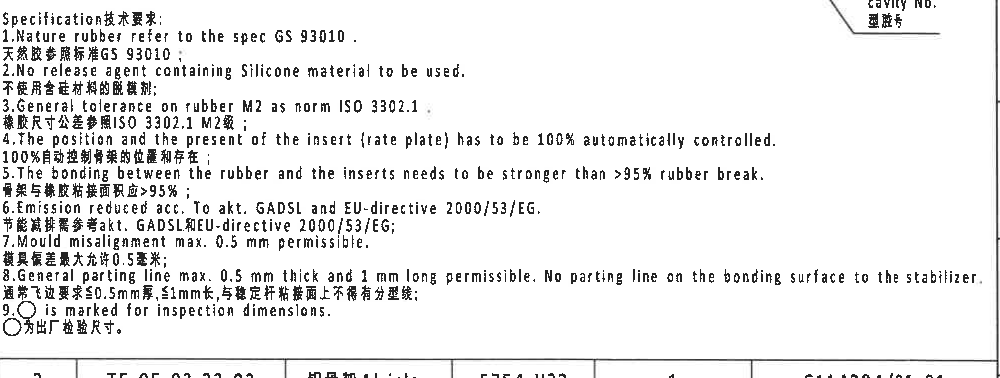

原图位置/视图名称：中下部 Specification 技术要求/NOTES，bbox `[2760, 1745, 2010, 760]`。

提取表格：

| 提取项 | 原图数值或文本 | 含义说明 |
|---|---|---|
| 标题 | Specification技术要求: | 技术要求区标题。 |
| 1 | Nature rubber refer to the spec GS 93010. / 天然胶参照标准GS 93010； | 天然橡胶按 GS 93010。 |
| 2 | No release agent containing Silicone material to be used. / 不使用含硅材料的脱模剂； | 禁止使用含硅脱模剂。 |
| 3 | General tolerance on rubber M2 as norm ISO 3302.1. / 橡胶尺寸公差参照ISO 3302.1 M2级； | 橡胶通用尺寸公差按 ISO 3302.1 M2。 |
| 4 | The position and the present of the insert (rate plate) has to be 100% automatically controlled. / 100%自动控制骨架的位置和存在； | 插入件位置和存在性需 100% 自动控制。 |
| 5 | The bonding between the rubber and the inserts needs to be stronger than >95% rubber break. / 骨架与橡胶粘接面积应>95%； | 橡胶与嵌件粘接强度要求。 |
| 6 | Emission reduced acc. To akt. GADSL and EU-directive 2000/53/EG. / 节能减排需参考akt. GADSL和EU-directive 2000/53/EG； | 排放/材料法规要求。 |
| 7 | Mould misalignment max. 0.5 mm permissible. / 模具偏差最大允许0.5毫米； | 模具错位最大允许值 0.5 mm。 |
| 8 | General parting line max. 0.5 mm thick and 1 mm long permissible. No parting line on the bonding surface to the stabilizer. / 通常飞边要求≤0.5mm厚, ≤1mm长, 与稳定杆粘接面上不得有分型线； | 飞边和分型线要求。 |
| 9 | ○ is marked for inspection dimensions. / ○为出厂检验尺寸。 | 带圆圈的尺寸为出厂检验尺寸。 |

边界归属说明：该裁切为完整保留第 8 条英文长句和第 9 条检查符号，右上角带入右侧视图 `cavity No. / 型腔号` 引线片段；该片段归属 object_7，不作为 NOTES 内容提取。底部表格线属于下方 BOM 边界，不提取为 NOTES 内容。

## object_11 DIN ISO 3302-1 M2 class 公差表

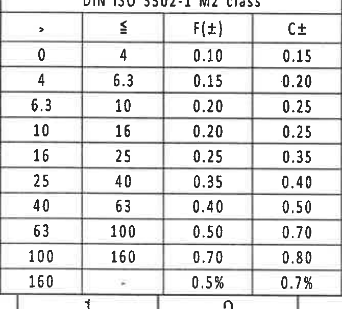

原图位置/视图名称：左下角 DIN ISO 3302-1 M2 class 公差表，bbox `[365, 2735, 670, 605]`。

原表行列还原：

| > | ≤ | F(±) | C± |
|---:|---:|---:|---:|
| 0 | 4 | 0.10 | 0.15 |
| 4 | 6.3 | 0.15 | 0.20 |
| 6.3 | 10 | 0.20 | 0.25 |
| 10 | 16 | 0.20 | 0.25 |
| 16 | 25 | 0.25 | 0.35 |
| 25 | 40 | 0.35 | 0.40 |
| 40 | 63 | 0.40 | 0.50 |
| 63 | 100 | 0.50 | 0.70 |
| 100 | 160 | 0.70 | 0.80 |
| 160 | - | 0.5% | 0.7% |

提取表格：

| 提取项 | 原图数值或文本 | 含义说明 |
|---|---|---|
| 标题 | DIN ISO 3302-1 M2 class | 橡胶通用公差表，与 NOTES 第 3 条对应。 |
| F(±) | 0.10 到 0.70，末行 0.5% | F 类公差列。 |
| C± | 0.15 到 0.80，末行 0.7% | C 类公差列。 |
| 尺寸范围 | 0-4, 4-6.3, 6.3-10, 10-16, 16-25, 25-40, 40-63, 63-100, 100-160, 160- | 不同名义尺寸范围对应的通用公差。 |

边界归属说明：该裁切只包含左下公差表；底部图框坐标号不提取为表格内容。

## object_12 零件明细表

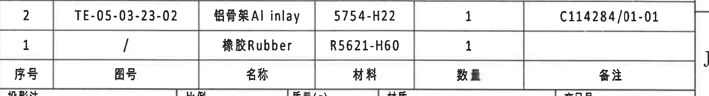

原图位置/视图名称：右下标题栏上方零件明细表/BOM，bbox `[2760, 2465, 2045, 280]`。

原表行列还原：

| 序号 | 图号 | 名称 | 材料 | 数量 | 备注 |
|---:|---|---|---|---:|---|
| 2 | TE-05-03-23-02 | 铝骨架 Al inlay | 5754-H22 | 1 | C114284/01-01 |
| 1 | / | 橡胶 Rubber | R5621-H60 | 1 |  |

提取表格：

| 提取项 | 原图数值或文本 | 含义说明 |
|---|---|---|
| 序号 2 | TE-05-03-23-02 / 铝骨架 Al inlay / 5754-H22 / 数量 1 / C114284/01-01 | 与 B-B 剖面中零件序号 2 引线对应。 |
| 序号 1 | / / 橡胶 Rubber / R5621-H60 / 数量 1 | 与 B-B 剖面中零件序号 1 引线对应。 |

边界归属说明：该对象仅提取 BOM 明细和列标题。下方投影法、比例、产品号等标题栏字段归属 object_13。

## object_13 标题栏

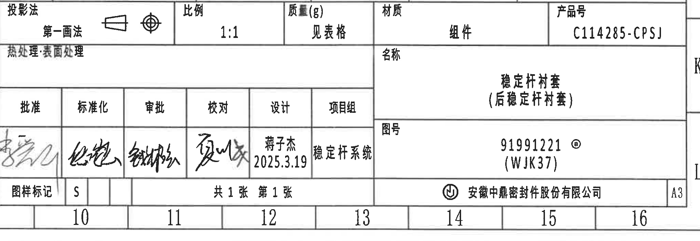

原图位置/视图名称：右下角标题栏，bbox `[2760, 2720, 2045, 705]`。

原表行列还原：

| 字段 | 原图文本 |
|---|---|
| 投影法 | 第一画法，含投影视图符号 |
| 比例 | 1:1 |
| 质量(g) | 见表格 |
| 材质 | 组件 |
| 产品号 | C114285-CPSJ |
| 热处理:表面处理 | 空白 |
| 名称 | 稳定杆衬套（后稳定杆衬套） |
| 批准 | 签名 |
| 标准化 | 签名 |
| 审批 | 签名 |
| 校对 | 签名 |
| 设计 | 蒋子杰 / 2025.3.19 |
| 项目组 | 稳定杆系统 |
| 图号 | 91991221 @ / (WJK37) |
| 图样标记 | S |
| 张数 | 共1张 第1张 |
| 公司 | 安徽中鼎密封件股份有限公司 |
| 图幅 | A3 |

提取表格：

| 提取项 | 原图数值或文本 | 含义说明 |
|---|---|---|
| 产品号 | C114285-CPSJ | 组件产品号。 |
| 图号 | 91991221 @ (WJK37) | 图纸编号和括号内代号。 |
| 名称 | 稳定杆衬套（后稳定杆衬套） | 零件/组件名称。 |
| 比例 | 1:1 | 图样比例。 |
| 材质 | 组件 | 材质栏标注为组件。 |
| 质量 | 见表格 | 质量值引用规格参数表中的 Total weight。 |
| 设计 | 蒋子杰 2025.3.19 | 设计者和日期。 |

边界归属说明：标题栏裁切从投影法行开始，保留底部公司名称和 A3 图幅。上方 BOM 行不在本对象中提取。

## 裁切检查记录

| 对象 | 检查结果 |
|---|---|
| object_1 修订履历表 | 表头、两条记录和表格线完整；右侧图框坐标字母未作为表内容提取。 |
| object_2 产品规格参数表 | 横向表头和 A/B 两行数据完整；没有带入下方视图尺寸。 |
| object_3 左侧加工视图 | R28.5、R25.5、(0.5)、ØE、27 的文字、箭头和尺寸线完整；未带入主视图文字。 |
| object_4 主视图 | 42.6、38、51.98、54.96、A-A、ZD Logo、Variant letter、Time clock 均完整；重裁后左侧文字未截断。 |
| object_5 A-A 剖面 | (0.5)、RAR、RIR、A-A 名称和剖面线完整；未带入 B-B 剖面。 |
| object_6 B-B 剖面 | (B)、(33.39)、T2/T1B/T1A 三条尺寸线和零件序号 1/2 完整。 |
| object_7 右侧加工视图 | 稳定杆杆径、B-B 剖切、材料代码、cavity No. 引线和文字完整；弧形印字因原扫描重叠，仅提取可靠可读部分。 |
| object_8 等轴测外形视图 | 外形图完整；右侧参考清单未混入。 |
| object_9 Reference 参考标准清单 | 标准清单文字完整至 `BMW PR 945:21/07/2021`；右侧极窄边线不作为内容提取。 |
| object_10 NOTES | 技术要求 1-9 条完整；右上角少量 `cavity No.` 片段已标明归属 object_7，不提取为 NOTES。 |
| object_11 公差表 | DIN ISO 3302-1 M2 class 表头和全部 10 行完整。 |
| object_12 零件明细表 | 两条 BOM 记录和列标题完整；下方标题栏字段未提取到本对象。 |
| object_13 标题栏 | 标题栏主体、签署栏、图号、公司、A3 图幅完整；上方 BOM 不重复提取。 |
