# 20C114286 内容识别结果

识别基准：`outputs/20C114286_assets/images/page_1.png`，整页 PNG 尺寸 4959 x 3505 px。以下 bbox 均为整页 PNG 像素坐标，格式为 `[x0, y0, x1, y1]`。

## object_2 - 修订履历表

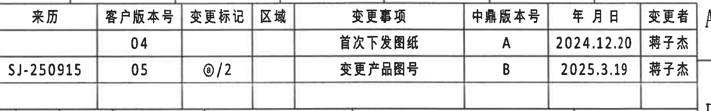

原图位置/视图名称：page 1，bbox `[2945, 125, 4790, 415]`，右上角修订履历表。  
object_kind：table

| 来源 | 客户版本号 | 变更标记 | 区域 | 变更事项 | 中鼎版本号 | 年月日 | 变更者 |
|---|---|---|---|---|---|---|---|
|  | 04 |  |  | 首次下发图纸 | A | 2024.12.20 | 蒋子杰 |
| SJ-250915 | 05 | ⓐ/2 |  | 变更产品图号 | B | 2025.3.19 | 蒋子杰 |

| 提取项 | 原图数值或文本 | 含义说明 |
|---|---|---|
| 客户版本号 | 04、05 | 客户版本记录；05 行对应本次变更。 |
| 变更标记 | ⓐ/2 | 图纸中使用的变更标记，和标题栏、物料号处的 ⓐ 关联。 |
| 中鼎版本号 | A、B | 中鼎内部版本号；B 为 2025.3.19 变更后的版本。 |
| 变更事项 | 首次下发图纸；变更产品图号 | 修订原因和内容。 |
| 日期/变更者 | 2024.12.20 蒋子杰；2025.3.19 蒋子杰 | 每条修订记录的责任人和日期。 |

边界归属说明：裁切只覆盖右上角修订履历表主体；右侧可见图框分区字母 A/B 边缘，不作为表格内容提取。下边未纳入下方参数表。

## object_1 - 顶部产品参数表

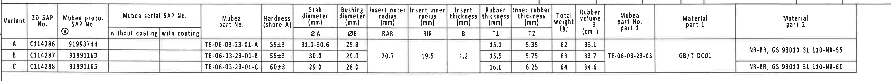

原图位置/视图名称：page 1，bbox `[360, 390, 4600, 780]`，顶部 Variant/物料参数表。  
object_kind：table

| Variant | ZD SAP No. | Mubea proto. SAP No. ⓐ | Mubea serial SAP No. without coating | Mubea serial SAP No. with coating | Mubea part No. | Hardness (shore A) | Stab diameter ØA (mm) | Bushing diameter ØE (mm) | Insert outer radius RAR (mm) | Insert inner radius RIR (mm) | Insert thickness B (mm) | Rubber thickness T1 (mm) | Inner rubber thickness T2 (mm) | Total weight (g) | Rubber volume (cm3) | Mubea part No. part 1 | Material part 1 | Material part 2 |
|---|---|---|---|---|---|---|---|---|---|---|---|---|---|---|---|---|---|---|
| A | C114286 | 91993744 |  |  | TE-06-03-23-01-A | 55±3 | 31.0-30.6 | 29.8 |  |  |  | 15.1 | 5.35 | 62 | 33.1 |  |  |  |
| B | C114287 | 91991163 |  |  | TE-06-03-23-01-B | 55±3 | 30.0 | 29.0 | 20.7 | 19.5 | 1.2 | 15.5 | 5.75 | 63 | 33.7 | TE-06-03-23-03 | GB/T DC01 | NR-BR, GS 93010 31 110-NR-55 |
| C | C114288 | 91991165 |  |  | TE-06-03-23-01-C | 60±3 | 29.0 | 28.0 |  |  |  | 16.0 | 6.25 | 64 | 34.6 |  |  | NR-BR, GS 93010 31 110-NR-60 |

| 提取项 | 原图数值或文本 | 含义说明 |
|---|---|---|
| Variant A | ZD SAP No. C114286；Mubea proto. SAP No. 91993744；Mubea part No. TE-06-03-23-01-A；Hardness 55±3；ØA 31.0-30.6；ØE 29.8；T1 15.1；T2 5.35；weight 62 g；volume 33.1 cm3 | A 变型的物料和关键尺寸参数；右侧弧形视图中可见的 A 标识与该行对应。 |
| Variant B | ZD SAP No. C114287；Mubea proto. SAP No. 91991163；Mubea part No. TE-06-03-23-01-B；Hardness 55±3；ØA 30.0；ØE 29.0；T1 15.5；T2 5.75；weight 63 g；volume 33.7 cm3 | B 变型的物料和关键尺寸参数。 |
| Variant C | ZD SAP No. C114288；Mubea proto. SAP No. 91991165；Mubea part No. TE-06-03-23-01-C；Hardness 60±3；ØA 29.0；ØE 28.0；T1 16.0；T2 6.25；weight 64 g；volume 34.6 cm3 | C 变型的物料和关键尺寸参数。 |
| Mubea serial SAP No. | without coating 空白；with coating 空白 | 原表两列保留为空，未填写 serial SAP No.。 |
| RAR/RIR/B | RAR 20.7；RIR 19.5；B 1.2 | 原表中位于 A/B/C 三行高度的合并区域内；用于 B-B 剖面的 (RAR)/(RIR) 和 A-A 剖面的 (B)。 |
| part 1 | Mubea part No. part 1: TE-06-03-23-03；Material part 1: GB/T DC01 | 铁骨架/嵌件零件号与材料；在表中以合并区域显示。 |
| Material part 2 | NR-BR, GS 93010 31 110-NR-55；NR-BR, GS 93010 31 110-NR-60 | 橡胶材料牌号；55 shore A 变型使用 NR-55，60 shore A 变型使用 NR-60。 |
| 符号尺寸索引 | ØA、ØE、RAR、RIR、B、T1、T2 | 后续视图内的符号尺寸以本表数值为依据。 |

边界归属说明：裁切包含完整表头、A/B/C 三行和所有右侧材料字段；上方有少量图框网格线，不作为参数表内容。原表中部分字段为合并单元格，Markdown 表中把可见文字放在其原图所在高度，含义在提取表中说明。

## object_3 - 左侧弧形端面视图

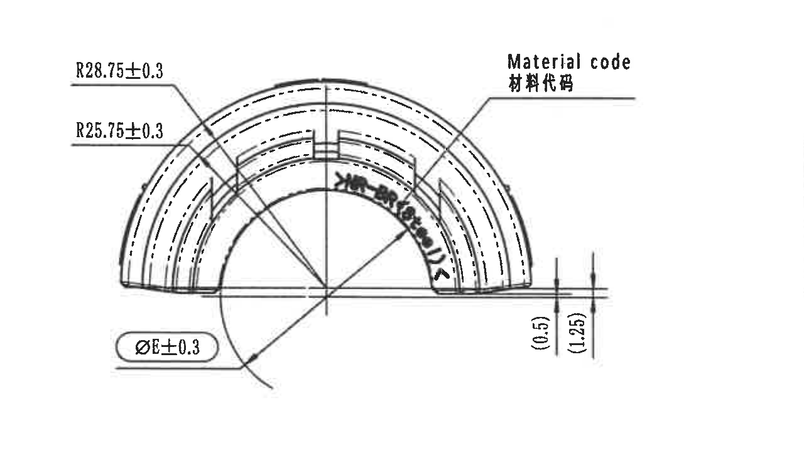

原图位置/视图名称：page 1，bbox `[430, 1110, 1710, 1870]`，左侧弧形端面加工视图。  
object_kind：view

| 提取项 | 原图数值或文本 | 含义说明 |
|---|---|---|
| 外侧弧半径 | R28.75±0.3 | 端面外侧圆弧半径，带 ±0.3 公差。 |
| 内侧弧半径 | R25.75±0.3 | 端面内侧圆弧半径，带 ±0.3 公差。 |
| 衬套直径符号 | ØE±0.3 | 直径 E，带 ±0.3 公差；ØE 数值由顶部参数表给出：A=29.8，B=29.0，C=28.0。 |
| 参考尺寸 | (0.5) | 括号内参考尺寸，位于右下边缘高度/台阶处；用于表达局部相对位置，不作为独立公差控制。 |
| 参考尺寸 | (1.25) | 括号内参考尺寸，位于右下边缘高度/台阶处；与 (0.5) 同属该视图右端局部。 |
| 标识 | Material code / 材料代码 | 引线指向弧形件表面材料代码标识位置。 |
| 弧度/角度 | 未见角度数值 | 该视图显示弧形轮廓和半径尺寸，未给出角度或弧长数值。 |

边界归属说明：裁切包含本端面视图的完整半径引线、ØE 引线、右侧两个括号参考尺寸和 Material code 引线；未纳入中央侧视图的 Variant letter/Upper part marking 说明。

## object_4 - 中央侧面标识视图

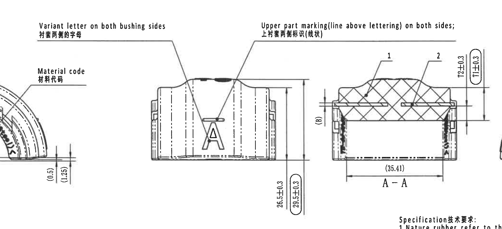

原图位置/视图名称：page 1，bbox `[1080, 910, 3180, 1870]`，中央侧面标识加工视图。  
object_kind：view

| 提取项 | 原图数值或文本 | 含义说明 |
|---|---|---|
| 变型字母标识 | Variant letter on both bushing sides / 衬套两侧的字母 | 引线指向侧面大写字母 A；表示变型字母需在两侧衬套上标识。 |
| 上部线状标识 | Upper part marking (line above lettering) on both sides; / 上衬套两侧标识(线状) | 引线指向字母上方短线状标记；要求两侧均有上部线状标识。 |
| 侧面字母 | A | 视图中示例变型字母。 |
| 总高/成品高度 | 26.5±0.3 | 中央侧视图右侧竖向尺寸，带 ±0.3 公差。 |
| 检验/参考外包高度 | 29.5±0.3 | 椭圆圈出的竖向尺寸，按技术要求第 8 条属于出厂检验尺寸标记。 |
| 相邻尺寸排除 | T2±0.3、T1±0.3、(35.41)、(B) | 这些标注位于右侧 A-A 剖面，不归入中央侧面视图。 |

边界归属说明：为保留两条长引线说明的完整文字，裁切包含左侧端面视图边缘和右侧 A-A 剖面片段；本区域只提取中央侧面视图和两条标识引线，A-A 剖面的 T1/T2/(B)/(35.41) 尺寸在 object_5 中提取。

## object_5 - A-A 剖面视图

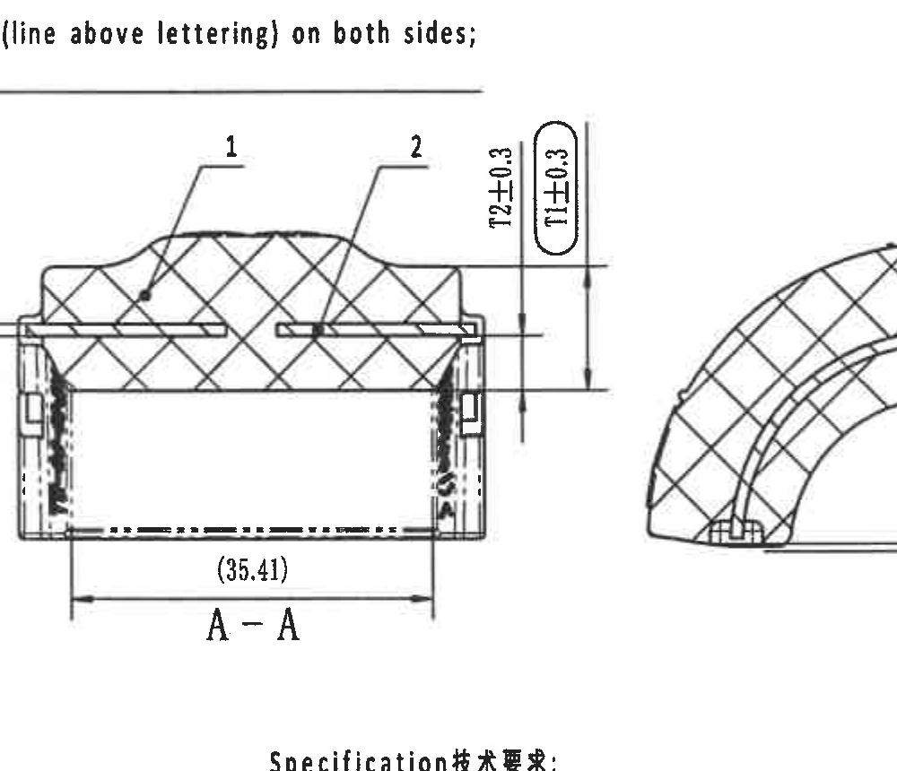

原图位置/视图名称：page 1，bbox `[2450, 980, 3450, 1840]`，A-A 剖面视图。  
object_kind：section

| 提取项 | 原图数值或文本 | 含义说明 |
|---|---|---|
| 剖面名称 | A-A | 对应右侧弧形视图中 A/A 剖切标识。 |
| 件号引出 | 1 | 引线指向橡胶本体区域；与标题栏明细表序号 1“橡胶/R5621”对应。 |
| 件号引出 | 2 | 引线指向嵌件/骨架区域；与标题栏明细表序号 2“TE-06-03-23-03 / 铁骨架 / DC01”对应。 |
| 嵌件厚度 | (B) | 括号内参考/表驱动尺寸；B 数值由顶部参数表给出为 1.2 mm。 |
| 内橡胶厚度 | T2±0.3 | T2 尺寸带 ±0.3 公差；顶部参数表给出 A=5.35，B=5.75，C=6.25。 |
| 橡胶厚度 | T1±0.3 | T1 尺寸带 ±0.3 公差并被椭圆圈出；顶部参数表给出 A=15.1，B=15.5，C=16.0；按技术要求第 8 条为出厂检验尺寸。 |
| 参考宽度 | (35.41) | 括号内参考尺寸，位于 A-A 剖面底部水平尺寸线上。 |
| 剖面材料表现 | 斜剖面线 | 剖面线显示被切开的橡胶/骨架区域，不是尺寸值。 |

边界归属说明：裁切保留 A-A 剖面完整尺寸线和文字；右侧可见 B-B 剖面边缘，左上可见中央视图说明线尾，均不作为 A-A 尺寸提取。

## object_6 - B-B 剖面视图

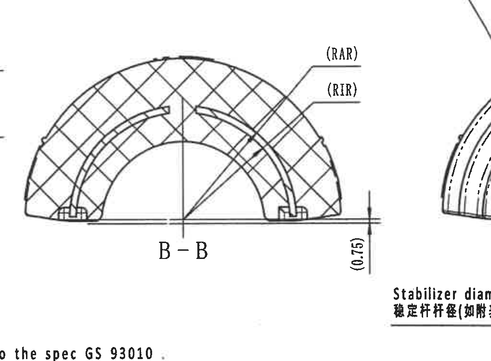

原图位置/视图名称：page 1，bbox `[3120, 1130, 4140, 1880]`，B-B 剖面视图。  
object_kind：section

| 提取项 | 原图数值或文本 | 含义说明 |
|---|---|---|
| 剖面名称 | B-B | 对应底视图两侧 B/B 剖切标识。 |
| 外嵌件半径 | (RAR) | 括号内参考/表驱动半径；顶部参数表给出 RAR=20.7 mm。 |
| 内嵌件半径 | (RIR) | 括号内参考/表驱动半径；顶部参数表给出 RIR=19.5 mm。 |
| 参考高度 | (0.75) | 括号内参考尺寸，位于右下边缘竖向尺寸线上。 |
| 弧度/角度 | 未见角度数值 | 该剖面显示圆弧剖面和 RAR/RIR 引线，未标注角度或弧长。 |

边界归属说明：裁切包含 B-B 剖面本体、(RAR)/(RIR) 引线和 (0.75) 参考尺寸；右下角出现右侧弧形视图的 stabilizer diameter 标注开头，左下角出现 NOTES 文字边缘，均不归入 B-B 提取。

## object_7 - 右侧弧形端面视图

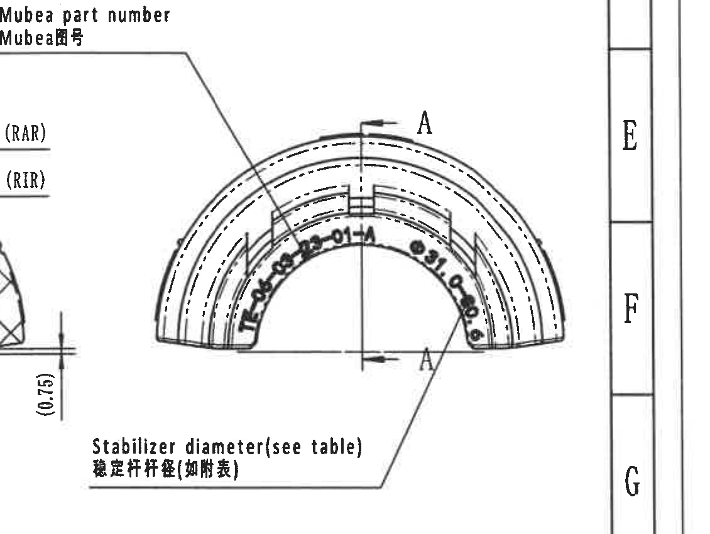

原图位置/视图名称：page 1，bbox `[3790, 1030, 4920, 1880]`，右侧弧形端面加工视图。  
object_kind：view

| 提取项 | 原图数值或文本 | 含义说明 |
|---|---|---|
| Mubea 图号标识 | Mubea part number / Mubea图号 | 引线指向弧面上的 Mubea 零件号标识位置；顶部参数表给出 A/B/C 对应 TE-06-03-23-01-A/B/C。 |
| 示例弧面文字 | TE-06-03-23-01-A | 视图中可见的 A 变型弧面零件号标识。 |
| 稳定杆杆径 | Stabilizer diameter (see table) / 稳定杆杆径(如附表) | 引线指向内弧文字和尺寸位置；数值由顶部参数表 ØA 给出：A=31.0-30.6，B=30.0，C=29.0。 |
| 剖切基准字母 | A、A | 上下两个 A 及箭头表示 A-A 剖切位置，对应 object_5。 |
| 弧度/角度 | 未见角度数值 | 该视图标出圆弧轮廓和表驱动杆径，未给出角度或弧长。 |

边界归属说明：裁切包含右侧弧形视图完整的 Mubea part number 引线、Stabilizer diameter 引线和 A-A 剖切字母；左侧可见 B-B 剖面边缘和 (RAR)/(RIR)/(0.75) 片段不归入本视图，右侧图框分区字母也不作为提取内容。

## object_8 - 底部展开/底视图

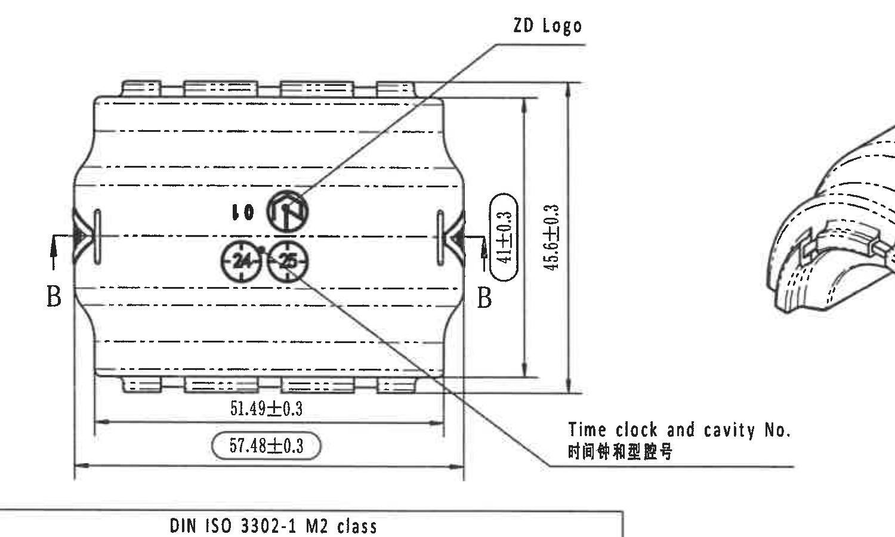

原图位置/视图名称：page 1，bbox `[500, 1850, 2000, 2750]`，左下底部展开/底视图。  
object_kind：view

| 提取项 | 原图数值或文本 | 含义说明 |
|---|---|---|
| 剖切基准字母 | B、B | 左右两侧 B 和箭头表示 B-B 剖切位置，对应 object_6。 |
| ZD Logo | ZD Logo | 引线指向中心上方圆形 ZD 标识位置。 |
| 时间钟和型腔号 | Time clock and cavity No. / 时间钟和型腔号 | 引线指向中心的时间钟/型腔标识；可见数值/标记为 10、24、25。 |
| 内部长度 | 51.49±0.3 | 底部内部水平尺寸，带 ±0.3 公差。 |
| 总长度/检验尺寸 | 57.48±0.3 | 椭圆圈出的底部水平总尺寸，带 ±0.3 公差；按技术要求第 8 条为出厂检验尺寸。 |
| 局部高度/检验尺寸 | 41±0.3 | 椭圆圈出的竖向尺寸，带 ±0.3 公差；按技术要求第 8 条为出厂检验尺寸。 |
| 总高度/外包尺寸 | 45.6±0.3 | 右侧外侧竖向总尺寸，带 ±0.3 公差。 |

边界归属说明：裁切完整包含底视图尺寸线、B-B 剖切字母、ZD Logo 和 Time clock/cavity No. 引线；右侧带入等轴视图边缘，下边带入公差表标题 `DIN ISO 3302-1 M2 class` 的上边缘，均不作为底视图内容提取。

## object_9 - 等轴辅助视图

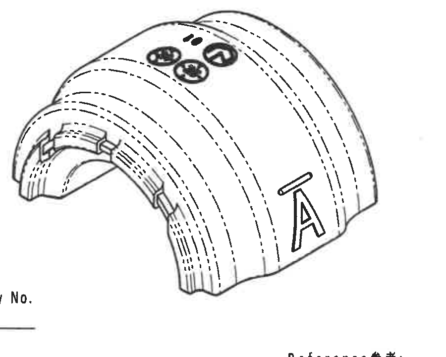

原图位置/视图名称：page 1，bbox `[1760, 1970, 2660, 2690]`，中下等轴辅助视图。  
object_kind：detail

| 提取项 | 原图数值或文本 | 含义说明 |
|---|---|---|
| 侧面字母 | A | 等轴视图展示变型字母在外弧面的外观位置。 |
| 上部线状标识 | 字母 A 上方短线标记 | 与中央侧面视图的 upper part marking 对应。 |
| 时间钟/型腔标识 | 可见 10、24、25 的圆形/近圆形标识 | 与底视图的 Time clock and cavity No. 位置对应，用于外观确认。 |
| 尺寸值 | 未见尺寸数值 | 等轴图未单独标注尺寸、角度或公差。 |

边界归属说明：裁切尽量只覆盖等轴辅助视图；左下角有 Time clock 引线末端，底部有 Reference 标题上缘的极小片段，均不作为等轴视图尺寸或文字提取。

## object_10 - Specification 技术要求

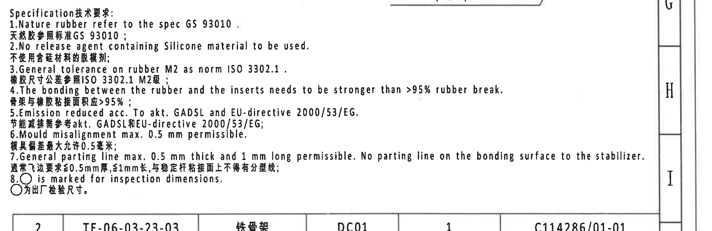

原图位置/视图名称：page 1，bbox `[2720, 1790, 4930, 2510]`，右下 Specification 技术要求文字块。  
object_kind：notes

| 提取项 | 原图数值或文本 | 含义说明 |
|---|---|---|
| 标题 | Specification 技术要求: | 技术要求说明块标题。 |
| 1 | Nature rubber refer to the spec GS 93010. / 天然胶参照标准 GS 93010； | 橡胶材料参照 GS 93010。 |
| 2 | No release agent containing Silicone material to be used. / 不使用含硅材料的脱模剂； | 禁止使用含硅脱模剂。 |
| 3 | General tolerance on rubber M2 as norm ISO 3302.1. / 橡胶尺寸公差参照 ISO 3302.1 M2级； | 橡胶件一般公差按 ISO 3302.1 M2 级。 |
| 4 | The bonding between the rubber and the inserts needs to be stronger than >95% rubber break. / 骨架与橡胶粘接面拉应 >95%； | 橡胶和嵌件粘接强度要求达到大于 95% 橡胶破坏。 |
| 5 | Emission reduced acc. To akt. GADSL and EU-directive 2000/53/EG. / 节能减排需参考 akt. GADSL 和 EU-directive 2000/53/EG； | 排放/材料合规要求。 |
| 6 | Mould misalignment max. 0.5 mm permissible. / 模具偏差最大允许 0.5 毫米； | 模具错位最大允许值 0.5 mm。 |
| 7 | General parting line max. 0.5 mm thick and 1 mm long permissible. No parting line on the bonding surface to the stabilizer. / 通常飞边要求 ≤0.5mm 厚，≤1mm 长，与稳定杆粘接面上不得有分型线； | 飞边/分型线控制要求；粘接稳定杆的表面不得有分型线。 |
| 8 | ○ is marked for inspection dimensions. / ○ 为出厂检验尺寸。 | 图中椭圆/圆圈标出的尺寸为出厂检验尺寸。 |

边界归属说明：裁切扩展到右侧图框以完整保留第 7 条长句；右侧分区字母 G/H/I 和下方明细表首行边缘不属于 NOTES 内容。

## object_11 - DIN ISO 3302-1 M2 公差表

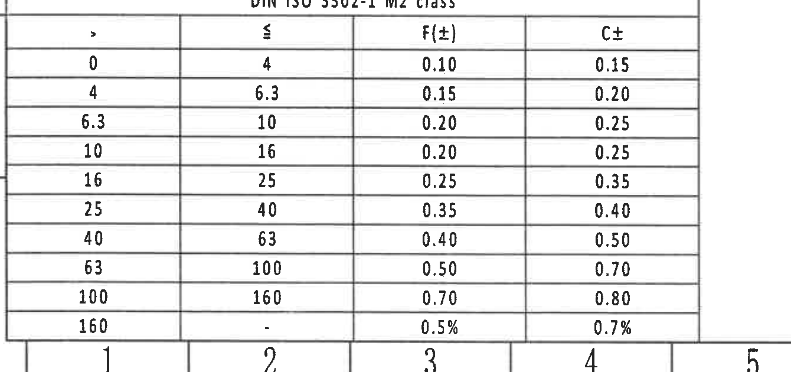

原图位置/视图名称：page 1，bbox `[360, 2730, 1700, 3360]`，左下 DIN ISO 3302-1 M2 class 公差表。  
object_kind：table

| > | ≤ | F(±) | C± |
|---|---|---|---|
| 0 | 4 | 0.10 | 0.15 |
| 4 | 6.3 | 0.15 | 0.20 |
| 6.3 | 10 | 0.20 | 0.25 |
| 10 | 16 | 0.20 | 0.25 |
| 16 | 25 | 0.25 | 0.35 |
| 25 | 40 | 0.35 | 0.40 |
| 40 | 63 | 0.40 | 0.50 |
| 63 | 100 | 0.50 | 0.70 |
| 100 | 160 | 0.70 | 0.80 |
| 160 | - | 0.5% | 0.7% |

| 提取项 | 原图数值或文本 | 含义说明 |
|---|---|---|
| 表题 | DIN ISO 3302-1 M2 class | 橡胶件一般公差等级表，和 NOTES 第 3 条对应。 |
| 尺寸区间 | >0 至 ≤4 等 10 个区间 | 按名义尺寸范围查 F(±) 和 C± 公差。 |
| F(±) | 0.10 至 0.70，末行 0.5% | F 类公差列。 |
| C± | 0.15 至 0.80，末行 0.7% | C 类公差列。 |

边界归属说明：裁切包含完整表题、表头和 10 行数据；下边可见图框坐标数字 1-5，不属于公差表。

## object_12 - Reference 参考标准清单

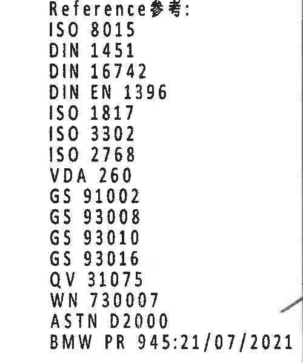

原图位置/视图名称：page 1，bbox `[2260, 2680, 2760, 3280]`，中下 Reference 参考标准清单。  
object_kind：notes

| 提取项 | 原图数值或文本 | 含义说明 |
|---|---|---|
| 标题 | Reference 参考: | 参考标准清单标题。 |
| 标准 | ISO 8015 | 参考标准。 |
| 标准 | DIN 1451 | 参考标准。 |
| 标准 | DIN 16742 | 参考标准。 |
| 标准 | DIN EN 1396 | 参考标准。 |
| 标准 | ISO 1817 | 参考标准。 |
| 标准 | ISO 3302 | 参考标准。 |
| 标准 | ISO 2768 | 参考标准。 |
| 标准 | VDA 260 | 参考标准。 |
| 标准 | GS 91002 | 参考标准。 |
| 标准 | GS 93008 | 参考标准。 |
| 标准 | GS 93010 | 参考标准。 |
| 标准 | GS 93016 | 参考标准。 |
| 标准 | QV 31075 | 参考标准。 |
| 标准 | WN 730007 | 参考标准。 |
| 标准 | ASTM D2000 | 参考标准。 |
| 标准 | BMW PR 945:21/07/2021 | 参考标准/文件号。 |

边界归属说明：裁切包含完整参考清单；右下角可见相邻引线尾部，不属于清单内容。

## object_13 - 标题栏、明细栏和签署栏

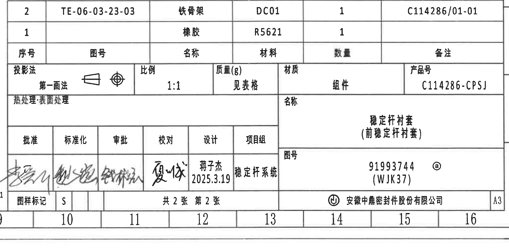

原图位置/视图名称：page 1，bbox `[2730, 2455, 4790, 3465]`，右下标题栏/明细栏。  
object_kind：title_block

### 明细栏

| 序号 | 图号 | 名称 | 材料 | 数量 | 备注 |
|---|---|---|---|---|---|
| 2 | TE-06-03-23-03 | 铁骨架 | DC01 | 1 | C114286/01-01 |
| 1 |  | 橡胶 | R5621 | 1 |  |

### 标题栏字段

| 字段 | 原图数值或文本 |
|---|---|
| 投影法 | 第一画法 |
| 比例 | 1:1 |
| 质量(g) | 见表格 |
| 材质 | 组件 |
| 产品号 | C114286-CPSJ |
| 热处理·表面处理 | 空白 |
| 名称 | 稳定杆衬套（前稳定杆衬套） |
| 图号 | 91993744 ⓐ (WJK37) |
| 图样标记 | S |
| 页数 | 共 2 张 第 2 张 |
| 公司 | 安徽中鼎密封件股份有限公司 |
| 图幅 | A3 |

### 签署栏

| 批准 | 标准化 | 审批 | 校对 | 设计 | 项目组 |
|---|---|---|---|---|---|
| 手写签名 | 手写签名 | 手写签名 | 手写签名 | 蒋子杰 / 2025.3.19 | 稳定杆系统 |

| 提取项 | 原图数值或文本 | 含义说明 |
|---|---|---|
| 产品号 | C114286-CPSJ | 图纸产品号。 |
| 图号 | 91993744 ⓐ (WJK37) | 主图号/内部编号；带变更标记 ⓐ。 |
| 名称 | 稳定杆衬套（前稳定杆衬套） | 产品名称。 |
| 明细序号 1 | 橡胶；R5621；数量 1 | 橡胶件材料和数量。 |
| 明细序号 2 | TE-06-03-23-03；铁骨架；DC01；数量 1；备注 C114286/01-01 | 铁骨架/嵌件图号、材料和备注。 |
| 比例 | 1:1 | 图样比例。 |
| 质量 | 见表格 | 质量不在标题栏给定具体数值，需查顶部参数表 weight 列。 |
| 图幅/页码 | A3；共 2 张 第 2 张 | 图幅和页码信息。 |

边界归属说明：裁切包含标题栏、明细栏、签署栏、图号栏、页码栏和公司栏；底部可见图框坐标数字 10-16，右侧可见外框线，均不作为标题栏字段提取。

## 裁切检查记录

| object_id | 图片路径 | 检查结果 |
|---|---|---|
| page_1 | outputs/20C114286_assets/images/page_1.png | 整页 PNG 已渲染，4959 x 3505 px，作为所有 bbox 基准。 |
| object_1 | outputs/20C114286_assets/images/object_1.png | 完整包含顶部参数表表头、A/B/C 三行、材料字段；上方图框线未提取为表内容。 |
| object_2 | outputs/20C114286_assets/images/object_2.png | 完整包含修订表表头和两条记录；右侧图框字母边缘不提取。 |
| object_3 | outputs/20C114286_assets/images/object_3.png | 完整包含 R28.75±0.3、R25.75±0.3、ØE±0.3、(0.5)、(1.25) 的尺寸线和文字。 |
| object_4 | outputs/20C114286_assets/images/object_4.png | 完整包含中央侧面视图、26.5±0.3、29.5±0.3 和两条标识引线说明；相邻 A-A 尺寸片段已在归属说明中排除。 |
| object_5 | outputs/20C114286_assets/images/object_5.png | 完整包含 A-A 剖面、1/2 引出、(B)、T2±0.3、T1±0.3、(35.41)；右侧 B-B 边缘不提取。 |
| object_6 | outputs/20C114286_assets/images/object_6.png | 完整包含 B-B 剖面、(RAR)、(RIR)、(0.75) 的引线和文字；相邻视图片段不提取。 |
| object_7 | outputs/20C114286_assets/images/object_7.png | 完整包含右侧弧形视图、Mubea part number 引线、Stabilizer diameter 引线和 A-A 剖切字母；左侧 B-B 片段不提取。 |
| object_8 | outputs/20C114286_assets/images/object_8.png | 完整包含底视图、B/B 剖切标识、ZD Logo、Time clock and cavity No.、51.49±0.3、57.48±0.3、41±0.3、45.6±0.3；下方公差表标题边缘不提取。 |
| object_9 | outputs/20C114286_assets/images/object_9.png | 完整包含等轴辅助视图和外观标识；未见独立尺寸文字。 |
| object_10 | outputs/20C114286_assets/images/object_10.png | 重裁后完整包含 NOTES 第 1-8 条，特别是第 7 条长句；右侧图框字母和下方明细表边缘不提取。 |
| object_11 | outputs/20C114286_assets/images/object_11.png | 完整包含 DIN ISO 3302-1 M2 class 表题、表头和 10 行数据；底部坐标数字不提取。 |
| object_12 | outputs/20C114286_assets/images/object_12.png | 完整包含 Reference 参考标准清单全部条目；相邻引线尾部不提取。 |
| object_13 | outputs/20C114286_assets/images/object_13.png | 完整包含标题栏、明细栏、签署栏、图号、公司、页码和 A3 图幅；底部坐标数字不提取。 |
