# 20C114287 PDF 内容识别

整页 PNG：`20C114287_assets/images/page_1.png`  
源文件：`input/20C114287.pdf`，1 页，整页渲染尺寸 4959 x 3505 px。

## object_1 - 修订履历表

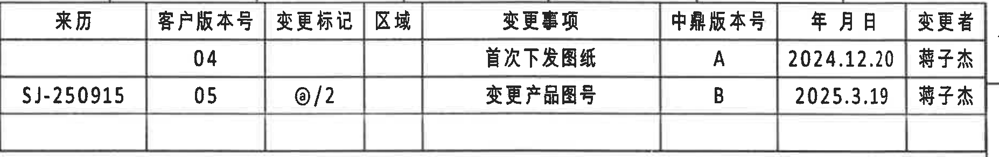

原图位置/视图名称：第 1 页右上角修订履历表，bbox `[2930, 140, 4785, 432]`。

| 来历 | 客户版本号 | 变更标记 | 区域 | 变更事项 | 中鼎版本号 | 年 月 日 | 变更者 |
|---|---|---|---|---|---|---|---|
|  | 04 |  |  | 首次下发图纸 | A | 2024.12.20 | 蒋子杰 |
| SJ-250915 | 05 | @/2 |  | 变更产品图号 | B | 2025.3.19 | 蒋子杰 |

| 提取项 | 原图数值或文本 | 含义说明 |
|---|---|---|
| 表名/对象 | 修订履历表 | 记录客户版本、中鼎版本和变更事项。 |
| 版本记录 1 | 客户版本号 04；变更事项 首次下发图纸；中鼎版本号 A；日期 2024.12.20；变更者 蒋子杰 | 初次下发图纸记录。 |
| 版本记录 2 | 来历 SJ-250915；客户版本号 05；变更标记 @/2；变更事项 变更产品图号；中鼎版本号 B；日期 2025.3.19；变更者 蒋子杰 | 后续变更产品图号记录。 |

边界归属说明：裁切按表格外边框取图；未提取图框坐标栏内容，表内两行记录和表头完整。

## object_2 - 规格/变型参数表

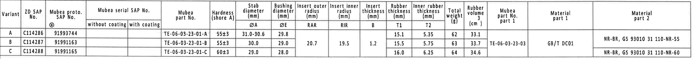

原图位置/视图名称：第 1 页上方横向规格/变型参数表，bbox `[370, 440, 4480, 790]`。

| Variant | ZD SAP No. | Mubea proto. SAP No. | Mubea serial SAP No. without coating | Mubea serial SAP No. with coating | Mubea part No. | Hardness (shore A) | Stab diameter ØA (mm) | Bushing diameter ØE (mm) | Insert outer radius RAR (mm) | Insert inner radius RIR (mm) | Insert thickness B (mm) | Rubber thickness T1 (mm) | Inner rubber thickness T2 (mm) | Total weight (g) | Rubber volume (cm^3) | Mubea part No. part 1 | Material part 1 | Material part 2 |
|---|---|---|---|---|---|---|---|---|---|---|---|---|---|---|---|---|---|---|
| A | C114286 | 91993744 |  |  | TE-06-03-23-01-A | 55±3 | 31.0-30.6 | 29.8 | 20.7 | 19.5 | 1.2 | 15.1 | 5.35 | 62 | 33.1 | TE-06-03-23-03 | GB/T DC01 | NR-BR, GS 93010 31 110-NR-55 |
| B | C114287 | 91991163 |  |  | TE-06-03-23-01-B | 55±3 | 30.0 | 29.0 | 20.7 | 19.5 | 1.2 | 15.5 | 5.75 | 63 | 33.7 | TE-06-03-23-03 | GB/T DC01 | NR-BR, GS 93010 31 110-NR-55 |
| C | C114288 | 91991165 |  |  | TE-06-03-23-01-C | 60±3 | 29.0 | 28.0 | 20.7 | 19.5 | 1.2 | 16.0 | 6.25 | 64 | 34.6 | TE-06-03-23-03 | GB/T DC01 | NR-BR, GS 93010 31 110-NR-60 |

| 提取项 | 原图数值或文本 | 含义说明 |
|---|---|---|
| 当前图纸对应变型 | Variant B；ZD SAP No. C114287；Mubea proto. SAP No. 91991163；Mubea part No. TE-06-03-23-01-B | 与标题栏产品号 C114287-CPSJ 和图号 91991163 对应。 |
| 硬度 | A 55±3；B 55±3；C 60±3 shore A | 橡胶硬度参数。 |
| 稳定杆直径 ØA | A 31.0-30.6；B 30.0；C 29.0 mm | 与右侧弧形视图“Stabilizer diameter(see table)”对应。 |
| 衬套直径 ØE | A 29.8；B 29.0；C 28.0 mm | 与左侧弧形视图 ØE±0.3 标注对应。 |
| 嵌件外半径 RAR | 20.7 mm | 与 B-B 剖面 (RAR) 标注对应。 |
| 嵌件内半径 RIR | 19.5 mm | 与 B-B 剖面 (RIR) 标注对应。 |
| 嵌件厚度 B | 1.2 mm | 与 A-A 剖面 (B) 标注对应。 |
| 橡胶厚度 T1 | A 15.1；B 15.5；C 16.0 mm | 与 A-A 剖面 T1±0.3 标注对应。 |
| 内橡胶厚度 T2 | A 5.35；B 5.75；C 6.25 mm | 与 A-A 剖面 T2±0.3 标注对应。 |
| 重量/体积 | A 62 g / 33.1 cm^3；B 63 g / 33.7 cm^3；C 64 g / 34.6 cm^3 | 变型质量与橡胶体积。 |
| 材料 | Part 1: GB/T DC01；Part 2: NR-BR, GS 93010 31 110-NR-55 或 NR-60 | 骨架与橡胶材料规范。 |

边界归属说明：裁切覆盖整张规格表；表格左侧少量图框线属于表外边界，不作为字段提取。合并单元格按其覆盖的变型行重复到上表，以便机器读取。

## object_3 - 左侧弧形端面视图

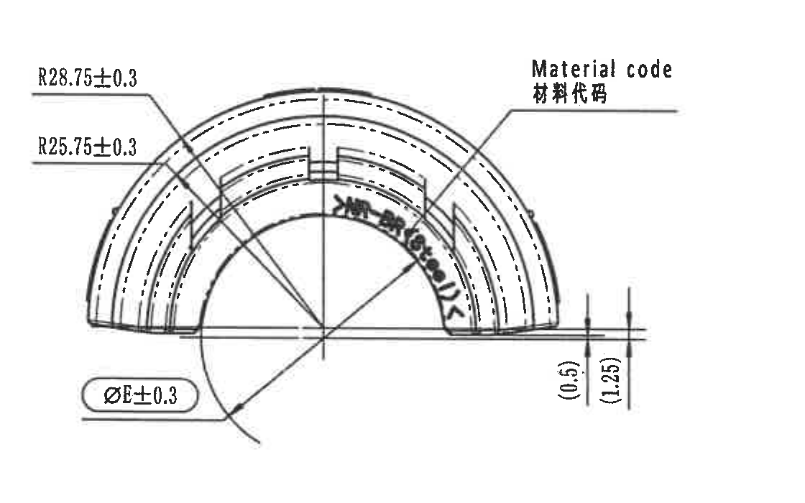

原图位置/视图名称：第 1 页左中部弧形端面加工视图，bbox `[500, 1120, 1620, 1820]`。

| 提取项 | 原图数值或文本 | 含义说明 |
|---|---|---|
| 外侧弧半径 | R28.75±0.3 | 外弧轮廓半径及公差。 |
| 内侧弧半径 | R25.75±0.3 | 内弧轮廓半径及公差。 |
| 衬套直径参数 | ØE±0.3 | 直径 E 的加工/检验尺寸，ØE 数值见规格表。当前 Variant B 对应 ØE=29.0 mm。 |
| 参考尺寸 | (0.5) | 括号内为参考尺寸，位于右下边缘高度位置。 |
| 参考尺寸 | (1.25) | 括号内为参考尺寸，位于右下边缘高度位置。 |
| 标识说明 | Material code / 材料代码 | 引线指向弧形件内侧材料代码标识位置。 |

边界归属说明：裁切下边界完整包含 ØE±0.3 标注框和引线；右侧只到本视图材料代码引线末端，未提取中央标记视图的 Variant letter 引线。

## object_4 - 中央标记侧视图

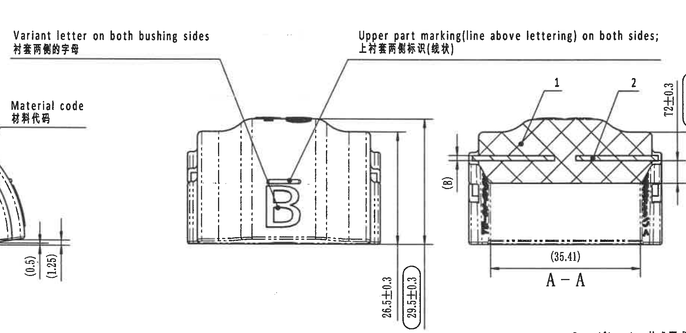

原图位置/视图名称：第 1 页中部侧向标记视图，bbox `[1210, 930, 3060, 1830]`。

| 提取项 | 原图数值或文本 | 含义说明 |
|---|---|---|
| 两侧字母标识 | Variant letter on both bushing sides / 衬套两侧的字母 | 引线指向中央视图中大写变型字母 B，表示衬套两侧均有变型字母。 |
| 上部线状标识 | Upper part marking(line above lettering) on both sides; / 上衬套两侧标识(线状) | 引线指向字母上方黑色线状标识。 |
| 变型字母 | B | 当前产品变型标识，与规格表 Variant B 对应。 |
| 总高度尺寸 | 26.5±0.3 | 侧视图右侧高度尺寸之一。 |
| 总高度尺寸/检验尺寸 | 29.5±0.3 | 侧视图右侧外侧高度尺寸，原图以椭圆/圆角框标出，按 NOTES 第 8 条为出厂检验尺寸。 |

边界归属说明：该视图的长引线跨越相邻区域，因此裁切中可见左侧弧形视图的“Material code”引线末端和右侧 A-A 剖面局部；本对象只提取中央侧视图的字母、线状标识和 26.5±0.3、29.5±0.3，高亮/剖面 T1/T2 等尺寸归 object_5。

## object_5 - A-A 剖面视图

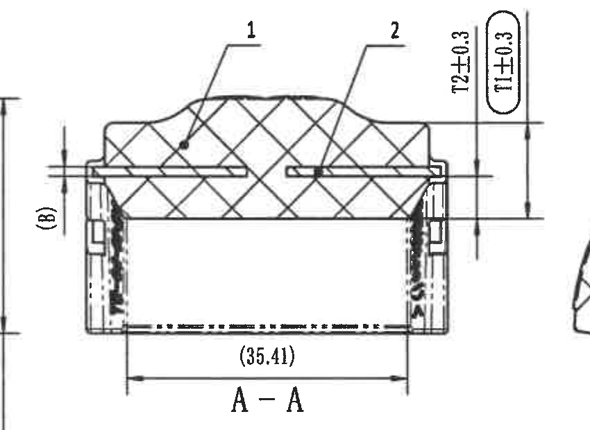

原图位置/视图名称：第 1 页中右部剖面视图 A-A，bbox `[2350, 1110, 3200, 1730]`。

| 提取项 | 原图数值或文本 | 含义说明 |
|---|---|---|
| 剖面名称 | A-A | A-A 剖切位置对应右侧弧形视图中的 A-A 切线。 |
| 物料编号引出 | 1 | 指向剖面中的橡胶/主体区域，对应 BOM 中序号 1 橡胶。 |
| 物料编号引出 | 2 | 指向剖面中的骨架/嵌件区域，对应 BOM 中序号 2 铁骨架。 |
| 厚度参数 | T2±0.3 | 内橡胶厚度，T2 数值见规格表；当前 Variant B 为 5.75 mm。 |
| 厚度参数/检验尺寸 | T1±0.3 | 橡胶厚度，T1 数值见规格表；当前 Variant B 为 15.5 mm；原图以椭圆/圆角框标出。 |
| 嵌件厚度参数 | (B) | 括号内参数尺寸，B 数值见规格表；当前为 1.2 mm。 |
| 参考宽度 | (35.41) | 括号内参考尺寸，位于剖面下方宽度方向。 |

边界归属说明：A-A 剖面完整包含底部 (35.41)、左侧 (B)、右侧 T2±0.3/T1±0.3 及编号 1、2；右边缘可见少量 B-B 区域边界但未提取为 A-A 内容。

## object_6 - B-B 剖面视图

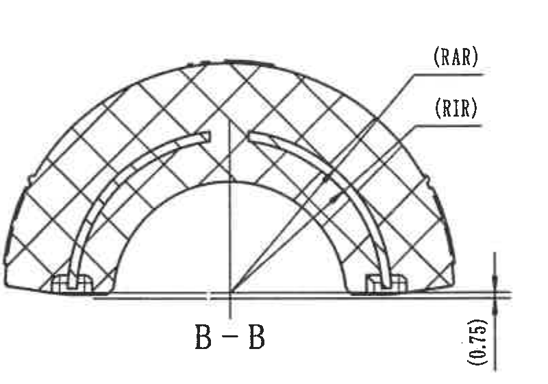

原图位置/视图名称：第 1 页右中部剖面视图 B-B，bbox `[3170, 1170, 3970, 1730]`。

| 提取项 | 原图数值或文本 | 含义说明 |
|---|---|---|
| 剖面名称 | B-B | B-B 剖切位置对应下方侧视图中的 B-B 标记。 |
| 嵌件外半径参数 | (RAR) | 括号内参数标识，数值见规格表；当前表中 RAR=20.7 mm。 |
| 嵌件内半径参数 | (RIR) | 括号内参数标识，数值见规格表；当前表中 RIR=19.5 mm。 |
| 参考高度 | (0.75) | 括号内参考尺寸，位于右下边缘高度方向。 |

边界归属说明：裁切保留 B-B 剖面及 RAR/RIR 引线、(0.75) 尺寸；右侧相邻弧形视图已排除，底部“Stabilizer diameter(see table)”不归入本剖面。

## object_7 - 右侧弧形端面视图

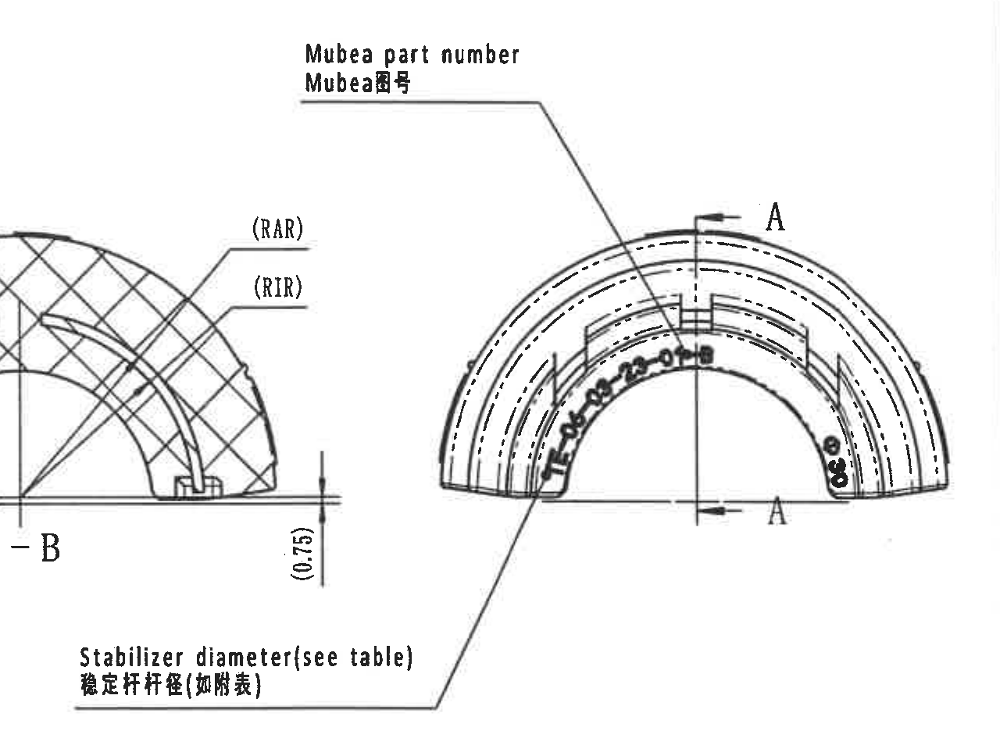

原图位置/视图名称：第 1 页右中部弧形端面视图，bbox `[3480, 960, 4760, 1905]`。

| 提取项 | 原图数值或文本 | 含义说明 |
|---|---|---|
| 图号标识 | Mubea part number / Mubea图号 | 引线指向弧形件内侧 Mubea 图号/件号标识。 |
| Mubea 件号标识 | TE-06-03-23-01-B | 弧形视图内侧可见件号，对应 Variant B。 |
| 剖切线标识 | A（上、下各一处箭头） | 标示 A-A 剖面的剖切位置和方向。 |
| 稳定杆直径说明 | Stabilizer diameter(see table) / 稳定杆杆径(如附表) | 引线指向内弧区域，实际直径数值查规格表 ØA；当前 Variant B 为 30.0 mm。 |

边界归属说明：为完整包含“Stabilizer diameter(see table)”引线说明，裁切左侧保留了 B-B 剖面的少量边缘和 (RAR)/(RIR)/(0.75) 片段；这些片段只归 object_6，本对象不重复提取。

## object_8 - 下方侧视图

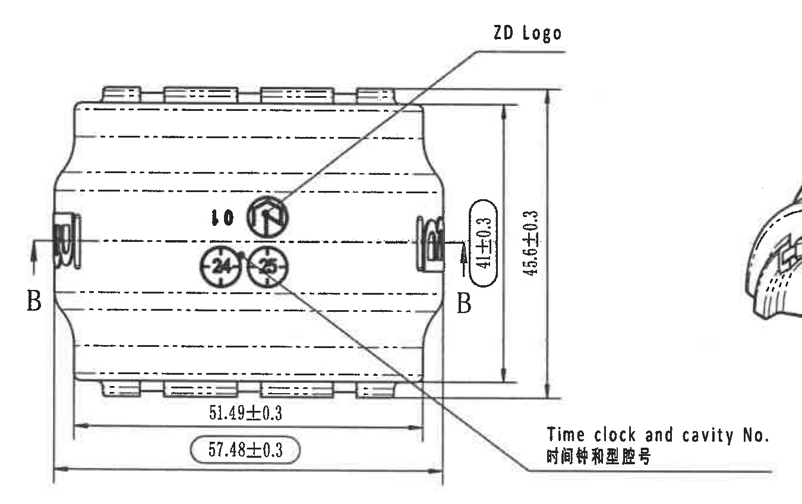

原图位置/视图名称：第 1 页左下方侧视/展开方向加工视图，bbox `[530, 1845, 1880, 2695]`。

| 提取项 | 原图数值或文本 | 含义说明 |
|---|---|---|
| 标识说明 | ZD Logo | 引线指向中部圆形 ZD 标识。 |
| 标识说明 | Time clock and cavity No. / 时间钟和型腔号 | 引线指向下方圆形时间钟和型腔号标识。 |
| 圆形标识 | 10 | 视图中部圆形标识内容之一。 |
| 圆形标识 | 24 | 时间钟/型腔号标识内容之一。 |
| 圆形标识 | 25 | 时间钟/型腔号标识内容之一。 |
| 剖切线标识 | B（左、右各一处） | 标示 B-B 剖面的剖切位置和方向。 |
| 高度/宽度尺寸 | 41±0.3 | 右侧内侧尺寸，原图以椭圆/圆角框标出，按 NOTES 第 8 条为出厂检验尺寸。 |
| 总高度尺寸 | 45.6±0.3 | 右侧外侧总高度尺寸。 |
| 底部长度尺寸 | 51.49±0.3 | 下方内侧长度尺寸。 |
| 底部总长度/检验尺寸 | 57.48±0.3 | 下方外侧总长度尺寸，原图以椭圆/圆角框标出，按 NOTES 第 8 条为出厂检验尺寸。 |

边界归属说明：裁切完整包含 ZD Logo 引线、Time clock and cavity No. 引线、B-B 标识和四个尺寸；右边缘可见等轴测视图小片段，仅为避免截断时间钟引线，不归入本对象提取。

## object_9 - 等轴测外观视图

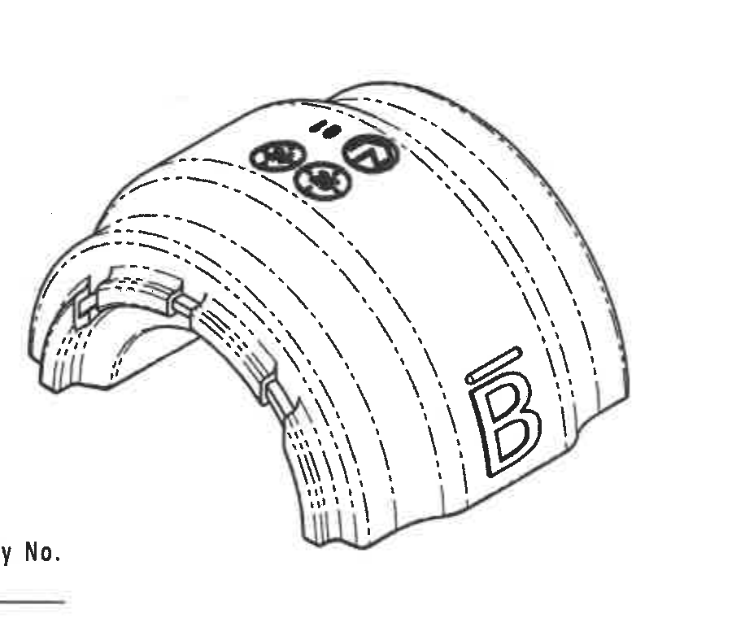

原图位置/视图名称：第 1 页中下方等轴测外观视图，bbox `[1750, 1900, 2650, 2660]`。

| 提取项 | 原图数值或文本 | 含义说明 |
|---|---|---|
| 外观视图 | 等轴测衬套外观 | 展示零件三维外形、槽形结构和外表面标识位置。 |
| 变型字母 | B | 外侧大字母 B，与 Variant B 对应。 |
| 圆形标识 | 10、24、25 | 与下方侧视图中的 ZD Logo、时间钟/型腔号标识对应。 |
| 尺寸标注 | 无独立尺寸、公差、角度或半径标注 | 该对象为外观示意，不含尺寸线。 |

边界归属说明：裁切仅包含等轴测零件外观，左侧相邻侧视图说明文字和下方 Reference 列表未纳入。

## object_10 - NOTES / 技术要求

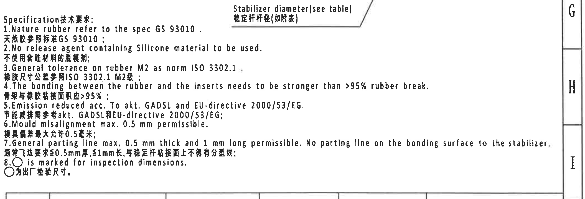

原图位置/视图名称：第 1 页右下中部 NOTES/Specification 技术要求，bbox `[2740, 1770, 4850, 2490]`。

| 提取项 | 原图数值或文本 | 含义说明 |
|---|---|---|
| 标题 | Specification技术要求: | 技术要求说明区。 |
| 1 | Nature rubber refer to the spec GS 93010. / 天然胶参照标准GS 93010； | 天然橡胶材料参考 GS 93010。 |
| 2 | No release agent containing Silicone material to be used. / 不使用含硅材料的脱模剂； | 禁止使用含硅脱模剂。 |
| 3 | General tolerance on rubber M2 as norm ISO 3302.1. / 橡胶尺寸公差参照ISO 3302.1 M2级； | 橡胶尺寸一般公差等级。 |
| 4 | The bonding between the rubber and the inserts needs to be stronger than >95% rubber break. / 骨架与橡胶粘接面积应>95%； | 橡胶与嵌件粘接强度/破坏模式要求。 |
| 5 | Emission reduced acc. To akt. GADSL and EU-directive 2000/53/EG. / 节能减排需参考akt. GADSL和EU-directive 2000/53/EG； | 环保/法规符合性要求。 |
| 6 | Mould misalignment max. 0.5 mm permissible. / 模具错差最大允许0.5毫米； | 模具错位允许值。 |
| 7 | General parting line max. 0.5 mm thick and 1 mm long permissible. No parting line on the bonding surface to the stabilizer. / 通常飞边要求≤0.5mm厚,≤1mm长,与稳定杆粘接面上不得有分型线； | 飞边尺寸和粘接面分型线限制。 |
| 8 | ○ is marked for inspection dimensions. / ○为出厂检验尺寸。 | 图中被圆形或椭圆标记的尺寸为出厂检验尺寸。 |

边界归属说明：为保留第 1 条至第 8 条完整文字，裁切右侧到图框内边界；顶部可见右弧形视图的“Stabilizer diameter(see table)”引线说明，该说明归 object_7，不作为 NOTES 条目提取。

## object_11 - Reference / 参考标准列表

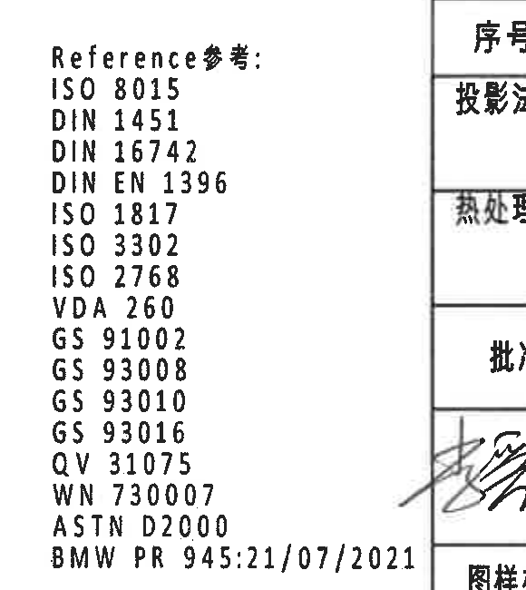

原图位置/视图名称：第 1 页下中部 Reference/参考列表，bbox `[2285, 2640, 2865, 3290]`。

| 提取项 | 原图数值或文本 | 含义说明 |
|---|---|---|
| 标题 | Reference参考: | 参考标准列表。 |
| 标准 | ISO 8015 | 几何产品规范相关参考。 |
| 标准 | DIN 1451 | 字体/标识相关参考。 |
| 标准 | DIN 16742 | 塑料/橡胶件公差相关参考。 |
| 标准 | DIN EN 1396 | 参考标准。 |
| 标准 | ISO 1817 | 橡胶耐液体试验相关参考。 |
| 标准 | ISO 3302 | 橡胶制品尺寸公差参考。 |
| 标准 | ISO 2768 | 一般公差参考。 |
| 标准 | VDA 260 | 材料标识参考。 |
| 标准 | GS 91002 | 材料/客户标准参考。 |
| 标准 | GS 93008 | 材料/客户标准参考。 |
| 标准 | GS 93010 | 材料/客户标准参考。 |
| 标准 | GS 93016 | 材料/客户标准参考。 |
| 标准 | QV 31075 | 客户/质量标准参考。 |
| 标准 | WN 730007 | 客户/内部标准参考。 |
| 标准 | ASTN D2000 | 原图可见字形为 ASTN D2000；扫描较模糊。 |
| 标准 | BMW PR 945:21/07/2021 | 客户参考文件。 |

边界归属说明：裁切左侧完整包含参考列表；右侧有标题栏边线和少量签名区边缘，未作为参考列表内容提取。

## object_12 - DIN ISO 3302-1 M2 公差表

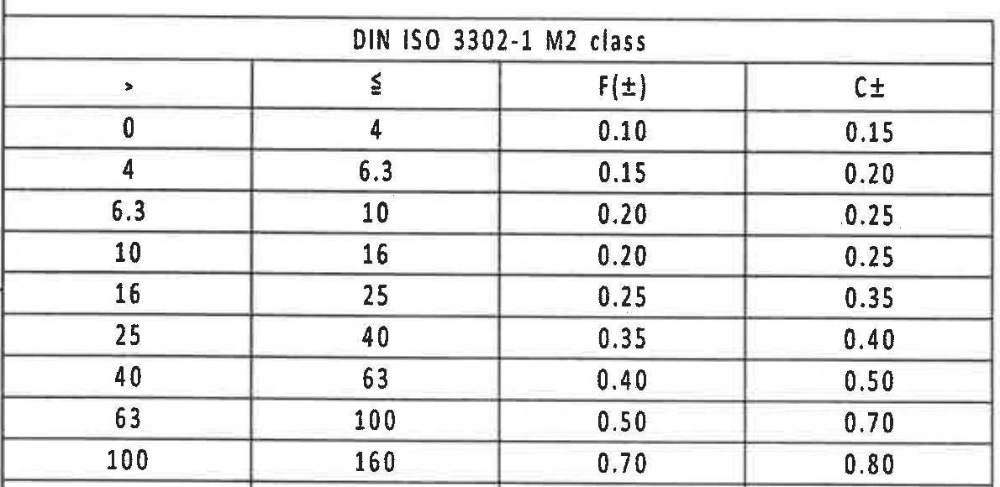

原图位置/视图名称：第 1 页左下角公差表，bbox `[360, 2690, 1550, 3270]`。

| > | ≤ | F(±) | C± |
|---|---|---|---|
| 0 | 4 | 0.10 | 0.15 |
| 4 | 6.3 | 0.15 | 0.20 |
| 6.3 | 10 | 0.20 | 0.25 |
| 10 | 16 | 0.20 | 0.25 |
| 16 | 25 | 0.25 | 0.35 |
| 25 | 40 | 0.35 | 0.40 |
| 40 | 63 | 0.40 | 0.50 |
| 63 | 100 | 0.50 | 0.70 |
| 100 | 160 | 0.70 | 0.80 |
| 160 | - | 0.5% | 0.7% |

| 提取项 | 原图数值或文本 | 含义说明 |
|---|---|---|
| 表名 | DIN ISO 3302-1 M2 class | 橡胶件尺寸一般公差表，NOTES 第 3 条引用。 |
| 列含义 | >、≤、F(±)、C± | 尺寸区间与 F/C 公差等级。 |
| 最大区间 | 160 -；F(±)=0.5%；C±=0.7% | 大尺寸区间使用百分比公差。 |

边界归属说明：裁切按公差表外框取图；底部图框坐标编号已排除。

## object_13 - BOM / 零件明细表

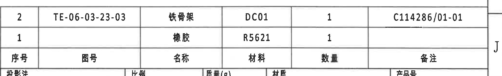

原图位置/视图名称：第 1 页右下方 BOM/零件明细表，bbox `[2760, 2440, 4830, 2755]`。

| 原图行序 | 序号 | 图号 | 名称 | 材料 | 数量 | 备注 |
|---|---|---|---|---|---|---|
| 1 | 2 | TE-06-03-23-03 | 铁骨架 | DC01 | 1 | C114286/01-01 |
| 2 | 1 |  | 橡胶 | R5621 | 1 |  |
| 3 | 序号 | 图号 | 名称 | 材料 | 数量 | 备注 |

| 提取项 | 原图数值或文本 | 含义说明 |
|---|---|---|
| 明细项 2 | 图号 TE-06-03-23-03；名称 铁骨架；材料 DC01；数量 1；备注 C114286/01-01 | 金属骨架/嵌件零件，对应 A-A 剖面编号 2。 |
| 明细项 1 | 名称 橡胶；材料 R5621；数量 1 | 橡胶主体，对应 A-A 剖面编号 1。 |

边界归属说明：裁切包含 BOM 两条物料记录和其下方表头；底部投影法/比例区域只露出边线，不作为 BOM 字段提取。

## object_14 - 标题栏

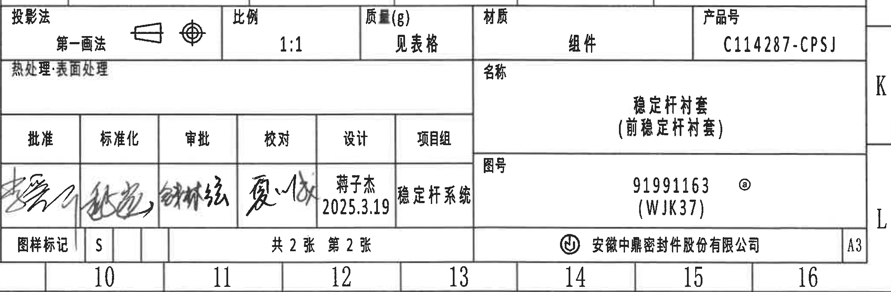

原图位置/视图名称：第 1 页右下角标题栏，bbox `[2760, 2710, 4830, 3390]`。

| 字段 | 原图数值或文本 |
|---|---|
| 投影法 | 第一画法 |
| 比例 | 1:1 |
| 质量(g) | 见表格 |
| 材质 | 组件 |
| 产品号 | C114287-CPSJ |
| 热处理·表面处理 |  |
| 名称 | 稳定杆衬套（前稳定杆衬套） |
| 图号 | 91991163 @；(WJK37) |
| 批准 | 手写签名，扫描图中不可清晰辨认 |
| 标准化 | 手写签名，扫描图中不可清晰辨认 |
| 审批 | 手写签名，扫描图中不可清晰辨认 |
| 校对 | 手写签名，扫描图中不可清晰辨认 |
| 设计 | 蒋子杰；2025.3.19 |
| 项目组 | 稳定杆系统 |
| 图样标记 | S |
| 页数 | 共 2 张 第 2 张 |
| 公司 | 安徽中鼎密封件股份有限公司 |
| 图幅 | A3 |

| 提取项 | 原图数值或文本 | 含义说明 |
|---|---|---|
| 产品定义 | 产品号 C114287-CPSJ；图号 91991163 @；(WJK37) | 标题栏主识别信息，与规格表 Variant B 对应。 |
| 名称 | 稳定杆衬套（前稳定杆衬套） | 零件名称。 |
| 比例/投影法 | 1:1；第一画法 | 图样绘制比例与投影法。 |
| 材质/质量 | 组件；见表格 | 材质为组件，质量由上方规格表给出。 |
| 设计 | 蒋子杰；2025.3.19 | 设计人员和日期。 |
| 图样标记/页码 | S；共 2 张 第 2 张；A3 | 图样状态、页码和图幅。 |

边界归属说明：裁切覆盖标题栏主体；底部可见图框坐标 10-16 和右侧 J/K/L 边框字母，这些属于图框坐标，不作为标题栏字段提取。

## 裁切检查记录

| 对象 | 检查结果 | 处理记录 |
|---|---|---|
| object_1 | 完整包含修订履历表表头和两条记录。 | 表格边框完整，无文字截断。 |
| object_2 | 完整包含规格/变型参数表的表头、A/B/C 三行和合并单元格。 | 表左侧有少量外框线，不影响字段；未提取外框线。 |
| object_3 | 完整包含 R28.75±0.3、R25.75±0.3、ØE±0.3、(0.5)、(1.25) 和材料代码引线。 | 第一轮裁切混入中央视图文字，已重裁。 |
| object_4 | 完整包含中央侧视图、变型字母 B、两条标识引线和 26.5±0.3、29.5±0.3。 | 因引线跨区，图中可见相邻 object_3/object_5 局部；已在归属说明中排除非本视图内容。 |
| object_5 | 完整包含 A-A 剖面、编号 1/2、(B)、T2±0.3、T1±0.3、(35.41)。 | 右边缘少量相邻剖面边界不提取。 |
| object_6 | 完整包含 B-B 剖面、(RAR)、(RIR)、(0.75)。 | 已重裁，排除了右侧弧形主体。 |
| object_7 | 完整包含 Mubea part number 引线、A-A 切线标识、稳定杆直径说明。 | 为保留稳定杆直径引线，左侧带入 B-B 局部；已明确归属为 object_6。 |
| object_8 | 完整包含 ZD Logo、Time clock and cavity No.、B-B 标识、41±0.3、45.6±0.3、51.49±0.3、57.48±0.3。 | 右边缘可见等轴测视图小片段；不作为本对象内容。 |
| object_9 | 完整包含等轴测外观和外表面标记。 | 无尺寸线，未发现截断。 |
| object_10 | 完整包含 NOTES 第 1-8 条文字。 | 顶部保留了 object_7 稳定杆直径引线说明；已在归属说明中排除。 |
| object_11 | 完整包含 Reference 参考列表。 | 右侧标题栏边线和签名边缘不作为参考内容。 |
| object_12 | 完整包含 DIN ISO 3302-1 M2 公差表。 | 底部图框坐标已排除。 |
| object_13 | 完整包含 BOM 两条物料记录和表头。 | 底部投影法区域只露出边线，不作为 BOM 字段。 |
| object_14 | 完整包含标题栏字段、签名区、图号、页码、公司和 A3。 | 图框坐标编号 10-16、J/K/L 作为边界信息，不作为标题栏字段。 |
