# 20C114288.pdf 内容识别与视图裁切

整页 PNG：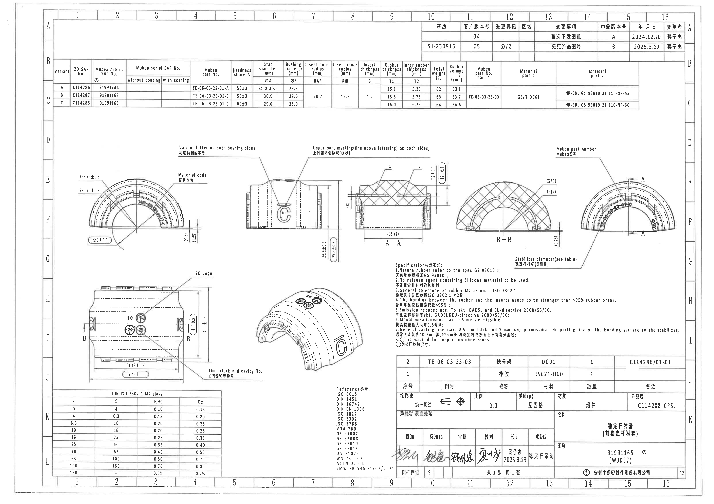

页面信息：PDF 渲染为 `outputs/20C114288_assets/images/page_1.png`，尺寸 4959 x 3505 px；以下 bbox 均为该整页 PNG 的像素坐标 `[x1, y1, x2, y2]`。

## object_1 - 修订履历表 / change history table

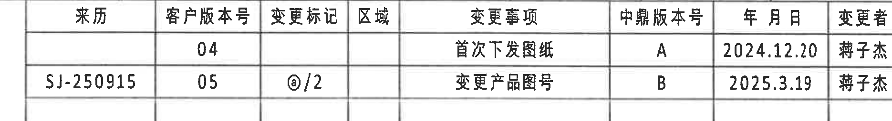

- 原图位置/视图名称：修订履历表 / change history table，page 1，bbox `[2875, 150, 4745, 405]`
- object_kind：`table`
- 边界归属说明：表格上方仅含图框网格编号的边缘；表格主体完整，未截断右侧“变更者”列。

原表还原：

| 来历 | 客户版本号 | 变更标记 | 区域 | 变更事项 | 中鼎版本号 | 年 月 日 | 变更者 |
| --- | --- | --- | --- | --- | --- | --- | --- |
|  | 04 |  |  | 首次下发图纸 | A | 2024.12.20 | 蒋子杰 |
| SJ-250915 | 05 | @/2 |  | 变更产品图号 | B | 2025.3.19 | 蒋子杰 |

提取表格：

| 提取项 | 原图数值或文本 | 含义说明 |
| --- | --- | --- |
| 表头 | 来历、客户版本号、变更标记、区域、变更事项、中鼎版本号、年 月 日、变更者 | 修订履历列名，定义版本来源、客户版本、变更标记、区域、事项、内部版本、日期和责任人。 |
| 修订记录 1 | 客户版本号 04；变更事项 首次下发图纸；中鼎版本号 A；日期 2024.12.20；变更者 蒋子杰 | 表示 A 版/客户 04 版本为首次下发。 |
| 修订记录 2 | 来历 SJ-250915；客户版本号 05；变更标记 @/2；变更事项 变更产品图号；中鼎版本号 B；日期 2025.3.19；变更者 蒋子杰 | 表示 B 版/客户 05 版本因产品图号变更而修订。 |

文本/上下文：

位于图纸右上 A-B 区域。object_kind=table。该表记录客户版本与中鼎版本变更历史；第一行是首次下发图纸，第二行是产品图号变更。边界归属：裁切只包含修订履历表的完整表头和两条记录，未归入下方变型表或标题栏。

## object_2 - 变型/材料参数表 / variant and material table

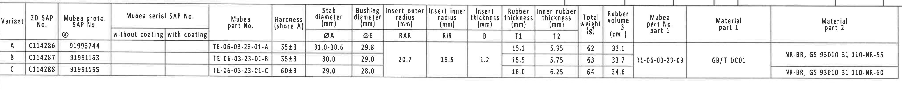

- 原图位置/视图名称：变型/材料参数表 / variant and material table，page 1，bbox `[375, 400, 4455, 810]`
- object_kind：`table`
- 边界归属说明：表格上边缘有图框线和少量空白；三行数据和所有列边框完整，未混入下方加工视图。

原表还原：

| Variant | ZD SAP No. | Mubea proto. SAP No. | Mubea serial SAP No. without coating | Mubea serial SAP No. with coating | Mubea part No. | Hardness (shore A) | ØA Stab diameter (mm) | ØE Bushing diameter (mm) | RAR Insert outer radius (mm) | RIR Insert inner radius (mm) | B Insert thickness (mm) | T1 Rubber thickness (mm) | T2 Inner rubber thickness (mm) | Total weight (g) | Rubber volume (cm³) | Mubea part No. part 1 | Material part 1 | Material part 2 |
| --- | --- | --- | --- | --- | --- | --- | --- | --- | --- | --- | --- | --- | --- | --- | --- | --- | --- | --- |
| A | C114286 | 91993744 |  |  | TE-06-03-23-01-A | 55±3 | 31.0-30.6 | 29.8 |  |  |  | 15.1 | 5.35 | 62 | 33.1 |  |  | NR-BR, GS 93010 31 110-NR-55 |
| B | C114287 | 91991163 |  |  | TE-06-03-23-01-B | 55±3 | 30.0 | 29.0 | 20.7 | 19.5 | 1.2 | 15.5 | 5.75 | 63 | 33.7 | TE-06-03-23-03 | GB/T DC01 | NR-BR, GS 93010 31 110-NR-55 |
| C | C114288 | 91991165 |  |  | TE-06-03-23-01-C | 60±3 | 29.0 | 28.0 |  |  |  | 16.0 | 6.25 | 64 | 34.6 |  |  | NR-BR, GS 93010 31 110-NR-60 |

提取表格：

| 提取项 | 原图数值或文本 | 含义说明 |
| --- | --- | --- |
| C114288 行 | Variant C；ZD SAP No. C114288；Mubea proto. SAP No. 91991165；Mubea part No. TE-06-03-23-01-C；Hardness 60±3；ØA 29.0；ØE 28.0；T1 16.0；T2 6.25；Total weight 64；Rubber volume 34.6；Material part 2 NR-BR, GS 93010 31 110-NR-60 | 当前图纸标题栏产品号为 C114288-CPSJ，对应变型 C 的主要尺寸和材料参数。 |
| 表内符号 ØA | 31.0-30.6 / 30.0 / 29.0 | 稳定杆杆径，右侧正视图写明 Stabilizer diameter(see table)，按 Variant 选用。 |
| 表内符号 ØE | 29.8 / 29.0 / 28.0 | 衬套直径，左侧正视图标注 ØE±0.3 对应此列。 |
| 表内符号 RAR/RIR | Variant B: RAR 20.7, RIR 19.5 | 插片外/内半径，在 B-B 剖面和表头中定义。 |
| 表内符号 B/T1/T2 | B=1.2；T1=15.1/15.5/16.0；T2=5.35/5.75/6.25 | B 是插片厚度；T1/T2 是橡胶厚度尺寸，对应 A-A 剖面标注。 |

文本/上下文：

位于图纸上方 B-C 区域。object_kind=table。该表给出 A/B/C 三个 Variant 的尺寸代码、硬度、直径、半径、厚度、重量、橡胶体积、材料和 Mubea 图号。边界归属：表格完整包含三行数据；其中 ØA、ØE、RAR、RIR、B、T1、T2 与各视图标注互相对应。

## object_3 - 左侧半圆正视图 / front arc view with radii and bushing diameter

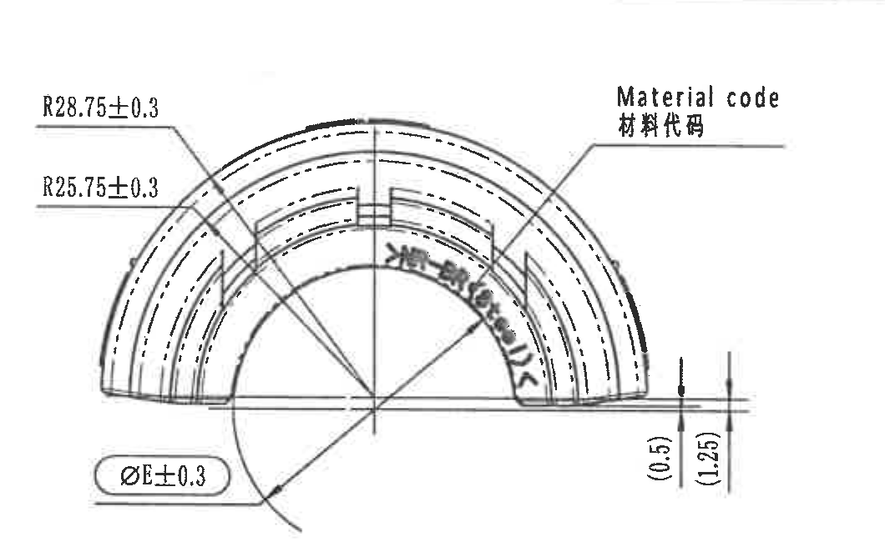

- 原图位置/视图名称：左侧半圆正视图 / front arc view with radii and bushing diameter，page 1，bbox `[500, 1100, 1560, 1750]`
- object_kind：`view`
- 边界归属说明：裁切包含 R28.75、R25.75、ØE 与右侧两个括号尺寸的完整箭头/引线；未把中部侧视图尺寸 26.5±0.3、29.5±0.3 归入本对象。

提取表格：

| 提取项 | 原图数值或文本 | 含义说明 |
| --- | --- | --- |
| 外弧半径 | R28.75±0.3 | 外侧弧形轮廓半径，带 ±0.3 公差。 |
| 内弧半径 | R25.75±0.3 | 内侧弧形轮廓半径，带 ±0.3 公差。 |
| 衬套直径 | ØE±0.3 | 直径符号 ØE，E 值需见上方变型表 Bushing diameter 列；±0.3 为本视图标注公差。 |
| 参考尺寸 | (0.5) | 括号内参考尺寸，位于右侧边缘竖向标注，表示局部边缘高度/间隙关系，仅供参考说明。 |
| 参考尺寸 | (1.25) | 括号内参考尺寸，位于右侧边缘竖向标注，表示局部边缘高度/间隙关系，仅供参考说明。 |
| 标识位置 | Material code / 材料代码 | 材料代码打印或成型标识位置的引线说明。 |

文本/上下文：

位于图纸左中 E-G 区域。该加工视图显示半圆橡胶套正面轮廓、内外弧半径、衬套直径和材料代码位置。括号尺寸 (0.5)、(1.25) 是参考尺寸，用于说明边缘台阶/间距关系，不作为独立检验公差尺寸。边界归属：右侧可见空白和尺寸线末端均属于本视图尺寸，未把中部侧视主体作为提取对象。

## object_4 - 中部侧视图 / side view with markings and overall height

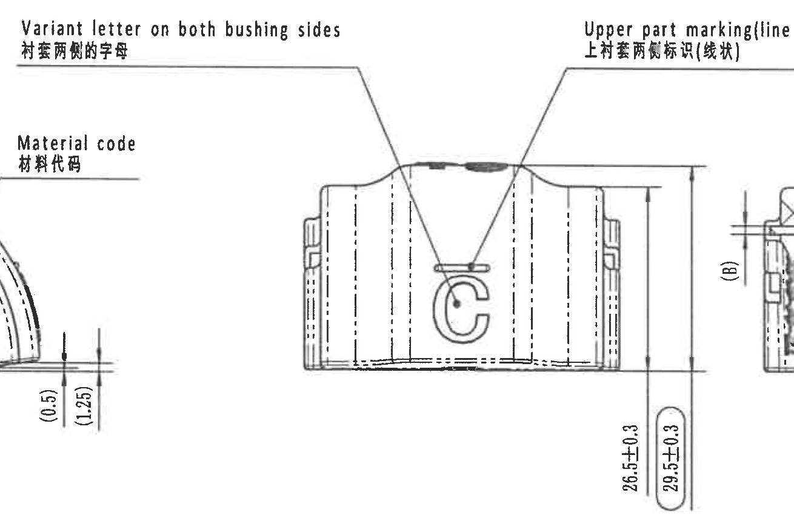

- 原图位置/视图名称：中部侧视图 / side view with markings and overall height，page 1，bbox `[1210, 980, 2520, 1840]`
- object_kind：`view`
- 边界归属说明：相邻左半圆的 (0.5)/(1.25) 和右侧 A-A 剖面局部可在边缘处出现，但不归入本对象；侧视图高度尺寸线和文字完整。

提取表格：

| 提取项 | 原图数值或文本 | 含义说明 |
| --- | --- | --- |
| 侧视高度 | 26.5±0.3 | 侧视图右侧较短竖向尺寸，表示内侧高度/局部高度，公差 ±0.3。 |
| 侧视总高度 | 29.5±0.3 | 侧视图右侧带椭圆圈的竖向尺寸，表示外侧总高度/包络高度，公差 ±0.3，是重点检验尺寸样式。 |
| 剖面厚度代号 | (B) | 括号内 B，指向插片厚度代号，具体数值见变型表 Insert thickness B。 |
| 标识说明 | Variant letter on both bushing sides / 衬套两侧的字母 | Variant 字母需在衬套两侧出现。 |
| 标识说明 | Upper part marking(line above lettering) on both sides / 上衬套两侧标识(线状) | 字母上方线状标识需在上衬套两侧出现。 |
| 标识说明 | Material code / 材料代码 | 材料代码标识位置。 |

文本/上下文：

位于图纸中部 D-G 区域。该加工视图说明侧面外形、两侧 Variant 字母、上衬套线状标识、材料代码位置和总高度尺寸。26.5±0.3 为内侧高度，29.5±0.3 为外侧总高度/包络高度。(B) 位于右侧相邻剖面切线附近，是表内插片厚度 B 的剖面位置提示；不归入左侧半圆正视图。边界归属：为保留两条上方长引线，裁切左/右边缘带有相邻视图片段；提取仅限本侧视图和紧贴其右侧的 26.5±0.3、29.5±0.3、(B)。

## object_5 - A-A 剖面视图 / section A-A

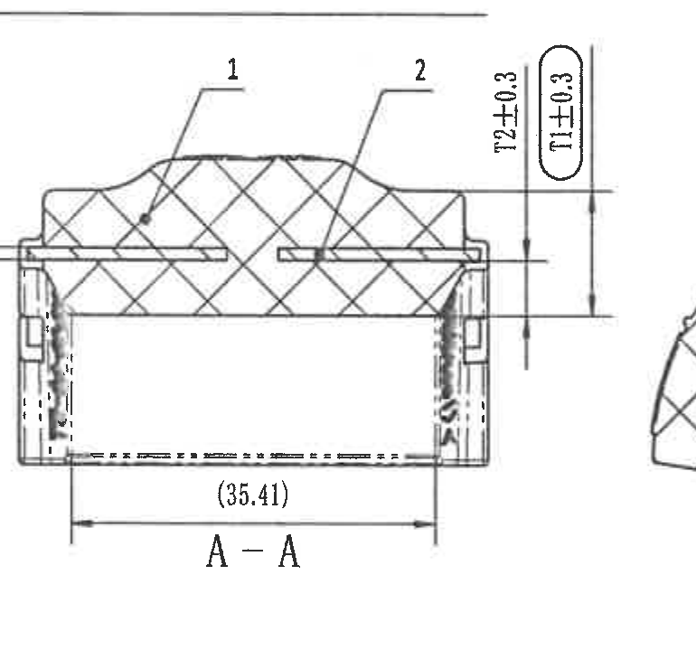

- 原图位置/视图名称：A-A 剖面视图 / section A-A，page 1，bbox `[2450, 1080, 3220, 1810]`
- object_kind：`section`
- 边界归属说明：裁切包含 T1/T2 竖向尺寸线、箭头、文字和底部 (35.41) 完整；右侧只有极少 B-B 边缘轮廓，不参与提取。

提取表格：

| 提取项 | 原图数值或文本 | 含义说明 |
| --- | --- | --- |
| BOM 标号 | 1 | 剖面中编号 1 指向橡胶件，见明细表序号 1。 |
| BOM 标号 | 2 | 剖面中编号 2 指向铁骨架/嵌件，见明细表序号 2。 |
| 内橡胶厚度 | T2±0.3 | T2 对应上方变型表 Inner rubber thickness；本剖面规定 ±0.3 公差。 |
| 橡胶厚度 | T1±0.3 | T1 对应上方变型表 Rubber thickness；椭圆圈标出，为检验尺寸样式，公差 ±0.3。 |
| 参考长度 | (35.41) | 括号内参考尺寸，表示剖面底部长度/间距关系，仅供参考；必须保留但不作为直接公差尺寸。 |
| 剖面名称 | A-A | 剖切视图名称。 |

文本/上下文：

位于图纸中部 E-G 区域。A-A 剖面显示橡胶和嵌件剖切关系，编号 1、2 对应下方 BOM 明细：1=橡胶 R5621-H60，2=铁骨架 DC01/TE-06-03-23-03。T2 和 T1 是橡胶厚度尺寸；(35.41) 为括号参考尺寸。边界归属：A-A 的尺寸不得归到中部侧视或 B-B 剖面。

## object_6 - B-B 剖面视图 / section B-B

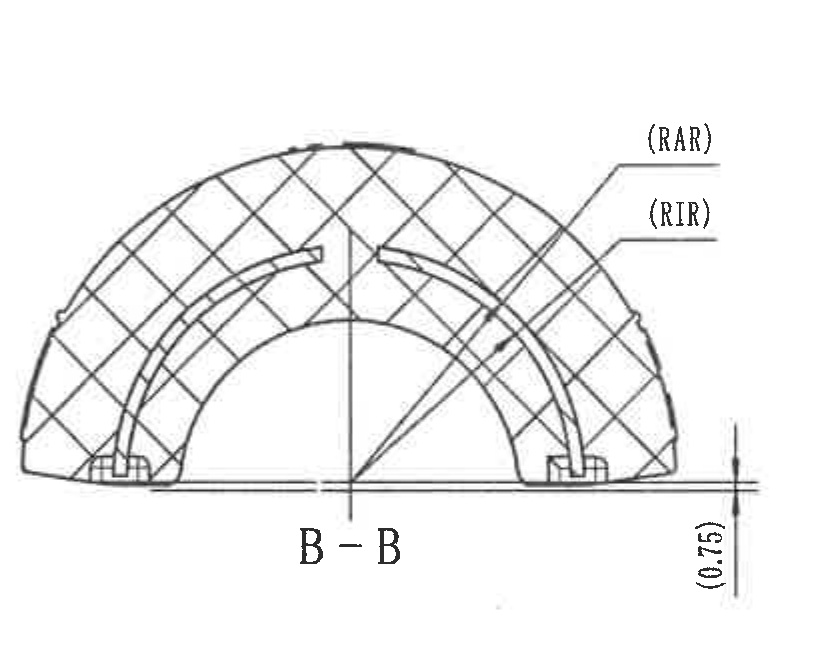

- 原图位置/视图名称：B-B 剖面视图 / section B-B，page 1，bbox `[3150, 1120, 3970, 1770]`
- object_kind：`section`
- 边界归属说明：裁切保留 RAR/RIR 引线、B-B 视图和 (0.75)；左侧可能有相邻 A-A 尺寸线末端，未作为本对象实体。

提取表格：

| 提取项 | 原图数值或文本 | 含义说明 |
| --- | --- | --- |
| 插片外半径代号 | (RAR) | 括号内代号，表示 Insert outer radius 的位置和含义；具体数值见变型表 RAR 列。 |
| 插片内半径代号 | (RIR) | 括号内代号，表示 Insert inner radius 的位置和含义；具体数值见变型表 RIR 列。 |
| 参考尺寸 | (0.75) | 括号内参考尺寸，位于右下竖向标注，说明局部边缘高度/余量关系。 |
| 剖面名称 | B-B | 剖切视图名称，对应下方俯视图中的 B-B 剖切标记。 |

文本/上下文：

位于图纸中右 E-G 区域。B-B 剖面显示弧形剖切结构和嵌件内外半径位置；RAR、RIR 与上方变型表 Insert outer radius / Insert inner radius 对应。(0.75) 为括号参考尺寸。边界归属：下方“Stabilizer diameter(see table)”引线箭头指向右侧正视图，虽靠近 B-B，不归入本剖面提取。

## object_7 - 右侧半圆正视图 / front arc view with A-A cut and diameter note

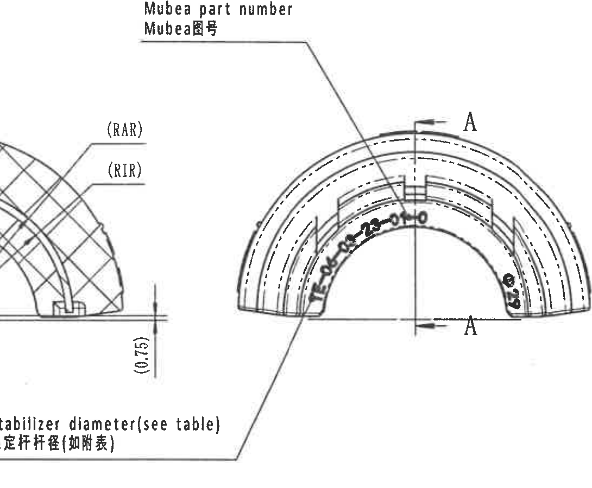

- 原图位置/视图名称：右侧半圆正视图 / front arc view with A-A cut and diameter note，page 1，bbox `[3600, 1020, 4690, 1920]`
- object_kind：`view`
- 边界归属说明：为完整保留 Stabilizer diameter 的文字、长引线和箭头，裁切左侧带入 B-B 局部；右侧图框坐标栏已排除。

提取表格：

| 提取项 | 原图数值或文本 | 含义说明 |
| --- | --- | --- |
| 剖切标识 | A / A | 正视图上的 A-A 剖切位置，上下箭头和字母 A 指示 object_5 剖面来源。 |
| 图号标识 | Mubea part number / Mubea图号 | 指向正面上部印字位置，用于 Mubea 图号标识。 |
| 稳定杆杆径 | Stabilizer diameter(see table) / 稳定杆杆径(如附表) | 该尺寸不在视图内给出具体数值，需查上方变型表 ØA 列；Variant C 为 29.0。 |
| 边缘可见代号 | (RAR), (RIR), (0.75) | 这些属于左侧 B-B 剖面附近的可见边缘标注，因稳定杆杆径引线需要保留而进入裁切，不作为右侧视图新增尺寸。 |

文本/上下文：

位于图纸右中 E-G 区域。该视图显示半圆正面、A-A 剖切位置、Mubea 图号标识位置和稳定杆杆径需查表。稳定杆杆径对应上方变型表 ØA/Stab diameter 列；当前 C114288/Variant C 的 ØA 为 29.0。边界归属：左侧可见 B-B 剖面局部和 RAR/RIR/(0.75) 边缘，RAR/RIR/(0.75) 的尺寸解释以 object_6 为准；本对象提取 A-A 剖切标识、Mubea part number 与 Stabilizer diameter 引线。

## object_8 - 下方俯视图 / plan view with B-B cut, logo and cavity marks

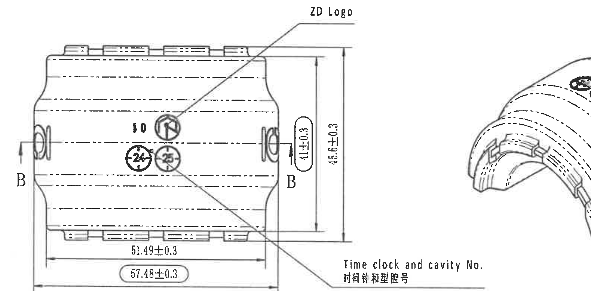

- 原图位置/视图名称：下方俯视图 / plan view with B-B cut, logo and cavity marks，page 1，bbox `[530, 1870, 2110, 2650]`
- object_kind：`view`
- 边界归属说明：裁切包含 B-B 标识、所有四个尺寸的完整尺寸线和文字；右侧等轴图局部仅为相邻视图片段，不归入本对象提取。

提取表格：

| 提取项 | 原图数值或文本 | 含义说明 |
| --- | --- | --- |
| 剖切标识 | B / B | 俯视图左右两侧 B-B 剖切位置，对应 object_6。 |
| 宽度尺寸 | 41±0.3 | 右侧较短竖向尺寸，带椭圆圈，表示局部宽度/内宽，公差 ±0.3。 |
| 总宽度 | 45.6±0.3 | 右侧较长竖向尺寸，表示总宽度/外宽，公差 ±0.3。 |
| 长度尺寸 | 51.49±0.3 | 底部上方水平尺寸，表示局部长/安装相关长度，公差 ±0.3。 |
| 总长度 | 57.48±0.3 | 底部带椭圆圈水平尺寸，表示总长度/外形长度，公差 ±0.3。 |
| 标识 | ZD Logo | 引线指向上表面 ZD 标志位置。 |
| 标识 | Time clock and cavity No. / 时间钟和型腔号 | 引线指向圆形时间钟与型腔号标记位置。 |
| 可见标记 | 10, 24, 25 | 圆形时间钟/型腔号附近可见的模具/型腔数字标记。 |

文本/上下文：

位于图纸左下 H-J 区域。该加工视图显示俯视/展开方向、B-B 剖切位置、ZD Logo、时间钟和型腔号、长度和宽度尺寸。57.48±0.3 带椭圆圈，为检验尺寸样式；41±0.3 也带椭圆圈。边界归属：右侧为完整保留 Time clock and cavity No. 引线而带入等轴图边缘，等轴图信息另归 object_9。

## object_9 - 等轴测外观视图 / isometric appearance view

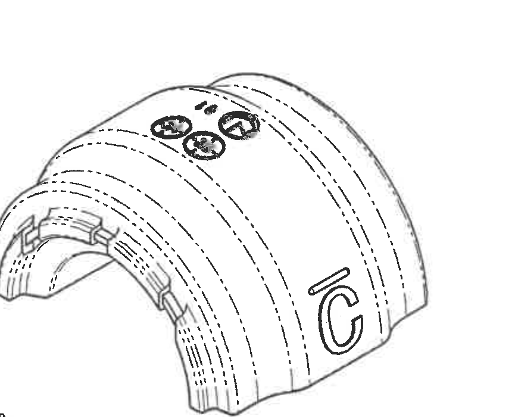

- 原图位置/视图名称：等轴测外观视图 / isometric appearance view，page 1，bbox `[1800, 1880, 2670, 2580]`
- object_kind：`detail`
- 边界归属说明：等轴视图完整，未裁掉主体轮廓；没有独立尺寸线被截断。

提取表格：

| 提取项 | 原图数值或文本 | 含义说明 |
| --- | --- | --- |
| 外观标识 | C 字母 | 与 Variant C 相对应的字母标识位置。 |
| 外观标识 | 线状标识 | 位于字母上方，与侧视图上方线状标识说明一致。 |
| 外观标识 | 时间钟/型腔号圆形标记 | 与下方俯视图中的 Time clock and cavity No. 对应。 |
| 外观轮廓 | 弧形槽线与内侧卡扣/嵌件结构 | 说明三维外观和局部结构位置，不给出新增尺寸。 |

文本/上下文：

位于图纸中下 H-I 区域。该局部/外观视图用于显示零件三维外观和标识在曲面上的实际位置，没有独立数值尺寸。边界归属：只提取等轴图中可见标识和轮廓；左下偶见相邻文字尾部不作为本对象内容。

## object_10 - Specification 技术要求 / NOTES

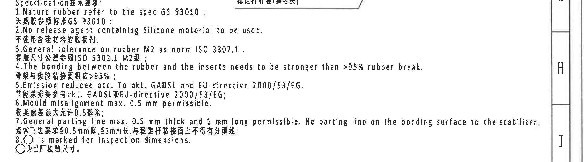

- 原图位置/视图名称：Specification 技术要求 / NOTES，page 1，bbox `[2690, 1835, 4890, 2445]`
- object_kind：`notes`
- 边界归属说明：NOTES 文本 1-8 条完整；上方有稳定杆杆径引线末端，右侧有图框坐标栏 H/I，均不归入 NOTES 实体。

提取表格：

| 提取项 | 原图数值或文本 | 含义说明 |
| --- | --- | --- |
| 技术要求 1 | Nature rubber refer to the spec GS 93010 / 天然胶参照标准 GS 93010 | 规定天然橡胶材料参考规范。 |
| 技术要求 2 | No release agent containing Silicone material to be used / 不使用含硅材料的脱模剂 | 禁止含硅脱模剂。 |
| 技术要求 3 | General tolerance on rubber M2 as norm ISO 3302.1 / 橡胶尺寸公差参照 ISO 3302.1 M2级 | 未单独标注的橡胶尺寸按 ISO 3302.1 M2。 |
| 技术要求 4 | Bonding ... stronger than >95% rubber break / 骨架与橡胶粘接面积应 >95% | 橡胶与嵌件粘接强度要求，以 >95% 橡胶破坏为判据。 |
| 技术要求 5 | Emission reduced acc. to akt. GADSL and EU-directive 2000/53/EG | 需满足 GADSL 和 EU 2000/53/EG 相关要求。 |
| 技术要求 6 | Mould misalignment max. 0.5 mm permissible / 模具错差最大允许 0.5 mm | 模具错位最大允许值。 |
| 技术要求 7 | General parting line max. 0.5 mm thick and 1 mm long permissible. No parting line on the bonding surface to the stabilizer. | 飞边/分型线厚度、长度限制；与稳定杆粘接面不得有分型线。 |
| 技术要求 8 | ○ is marked for inspection dimensions / ○为出厂检验尺寸 | 圆圈标注的尺寸为出厂检验尺寸；如 T1±0.3、29.5±0.3、41±0.3、57.48±0.3 等。 |

文本/上下文：

位于图纸中下偏右 H-I 区域。object_kind=notes。该区域为 1-8 条技术要求，含材料、脱模剂、通用公差、粘接强度、法规/排放、模具错差、飞边/分型线和检验尺寸圆圈标识说明。边界归属：为完整保留第 7 条英文长句，右侧带入图框坐标栏 H/I；坐标栏不是 NOTES 内容。

## object_11 - Reference 参考标准列表

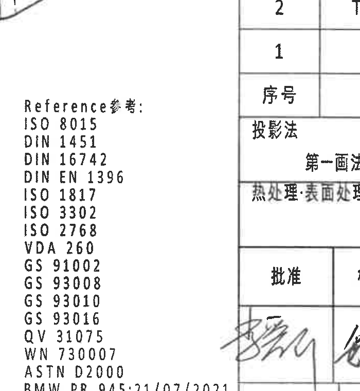

- 原图位置/视图名称：Reference 参考标准列表，page 1，bbox `[2290, 2500, 2990, 3260]`
- object_kind：`notes`
- 边界归属说明：参考列表左列完整；因底部 BMW PR 编号较长，裁切接近标题栏区域，标题栏字段不作为本对象提取。

提取表格：

| 提取项 | 原图数值或文本 | 含义说明 |
| --- | --- | --- |
| 参考标准 | ISO 8015 | 参考标准条目。 |
| 参考标准 | DIN 1451 | 参考标准条目。 |
| 参考标准 | DIN 16742 | 参考标准条目。 |
| 参考标准 | DIN EN 1396 | 参考标准条目。 |
| 参考标准 | ISO 1817 | 参考标准条目。 |
| 参考标准 | ISO 3302 | 参考标准条目。 |
| 参考标准 | ISO 2768 | 参考标准条目。 |
| 参考标准 | VDA 260 | 参考标准条目。 |
| 参考标准 | GS 91002 | 参考标准条目。 |
| 参考标准 | GS 93008 | 参考标准条目。 |
| 参考标准 | GS 93010 | 参考标准条目。 |
| 参考标准 | GS 93016 | 参考标准条目。 |
| 参考标准 | QV 31075 | 参考标准条目。 |
| 参考标准 | WN 730007 | 参考标准条目。 |
| 参考标准 | ASTM D2000 | 参考标准条目。 |
| 参考标准 | BMW PR 945:21/07/2021 | 参考标准条目。 |

文本/上下文：

位于图纸下中偏左 J-L 区域。列出适用参考标准。边界归属：右侧靠近标题栏，但提取只限 Reference 标准列表。

## object_12 - DIN ISO 3302-1 M2 class 公差表

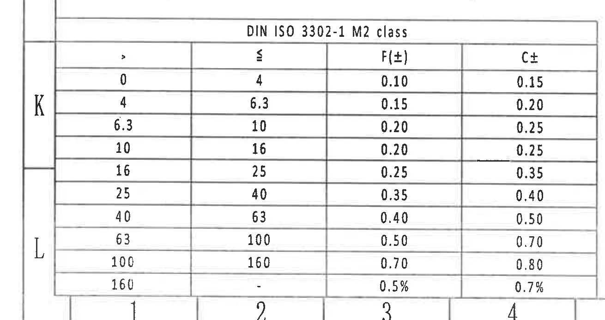

- 原图位置/视图名称：DIN ISO 3302-1 M2 class 公差表，page 1，bbox `[245, 2670, 1555, 3365]`
- object_kind：`table`
- 边界归属说明：裁切包含完整表格网格；底部有图框编号边缘但不作为表格内容。

原表还原：

| > | ≤ | F(±) | C± |
| --- | --- | --- | --- |
| 0 | 4 | 0.10 | 0.15 |
| 4 | 6.3 | 0.15 | 0.20 |
| 6.3 | 10 | 0.20 | 0.25 |
| 10 | 16 | 0.20 | 0.25 |
| 16 | 25 | 0.25 | 0.35 |
| 25 | 40 | 0.35 | 0.40 |
| 40 | 63 | 0.40 | 0.50 |
| 63 | 100 | 0.50 | 0.70 |
| 100 | 160 | 0.70 | 0.80 |
| 160 | - | 0.5% | 0.7% |

提取表格：

| 提取项 | 原图数值或文本 | 含义说明 |
| --- | --- | --- |
| 表名 | DIN ISO 3302-1 M2 class | 橡胶件通用尺寸公差表。 |
| 列头 | >、≤、F(±)、C± | 尺寸范围下限/上限及 F、C 公差等级。 |
| 范围 0-4 | F±0.10, C±0.15 | 尺寸 >0 且 ≤4 的通用公差。 |
| 范围 4-6.3 | F±0.15, C±0.20 | 尺寸 >4 且 ≤6.3 的通用公差。 |
| 范围 6.3-10 | F±0.20, C±0.25 | 尺寸 >6.3 且 ≤10 的通用公差。 |
| 范围 10-16 | F±0.20, C±0.25 | 尺寸 >10 且 ≤16 的通用公差。 |
| 范围 16-25 | F±0.25, C±0.35 | 尺寸 >16 且 ≤25 的通用公差。 |
| 范围 25-40 | F±0.35, C±0.40 | 尺寸 >25 且 ≤40 的通用公差。 |
| 范围 40-63 | F±0.40, C±0.50 | 尺寸 >40 且 ≤63 的通用公差。 |
| 范围 63-100 | F±0.50, C±0.70 | 尺寸 >63 且 ≤100 的通用公差。 |
| 范围 100-160 | F±0.70, C±0.80 | 尺寸 >100 且 ≤160 的通用公差。 |
| 范围 >160 | F±0.5%, C±0.7% | 尺寸大于 160 的百分比公差。 |

文本/上下文：

位于图纸左下 J-L 区域。object_kind=table。该表给出 DIN ISO 3302-1 M2 class 橡胶尺寸通用公差范围，与 NOTES 第 3 条对应。边界归属：表格完整包含标题、列头和 10 行范围；未把上方俯视图或底部图框编号作为表格数据。

## object_13 - BOM/明细表与图纸基础字段上半区

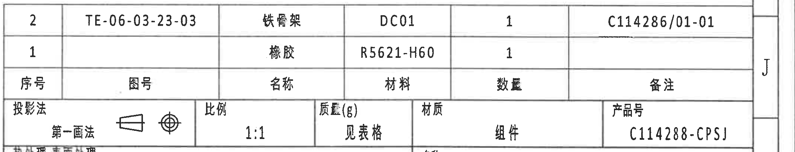

- 原图位置/视图名称：BOM/明细表与图纸基础字段上半区，page 1，bbox `[2745, 2460, 4875, 2870]`
- object_kind：`table`
- 边界归属说明：裁切包含 BOM 表头、两条明细和上半标题栏字段完整；右侧图框坐标栏边缘不作为字段。

原表还原：

| 序号 | 图号 | 名称 | 材料 | 数量 | 备注 |
| --- | --- | --- | --- | --- | --- |
| 2 | TE-06-03-23-03 | 铁骨架 | DC01 | 1 | C114286/01-01 |
| 1 |  | 橡胶 | R5621-H60 | 1 |  |

提取表格：

| 提取项 | 原图数值或文本 | 含义说明 |
| --- | --- | --- |
| BOM 序号 2 | 图号 TE-06-03-23-03；名称 铁骨架；材料 DC01；数量 1；备注 C114286/01-01 | A-A 剖面中编号 2 对应铁骨架/嵌件。 |
| BOM 序号 1 | 名称 橡胶；材料 R5621-H60；数量 1 | A-A 剖面中编号 1 对应橡胶。 |
| 投影法 | 第一画法 | 图纸投影方法。 |
| 比例 | 1:1 | 图纸比例。 |
| 质量(g) | 见表格 | 重量需查看上方变型表 Total weight。 |
| 材质 | 组件 | 整体材质字段。 |
| 产品号 | C114288-CPSJ | 产品号/总成号字段。 |
| 热处理/表面处理 | 热处理: 表面处理 | 标题栏处理字段，未填写具体处理值。 |

文本/上下文：

位于图纸右下 I-K 区域。object_kind=table。该表上部为 BOM 明细，两行物料分别是铁骨架和橡胶；下部包含投影法、比例、质量、材质、产品号和热处理/表面处理字段。边界归属：本对象是标题栏上半区/明细表，不包含下半区签字审批和公司信息。

## object_14 - 标题栏下半区 / title block lower area

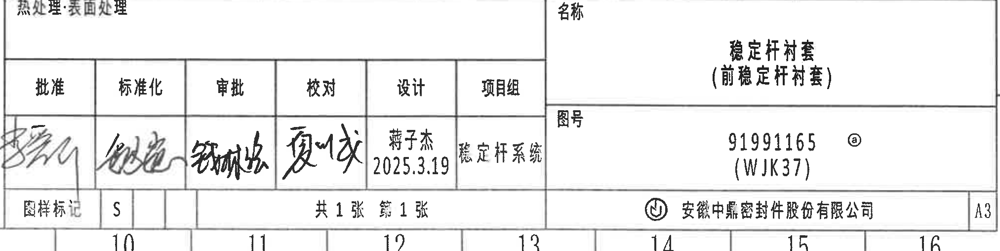

- 原图位置/视图名称：标题栏下半区 / title block lower area，page 1，bbox `[2745, 2860, 4770, 3370]`
- object_kind：`title_block`
- 边界归属说明：裁切包含下半标题栏主要字段；上边缘只保留上方处理字段边线，BOM 内容不归入本对象。

提取表格：

| 提取项 | 原图数值或文本 | 含义说明 |
| --- | --- | --- |
| 审批栏 | 批准、标准化、审批、校对、设计、项目组 | 签字/职责栏。 |
| 设计 | 蒋子杰 2025.3.19 | 设计者及日期。 |
| 项目组 | 稳定杆系统 | 项目组字段。 |
| 名称 | 稳定杆衬套（前稳定杆衬套） | 零件名称。 |
| 图号 | 91991165 @ (WJK37) | 图纸图号字段。 |
| 图样标记 | S | 图样标记。 |
| 页数 | 共 1 张 第 1 张 | 图纸总页数和当前页。 |
| 公司 | 安徽中鼎密封件股份有限公司 | 出图单位。 |
| 图幅 | A3 | 图幅尺寸。 |

文本/上下文：

位于图纸右下 K-L 区域。object_kind=title_block。该标题栏下半区包含审批/签字栏、设计者和日期、项目组、名称、图号、图样标记、页数、公司和图幅。边界归属：不包含上方 BOM 明细；右侧外框坐标栏已尽量排除。

## 裁切检查记录

| 对象 | 检查结果 |
| --- | --- |
| object_1 | 完整包含修订表表头、两条记录、年/月/日和变更者列；无边缘文字裁断。 |
| object_2 | 完整包含变型表全部列、三行数据和材料字段；未混入加工视图。 |
| object_3 | 完整包含 R28.75±0.3、R25.75±0.3、ØE±0.3、(0.5)、(1.25) 及材料代码引线；未把侧视高度尺寸归入。 |
| object_4 | 完整包含侧视主体、两条上方标识引线、26.5±0.3、29.5±0.3、(B)；边缘相邻视图片段不参与提取。 |
| object_5 | 完整包含 A-A 剖面、1/2 指引、T2±0.3、T1±0.3、(35.41)；未将 B-B 尺寸归入。 |
| object_6 | 完整包含 B-B 剖面、(RAR)、(RIR)、(0.75)；稳定杆杆径引线未作为本对象尺寸。 |
| object_7 | 完整包含右侧正视图、A-A 剖切标记、Mubea part number 引线、Stabilizer diameter 文字和引线；左侧 B-B 片段仅为边界交叠。 |
| object_8 | 完整包含俯视图、B-B 标识、ZD Logo、Time clock and cavity No.、41±0.3、45.6±0.3、51.49±0.3、57.48±0.3；右侧等轴图边缘不参与提取。 |
| object_9 | 完整包含等轴测主体和可见标识；无尺寸线被截断。 |
| object_10 | 完整包含 NOTES 1-8 条，特别是第 7 条长英文；右侧图框坐标栏不是 NOTES 内容。 |
| object_11 | 完整包含 Reference 标准列表；靠近标题栏的边缘内容不作为参考项。 |
| object_12 | 完整包含 DIN ISO 3302-1 M2 表头和全部公差行；表格边框完整。 |
| object_13 | 完整包含 BOM 两行、表头及比例/质量/材质/产品号等上半标题栏字段。 |
| object_14 | 完整包含下半标题栏审批、名称、图号、页数、公司、图幅字段；未把 BOM 作为本对象内容。 |
