# 20C114289 内容识别与裁切结果

整页渲染图：`outputs/20C114289_assets/images/page_1.png`  
页面尺寸：4959 x 3505 px。bbox 格式为 `[x, y, width, height]`。

## object_1 修订履历表 / revision history

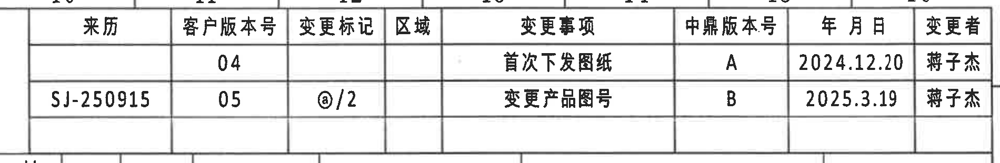

原图位置/视图名称：页面右上角 A-B 行、10-16 列附近；bbox `[2865, 120, 1900, 310]`。

| 来历 | 客户版本号 | 变更标记 | 区域 | 变更事项 | 中鼎版本号 | 年月日 | 变更者 |
|---|---|---|---|---|---|---|---|
|  | 04 |  |  | 首次下发图纸 | A | 2024.12.20 | 蒋子杰 |
| SJ-250915 | 05 | @/2 |  | 变更产品图号 | B | 2025.3.19 | 蒋子杰 |

| 提取项 | 原图数值或文本 | 含义说明 |
|---|---|---|
| 客户版本号 | 04, 05 | 两次客户版本记录。 |
| 变更标记 | @/2 | 第二条修订的变更标识。 |
| 中鼎版本号 | A, B | 内部版本由 A 更新到 B。 |
| 年月日 | 2024.12.20; 2025.3.19 | 修订日期。 |
| 变更事项 | 首次下发图纸; 变更产品图号 | 两条修订说明。 |

边界归属说明：仅提取表格内修订履历；下方参数表另列为 object_2。

## object_2 变型参数和材料表 / variant parameter and material table

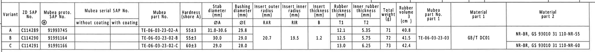

原图位置/视图名称：页面上方 B-C 行横跨 1-16 列；bbox `[350, 395, 4120, 365]`。

| Variant | ZD SAP No. | Mubea proto. SAP No. @ | Mubea serial SAP No. without coating | Mubea serial SAP No. with coating | Mubea part No. | Hardness (shore A) | Stab diameter ØA (mm) | Bushing diameter ØE (mm) | Insert outer radius RAR (mm) | Insert inner radius RIR (mm) | Insert thickness B (mm) | Rubber thickness T1 (mm) | Inner rubber thickness T2 (mm) | Total weight (g) | Rubber volume (cm3) | Mubea part No. part 1 | Material part 1 | Material part 2 |
|---|---|---|---|---|---|---|---|---|---|---|---|---|---|---|---|---|---|---|
| A | C114289 | 91993745 |  |  | TE-06-03-23-02-A | 55±3 | 31.0-30.6 | 29.8 |  |  |  | 12.1 | 5.35 | 71 | 40.8 |  | GB/T DC01 | NR-BR, GS 93010 31 110-NR-55 |
| B | C114290 | 91991164 |  |  | TE-06-03-23-02-B | 55±3 | 30.0 | 29.0 | 20.7 | 19.5 | 1.2 | 12.5 | 5.75 | 72 | 41.5 | TE-06-03-23-03 | GB/T DC01 | NR-BR, GS 93010 31 110-NR-55 |
| C | C114291 | 91991166 |  |  | TE-06-03-23-02-C | 60±3 | 29.0 | 28.0 |  |  |  | 13.0 | 6.25 | 73 | 42.4 |  |  | NR-BR, GS 93010 31 110-NR-60 |

| 提取项 | 原图数值或文本 | 含义说明 |
|---|---|---|
| ØA | 31.0-30.6 / 30.0 / 29.0 | 稳定杆杆径，供 B-B 和右上标识视图的 “Stabilizer diameter (see table)” 使用。 |
| ØE | 29.8 / 29.0 / 28.0 | 衬套直径，供左上正视图的 `ØE±0.3` 使用。 |
| RAR / RIR | 20.7 / 19.5 | 外/内嵌件半径，B 变型给出，B-B 视图以 `(RAR)/(RIR)` 标注。 |
| B | 1.2 | 插入件厚度，A-A 剖视以 `(B)` 标注。 |
| T1 / T2 | 12.1/5.35; 12.5/5.75; 13.0/6.25 | 橡胶厚度和内橡胶厚度，A-A 剖视以 `T1±0.3`、`T2±0.3` 标注。 |

边界归属说明：对象为整张参数/材料表；其下方视图引线文字不纳入本表格字段。

## object_3 左上正视图 / front view with material code

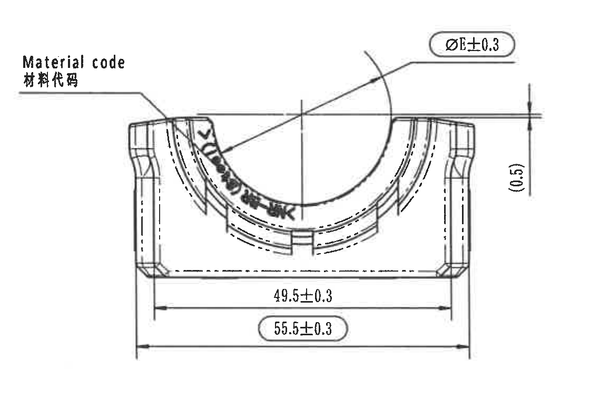

原图位置/视图名称：左侧 D-F 行、1-5 列附近；bbox `[420, 900, 1120, 760]`。

| 提取项 | 原图数值或文本 | 含义说明 |
|---|---|---|
| 材料代码标注 | Material code / 材料代码 | 指向弧面附近的材料代码标记位置。 |
| 直径符号尺寸 | ØE±0.3 | 衬套直径尺寸，ØE 的变型值见 object_2 参数表，公差 ±0.3。 |
| 参考尺寸 | (0.5) | 括号内参考/提示尺寸，位于右侧竖向标注，不作为直接加工主控尺寸。 |
| 宽度尺寸 | 49.5±0.3 | 正视图下方内侧宽度/功能宽度尺寸。 |
| 带圈检验尺寸 | 55.5±0.3 | 正视图下方外侧宽度，带圈表示出厂检验尺寸，见 NOTES 第 8 条。 |

边界归属说明：裁切完整包含 `Material code`、`ØE±0.3`、`(0.5)` 和下方两条宽度尺寸；未混入下方俯视图尺寸。

## object_4 A 字母侧视图 / side view with variant letter

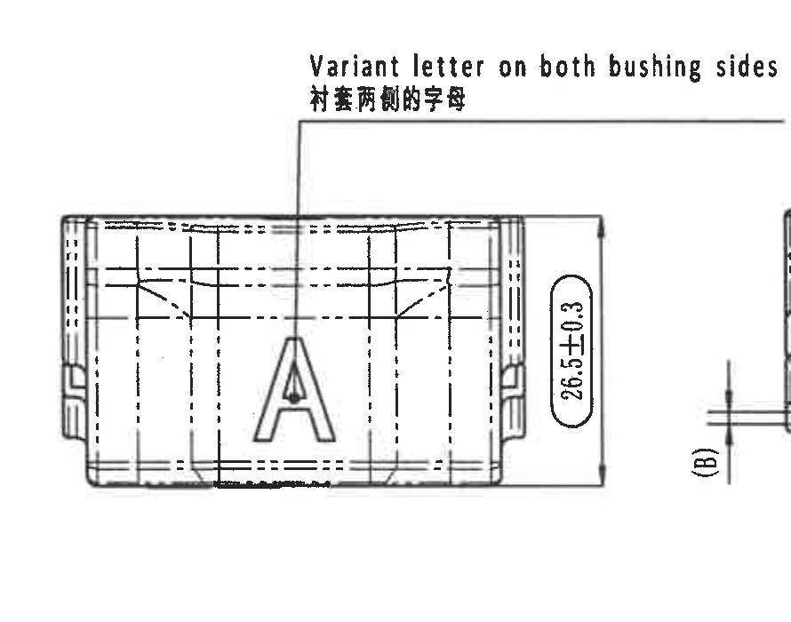

原图位置/视图名称：中上部 D-F 行、6-8 列附近；bbox `[1550, 880, 890, 700]`。

| 提取项 | 原图数值或文本 | 含义说明 |
|---|---|---|
| 字母要求 | Variant letter on both bushing sides / 衬套两侧的字母 | 说明衬套两侧需带变型字母。 |
| 变型字母 | A | 当前示例变型字母。 |
| 竖向尺寸 | 26.5±0.3 | 该侧视图外形高度/厚度方向尺寸。 |

边界归属说明：右缘为保持 `26.5±0.3` 完整尺寸线，能看到相邻 A-A 剖视的 `(B)` 边界片段；该 `(B)` 不归属本对象，已归入 object_5。

## object_5 A-A 剖视图 / section A-A

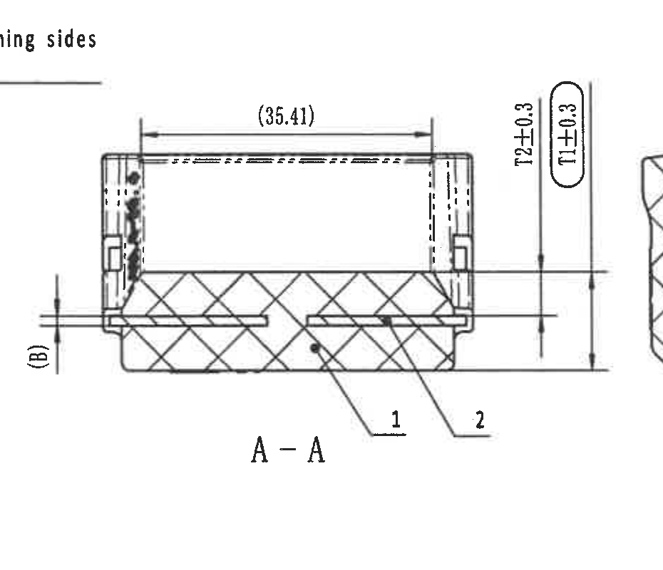

原图位置/视图名称：中上部 E-F 行、8-11 列附近；bbox `[2290, 900, 930, 800]`。

| 提取项 | 原图数值或文本 | 含义说明 |
|---|---|---|
| 剖视名称 | A-A | 与右上正视图中的 A-A 剖切线对应。 |
| 参考长度 | (35.41) | 括号内参考长度尺寸，位于剖视图顶部。 |
| 内橡胶厚度 | T2±0.3 | T2 实际值见参数表，公差 ±0.3。 |
| 橡胶厚度检验尺寸 | 带圈 T1±0.3 | T1 实际值见参数表；带圈表示检验尺寸。 |
| 插入件厚度符号 | (B) | 括号内符号，实际插入件厚度见参数表 B 列。 |
| 件号引线 | 1, 2 | 对应 BOM：1 为橡胶，2 为铁骨架。 |

边界归属说明：裁切包含 A-A 剖视、顶部参考长度、右侧 T1/T2、左侧 `(B)` 和件号 1/2 引线；右侧 B-B 的截面图形不作为本对象内容提取。

## object_6 B-B 剖视图 / section B-B

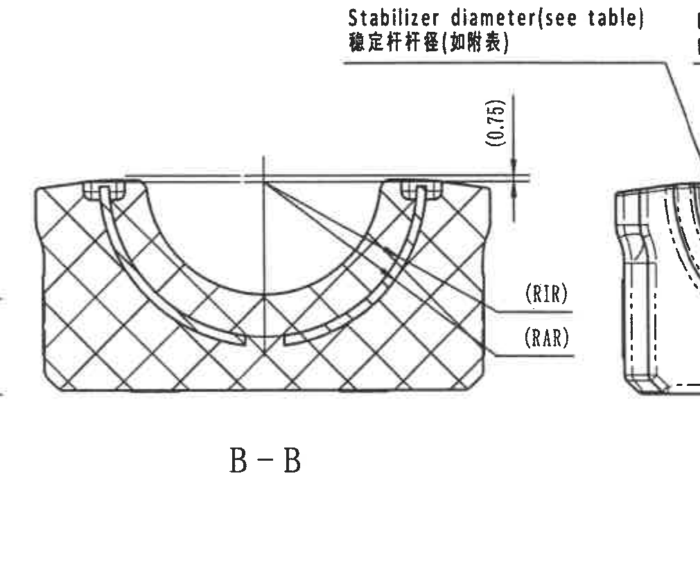

原图位置/视图名称：中上部 D-F 行、11-13 列附近；bbox `[3140, 850, 1010, 830]`。

| 提取项 | 原图数值或文本 | 含义说明 |
|---|---|---|
| 剖视名称 | B-B | 与俯视图两侧 B-B 剖切标识对应。 |
| 稳定杆直径 | Stabilizer diameter (see table) / 稳定杆杆径(如附表) | 直径值引用参数表 ØA。 |
| 参考尺寸 | (0.75) | 括号内参考/提示尺寸，位于顶部右侧竖向标注。 |
| 内半径符号 | (RIR) | 插入件内半径，实际值见参数表 RIR。 |
| 外半径符号 | (RAR) | 插入件外半径，实际值见参数表 RAR。 |

边界归属说明：顶部引出文字与右侧视图距离近，裁切以完整保留文字和箭头为准；仅提取 B-B 剖视的 `(0.75)/(RIR)/(RAR)` 和稳定杆直径引用。

## object_7 右上 A-A 标识视图 / right front view with A-A cutting line

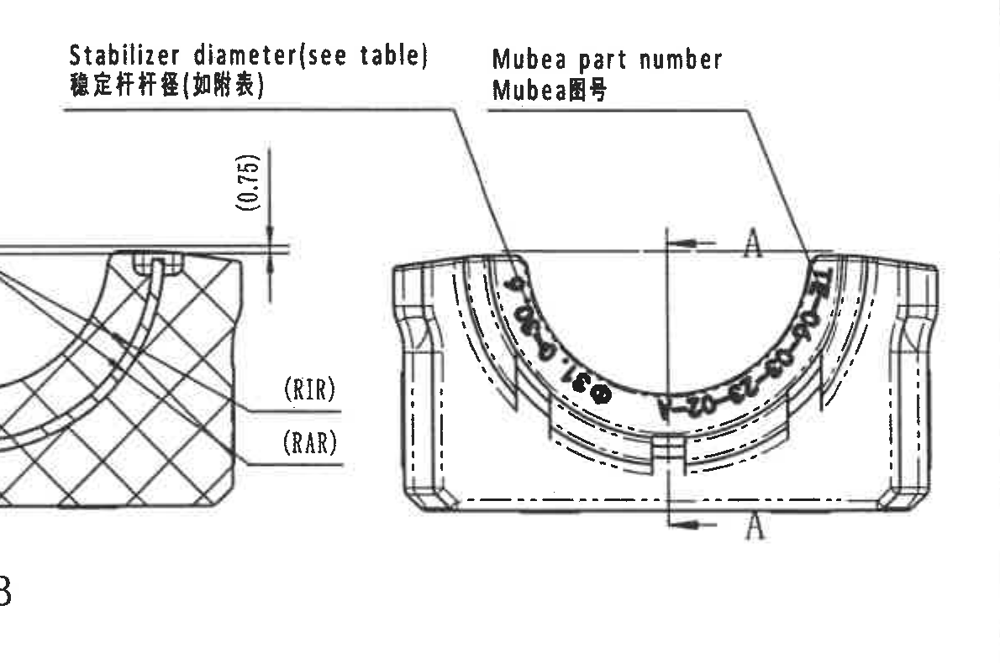

原图位置/视图名称：右上 D-F 行、13-16 列附近；bbox `[3560, 810, 1190, 790]`。

| 提取项 | 原图数值或文本 | 含义说明 |
|---|---|---|
| 稳定杆直径引出 | Stabilizer diameter (see table) / 稳定杆杆径(如附表) | 指向内弧/稳定杆接触区域，直径值引用参数表 ØA。 |
| 零件号标识 | Mubea part number / Mubea图号 | 指向弧面上的 Mubea 图号/零件号标识位置。 |
| 剖切标识 | A-A | 该视图中上下两个 A 标识给出 A-A 剖视切线。 |
| 弧面标识 | 91993745 @ | 弧面可见产品图号/标识，与标题栏图号一致。 |

边界归属说明：左侧可见来自 B-B 剖视的 `(0.75)/(RIR)/(RAR)` 片段，这是相邻对象标注，不归入本视图提取项；本对象只提取 A-A 剖切和 Mubea 图号相关信息。

## object_8 左下俯视图 / top view with B-B markers

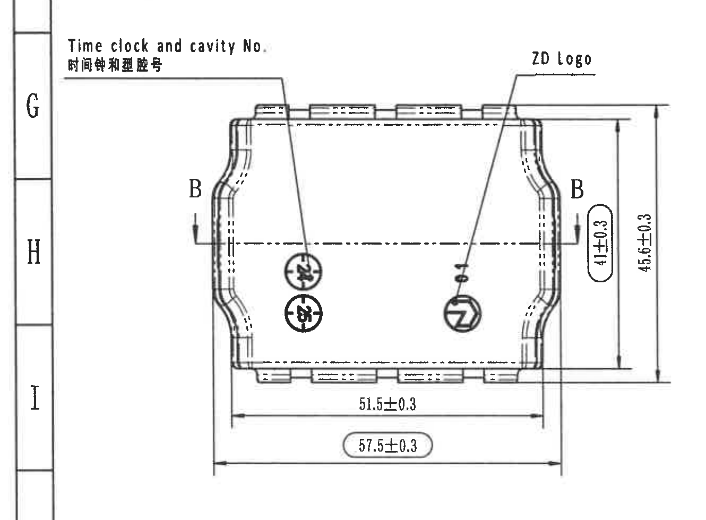

原图位置/视图名称：左下 G-I 行、1-5 列附近；bbox `[270, 1600, 1330, 980]`。

| 提取项 | 原图数值或文本 | 含义说明 |
|---|---|---|
| 时钟/型腔号 | Time clock and cavity No. / 时钟和型腔号 | 指向两个圆形时钟/型腔标识。 |
| ZD 标识 | ZD Logo | 指向右侧圆形 ZD logo 位置。 |
| 剖切标识 | B, B | 左右两处 B-B 剖切位置，对应 object_6。 |
| 带圈竖向尺寸 | 41±0.3 | 带圈检验尺寸，位于右侧内侧竖向尺寸。 |
| 总高度 | 45.6±0.3 | 俯视图右侧总高度/外形高度。 |
| 长度尺寸 | 51.5±0.3 | 俯视图下方内部/功能长度尺寸。 |
| 带圈总长度 | 57.5±0.3 | 下方外侧总长度，带圈表示检验尺寸。 |

边界归属说明：裁切已向左扩展以完整包含 `Time clock and cavity No.` 文字；所有尺寸线和箭头均完整。

## object_9 等轴测视图 / isometric view

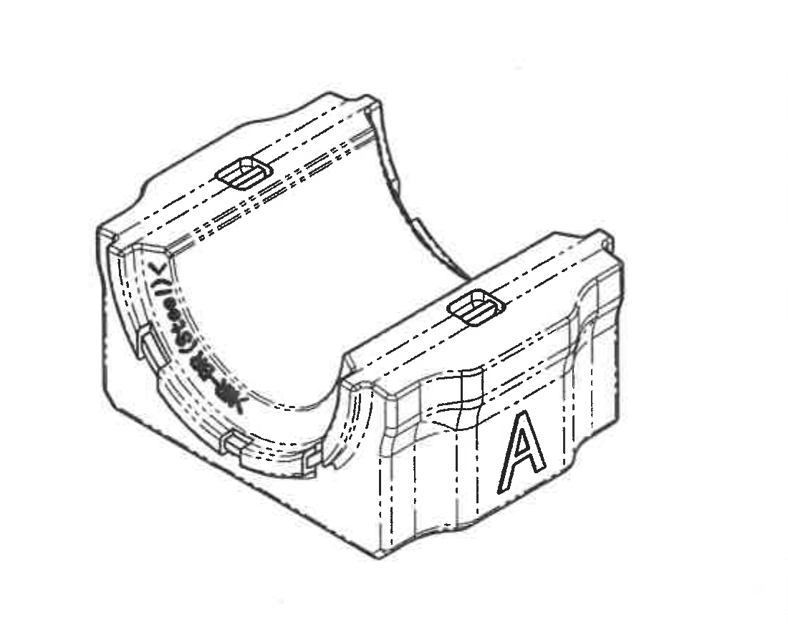

原图位置/视图名称：中下部 G-I 行、6-9 列附近；bbox `[1650, 1680, 1100, 880]`。

| 提取项 | 原图数值或文本 | 含义说明 |
|---|---|---|
| 视图类型 | 等轴测视图 | 表达三维外形，不给出新增尺寸。 |
| 可见标识 | A | 侧壁变型字母。 |
| 弧面标识 | 91993745 @ 类弧面文字 | 表示 Mubea 图号/产品标识位置。 |
| 结构特征 | 顶部凸台、侧壁轮廓、半圆内腔 | 用于理解零件形状，尺寸回看正交视图和参数表。 |

边界归属说明：该视图无独立数值尺寸；裁切仅包含等轴测零件图，不提取 NOTES 或标题栏字段。

## object_10 Specification 技术要求 / NOTES

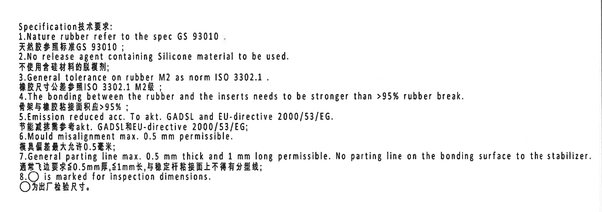

原图位置/视图名称：右中 G-I 行、10-16 列附近；bbox `[2690, 1690, 2070, 730]`。

| 提取项 | 原图数值或文本 | 含义说明 |
|---|---|---|
| 1 | Nature rubber refer to the spec GS 93010. / 天然胶参照标准 GS 93010 | 天然橡胶材料按 GS 93010。 |
| 2 | No release agent containing Silicone material to be used. / 不使用含硅材料的脱模剂 | 脱模剂限制。 |
| 3 | General tolerance on rubber M2 as norm ISO 3302.1. / 橡胶尺寸公差参照 ISO 3302.1 M2 级 | 橡胶通用公差引用 object_11。 |
| 4 | The bonding between the rubber and the inserts needs to be stronger than >95% rubber break. / 骨架与橡胶粘接面积应 >95% | 粘接强度/破坏模式要求。 |
| 5 | Emission reduced acc. To akt. GADSL and EU-directive 2000/53/EG. / 节能减排需参考 akt. GADSL 和 EU-directive 2000/53/EG | 法规/环保要求。 |
| 6 | Mould misalignment max. 0.5 mm permissible. / 模具偏差最大允许 0.5 毫米 | 错模允许值。 |
| 7 | General parting line max. 0.5 mm thick and 1 mm long permissible. No parting line on the bonding surface to the stabilizer. / 通常飞边要求≤0.5mm厚, ≤1mm长, 与稳定杆粘接面上不得有分型线 | 飞边/分型线要求。 |
| 8 | 带圈标记 is marked for inspection dimensions. / 为出厂检验尺寸 | 带圈尺寸为检验尺寸。 |

边界归属说明：NOTES 裁切完整包含 1-8 条英文/中文说明；下方 BOM 表未纳入本对象。

## object_11 DIN ISO 3302-1 M2 class 一般公差表

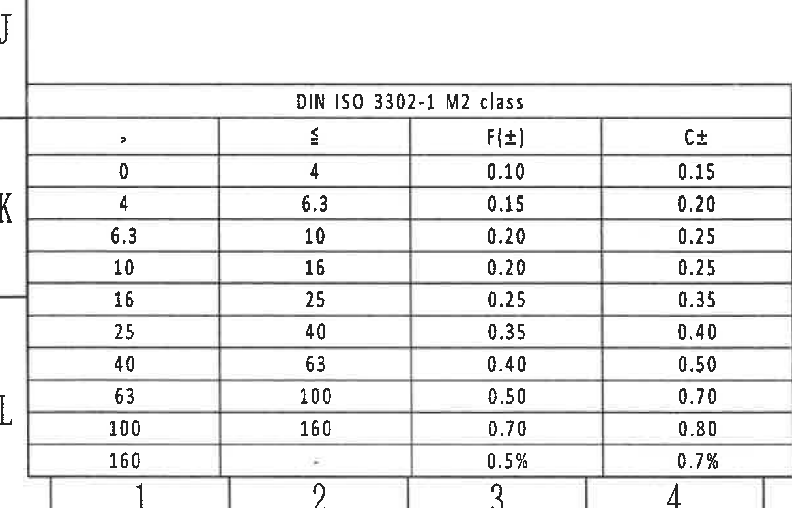

原图位置/视图名称：左下 J-L 行、1-5 列附近；bbox `[330, 2580, 1215, 780]`。

| > | ≤ | F(±) | C± |
|---|---|---|---|
| 0 | 4 | 0.10 | 0.15 |
| 4 | 6.3 | 0.15 | 0.20 |
| 6.3 | 10 | 0.20 | 0.25 |
| 10 | 16 | 0.20 | 0.25 |
| 16 | 25 | 0.25 | 0.35 |
| 25 | 40 | 0.35 | 0.40 |
| 40 | 63 | 0.40 | 0.50 |
| 63 | 100 | 0.50 | 0.70 |
| 100 | 160 | 0.70 | 0.80 |
| 160 | - | 0.5% | 0.7% |

| 提取项 | 原图数值或文本 | 含义说明 |
|---|---|---|
| 标准 | DIN ISO 3302-1 M2 class | 橡胶件尺寸一般公差等级。 |
| F/C | F(±), C± | 两类公差列，按尺寸范围取值。 |

边界归属说明：裁切包含完整表头和所有范围行；左侧图框行字母不是表格字段。

## object_12 Reference 参考标准列表

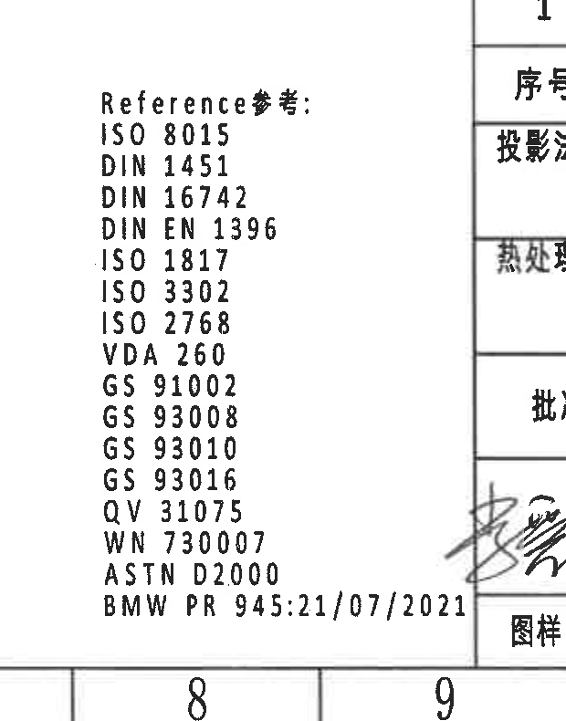

原图位置/视图名称：下部 K-L 行、8-9 列附近；bbox `[2240, 2580, 620, 790]`。

| 提取项 | 原图数值或文本 | 含义说明 |
|---|---|---|
| Reference | ISO 8015 | 参考标准。 |
| Reference | DIN 1451 | 参考标准。 |
| Reference | DIN 16742 | 参考标准。 |
| Reference | DIN EN 1396 | 参考标准。 |
| Reference | ISO 1817 | 参考标准。 |
| Reference | ISO 3302 | 参考标准。 |
| Reference | ISO 2768 | 参考标准。 |
| Reference | VDA 260 | 参考标准。 |
| Reference | GS 91002 | 参考标准。 |
| Reference | GS 93008 | 参考标准。 |
| Reference | GS 93010 | 参考标准。 |
| Reference | GS 93016 | 参考标准。 |
| Reference | QV 31075 | 参考标准。 |
| Reference | WN 730007 | 参考标准。 |
| Reference | ASTM D2000 | 参考标准。 |
| Reference | BMW PR 945:21/07/2021 | 参考标准/文件版本日期。 |

边界归属说明：底部 `BMW PR 945:21/07/2021` 较长，裁切右端接近标题栏边线；右侧标题栏片段不作为参考列表内容提取。

## object_13 BOM 明细表

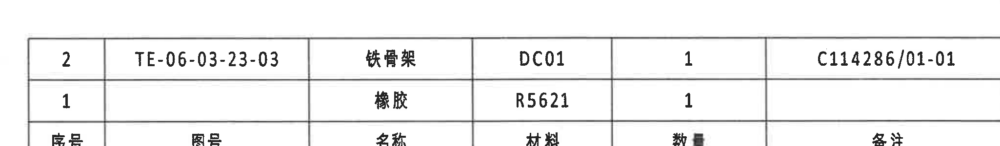

原图位置/视图名称：右下 J 行、10-16 列上方；bbox `[2700, 2380, 2050, 300]`。

| 序号 | 图号 | 名称 | 材料 | 数量 | 备注 |
|---|---|---|---|---|---|
| 2 | TE-06-03-23-03 | 铁骨架 | DC01 | 1 | C114286/01-01 |
| 1 |  | 橡胶 | R5621 | 1 |  |

| 提取项 | 原图数值或文本 | 含义说明 |
|---|---|---|
| 件号 1 | 橡胶 / R5621 / 数量 1 | 对应 A-A 剖视图中引线 1。 |
| 件号 2 | TE-06-03-23-03 / 铁骨架 / DC01 / 数量 1 / C114286/01-01 | 对应 A-A 剖视图中引线 2。 |

边界归属说明：裁切仅包含 BOM 表头和两行明细；下方标题栏为 object_14。

## object_14 标题栏 / title block

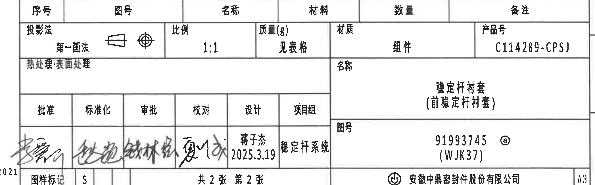

原图位置/视图名称：右下 K-L 行、10-16 列；bbox `[2690, 2635, 2095, 655]`。

| 提取项 | 原图数值或文本 | 含义说明 |
|---|---|---|
| 投影法 | 第一画法 | 第一角投影。 |
| 比例 | 1:1 | 图纸比例。 |
| 质量(g) | 见表格 | 重量见参数表。 |
| 材质 | 组件 | 装配/组件材质栏。 |
| 产品号 | C114289-CPSJ | 产品号。 |
| 名称 | 稳定杆衬套（前稳定杆衬套） | 零件名称。 |
| 图号 | 91993745 @ (WJK37) | 图号/标识。 |
| 设计 | 蒋子杰 2025.3.19 | 设计人员和日期。 |
| 项目组 | 稳定杆系统 | 项目组。 |
| 图样标记 | S | 图样标记字段。 |
| 张数 | 共 2 张 第 2 张 | 图纸页数信息。 |
| 公司 | 安徽中鼎密封件股份有限公司 | 公司名称。 |
| 图幅 | A3 | 图幅。 |

边界归属说明：标题栏裁切完整包含投影、比例、产品号、名称、图号、签审、公司和 A3 图幅；上方 BOM 明细不在本对象重复还原。

## 裁切检查记录

| 对象 | 检查结论 |
|---|---|
| page_1 | PDF 已渲染为整页 PNG，尺寸 4959 x 3505 px。 |
| object_1 | 完整包含修订履历表表头和两条记录；右侧变更者列未截断。 |
| object_2 | 完整包含参数/材料表各列和 A/B/C 三行；未提取下方视图文字。 |
| object_3 | 完整包含材料代码、ØE、(0.5)、49.5 和 55.5 尺寸线与文字。 |
| object_4 | 完整包含侧视图和 26.5±0.3；右缘相邻 `(B)` 片段仅作边界说明，不提取为本视图内容。 |
| object_5 | 完整包含 A-A 剖视、(35.41)、T1/T2、(B)、件号 1/2；相邻剖视不归属本对象。 |
| object_6 | 完整包含 B-B 剖视、稳定杆直径引出、(0.75)、(RIR)/(RAR)；文字跨界区域已说明归属。 |
| object_7 | 完整包含右上视图、A-A 剖切标识和 Mubea part number 引出；左侧 B-B 片段不提取为本对象内容。 |
| object_8 | 已重裁，完整包含 Time clock and cavity No.、ZD Logo、B-B 标识、41/45.6/51.5/57.5 尺寸线与文字。 |
| object_9 | 完整包含等轴测视图，无独立数值尺寸。 |
| object_10 | 完整包含 NOTES 1-8 条，中英文文字未截断。 |
| object_11 | 已扩展到底部，完整包含 DIN ISO 3302-1 M2 class 表格全部行，包括 160 以上百分比行。 |
| object_12 | 完整包含参考标准列表，包括 BMW PR 945:21/07/2021；右侧标题栏片段不作为参考内容。 |
| object_13 | 完整包含 BOM 表头和两行明细；未混入标题栏字段。 |
| object_14 | 完整包含标题栏主要字段、签审、公司名和 A3 图幅。 |
