# 20C114290.pdf 内容识别与裁切提取

## 整页渲染

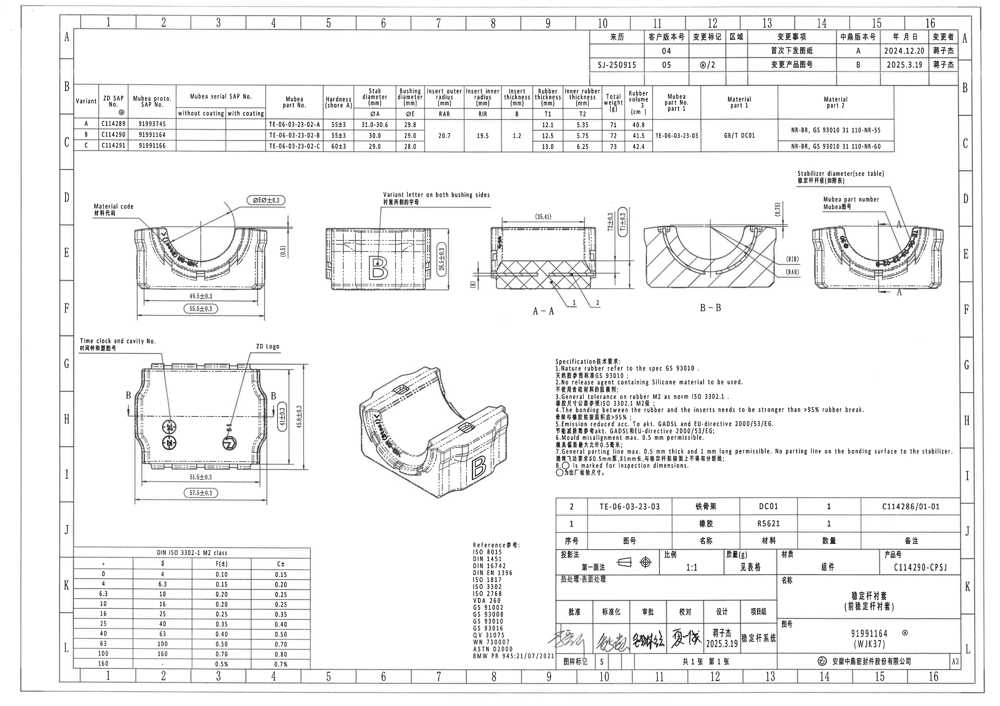

| 项目 | 值 |
|---|---|
| 原始文件 | input/20C114290.pdf |
| 页数 | 1 |
| 整页 PNG | outputs/20C114290_assets/images/page_1.png |
| PNG 尺寸 | 4959 x 3505 px |
| 图纸结构 | A3 工程图；顶部修订表和参数表；中部加工视图/剖面/局部视图；右中 NOTES；底部公差表、参考标准、BOM、标题栏 |

## object_1 - 右上修订履历表

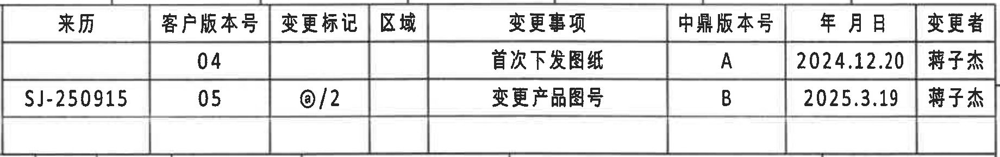

| 属性 | 内容 |
|---|---|
| 原图位置/视图名称 | 右上修订履历表，A-B 区、10-16 列 |
| object_kind | table |
| bbox | [2920, 140, 4760, 430] |

| 来历 | 客户版本号 | 变更标记 | 区域 | 变更事项 | 中鼎版本号 | 年 月 日 | 变更者 |
|---|---:|---|---|---|---|---|---|
|  | 04 |  |  | 首次下发图纸 | A | 2024.12.20 | 蒋子杰 |
| SJ-250915 | 05 | @/2 |  | 变更产品图号 | B | 2025.3.19 | 蒋子杰 |

| 提取项 | 原图数值或文本 | 含义说明 |
|---|---|---|
| 客户版本号 | 04 / 05 | 客户图纸版本记录 |
| 变更标记 | @/2 | 第二条修订的变更标记 |
| 变更事项 | 首次下发图纸；变更产品图号 | 修订原因 |
| 中鼎版本号 | A / B | 中鼎内部版本号 |
| 日期 | 2024.12.20；2025.3.19 | 修订发布日期 |
| 变更者 | 蒋子杰 | 两条修订记录的变更者 |

边界归属说明：裁切沿修订表外框，未提取下方参数表内容。

## object_2 - 顶部产品参数/变型表

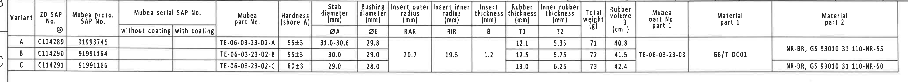

| 属性 | 内容 |
|---|---|
| 原图位置/视图名称 | 顶部产品参数/变型表，B-C 区、1-15 列 |
| object_kind | table |
| bbox | [330, 420, 4480, 800] |

| Variant | ZD SAP No. @ | Mubea proto. SAP No. | Mubea serial SAP No. without coating | Mubea serial SAP No. with coating | Mubea part No. | Hardness shore A | Stab diameter ØA | Bushing diameter ØE | Insert outer radius RAR | Insert inner radius RIR | Insert thickness B | Rubber thickness T1 | Inner rubber thickness T2 | Total weight (g) | Rubber volume (cm^3) | Mubea part No. part 1 | Material part 1 | Material part 2 |
|---|---|---|---|---|---|---|---|---|---|---|---|---|---|---:|---:|---|---|---|
| A | C114289 | 91993745 |  |  | TE-06-03-23-02-A | 55±3 | 31.0-30.6 | 29.8 | 20.7 | 19.5 | 1.2 | 12.1 | 5.35 | 71 | 40.8 | TE-06-03-23-03 | GB/T DC01 | NR-BR, GS 93010 31 110-NR-55 |
| B | C114290 | 91991164 |  |  | TE-06-03-23-02-B | 55±3 | 30.0 | 29.0 | 20.7 | 19.5 | 1.2 | 12.5 | 5.75 | 72 | 41.5 | TE-06-03-23-03 | GB/T DC01 | NR-BR, GS 93010 31 110-NR-55 |
| C | C114291 | 91991166 |  |  | TE-06-03-23-02-C | 60±3 | 29.0 | 28.0 | 20.7 | 19.5 | 1.2 | 13.0 | 6.25 | 73 | 42.4 | TE-06-03-23-03 | GB/T DC01 | NR-BR, GS 93010 31 110-NR-60 |

| 提取项 | 原图数值或文本 | 含义说明 |
|---|---|---|
| Variant | A / B / C | 三个变型行 |
| ZD SAP No. @ | C114289 / C114290 / C114291 | ZD SAP 编号；当前图标题栏产品号对应 B 行 C114290 |
| Mubea proto. SAP No. | 91993745 / 91991164 / 91991166 | Mubea 原型 SAP 编号 |
| Mubea part No. | TE-06-03-23-02-A / -B / -C | 各变型零件号 |
| Hardness shore A | 55±3；60±3 | 橡胶硬度 |
| Stab diameter ØA | 31.0-30.6；30.0；29.0 | 稳定杆直径，右上局部视图引用“see table” |
| Bushing diameter ØE | 29.8；29.0；28.0 | 衬套直径，左上前视图 `ØEر0.3` 引用 |
| RAR / RIR | 20.7 / 19.5 | 嵌件外/内半径，B-B 剖面引用 `(RAR)`、`(RIR)` |
| B | 1.2 | 嵌件厚度，A-A 剖面引用 `(B)` |
| T1 / T2 | 12.1/5.35；12.5/5.75；13.0/6.25 | 橡胶厚度和内橡胶厚度；A-A 引用 `(T1±0.3)` |
| Total weight / Rubber volume | 71/40.8；72/41.5；73/42.4 | 总重量和橡胶体积 |
| Material part 1 / part 2 | GB/T DC01；NR-BR, GS 93010 31 110-NR-55/-60 | 金属骨架材料和橡胶材料 |

边界归属说明：本对象只提取顶部参数表。RAR/RIR/B、Mubea part No. part 1、Material part 1 为合并单元格；Material part 2 中 NR-55 覆盖 A/B 行，NR-60 位于 C 行。

## object_3 - 左上前视图：材料代码与前向尺寸

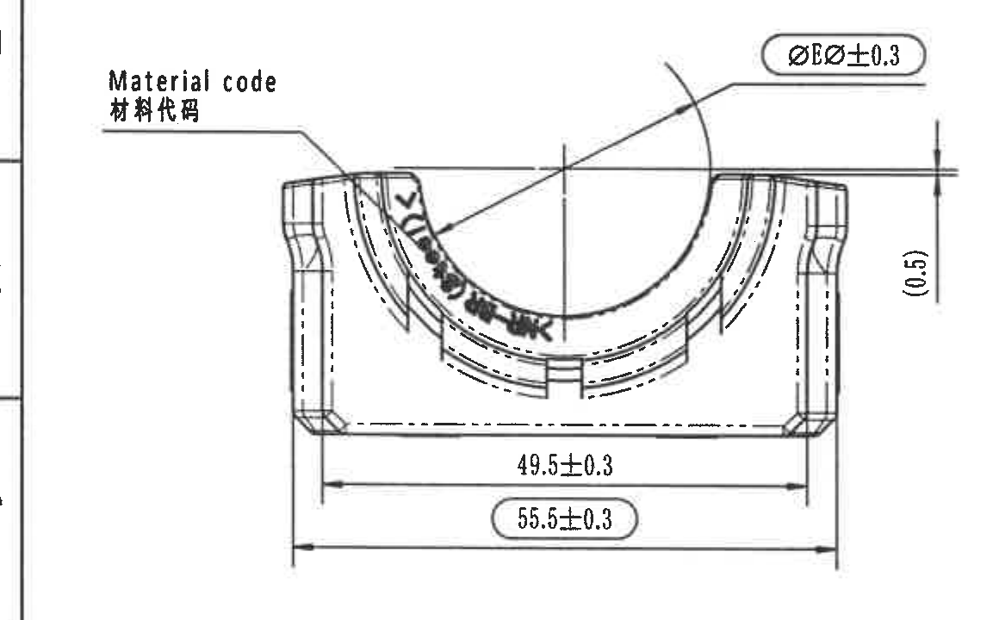

| 属性 | 内容 |
|---|---|
| 原图位置/视图名称 | 左上前视图，D-F 区、2-5 列 |
| object_kind | view |
| bbox | [340, 930, 1500, 1650] |

| 提取项 | 原图数值或文本 | 含义说明 |
|---|---|---|
| 标注 | Material code / 材料代码 | 引线指向零件内弧面上的材料代码标记 |
| 直径/表引用尺寸 | ØEر0.3 | 以顶部表 `Bushing diameter ØE` 为基础的直径控制尺寸，附 ±0.3 公差；按变型 A/B/C 对应 ØE=29.8/29.0/28.0 |
| 参考尺寸 | (0.5) | 括号内参考尺寸，位于右侧竖向尺寸线，说明边缘/台阶关系，不作为独立制造主控尺寸 |
| 宽度尺寸 | 49.5±0.3 | 内侧/功能宽度尺寸 |
| 检验尺寸 | 55.5±0.3 | 外侧总宽度，圆角框表示 NOTES 第 8 条定义的出厂检验尺寸 |

边界归属说明：裁切保留完整尺寸线、箭头和标注文字；左侧可见页面图框边缘，不作为视图内容。

## object_4 - 中上侧视图：B 字母与侧面高度

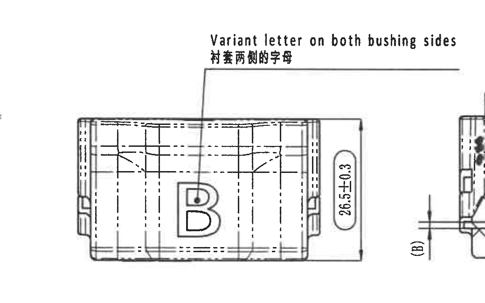

| 属性 | 内容 |
|---|---|
| 原图位置/视图名称 | 中上侧视图，D-F 区、5-8 列 |
| object_kind | view |
| bbox | [1450, 880, 2490, 1530] |

| 提取项 | 原图数值或文本 | 含义说明 |
|---|---|---|
| 标注 | Variant letter on both bushing sides / 衬套两侧的字母 | 引线指向侧面字母 B，说明两侧衬套均需有变型字母 |
| 高度/厚度尺寸 | 26.5±0.3 | 侧视方向外形高度/厚度尺寸 |

边界归属说明：为保证英文和中文引线完整，右侧带入 A-A 视图左边缘和 `(B)` 残片；这些残片归 object_5，不提取为本视图尺寸。

## object_5 - 剖面 A-A

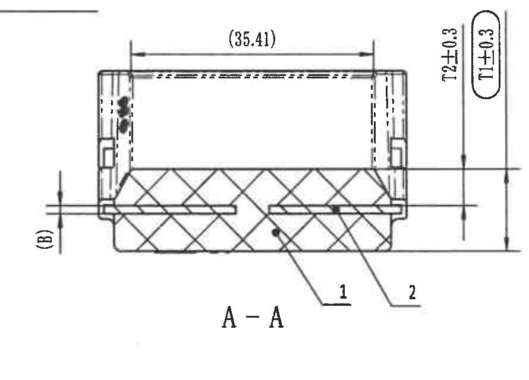

| 属性 | 内容 |
|---|---|
| 原图位置/视图名称 | 剖面 A-A，D-F 区、8-10 列 |
| object_kind | section |
| bbox | [2270, 1010, 3160, 1650] |

| 提取项 | 原图数值或文本 | 含义说明 |
|---|---|---|
| 参考尺寸 | (35.41) | 括号参考宽度，位于剖面顶部，不作为主控制造尺寸 |
| 高度尺寸 | 72±0.3 | A-A 剖面外形高度/竖向控制尺寸 |
| 表引用参考尺寸 | (T1±0.3) | 引用顶部参数表 Rubber thickness T1，并附 ±0.3；括号表示参考/检验引用性质 |
| 表引用参考尺寸 | (B) | 引用顶部参数表 Insert thickness B=1.2，表示嵌件厚度位置 |
| 零件序号 | 1 | 引线指向橡胶，对应 BOM 序号 1 |
| 零件序号 | 2 | 引线指向铁骨架/嵌件，对应 BOM 序号 2 |

边界归属说明：裁切排除了 B-B 剖视主体，保留 A-A 自身尺寸线、箭头、剖面标题和零件序号。

## object_6 - 剖面 B-B

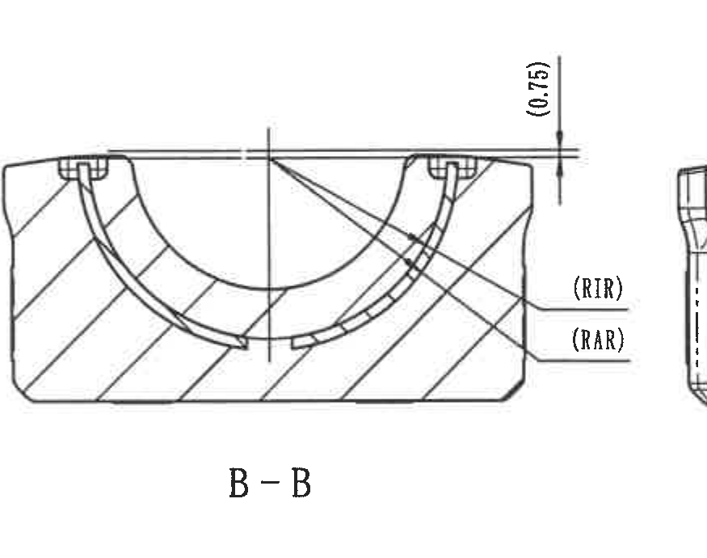

| 属性 | 内容 |
|---|---|
| 原图位置/视图名称 | 剖面 B-B，D-F 区、11-13 列 |
| object_kind | section |
| bbox | [3190, 930, 4065, 1620] |

| 提取项 | 原图数值或文本 | 含义说明 |
|---|---|---|
| 参考尺寸 | (0.75) | 括号参考高度/间隙尺寸，位于剖面上方右侧 |
| 弧度/半径引用 | (RIR) | 引用顶部表 Insert inner radius RIR=19.5，表示内嵌件弧半径 |
| 弧度/半径引用 | (RAR) | 引用顶部表 Insert outer radius RAR=20.7，表示外嵌件弧半径 |
| 剖面标识 | B-B | 下方主视图 B-B 剖切线对应的剖视图 |

边界归属说明：为完整保留 RIR/RAR 引线和文字，右侧可见右上局部视图窄边残片；该残片归 object_7，不提取为 B-B 内容。

## object_7 - 右上局部前视图：稳定杆直径与 Mubea 编号

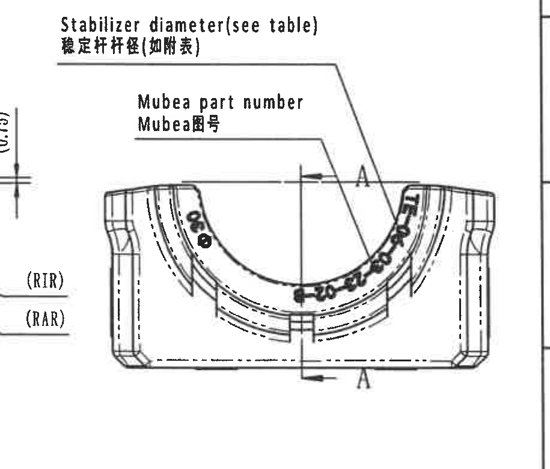

| 属性 | 内容 |
|---|---|
| 原图位置/视图名称 | 右上局部前视图，D-F 区、13-16 列 |
| object_kind | detail |
| bbox | [3855, 820, 4770, 1600] |

| 提取项 | 原图数值或文本 | 含义说明 |
|---|---|---|
| 表引用标注 | Stabilizer diameter (see table) / 稳定杆杆径(如附表) | 引线指向内弧开口，引用顶部参数表 Stab diameter ØA |
| 图号标注 | Mubea part number / Mubea图号 | 引线指向内弧面上的 Mubea 零件号标记 |
| 剖切标记 | A-A 标记 A | 表示 A-A 剖面切割位置，与 object_5 对应 |

边界归属说明：为保持两条引线文字完整，左侧带入 B-B 的 `(RIR)/(RAR)` 残片；这些尺寸归 object_6，本对象只提取局部视图自身引线和 A-A 标记。

## object_8 - 左下俯视/主视图：时间钟、型腔号、ZD Logo 与总体尺寸

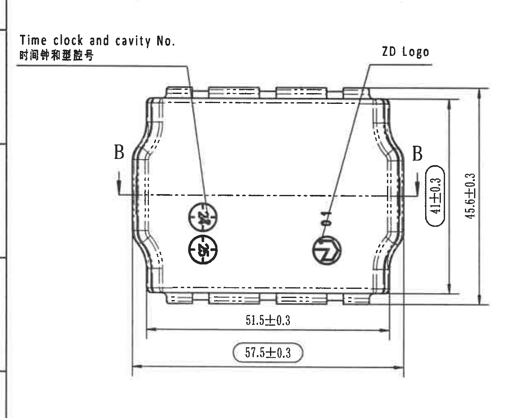

| 属性 | 内容 |
|---|---|
| 原图位置/视图名称 | 左下俯视/主视图，G-I 区、1-5 列 |
| object_kind | view |
| bbox | [350, 1595, 1570, 2605] |

| 提取项 | 原图数值或文本 | 含义说明 |
|---|---|---|
| 标注 | Time clock and cavity No. / 时间钟和型腔号 | 引线指向零件表面圆形时间钟和型腔号标记 |
| 标注 | ZD Logo | 引线指向 ZD 标识 |
| 剖切标记 | B-B | 定义 object_6 剖面位置 |
| 高度尺寸 | 41±0.3 | 内侧功能高度 |
| 总高度 | 45.6±0.3 | 外侧总高度 |
| 宽度尺寸 | 51.5±0.3 | 内侧宽度 |
| 检验尺寸 | 57.5±0.3 | 外侧总宽度，圆角框表示出厂检验尺寸 |

边界归属说明：裁切包含完整尺寸线和箭头；左侧仅有页面图框边缘。

## object_9 - 中下轴测视图

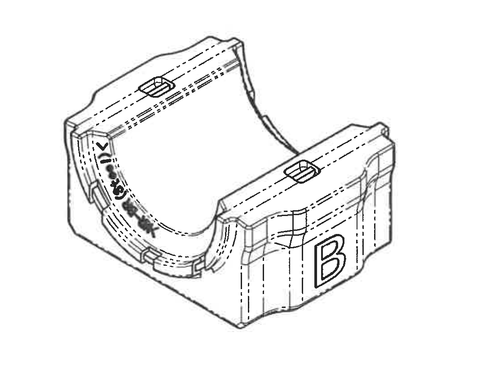

| 属性 | 内容 |
|---|---|
| 原图位置/视图名称 | 中下轴测视图，G-I 区、5-9 列 |
| object_kind | view |
| bbox | [1640, 1740, 2720, 2590] |

| 提取项 | 原图数值或文本 | 含义说明 |
|---|---|---|
| 三维外形 | 轴测图 | 显示内弧面、侧面 B 字母、上部凸台/孔位和材料代码标记位置 |
| 尺寸 | 未标注独立尺寸 | 本视图没有尺寸、角度或公差标注 |

边界归属说明：裁切只包含轴测视图本体，未带入 NOTES 或左下主视图尺寸。

## object_10 - Specification 技术要求 / NOTES

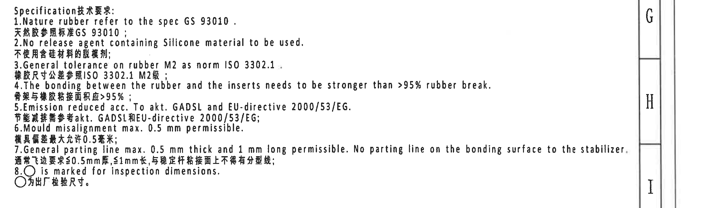

| 属性 | 内容 |
|---|---|
| 原图位置/视图名称 | NOTES，G-I 区、9-16 列 |
| object_kind | notes |
| bbox | [2710, 1760, 4959, 2430] |

| 序号 | 原图文本 | 中文/含义说明 |
|---:|---|---|
| 1 | Nature rubber refer to the spec GS 93010. | 天然胶参照标准 GS 93010 |
| 2 | No release agent containing Silicone material to be used. | 不使用含硅材料的脱模剂 |
| 3 | General tolerance on rubber M2 as norm ISO 3302.1. | 橡胶尺寸公差参照 ISO 3302.1 M2 级 |
| 4 | The bonding between the rubber and the inserts needs to be stronger than >95% rubber break. | 骨架与橡胶粘接面积应 >95% |
| 5 | Emission reduced acc. To akt. GADSL and EU-directive 2000/53/EG. | 节能减排需参考 akt. GADSL 和 EU-directive 2000/53/EG |
| 6 | Mould misalignment max. 0.5 mm permissible. | 模具偏差最大允许 0.5 mm |
| 7 | General parting line max. 0.5 mm thick and 1 mm long permissible. No parting line on the bonding surface to the stabilizer. | 通常飞边要求 ≤0.5mm 厚、≤1mm 长；与稳定杆粘接面上不得有分型线 |
| 8 | ○ is marked for inspection dimensions. | 圆框标记为出厂检验尺寸 |

边界归属说明：右侧含页面坐标边框 G/H/I，不属于 NOTES 文本；NOTES 文本完整。

## object_11 - DIN ISO 3302-1 M2 class 公差表

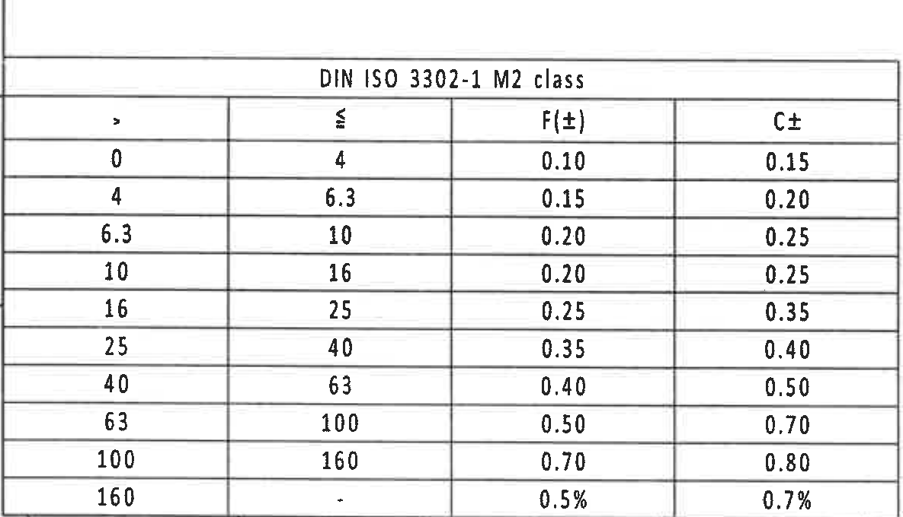

| 属性 | 内容 |
|---|---|
| 原图位置/视图名称 | 左下公差表，J-L 区、1-4 列 |
| object_kind | table |
| bbox | [360, 2640, 1545, 3320] |

| DIN ISO 3302-1 M2 class |  |  |  |
|---:|---:|---:|---:|
| > | ≤ | F(±) | C± |
| 0 | 4 | 0.10 | 0.15 |
| 4 | 6.3 | 0.15 | 0.20 |
| 6.3 | 10 | 0.20 | 0.25 |
| 10 | 16 | 0.20 | 0.25 |
| 16 | 25 | 0.25 | 0.35 |
| 25 | 40 | 0.35 | 0.40 |
| 40 | 63 | 0.40 | 0.50 |
| 63 | 100 | 0.50 | 0.70 |
| 100 | 160 | 0.70 | 0.80 |
| 160 | - | 0.5% | 0.7% |

| 提取项 | 原图数值或文本 | 含义说明 |
|---|---|---|
| 标准 | DIN ISO 3302-1 M2 class | 橡胶件一般公差表，和 NOTES 第 3 条一致 |
| F(±) / C± | 见上表 | 不同尺寸区间对应的 F、C 公差 |

边界归属说明：裁切沿表格外框，左侧可见轻微图框线，不作为公差表字段。

## object_12 - Reference 参考标准列表

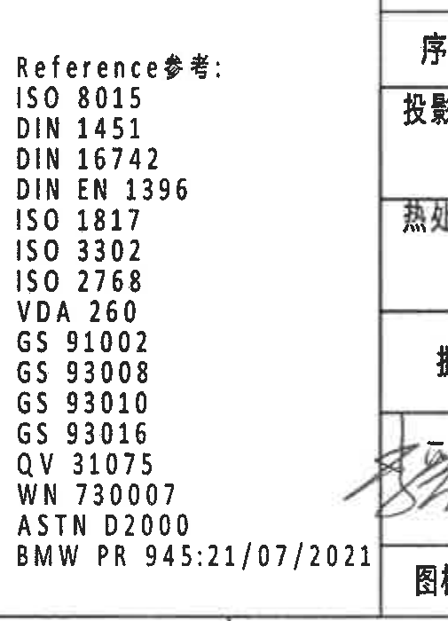

| 属性 | 内容 |
|---|---|
| 原图位置/视图名称 | Reference 参考列表，J-L 区、8-10 列 |
| object_kind | notes |
| bbox | [2328, 2630, 2833, 3330] |

| 提取项 | 原图数值或文本 | 含义说明 |
|---|---|---|
| Reference | ISO 8015 | 参考标准 |
| Reference | DIN 1451 | 参考标准 |
| Reference | DIN 16742 | 参考标准 |
| Reference | DIN EN 1396 | 参考标准 |
| Reference | ISO 1817 | 参考标准 |
| Reference | ISO 3302 | 参考标准 |
| Reference | ISO 2768 | 参考标准 |
| Reference | VDA 260 | 参考标准 |
| Reference | GS 91002 | 参考标准 |
| Reference | GS 93008 | 参考标准 |
| Reference | GS 93010 | 参考标准 |
| Reference | GS 93016 | 参考标准 |
| Reference | QV 31075 | 参考标准 |
| Reference | WN 730007 | 参考标准 |
| Reference | ASTN D2000 | 参考标准 |
| Reference | BMW PR 945:21/07/2021 | 参考标准/规范编号 |

边界归属说明：右侧可见标题栏边界和少量表格碎片；只提取左侧 Reference 列表。

## object_13 - 明细/BOM 表

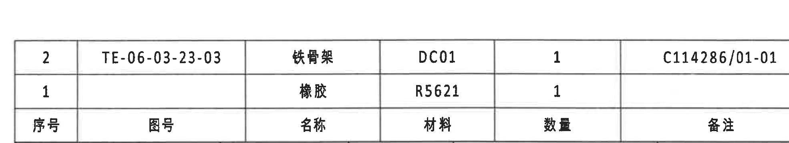

| 属性 | 内容 |
|---|---|
| 原图位置/视图名称 | 右下 BOM 表，I-J 区、9-16 列 |
| object_kind | table |
| bbox | [2720, 2370, 4690, 2730] |

| 序号 | 图号 | 名称 | 材料 | 数量 | 备注 |
|---:|---|---|---|---:|---|
| 2 | TE-06-03-23-03 | 铁骨架 | DC01 | 1 | C114286/01-01 |
| 1 |  | 橡胶 | R5621 | 1 |  |

| 提取项 | 原图数值或文本 | 含义说明 |
|---|---|---|
| 序号 1 | 橡胶 / R5621 / 数量 1 | 与 A-A 剖面序号 1 对应 |
| 序号 2 | TE-06-03-23-03 / 铁骨架 / DC01 / 数量 1 / C114286/01-01 | 与 A-A 剖面序号 2 对应 |

边界归属说明：裁切只包含 BOM 明细和表头，未提取下方标题栏字段。

## object_14 - 底部标题栏

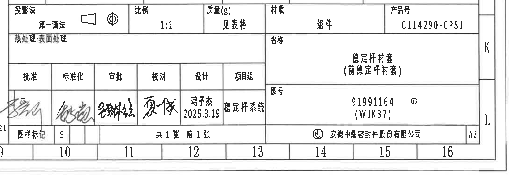

| 属性 | 内容 |
|---|---|
| 原图位置/视图名称 | 底部标题栏，J-L 区、9-16 列 |
| object_kind | title_block |
| bbox | [2720, 2710, 4910, 3470] |

| 字段 | 原图数值或文本 | 含义说明 |
|---|---|---|
| 投影法 | 第一画法 | 投影方式 |
| 比例 | 1:1 | 绘图比例 |
| 质量(g) | 见表格 | 质量引用顶部参数表 Total weight |
| 材质 | 组件 | 总成材质类别 |
| 产品号 | C114290-CPSJ | 产品编号 |
| 热处理/表面处理 | 空 | 未填写 |
| 名称 | 稳定杆衬套（前稳定杆衬套） | 零件/组件名称 |
| 图号 | 91991164 @ (WJK37) | 图纸编号/标识 |
| 批准 | 签名 | 签核栏 |
| 标准化 | 签名 | 签核栏 |
| 审批 | 签名 | 签核栏 |
| 校对 | 签名 | 签核栏 |
| 设计 | 蒋子杰 2025.3.19 | 设计者和日期 |
| 项目组 | 稳定杆系统 | 所属项目组 |
| 图样标记 | S | 图样标记 |
| 页数 | 共1张 第1张 | 图纸页数 |
| 公司 | 安徽中鼎密封件股份有限公司 | 出图单位 |
| 幅面 | A3 | 图纸幅面 |

边界归属说明：底部可见页面坐标数字 10-16 和图框线，不作为标题栏字段；上方 BOM 已单独作为 object_13。

## 裁切检查记录

| object_id | 图片路径 | 检查结果 | 边界/归属记录 |
|---|---|---|---|
| page_1 | outputs/20C114290_assets/images/page_1.png | 完整 | 整页渲染，4959 x 3505 px |
| object_1 | outputs/20C114290_assets/images/object_1.png | 完整 | 修订表列标题和两条记录完整；未提取下方参数表 |
| object_2 | outputs/20C114290_assets/images/object_2.png | 完整 | 参数表所有列、三行和合并单元格完整 |
| object_3 | outputs/20C114290_assets/images/object_3.png | 完整 | 主前视图尺寸线、箭头、直径框、参考尺寸和材料代码引线完整；左侧图框线不提取 |
| object_4 | outputs/20C114290_assets/images/object_4.png | 完整 | 引线文字和 26.5±0.3 完整；右侧 A-A 残片归 object_5 |
| object_5 | outputs/20C114290_assets/images/object_5.png | 完整 | A-A 尺寸、参考尺寸、T1/B 引用和序号 1/2 完整 |
| object_6 | outputs/20C114290_assets/images/object_6.png | 完整 | B-B、(0.75)、(RIR)、(RAR) 完整；右侧窄残片归 object_7 |
| object_7 | outputs/20C114290_assets/images/object_7.png | 完整 | 两条引线文字和 A-A 标记完整；左侧 RIR/RAR 残片归 object_6 |
| object_8 | outputs/20C114290_assets/images/object_8.png | 完整 | 主视图尺寸线、箭头、B-B 剖切标记和标识引线完整 |
| object_9 | outputs/20C114290_assets/images/object_9.png | 完整 | 轴测图完整，无独立尺寸标注 |
| object_10 | outputs/20C114290_assets/images/object_10.png | 完整 | NOTES 第 1-8 条完整；右侧页面坐标边框不提取 |
| object_11 | outputs/20C114290_assets/images/object_11.png | 完整 | 公差表标题、表头和全部区间行完整；左侧轻微图框线不提取 |
| object_12 | outputs/20C114290_assets/images/object_12.png | 完整 | Reference 列表完整；右侧标题栏碎片不提取 |
| object_13 | outputs/20C114290_assets/images/object_13.png | 完整 | BOM 表头和两条物料行完整；下方标题栏不提取 |
| object_14 | outputs/20C114290_assets/images/object_14.png | 完整 | 标题栏主要字段、签核栏、产品号、图号、公司和 A3 完整；底部坐标格不提取 |
